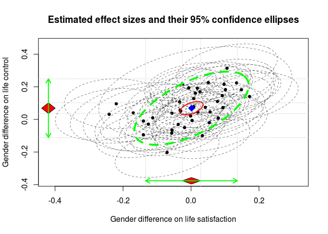

Fitting a multivariate random-effects model
===========================================

    ## Load the metaSEM library for the multivariate meta-analysis
    ## See http://courses.nus.edu.sg/course/psycwlm/internet/metaSEM/
    library(metaSEM)
      
    ## Random-effects model. 
    ## y: effect sizes; 
    ## v: known sampling covariance matrices
    random.ma1 <- meta(y=cbind(lifesat, lifecon),
                       v=cbind(lifesat_var, inter_cov, lifecon_var), data=wvs94a,
                       model.name="Random effects model")

    summary(random.ma1)

    ## 
    ## Call:
    ## meta(y = cbind(lifesat, lifecon), v = cbind(lifesat_var, inter_cov, 
    ##     lifecon_var), data = wvs94a, model.name = "Random effects model")
    ## 
    ## 95% confidence intervals: z statistic approximation
    ## Coefficients:
    ##               Estimate   Std.Error      lbound      ubound z value
    ## Intercept1  0.00134985  0.01385628 -0.02580796  0.02850767  0.0974
    ## Intercept2  0.06882575  0.01681962  0.03585990  0.10179160  4.0920
    ## Tau2_1_1    0.00472726  0.00176156  0.00127465  0.00817986  2.6836
    ## Tau2_2_1    0.00393437  0.00168706  0.00062779  0.00724094  2.3321
    ## Tau2_2_2    0.00841361  0.00253727  0.00344064  0.01338657  3.3160
    ##             Pr(>|z|)    
    ## Intercept1 0.9223943    
    ## Intercept2 4.277e-05 ***
    ## Tau2_1_1   0.0072844 ** 
    ## Tau2_2_1   0.0196962 *  
    ## Tau2_2_2   0.0009131 ***
    ## ---
    ## Signif. codes:  0 '***' 0.001 '**' 0.01 '*' 0.05 '.' 0.1 ' ' 1
    ## 
    ## Q statistic on the homogeneity of effect sizes: 250.0303
    ## Degrees of freedom of the Q statistic: 82
    ## P value of the Q statistic: 0
    ## 
    ## Heterogeneity indices (based on the estimated Tau2):
    ##                              Estimate
    ## Intercept1: I2 (Q statistic)   0.6129
    ## Intercept2: I2 (Q statistic)   0.7345
    ## 
    ## Number of studies (or clusters): 42
    ## Number of observed statistics: 84
    ## Number of estimated parameters: 5
    ## Degrees of freedom: 79
    ## -2 log likelihood: -161.9216 
    ## OpenMx status1: 0 ("0" or "1": The optimization is considered fine.
    ## Other values may indicate problems.)

    ## Estimating correlation between random effects

    cov2cor(vec2symMat(coef(random.ma1, select="random")))

    ##           [,1]      [,2]
    ## [1,] 1.0000000 0.6238485
    ## [2,] 0.6238485 1.0000000

    ## Testing the null hypothesis of both population effect sizes are zero
    random.ma2 <- meta(y=cbind(lifesat, lifecon),
                       v=cbind(lifesat_var, inter_cov, lifecon_var), data=wvs94a,
                       intercept.constraints=matrix(0, nrow=1, ncol=2),
                       model.name="Effect sizes are fixed at 0")
      
    summary(random.ma2)

    ## 
    ## Call:
    ## meta(y = cbind(lifesat, lifecon), v = cbind(lifesat_var, inter_cov, 
    ##     lifecon_var), data = wvs94a, intercept.constraints = matrix(0, 
    ##     nrow = 1, ncol = 2), model.name = "Effect sizes are fixed at 0")
    ## 
    ## 95% confidence intervals: z statistic approximation
    ## Coefficients:
    ##            Estimate  Std.Error     lbound     ubound z value  Pr(>|z|)    
    ## Tau2_1_1 0.00463198 0.00174390 0.00121400 0.00804996  2.6561 0.0079050 ** 
    ## Tau2_2_1 0.00413061 0.00192233 0.00036292 0.00789830  2.1488 0.0316538 *  
    ## Tau2_2_2 0.01308267 0.00355438 0.00611620 0.02004913  3.6807 0.0002326 ***
    ## ---
    ## Signif. codes:  0 '***' 0.001 '**' 0.01 '*' 0.05 '.' 0.1 ' ' 1
    ## 
    ## Q statistic on the homogeneity of effect sizes: 250.0303
    ## Degrees of freedom of the Q statistic: 82
    ## P value of the Q statistic: 0
    ## 
    ## Heterogeneity indices (based on the estimated Tau2):
    ##                              Estimate
    ## Intercept1: I2 (Q statistic)   0.6080
    ## Intercept2: I2 (Q statistic)   0.8114
    ## 
    ## Number of studies (or clusters): 42
    ## Number of observed statistics: 84
    ## Number of estimated parameters: 3
    ## Degrees of freedom: 81
    ## -2 log likelihood: -143.4727 
    ## OpenMx status1: 0 ("0" or "1": The optimization is considered fine.
    ## Other values may indicate problems.)

    ##  Conducting a likelihood ratio test between these two nested models
    anova(random.ma1, random.ma2) 

    ##                   base                  comparison ep  minus2LL df
    ## 1 Random effects model                        <NA>  5 -161.9216 79
    ## 2 Random effects model Effect sizes are fixed at 0  3 -143.4727 81
    ##         AIC   diffLL diffdf            p
    ## 1 -319.9216       NA     NA           NA
    ## 2 -305.4727 18.44885      2 9.860162e-05

Fitting a multivariate fixed-effects model
==========================================

    ## Fix the variance component at 0 by using
    ## RE.constraints=matrix(0, ncol=2, nrow=2)
    fixed.ma <- meta(y=cbind(lifesat, lifecon),
                     v=cbind(lifesat_var, inter_cov, lifecon_var), data=wvs94a,
                     RE.constraints=matrix(0, ncol=2, nrow=2),
                     model.name="Fixed effects model")
      
    summary(fixed.ma)

    ## 
    ## Call:
    ## meta(y = cbind(lifesat, lifecon), v = cbind(lifesat_var, inter_cov, 
    ##     lifecon_var), data = wvs94a, RE.constraints = matrix(0, ncol = 2, 
    ##     nrow = 2), model.name = "Fixed effects model")
    ## 
    ## 95% confidence intervals: z statistic approximation
    ## Coefficients:
    ##              Estimate  Std.Error     lbound     ubound z value Pr(>|z|)
    ## Intercept1  0.0096622  0.0083608 -0.0067247  0.0260490  1.1557   0.2478
    ## Intercept2  0.0708000  0.0084366  0.0542646  0.0873354  8.3920   <2e-16
    ##               
    ## Intercept1    
    ## Intercept2 ***
    ## ---
    ## Signif. codes:  0 '***' 0.001 '**' 0.01 '*' 0.05 '.' 0.1 ' ' 1
    ## 
    ## Q statistic on the homogeneity of effect sizes: 250.0303
    ## Degrees of freedom of the Q statistic: 82
    ## P value of the Q statistic: 0
    ## 
    ## Heterogeneity indices (based on the estimated Tau2):
    ##                              Estimate
    ## Intercept1: I2 (Q statistic)        0
    ## Intercept2: I2 (Q statistic)        0
    ## 
    ## Number of studies (or clusters): 42
    ## Number of observed statistics: 84
    ## Number of estimated parameters: 2
    ## Degrees of freedom: 82
    ## -2 log likelihood: -81.30625 
    ## OpenMx status1: 0 ("0" or "1": The optimization is considered fine.
    ## Other values may indicate problems.)

Fitting a multivariate mixed-effects model
==========================================

    ## x: predictors
    ## gnp is divided by 10000 and centered by using 
    ## scale(gnp/10000, scale=FALSE)
    mixed.ma1 <- meta(y=cbind(lifesat, lifecon),
                      v=cbind(lifesat_var, inter_cov, lifecon_var),
                      x=scale(gnp/10000, scale=FALSE), data=wvs94a,
                      model.name="GNP as a predictor")
      
    summary(mixed.ma1)

    ## 
    ## Call:
    ## meta(y = cbind(lifesat, lifecon), v = cbind(lifesat_var, inter_cov, 
    ##     lifecon_var), x = scale(gnp/10000, scale = FALSE), data = wvs94a, 
    ##     model.name = "GNP as a predictor")
    ## 
    ## 95% confidence intervals: z statistic approximation
    ## Coefficients:
    ##               Estimate   Std.Error      lbound      ubound z value
    ## Intercept1  0.00129981  0.01457483 -0.02726634  0.02986596  0.0892
    ## Intercept2  0.07059120  0.01713638  0.03700450  0.10417789  4.1194
    ## Slope1_1   -0.02405128  0.01530535 -0.05404921  0.00594665 -1.5714
    ## Slope2_1   -0.03720440  0.01794815 -0.07238213 -0.00202666 -2.0729
    ## Tau2_1_1    0.00459976  0.00179776  0.00107621  0.00812331  2.5586
    ## Tau2_2_1    0.00359160  0.00168075  0.00029738  0.00688582  2.1369
    ## Tau2_2_2    0.00747895  0.00247139  0.00263510  0.01232279  3.0262
    ##             Pr(>|z|)    
    ## Intercept1  0.928938    
    ## Intercept2 3.799e-05 ***
    ## Slope1_1    0.116083    
    ## Slope2_1    0.038183 *  
    ## Tau2_1_1    0.010509 *  
    ## Tau2_2_1    0.032606 *  
    ## Tau2_2_2    0.002476 ** 
    ## ---
    ## Signif. codes:  0 '***' 0.001 '**' 0.01 '*' 0.05 '.' 0.1 ' ' 1
    ## 
    ## Q statistic on the homogeneity of effect sizes: 228.2571
    ## Degrees of freedom of the Q statistic: 72
    ## P value of the Q statistic: 0
    ## 
    ## Explained variances (R2):
    ##                               y1     y2
    ## Tau2 (no predictor)    0.0047273 0.0084
    ## Tau2 (with predictors) 0.0045998 0.0075
    ## R2                     0.0269705 0.1111
    ## 
    ## Number of studies (or clusters): 37
    ## Number of observed statistics: 74
    ## Number of estimated parameters: 7
    ## Degrees of freedom: 67
    ## -2 log likelihood: -146.9027 
    ## OpenMx status1: 0 ("0" or "1": The optimization is considered fine.
    ## Other values may indicate problems.)

Fitting a mixed-effects model with an equality constraint on the regression coefficients
========================================================================================

    ## Fix the coefficients by using
    ## coef.constraints=matrix(c("0.0*Eq_slope", "0.0*Eq_slope"), nrow=2)
    mixed.ma2 <- meta(y=cbind(lifesat, lifecon),
                      v=cbind(lifesat_var, inter_cov, lifecon_var),
                      x=scale(gnp/10000, scale=FALSE), data=wvs94a,
                      coef.constraints=matrix(c("0.0*Eq_slope",
                                                "0.0*Eq_slope"), nrow=2),
                      model.name="GNP as a predictor with equal slope")
      
    summary(mixed.ma2)

    ## 
    ## Call:
    ## meta(y = cbind(lifesat, lifecon), v = cbind(lifesat_var, inter_cov, 
    ##     lifecon_var), x = scale(gnp/10000, scale = FALSE), data = wvs94a, 
    ##     coef.constraints = matrix(c("0.0*Eq_slope", "0.0*Eq_slope"), 
    ##         nrow = 2), model.name = "GNP as a predictor with equal slope")
    ## 
    ## 95% confidence intervals: z statistic approximation
    ## Coefficients:
    ##               Estimate   Std.Error      lbound      ubound z value
    ## Intercept1  0.00118027  0.01463504 -0.02750388  0.02986441  0.0806
    ## Intercept2  0.07073107  0.01719693  0.03702571  0.10443642  4.1130
    ## Eq_slope   -0.02858288  0.01439634 -0.05679918 -0.00036657 -1.9854
    ## Tau2_1_1    0.00466116  0.00181445  0.00110490  0.00821741  2.5689
    ## Tau2_2_1    0.00353285  0.00168633  0.00022770  0.00683800  2.0950
    ## Tau2_2_2    0.00755446  0.00249992  0.00265469  0.01245422  3.0219
    ##             Pr(>|z|)    
    ## Intercept1  0.935723    
    ## Intercept2 3.905e-05 ***
    ## Eq_slope    0.047097 *  
    ## Tau2_1_1    0.010202 *  
    ## Tau2_2_1    0.036172 *  
    ## Tau2_2_2    0.002512 ** 
    ## ---
    ## Signif. codes:  0 '***' 0.001 '**' 0.01 '*' 0.05 '.' 0.1 ' ' 1
    ## 
    ## Q statistic on the homogeneity of effect sizes: 228.2571
    ## Degrees of freedom of the Q statistic: 72
    ## P value of the Q statistic: 0
    ## 
    ## Explained variances (R2):
    ##                               y1     y2
    ## Tau2 (no predictor)    0.0047273 0.0084
    ## Tau2 (with predictors) 0.0046612 0.0076
    ## R2                     0.0139828 0.1021
    ## 
    ## Number of studies (or clusters): 37
    ## Number of observed statistics: 74
    ## Number of estimated parameters: 6
    ## Degrees of freedom: 68
    ## -2 log likelihood: -146.2848 
    ## OpenMx status1: 0 ("0" or "1": The optimization is considered fine.
    ## Other values may indicate problems.)

    ## Conducting a likelihood ratio test between these two nested models
    anova(mixed.ma1, mixed.ma2)  

    ##                 base                          comparison ep  minus2LL df
    ## 1 GNP as a predictor                                <NA>  7 -146.9027 67
    ## 2 GNP as a predictor GNP as a predictor with equal slope  6 -146.2848 68
    ##         AIC    diffLL diffdf         p
    ## 1 -280.9027        NA     NA        NA
    ## 2 -282.2848 0.6178662      1 0.4318413

Plotting multivariate effect sizes
==================================

    plot(random.ma1, study.min.cex=0.8, add.margin=0.02,
         estimate.ellipse.lwd=2, randeff.ellipse.lty=2, randeff.ellipse.lwd=4,
         main="Estimated effect sizes and their 95% confidence ellipses",
         axis.label=c("Gender difference on life satisfaction",
                      "Gender difference on life control"))

    ## R session
    sessionInfo()

    ## R version 3.2.2 (2015-08-14)
    ## Platform: x86_64-pc-linux-gnu (64-bit)
    ## Running under: Ubuntu 14.04.3 LTS
    ## 
    ## locale:
    ##  [1] LC_CTYPE=en_SG.UTF-8       LC_NUMERIC=C              
    ##  [3] LC_TIME=en_SG.UTF-8        LC_COLLATE=en_SG.UTF-8    
    ##  [5] LC_MONETARY=en_SG.UTF-8    LC_MESSAGES=en_SG.UTF-8   
    ##  [7] LC_PAPER=en_SG.UTF-8       LC_NAME=C                 
    ##  [9] LC_ADDRESS=C               LC_TELEPHONE=C            
    ## [11] LC_MEASUREMENT=en_SG.UTF-8 LC_IDENTIFICATION=C       
    ## 
    ## attached base packages:
    ## [1] parallel  stats     graphics  grDevices utils     datasets  methods  
    ## [8] base     
    ## 
    ## other attached packages:
    ## [1] metaSEM_0.9.6   OpenMx_2.3.1    MASS_7.3-44     digest_0.6.8   
    ## [5] rmarkdown_0.8.1
    ## 
    ## loaded via a namespace (and not attached):
    ##  [1] lattice_0.20-33 grid_3.2.2      formatR_1.2.1   magrittr_1.5   
    ##  [5] ellipse_0.3-8   evaluate_0.8    stringi_1.0-1   Matrix_1.2-2   
    ##  [9] tools_3.2.2     stringr_1.0.0   yaml_2.1.13     htmltools_0.2.6
    ## [13] knitr_1.11
