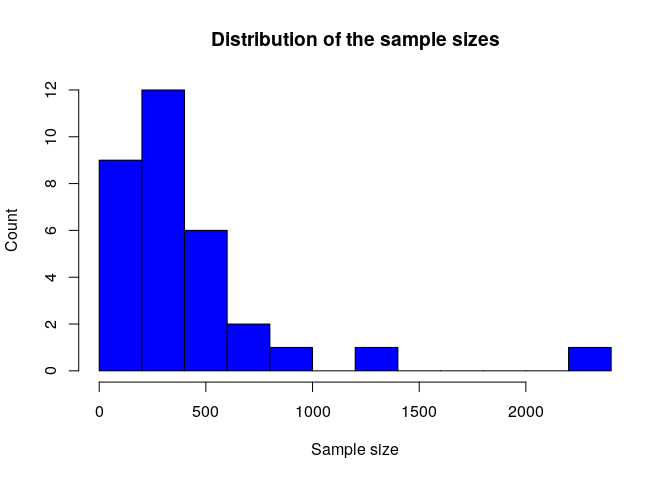
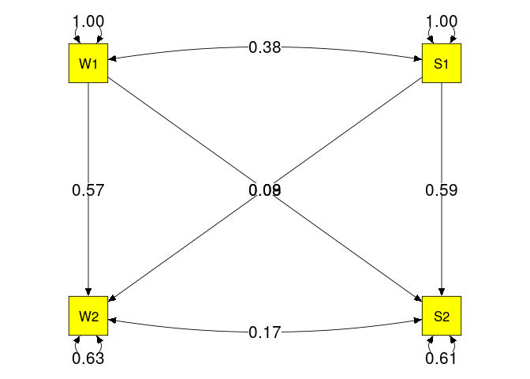

# Read the data and display the sample characteristics

```r
## Required packages
lib2install <- c("lavaan", "semPlot", "metaSEM")

## Install them automatically if they have not been installed in your computer yet.
for (i in lib2install) {
  if (!(i %in% rownames(installed.packages()))) install.packages(i)
}

# Load the libraries for the analysis.
library(lavaan)
library(metaSEM)
library(semPlot)

## Correlation matrices
Nohe15A1$data
```

```
## $`Britt & Dawson (2005)`
##      W1   S1   W2   S2
## W1 1.00 0.29 0.58 0.22
## S1 0.29 1.00 0.24 0.57
## W2 0.58 0.24 1.00 0.27
## S2 0.22 0.57 0.27 1.00
## 
## $`Demerouti et al. (2004)`
##      W1   S1   W2   S2
## W1 1.00 0.53 0.57 0.41
## S1 0.53 1.00 0.41 0.68
## W2 0.57 0.41 1.00 0.54
## S2 0.41 0.68 0.54 1.00
## 
## $`Ford (2010)`
##      W1   S1   W2   S2
## W1 1.00 0.35 0.75 0.32
## S1 0.35 1.00 0.26 0.74
## W2 0.75 0.26 1.00 0.30
## S2 0.32 0.74 0.30 1.00
## 
## $`Hammer et al. (2005), female subsample`
##      W1   S1   W2   S2
## W1 1.00 0.32 0.57 0.22
## S1 0.32 1.00 0.30 0.43
## W2 0.57 0.30 1.00 0.30
## S2 0.22 0.43 0.30 1.00
## 
## $`Hammer et al. (2005), male subsample`
##      W1   S1   W2   S2
## W1 1.00 0.19 0.54 0.17
## S1 0.19 1.00 0.21 0.60
## W2 0.54 0.21 1.00 0.30
## S2 0.17 0.60 0.30 1.00
## 
## $`Innstrand et al. (2008)`
##      W1   S1   W2   S2
## W1 1.00 0.42 0.63 0.31
## S1 0.42 1.00 0.30 0.62
## W2 0.63 0.30 1.00 0.44
## S2 0.31 0.62 0.44 1.00
## 
## $`Jacobshagen et al. (2006)`
##      W1   S1   W2   S2
## W1 1.00 0.46 0.50 0.38
## S1 0.46 1.00 0.29 0.64
## W2 0.50 0.29 1.00 0.44
## S2 0.38 0.64 0.44 1.00
## 
## $`Kalin et al. (2008)`
##      W1   S1   W2   S2
## W1 1.00 0.42 0.52 0.28
## S1 0.42 1.00 0.26 0.54
## W2 0.52 0.26 1.00 0.38
## S2 0.28 0.54 0.38 1.00
## 
## $`Kelloway et al. (1999)`
##      W1   S1   W2   S2
## W1 1.00 0.55 0.71 0.43
## S1 0.55 1.00 0.48 0.72
## W2 0.71 0.48 1.00 0.46
## S2 0.43 0.72 0.46 1.00
## 
## $`Kinnunen et al. (2010), female subsample`
##      W1   S1   W2   S2
## W1 1.00 0.11 0.57 0.18
## S1 0.11 1.00 0.18 0.71
## W2 0.57 0.18 1.00 0.22
## S2 0.18 0.71 0.22 1.00
## 
## $`Kinnunen et al. (2010), male subsample`
##      W1   S1   W2   S2
## W1 1.00 0.13 0.59 0.17
## S1 0.13 1.00 0.17 0.62
## W2 0.59 0.17 1.00 0.23
## S2 0.17 0.62 0.23 1.00
## 
## $`Kinnunen et al. (2004), female subsample`
##      W1   S1   W2   S2
## W1 1.00 0.28 0.71 0.31
## S1 0.28 1.00 0.27 0.61
## W2 0.71 0.27 1.00 0.34
## S2 0.31 0.61 0.34 1.00
## 
## $`Kinnunen et al. (2004), male subsample`
##      W1   S1   W2   S2
## W1 1.00 0.30 0.63 0.24
## S1 0.30 1.00 0.35 0.65
## W2 0.63 0.35 1.00 0.38
## S2 0.24 0.65 0.38 1.00
## 
## $`Leiter & Durup (1996)`
##      W1   S1   W2   S2
## W1 1.00 0.33 0.61 0.29
## S1 0.33 1.00 0.35 0.67
## W2 0.61 0.35 1.00 0.42
## S2 0.29 0.67 0.42 1.00
## 
## $`Mauno (2010)`
##      W1   S1   W2   S2
## W1 1.00 0.54 0.66 0.45
## S1 0.54 1.00 0.34 0.56
## W2 0.66 0.34 1.00 0.65
## S2 0.45 0.56 0.65 1.00
## 
## $`Meier et al. (2007)`
##      W1   S1   W2   S2
## W1 1.00 0.42 0.57 0.40
## S1 0.42 1.00 0.37 0.64
## W2 0.57 0.37 1.00 0.56
## S2 0.40 0.64 0.56 1.00
## 
## $`Meier et al. (2010)`
##      W1   S1   W2   S2
## W1 1.00 0.40 0.65 0.33
## S1 0.40 1.00 0.25 0.60
## W2 0.65 0.25 1.00 0.47
## S2 0.33 0.60 0.47 1.00
## 
## $`Meier et al. (2010)`
##      W1   S1   W2   S2
## W1 1.00 0.49 0.57 0.27
## S1 0.49 1.00 0.29 0.56
## W2 0.57 0.29 1.00 0.40
## S2 0.27 0.56 0.40 1.00
## 
## $`Meier et al. (2010)`
##      W1   S1   W2   S2
## W1 1.00 0.41 0.58 0.28
## S1 0.41 1.00 0.23 0.56
## W2 0.58 0.23 1.00 0.40
## S2 0.28 0.56 0.40 1.00
## 
## $`Meier et al. (2010)`
##      W1   S1   W2   S2
## W1 1.00 0.42 0.56 0.33
## S1 0.42 1.00 0.28 0.53
## W2 0.56 0.28 1.00 0.51
## S2 0.33 0.53 0.51 1.00
## 
## $`Meier et al. (2010)`
##      W1   S1   W2   S2
## W1 1.00 0.41 0.58 0.31
## S1 0.41 1.00 0.32 0.64
## W2 0.58 0.32 1.00 0.48
## S2 0.31 0.64 0.48 1.00
## 
## $`Nohe & Sonntag (2010)`
##      W1   S1   W2   S2
## W1 1.00 0.62 0.71 0.54
## S1 0.62 1.00 0.50 0.75
## W2 0.71 0.50 1.00 0.66
## S2 0.54 0.75 0.66 1.00
## 
## $`Nohe & Sonntag (2010)`
##      W1   S1   W2   S2
## W1 1.00 0.63 0.66 0.36
## S1 0.63 1.00 0.51 0.46
## W2 0.66 0.51 1.00 0.34
## S2 0.36 0.46 0.34 1.00
## 
## $`Nohe & Sonntag (2014)`
##      W1   S1   W2   S2
## W1 1.00 0.68 0.75 0.59
## S1 0.68 1.00 0.60 0.82
## W2 0.75 0.60 1.00 0.69
## S2 0.59 0.82 0.69 1.00
## 
## $`O'Driscoll et al. (2004)`
##      W1   S1   W2   S2
## W1 1.00 0.24 0.70 0.15
## S1 0.24 1.00 0.20 0.70
## W2 0.70 0.20 1.00 0.14
## S2 0.15 0.70 0.14 1.00
## 
## $`Rantanen et al. (2008)`
##      W1   S1   W2   S2
## W1 1.00 0.14 0.54 0.07
## S1 0.14 1.00 0.24 0.51
## W2 0.54 0.24 1.00 0.16
## S2 0.07 0.51 0.16 1.00
## 
## $`Schaufeli et al. (2009)`
##      W1   S1   W2   S2
## W1 1.00 0.46 0.50 0.41
## S1 0.46 1.00 0.18 0.65
## W2 0.50 0.18 1.00 0.36
## S2 0.41 0.65 0.36 1.00
## 
## $`Semmer et al. (2005)`
##      W1   S1   W2   S2
## W1 1.00 0.30 0.23 0.17
## S1 0.30 1.00 0.16 0.51
## W2 0.23 0.16 1.00 0.33
## S2 0.17 0.51 0.33 1.00
## 
## $`Steinmetz et al. (2008)`
##      W1   S1   W2   S2
## W1 1.00 0.25 0.82 0.25
## S1 0.25 1.00 0.34 0.62
## W2 0.82 0.34 1.00 0.39
## S2 0.25 0.62 0.39 1.00
## 
## $`van der Heijden et al. (2008)`
##      W1   S1   W2   S2
## W1 1.00 0.23 0.48 0.18
## S1 0.23 1.00 0.20 0.59
## W2 0.48 0.20 1.00 0.22
## S2 0.18 0.59 0.22 1.00
## 
## $`van Hooff et al. (2005)`
##      W1   S1   W2   S2
## W1 1.00 0.28 0.62 0.22
## S1 0.28 1.00 0.20 0.44
## W2 0.62 0.20 1.00 0.31
## S2 0.22 0.44 0.31 1.00
## 
## $`Westman et al. (2008)`
##      W1   S1   W2   S2
## W1 1.00 0.41 0.64 0.32
## S1 0.41 1.00 0.29 0.81
## W2 0.64 0.29 1.00 0.46
## S2 0.32 0.81 0.46 1.00
```

```r
## Sample sizes
Nohe15A1$n
```

```
##  [1]  489  335  328  234  234 2235   76   94  236  239  239  138  160  151
## [15]  409   78  256  260  600  462  215 1292  470  665  403  153  201  382
## [29]  130  946  730   66
```

```r
## Number of studies
pattern.na(Nohe15A1$data, show.na = FALSE)
```

```
##    W1 S1 W2 S2
## W1 32 32 32 32
## S1 32 32 32 32
## W2 32 32 32 32
## S2 32 32 32 32
```

```r
## Sample sizes for each correlation coefficient
pattern.n(Nohe15A1$data, Nohe15A1$n)
```

```
##       W1    S1    W2    S2
## W1 12906 12906 12906 12906
## S1 12906 12906 12906 12906
## W2 12906 12906 12906 12906
## S2 12906 12906 12906 12906
```

```r
## Sample sizes
summary(Nohe15A1$n)
```

```
##    Min. 1st Qu.  Median    Mean 3rd Qu.    Max. 
##    66.0   158.2   247.5   403.3   464.0  2235.0
```

```r
## Histogram of the sample sizes
hist(Nohe15A1$n, main="Distribution of the sample sizes",
      xlab="Sample size", ylab="Count", col="blue", breaks=10)
```

<!-- -->

# FIMASEM

```r
## Set seed for reproducibility
set.seed(39128482)

## Average the correlation coefficients with the univariate-r approach
uni1 <- uniR1(Nohe15A1$data, Nohe15A1$n)
uni1
```

```
## 
## Total sample sizes:  12906
## Harmonic mean of the sample sizes:  12906 
## 
## Average correlation matrix:  
##           W1        S1        W2        S2
## W1 1.0000000 0.4074043 0.6126003 0.3191213
## S1 0.4074043 1.0000000 0.3146358 0.6182109
## W2 0.6126003 0.3146358 1.0000000 0.4161150
## S2 0.3191213 0.6182109 0.4161150 1.0000000
## 
## Sampling error (SE) of the average correlation matrix:  
##            W1         S1         W2         S2
## W1         NA 0.04158106 0.03114614 0.04477883
## S1 0.04158106         NA 0.04492055 0.03080186
## W2 0.03114614 0.04492055         NA 0.04122343
## S2 0.04477883 0.03080186 0.04122343         NA
## 
## Population heterogeneity (SD) of the average correlation matrix:  
##           W1         S1        W2         S2
## W1        NA 0.14342795 0.0954675 0.11902793
## S1 0.1434279         NA 0.1129741 0.09397904
## W2 0.0954675 0.11297414        NA 0.14548415
## S2 0.1190279 0.09397904 0.1454842         NA
```

```r
## Generate random correlation matrices with parametric bootstrap
boot.cor <- bootuniR1(uni1, Rep=500)

## Display the summary of the generated correlation matrices
summary(boot.cor)
```

```
## Population Sigma:
##           W1        S1        W2        S2
## W1 1.0000000 0.4074043 0.6126003 0.3191213
## S1 0.4074043 1.0000000 0.3146358 0.6182109
## W2 0.6126003 0.3146358 1.0000000 0.4161150
## S2 0.3191213 0.6182109 0.4161150 1.0000000
## 
## Population V:
##            [,1]        [,2]       [,3]       [,4]       [,5]       [,6]
## [1,] 0.02057158 0.000000000 0.00000000 0.00000000 0.00000000 0.00000000
## [2,] 0.00000000 0.009114044 0.00000000 0.00000000 0.00000000 0.00000000
## [3,] 0.00000000 0.000000000 0.01416765 0.00000000 0.00000000 0.00000000
## [4,] 0.00000000 0.000000000 0.00000000 0.01276316 0.00000000 0.00000000
## [5,] 0.00000000 0.000000000 0.00000000 0.00000000 0.00883206 0.00000000
## [6,] 0.00000000 0.000000000 0.00000000 0.00000000 0.00000000 0.02116564
## 
## Sample R (or S):
##           W1        S1        W2        S2
## W1 1.0000000 0.3950748 0.6074085 0.3275886
## S1 0.3950748 1.0000000 0.3115342 0.6166034
## W2 0.6074085 0.3115342 1.0000000 0.4002967
## S2 0.3275886 0.6166034 0.4002967 1.0000000
## 
## Sample V:
##               [,1]          [,2]         [,3]          [,4]          [,5]
## [1,]  1.983929e-02 -0.0006395606 4.321777e-05 -3.712378e-04 -0.0006069681
## [2,] -6.395606e-04  0.0092941981 1.337491e-03  6.517486e-04 -0.0005487748
## [3,]  4.321777e-05  0.0013374908 1.524212e-02  6.315026e-05  0.0002264202
## [4,] -3.712378e-04  0.0006517486 6.315026e-05  1.279211e-02  0.0005280506
## [5,] -6.069681e-04 -0.0005487748 2.264202e-04  5.280506e-04  0.0086174415
## [6,] -2.065454e-03 -0.0011528208 9.548620e-04 -1.196961e-04  0.0001615825
##               [,6]
## [1,] -0.0020654543
## [2,] -0.0011528208
## [3,]  0.0009548620
## [4,] -0.0001196961
## [5,]  0.0001615825
## [6,]  0.0190725054
## 
## Method to handle non-positive definite matrices: replace
## Number of samples: 500
## Count of non-positive definite matrices: 44
```

```r
## Proposed saturated model
model1 <- 'W2 + S2 ~ W1 + S1'

boot1.fit <- bootuniR2(model=model1, data=boot.cor, n=uni1$n.harmonic)
summary(boot1.fit)
```

```
## Summary of the coefficients:
##             Mean        SD Quantile: 0% Quantile: 10% Quantile: 50%
## W2~W1   0.591406  0.135107    -0.030510      0.423918      0.587254
## W2~S1   0.074748  0.176960    -0.687941     -0.165838      0.094188
## S2~W1   0.089386  0.191929    -0.712109     -0.159295      0.102208
## S2~S1   0.594912  0.141675     0.181928      0.423943      0.590140
## W2~~W2  0.591081  0.121878     0.156670      0.433570      0.596585
## S2~~S2  0.574565  0.124050     0.191970      0.399188      0.590155
## W2~~S2  0.157501  0.173790    -0.283522     -0.075474      0.167106
##        Quantile: 90% Quantile: 100%
## W2~W1       0.760348         1.1736
## W2~S1       0.292507         0.6286
## S2~W1       0.318158         0.5799
## S2~S1       0.765699         1.2256
## W2~~W2      0.746833         0.9053
## S2~~S2      0.729497         0.8285
## W2~~S2      0.377395         0.5924
## 
## Summary of the goodness-of-fit indices:
##             Mean         SD Quantile: 0% Quantile: 10% Quantile: 50%
## chisq 1.0317e-11 1.4721e-11   0.0000e+00    0.0000e+00    0.0000e+00
## cfi   1.0000e+00 8.9998e-16   1.0000e+00    1.0000e+00    1.0000e+00
## srmr  7.0806e-09 5.9148e-09   4.5142e-13    1.2181e-09    5.2271e-09
## rmsea 0.0000e+00 0.0000e+00   0.0000e+00    0.0000e+00    0.0000e+00
##       Quantile: 90% Quantile: 100%
## chisq    3.4388e-11              0
## cfi      1.0000e+00              1
## srmr     1.6702e-08              0
## rmsea    0.0000e+00              0
## 
## Chisq test (df):  0
## Percentage of rejection ( 0.05 ):  NaN
## Percentage of CFI > 0.9 :  100
## Percentage of SRMR < 0.1 :  100
## Percentage of RMSEA < 0.05 :  100
## Number of total replications: 500
## Number of successful replications: 500
```

```r
## Proposed model with equal regression coefficients
model2 <- 'W2 ~ Same*W1 + Cross*S1
           S2 ~ Cross*W1 + Same*S1
           W1 ~~ Cor1*S1
           W2 ~~ Cor2*S2'

boot2.fit <- bootuniR2(model=model2, data=boot.cor, n=uni1$n.harmonic)
summary(boot2.fit)
```

```
## Summary of the coefficients:
##               Mean          SD Quantile: 0% Quantile: 10% Quantile: 50%
## Same    6.0793e-01  1.0324e-01   3.2339e-01    4.8337e-01    6.0005e-01
## Cross   8.3327e-02  1.5355e-01  -4.8197e-01   -1.1581e-01    9.4636e-02
## Cross   8.3327e-02  1.5355e-01  -4.8197e-01   -1.1581e-01    9.4636e-02
## Same    6.0793e-01  1.0324e-01   3.2339e-01    4.8337e-01    6.0005e-01
## Cor1    3.9504e-01  1.4084e-01  -3.7642e-02    2.1759e-01    3.9667e-01
## Cor2    1.6516e-01  1.7516e-01  -2.7973e-01   -6.9321e-02    1.7292e-01
## W2~~W2  6.0852e-01  1.2991e-01   1.7256e-01    4.4094e-01    6.0912e-01
## S2~~S2  5.9060e-01  1.2988e-01   1.9718e-01    4.1072e-01    5.9971e-01
## W1~~W1  9.9992e-01  1.6969e-07   9.9992e-01    9.9992e-01    9.9992e-01
## S1~~S1  9.9992e-01  1.6969e-07   9.9992e-01    9.9992e-01    9.9992e-01
##        Quantile: 90% Quantile: 100%
## Same      7.2303e-01         1.0301
## Cross     2.5639e-01         0.4667
## Cross     2.5639e-01         0.4667
## Same      7.2303e-01         1.0301
## Cor1      5.7121e-01         0.7622
## Cor2      3.8778e-01         0.5988
## W2~~W2    7.6367e-01         1.0853
## S2~~S2    7.5113e-01         1.0150
## W1~~W1    9.9992e-01         0.9999
## S1~~S1    9.9992e-01         0.9999
## 
## Summary of the goodness-of-fit indices:
##             Mean         SD Quantile: 0% Quantile: 10% Quantile: 50%
## chisq 7.3840e+02 8.5148e+02   9.8525e-01    6.3337e+01    4.4021e+02
## cfi   9.6477e-01 3.6509e-02   8.0167e-01    9.1332e-01    9.7703e-01
## srmr  6.1901e-02 4.6919e-02   3.7242e-03    2.0187e-02    5.1474e-02
## rmsea 1.4585e-01 8.5276e-02   0.0000e+00    4.8747e-02    1.3030e-01
##       Quantile: 90% Quantile: 100%
## chisq    1.9679e+03      5914.1954
## cfi      9.9655e-01         1.0000
## srmr     1.0990e-01         0.4745
## rmsea    2.7597e-01         0.4786
## 
## Chisq test (df):  2
## Percentage of rejection ( 0.05 ):  99.4
## Percentage of CFI > 0.9 :  92.4
## Percentage of SRMR < 0.1 :  86.6
## Percentage of RMSEA < 0.05 :  10.8
## Number of total replications: 500
## Number of successful replications: 500
```

# TSSEM

```r
rand1 <- tssem1(Nohe15A1$data, Nohe15A1$n, method="REM", RE.type="Diag")
summary(rand1)
```

```
## 
## Call:
## meta(y = ES, v = acovR, RE.constraints = Diag(paste0(RE.startvalues, 
##     "*Tau2_", 1:no.es, "_", 1:no.es)), RE.lbound = RE.lbound, 
##     I2 = I2, model.name = model.name, suppressWarnings = TRUE, 
##     silent = silent, run = run)
## 
## 95% confidence intervals: z statistic approximation
## Coefficients:
##             Estimate Std.Error    lbound    ubound z value  Pr(>|z|)    
## Intercept1 0.3804522 0.0225615 0.3362323 0.4246720 16.8629 < 2.2e-16 ***
## Intercept2 0.6051298 0.0180362 0.5697794 0.6404802 33.5508 < 2.2e-16 ***
## Intercept3 0.3032290 0.0178803 0.2681842 0.3382738 16.9588 < 2.2e-16 ***
## Intercept4 0.3036392 0.0178408 0.2686718 0.3386065 17.0194 < 2.2e-16 ***
## Intercept5 0.6166503 0.0166427 0.5840312 0.6492694 37.0523 < 2.2e-16 ***
## Intercept6 0.3954085 0.0216645 0.3529469 0.4378701 18.2515 < 2.2e-16 ***
## Tau2_1_1   0.0134777 0.0038704 0.0058919 0.0210635  3.4823 0.0004972 ***
## Tau2_2_2   0.0087592 0.0025260 0.0038083 0.0137102  3.4676 0.0005252 ***
## Tau2_3_3   0.0071123 0.0022470 0.0027082 0.0115163  3.1652 0.0015496 ** 
## Tau2_4_4   0.0070585 0.0022121 0.0027229 0.0113941  3.1909 0.0014183 ** 
## Tau2_5_5   0.0072633 0.0021092 0.0031293 0.0113974  3.4436 0.0005740 ***
## Tau2_6_6   0.0122813 0.0034848 0.0054513 0.0191113  3.5243 0.0004246 ***
## ---
## Signif. codes:  0 '***' 0.001 '**' 0.01 '*' 0.05 '.' 0.1 ' ' 1
## 
## Q statistic on the homogeneity of effect sizes: 1466.161
## Degrees of freedom of the Q statistic: 186
## P value of the Q statistic: 0
## 
## Heterogeneity indices (based on the estimated Tau2):
##                              Estimate
## Intercept1: I2 (Q statistic)   0.8829
## Intercept2: I2 (Q statistic)   0.8973
## Intercept3: I2 (Q statistic)   0.7743
## Intercept4: I2 (Q statistic)   0.7718
## Intercept5: I2 (Q statistic)   0.8810
## Intercept6: I2 (Q statistic)   0.8748
## 
## Number of studies (or clusters): 32
## Number of observed statistics: 192
## Number of estimated parameters: 12
## Degrees of freedom: 180
## -2 log likelihood: -300.1702 
## OpenMx status1: 0 ("0" or "1": The optimization is considered fine.
## Other values may indicate problems.)
```

```r
## SDs of the correlations (heterogeneity)
sqrt(coef(rand1, select="rand"))
```

```
##   Tau2_1_1   Tau2_2_2   Tau2_3_3   Tau2_4_4   Tau2_5_5   Tau2_6_6 
## 0.11609350 0.09359083 0.08433432 0.08401477 0.08522529 0.11082105
```

```r
## Cross-lagged panel model
model3 <- 'W2 ~ W2W*W1 + S2W*S1
           S2 ~ W2S*W1 + S2S*S1
           W1 ~~ W1cS1*S1
           W2 ~~ W2cS2*S2
           W1 ~~ 1*W1
           S1 ~~ 1*S1'

## Convert the lavaan model to the RAM model
RAM1 <- lavaan2RAM(model3, obs.variables=c("W1", "S1", "W2", "S2"))

rand2a <- tssem2(rand1, Amatrix=RAM1$A, Smatrix=RAM1$S)
summary(rand2a)
```

```
## 
## Call:
## wls(Cov = pooledS, aCov = aCov, n = tssem1.obj$total.n, Amatrix = Amatrix, 
##     Smatrix = Smatrix, Fmatrix = Fmatrix, diag.constraints = diag.constraints, 
##     cor.analysis = cor.analysis, intervals.type = intervals.type, 
##     mx.algebras = mx.algebras, model.name = model.name, suppressWarnings = suppressWarnings, 
##     silent = silent, run = run)
## 
## 95% confidence intervals: z statistic approximation
## Coefficients:
##       Estimate Std.Error   lbound   ubound z value  Pr(>|z|)    
## S2S   0.586124  0.020790 0.545376 0.626872 28.1926 < 2.2e-16 ***
## W2S   0.080237  0.024842 0.031547 0.128926  3.2299 0.0012385 ** 
## S2W   0.085841  0.024796 0.037242 0.134440  3.4619 0.0005363 ***
## W2W   0.572471  0.022265 0.528834 0.616109 25.7122 < 2.2e-16 ***
## W1cS1 0.380452  0.022562 0.336232 0.424672 16.8629 < 2.2e-16 ***
## W2cS2 0.168885  0.025232 0.119431 0.218338  6.6933 2.182e-11 ***
## ---
## Signif. codes:  0 '***' 0.001 '**' 0.01 '*' 0.05 '.' 0.1 ' ' 1
## 
## Goodness-of-fit indices:
##                                            Value
## Sample size                                12906
## Chi-square of target model                     0
## DF of target model                             0
## p value of target model                        0
## Number of constraints imposed on "Smatrix"     0
## DF manually adjusted                           0
## Chi-square of independence model            3079
## DF of independence model                       6
## RMSEA                                          0
## RMSEA lower 95% CI                             0
## RMSEA upper 95% CI                             0
## SRMR                                           0
## TLI                                         -Inf
## CFI                                            1
## AIC                                            0
## BIC                                            0
## OpenMx status1: 0 ("0" or "1": The optimization is considered fine.
## Other values indicate problems.)
```

```r
## Plot the model
my.plot1 <- meta2semPlot(rand2a)
semPaths(my.plot1, whatLabels="est", sizeMan=8, edge.label.cex=1.5, 
         color="yellow", edge.color = "black", weighted=FALSE)
```

<!-- -->

```r
## Model with equal regression coefficients
model4 <- 'W2 ~ Same*W1 + Cross*S1
           S2 ~ Cross*W1 + Same*S1
           W1 ~~ W1cS1*S1
           W2 ~~ W2cS2*S2
           W1 ~~ 1*W1
           S1 ~~ 1*S1'

RAM2 <- lavaan2RAM(model4, obs.variables=c("W1", "S1", "W2", "S2"))

rand2b <- tssem2(rand1, Amatrix=RAM2$A, Smatrix=RAM2$S)
summary(rand2b)
```

```
## 
## Call:
## wls(Cov = pooledS, aCov = aCov, n = tssem1.obj$total.n, Amatrix = Amatrix, 
##     Smatrix = Smatrix, Fmatrix = Fmatrix, diag.constraints = diag.constraints, 
##     cor.analysis = cor.analysis, intervals.type = intervals.type, 
##     mx.algebras = mx.algebras, model.name = model.name, suppressWarnings = suppressWarnings, 
##     silent = silent, run = run)
## 
## 95% confidence intervals: z statistic approximation
## Coefficients:
##       Estimate Std.Error   lbound   ubound z value  Pr(>|z|)    
## Cross 0.082840  0.019712 0.044206 0.121474  4.2026 2.638e-05 ***
## Same  0.579844  0.015217 0.550020 0.609669 38.1054 < 2.2e-16 ***
## W1cS1 0.380451  0.022562 0.336231 0.424671 16.8628 < 2.2e-16 ***
## W2cS2 0.168824  0.025241 0.119353 0.218295  6.6886 2.254e-11 ***
## ---
## Signif. codes:  0 '***' 0.001 '**' 0.01 '*' 0.05 '.' 0.1 ' ' 1
## 
## Goodness-of-fit indices:
##                                                 Value
## Sample size                                12906.0000
## Chi-square of target model                     0.2247
## DF of target model                             2.0000
## p value of target model                        0.8937
## Number of constraints imposed on "Smatrix"     0.0000
## DF manually adjusted                           0.0000
## Chi-square of independence model            3078.9538
## DF of independence model                       6.0000
## RMSEA                                          0.0000
## RMSEA lower 95% CI                             0.0000
## RMSEA upper 95% CI                             0.0079
## SRMR                                           0.0033
## TLI                                            1.0017
## CFI                                            1.0000
## AIC                                           -3.7753
## BIC                                          -18.7062
## OpenMx status1: 0 ("0" or "1": The optimization is considered fine.
## Other values indicate problems.)
```

```r
my.plot2 <- meta2semPlot(rand2b)
semPaths(my.plot2, whatLabels="est", sizeMan=8, edge.label.cex=1.5, 
         color="yellow", edge.color = "black", weighted=FALSE)
```

<!-- -->

```r
sessionInfo()
```

```
## R version 3.5.1 (2018-07-02)
## Platform: x86_64-pc-linux-gnu (64-bit)
## Running under: Ubuntu 18.04 LTS
## 
## Matrix products: default
## BLAS: /usr/lib/x86_64-linux-gnu/blas/libblas.so.3.7.1
## LAPACK: /usr/lib/x86_64-linux-gnu/lapack/liblapack.so.3.7.1
## 
## locale:
##  [1] LC_CTYPE=en_US.utf8       LC_NUMERIC=C             
##  [3] LC_TIME=en_US.utf8        LC_COLLATE=en_US.utf8    
##  [5] LC_MONETARY=en_US.utf8    LC_MESSAGES=en_US.utf8   
##  [7] LC_PAPER=en_US.utf8       LC_NAME=C                
##  [9] LC_ADDRESS=C              LC_TELEPHONE=C           
## [11] LC_MEASUREMENT=en_US.utf8 LC_IDENTIFICATION=C      
## 
## attached base packages:
## [1] stats     graphics  grDevices utils     datasets  methods   base     
## 
## other attached packages:
## [1] semPlot_1.1    metaSEM_1.1.1  OpenMx_2.9.9   lavaan_0.6-1  
## [5] rmarkdown_1.10
## 
## loaded via a namespace (and not attached):
##   [1] nlme_3.1-137         RColorBrewer_1.1-2   rprojroot_1.3-2     
##   [4] mi_1.0               tools_3.5.1          backports_1.1.2     
##   [7] R6_2.2.2             d3Network_0.5.2.1    rpart_4.1-13        
##  [10] Hmisc_4.1-1          lazyeval_0.2.1       colorspace_1.3-2    
##  [13] nnet_7.3-12          tidyselect_0.2.4     gridExtra_2.3       
##  [16] mnormt_1.5-5         curl_3.2             compiler_3.5.1      
##  [19] fdrtool_1.2.15       qgraph_1.5           htmlTable_1.12      
##  [22] network_1.13.0.1     scales_0.5.0         checkmate_1.8.5     
##  [25] mvtnorm_1.0-8        psych_1.8.4          pbapply_1.3-4       
##  [28] sem_3.1-9            stringr_1.3.1        digest_0.6.15       
##  [31] pbivnorm_0.6.0       foreign_0.8-70       minqa_1.2.4         
##  [34] rio_0.5.10           base64enc_0.1-3      jpeg_0.1-8          
##  [37] pkgconfig_2.0.1      htmltools_0.3.6      lme4_1.1-17         
##  [40] lisrelToR_0.1.4      htmlwidgets_1.2      rlang_0.2.1         
##  [43] readxl_1.1.0         huge_1.2.7           rstudioapi_0.7      
##  [46] bindr_0.1.1          gtools_3.8.1         statnet.common_4.1.4
##  [49] acepack_1.4.1        dplyr_0.7.6          zip_1.0.0           
##  [52] car_3.0-0            magrittr_1.5         Formula_1.2-3       
##  [55] Matrix_1.2-14        Rcpp_0.12.17         munsell_0.5.0       
##  [58] abind_1.4-5          rockchalk_1.8.111    whisker_0.3-2       
##  [61] stringi_1.2.3        yaml_2.1.19          carData_3.0-1       
##  [64] MASS_7.3-50          plyr_1.8.4           matrixcalc_1.0-3    
##  [67] grid_3.5.1           parallel_3.5.1       forcats_0.3.0       
##  [70] lattice_0.20-35      haven_1.1.2          splines_3.5.1       
##  [73] hms_0.4.2            sna_2.4              knitr_1.20          
##  [76] pillar_1.2.3         igraph_1.2.1         rjson_0.2.20        
##  [79] boot_1.3-20          corpcor_1.6.9        BDgraph_2.51        
##  [82] reshape2_1.4.3       stats4_3.5.1         XML_3.98-1.11       
##  [85] glue_1.2.0           evaluate_0.10.1      latticeExtra_0.6-28 
##  [88] data.table_1.11.4    png_0.1-7            nloptr_1.0.4        
##  [91] cellranger_1.1.0     gtable_0.2.0         purrr_0.2.5         
##  [94] assertthat_0.2.0     ggplot2_3.0.0        openxlsx_4.1.0      
##  [97] semTools_0.5-0       coda_0.19-1          glasso_1.8          
## [100] survival_2.42-3      tibble_1.4.2         arm_1.10-1          
## [103] ggm_2.3              ellipse_0.4.1        bindrcpp_0.2.2      
## [106] cluster_2.0.7-1
```


