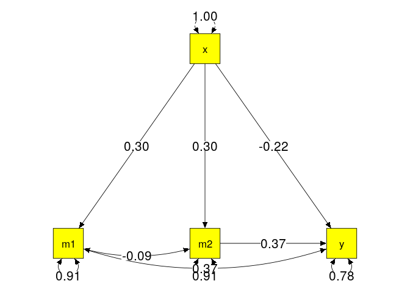
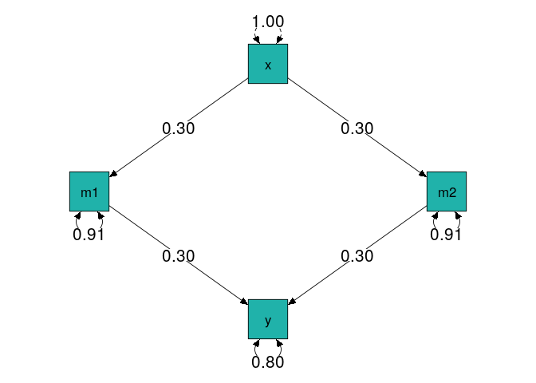
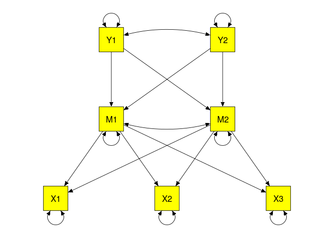
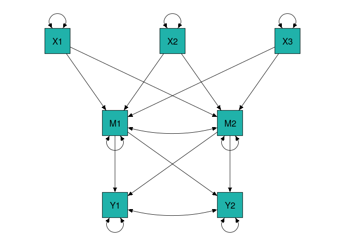

# Figure 1 in Yu et al. (2016)

## Incorrect (actually used) population correlation used to generate the data
* Pearson correlations were incorrectly used to represent the path coefficients to generate the random correlation matrices in Yu et al. The correct approach is to calculate the model implied correlation matrix based on the path diagram in Figure 1. 
* The incorrect population correlation matrix `IncorrectP1` was used to generate data in Study 1. 
* If we use `IncorrectP1` (the population values) to fit the proposed path model in Figure 1, the value of the minimum of the fit function is non-zero ($\chi^2(df=2)=59.215$ with $N=1,000$). Moreover, the residuals of the "covariance" matrix are also non-zero. This shows that the population correlation matrix `IncorrectP1` does not match the model specified in Figure 1.


```r
## Required packages
lib2install <- c("lavaan", "semPlot", "knitr")

## Install them automatically if they have not been installed in your computer yet.
for (i in lib2install) {
  if (!(i %in% rownames(installed.packages()))) install.packages(i)
}

library(lavaan)
library(semPlot)
library(knitr)

labels <- c("x", "m1", "m2", "y")

IncorrectP1 <- matrix(c(1, .3, .3, 0,
                       .3, 1, 0, .3,
                       .3, 0, 1, .3,
                       0, .3, .3, 1), ncol=4, nrow=4, byrow=TRUE,
               dimnames = list(labels, labels))

## Population correlation matrix used in Yu's et al. simulation studies
kable(IncorrectP1)
```

        x    m1    m2     y
---  ----  ----  ----  ----
x     1.0   0.3   0.3   0.0
m1    0.3   1.0   0.0   0.3
m2    0.3   0.0   1.0   0.3
y     0.0   0.3   0.3   1.0

```r
## Population model: no direct effect used in the analysis
model1 <- 'm1 + m2 ~ x
           y ~ m1 + m2'

## Incorrect model. The fit is not perfect even the population correlation matrix is used.
fit.incorrect1 <- sem(model1, sample.cov=IncorrectP1, sample.nobs=1000)
summary(fit.incorrect1)
```

```
## lavaan (0.6-1) converged normally after   9 iterations
## 
##   Number of observations                          1000
## 
##   Estimator                                         ML
##   Model Fit Test Statistic                      59.215
##   Degrees of freedom                                 2
##   P-value (Chi-square)                           0.000
## 
## Parameter Estimates:
## 
##   Information                                 Expected
##   Information saturated (h1) model          Structured
##   Standard Errors                             Standard
## 
## Regressions:
##                    Estimate  Std.Err  z-value  P(>|z|)
##   m1 ~                                                
##     x                 0.300    0.030    9.945    0.000
##   m2 ~                                                
##     x                 0.300    0.030    9.945    0.000
##   y ~                                                 
##     m1                0.300    0.029   10.434    0.000
##     m2                0.300    0.029   10.434    0.000
## 
## Variances:
##                    Estimate  Std.Err  z-value  P(>|z|)
##    .m1                0.909    0.041   22.361    0.000
##    .m2                0.909    0.041   22.361    0.000
##    .y                 0.819    0.037   22.361    0.000
```

```r
## Residuals of the "covariance" matrix
resid(fit.incorrect1)
```

```
## $type
## [1] "raw"
## 
## $cov
##    m1     m2     y      x     
## m1  0.000                     
## m2 -0.090  0.000              
## y  -0.027 -0.027 -0.016       
## x   0.000  0.000 -0.180  0.000
## 
## $mean
## m1 m2  y  x 
##  0  0  0  0
```

* To see what the actual generating model is, we add the direct effect from $x$ to $y$ and allow the residues between $m1$ and $m2$ correlated. This model is now saturated. The results show that there is a direct effect of -0.22 from $x$ to $y$ and the correlation between the residues of $m1$ and $m2$ is -0.09. This model is different from the one specified in Figure 1 in Yu et al.


```r
## Population model: with direct effect              
model2 <- 'm1 + m2 ~ x
           y ~ m1 + m2 + x
           m1 ~~ m2'

fit.incorrect2 <- sem(model2, sample.cov=IncorrectP1, sample.nobs=1000)
summary(fit.incorrect2)  
```

```
## lavaan (0.6-1) converged normally after  12 iterations
## 
##   Number of observations                          1000
## 
##   Estimator                                         ML
##   Model Fit Test Statistic                       0.000
##   Degrees of freedom                                 0
## 
## Parameter Estimates:
## 
##   Information                                 Expected
##   Information saturated (h1) model          Structured
##   Standard Errors                             Standard
## 
## Regressions:
##                    Estimate  Std.Err  z-value  P(>|z|)
##   m1 ~                                                
##     x                 0.300    0.030    9.945    0.000
##   m2 ~                                                
##     x                 0.300    0.030    9.945    0.000
##   y ~                                                 
##     m1                0.366    0.029   12.431    0.000
##     m2                0.366    0.029   12.431    0.000
##     x                -0.220    0.031   -7.115    0.000
## 
## Covariances:
##                    Estimate  Std.Err  z-value  P(>|z|)
##  .m1 ~~                                               
##    .m2               -0.090    0.029   -3.112    0.002
## 
## Variances:
##                    Estimate  Std.Err  z-value  P(>|z|)
##    .m1                0.909    0.041   22.361    0.000
##    .m2                0.909    0.041   22.361    0.000
##    .y                 0.780    0.035   22.361    0.000
```

```r
## Residuals of the "covariance" matrix
resid(fit.incorrect2)
```

```
## $type
## [1] "raw"
## 
## $cov
##    m1 m2 y x
## m1 0        
## m2 0  0     
## y  0  0  0  
## x  0  0  0 0
## 
## $mean
## m1 m2  y  x 
##  0  0  0  0
```

```r
semPaths(fit.incorrect2, what="est", edge.label.cex=1.5, 
         sizeMan=8, color="yellow", edge.color = "black", 
         weighted=FALSE, layout="tree2")
```

<!-- -->


## Correct (intended to use) population correlation used to generate the data

* The following `R` code shows how to derive the correct population correlation matrix for the model in Figure 1 in Yu et al.
* We use the `impliedR()` function in the `metaSEM` package. Users may specify the population standardized regression coefficients. The function then generates the population correlation matrix for the model.
* When we fit the model in Figure 1 to the population correlation matrix `CorrectP1`, the discrepancy is exact zero ($\chi^2(df=2)=0$ with $N=1,000$). The residuals of the "covariance" matrix are also zero. The parameters are identical to the values in Figure 1 in Yu et al. Therefore, this is the correct population correlation matrix.

```r
library(metaSEM)

## A matrix for the regression paths as defined in Figure 1
## All of them are fixed values.
A2 <- matrix(c(0,0,0,0,
               0.3,0,0,0,
               0.3,0,0,0,
               0,0.3,0.3,0), ncol=4, nrow=4, byrow=TRUE,
             dimnames=list(labels, labels))
A2
```

```
##      x  m1  m2 y
## x  0.0 0.0 0.0 0
## m1 0.3 0.0 0.0 0
## m2 0.3 0.0 0.0 0
## y  0.0 0.3 0.3 0
```

```r
## The variance of x is fixed at 1 whereas the others are starting values.
S2 <- Diag(c(1, "0.1*Err_m1", "0.1*Err_m2", "0.1*Err_y"))
dimnames(S2) <- list(labels, labels)
S2
```

```
##    x   m1           m2           y          
## x  "1" "0"          "0"          "0"        
## m1 "0" "0.1*Err_m1" "0"          "0"        
## m2 "0" "0"          "0.1*Err_m2" "0"        
## y  "0" "0"          "0"          "0.1*Err_y"
```

```r
CorrectP1 <- impliedR(A2, S2, labels=labels)$SigmaObs
kable(CorrectP1)
```

         x      m1      m2       y
---  -----  ------  ------  ------
x     1.00   0.300   0.300   0.180
m1    0.30   1.000   0.090   0.327
m2    0.30   0.090   1.000   0.327
y     0.18   0.327   0.327   1.000

```r
fit.correct1 <- sem(model1, sample.cov=CorrectP1, sample.nobs=1000)
summary(fit.correct1)
```

```
## lavaan (0.6-1) converged normally after  10 iterations
## 
##   Number of observations                          1000
## 
##   Estimator                                         ML
##   Model Fit Test Statistic                       0.000
##   Degrees of freedom                                 2
##   P-value (Chi-square)                           1.000
## 
## Parameter Estimates:
## 
##   Information                                 Expected
##   Information saturated (h1) model          Structured
##   Standard Errors                             Standard
## 
## Regressions:
##                    Estimate  Std.Err  z-value  P(>|z|)
##   m1 ~                                                
##     x                 0.300    0.030    9.945    0.000
##   m2 ~                                                
##     x                 0.300    0.030    9.945    0.000
##   y ~                                                 
##     m1                0.300    0.028   10.539    0.000
##     m2                0.300    0.028   10.539    0.000
## 
## Variances:
##                    Estimate  Std.Err  z-value  P(>|z|)
##    .m1                0.909    0.041   22.361    0.000
##    .m2                0.909    0.041   22.361    0.000
##    .y                 0.803    0.036   22.361    0.000
```

```r
## Residuals of the "covariance" matrix
resid(fit.correct1)
```

```
## $type
## [1] "raw"
## 
## $cov
##    m1 m2 y x
## m1 0        
## m2 0  0     
## y  0  0  0  
## x  0  0  0 0
## 
## $mean
## m1 m2  y  x 
##  0  0  0  0
```

```r
semPaths(fit.correct1, what="est", edge.label.cex=1.5, 
         sizeMan=8, color="lightseagreen", edge.color = "black", 
         weighted=FALSE, layout="tree2")
```

<!-- -->


## Incorrect (actually used) model specification in analyzing the data
* The roles of independent and dependent variables in the `A` matrix in `OpenMx` and `metaSEM` were incorrectly reversed in Yu et al. Moreover, the error variances were incorrectly fixed at 1.0 in the `S` matrix. Therefore, the results in Figure 1 were incorrect in Yu et al.
* The following was the model used in the simulation study in Yu et al.

```r
varnames <- c('X','M1','M2','Y')

A <- mxMatrix('Full', ncol=4, nrow=4, byrow=T,
              values = c(0,0.3,0.3,0,
                         0,0,0,0.3,
                         0,0,0,0.3,
                         0,0,0,0),
              free=c(F,T,T,F,
                     F,F,F,T,
                     F,F,F,T,
                     F,F,F,F
              ),
              labels=c(NA,"betaxm1","betaxm2",NA,
                       NA,NA,NA,"betam1y",
                       NA,NA,NA,"betam2y",
                       NA,NA,NA,NA
              ),
              name="A")

S <- mxMatrix('Full', ncol=4, nrow=4, byrow=T,
              values = c(1,0,0,0,
                         0,1,.2,0,
                         0,.2,1,0,
                         0,0,0,1),
              free=c(F,F,F,F,
                     F,F,T,F,
                     F,T,F,F,
                     F,F,F,F),
              labels=c("varx",NA,NA,NA,
                       NA,"varm1","covm1m2",NA,
                       NA,"covm1m2","varm2",NA,
                       NA,NA,NA,"vary"
              ),
              name="S")

## Extract the values and draw the model
Amatrix <- A$values
dimnames(Amatrix) <- list(labels, labels)
Amatrix
```

```
##    x  m1  m2   y
## x  0 0.3 0.3 0.0
## m1 0 0.0 0.0 0.3
## m2 0 0.0 0.0 0.3
## y  0 0.0 0.0 0.0
```

```r
Smatrix <- S$values
dimnames(Smatrix) <- list(labels, labels)
Smatrix
```

```
##    x  m1  m2 y
## x  1 0.0 0.0 0
## m1 0 1.0 0.2 0
## m2 0 0.2 1.0 0
## y  0 0.0 0.0 1
```

```r
Fmatrix <- diag(4)

incorrect.plot <- ramModel(Amatrix, Smatrix, Fmatrix, manNames=varnames)

## All the directions are incorrect.
semPaths(incorrect.plot, layout="tree2", sizeMan=8, edge.color = "black", 
         whatLabels = "hide", color="yellow")
```

<!-- -->

## Correct (intended to use) model specification in analyzing the data
* The following is the correct model specified in Figure 1 in Yu et al.
* There is no correlation between the residuals in the generating model. We include it to follow the model specified in Yu et al.

```r
A <- create.mxMatrix(c(0,0,0,0,
                       "0.3*betaxm1",0,0,0,
                       "0.3*betaxm2",0,0,0,
                       0,"0.3*betam1y","0.3*betam2y",0), 
                     ncol=4, nrow=4, byrow=TRUE, name="A")

S <- create.mxMatrix(c(1,
                       0,"0.2*varm1",
                       0,"0.1*covm1m2","0.2*varm2",
                       0,0,0,"0.2*vary"), 
                     type="Symm", ncol=4, nrow=4, byrow=TRUE, name="S")

## Extract the values and draw the model
Amatrix <- A$values
dimnames(Amatrix) <- list(labels, labels)
Amatrix
```

```
##      x  m1  m2 y
## x  0.0 0.0 0.0 0
## m1 0.3 0.0 0.0 0
## m2 0.3 0.0 0.0 0
## y  0.0 0.3 0.3 0
```

```r
Smatrix <- S$values
dimnames(Smatrix) <- list(labels, labels)
Smatrix
```

```
##    x  m1  m2   y
## x  1 0.0 0.0 0.0
## m1 0 0.2 0.1 0.0
## m2 0 0.1 0.2 0.0
## y  0 0.0 0.0 0.2
```

```r
correct.plot <- ramModel(Amatrix, Smatrix, Fmatrix, manNames=varnames)

## All the directions are correct.
semPaths(correct.plot, layout="tree2", sizeMan=8, edge.color = "black", 
         whatLabels = "hide", color="lightseagreen")
```

<!-- -->

# Figure 2 in Yu et al. (2016)

## Incorrect (actually used) population correlation used to generate the data
* The same errors were also observed in Figure 2 in Yu et al. Pearson correlations were incorrectly used to represent the path coefficients to generate the random correlation matrices.
* The incorrect population correlation matrix `IncorrectP2` was used to generate data in Run 6 Study 1 and their online Supplemental-Material-2.docx. 
* If we use `IncorrectP2` (the population values) to fit the proposed path model in Figure 2, the value of the discrepancy function is non-zero ($\chi^2(df=8)=1,276.262$ with $N=1,000$). Moreover, the residuals of the "covariance" matrix are non-zero. This shows that the population correlation matrix `IncorrectP2` does not match the model in Figure 2.


```r
labels <- c("x1","x2","x3","m1","m2","y1","y2")

## These are the values used as the population correlation matrix 
## to generate the data in Figure 2
rho <- 0.3
r <- c(0,0,rho,rho,0,0,0,rho,rho,0,0,rho,rho,0,0,0,rho,rho,rho,rho,0)
IncorrectP2 <- lav_matrix_vech_reverse(r, diagonal=FALSE)
diag(IncorrectP2) <- 1
dimnames(IncorrectP2) <- list(labels, labels)

kable(IncorrectP2)
```

       x1    x2    x3    m1    m2    y1    y2
---  ----  ----  ----  ----  ----  ----  ----
x1    1.0   0.0   0.0   0.3   0.3   0.0   0.0
x2    0.0   1.0   0.0   0.3   0.3   0.0   0.0
x3    0.0   0.0   1.0   0.3   0.3   0.0   0.0
m1    0.3   0.3   0.3   1.0   0.0   0.3   0.3
m2    0.3   0.3   0.3   0.0   1.0   0.3   0.3
y1    0.0   0.0   0.0   0.3   0.3   1.0   0.0
y2    0.0   0.0   0.0   0.3   0.3   0.0   1.0

```r
## Population model: no direct effect used in the analysis
model3 <- 'm1 + m2 ~ x1 + x2 + x3
           y1 + y2 ~ m1 + m2
           y1 ~~ 0*y2'

## Incorrect model. The fit is not perfect even the population correlation matrix is used.
fit.incorrect3 <- sem(model3, sample.cov=IncorrectP2, sample.nobs=1000)
summary(fit.incorrect3)  
```

```
## lavaan (0.6-1) converged normally after   9 iterations
## 
##   Number of observations                          1000
## 
##   Estimator                                         ML
##   Model Fit Test Statistic                    1276.262
##   Degrees of freedom                                 8
##   P-value (Chi-square)                           0.000
## 
## Parameter Estimates:
## 
##   Information                                 Expected
##   Information saturated (h1) model          Structured
##   Standard Errors                             Standard
## 
## Regressions:
##                    Estimate  Std.Err  z-value  P(>|z|)
##   m1 ~                                                
##     x1                0.300    0.027   11.103    0.000
##     x2                0.300    0.027   11.103    0.000
##     x3                0.300    0.027   11.103    0.000
##   m2 ~                                                
##     x1                0.300    0.027   11.103    0.000
##     x2                0.300    0.027   11.103    0.000
##     x3                0.300    0.027   11.103    0.000
##   y1 ~                                                
##     m1                0.300    0.030   10.087    0.000
##     m2                0.300    0.030   10.087    0.000
##   y2 ~                                                
##     m1                0.300    0.030   10.087    0.000
##     m2                0.300    0.030   10.087    0.000
## 
## Covariances:
##                    Estimate  Std.Err  z-value  P(>|z|)
##  .y1 ~~                                               
##    .y2                0.000                           
## 
## Variances:
##                    Estimate  Std.Err  z-value  P(>|z|)
##    .m1                0.729    0.033   22.361    0.000
##    .m2                0.729    0.033   22.361    0.000
##    .y1                0.819    0.037   22.361    0.000
##    .y2                0.819    0.037   22.361    0.000
```

```r
## Residuals of the "covariance" matrix
resid(fit.incorrect3)
```

```
## $type
## [1] "raw"
## 
## $cov
##    m1     m2     y1     y2     x1     x2     x3    
## m1  0.000                                          
## m2 -0.270  0.000                                   
## y1 -0.081 -0.081 -0.049                            
## y2 -0.081 -0.081 -0.228 -0.049                     
## x1  0.000  0.000 -0.180 -0.180  0.000              
## x2  0.000  0.000 -0.180 -0.180  0.000  0.000       
## x3  0.000  0.000 -0.180 -0.180  0.000  0.000  0.000
## 
## $mean
## m1 m2 y1 y2 x1 x2 x3 
##  0  0  0  0  0  0  0
```

* To see what the actual generating model is, we add the direct effects and the correlated residuals. The model is now saturated. The results show that there are negative direct effects (-0.391) from $x1$, $x2$ and $x3$ to $y1$ and $y2$. Moreover, there are correlated residuals between $m1$ and $m2$, and between $y1$ and $y2$. This model is different from the one in Figure 2 in Yu et al.


```r
## Population model: no direct effect used in the analysis
model4 <- 'y1 + y2 + m1 + m2 ~ x1 + x2 + x3
           y1 + y2 ~ m1 + m2 
           m1 ~~ m2
           y1 ~~ y2'

## Incorrect model. The fit is not perfect even population correlation matrix is used.
fit.incorrect4 <- sem(model4, sample.cov=IncorrectP2, sample.nobs=1000)
summary(fit.incorrect4)
```

```
## lavaan (0.6-1) converged normally after  19 iterations
## 
##   Number of observations                          1000
## 
##   Estimator                                         ML
##   Model Fit Test Statistic                       0.000
##   Degrees of freedom                                 0
## 
## Parameter Estimates:
## 
##   Information                                 Expected
##   Information saturated (h1) model          Structured
##   Standard Errors                             Standard
## 
## Regressions:
##                    Estimate  Std.Err  z-value  P(>|z|)
##   y1 ~                                                
##     x1               -0.391    0.029  -13.446    0.000
##     x2               -0.391    0.029  -13.446    0.000
##     x3               -0.391    0.029  -13.446    0.000
##   y2 ~                                                
##     x1               -0.391    0.029  -13.446    0.000
##     x2               -0.391    0.029  -13.446    0.000
##     x3               -0.391    0.029  -13.446    0.000
##   m1 ~                                                
##     x1                0.300    0.027   11.103    0.000
##     x2                0.300    0.027   11.103    0.000
##     x3                0.300    0.027   11.103    0.000
##   m2 ~                                                
##     x1                0.300    0.027   11.103    0.000
##     x2                0.300    0.027   11.103    0.000
##     x3                0.300    0.027   11.103    0.000
##   y1 ~                                                
##     m1                0.652    0.031   20.984    0.000
##     m2                0.652    0.031   20.984    0.000
##   y2 ~                                                
##     m1                0.652    0.031   20.984    0.000
##     m2                0.652    0.031   20.984    0.000
## 
## Covariances:
##                    Estimate  Std.Err  z-value  P(>|z|)
##  .m1 ~~                                               
##    .m2               -0.270    0.025  -10.970    0.000
##  .y1 ~~                                               
##    .y2               -0.391    0.023  -17.100    0.000
## 
## Variances:
##                    Estimate  Std.Err  z-value  P(>|z|)
##    .y1                0.608    0.027   22.361    0.000
##    .y2                0.608    0.027   22.361    0.000
##    .m1                0.729    0.033   22.361    0.000
##    .m2                0.729    0.033   22.361    0.000
```

```r
## Residuals of the "covariance" matrix
resid(fit.incorrect4)
```

```
## $type
## [1] "raw"
## 
## $cov
##    y1 y2 m1 m2 x1 x2 x3
## y1 0                   
## y2 0  0                
## m1 0  0  0             
## m2 0  0  0  0          
## x1 0  0  0  0  0       
## x2 0  0  0  0  0  0    
## x3 0  0  0  0  0  0  0 
## 
## $mean
## y1 y2 m1 m2 x1 x2 x3 
##  0  0  0  0  0  0  0
```

```r
semPaths(fit.incorrect4, what="est", edge.label.cex=1.5, 
         sizeMan=8, color="yellow", edge.color = "black", 
         weighted=FALSE, layout="tree2")
```

<!-- -->


## Correct (intended to use) population correlation used to generate the data
* The following R code shows how to generate the correct correlation matrix for Figure 2 in Yu et al.
* We specify the regression paths in the `A4` matrix. Then we generate the population correlation matrix with the `impliedR()` function.
* When we fit the model in Figure 2 to the population correlation matrix `CorrectP2`, the discrepancy is exact zero ($\chi^2(df=8)=0$ with $N=1,000$). The residuals of the "covariance" matrix are zero. The parameters are identical to the values in Figure 2. Therefore, this is the correct population correlation matrix.

```r
## A matrix for the regression paths as defined in Figure 2
## All of them are fixed values.
A4 <- matrix(c(0,0,0,0,0,0,0,
               0,0,0,0,0,0,0,
               0,0,0,0,0,0,0,
               0.3,0.3,0.3,0,0,0,0,
               0.3,0.3,0.3,0,0,0,0,
               0,0,0,0.3,0.3,0,0,
               0,0,0,0.3,0.3,0,0), ncol=7, nrow=7, byrow=TRUE,
             dimnames=list(labels, labels))
A4
```

```
##     x1  x2  x3  m1  m2 y1 y2
## x1 0.0 0.0 0.0 0.0 0.0  0  0
## x2 0.0 0.0 0.0 0.0 0.0  0  0
## x3 0.0 0.0 0.0 0.0 0.0  0  0
## m1 0.3 0.3 0.3 0.0 0.0  0  0
## m2 0.3 0.3 0.3 0.0 0.0  0  0
## y1 0.0 0.0 0.0 0.3 0.3  0  0
## y2 0.0 0.0 0.0 0.3 0.3  0  0
```

```r
## The variances of x1 to x3 are fixed at 1 whereas the others are starting values.
S4 <- Diag(c(1,1,1,"0.1*Err_m1","0.1*Err_m2","0.1*Err_y1", "0.1*Err_y2"))
dimnames(S4) <- list(labels, labels)
S4
```

```
##    x1  x2  x3  m1           m2           y1           y2          
## x1 "1" "0" "0" "0"          "0"          "0"          "0"         
## x2 "0" "1" "0" "0"          "0"          "0"          "0"         
## x3 "0" "0" "1" "0"          "0"          "0"          "0"         
## m1 "0" "0" "0" "0.1*Err_m1" "0"          "0"          "0"         
## m2 "0" "0" "0" "0"          "0.1*Err_m2" "0"          "0"         
## y1 "0" "0" "0" "0"          "0"          "0.1*Err_y1" "0"         
## y2 "0" "0" "0" "0"          "0"          "0"          "0.1*Err_y2"
```

```r
CorrectP2 <- impliedR(A4, S4, labels=labels)$SigmaObs
kable(CorrectP2)
```

        x1     x2     x3      m1      m2       y1       y2
---  -----  -----  -----  ------  ------  -------  -------
x1    1.00   0.00   0.00   0.300   0.300   0.1800   0.1800
x2    0.00   1.00   0.00   0.300   0.300   0.1800   0.1800
x3    0.00   0.00   1.00   0.300   0.300   0.1800   0.1800
m1    0.30   0.30   0.30   1.000   0.270   0.3810   0.3810
m2    0.30   0.30   0.30   0.270   1.000   0.3810   0.3810
y1    0.18   0.18   0.18   0.381   0.381   1.0000   0.2286
y2    0.18   0.18   0.18   0.381   0.381   0.2286   1.0000

```r
fit.correct2 <- sem(model3, sample.cov=CorrectP2, sample.nobs=1000)
summary(fit.correct2)  
```

```
## lavaan (0.6-1) converged normally after  10 iterations
## 
##   Number of observations                          1000
## 
##   Estimator                                         ML
##   Model Fit Test Statistic                       0.000
##   Degrees of freedom                                 8
##   P-value (Chi-square)                           1.000
## 
## Parameter Estimates:
## 
##   Information                                 Expected
##   Information saturated (h1) model          Structured
##   Standard Errors                             Standard
## 
## Regressions:
##                    Estimate  Std.Err  z-value  P(>|z|)
##   m1 ~                                                
##     x1                0.300    0.027   11.103    0.000
##     x2                0.300    0.027   11.103    0.000
##     x3                0.300    0.027   11.103    0.000
##   m2 ~                                                
##     x1                0.300    0.027   11.103    0.000
##     x2                0.300    0.027   11.103    0.000
##     x3                0.300    0.027   11.103    0.000
##   y1 ~                                                
##     m1                0.300    0.029   10.400    0.000
##     m2                0.300    0.029   10.400    0.000
##   y2 ~                                                
##     m1                0.300    0.029   10.400    0.000
##     m2                0.300    0.029   10.400    0.000
## 
## Covariances:
##                    Estimate  Std.Err  z-value  P(>|z|)
##  .y1 ~~                                               
##    .y2                0.000                           
## 
## Variances:
##                    Estimate  Std.Err  z-value  P(>|z|)
##    .m1                0.729    0.033   22.361    0.000
##    .m2                0.729    0.033   22.361    0.000
##    .y1                0.771    0.034   22.361    0.000
##    .y2                0.771    0.034   22.361    0.000
```

```r
## Residuals of the "covariance" matrix
resid(fit.correct2)
```

```
## $type
## [1] "raw"
## 
## $cov
##    m1 m2 y1 y2 x1 x2 x3
## m1 0                   
## m2 0  0                
## y1 0  0  0             
## y2 0  0  0  0          
## x1 0  0  0  0  0       
## x2 0  0  0  0  0  0    
## x3 0  0  0  0  0  0  0 
## 
## $mean
## m1 m2 y1 y2 x1 x2 x3 
##  0  0  0  0  0  0  0
```

```r
semPaths(fit.correct2, what="est", edge.label.cex=1.5, 
         sizeMan=8, color="lightseagreen", edge.color = "black", 
         weighted=FALSE, layout="tree2")
```

<!-- -->


## Incorrect (actually used) model specification in analyzing the data
* The roles of independent and dependent variables in the `A` matrix in `OpenMx` and `metaSEM` were incorrectly reversed in Yu et al. Moreover, the error variances were incorrectly fixed at 1.0 in the `S` matrix. Therefore, the results were incorrect in Figure 2 in Yu et al.
* The following was the model Yu et al. used in their simulation study.

```r
varnames <- c('X1','X2','X3','M1','M2','Y1','Y2')

rho <- 0.3

A <- mxMatrix('Full', ncol=7, nrow=7, byrow=T,
              values = c(0,0,0,rho,rho,0,0,
                         0,0,0,rho,rho,0,0,
                         0,0,0,rho,rho,0,0,
                         0,0,0,0,0,rho,rho,
                         0,0,0,0,0,rho,rho,
                         0,0,0,0,0,0,0,
                         0,0,0,0,0,0,0),
              free=c(F,F,F,T,T,F,F,
                     F,F,F,T,T,F,F,
                     F,F,F,T,T,F,F,
                     F,F,F,F,F,T,T,
                     F,F,F,F,F,T,T,
                     F,F,F,F,F,F,F,
                     F,F,F,F,F,F,F
              ),
              labels=c(NA,NA,NA,"betax1m1","betax1m2",NA,NA,
                       NA,NA,NA,"betax2m1","betax2m2",NA,NA,
                       NA,NA,NA,"betax3m1","betax3m2",NA,NA,
                       NA,NA,NA,NA,NA,"betam1y1","betam1y2",
                       NA,NA,NA,NA,NA,"betam2y1","betam2y2",
                       NA,NA,NA,NA,NA,NA,NA,
                       NA,NA,NA,NA,NA,NA,NA
              ),
              name="A")

S <- mxMatrix('Full',ncol=7,nrow=7,byrow=T,
              values = c(1,0,0,0,0,0,0,
                         0,1,0,0,0,0,0,
                         0,0,1,0,0,0,0,
                         0,0,0,1,0.1,0,0,
                         0,0,0,0.1,1,0,0,
                         0,0,0,0,0,1,0.1,
                         0,0,0,0,0,0.1,1
              ),
              free=c(F,F,F,F,F,F,F,
                     F,F,F,F,F,F,F,
                     F,F,F,F,F,F,F,
                     F,F,F,F,T,F,F,
                     F,F,F,T,F,F,F,
                     F,F,F,F,F,F,T,
                     F,F,F,F,F,T,F
              ),
              labels=c("varx1",NA,NA,NA,NA,NA,NA,
                       NA,"varx2",NA,NA,NA,NA,NA,
                       NA,NA,"varx3",NA,NA,NA,NA,
                       NA,NA,NA,"varm1","covm1m2",NA,NA,
                       NA,NA,NA,"covm1m2","varm2",NA,NA,
                       NA,NA,NA,NA,NA,"vary1","covy1y2",
                       NA,NA,NA,NA,NA,"covy1y2","vary2"
              ),
              name="S")

## Extract the values and draw the model
Amatrix <- A$values
dimnames(Amatrix) <- list(labels, labels)
Amatrix
```

```
##    x1 x2 x3  m1  m2  y1  y2
## x1  0  0  0 0.3 0.3 0.0 0.0
## x2  0  0  0 0.3 0.3 0.0 0.0
## x3  0  0  0 0.3 0.3 0.0 0.0
## m1  0  0  0 0.0 0.0 0.3 0.3
## m2  0  0  0 0.0 0.0 0.3 0.3
## y1  0  0  0 0.0 0.0 0.0 0.0
## y2  0  0  0 0.0 0.0 0.0 0.0
```

```r
Smatrix <- S$values
dimnames(Smatrix) <- list(labels, labels)
Smatrix
```

```
##    x1 x2 x3  m1  m2  y1  y2
## x1  1  0  0 0.0 0.0 0.0 0.0
## x2  0  1  0 0.0 0.0 0.0 0.0
## x3  0  0  1 0.0 0.0 0.0 0.0
## m1  0  0  0 1.0 0.1 0.0 0.0
## m2  0  0  0 0.1 1.0 0.0 0.0
## y1  0  0  0 0.0 0.0 1.0 0.1
## y2  0  0  0 0.0 0.0 0.1 1.0
```

```r
Fmatrix <- diag(7)

incorrect.plot <- ramModel(Amatrix, Smatrix, Fmatrix, manNames=varnames)

## All the directions are incorrect.
semPaths(incorrect.plot, layout="tree2", sizeMan=8, edge.color = "black", 
         whatLabels = "hide", color="yellow")
```

<!-- -->

## Correct (intended to use) model specification in analyzing the data
* The following is the correct model for Figure 2 in Yu et al.
* There is no correlation between the residuals in the generating model. We include them to follow the model specified in Yu et al.

```r
varnames <- c('X1','X2','X3','M1','M2','Y1','Y2')

A <- create.mxMatrix(c(0,0,0,0,0,0,0,
                       0,0,0,0,0,0,0,
                       0,0,0,0,0,0,0,
                       "0.3*betax1m1","0.3*betax2m1","0.3*betax3m1",0,0,0,0,
                       "0.3*betax1m2","0.3*betax2m2","0.3*betax3m2",0,0,0,0,
                       0,0,0,"0.3*betam1y1","0.3*betam2y1",0,0,
                       0,0,0,"0.3*betam1y2","0.3*betam2y2",0,0), 
                     ncol=7, nrow=7, byrow=TRUE, name="A")

S <- create.mxMatrix(c(1,
                       0,1,
                       0,0,1,
                       0,0,0,"0.2*varm1",
                       0,0,0,"0.1*covm1m2","0.2*varm2",
                       0,0,0,0,0,"0.2*vary1",
                       0,0,0,0,0,"0.1*covy1y2","0.2*vary2"), 
                     type="Symm", ncol=7, nrow=7, byrow=TRUE, name="S")

## Extract the values and draw the model
Amatrix <- A$values
dimnames(Amatrix) <- list(labels, labels)
Amatrix
```

```
##     x1  x2  x3  m1  m2 y1 y2
## x1 0.0 0.0 0.0 0.0 0.0  0  0
## x2 0.0 0.0 0.0 0.0 0.0  0  0
## x3 0.0 0.0 0.0 0.0 0.0  0  0
## m1 0.3 0.3 0.3 0.0 0.0  0  0
## m2 0.3 0.3 0.3 0.0 0.0  0  0
## y1 0.0 0.0 0.0 0.3 0.3  0  0
## y2 0.0 0.0 0.0 0.3 0.3  0  0
```

```r
Smatrix <- S$values
dimnames(Smatrix) <- list(labels, labels)
Smatrix
```

```
##    x1 x2 x3  m1  m2  y1  y2
## x1  1  0  0 0.0 0.0 0.0 0.0
## x2  0  1  0 0.0 0.0 0.0 0.0
## x3  0  0  1 0.0 0.0 0.0 0.0
## m1  0  0  0 0.2 0.1 0.0 0.0
## m2  0  0  0 0.1 0.2 0.0 0.0
## y1  0  0  0 0.0 0.0 0.2 0.1
## y2  0  0  0 0.0 0.0 0.1 0.2
```

```r
correct.plot <- ramModel(Amatrix, Smatrix, Fmatrix, manNames=varnames)

## All the directions are correct.
semPaths(correct.plot, layout="tree2", sizeMan=8, edge.color = "black", 
         whatLabels = "hide", color="lightseagreen")
```

<!-- -->

```r
sessionInfo()
```

```
## R version 3.5.1 (2018-07-02)
## Platform: x86_64-pc-linux-gnu (64-bit)
## Running under: Ubuntu 18.04 LTS
## 
## Matrix products: default
## BLAS: /usr/lib/x86_64-linux-gnu/blas/libblas.so.3.7.1
## LAPACK: /usr/lib/x86_64-linux-gnu/lapack/liblapack.so.3.7.1
## 
## locale:
##  [1] LC_CTYPE=en_US.utf8       LC_NUMERIC=C             
##  [3] LC_TIME=en_US.utf8        LC_COLLATE=en_US.utf8    
##  [5] LC_MONETARY=en_US.utf8    LC_MESSAGES=en_US.utf8   
##  [7] LC_PAPER=en_US.utf8       LC_NAME=C                
##  [9] LC_ADDRESS=C              LC_TELEPHONE=C           
## [11] LC_MEASUREMENT=en_US.utf8 LC_IDENTIFICATION=C      
## 
## attached base packages:
## [1] stats     graphics  grDevices utils     datasets  methods   base     
## 
## other attached packages:
## [1] metaSEM_1.1.1  OpenMx_2.9.9   knitr_1.20     semPlot_1.1   
## [5] lavaan_0.6-1   rmarkdown_1.10
## 
## loaded via a namespace (and not attached):
##   [1] nlme_3.1-137         RColorBrewer_1.1-2   rprojroot_1.3-2     
##   [4] mi_1.0               tools_3.5.1          backports_1.1.2     
##   [7] R6_2.2.2             d3Network_0.5.2.1    rpart_4.1-13        
##  [10] Hmisc_4.1-1          lazyeval_0.2.1       colorspace_1.3-2    
##  [13] nnet_7.3-12          tidyselect_0.2.4     gridExtra_2.3       
##  [16] mnormt_1.5-5         curl_3.2             compiler_3.5.1      
##  [19] qgraph_1.5           fdrtool_1.2.15       htmlTable_1.12      
##  [22] network_1.13.0.1     scales_0.5.0         checkmate_1.8.5     
##  [25] mvtnorm_1.0-8        psych_1.8.4          pbapply_1.3-4       
##  [28] sem_3.1-9            stringr_1.3.1        digest_0.6.15       
##  [31] pbivnorm_0.6.0       foreign_0.8-70       minqa_1.2.4         
##  [34] rio_0.5.10           base64enc_0.1-3      jpeg_0.1-8          
##  [37] pkgconfig_2.0.1      htmltools_0.3.6      lme4_1.1-17         
##  [40] lisrelToR_0.1.4      highr_0.7            htmlwidgets_1.2     
##  [43] rlang_0.2.1          readxl_1.1.0         huge_1.2.7          
##  [46] rstudioapi_0.7       bindr_0.1.1          gtools_3.8.1        
##  [49] statnet.common_4.1.4 acepack_1.4.1        dplyr_0.7.6         
##  [52] zip_1.0.0            car_3.0-0            magrittr_1.5        
##  [55] Formula_1.2-3        Matrix_1.2-14        Rcpp_0.12.17        
##  [58] munsell_0.5.0        abind_1.4-5          rockchalk_1.8.111   
##  [61] whisker_0.3-2        stringi_1.2.3        yaml_2.1.19         
##  [64] carData_3.0-1        MASS_7.3-50          plyr_1.8.4          
##  [67] matrixcalc_1.0-3     grid_3.5.1           parallel_3.5.1      
##  [70] forcats_0.3.0        lattice_0.20-35      haven_1.1.2         
##  [73] splines_3.5.1        hms_0.4.2            sna_2.4             
##  [76] pillar_1.2.3         igraph_1.2.1         rjson_0.2.20        
##  [79] boot_1.3-20          corpcor_1.6.9        BDgraph_2.51        
##  [82] reshape2_1.4.3       stats4_3.5.1         XML_3.98-1.11       
##  [85] glue_1.2.0           evaluate_0.10.1      latticeExtra_0.6-28 
##  [88] data.table_1.11.4    png_0.1-7            nloptr_1.0.4        
##  [91] cellranger_1.1.0     gtable_0.2.0         purrr_0.2.5         
##  [94] assertthat_0.2.0     ggplot2_3.0.0        openxlsx_4.1.0      
##  [97] semTools_0.5-0       coda_0.19-1          glasso_1.8          
## [100] survival_2.42-3      tibble_1.4.2         arm_1.10-1          
## [103] ggm_2.3              ellipse_0.4.1        bindrcpp_0.2.2      
## [106] cluster_2.0.7-1
```
