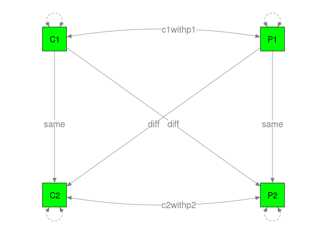

    

    
# TSSEM    
## Data preparation

```r
library(metaSEM)

## Check the total sample size per correlation
pattern.n(Mathieu15$data, Mathieu15$n)
```

```
##     C1  P1  C2  P2
## C1 737 737 737 737
## P1 737 737 737 737
## C2 737 737 737 737
## P2 737 737 737 737
```

```r
## Check the number of studies per correlation
pattern.na(Mathieu15$data, show.na=FALSE)
```

```
##    C1 P1 C2 P2
## C1 17 17 17 17
## P1 17 17 17 17
## C2 17 17 17 17
## P2 17 17 17 17
```

## Model 1: no constraint

```r
## Stage 1 analysis
tssem1.fit <- tssem1(Mathieu15$data, Mathieu15$n)
summary(tssem1.fit)
```

```
## 
## Call:
## meta(y = ES, v = acovR, RE.constraints = Diag(paste0(RE.startvalues, 
##     "*Tau2_", 1:no.es, "_", 1:no.es)), RE.lbound = RE.lbound, 
##     I2 = I2, model.name = model.name, suppressWarnings = TRUE, 
##     silent = silent, run = run)
## 
## 95% confidence intervals: z statistic approximation (robust=FALSE)
## Coefficients:
##              Estimate  Std.Error     lbound     ubound z value  Pr(>|z|)    
## Intercept1  0.2527926  0.0647341  0.1259161  0.3796691  3.9051 9.419e-05 ***
## Intercept2  0.5537883  0.0613160  0.4336111  0.6739654  9.0317 < 2.2e-16 ***
## Intercept3  0.2535685  0.0393637  0.1764171  0.3307199  6.4417 1.182e-10 ***
## Intercept4  0.2563420  0.0375261  0.1827921  0.3298919  6.8310 8.431e-12 ***
## Intercept5  0.5033473  0.0626103  0.3806334  0.6260613  8.0394 8.882e-16 ***
## Intercept6  0.3668558  0.0564265  0.2562618  0.4774497  6.5015 7.954e-11 ***
## Tau2_1_1    0.0445385  0.0205932  0.0041766  0.0849004  2.1628   0.03056 *  
## Tau2_2_2    0.0462091  0.0199585  0.0070911  0.0853270  2.3153   0.02060 *  
## Tau2_3_3    0.0041919  0.0063589 -0.0082712  0.0166551  0.6592   0.50975    
## Tau2_4_4    0.0022343  0.0063944 -0.0102984  0.0147670  0.3494   0.72677    
## Tau2_5_5    0.0485404  0.0213135  0.0067668  0.0903140  2.2775   0.02276 *  
## Tau2_6_6    0.0307882  0.0145662  0.0022390  0.0593374  2.1137   0.03454 *  
## ---
## Signif. codes:  0 '***' 0.001 '**' 0.01 '*' 0.05 '.' 0.1 ' ' 1
## 
## Q statistic on the homogeneity of effect sizes: 457.6935
## Degrees of freedom of the Q statistic: 96
## P value of the Q statistic: 0
## 
## Heterogeneity indices (based on the estimated Tau2):
##                              Estimate
## Intercept1: I2 (Q statistic)   0.6849
## Intercept2: I2 (Q statistic)   0.7971
## Intercept3: I2 (Q statistic)   0.1667
## Intercept4: I2 (Q statistic)   0.0966
## Intercept5: I2 (Q statistic)   0.8006
## Intercept6: I2 (Q statistic)   0.6281
## 
## Number of studies (or clusters): 17
## Number of observed statistics: 102
## Number of estimated parameters: 12
## Degrees of freedom: 90
## -2 log likelihood: -17.83565 
## OpenMx status1: 0 ("0" or "1": The optimization is considered fine.
## Other values may indicate problems.)
```

```r
## Average correlation matrix
coeffs <- vec2symMat( coef(tssem1.fit, select="fixed"), diag=FALSE )
coeffs
```

```
##           [,1]      [,2]      [,3]      [,4]
## [1,] 1.0000000 0.2527926 0.5537883 0.2535685
## [2,] 0.2527926 1.0000000 0.2563420 0.5033473
## [3,] 0.5537883 0.2563420 1.0000000 0.3668558
## [4,] 0.2535685 0.5033473 0.3668558 1.0000000
```

```r
## Heterogeneity variances
heter <- vec2symMat( coef(tssem1.fit, select="random"), diag=FALSE )
heter
```

```
##             [,1]        [,2]        [,3]        [,4]
## [1,] 1.000000000 0.044538532 0.046209059 0.004191929
## [2,] 0.044538532 1.000000000 0.002234318 0.048540404
## [3,] 0.046209059 0.002234318 1.000000000 0.030788208
## [4,] 0.004191929 0.048540404 0.030788208 1.000000000
```

```r
## Combine them in a matrix
coeffs[upper.tri(coeffs)] <- 0
heter[lower.tri(heter)] <- 0
combined <- coeffs + heter
diag(combined) <- 1
combined
```

```
##           [,1]       [,2]        [,3]        [,4]
## [1,] 1.0000000 0.04453853 0.046209059 0.004191929
## [2,] 0.2527926 1.00000000 0.002234318 0.048540404
## [3,] 0.5537883 0.25634196 1.000000000 0.030788208
## [4,] 0.2535685 0.50334732 0.366855752 1.000000000
```

```r
## Proposed model in lavaan syntax
model1 <- 'C2 ~ c2c*C1 + p2c*P1
           P2 ~ c2p*C1 + p2p*P1
           C1 ~~ c1withp1*P1
           C1 ~~ 1*C1
           P1 ~~ 1*P1
           C2 ~~ c2withp2*P2'

## Display the proposed model
plot(model1, color="green", edge.label.position=0.55)
```

<!-- -->

```r
## Convert the lavaan model to RAM specification
RAM1 <- lavaan2RAM(model1, obs.variables=c("C1", "P1", "C2", "P2"))
RAM1
```

```
## $A
##    C1      P1      C2  P2 
## C1 "0"     "0"     "0" "0"
## P1 "0"     "0"     "0" "0"
## C2 "0*c2c" "0*p2c" "0" "0"
## P2 "0*c2p" "0*p2p" "0" "0"
## 
## $S
##    C1           P1           C2           P2          
## C1 "1"          "0*c1withp1" "0"          "0"         
## P1 "0*c1withp1" "1"          "0"          "0"         
## C2 "0"          "0"          "0*C2WITHC2" "0*c2withp2"
## P2 "0"          "0"          "0*c2withp2" "0*P2WITHP2"
## 
## $F
##    C1 P1 C2 P2
## C1  1  0  0  0
## P1  0  1  0  0
## C2  0  0  1  0
## P2  0  0  0  1
## 
## $M
##   C1 P1 C2 P2
## 1  0  0  0  0
```

```r
## Stage 2 analysis
tssem1b.fit <- tssem2(tssem1.fit, RAM=RAM1)
summary(tssem1b.fit)
```

```
## 
## Call:
## wls(Cov = pooledS, aCov = aCov, n = tssem1.obj$total.n, RAM = RAM, 
##     Amatrix = Amatrix, Smatrix = Smatrix, Fmatrix = Fmatrix, 
##     diag.constraints = diag.constraints, cor.analysis = cor.analysis, 
##     intervals.type = intervals.type, mx.algebras = mx.algebras, 
##     model.name = model.name, suppressWarnings = suppressWarnings, 
##     silent = silent, run = run)
## 
## 95% confidence intervals: z statistic approximation
## Coefficients:
##          Estimate Std.Error   lbound   ubound z value  Pr(>|z|)    
## c2c      0.522368  0.065450 0.394088 0.650649  7.9811 1.554e-15 ***
## p2c      0.124291  0.047479 0.031233 0.217349  2.6178  0.008850 ** 
## c2p      0.134950  0.047463 0.041924 0.227975  2.8433  0.004465 ** 
## p2p      0.469233  0.066892 0.338128 0.600338  7.0148 2.303e-12 ***
## c1withp1 0.252793  0.064734 0.125916 0.379669  3.9051 9.419e-05 ***
## c2withp2 0.171838  0.056284 0.061524 0.282152  3.0531  0.002265 ** 
## ---
## Signif. codes:  0 '***' 0.001 '**' 0.01 '*' 0.05 '.' 0.1 ' ' 1
## 
## Goodness-of-fit indices:
##                                             Value
## Sample size                                737.00
## Chi-square of target model                   0.00
## DF of target model                           0.00
## p value of target model                      0.00
## Number of constraints imposed on "Smatrix"   0.00
## DF manually adjusted                         0.00
## Chi-square of independence model           203.64
## DF of independence model                     6.00
## RMSEA                                        0.00
## RMSEA lower 95% CI                           0.00
## RMSEA upper 95% CI                           0.00
## SRMR                                         0.00
## TLI                                          -Inf
## CFI                                          1.00
## AIC                                          0.00
## BIC                                          0.00
## OpenMx status1: 0 ("0" or "1": The optimization is considered fine.
## Other values indicate problems.)
```

```r
## Figure 2 in the paper
## svg(file="Fig2.svg", width=4, height=4)
plot(tssem1b.fit, col="yellow", edge.label.position=0.58)
```

<!-- -->

```r
## dev.off()
```

## Model 2: Equality constraints on the path coefficients

```r
## Proposed model with equal effects time 1 to time 2
model2 <- 'C2 ~ same*C1 + diff*P1
           P2 ~ diff*C1 + same*P1
           C1 ~~ c1withp1*P1
           C1 ~~ 1*C1
           P1 ~~ 1*P1
           C2 ~~ c2withp2*P2'

## Display the proposed model
plot(model2, color="green", edge.label.position=0.55)
```

<!-- -->

```r
## Convert the lavaan model to RAM specification
RAM2 <- lavaan2RAM(model2, obs.variables=c("C1", "P1", "C2", "P2"))
RAM2
```

```
## $A
##    C1       P1       C2  P2 
## C1 "0"      "0"      "0" "0"
## P1 "0"      "0"      "0" "0"
## C2 "0*same" "0*diff" "0" "0"
## P2 "0*diff" "0*same" "0" "0"
## 
## $S
##    C1           P1           C2           P2          
## C1 "1"          "0*c1withp1" "0"          "0"         
## P1 "0*c1withp1" "1"          "0"          "0"         
## C2 "0"          "0"          "0*C2WITHC2" "0*c2withp2"
## P2 "0"          "0"          "0*c2withp2" "0*P2WITHP2"
## 
## $F
##    C1 P1 C2 P2
## C1  1  0  0  0
## P1  0  1  0  0
## C2  0  0  1  0
## P2  0  0  0  1
## 
## $M
##   C1 P1 C2 P2
## 1  0  0  0  0
```

```r
## Stage 2 analysis
tssem2b.fit <- tssem2(tssem1.fit, RAM=RAM2)
summary(tssem2b.fit)
```

```
## 
## Call:
## wls(Cov = pooledS, aCov = aCov, n = tssem1.obj$total.n, RAM = RAM, 
##     Amatrix = Amatrix, Smatrix = Smatrix, Fmatrix = Fmatrix, 
##     diag.constraints = diag.constraints, cor.analysis = cor.analysis, 
##     intervals.type = intervals.type, mx.algebras = mx.algebras, 
##     model.name = model.name, suppressWarnings = suppressWarnings, 
##     silent = silent, run = run)
## 
## 95% confidence intervals: z statistic approximation
## Coefficients:
##          Estimate Std.Error   lbound   ubound z value  Pr(>|z|)    
## same     0.496344  0.046339 0.405521 0.587167 10.7111 < 2.2e-16 ***
## diff     0.129621  0.037834 0.055468 0.203775  3.4260 0.0006124 ***
## c1withp1 0.252787  0.064734 0.125911 0.379664  3.9050 9.422e-05 ***
## c2withp2 0.171735  0.056256 0.061475 0.281996  3.0527 0.0022677 ** 
## ---
## Signif. codes:  0 '***' 0.001 '**' 0.01 '*' 0.05 '.' 0.1 ' ' 1
## 
## Goodness-of-fit indices:
##                                               Value
## Sample size                                737.0000
## Chi-square of target model                   0.3420
## DF of target model                           2.0000
## p value of target model                      0.8428
## Number of constraints imposed on "Smatrix"   0.0000
## DF manually adjusted                         0.0000
## Chi-square of independence model           203.6373
## DF of independence model                     6.0000
## RMSEA                                        0.0000
## RMSEA lower 95% CI                           0.0000
## RMSEA upper 95% CI                           0.0412
## SRMR                                         0.0146
## TLI                                          1.0252
## CFI                                          1.0000
## AIC                                         -3.6580
## BIC                                        -12.8632
## OpenMx status1: 0 ("0" or "1": The optimization is considered fine.
## Other values indicate problems.)
```

```r
anova(tssem1b.fit, tssem2b.fit)
```

```
##                 base         comparison ep     minus2LL df AIC    diffLL diffdf         p
## 1 TSSEM2 Correlation               <NA>  6 1.437588e-20 -6  NA        NA     NA        NA
## 2 TSSEM2 Correlation TSSEM2 Correlation  4 3.419907e-01 -4  NA 0.3419907      2 0.8428255
```

```r
## Plot the model
plot(tssem2b.fit, col="yellow", edge.label.position=0.60)
```

<!-- -->

# OSMASEM
## Data preparation

```r
my.df <- Cor2DataFrame(Mathieu15)
    
head(my.df$data)
```

```
##                            P1_C1 C2_C1 P2_C1 C2_P1 P2_P1 P2_C2 C(P1_C1 P1_C1) C(C2_C1 P1_C1)
## Bakeman & Helmreich (1975)  0.18  0.31  0.13  0.72  0.82  0.73     0.08570868    0.011798768
## Carron & Ball (1977)        0.53  0.82  0.39  0.77  0.80  0.79     0.07142395    0.009832353
## Landers et al. (1982)       0.83  0.95  0.80  0.85  0.92  0.77     0.08570865    0.011798730
## Williams & Hacker (1982)    0.87  0.87  0.72  0.87  0.80  0.73     0.06122051    0.008427706
## Greene (1989)              -0.05  0.50  0.17  0.30  0.65  0.15     0.01587199    0.002184975
## Marsh (1996)               -0.03  0.45  0.20 -0.06  0.30  0.11     0.03571198    0.004916170
##                            C(P2_C1 P1_C1) C(C2_P1 P1_C1) C(P2_P1 P1_C1) C(P2_C2 P1_C1)
## Bakeman & Helmreich (1975)    0.044360091    0.045083553    0.011889965    0.021995880
## Carron & Ball (1977)          0.036966811    0.037569705    0.009908346    0.018329983
## Landers et al. (1982)         0.044360063    0.045083535    0.011889927    0.021995884
## Williams & Hacker (1982)      0.031685819    0.032202574    0.008492858    0.015711376
## Greene (1989)                 0.008214852    0.008348833    0.002201855    0.004073339
## Marsh (1996)                  0.018483414    0.018784860    0.004954172    0.009164996
##                            C(C2_C1 C2_C1) C(P2_C1 C2_C1) C(C2_P1 C2_C1) C(P2_P1 C2_C1)
## Bakeman & Helmreich (1975)    0.049206278    0.019176829    0.013425738   0.0036951356
## Carron & Ball (1977)          0.041005254    0.015980740    0.011188186   0.0030793022
## Landers et al. (1982)         0.049206262    0.019176796    0.013425715   0.0036950838
## Williams & Hacker (1982)      0.035147350    0.013697750    0.009589834   0.0026393786
## Greene (1989)                 0.009112282    0.003551280    0.002486273   0.0006842892
## Marsh (1996)                  0.020502627    0.007990367    0.005594084   0.0015396453
##                            C(P2_C2 C2_C1) C(P2_C1 P2_C1) C(C2_P1 P2_C1) C(P2_P1 P2_C1)
## Bakeman & Helmreich (1975)    0.009546255     0.08764910    0.024322620    0.013743881
## Carron & Ball (1977)          0.007955283     0.07304098    0.020268951    0.011453277
## Landers et al. (1982)         0.009546250     0.08764908    0.024322603    0.013743842
## Williams & Hacker (1982)      0.006818768     0.06260653    0.017373352    0.009817082
## Greene (1989)                 0.001767848     0.01623134    0.004504219    0.002545171
## Marsh (1996)                  0.003977633     0.03652050    0.010134481    0.005726639
##                            C(P2_C2 P2_C1) C(C2_P1 C2_P1) C(P2_P1 C2_P1) C(P2_C2 C2_P1)
## Bakeman & Helmreich (1975)    0.041930328     0.08743524    0.019447355    0.041090495
## Carron & Ball (1977)          0.034942025     0.07286278    0.016206186    0.034242171
## Landers et al. (1982)         0.041930333     0.08743523    0.019447321    0.041090496
## Williams & Hacker (1982)      0.029950269     0.06245377    0.013890994    0.029350388
## Greene (1989)                 0.007764902     0.01619174    0.003601378    0.007609385
## Marsh (1996)                  0.017471017     0.03643139    0.008103090    0.017121086
##                            C(P2_P1 P2_P1) C(P2_C2 P2_P1) C(P2_C2 P2_C2) Year
## Bakeman & Helmreich (1975)    0.050566982    0.009920789     0.07625760 1975
## Carron & Ball (1977)          0.042139174    0.008267371     0.06354807 1977
## Landers et al. (1982)         0.050566974    0.009920763     0.07625761 1982
## Williams & Hacker (1982)      0.036119288    0.007086292     0.05446975 1982
## Greene (1989)                 0.009364262    0.001837196     0.01412180 1989
## Marsh (1996)                  0.021069585    0.004133684     0.03177404 1996
##                                                                         Sample Student
## Bakeman & Helmreich (1975)                           Scientific research teams       0
## Carron & Ball (1977)                                              Hockey teams       0
## Landers et al. (1982)                              Intramural basketball teams       0
## Williams & Hacker (1982)                    Intercollegiate field hockey teams       0
## Greene (1989)              Mix of aircraft engineering and manufacturing teams       0
## Marsh (1996)                                    MBA students on class projects       1
```

## Model without any moderator

```r
osmasem.fit1 <- osmasem(model.name="No moderator", RAM=RAM1, data=my.df)
summary(osmasem.fit1)
```

```
## Summary of No moderator 
##  
## free parameters:
##        name  matrix row col   Estimate  Std.Error A   z value     Pr(>|z|)
## 1       c2c      A0  C2  C1  0.5223683 0.06545030    7.981144 1.554312e-15
## 2       c2p      A0  P2  C1  0.1349498 0.04746288    2.843270 4.465328e-03
## 3       p2c      A0  C2  P1  0.1242910 0.04747925    2.617797 8.849938e-03
## 4       p2p      A0  P2  P1  0.4692329 0.06689178    7.014807 2.302603e-12
## 5  c1withp1      S0  P1  C1  0.2527924 0.06473407    3.905091 9.418997e-05
## 6  c2withp2      S0  P2  C2  0.1718380 0.05628393    3.053056 2.265238e-03
## 7    Tau1_1 vecTau1   1   1 -1.5557005 0.23118388   -6.729277 1.705081e-11
## 8    Tau1_2 vecTau1   2   1 -1.5372893 0.21595868   -7.118442 1.091571e-12
## 9    Tau1_3 vecTau1   3   1 -2.7372978 0.75846706   -3.608987 3.073950e-04
## 10   Tau1_4 vecTau1   4   1 -3.0519047 1.43092812   -2.132815 3.293992e-02
## 11   Tau1_5 vecTau1   5   1 -1.5126792 0.21954363   -6.890107 5.575096e-12
## 12   Tau1_6 vecTau1   6   1 -1.7403119 0.23655455   -7.356916 1.882938e-13
## 
## Model Statistics: 
##                |  Parameters  |  Degrees of Freedom  |  Fit (-2lnL units)
##        Model:             12                     90             -17.83565
##    Saturated:             27                     75                    NA
## Independence:             12                     90                    NA
## Number of observations/statistics: 737/102
## 
## Information Criteria: 
##       |  df Penalty  |  Parameters Penalty  |  Sample-Size Adjusted
## AIC:      -197.8356               6.164354                 6.595294
## BIC:      -612.0686              61.395409                23.291283
## To get additional fit indices, see help(mxRefModels)
## timestamp: 2020-08-26 17:57:07 
## Wall clock time: 0.2286499 secs 
## optimizer:  SLSQP 
## OpenMx version number: 2.17.4 
## Need help?  See help(mxSummary)
```

```r
## Extract the heterogeneity variance-covariance matrix
diag(VarCorr(osmasem.fit1))
```

```
##      Tau2_1      Tau2_2      Tau2_3      Tau2_4      Tau2_5      Tau2_6 
## 0.044538513 0.046209094 0.004191923 0.002234340 0.048540424 0.030788198
```

```r
plot(osmasem.fit1, col="yellow", edge.label.position=0.6)
```

<!-- -->

## Model with student sample as a moderator on the regression coefficients

```r
## Create a matrix with "Student" as a moderator
A1 <- create.modMatrix(RAM1, output="A", "Student")
A1
```

```
##    C1               P1               C2  P2 
## C1 "0"              "0"              "0" "0"
## P1 "0"              "0"              "0" "0"
## C2 "0*data.Student" "0*data.Student" "0" "0"
## P2 "0*data.Student" "0*data.Student" "0" "0"
```

```r
osmasem.fit2 <- osmasem(model.name="Student sample as a moderator", 
                        RAM=RAM1, Ax=A1, data=my.df)
summary(osmasem.fit2)
```

```
## Summary of Student sample as a moderator 
##  
## free parameters:
##        name  matrix row col    Estimate   Std.Error A     z value     Pr(>|z|)
## 1       c2c      A0  C2  C1  0.53040807  0.13293028    3.99012238 6.603921e-05
## 2       c2p      A0  P2  C1  0.12142140  0.10775659    1.12681189 2.598220e-01
## 3       p2c      A0  C2  P1  0.35393024  0.09817029    3.60526832 3.118306e-04
## 4       p2p      A0  P2  P1  0.67104535  0.12527896    5.35640890 8.489227e-08
## 5  c1withp1      S0  P1  C1  0.26837369  0.06417570    4.18185864 2.891357e-05
## 6  c2withp2      S0  P2  C2  0.16069180  0.05827487    2.75748030 5.824872e-03
## 7     c2c_1      A1  C2  C1 -0.01473135  0.15237176   -0.09668033 9.229803e-01
## 8     c2p_1      A1  P2  C1  0.01697291  0.11499828    0.14759270 8.826642e-01
## 9     p2c_1      A1  C2  P1 -0.27771668  0.10692792   -2.59723268 9.397824e-03
## 10    p2p_1      A1  P2  P1 -0.26756191  0.14429135   -1.85431712 6.369380e-02
## 11   Tau1_1 vecTau1   1   1 -1.57117710  0.23500459   -6.68572929 2.297784e-11
## 12   Tau1_2 vecTau1   2   1 -1.55010340  0.21622277   -7.16901082 7.553957e-13
## 13   Tau1_3 vecTau1   3   1 -2.76444493  0.78849360   -3.50598272 4.549247e-04
## 14   Tau1_4 vecTau1   4   1 -4.48156050 17.05025588   -0.26284418 7.926707e-01
## 15   Tau1_5 vecTau1   5   1 -1.59217793  0.21581940   -7.37736249 1.614264e-13
## 16   Tau1_6 vecTau1   6   1 -1.68537661  0.22731482   -7.41428399 1.223466e-13
## 
## Model Statistics: 
##                |  Parameters  |  Degrees of Freedom  |  Fit (-2lnL units)
##        Model:             16                     86             -30.01815
##    Saturated:             27                     75                    NA
## Independence:             12                     90                    NA
## Number of observations/statistics: 737/102
## 
## Information Criteria: 
##       |  df Penalty  |  Parameters Penalty  |  Sample-Size Adjusted
## AIC:      -202.0181               1.981854                 2.737409
## BIC:      -597.8407              75.623260                24.817759
## To get additional fit indices, see help(mxRefModels)
## timestamp: 2020-08-26 17:57:08 
## Wall clock time: 0.3726621 secs 
## optimizer:  SLSQP 
## OpenMx version number: 2.17.4 
## Need help?  See help(mxSummary)
```

```r
## Compare the models with and without the moderator
anova(osmasem.fit2, osmasem.fit1)
```

```
##                            base   comparison ep  minus2LL df       AIC  diffLL diffdf          p
## 1 Student sample as a moderator         <NA> 16 -30.01815 86 -202.0181      NA     NA         NA
## 2 Student sample as a moderator No moderator 12 -17.83565 90 -197.8356 12.1825      4 0.01604451
```

```r
## Get the R2 of the moderator
osmasemR2(osmasem.fit2, osmasem.fit1)
```

```
## $Tau2.0
##    Tau2_1_1    Tau2_2_2    Tau2_3_3    Tau2_4_4    Tau2_5_5    Tau2_6_6 
## 0.044538513 0.046209094 0.004191923 0.002234340 0.048540424 0.030788198 
## 
## $Tau2.1
##    Tau2_1_1    Tau2_2_2    Tau2_3_3    Tau2_4_4    Tau2_5_5    Tau2_6_6 
## 0.043181022 0.045039887 0.003970394 0.000128046 0.041404907 0.034363744 
## 
## $R2
##   Tau2_1_1   Tau2_2_2   Tau2_3_3   Tau2_4_4   Tau2_5_5   Tau2_6_6 
## 0.03047904 0.02530254 0.05284663 0.94269181 0.14700153 0.00000000
```

```r
## Path coefficients for non-student sample
mxEval(A0, osmasem.fit2$mx.fit)
```

```
##           C1        P1 C2 P2
## C1 0.0000000 0.0000000  0  0
## P1 0.0000000 0.0000000  0  0
## C2 0.5304081 0.3539302  0  0
## P2 0.1214214 0.6710454  0  0
```

```r
## Path coefficients for student sample
mxEval(A0+A1, osmasem.fit2$mx.fit)
```

```
##           C1         P1 C2 P2
## C1 0.0000000 0.00000000  0  0
## P1 0.0000000 0.00000000  0  0
## C2 0.5156767 0.07621356  0  0
## P2 0.1383943 0.40348344  0  0
```

```r
sessionInfo()
```

```
## R version 4.0.2 (2020-06-22)
## Platform: x86_64-pc-linux-gnu (64-bit)
## Running under: Ubuntu 20.04.1 LTS
## 
## Matrix products: default
## BLAS:   /usr/lib/x86_64-linux-gnu/blas/libblas.so.3.9.0
## LAPACK: /usr/lib/x86_64-linux-gnu/lapack/liblapack.so.3.9.0
## 
## locale:
##  [1] LC_CTYPE=en_SG.UTF-8       LC_NUMERIC=C               LC_TIME=en_SG.UTF-8       
##  [4] LC_COLLATE=en_SG.UTF-8     LC_MONETARY=en_SG.UTF-8    LC_MESSAGES=en_SG.UTF-8   
##  [7] LC_PAPER=en_SG.UTF-8       LC_NAME=C                  LC_ADDRESS=C              
## [10] LC_TELEPHONE=C             LC_MEASUREMENT=en_SG.UTF-8 LC_IDENTIFICATION=C       
## 
## attached base packages:
## [1] stats     graphics  grDevices utils     datasets  methods   base     
## 
## other attached packages:
## [1] metaSEM_1.2.4.1 OpenMx_2.17.4  
## 
## loaded via a namespace (and not attached):
##   [1] nlme_3.1-147        RColorBrewer_1.1-2  mi_1.0              tools_4.0.2        
##   [5] backports_1.1.8     R6_2.4.1            d3Network_0.5.2.1   rpart_4.1-15       
##   [9] Hmisc_4.4-0         colorspace_1.4-1    nnet_7.3-14         tidyselect_1.1.0   
##  [13] gridExtra_2.3       mnormt_2.0.1        compiler_4.0.2      fdrtool_1.2.15     
##  [17] qgraph_1.6.5        htmlTable_1.13.3    regsem_1.5.2        scales_1.1.0       
##  [21] checkmate_2.0.0     psych_1.9.12.31     mvtnorm_1.1-1       pbapply_1.4-2      
##  [25] sem_3.1-9           stringr_1.4.0       digest_0.6.25       pbivnorm_0.6.0     
##  [29] foreign_0.8-80      minqa_1.2.4         rmarkdown_2.3       base64enc_0.1-3    
##  [33] jpeg_0.1-8.1        pkgconfig_2.0.3     htmltools_0.4.0     lme4_1.1-23        
##  [37] lisrelToR_0.1.4     htmlwidgets_1.5.1   rlang_0.4.7         huge_1.3.4.1       
##  [41] rstudioapi_0.11     generics_0.0.2      gtools_3.8.2        acepack_1.4.1      
##  [45] dplyr_1.0.0         zip_2.0.4           magrittr_1.5        Formula_1.2-3      
##  [49] Matrix_1.2-18       Rcpp_1.0.5          munsell_0.5.0       abind_1.4-5        
##  [53] rockchalk_1.8.144   lifecycle_0.2.0     whisker_0.4         stringi_1.4.6      
##  [57] yaml_2.2.1          carData_3.0-4       MASS_7.3-52         plyr_1.8.6         
##  [61] matrixcalc_1.0-3    lavaan_0.6-6        grid_4.0.2          parallel_4.0.2     
##  [65] crayon_1.3.4        lattice_0.20-41     semPlot_1.1.2       kutils_1.70        
##  [69] splines_4.0.2       tmvnsim_1.0-2       knitr_1.28          pillar_1.4.4       
##  [73] igraph_1.2.5        rjson_0.2.20        boot_1.3-25         corpcor_1.6.9      
##  [77] BDgraph_2.62        reshape2_1.4.4      stats4_4.0.2        XML_3.99-0.3       
##  [81] glue_1.4.1          evaluate_0.14       latticeExtra_0.6-29 data.table_1.12.8  
##  [85] png_0.1-7           vctrs_0.3.2         nloptr_1.2.2.1      gtable_0.3.0       
##  [89] purrr_0.3.4         ggplot2_3.3.2       xfun_0.13           openxlsx_4.1.5     
##  [93] xtable_1.8-4        coda_0.19-3         Rsolnp_1.16         glasso_1.11        
##  [97] survival_3.1-12     truncnorm_1.0-8     tibble_3.0.1        arm_1.11-1         
## [101] ellipse_0.4.2       cluster_2.1.0       statmod_1.4.34      ellipsis_0.3.1
```
