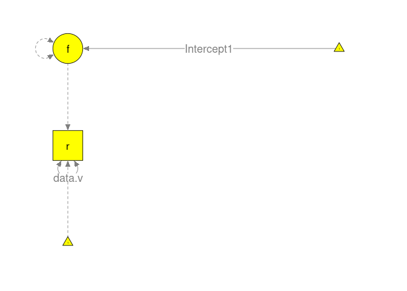
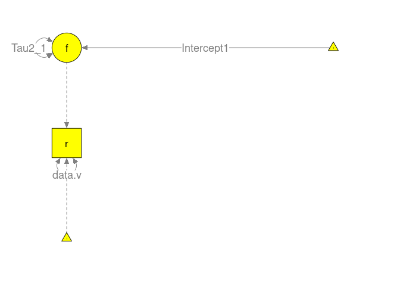
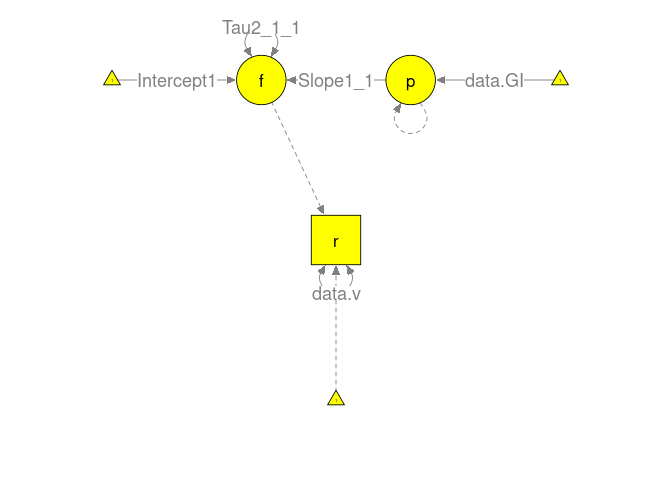
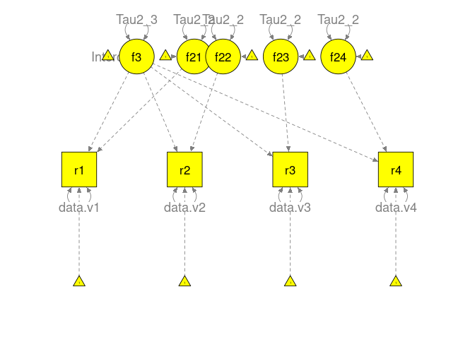
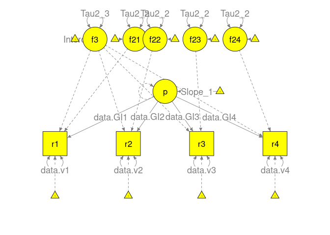
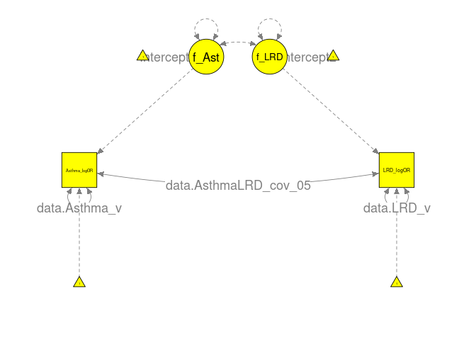
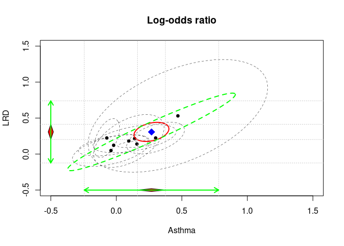
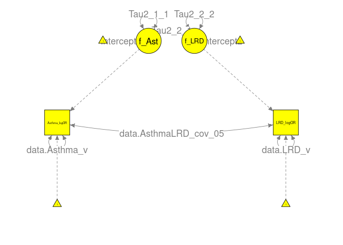
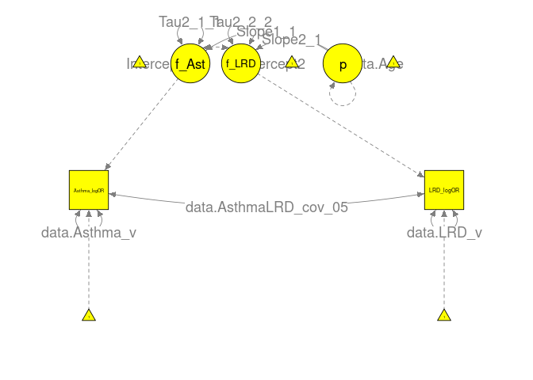

<style>
.main-container { width: 1200px; max-width:2800px;}
</style>


# Univariate meta-analysis
## Data preparation

```r
options(width=200)

library(metaSEM)
```

```
## Loading required package: OpenMx
```

```
## To take full advantage of multiple cores, use:
##   mxOption(key='Number of Threads', value=parallel::detectCores()) #now
##   Sys.setenv(OMP_NUM_THREADS=parallel::detectCores()) #before library(OpenMx)
```

```
## "SLSQP" is set as the default optimizer in OpenMx.
```

```
## mxOption(NULL, "Gradient algorithm") is set at "central".
```

```
## mxOption(NULL, "Optimality tolerance") is set at "6.3e-14".
```

```
## mxOption(NULL, "Gradient iterations") is set at "2".
```

```r
head(Stadler15)
```

```
##   ID                 Authors Year   N CPSMeasure  IntelligenceMeasure    r           v
## 1  1     Abele et al. (2012) 2012 167        MCS            Reasoning 0.40 0.004250602
## 2  2 Beckman & Guthke (1995) 1995  92  Classical General intelligence 0.15 0.010500069
## 3  3    Buhner et al. (2008) 2008 144        SCS            Reasoning 0.16 0.006639548
## 4  4 Burkolter et al. (2009) 2009  41  Classical General intelligence 0.75 0.004785156
## 5  5 Burkolter et al. (2010) 2010  39  Classical General intelligence 0.22 0.023830067
## 6  6       Burmeister (2009) 2009  44  Classical General intelligence 0.47 0.014116205
```

```r
## Make a copy of the data
df1 <- Stadler15

## Convert General Intelligence vs Reasoning to an indicator of General Intelligence of 0 and 1
GI <- ifelse(Stadler15$IntelligenceMeasure=="General intelligence", yes=1, no=0)
df1 <- Stadler15[, c("Authors", "r", "v")]
df1$GI <- GI

df1
```

```
##                             Authors     r            v GI
## 1               Abele et al. (2012)  0.40 4.250602e-03  0
## 2           Beckman & Guthke (1995)  0.15 1.050007e-02  1
## 3              Buhner et al. (2008)  0.16 6.639548e-03  0
## 4           Burkolter et al. (2009)  0.75 4.785156e-03  1
## 5           Burkolter et al. (2010)  0.22 2.383007e-02  1
## 6                 Burmeister (2009)  0.47 1.411620e-02  1
## 7                     Danner (2011)  0.86 3.942335e-04  0
## 8              Dorner et al. (1983) -0.03 2.123832e-02  0
## 9              Dorner et al. (1983)  0.12 2.066824e-02  0
## 10             Gediga et al. (1984)  0.09 3.513806e-02  1
## 11           Gonzales et al. (2005)  0.71 1.756549e-02  0
## 12           Gonzales et al. (2005)  0.63 1.347147e-02  0
## 13           Gonzales et al. (2005)  0.33 1.087752e-02  0
## 14          Greiff & Fischer (2013)  0.50 4.046763e-03  0
## 15             Greiff et al. (2015)  0.24 2.627567e-03  0
## 16             Greiff et al. (2015)  0.52 1.574900e-03  0
## 17             Guss & Dorner (2011)  0.19 1.821771e-03  1
## 18                Hasselmann (1993)  0.26 4.346849e-02  1
## 19                     Hesse (1982) -0.17 3.251846e-02  0
## 20                     Hesse (1982)  0.06 3.423493e-02  0
## 21                     Hesse (1982)  0.38 2.524315e-02  0
## 22                     Hesse (1982)  0.46 2.143361e-02  0
## 23          Hormann & Thomas (1989)  0.46 3.453192e-02  1
## 24          Hormann & Thomas (1989) -0.03 4.991004e-02  1
## 25                     Hussy (1985) -0.30 5.915000e-02  0
## 26                     Hussy (1985)  0.25 6.277902e-02  0
## 27                     Hussy (1985)  0.35 5.500045e-02  0
## 28                     Hussy (1985)  0.50 4.017857e-02  0
## 29                     Hussy (1989)  0.38 4.784649e-03  1
## 30                  Kersting (2001)  0.26 8.871120e-03  1
## 31             Klieme et al. (2001)  0.58 6.785284e-04  0
## 32              Kluge et al. (2011)  0.13 2.612123e-02  1
## 33               Kretzschmar (2010)  0.30 7.077778e-03  1
## 34 Kretzschmar et al. (Unpublished)  0.34 3.990629e-03  1
## 35                    Kroner (2001)  0.51 2.027600e-02  0
## 36             Kroner et al. (2005)  0.67 3.037112e-03  0
## 37            Leutner et al. (2004)  0.63 6.811416e-04  1
## 38            Leutner et al. (2005)  0.84 1.327280e-04  0
## 39                   Leutner (2002)  0.43 3.338633e-03  0
## 40                   Leutner (2002)  0.05 3.685208e-02  0
## 41            Neubert et al. (2014)  0.62 6.590667e-04  0
## 42             Putz-Osterloh (1985)  0.36 1.546115e-02  1
## 43              Rigas et al. (2002)  0.33 1.301736e-02  0
## 44       Scherer & Tiemann a (2014)  0.55 6.051073e-04  0
## 45       Scherer & Tiemann b (2014)  0.58 2.963425e-04  0
## 46        Sonnleitner et al. (2012)  0.30 1.380167e-02  0
## 47        Stadler et al. (In press)  0.20 1.196883e-02  1
## 48     Stadler et al. (Unpublished)  0.83 6.048951e-04  0
## 49     Stadler et al. (Unpublished)  0.74 8.089556e-04  0
## 50                Sub et al. (1991)  0.47 4.817435e-03  0
## 51                Sub et al. (1993)  0.40 3.312676e-03  0
## 52        Wagener & Wittmann (2002)  0.63 1.069793e-02  0
## 53                   Wagener (2001)  0.31 1.317799e-02  0
## 54                   Wagener (2001)  0.20 1.316571e-02  1
## 55                   Wagener (2001)  0.47 4.496273e-03  1
## 56                   Wagener (2001)  0.24 1.776236e-02  1
## 57             Wirth & Funke (2005)  0.46 9.047665e-04  0
## 58           Wittmann et al. (1996)  0.57 5.008352e-03  1
## 59         Wustenberg et al. (2012)  0.59 1.922958e-03  0
## 60         Wustenberg et al. (2014)  0.66 9.985811e-05  0
```

## Fixed-effect model

```r
## Use the meta function directly
summary( meta(y=r, v=v, RE.constraints=0, data=df1) )
```

```
## 
## Call:
## meta(y = r, v = v, data = df1, RE.constraints = 0)
## 
## 95% confidence intervals: z statistic approximation (robust=FALSE)
## Coefficients:
##             Estimate Std.Error    lbound    ubound z value  Pr(>|z|)    
## Intercept1 0.6505290 0.0049795 0.6407693 0.6602887  130.64 < 2.2e-16 ***
## ---
## Signif. codes:  0 '***' 0.001 '**' 0.01 '*' 0.05 '.' 0.1 ' ' 1
## 
## Q statistic on the homogeneity of effect sizes: 1155.141
## Degrees of freedom of the Q statistic: 59
## P value of the Q statistic: 0
## 
## Heterogeneity indices (based on the estimated Tau2):
##                              Estimate
## Intercept1: I2 (Q statistic)        0
## 
## Number of studies (or clusters): 60
## Number of observed statistics: 60
## Number of estimated parameters: 1
## Degrees of freedom: 59
## -2 log likelihood: 963.053 
## OpenMx status1: 0 ("0" or "1": The optimization is considered fine.
## Other values may indicate problems.)
```

```r
## Create a SEM manually
model_fix <- "f =~ 1*r
              ## Average effect
              f ~ Intercept1*1        
              ## Heterogeneity variance is fixed at 0
              f ~~ 0*f     
              ## Known sampling variance
              ## data.v means that the parameter is fixed at the value of
              ## the variable named 'v' in the dataset.
              r ~~ data.v*r"

plot(model_fix, col="yellow")
```

<!-- -->

```r
## Convert the lavaan model to RAM
RAM_fix <- lavaan2RAM(model_fix, std.lv=FALSE)
RAM_fix
```

```
## $A
##   r   f  
## r "0" "1"
## f "0" "0"
## 
## $S
##   r          f  
## r "0*data.v" "0"
## f "0"        "0"
## 
## $F
##   r f
## r 1 0
## 
## $M
##   r   f             
## 1 "0" "0*Intercept1"
```

```r
## Create and fit the model
mx_fix <- create.mxModel("Fixed MA", RAM=RAM_fix, data=df1)
summary(mx_fix)
```

```
## Summary of Fixed MA 
##  
## free parameters:
##         name  matrix row col Estimate   Std.Error A
## 1 Intercept1 Mmatrix   1   f 0.650529 0.004979547  
## 
## Model Statistics: 
##                |  Parameters  |  Degrees of Freedom  |  Fit (-2lnL units)
##        Model:              1                     59               963.053
##    Saturated:              2                     58                    NA
## Independence:              2                     58                    NA
## Number of observations/statistics: 60/60
## 
## Information Criteria: 
##       |  df Penalty  |  Parameters Penalty  |  Sample-Size Adjusted
## AIC:       845.0530               965.0530                 965.1219
## BIC:       721.4866               967.1473                 964.0020
## To get additional fit indices, see help(mxRefModels)
## timestamp: 2021-05-26 13:44:26 
## Wall clock time: 0.0460825 secs 
## optimizer:  SLSQP 
## OpenMx version number: 2.19.5 
## Need help?  See help(mxSummary)
```

## Random-effects model

```r
## Use the meta function directly
summary( meta(y=r, v=v, data=df1, I2="I2hm") )
```

```
## 
## Call:
## meta(y = r, v = v, data = df1, I2 = "I2hm")
## 
## 95% confidence intervals: z statistic approximation (robust=FALSE)
## Coefficients:
##             Estimate Std.Error    lbound    ubound z value  Pr(>|z|)    
## Intercept1 0.4209997 0.0304717 0.3612762 0.4807232 13.8161 < 2.2e-16 ***
## Tau2_1_1   0.0423946 0.0097469 0.0232911 0.0614982  4.3496 1.364e-05 ***
## ---
## Signif. codes:  0 '***' 0.001 '**' 0.01 '*' 0.05 '.' 0.1 ' ' 1
## 
## Q statistic on the homogeneity of effect sizes: 1155.141
## Degrees of freedom of the Q statistic: 59
## P value of the Q statistic: 0
## 
## Heterogeneity indices (based on the estimated Tau2):
##                                Estimate
## Intercept1: I2 (harmonic mean)   0.9661
## 
## Number of studies (or clusters): 60
## Number of observed statistics: 60
## Number of estimated parameters: 2
## Degrees of freedom: 58
## -2 log likelihood: -2.06745 
## OpenMx status1: 0 ("0" or "1": The optimization is considered fine.
## Other values may indicate problems.)
```

```r
## Create a SEM manually
model_ran <- "f =~ 1*r
              ## Average effect
              f ~ Intercept1*1        
              ## Heterogeneity variance
              f ~~ Tau2_1_1*f     
              ## Known sampling variance
              r ~~ data.v*r"

plot(model_ran, col="yellow")
```

<!-- -->

```r
## Convert the lavaan model to RAM
RAM_ran <- lavaan2RAM(model_ran, std.lv=FALSE)
RAM_ran
```

```
## $A
##   r   f  
## r "0" "1"
## f "0" "0"
## 
## $S
##   r          f           
## r "0*data.v" "0"         
## f "0"        "0*Tau2_1_1"
## 
## $F
##   r f
## r 1 0
## 
## $M
##   r   f             
## 1 "0" "0*Intercept1"
```

```r
## Create and fit the model
mx_ran <- create.mxModel("Uni MA", RAM=RAM_ran, data=df1)
summary(mx_ran)
```

```
## Summary of Uni MA 
##  
## free parameters:
##         name  matrix row col   Estimate   Std.Error A
## 1   Tau2_1_1 Smatrix   f   f 0.04239463 0.009746875  
## 2 Intercept1 Mmatrix   1   f 0.42099968 0.030471731  
## 
## Model Statistics: 
##                |  Parameters  |  Degrees of Freedom  |  Fit (-2lnL units)
##        Model:              2                     58              -2.06745
##    Saturated:              2                     58                    NA
## Independence:              2                     58                    NA
## Number of observations/statistics: 60/60
## 
## Information Criteria: 
##       |  df Penalty  |  Parameters Penalty  |  Sample-Size Adjusted
## AIC:      -118.0674                1.93255                2.1430767
## BIC:      -239.5394                6.12124               -0.1692885
## CFI: NA 
## TLI: 1   (also known as NNFI) 
## RMSEA:  0  [95% CI (NA, NA)]
## Prob(RMSEA <= 0.05): NA
## To get additional fit indices, see help(mxRefModels)
## timestamp: 2021-05-26 13:44:26 
## Wall clock time: 0.02697277 secs 
## optimizer:  SLSQP 
## OpenMx version number: 2.19.5 
## Need help?  See help(mxSummary)
```

```r
## Harmonic mean of v, which is used to calculate I2
(average_v <- psych::harmonic.mean(df1$v))
```

```
## [1] 0.001487753
```

```r
## Calculate the I2
mxEval(Tau2_1_1/(Tau2_1_1+average_v), mx_ran)
```

```
##           [,1]
## [1,] 0.9660968
```

## Mixed-effects model

```r
## Use the meta function directly
summary( meta(y=r, v=v, x=GI, data=df1) )
```

```
## 
## Call:
## meta(y = r, v = v, x = GI, data = df1)
## 
## 95% confidence intervals: z statistic approximation (robust=FALSE)
## Coefficients:
##              Estimate  Std.Error     lbound     ubound z value  Pr(>|z|)    
## Intercept1  0.4670312  0.0357385  0.3969850  0.5370773 13.0680 < 2.2e-16 ***
## Slope1_1   -0.1281394  0.0605601 -0.2468349 -0.0094439 -2.1159   0.03435 *  
## Tau2_1_1    0.0377858  0.0089764  0.0201924  0.0553791  4.2095  2.56e-05 ***
## ---
## Signif. codes:  0 '***' 0.001 '**' 0.01 '*' 0.05 '.' 0.1 ' ' 1
## 
## Q statistic on the homogeneity of effect sizes: 1155.141
## Degrees of freedom of the Q statistic: 59
## P value of the Q statistic: 0
## 
## Explained variances (R2):
##                            y1
## Tau2 (no predictor)    0.0424
## Tau2 (with predictors) 0.0378
## R2                     0.1087
## 
## Number of studies (or clusters): 60
## Number of observed statistics: 60
## Number of estimated parameters: 3
## Degrees of freedom: 57
## -2 log likelihood: -6.301027 
## OpenMx status1: 0 ("0" or "1": The optimization is considered fine.
## Other values may indicate problems.)
```

```r
## Create a SEM manually
model_mix <- "f =~ 1*r
              ## Intercept
              f ~ Intercept1*1
              ## Heterogeneity variance after controlling GI
              f ~~ Tau2_1_1*f     
              ## Known sampling variance
              r ~~ data.v*r
              ## A phantom variable
              p =~ 0
              p ~~ 0*p
              p ~ data.GI*1
              ## Slope
              f ~ Slope1_1*p"

plot(model_mix, col="yellow")
```

<!-- -->

```r
## Convert the lavaan model to RAM
RAM_mix <- lavaan2RAM(model_mix, std.lv=FALSE)
RAM_mix
```

```
## $A
##   r   f   p           
## r "0" "1" "0"         
## f "0" "0" "0*Slope1_1"
## p "0" "0" "0"         
## 
## $S
##   r          f            p  
## r "0*data.v" "0"          "0"
## f "0"        "0*Tau2_1_1" "0"
## p "0"        "0"          "0"
## 
## $F
##   r f p
## r 1 0 0
## 
## $M
##   r   f              p          
## 1 "0" "0*Intercept1" "0*data.GI"
```

```r
## Create and fit the model
mx_mix <- create.mxModel("Mixed MA", RAM=RAM_mix, data=df1)
summary(mx_mix)
```

```
## Summary of Mixed MA 
##  
## free parameters:
##         name  matrix row col    Estimate   Std.Error A
## 1   Slope1_1 Amatrix   f   p -0.12813940 0.060560054  
## 2   Tau2_1_1 Smatrix   f   f  0.03778576 0.008976363  
## 3 Intercept1 Mmatrix   1   f  0.46703115 0.035738503  
## 
## Model Statistics: 
##                |  Parameters  |  Degrees of Freedom  |  Fit (-2lnL units)
##        Model:              3                     57             -6.301027
##    Saturated:              2                     58                    NA
## Independence:              2                     58                    NA
## Number of observations/statistics: 60/60
## 
## Information Criteria: 
##       |  df Penalty  |  Parameters Penalty  |  Sample-Size Adjusted
## AIC:      -120.3010             -0.3010268                0.1275446
## BIC:      -239.6787              5.9820069               -3.4537851
## CFI: NA 
## TLI: 1   (also known as NNFI) 
## RMSEA:  0  [95% CI (NA, NA)]
## Prob(RMSEA <= 0.05): NA
## To get additional fit indices, see help(mxRefModels)
## timestamp: 2021-05-26 13:44:27 
## Wall clock time: 0.03164983 secs 
## optimizer:  SLSQP 
## OpenMx version number: 2.19.5 
## Need help?  See help(mxSummary)
```

```r
## Tau2 with and with the covariate
tau2_0 <- mxEval(Tau2_1_1, mx_ran)
tau2_1 <- mxEval(Tau2_1_1, mx_mix)

## Calculate the R2
(R2 <- (tau2_0-tau2_1)/tau2_0)
```

```
##           [,1]
## [1,] 0.1087137
```

# Three-level meta-analysis
## Data preparation

```r
## No. of effect sizes per cluster
table(table(df1$Authors))
```

```
## 
##  1  2  3  4 
## 35  5  1  3
```

```r
## maximum no. of effect sizes in level-2
k <- max(table(df1$Authors))

## Create a variable called "time" to store: 1, 2, 3, ... k
df1$time <- with(df1, ave(r, Authors, FUN = seq_along))

## Convert long format to wide format by "District"
my.wide <- reshape(df1, timevar="time", idvar=c("Authors"), sep="", direction="wide")

## NA in v is due to NA in y in wide format
## Replace NA with 1e10 in "v"
temp <- my.wide[, paste("v", 1:k, sep="")]
temp[is.na(temp)] <- 1e10
my.wide[, paste("v", 1:k, sep="")] <- temp

## Replace NA with 0 in "GI"
temp <- my.wide[, paste("GI", 1:k, sep="")]
temp[is.na(temp)] <- 0
my.wide[, paste("GI", 1:k, sep="")] <- temp

my.wide
```

```
##                             Authors    r1           v1 GI1    r2           v2 GI2   r3           v3 GI3   r4           v4 GI4
## 1               Abele et al. (2012)  0.40 4.250602e-03   0    NA 1.000000e+10   0   NA 1.000000e+10   0   NA 1.000000e+10   0
## 2           Beckman & Guthke (1995)  0.15 1.050007e-02   1    NA 1.000000e+10   0   NA 1.000000e+10   0   NA 1.000000e+10   0
## 3              Buhner et al. (2008)  0.16 6.639548e-03   0    NA 1.000000e+10   0   NA 1.000000e+10   0   NA 1.000000e+10   0
## 4           Burkolter et al. (2009)  0.75 4.785156e-03   1    NA 1.000000e+10   0   NA 1.000000e+10   0   NA 1.000000e+10   0
## 5           Burkolter et al. (2010)  0.22 2.383007e-02   1    NA 1.000000e+10   0   NA 1.000000e+10   0   NA 1.000000e+10   0
## 6                 Burmeister (2009)  0.47 1.411620e-02   1    NA 1.000000e+10   0   NA 1.000000e+10   0   NA 1.000000e+10   0
## 7                     Danner (2011)  0.86 3.942335e-04   0    NA 1.000000e+10   0   NA 1.000000e+10   0   NA 1.000000e+10   0
## 8              Dorner et al. (1983) -0.03 2.123832e-02   0  0.12 2.066824e-02   0   NA 1.000000e+10   0   NA 1.000000e+10   0
## 10             Gediga et al. (1984)  0.09 3.513806e-02   1    NA 1.000000e+10   0   NA 1.000000e+10   0   NA 1.000000e+10   0
## 11           Gonzales et al. (2005)  0.71 1.756549e-02   0  0.63 1.347147e-02   0 0.33 1.087752e-02   0   NA 1.000000e+10   0
## 14          Greiff & Fischer (2013)  0.50 4.046763e-03   0    NA 1.000000e+10   0   NA 1.000000e+10   0   NA 1.000000e+10   0
## 15             Greiff et al. (2015)  0.24 2.627567e-03   0  0.52 1.574900e-03   0   NA 1.000000e+10   0   NA 1.000000e+10   0
## 17             Guss & Dorner (2011)  0.19 1.821771e-03   1    NA 1.000000e+10   0   NA 1.000000e+10   0   NA 1.000000e+10   0
## 18                Hasselmann (1993)  0.26 4.346849e-02   1    NA 1.000000e+10   0   NA 1.000000e+10   0   NA 1.000000e+10   0
## 19                     Hesse (1982) -0.17 3.251846e-02   0  0.06 3.423493e-02   0 0.38 2.524315e-02   0 0.46 2.143361e-02   0
## 23          Hormann & Thomas (1989)  0.46 3.453192e-02   1 -0.03 4.991004e-02   1   NA 1.000000e+10   0   NA 1.000000e+10   0
## 25                     Hussy (1985) -0.30 5.915000e-02   0  0.25 6.277902e-02   0 0.35 5.500045e-02   0 0.50 4.017857e-02   0
## 29                     Hussy (1989)  0.38 4.784649e-03   1    NA 1.000000e+10   0   NA 1.000000e+10   0   NA 1.000000e+10   0
## 30                  Kersting (2001)  0.26 8.871120e-03   1    NA 1.000000e+10   0   NA 1.000000e+10   0   NA 1.000000e+10   0
## 31             Klieme et al. (2001)  0.58 6.785284e-04   0    NA 1.000000e+10   0   NA 1.000000e+10   0   NA 1.000000e+10   0
## 32              Kluge et al. (2011)  0.13 2.612123e-02   1    NA 1.000000e+10   0   NA 1.000000e+10   0   NA 1.000000e+10   0
## 33               Kretzschmar (2010)  0.30 7.077778e-03   1    NA 1.000000e+10   0   NA 1.000000e+10   0   NA 1.000000e+10   0
## 34 Kretzschmar et al. (Unpublished)  0.34 3.990629e-03   1    NA 1.000000e+10   0   NA 1.000000e+10   0   NA 1.000000e+10   0
## 35                    Kroner (2001)  0.51 2.027600e-02   0    NA 1.000000e+10   0   NA 1.000000e+10   0   NA 1.000000e+10   0
## 36             Kroner et al. (2005)  0.67 3.037112e-03   0    NA 1.000000e+10   0   NA 1.000000e+10   0   NA 1.000000e+10   0
## 37            Leutner et al. (2004)  0.63 6.811416e-04   1    NA 1.000000e+10   0   NA 1.000000e+10   0   NA 1.000000e+10   0
## 38            Leutner et al. (2005)  0.84 1.327280e-04   0    NA 1.000000e+10   0   NA 1.000000e+10   0   NA 1.000000e+10   0
## 39                   Leutner (2002)  0.43 3.338633e-03   0  0.05 3.685208e-02   0   NA 1.000000e+10   0   NA 1.000000e+10   0
## 41            Neubert et al. (2014)  0.62 6.590667e-04   0    NA 1.000000e+10   0   NA 1.000000e+10   0   NA 1.000000e+10   0
## 42             Putz-Osterloh (1985)  0.36 1.546115e-02   1    NA 1.000000e+10   0   NA 1.000000e+10   0   NA 1.000000e+10   0
## 43              Rigas et al. (2002)  0.33 1.301736e-02   0    NA 1.000000e+10   0   NA 1.000000e+10   0   NA 1.000000e+10   0
## 44       Scherer & Tiemann a (2014)  0.55 6.051073e-04   0    NA 1.000000e+10   0   NA 1.000000e+10   0   NA 1.000000e+10   0
## 45       Scherer & Tiemann b (2014)  0.58 2.963425e-04   0    NA 1.000000e+10   0   NA 1.000000e+10   0   NA 1.000000e+10   0
## 46        Sonnleitner et al. (2012)  0.30 1.380167e-02   0    NA 1.000000e+10   0   NA 1.000000e+10   0   NA 1.000000e+10   0
## 47        Stadler et al. (In press)  0.20 1.196883e-02   1    NA 1.000000e+10   0   NA 1.000000e+10   0   NA 1.000000e+10   0
## 48     Stadler et al. (Unpublished)  0.83 6.048951e-04   0  0.74 8.089556e-04   0   NA 1.000000e+10   0   NA 1.000000e+10   0
## 50                Sub et al. (1991)  0.47 4.817435e-03   0    NA 1.000000e+10   0   NA 1.000000e+10   0   NA 1.000000e+10   0
## 51                Sub et al. (1993)  0.40 3.312676e-03   0    NA 1.000000e+10   0   NA 1.000000e+10   0   NA 1.000000e+10   0
## 52        Wagener & Wittmann (2002)  0.63 1.069793e-02   0    NA 1.000000e+10   0   NA 1.000000e+10   0   NA 1.000000e+10   0
## 53                   Wagener (2001)  0.31 1.317799e-02   0  0.20 1.316571e-02   1 0.47 4.496273e-03   1 0.24 1.776236e-02   1
## 57             Wirth & Funke (2005)  0.46 9.047665e-04   0    NA 1.000000e+10   0   NA 1.000000e+10   0   NA 1.000000e+10   0
## 58           Wittmann et al. (1996)  0.57 5.008352e-03   1    NA 1.000000e+10   0   NA 1.000000e+10   0   NA 1.000000e+10   0
## 59         Wustenberg et al. (2012)  0.59 1.922958e-03   0    NA 1.000000e+10   0   NA 1.000000e+10   0   NA 1.000000e+10   0
## 60         Wustenberg et al. (2014)  0.66 9.985811e-05   0    NA 1.000000e+10   0   NA 1.000000e+10   0   NA 1.000000e+10   0
```

## Random-effects model

```r
## Use the meta3 function directly
summary( meta3(r, v, Authors, data=df1, I2="I2hm") )
```

```
## 
## Call:
## meta3(y = r, v = v, cluster = Authors, data = df1, I2 = "I2hm")
## 
## 95% confidence intervals: z statistic approximation (robust=FALSE)
## Coefficients:
##             Estimate  Std.Error     lbound     ubound z value Pr(>|z|)    
## Intercept  0.4348248  0.0323879  0.3713457  0.4983039 13.4255  < 2e-16 ***
## Tau2_2     0.0191179  0.0110196 -0.0024801  0.0407160  1.7349  0.08276 .  
## Tau2_3     0.0214491  0.0117158 -0.0015134  0.0444116  1.8308  0.06713 .  
## ---
## Signif. codes:  0 '***' 0.001 '**' 0.01 '*' 0.05 '.' 0.1 ' ' 1
## 
## Q statistic on the homogeneity of effect sizes: 1155.141
## Degrees of freedom of the Q statistic: 59
## P value of the Q statistic: 0
## 
## Heterogeneity indices (based on the estimated Tau2):
##                                 Estimate
## I2_2 (Typical v: harmonic mean)   0.4546
## I2_3 (Typical v: harmonic mean)   0.5100
## 
## Number of studies (or clusters): 44
## Number of observed statistics: 60
## Number of estimated parameters: 3
## Degrees of freedom: 57
## -2 log likelihood: -5.44511 
## OpenMx status1: 0 ("0" or "1": The optimization is considered fine.
## Other values may indicate problems.)
```

```r
## Create a SEM manually
model_ran <- "## Level-3 latent factor
              f3 =~ 1*r1 + 1*r2 + 1*r3 + 1*r4
              ## Level-2 latent factor
              f21 =~ 1*r1
              f22 =~ 1*r2
              f23 =~ 1*r3
              f24 =~ 1*r4
              ## Average effects
              f3 ~ Intercept*1
              ## Heterogeneity variances
              f3 ~~ Tau2_3*f3
              f21 ~~ Tau2_2*f21
              f22 ~~ Tau2_2*f22
              f23 ~~ Tau2_2*f23
              f24 ~~ Tau2_2*f24
              ## Known sampling variances
              r1 ~~ data.v1*r1
              r2 ~~ data.v2*r2
              r3 ~~ data.v3*r3
              r4 ~~ data.v4*r4"
plot(model_ran, col="yellow")
```

<!-- -->

```r
## Convert the lavaan model to RAM
RAM_ran <- lavaan2RAM(model_ran, std.lv=FALSE)
RAM_ran
```

```
## $A
##     r1  r2  r3  r4  f3  f21 f22 f23 f24
## r1  "0" "0" "0" "0" "1" "1" "0" "0" "0"
## r2  "0" "0" "0" "0" "1" "0" "1" "0" "0"
## r3  "0" "0" "0" "0" "1" "0" "0" "1" "0"
## r4  "0" "0" "0" "0" "1" "0" "0" "0" "1"
## f3  "0" "0" "0" "0" "0" "0" "0" "0" "0"
## f21 "0" "0" "0" "0" "0" "0" "0" "0" "0"
## f22 "0" "0" "0" "0" "0" "0" "0" "0" "0"
## f23 "0" "0" "0" "0" "0" "0" "0" "0" "0"
## f24 "0" "0" "0" "0" "0" "0" "0" "0" "0"
## 
## $S
##     r1          r2          r3          r4          f3         f21        f22        f23        f24       
## r1  "0*data.v1" "0"         "0"         "0"         "0"        "0"        "0"        "0"        "0"       
## r2  "0"         "0*data.v2" "0"         "0"         "0"        "0"        "0"        "0"        "0"       
## r3  "0"         "0"         "0*data.v3" "0"         "0"        "0"        "0"        "0"        "0"       
## r4  "0"         "0"         "0"         "0*data.v4" "0"        "0"        "0"        "0"        "0"       
## f3  "0"         "0"         "0"         "0"         "0*Tau2_3" "0"        "0"        "0"        "0"       
## f21 "0"         "0"         "0"         "0"         "0"        "0*Tau2_2" "0"        "0"        "0"       
## f22 "0"         "0"         "0"         "0"         "0"        "0"        "0*Tau2_2" "0"        "0"       
## f23 "0"         "0"         "0"         "0"         "0"        "0"        "0"        "0*Tau2_2" "0"       
## f24 "0"         "0"         "0"         "0"         "0"        "0"        "0"        "0"        "0*Tau2_2"
## 
## $F
##    r1 r2 r3 r4 f3 f21 f22 f23 f24
## r1  1  0  0  0  0   0   0   0   0
## r2  0  1  0  0  0   0   0   0   0
## r3  0  0  1  0  0   0   0   0   0
## r4  0  0  0  1  0   0   0   0   0
## 
## $M
##   r1  r2  r3  r4  f3            f21 f22 f23 f24
## 1 "0" "0" "0" "0" "0*Intercept" "0" "0" "0" "0"
```

```r
## Create and fit the model
mx_ran <- create.mxModel("Uni MA", RAM=RAM_ran, data=my.wide)
summary(mx_ran)
```

```
## Summary of Uni MA 
##  
## free parameters:
##        name  matrix row col   Estimate  Std.Error A
## 1    Tau2_3 Smatrix  f3  f3 0.02144910 0.01171577  
## 2    Tau2_2 Smatrix f21 f21 0.01911791 0.01101962  
## 3 Intercept Mmatrix   1  f3 0.43482482 0.03238790  
## 
## Model Statistics: 
##                |  Parameters  |  Degrees of Freedom  |  Fit (-2lnL units)
##        Model:              3                     57              -5.44511
##    Saturated:             14                     46                    NA
## Independence:              8                     52                    NA
## Number of observations/statistics: 44/60
## 
## Information Criteria: 
##       |  df Penalty  |  Parameters Penalty  |  Sample-Size Adjusted
## AIC:      -119.4451              0.5548902                 1.154890
## BIC:      -221.1439              5.9074591                -3.493347
## To get additional fit indices, see help(mxRefModels)
## timestamp: 2021-05-26 13:44:27 
## Wall clock time: 0.03471255 secs 
## optimizer:  SLSQP 
## OpenMx version number: 2.19.5 
## Need help?  See help(mxSummary)
```

```r
## Harmonic mean of v, which is used to calculate I2
(average_v <- psych::harmonic.mean(df1$v, na.rm=TRUE))
```

```
## [1] 0.001487753
```

```r
## Calculate the I2 at level 2
mxEval(Tau2_2/(Tau2_2+Tau2_3+average_v), mx_ran)
```

```
##           [,1]
## [1,] 0.4545956
```

```r
## Calculate the I2 at level 3
mxEval(Tau2_3/(Tau2_2+Tau2_3+average_v), mx_ran)
```

```
##           [,1]
## [1,] 0.5100278
```

## Mixed-effects model

```r
## Use the meta3 function directly
summary(meta3(y=r, v=v, cluster=Authors, x=GI, data=df1))
```

```
## 
## Call:
## meta3(y = r, v = v, cluster = Authors, x = GI, data = df1)
## 
## 95% confidence intervals: z statistic approximation (robust=FALSE)
## Coefficients:
##              Estimate   Std.Error      lbound      ubound z value Pr(>|z|)    
## Intercept  0.48409148  0.03778644  0.41003141  0.55815154 12.8112  < 2e-16 ***
## Slope_1   -0.13320515  0.06112502 -0.25300798 -0.01340232 -2.1792  0.02931 *  
## Tau2_2     0.01752965  0.00952992 -0.00114866  0.03620796  1.8394  0.06585 .  
## Tau2_3     0.01868845  0.00996217 -0.00083704  0.03821395  1.8759  0.06066 .  
## ---
## Signif. codes:  0 '***' 0.001 '**' 0.01 '*' 0.05 '.' 0.1 ' ' 1
## 
## Q statistic on the homogeneity of effect sizes: 1155.141
## Degrees of freedom of the Q statistic: 59
## P value of the Q statistic: 0
## 
## Explained variances (R2):
##                         Level 2 Level 3
## Tau2 (no predictor)    0.019118  0.0214
## Tau2 (with predictors) 0.017530  0.0187
## R2                     0.083077  0.1287
## 
## Number of studies (or clusters): 44
## Number of observed statistics: 60
## Number of estimated parameters: 4
## Degrees of freedom: 56
## -2 log likelihood: -9.962584 
## OpenMx status1: 0 ("0" or "1": The optimization is considered fine.
## Other values may indicate problems.)
```

```r
## Create a SEM manually
model_mix <- "## Level-3 latent factor
              f3 =~ 1*r1 + 1*r2 + 1*r3 + 1*r4
              ## Level-2 latent factors
              f21 =~ 1*r1
              f22 =~ 1*r2
              f23 =~ 1*r3
              f24 =~ 1*r4
              ## Average effects
              f3 ~ Intercept*1
              ## Heterogeneity variances
              f3 ~~ Tau2_3*f3
              f21 ~~ Tau2_2*f21
              f22 ~~ Tau2_2*f22
              f23 ~~ Tau2_2*f23
              f24 ~~ Tau2_2*f24
              ## Known sampling variances
              r1 ~~ data.v1*r1
              r2 ~~ data.v2*r2
              r3 ~~ data.v3*r3
              r4 ~~ data.v4*r4
              ## A phantom variable
              p =~ 0
              p ~~ 0*p
              p ~ Slope_1*1
              r1 ~ data.GI1*p
              r2 ~ data.GI2*p
              r3 ~ data.GI3*p
              r4 ~ data.GI4*p"

plot(model_mix, col="yellow")
```

<!-- -->

```r
## Convert the lavaan model to RAM
RAM_mix <- lavaan2RAM(model_mix, std.lv=FALSE)
RAM_mix
```

```
## $A
##     r1  r2  r3  r4  f3  f21 f22 f23 f24 p           
## r1  "0" "0" "0" "0" "1" "1" "0" "0" "0" "0*data.GI1"
## r2  "0" "0" "0" "0" "1" "0" "1" "0" "0" "0*data.GI2"
## r3  "0" "0" "0" "0" "1" "0" "0" "1" "0" "0*data.GI3"
## r4  "0" "0" "0" "0" "1" "0" "0" "0" "1" "0*data.GI4"
## f3  "0" "0" "0" "0" "0" "0" "0" "0" "0" "0"         
## f21 "0" "0" "0" "0" "0" "0" "0" "0" "0" "0"         
## f22 "0" "0" "0" "0" "0" "0" "0" "0" "0" "0"         
## f23 "0" "0" "0" "0" "0" "0" "0" "0" "0" "0"         
## f24 "0" "0" "0" "0" "0" "0" "0" "0" "0" "0"         
## p   "0" "0" "0" "0" "0" "0" "0" "0" "0" "0"         
## 
## $S
##     r1          r2          r3          r4          f3         f21        f22        f23        f24        p  
## r1  "0*data.v1" "0"         "0"         "0"         "0"        "0"        "0"        "0"        "0"        "0"
## r2  "0"         "0*data.v2" "0"         "0"         "0"        "0"        "0"        "0"        "0"        "0"
## r3  "0"         "0"         "0*data.v3" "0"         "0"        "0"        "0"        "0"        "0"        "0"
## r4  "0"         "0"         "0"         "0*data.v4" "0"        "0"        "0"        "0"        "0"        "0"
## f3  "0"         "0"         "0"         "0"         "0*Tau2_3" "0"        "0"        "0"        "0"        "0"
## f21 "0"         "0"         "0"         "0"         "0"        "0*Tau2_2" "0"        "0"        "0"        "0"
## f22 "0"         "0"         "0"         "0"         "0"        "0"        "0*Tau2_2" "0"        "0"        "0"
## f23 "0"         "0"         "0"         "0"         "0"        "0"        "0"        "0*Tau2_2" "0"        "0"
## f24 "0"         "0"         "0"         "0"         "0"        "0"        "0"        "0"        "0*Tau2_2" "0"
## p   "0"         "0"         "0"         "0"         "0"        "0"        "0"        "0"        "0"        "0"
## 
## $F
##    r1 r2 r3 r4 f3 f21 f22 f23 f24 p
## r1  1  0  0  0  0   0   0   0   0 0
## r2  0  1  0  0  0   0   0   0   0 0
## r3  0  0  1  0  0   0   0   0   0 0
## r4  0  0  0  1  0   0   0   0   0 0
## 
## $M
##   r1  r2  r3  r4  f3            f21 f22 f23 f24 p          
## 1 "0" "0" "0" "0" "0*Intercept" "0" "0" "0" "0" "0*Slope_1"
```

```r
## Create and fit the model
mx_mix <- create.mxModel("Uni MA", RAM=RAM_mix, data=my.wide)
summary(mx_mix)
```

```
## Summary of Uni MA 
##  
## free parameters:
##        name  matrix row col    Estimate   Std.Error A
## 1    Tau2_3 Smatrix  f3  f3  0.01868845 0.009962170  
## 2    Tau2_2 Smatrix f21 f21  0.01752965 0.009529924  
## 3 Intercept Mmatrix   1  f3  0.48409148 0.037786439  
## 4   Slope_1 Mmatrix   1   p -0.13320515 0.061125016  
## 
## Model Statistics: 
##                |  Parameters  |  Degrees of Freedom  |  Fit (-2lnL units)
##        Model:              4                     56             -9.962584
##    Saturated:             14                     46                    NA
## Independence:              8                     52                    NA
## Number of observations/statistics: 44/60
## 
## Information Criteria: 
##       |  df Penalty  |  Parameters Penalty  |  Sample-Size Adjusted
## AIC:      -121.9626              -1.962584               -0.9369431
## BIC:      -221.8772               5.174174               -7.3602339
## To get additional fit indices, see help(mxRefModels)
## timestamp: 2021-05-26 13:44:28 
## Wall clock time: 0.04441738 secs 
## optimizer:  SLSQP 
## OpenMx version number: 2.19.5 
## Need help?  See help(mxSummary)
```

```r
tau2_0 <- mxEval(c(Tau2_2, Tau2_3), mx_ran)
tau2_1 <- mxEval(c(Tau2_2, Tau2_3), mx_mix)
(R2 <- (tau2_0-tau2_1)/tau2_0)
```

```
##            [,1]
## [1,] 0.08307715
## [2,] 0.12870703
```

# Multivariate meta-analysis
## Data prepartion

```r
## Make a copy before transforming the data
df2 <- Nam03[, c("ID", "Age", "Asthma_logOR", "LRD_logOR", "Asthma_v", "AsthmaLRD_cov_05", "LRD_v")] 

## NA is not allowed in definition variable. Replace NA with 1e5 for variances and 0 for covariances.
df2$Asthma_v[is.na(df2$Asthma_v)] <- 1e5
df2$LRD_v[is.na(df2$LRD_v)] <- 1e5
df2$AsthmaLRD_cov_05[is.na(df2$AsthmaLRD_cov_05)] <- 0

## Center the Age to improve stability of the results
df2$Age <- scale(df2$Age, scale=FALSE)

df2
```

```
##     ID         Age Asthma_logOR    LRD_logOR  Asthma_v AsthmaLRD_cov_05      LRD_v
## 1    3 -5.80338983   0.38526240           NA 7.290e-02          0.00000 1.0000e+05
## 2    4  2.09661017           NA  0.039220713 1.000e+05          0.00000 4.0000e-02
## 3    6 -0.20338983   0.35065687           NA 2.250e-02          0.00000 1.0000e+05
## 4    8 -5.20338983           NA  0.609765572 1.000e+05          0.00000 3.2400e-02
## 5   10  2.49661017   0.24686008           NA 5.290e-02          0.00000 1.0000e+05
## 6   11  3.99661017  -0.02020271           NA 4.840e-02          0.00000 1.0000e+05
## 7   14  2.59661017  -0.09431068           NA 7.290e-02          0.00000 1.0000e+05
## 8   16 -5.90338983           NA  0.418710335 1.000e+05          0.00000 1.4400e-02
## 9   17  1.69661017  -0.27443685           NA 2.250e-02          0.00000 1.0000e+05
## 10  19 -0.40338983   0.30010459           NA 3.600e-01          0.00000 1.0000e+05
## 11  20 -6.40338983           NA  0.993251773 1.000e+05          0.00000 4.0000e-02
## 12  22 -5.90338983           NA  0.693147181 1.000e+05          0.00000 5.7600e-02
## 13  24 -1.90338983  -0.04082199  0.048790164 1.440e-02          0.00540 8.1000e-03
## 14  25  1.29661017   0.33647224           NA 1.296e-01          0.00000 1.0000e+05
## 15  26  2.59661017           NA  0.850150929 1.000e+05          0.00000 7.8400e-02
## 16  28  2.59661017  -0.02020271  0.122217633 1.210e-02          0.00330 3.6000e-03
## 17  29  0.59661017           NA -0.020202707 1.000e+05          0.00000 3.6000e-03
## 18  32 -3.10338983           NA  1.932969638 1.000e+05          0.00000 2.1160e-01
## 19  36 -4.40338983           NA  0.378436436 1.000e+05          0.00000 1.0000e-02
## 20  37  0.59661017           NA  0.993251773 1.000e+05          0.00000 1.3690e-01
## 21  38 -4.40338983   0.52472853           NA 2.890e-02          0.00000 1.0000e+05
## 22  40 -5.90338983           NA -0.328504067 1.000e+05          0.00000 2.6010e-01
## 23  43  6.09661017           NA  0.122217633 1.000e+05          0.00000 1.9600e-02
## 24  44  7.09661017   0.15700375  0.139761942 3.600e-03          0.00060 4.0000e-04
## 25  49  0.09661017           NA  0.039220713 1.000e+05          0.00000 3.6100e-02
## 26  50  6.59661017           NA  0.019802627 1.000e+05          0.00000 1.6900e-02
## 27  51  2.09661017           NA  0.009950331 1.000e+05          0.00000 1.2100e-02
## 28  52  2.29661017   0.30010459  0.223143551 8.100e-03          0.00405 8.1000e-03
## 29  54  0.09661017   0.47000363  0.530628251 7.840e-02          0.04480 1.0240e-01
## 30  56  2.59661017  -0.56211892           NA 1.089e-01          0.00000 1.0000e+05
## 31  57  6.59661017           NA  0.039220713 1.000e+05          0.00000 4.9000e-03
## 32  59  2.59661017   0.09531018  0.182321557 1.210e-02          0.00825 2.2500e-02
## 33  61 -5.90338983           NA  0.039220713 1.000e+05          0.00000 1.0000e-04
## 34  63 -5.90338983           NA  0.476234179 1.000e+05          0.00000 5.2900e-02
## 35  65 -2.30338983           NA  0.198850859 1.000e+05          0.00000 1.6000e-03
## 36  69 -6.40338983           NA  0.500775288 1.000e+05          0.00000 4.4100e-02
## 37  71  0.09661017   0.19062036           NA 1.600e-03          0.00000 1.0000e+05
## 38  75 -5.90338983           NA  0.688134639 1.000e+05          0.00000 1.2250e-01
## 39  76  3.99661017           NA  0.924258902 1.000e+05          0.00000 1.5210e-01
## 40  78  1.59661017   0.39877612           NA 2.560e-02          0.00000 1.0000e+05
## 41  79 -4.40338983   0.74193734           NA 5.290e-02          0.00000 1.0000e+05
## 42  80 -4.90338983   0.78845736           NA 4.410e-02          0.00000 1.0000e+05
## 43  81  3.59661017   0.33647224           NA 3.610e-02          0.00000 1.0000e+05
## 44  82  3.09661017   1.02961942           NA 1.521e-01          0.00000 1.0000e+05
## 45  83  2.09661017   0.94000726           NA 1.369e-01          0.00000 1.0000e+05
## 46  84  1.59661017   0.69314718           NA 8.410e-02          0.00000 1.0000e+05
## 47  85 -3.40338983   0.35767444           NA 3.240e-02          0.00000 1.0000e+05
## 48  88  1.09661017           NA  0.300104592 1.000e+05          0.00000 9.0000e-02
## 49  89 -1.90338983           NA  0.285178942 1.000e+05          0.00000 3.6100e-02
## 50  93  1.49661017   0.13976194  0.215111380 1.690e-02          0.00520 6.4000e-03
## 51 105 -6.10338983           NA  1.187843422 1.000e+05          0.00000 2.5000e-01
## 52 109  9.39661017           NA  1.472472057 1.000e+05          0.00000 2.2090e-01
## 53 111  0.09661017           NA  1.773255998 1.000e+05          0.00000 1.0609e+00
## 54 113  2.09661017  -0.07257069  0.223143551 1.600e-03          0.00220 1.2100e-02
## 55 114  2.39661017   0.35767444           NA 1.089e-01          0.00000 1.0000e+05
## 56 122  0.99661017   0.35065687           NA 3.610e-02          0.00000 1.0000e+05
## 57 601  2.09661017   0.44468582           NA 1.960e-02          0.00000 1.0000e+05
## 58 603  2.09661017   0.09531018           NA 5.290e-02          0.00000 1.0000e+05
## 59 603  2.09661017  -0.35667494           NA 1.849e-01          0.00000 1.0000e+05
```

## Fixed- (or common) effect model

```r
## Use the meta function directly
summary( meta(y=cbind(Asthma_logOR, LRD_logOR), 
              v=cbind(Asthma_v, AsthmaLRD_cov_05, LRD_v), 
              RE.constraints=matrix(0, ncol=2, nrow=2), 
              data=Nam03) ) 
```

```
## 
## Call:
## meta(y = cbind(Asthma_logOR, LRD_logOR), v = cbind(Asthma_v, 
##     AsthmaLRD_cov_05, LRD_v), data = Nam03, RE.constraints = matrix(0, 
##     ncol = 2, nrow = 2))
## 
## 95% confidence intervals: z statistic approximation (robust=FALSE)
## Coefficients:
##             Estimate Std.Error    lbound    ubound z value  Pr(>|z|)    
## Intercept1 0.0908251 0.0188329 0.0539132 0.1277369  4.8227 1.416e-06 ***
## Intercept2 0.0842691 0.0079656 0.0686568 0.0998814 10.5791 < 2.2e-16 ***
## ---
## Signif. codes:  0 '***' 0.001 '**' 0.01 '*' 0.05 '.' 0.1 ' ' 1
## 
## Q statistic on the homogeneity of effect sizes: 282.7301
## Degrees of freedom of the Q statistic: 65
## P value of the Q statistic: 0
## 
## Heterogeneity indices (based on the estimated Tau2):
##                              Estimate
## Intercept1: I2 (Q statistic)        0
## Intercept2: I2 (Q statistic)        0
## 
## Number of studies (or clusters): 59
## Number of observed statistics: 67
## Number of estimated parameters: 2
## Degrees of freedom: 65
## -2 log likelihood: 167.4345 
## OpenMx status1: 0 ("0" or "1": The optimization is considered fine.
## Other values may indicate problems.)
```

```r
## Create a SEM manually
model_fix <- "f_Ast =~ 1*Asthma_logOR
              f_LRD =~ 1*LRD_logOR
              ## Common effects
              f_Ast ~ Intercept1*1
              f_LRD ~ Intercept2*1
              ## Heterogeneity variance is fixed at 0
              f_Ast ~~ 0*f_Ast
              f_LRD ~~ 0*f_LRD
              f_Ast ~~ 0*f_LRD
              ## Known sampling variances and covariance
              Asthma_logOR ~~ data.Asthma_v*Asthma_logOR
              LRD_logOR ~~ data.LRD_v*LRD_logOR
              Asthma_logOR ~~ data.AsthmaLRD_cov_05*LRD_logOR"

plot(model_fix, col="yellow")
```

<!-- -->

```r
## Convert the lavaan model to RAM
RAM_fix <- lavaan2RAM(model_fix, std.lv=FALSE)
RAM_fix
```

```
## $A
##              Asthma_logOR LRD_logOR f_Ast f_LRD
## Asthma_logOR "0"          "0"       "1"   "0"  
## LRD_logOR    "0"          "0"       "0"   "1"  
## f_Ast        "0"          "0"       "0"   "0"  
## f_LRD        "0"          "0"       "0"   "0"  
## 
## $S
##              Asthma_logOR              LRD_logOR                 f_Ast f_LRD
## Asthma_logOR "0*data.Asthma_v"         "0*data.AsthmaLRD_cov_05" "0"   "0"  
## LRD_logOR    "0*data.AsthmaLRD_cov_05" "0*data.LRD_v"            "0"   "0"  
## f_Ast        "0"                       "0"                       "0"   "0"  
## f_LRD        "0"                       "0"                       "0"   "0"  
## 
## $F
##              Asthma_logOR LRD_logOR f_Ast f_LRD
## Asthma_logOR            1         0     0     0
## LRD_logOR               0         1     0     0
## 
## $M
##   Asthma_logOR LRD_logOR f_Ast          f_LRD         
## 1 "0"          "0"       "0*Intercept1" "0*Intercept2"
```

```r
## Create and fit the model
mx_fix <- create.mxModel("Fixed MA", RAM=RAM_fix, data=df2)
summary(mx_fix)
```

```
## Summary of Fixed MA 
##  
## free parameters:
##         name  matrix row   col   Estimate   Std.Error A
## 1 Intercept1 Mmatrix   1 f_Ast 0.09082507 0.018832910  
## 2 Intercept2 Mmatrix   1 f_LRD 0.08426911 0.007965614  
## 
## Model Statistics: 
##                |  Parameters  |  Degrees of Freedom  |  Fit (-2lnL units)
##        Model:              2                     65              167.4345
##    Saturated:              5                     62                    NA
## Independence:              4                     63                    NA
## Number of observations/statistics: 59/67
## 
## Information Criteria: 
##       |  df Penalty  |  Parameters Penalty  |  Sample-Size Adjusted
## AIC:       37.43448               171.4345                 171.6488
## BIC:      -97.60546               175.5896                 169.3001
## To get additional fit indices, see help(mxRefModels)
## timestamp: 2021-05-26 13:44:28 
## Wall clock time: 0.03054404 secs 
## optimizer:  SLSQP 
## OpenMx version number: 2.19.5 
## Need help?  See help(mxSummary)
```

## Random-effects model

```r
## Use the meta function directly
mult.ran <- meta(y=cbind(Asthma_logOR, LRD_logOR), 
                 v=cbind(Asthma_v, AsthmaLRD_cov_05, LRD_v), 
                 data=Nam03, I2="I2hm")
summary(mult.ran) 
```

```
## 
## Call:
## meta(y = cbind(Asthma_logOR, LRD_logOR), v = cbind(Asthma_v, 
##     AsthmaLRD_cov_05, LRD_v), data = Nam03, I2 = "I2hm")
## 
## 95% confidence intervals: z statistic approximation (robust=FALSE)
## Coefficients:
##             Estimate Std.Error    lbound    ubound z value  Pr(>|z|)    
## Intercept1 0.2681317 0.0544460 0.1614195 0.3748438  4.9247 8.448e-07 ***
## Intercept2 0.3079815 0.0541262 0.2018960 0.4140670  5.6901 1.270e-08 ***
## Tau2_1_1   0.0684487 0.0296292 0.0103766 0.1265207  2.3102  0.020878 *  
## Tau2_2_1   0.0555588 0.0205440 0.0152934 0.0958243  2.7044  0.006843 ** 
## Tau2_2_2   0.0484633 0.0231445 0.0031009 0.0938257  2.0939  0.036265 *  
## ---
## Signif. codes:  0 '***' 0.001 '**' 0.01 '*' 0.05 '.' 0.1 ' ' 1
## 
## Q statistic on the homogeneity of effect sizes: 282.7301
## Degrees of freedom of the Q statistic: 65
## P value of the Q statistic: 0
## 
## Heterogeneity indices (based on the estimated Tau2):
##                                Estimate
## Intercept1: I2 (harmonic mean)   0.8395
## Intercept2: I2 (harmonic mean)   0.9542
## 
## Number of studies (or clusters): 59
## Number of observed statistics: 67
## Number of estimated parameters: 5
## Degrees of freedom: 62
## -2 log likelihood: 42.55209 
## OpenMx status1: 0 ("0" or "1": The optimization is considered fine.
## Other values may indicate problems.)
```

```r
## Plot the (complete) effect sizes and their 95% confidence ellipses
plot(mult.ran, xlim=c(-0.5, 1.5), ylim=c(-0.5, 1.5), axis.labels=c("Asthma", "LRD"),
     randeff.ellipse.lty=2, 
     main="Log-odds ratio")
```

<!-- -->

```r
## Create a SEM manually
model_ran <- "f_Ast =~ 1*Asthma_logOR
              f_LRD =~ 1*LRD_logOR
              ## Average effects
              f_Ast ~ Intercept1*1
              f_LRD ~ Intercept2*1
              ## Heterogeneity variances and covariance
              f_Ast ~~ Tau2_1_1*f_Ast
              f_Ast ~~ Tau2_2_1*f_LRD
              f_LRD ~~ Tau2_2_2*f_LRD
              ## Known sampling variances and covariance
              Asthma_logOR ~~ data.Asthma_v*Asthma_logOR
              LRD_logOR ~~ data.LRD_v*LRD_logOR
              Asthma_logOR ~~ data.AsthmaLRD_cov_05*LRD_logOR"
plot(model_ran, col="yellow")
```

<!-- -->

```r
## Convert the lavaan model to RAM
RAM_ran <- lavaan2RAM(model_ran, std.lv=FALSE)
RAM_ran
```

```
## $A
##              Asthma_logOR LRD_logOR f_Ast f_LRD
## Asthma_logOR "0"          "0"       "1"   "0"  
## LRD_logOR    "0"          "0"       "0"   "1"  
## f_Ast        "0"          "0"       "0"   "0"  
## f_LRD        "0"          "0"       "0"   "0"  
## 
## $S
##              Asthma_logOR              LRD_logOR                 f_Ast        f_LRD       
## Asthma_logOR "0*data.Asthma_v"         "0*data.AsthmaLRD_cov_05" "0"          "0"         
## LRD_logOR    "0*data.AsthmaLRD_cov_05" "0*data.LRD_v"            "0"          "0"         
## f_Ast        "0"                       "0"                       "0*Tau2_1_1" "0*Tau2_2_1"
## f_LRD        "0"                       "0"                       "0*Tau2_2_1" "0*Tau2_2_2"
## 
## $F
##              Asthma_logOR LRD_logOR f_Ast f_LRD
## Asthma_logOR            1         0     0     0
## LRD_logOR               0         1     0     0
## 
## $M
##   Asthma_logOR LRD_logOR f_Ast          f_LRD         
## 1 "0"          "0"       "0*Intercept1" "0*Intercept2"
```

```r
## Create and fit the model
mx_ran <- create.mxModel("Uni MA", RAM=RAM_ran, data=df2)
summary(mx_ran)
```

```
## Summary of Uni MA 
##  
## free parameters:
##         name  matrix   row   col   Estimate  Std.Error A
## 1   Tau2_1_1 Smatrix f_Ast f_Ast 0.06844867 0.02962915  
## 2   Tau2_2_1 Smatrix f_LRD f_Ast 0.05555884 0.02054398  
## 3   Tau2_2_2 Smatrix f_LRD f_LRD 0.04846329 0.02314451  
## 4 Intercept1 Mmatrix     1 f_Ast 0.26813167 0.05444596  
## 5 Intercept2 Mmatrix     1 f_LRD 0.30798152 0.05412624  
## 
## Model Statistics: 
##                |  Parameters  |  Degrees of Freedom  |  Fit (-2lnL units)
##        Model:              5                     62              42.55209
##    Saturated:              5                     62                    NA
## Independence:              4                     63                    NA
## Number of observations/statistics: 59/67
## 
## Information Criteria: 
##       |  df Penalty  |  Parameters Penalty  |  Sample-Size Adjusted
## AIC:      -81.44791               52.55209                 53.68417
## BIC:     -210.25523               62.93978                 47.21620
## CFI: NA 
## TLI: 1   (also known as NNFI) 
## RMSEA:  0  [95% CI (NA, NA)]
## Prob(RMSEA <= 0.05): NA
## To get additional fit indices, see help(mxRefModels)
## timestamp: 2021-05-26 13:44:29 
## Wall clock time: 0.04322481 secs 
## optimizer:  SLSQP 
## OpenMx version number: 2.19.5 
## Need help?  See help(mxSummary)
```

```r
## Harmonic mean of v, which is used to calculate I2
(average_Asthma_v <- psych::harmonic.mean(Nam03$Asthma_v, na.rm=TRUE))
```

```
## [1] 0.01308657
```

```r
(average_LRD_v <- psych::harmonic.mean(Nam03$LRD_v, na.rm=TRUE))
```

```
## [1] 0.002326185
```

```r
## Calculate the I2 of Asthma and LRD
mxEval(Tau2_1_1/(Tau2_1_1+average_Asthma_v), mx_ran)
```

```
##          [,1]
## [1,] 0.839498
```

```r
mxEval(Tau2_2_2/(Tau2_2_2+average_LRD_v), mx_ran)
```

```
##           [,1]
## [1,] 0.9541995
```

## Mixed-effects model

```r
## Use the meta function directly
summary( meta(y=cbind(Asthma_logOR, LRD_logOR), 
              v=cbind(Asthma_v, AsthmaLRD_cov_05, LRD_v),
              x=scale(Age, scale=FALSE),
              RE.constraints=Diag(c("0.1*Tau2_1_1", "0.1*Tau2_2_2")), 
              data=Nam03) ) 
```

```
## 
## Call:
## meta(y = cbind(Asthma_logOR, LRD_logOR), v = cbind(Asthma_v, 
##     AsthmaLRD_cov_05, LRD_v), x = scale(Age, scale = FALSE), 
##     data = Nam03, RE.constraints = Diag(c("0.1*Tau2_1_1", "0.1*Tau2_2_2")))
## 
## 95% confidence intervals: z statistic approximation (robust=FALSE)
## Coefficients:
##               Estimate   Std.Error      lbound      ubound z value  Pr(>|z|)    
## Intercept1  0.26807390  0.04865798  0.17270602  0.36344178  5.5094 3.602e-08 ***
## Intercept2  0.27292919  0.04744385  0.17994095  0.36591742  5.7527 8.784e-09 ***
## Slope1_1   -0.03809070  0.01558287 -0.06863257 -0.00754882 -2.4444   0.01451 *  
## Slope2_1   -0.02366521  0.00935199 -0.04199477 -0.00533565 -2.5305   0.01139 *  
## Tau2_1_1    0.02831617  0.01439380  0.00010483  0.05652750  1.9672   0.04915 *  
## Tau2_2_2    0.02970105  0.01560339 -0.00088104  0.06028314  1.9035   0.05698 .  
## ---
## Signif. codes:  0 '***' 0.001 '**' 0.01 '*' 0.05 '.' 0.1 ' ' 1
## 
## Q statistic on the homogeneity of effect sizes: 282.7301
## Degrees of freedom of the Q statistic: 65
## P value of the Q statistic: 0
## 
## Explained variances (R2):
##                              y1     y2
## Tau2 (no predictor)    0.068449 0.0485
## Tau2 (with predictors) 0.028316 0.0297
## R2                     0.586315 0.3871
## 
## Number of studies (or clusters): 59
## Number of observed statistics: 67
## Number of estimated parameters: 6
## Degrees of freedom: 61
## -2 log likelihood: 38.83728 
## OpenMx status1: 0 ("0" or "1": The optimization is considered fine.
## Other values may indicate problems.)
```

```r
## Create a SEM manually
model_mix <- "f_Ast =~ 1*Asthma_logOR
              f_LRD =~ 1*LRD_logOR
              ## Average effects
              f_Ast ~ Intercept1*1
              f_LRD ~ Intercept2*1
              ## Heterogeneity variances and covariance
              f_Ast ~~ Tau2_1_1*f_Ast
              f_LRD ~~ Tau2_2_2*f_LRD
              f_Ast ~~ 0*f_LRD
              ## Known sampling variances and covariance
              Asthma_logOR ~~ data.Asthma_v*Asthma_logOR
              LRD_logOR ~~ data.LRD_v*LRD_logOR
              Asthma_logOR ~~ data.AsthmaLRD_cov_05*LRD_logOR
              ## A phantom variable
              p =~ 0
              p ~~ 0*p
              p ~ data.Age*1
              ## Slopes
              f_Ast ~ Slope1_1*p
              f_LRD ~ Slope2_1*p"

plot(model_mix, col="yellow")
```

<!-- -->

```r
## Convert the lavaan model to RAM
RAM_mix <- lavaan2RAM(model_mix, std.lv=FALSE)
RAM_mix
```

```
## $A
##              Asthma_logOR LRD_logOR f_Ast f_LRD p           
## Asthma_logOR "0"          "0"       "1"   "0"   "0"         
## LRD_logOR    "0"          "0"       "0"   "1"   "0"         
## f_Ast        "0"          "0"       "0"   "0"   "0*Slope1_1"
## f_LRD        "0"          "0"       "0"   "0"   "0*Slope2_1"
## p            "0"          "0"       "0"   "0"   "0"         
## 
## $S
##              Asthma_logOR              LRD_logOR                 f_Ast        f_LRD        p  
## Asthma_logOR "0*data.Asthma_v"         "0*data.AsthmaLRD_cov_05" "0"          "0"          "0"
## LRD_logOR    "0*data.AsthmaLRD_cov_05" "0*data.LRD_v"            "0"          "0"          "0"
## f_Ast        "0"                       "0"                       "0*Tau2_1_1" "0"          "0"
## f_LRD        "0"                       "0"                       "0"          "0*Tau2_2_2" "0"
## p            "0"                       "0"                       "0"          "0"          "0"
## 
## $F
##              Asthma_logOR LRD_logOR f_Ast f_LRD p
## Asthma_logOR            1         0     0     0 0
## LRD_logOR               0         1     0     0 0
## 
## $M
##   Asthma_logOR LRD_logOR f_Ast          f_LRD          p           
## 1 "0"          "0"       "0*Intercept1" "0*Intercept2" "0*data.Age"
```

```r
## Create and fit the model
mx_mix <- create.mxModel("Mixed MA", RAM=RAM_mix, data=df2)
summary(mx_mix)
```

```
## Summary of Mixed MA 
##  
## free parameters:
##         name  matrix   row   col    Estimate   Std.Error A
## 1   Slope1_1 Amatrix f_Ast     p -0.03809070 0.015582875  
## 2   Slope2_1 Amatrix f_LRD     p -0.02366521 0.009351988  
## 3   Tau2_1_1 Smatrix f_Ast f_Ast  0.02831617 0.014393802  
## 4   Tau2_2_2 Smatrix f_LRD f_LRD  0.02970105 0.015603393  
## 5 Intercept1 Mmatrix     1 f_Ast  0.26807390 0.048657977  
## 6 Intercept2 Mmatrix     1 f_LRD  0.27292918 0.047443849  
## 
## Model Statistics: 
##                |  Parameters  |  Degrees of Freedom  |  Fit (-2lnL units)
##        Model:              6                     61              38.83728
##    Saturated:              5                     62                    NA
## Independence:              4                     63                    NA
## Number of observations/statistics: 59/67
## 
## Information Criteria: 
##       |  df Penalty  |  Parameters Penalty  |  Sample-Size Adjusted
## AIC:      -83.16272               50.83728                 52.45267
## BIC:     -209.89250               63.30251                 44.43420
## CFI: NA 
## TLI: 1   (also known as NNFI) 
## RMSEA:  0  [95% CI (NA, NA)]
## Prob(RMSEA <= 0.05): NA
## To get additional fit indices, see help(mxRefModels)
## timestamp: 2021-05-26 13:44:29 
## Wall clock time: 0.04059958 secs 
## optimizer:  SLSQP 
## OpenMx version number: 2.19.5 
## Need help?  See help(mxSummary)
```

```r
## Calculate the R2 for Asthma and LRD
tau2_0 <- mxEval(c(Tau2_1_1, Tau2_2_2), mx_ran)
tau2_1 <- mxEval(c(Tau2_1_1, Tau2_2_2), mx_mix)
(R2 <- (tau2_0-tau2_1)/tau2_0)
```

```
##           [,1]
## [1,] 0.5863153
## [2,] 0.3871434
```

```r
sessionInfo()
```

```
## R version 4.0.3 (2020-10-10)
## Platform: x86_64-pc-linux-gnu (64-bit)
## Running under: Ubuntu 20.04.2 LTS
## 
## Matrix products: default
## BLAS:   /usr/lib/x86_64-linux-gnu/blas/libblas.so.3.9.0
## LAPACK: /usr/lib/x86_64-linux-gnu/lapack/liblapack.so.3.9.0
## 
## locale:
##  [1] LC_CTYPE=en_SG.UTF-8       LC_NUMERIC=C               LC_TIME=en_SG.UTF-8        LC_COLLATE=en_SG.UTF-8     LC_MONETARY=en_SG.UTF-8    LC_MESSAGES=en_SG.UTF-8    LC_PAPER=en_SG.UTF-8      
##  [8] LC_NAME=C                  LC_ADDRESS=C               LC_TELEPHONE=C             LC_MEASUREMENT=en_SG.UTF-8 LC_IDENTIFICATION=C       
## 
## attached base packages:
## [1] stats     graphics  grDevices utils     datasets  methods   base     
## 
## other attached packages:
## [1] metaSEM_1.2.5.1 OpenMx_2.19.5  
## 
## loaded via a namespace (and not attached):
##  [1] nlme_3.1-152        RColorBrewer_1.1-2  mi_1.0              tools_4.0.3         backports_1.2.1     R6_2.5.0            rpart_4.1-15        Hmisc_4.4-1         colorspace_1.4-1   
## [10] nnet_7.3-14         tidyselect_1.1.0    gridExtra_2.3       mnormt_2.0.2        compiler_4.0.3      fdrtool_1.2.15      qgraph_1.6.9        htmlTable_2.1.0     regsem_1.6.2       
## [19] scales_1.1.1        checkmate_2.0.0     psych_2.0.9         mvtnorm_1.1-1       pbapply_1.4-3       sem_3.1-11          stringr_1.4.0       digest_0.6.27       pbivnorm_0.6.0     
## [28] foreign_0.8-80      minqa_1.2.4         rmarkdown_2.7       base64enc_0.1-3     jpeg_0.1-8.1        pkgconfig_2.0.3     htmltools_0.5.0     lme4_1.1-26         lisrelToR_0.1.4    
## [37] htmlwidgets_1.5.2   rlang_0.4.10        rstudioapi_0.11     generics_0.0.2      gtools_3.8.2        dplyr_1.0.2         zip_2.1.1           magrittr_1.5        Formula_1.2-3      
## [46] Matrix_1.2-18       Rcpp_1.0.5          munsell_0.5.0       abind_1.4-5         rockchalk_1.8.144   lifecycle_0.2.0     stringi_1.5.3       yaml_2.2.1          carData_3.0-4      
## [55] MASS_7.3-53         plyr_1.8.6          matrixcalc_1.0-3    lavaan_0.6-8        grid_4.0.3          parallel_4.0.3      crayon_1.3.4        lattice_0.20-41     semPlot_1.1.2      
## [64] kutils_1.70         splines_4.0.3       tmvnsim_1.0-2       knitr_1.30          pillar_1.4.6        igraph_1.2.6        boot_1.3-25         corpcor_1.6.9       reshape2_1.4.4     
## [73] stats4_4.0.3        XML_3.99-0.5        glue_1.4.2          evaluate_0.14       latticeExtra_0.6-29 data.table_1.13.2   png_0.1-7           vctrs_0.3.4         nloptr_1.2.2.2     
## [82] gtable_0.3.0        purrr_0.3.4         ggplot2_3.3.2       xfun_0.19           openxlsx_4.2.2      xtable_1.8-4        coda_0.19-4         Rsolnp_1.16         glasso_1.11        
## [91] survival_3.2-7      truncnorm_1.0-8     tibble_3.0.4        arm_1.11-2          ellipse_0.4.2       cluster_2.1.0       statmod_1.4.35      ellipsis_0.3.1
```
