# Univariate Meta-Analyses

## Data preparation

``` r
## Load the required libraries
library(metaSEM)
library(symSEM)

## Prepare a sample data
dat1 <- data.frame(yi=Jaramillo05$r, 
                   vi=Jaramillo05$r_v,
                   xi=scale(Jaramillo05$IDV, scale=FALSE),
                   zi=scale(Jaramillo05$Citations, scale=TRUE))
```

## Models without any external variables
### Fixed-effect model

``` r
## Fixed-effect model with a latent variable ei
m1a <- "ei =~ 1*yi           ## e as a latent variable and yi is its indicator
        yi ~ mu*1            ## Mean(yi) = mu
        yi ~~ 0*yi           ## Set the error variance of yi at 0
        ei ~~ data.vi*ei     ## Var(yi) = vi, which is assigned from data
"

## Fixed-effects model without specifying ei
m1b <- "yi ~ mu*1            ## Mean(yi) = mu
        yi ~~ data.vi*yi     ## Var(yi) = vi, which is assigned from data
"

## Display the conceptual model using the semPlot package
## sizeInt=6: Set 6 as the size of the intercept, see help(semPaths) in R
plot(m1a, color = "yellow", sizeInt = 7)
```

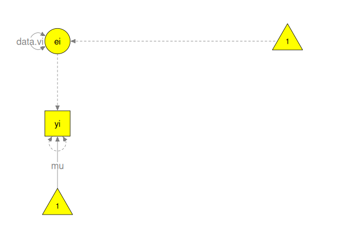<!-- -->

``` r
## Convert the lavaan model to RAM specification
## obs.variables = "yi": "yi" is the observed variable
ram1 <- lavaan2RAM(m1a, obs.variables = "yi", std.lv = FALSE)

## Display the RAM model
ram1
```

```
## $A
##    yi  ei 
## yi "0" "1"
## ei "0" "0"
## 
## $S
##    yi  ei           
## yi "0" "0"          
## ei "0" "0.5*data.vi"
## 
## $F
##    yi ei
## yi  1  0
## 
## $M
##   yi     ei 
## 1 "0*mu" "0"
```

``` r
## Get the model-implied mean and variance structures
impliedS(ram1)
```

```
## Correlation matrix: FALSE
## 
## Amatrix:
##    yi ei
## yi  0  1
## ei  0  0
## 
## Smatrix:
##    yi  ei       
## yi "0" "0"      
## ei "0" "data.vi"
## 
## Fmatrix:
##    yi ei
## yi  1  0
## 
## Mmatrix:
##   yi   ei 
## 1 "mu" "0"
## 
## Model implied covariance matrix (Sigma):
##    yi       
## yi "data.vi"
## 
## Model implied mean vector (Mu):
##   yi  
## 1 "mu"
```

``` r
## Fit the model to the data
fit1 <- sem("Fixed", RAM = ram1, data = dat1)
summary(fit1)
```

```
## 95% confidence intervals: z statistic approximation (robust=FALSE)
## Coefficients:
##     Estimate Std.Error    lbound    ubound z value  Pr(>|z|)    
## mu 0.1937681 0.0079323 0.1782212 0.2093151  24.428 < 2.2e-16 ***
## ---
## Signif. codes:  0 '***' 0.001 '**' 0.01 '*' 0.05 '.' 0.1 ' ' 1
## 
## Information Criteria:
##       df Penalty Parameters Penalty Sample-Size Adjusted
## AIC:    9.069733           131.0697             131.1375
## BIC: -117.582699           133.1806             130.0348
## 
## Number of subjects (or studies): 61
## Number of observed statistics: 61
## Number of estimated parameters: 1
## Degrees of freedom: 60
## -2 log likelihood: 129.0697 
## OpenMx status1: 0 ("0" or "1": The optimization is considered fine.
## Other values may indicate problems.)
```

``` r
## Display the model with results using the semPlot package
## nDigits=4: Display 4 digits
plot(fit1, color = "green", sizeInt = 7, nDigits = 4)
```

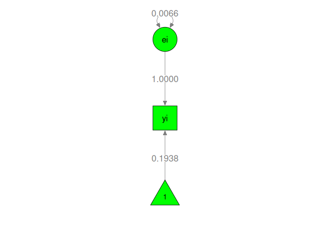<!-- -->

### Random-effects model

``` r
## Random-effects model
m2 <- "ui =~ 1*yi          ## ui is the random effect
       ui ~~ tau2*ui       ## Var(ui) = tau2
       yi ~ mu*1           ## Mean(yi) = mu
       yi ~~ data.vi*yi    ## Var(yi) = vi, which is assigned from data
"

## Display the conceptual model
plot(m2, color="yellow", sizeInt = 7)
```

<!-- -->

``` r
## Convert the lavaan model to RAM specification
## std.lv = FALSE: Ensure the latent variable is not standardized
ram2 <- lavaan2RAM(m2, obs.variables = "yi", std.lv = FALSE)

## Get the model-implied mean and variance structures
impliedS(ram2)
```

```
## Correlation matrix: FALSE
## 
## Amatrix:
##    yi ui
## yi  0  1
## ui  0  0
## 
## Smatrix:
##    yi        ui    
## yi "data.vi" "0"   
## ui "0"       "tau2"
## 
## Fmatrix:
##    yi ui
## yi  1  0
## 
## Mmatrix:
##   yi   ui 
## 1 "mu" "0"
## 
## Model implied covariance matrix (Sigma):
##    yi              
## yi "data.vi + tau2"
## 
## Model implied mean vector (Mu):
##   yi  
## 1 "mu"
```

``` r
## intervals.type = "LB": Request likelihood-based CI
fit2 <- sem("Random", RAM = ram2, data = dat1, intervals.type = "LB")
summary(fit2)
```

```
## 95% confidence intervals: Likelihood-based statistic
## Coefficients:
##      Estimate Std.Error   lbound   ubound z value Pr(>|z|)
## mu   0.186622        NA 0.147890 0.225105      NA       NA
## tau2 0.017034        NA 0.010589 0.027596      NA       NA
## 
## Information Criteria:
##      df Penalty Parameters Penalty Sample-Size Adjusted
## AIC:  -173.4423          -51.44225            -51.23536
## BIC:  -297.9838          -47.22051            -53.51209
## 
## Number of subjects (or studies): 61
## Number of observed statistics: 61
## Number of estimated parameters: 2
## Degrees of freedom: 59
## -2 log likelihood: -55.44225 
## OpenMx status1: 0 ("0" or "1": The optimization is considered fine.
## Other values may indicate problems.)
```

``` r
## Display the model with results
plot(fit2, color="green", sizeInt = 7, nDigits = 4)
```

<!-- -->

### Multiplicative-error model

``` r
## Multiplicative error, same as UWLS model
m3 <- "ei =~ phi_sqrt*yi   ## phi (phi_sqrt^2) is the heterogeneity scaling factor
       ei ~~ data.vi*ei    ## Var(ei) = vi
       yi ~ mu*1
       yi ~~ 0*yi          ## Set the default error variance of yi at 0
       phi := phi_sqrt^2   ## Define phi as a function of phi_sqrt
"

plot(m3, color = "yellow", sizeInt = 7)
```

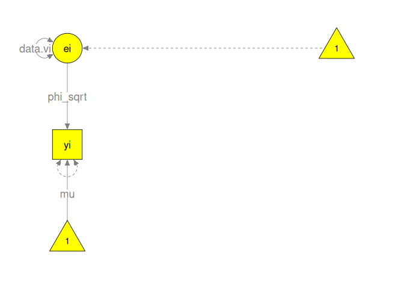<!-- -->

``` r
ram3 <- lavaan2RAM(m3, obs.variables = "yi", std.lv = FALSE)

impliedS(ram3)
```

```
## Correlation matrix: FALSE
## 
## Amatrix:
##    yi  ei        
## yi "0" "phi_sqrt"
## ei "0" "0"       
## 
## Smatrix:
##    yi  ei       
## yi "0" "0"      
## ei "0" "data.vi"
## 
## Fmatrix:
##    yi ei
## yi  1  0
## 
## Mmatrix:
##   yi   ei 
## 1 "mu" "0"
## 
## Model implied covariance matrix (Sigma):
##    yi                  
## yi "data.vi*phi_sqrt^2"
## 
## Model implied mean vector (Mu):
##   yi  
## 1 "mu"
```

``` r
fit3 <- sem("Multiplicative", RAM = ram3, data = dat1, intervals.type = "LB")
summary(fit3)
```

```
## 95% confidence intervals: Likelihood-based statistic
## Coefficients:
##          Estimate Std.Error  lbound  ubound z value Pr(>|z|)
## mu        0.19377        NA 0.15650 0.23103      NA       NA
## phi_sqrt  2.35876        NA 1.99476 2.84882      NA       NA
## 
## Mxalgebras:
##       lbound estimate   ubound
## phi 3.972879 5.563747 8.118821
## 
## Information Criteria:
##      df Penalty Parameters Penalty Sample-Size Adjusted
## AIC:  -162.6262          -40.62625            -40.41935
## BIC:  -287.1678          -36.40450            -42.69609
## 
## Number of subjects (or studies): 61
## Number of observed statistics: 61
## Number of estimated parameters: 2
## Degrees of freedom: 59
## -2 log likelihood: -44.62625 
## OpenMx status1: 0 ("0" or "1": The optimization is considered fine.
## Other values may indicate problems.)
```

``` r
plot(fit3, color="green", sizeInt=6, nDigits=4)
```

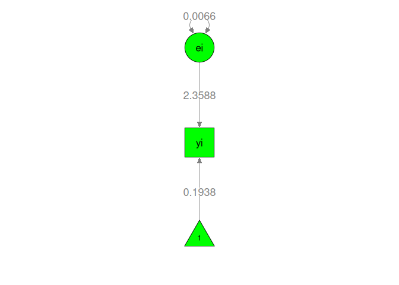<!-- -->

### Hybrid models of additive and multiplicative errors

``` r
## Hybrid model 1: multiplicative and addictive error
m4 <- "yi ~ mu*1
       yi ~~ 0*yi
       ## additive error
       ui =~ 1*yi
       ui ~~ tau2*ui      ## Var(ui) = tau2
       ## mulitplicative error
       ei =~ phi_sqrt*yi  ## phi is a scaling factor
       ei ~~ data.vi*ei   ## Var(ei) = vi
       phi := phi_sqrt^2  ## Define phi as a function of phi_sqrt
"
plot(m4, color="yellow", sizeInt=6)
```

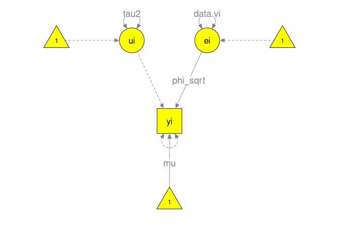<!-- -->

``` r
ram4 <- lavaan2RAM(m4, obs.variables = "yi", std.lv = FALSE)

impliedS(ram4)
```

```
## Correlation matrix: FALSE
## 
## Amatrix:
##    yi  ui  ei        
## yi "0" "1" "phi_sqrt"
## ui "0" "0" "0"       
## ei "0" "0" "0"       
## 
## Smatrix:
##    yi  ui     ei       
## yi "0" "0"    "0"      
## ui "0" "tau2" "0"      
## ei "0" "0"    "data.vi"
## 
## Fmatrix:
##    yi ui ei
## yi  1  0  0
## 
## Mmatrix:
##   yi   ui  ei 
## 1 "mu" "0" "0"
## 
## Model implied covariance matrix (Sigma):
##    yi                         
## yi "data.vi*phi_sqrt^2 + tau2"
## 
## Model implied mean vector (Mu):
##   yi  
## 1 "mu"
```

``` r
fit4 <- sem("Hybrid1", RAM = ram4, data = dat1, intervals.type = "LB")
summary(fit4)
```

```
## 95% confidence intervals: Likelihood-based statistic
## Coefficients:
##            Estimate Std.Error     lbound     ubound z value Pr(>|z|)
## mu        0.1873704        NA  0.1488124  0.2257397      NA       NA
## phi_sqrt  1.2870404        NA -2.0902766  2.0872970      NA       NA
## tau2      0.0136638        NA  0.0039765  0.0304225      NA       NA
## 
## Mxalgebras:
##           lbound estimate   ubound
## phi 1.805558e-44 1.656473 4.361042
## 
## Information Criteria:
##      df Penalty Parameters Penalty Sample-Size Adjusted
## AIC:  -171.7740          -49.77403            -49.35298
## BIC:  -294.2047          -43.44141            -52.87879
## 
## Number of subjects (or studies): 61
## Number of observed statistics: 61
## Number of estimated parameters: 3
## Degrees of freedom: 58
## -2 log likelihood: -55.77403 
## OpenMx status1: 0 ("0" or "1": The optimization is considered fine.
## Other values may indicate problems.)
```

``` r
plot(fit4, color="green", sizeInt=6, nDigits=4)
```

<!-- -->

``` r
## Hybrid model 2: multiplicative and addictive error
m5 <- "yi ~ mu*1         ## Mean(yi) = mu
       yi ~~ Vary*yi     ## Var(yi) = vary
       ## Define Vary as a function of vi, tau2, and omega
       Vary == data.vi + tau2*data.vi^omega
"

ram5 <- lavaan2RAM(m5, obs.variables = "yi", std.lv = FALSE)

impliedS(ram5, replace.constraints = TRUE)
```

```
## Correlation matrix: FALSE
## 
## Amatrix:
##    yi
## yi  0
## 
## Smatrix:
##    yi                              
## yi "data.vi + tau2 * data.vi^omega"
## 
## Fmatrix:
##    yi
## yi  1
## 
## Mmatrix:
##   yi  
## 1 "mu"
## 
## Model implied covariance matrix (Sigma):
##    yi                            
## yi "data.vi + data.vi^omega*tau2"
## 
## Model implied mean vector (Mu):
##   yi  
## 1 "mu"
```

``` r
fit5 <- sem("Hybrid2", RAM = ram5, data = dat1, intervals.type = "LB", 
            replace.constraints = TRUE)
summary(fit5)
```

```
## 95% confidence intervals: Likelihood-based statistic
## Coefficients:
##          Estimate Std.Error      lbound      ubound z value Pr(>|z|)
## mu     0.18693594        NA  0.14824131  0.22553485      NA       NA
## omega  0.12041813        NA -0.52057903  0.65732303      NA       NA
## tau2   0.03307378        NA  0.00092958  0.66087441      NA       NA
## 
## Information Criteria:
##      df Penalty Parameters Penalty Sample-Size Adjusted
## AIC:  -171.6036          -49.60361            -49.18256
## BIC:  -294.0343          -43.27099            -52.70837
## 
## Number of subjects (or studies): 61
## Number of observed statistics: 61
## Number of estimated parameters: 3
## Degrees of freedom: 58
## -2 log likelihood: -55.60361 
## OpenMx status1: 0 ("0" or "1": The optimization is considered fine.
## Other values may indicate problems.)
```

``` r
## Hybrid model 3: Hartung-Knapp-Sidik-Jonkman method
m6 <- "yi ~ mu*1
       yi ~~ 0*yi
       ## additive error
       ui =~ phi_sqrt*yi    ## phi is a scaling factor
       ui ~~ 0.01703407*ui  ## tau2 obtained from the random-effects model
       ## mulitplicative error
       ei =~ phi_sqrt*yi    ## phi is a scaling factor
       ei ~~ data.vi*ei     ## Var(ei) = vi
       phi := phi_sqrt^2    ## Define phi as a function of phi_sqrt
"
plot(m6, color="yellow", sizeInt=6)
```

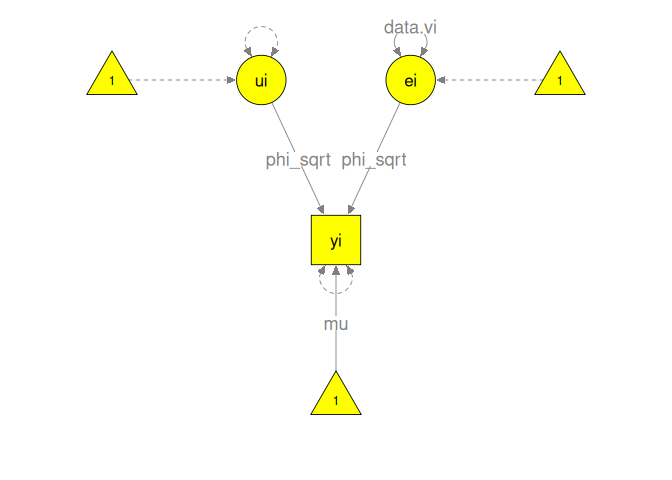<!-- -->

``` r
ram6 <- lavaan2RAM(m6, obs.variables = "yi", std.lv = FALSE)

impliedS(ram6)
```

```
## Correlation matrix: FALSE
## 
## Amatrix:
##    yi  ui         ei        
## yi "0" "phi_sqrt" "phi_sqrt"
## ui "0" "0"        "0"       
## ei "0" "0"        "0"       
## 
## Smatrix:
##    yi  ui           ei       
## yi "0" "0"          "0"      
## ui "0" "0.01703407" "0"      
## ei "0" "0"          "data.vi"
## 
## Fmatrix:
##    yi ui ei
## yi  1  0  0
## 
## Mmatrix:
##   yi   ui  ei 
## 1 "mu" "0" "0"
## 
## Model implied covariance matrix (Sigma):
##    yi                                 
## yi "phi_sqrt^2*(data.vi + 0.01703407)"
## 
## Model implied mean vector (Mu):
##   yi  
## 1 "mu"
```

``` r
fit6 <- sem("Hybrid3", RAM = ram6, data = dat1, intervals.type = "LB")
summary(fit6)
```

```
## 95% confidence intervals: Likelihood-based statistic
## Coefficients:
##          Estimate Std.Error  lbound  ubound z value Pr(>|z|)
## mu        0.18662        NA 0.14758 0.22566      NA       NA
## phi_sqrt  1.00863        NA 0.85260 1.21870      NA       NA
## 
## Mxalgebras:
##        lbound estimate   ubound
## phi 0.7276301  1.01733 1.486477
## 
## Information Criteria:
##      df Penalty Parameters Penalty Sample-Size Adjusted
## AIC:  -173.4513          -51.45131            -51.24441
## BIC:  -297.9929          -47.22956            -53.52115
## 
## Number of subjects (or studies): 61
## Number of observed statistics: 61
## Number of estimated parameters: 2
## Degrees of freedom: 59
## -2 log likelihood: -55.45131 
## OpenMx status1: 0 ("0" or "1": The optimization is considered fine.
## Other values may indicate problems.)
```

``` r
plot(fit6, color="green", sizeInt=6, nDigits=4)
```

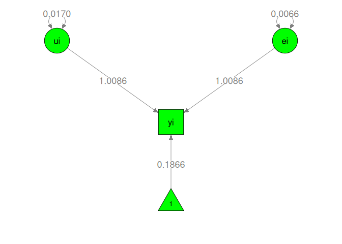<!-- -->

### Comparison of the six models

``` r
## Refit some models to get SEs rather than LBCIs for comparisons
fit2 <- sem("Random", RAM = ram2, data = dat1)
fit3 <- sem("Multiplicative", RAM = ram3, data = dat1)
fit4 <- sem("Hybrid1", RAM = ram4, data = dat1)
fit5 <- sem("Hybrid2", RAM = ram5, data = dat1, replace.constraints = TRUE)
fit6 <- sem("Hybrid3", RAM = ram6, data = dat1)

extractResults <- function(x) {
  out <- summary(x)
  para <- out$coefficients[c("mu", "tau2", "phi_sqrt", "omega"), 
                           c("Estimate", "Std.Error")]
  out <- c(unlist(para), out$estPara, out$Minus2LL, 
           out$informationCriteria["AIC:", "Parameters Penalty"],
           out$informationCriteria["BIC:", "Parameters Penalty"])
  names(out) <- c("mu", "tau2", "phi_sqrt", "omega",
                  "mu_SE", "tau2_SE", "phi_sqrt_SE", "omega_SE",
                  "No_parameters",  "-2LL", "AIC", "BIC")
  out
}

table1 <- sapply(list(fit1, fit2, fit3, fit4, fit5, fit6), extractResults)
table1 <- data.frame(Name=rownames(table1), table1)
rownames(table1) <- NULL
colnames(table1) <- c("Name", "Fixed", "Random", "Multiplicative", "Hybrid1", 
                      "Hybrid2", "Hybrid3")
## Add the estimated tau2 and tau2_SE from the random-effects model to
## the table in an ad-hoc manner
table1[table1$Name=="tau2", "Hybrid3"] <- table1[table1$Name=="tau2", "Random"]
table1[table1$Name=="tau2_SE", "Hybrid3"] <- table1[table1$Name=="tau2_SE", "Random"]
knitr::kable(table1, digits=4, caption="Results of the Six Meta-Analytic Models")
```


Table: Results of the Six Meta-Analytic Models

|Name          |    Fixed|   Random| Multiplicative|  Hybrid1|  Hybrid2|  Hybrid3|
|:-------------|--------:|--------:|--------------:|--------:|--------:|--------:|
|mu            |   0.1938|   0.1866|         0.1938|   0.1874|   0.1869|   0.1866|
|tau2          |       NA|   0.0170|             NA|   0.0137|   0.0331|   0.0170|
|phi_sqrt      |       NA|       NA|         2.3588|   1.2870|       NA|   1.0086|
|omega         |       NA|       NA|             NA|       NA|   0.1204|       NA|
|mu_SE         |   0.0079|   0.0193|         0.0187|   0.0192|   0.0193|   0.0195|
|tau2_SE       |       NA|   0.0041|             NA|   0.0066|   0.0543|   0.0041|
|phi_sqrt_SE   |       NA|       NA|         0.2136|   0.4615|       NA|   0.0913|
|omega_SE      |       NA|       NA|             NA|       NA|   0.2942|       NA|
|No_parameters |   1.0000|   2.0000|         2.0000|   3.0000|   3.0000|   2.0000|
|-2LL          | 129.0697| -55.4423|       -44.6262| -55.7740| -55.6036| -55.4513|
|AIC           | 131.0697| -51.4423|       -40.6262| -49.7740| -49.6036| -51.4513|
|BIC           | 133.1806| -47.2205|       -36.4045| -43.4414| -43.2710| -47.2296|

## Models with external variables
### A fixed-x meta-regression

``` r
## Mixed-effects model with the covariate as a design matrix
m7 <- "yi ~ b0*1         ## Intercept of yi: b0
       yi ~~ data.vi*yi  ## Known sampling variance vi
       ui =~ 1*yi
       ui ~~ tau2*ui     ## Heterogeneity variance tau2
       ## etai: a phantom latent variable to represent the covariate x
       etai =~ b1*yi     ## yi = b1*etai
       etai ~ data.xi*1  ## etai = xi
       etai ~~ 0*etai    ## Var(etai) = 0
"

plot(m7, color = "yellow", layout = "spring")
```

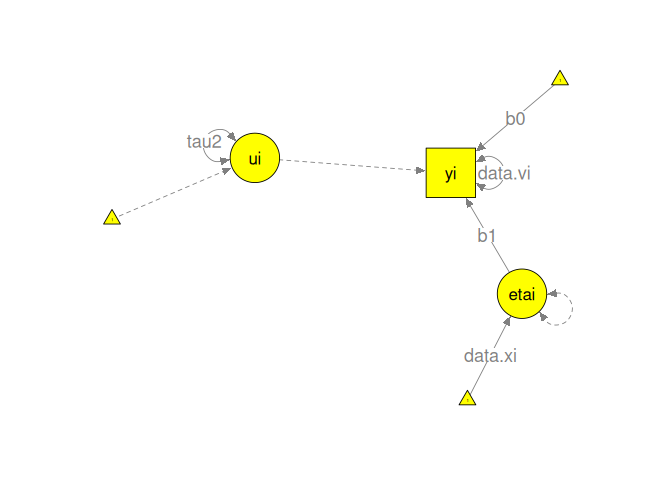<!-- -->

``` r
## Only yi is an observed variable
ram7 <- lavaan2RAM(m7, obs.variables = "yi", std.lv = FALSE)

impliedS(ram7)
```

```
## Correlation matrix: FALSE
## 
## Amatrix:
##      yi  ui  etai
## yi   "0" "1" "b1"
## ui   "0" "0" "0" 
## etai "0" "0" "0" 
## 
## Smatrix:
##      yi        ui     etai
## yi   "data.vi" "0"    "0" 
## ui   "0"       "tau2" "0" 
## etai "0"       "0"    "0" 
## 
## Fmatrix:
##    yi ui etai
## yi  1  0    0
## 
## Mmatrix:
##   yi   ui  etai     
## 1 "b0" "0" "data.xi"
## 
## Model implied covariance matrix (Sigma):
##    yi              
## yi "data.vi + tau2"
## 
## Model implied mean vector (Mu):
##   yi               
## 1 "b0 + b1*data.xi"
```

``` r
fit7 <- sem("Covariate_design", RAM=ram7, data=dat1, intervals.type = "LB")
summary(fit7)
```

```
## 95% confidence intervals: Likelihood-based statistic
## Coefficients:
##         Estimate Std.Error      lbound      ubound z value Pr(>|z|)
## b0    0.18596328        NA  0.14793328  0.22387748      NA       NA
## b1   -0.00132138        NA -0.00327530  0.00062752      NA       NA
## tau2  0.01634054        NA  0.01008007  0.02668220      NA       NA
## 
## Information Criteria:
##      df Penalty Parameters Penalty Sample-Size Adjusted
## AIC:  -173.2423          -51.24231            -50.82126
## BIC:  -295.6730          -44.90969            -54.34707
## 
## Number of subjects (or studies): 61
## Number of observed statistics: 61
## Number of estimated parameters: 3
## Degrees of freedom: 58
## -2 log likelihood: -57.24231 
## OpenMx status1: 0 ("0" or "1": The optimization is considered fine.
## Other values may indicate problems.)
```

``` r
plot(fit7, color = "green", sizeInt=6,  nDigits = 4)
```

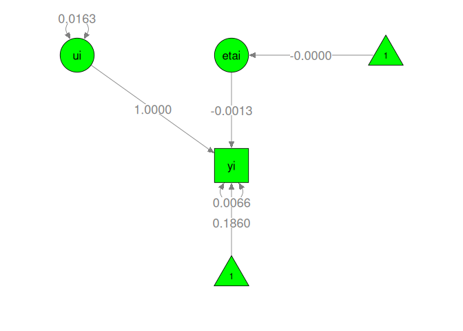<!-- -->

### A random-x meta-regression

``` r
## Mixed-effects model with the covariate as a variable
m8 <- "yi ~ b0*1 + b1*xi ## Intercept (b0) and slope (b1)
       yi ~~ data.vi*yi  ## Known sampling variance vi
       ui =~ 1*yi
       ui ~~ tau2*ui     ## Heterogeneity variance tau2
       xi ~ Meanx*1      ## Mean(xi) = Meanx
       xi ~~ Varx*xi     ## Var(xi) = Varx
       ## Define R2: explained variance/total variance
       R2 := b1^2*Varx/(b1^2*Varx + tau2)
"

plot(m8, color = "yellow", layout = "spring", sizeInt=6)
```

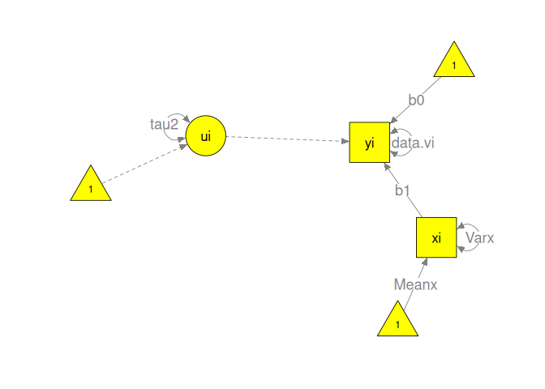<!-- -->

``` r
## Both yi and xi are observed variables
ram8 <- lavaan2RAM(m8, obs.variables = c("yi", "xi"), std.lv = FALSE)

impliedS(ram8)
```

```
## Correlation matrix: FALSE
## 
## Amatrix:
##    yi  xi   ui 
## yi "0" "b1" "1"
## xi "0" "0"  "0"
## ui "0" "0"  "0"
## 
## Smatrix:
##    yi        xi     ui    
## yi "data.vi" "0"    "0"   
## xi "0"       "Varx" "0"   
## ui "0"       "0"    "tau2"
## 
## Fmatrix:
##    yi xi ui
## yi  1  0  0
## xi  0  1  0
## 
## Mmatrix:
##   yi   xi      ui 
## 1 "b0" "Meanx" "0"
## 
## Model implied covariance matrix (Sigma):
##    yi                           xi       
## yi "Varx*b1^2 + data.vi + tau2" "Varx*b1"
## xi "Varx*b1"                    "Varx"   
## 
## Model implied mean vector (Mu):
##   yi              xi     
## 1 "Meanx*b1 + b0" "Meanx"
```

``` r
## Request LBCIs on the R2
fit8 <- sem("Covariate_variable", RAM=ram8, data=dat1, intervals.type = "LB")
summary(fit8)
```

```
## 95% confidence intervals: Likelihood-based statistic
## Coefficients:
##          Estimate Std.Error      lbound      ubound z value Pr(>|z|)
## b0     1.8596e-01        NA  1.4793e-01  2.2388e-01      NA       NA
## b1    -1.3214e-03        NA -3.2753e-03  6.2752e-04      NA       NA
## Meanx -1.4973e-07        NA -4.7632e+00  4.7632e+00      NA       NA
## tau2   1.6341e-02        NA  1.0080e-02  2.6682e-02      NA       NA
## Varx   3.6017e+02        NA  2.5761e+02  5.2612e+02      NA       NA
## 
## Mxalgebras:
##         lbound   estimate    ubound
## R2 1.75629e-29 0.03705905 0.1926174
## 
## Information Criteria:
##      df Penalty Parameters Penalty Sample-Size Adjusted
## AIC: 240.949308           484.9493             486.0402
## BIC:  -6.022934           495.5037             479.7747
## 
## Number of subjects (or studies): 61
## Number of observed statistics: 122
## Number of estimated parameters: 5
## Degrees of freedom: 117
## -2 log likelihood: 474.9493 
## OpenMx status1: 0 ("0" or "1": The optimization is considered fine.
## Other values may indicate problems.)
```

``` r
plot(fit8, color="green", sizeInt=6, nDigits = 4, layout = "spring")
```

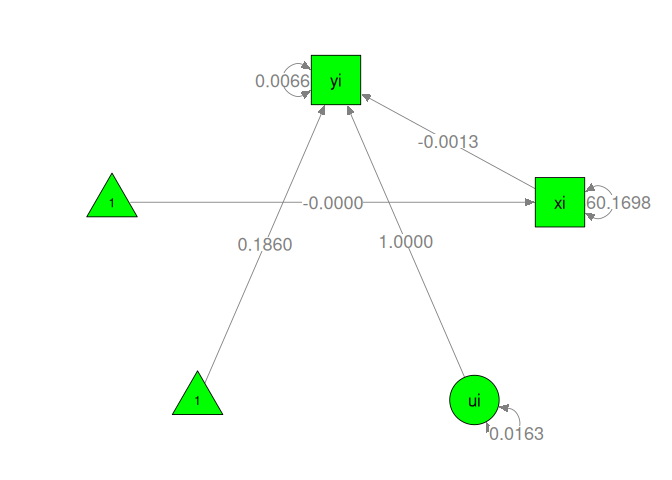<!-- -->

### Regressing a covariate on the true effect size

``` r
## Regressing a covariate on the true effect size
m9 <- "fyi =~ 1*yi         ## fi: true effect size
       fyi ~~ tau2*fyi     ## Var(fi) = tau2
       fyi ~ Meany*1       ## Mean(fi) = Meany
       yi ~ 0*1         
       yi ~~ data.vi*yi    ## Var(ei) = vi
       zi ~ b0*1 + b1*fyi  ## Intercept (b0) and slope (b1)
       zi ~~ ErrVarz*zi    ## Error variance of zi
       ## Define an R2
       R2 := b1^2*tau2/(b1^2*tau2 + ErrVarz)
"

plot(m9, color = "yellow", sizeInt=6, layout = "spring")
```

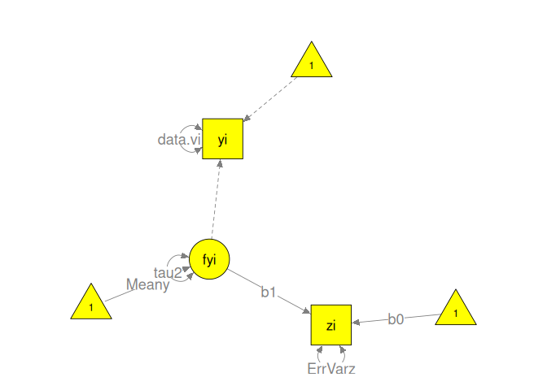<!-- -->

``` r
## Both yi and xi are observed variables
ram9 <- lavaan2RAM(m9, obs.variables = c("yi", "zi"), std.lv = FALSE)

impliedS(ram9)
```

```
## Correlation matrix: FALSE
## 
## Amatrix:
##     yi  zi  fyi 
## yi  "0" "0" "1" 
## zi  "0" "0" "b1"
## fyi "0" "0" "0" 
## 
## Smatrix:
##     yi        zi        fyi   
## yi  "data.vi" "0"       "0"   
## zi  "0"       "ErrVarz" "0"   
## fyi "0"       "0"       "tau2"
## 
## Fmatrix:
##    yi zi fyi
## yi  1  0   0
## zi  0  1   0
## 
## Mmatrix:
##   yi  zi   fyi    
## 1 "0" "b0" "Meany"
## 
## Model implied covariance matrix (Sigma):
##    yi               zi                   
## yi "data.vi + tau2" "b1*tau2"            
## zi "b1*tau2"        "ErrVarz + b1^2*tau2"
## 
## Model implied mean vector (Mu):
##   yi      zi             
## 1 "Meany" "Meany*b1 + b0"
```

``` r
fit9 <- sem("Regress_covariate", RAM=ram9, data=dat1, intervals.type = "LB")
summary(fit9)
```

```
## 95% confidence intervals: Likelihood-based statistic
## Coefficients:
##          Estimate Std.Error    lbound    ubound z value Pr(>|z|)
## b0       0.370112        NA -0.098053  0.853139      NA       NA
## b1      -1.975471        NA -4.166473  0.141942      NA       NA
## ErrVarz  0.917496        NA  0.650915  1.345054      NA       NA
## Meany    0.187354        NA  0.148774  0.225754      NA       NA
## tau2     0.016941        NA  0.010797  0.027362      NA       NA
## 
## Mxalgebras:
##          lbound   estimate    ubound
## R2 4.156886e-40 0.06721261 0.2515694
## 
## Information Criteria:
##      df Penalty Parameters Penalty Sample-Size Adjusted
## AIC:  -120.6995           123.3005             124.3914
## BIC:  -367.6717           133.8549             118.1259
## 
## Number of subjects (or studies): 61
## Number of observed statistics: 122
## Number of estimated parameters: 5
## Degrees of freedom: 117
## -2 log likelihood: 113.3005 
## OpenMx status1: 0 ("0" or "1": The optimization is considered fine.
## Other values may indicate problems.)
```

``` r
plot(fit9, color = "green", sizeInt=6, nDigits = 4)
```

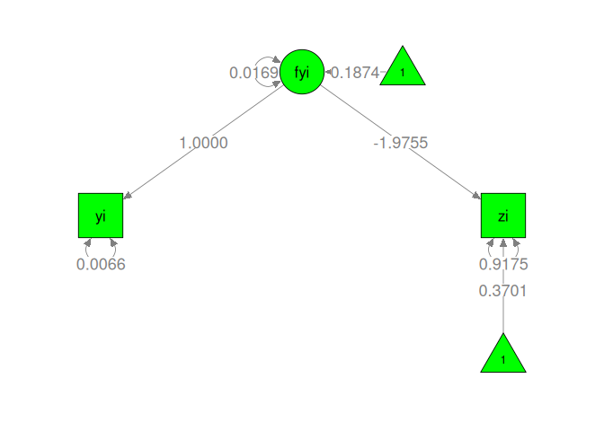<!-- -->

### Correlating a covariate with a true effect size

``` r
## Correlation between fyi and fxi
m10 <- "yi ~ 0*1
        yi ~~ data.vi*yi
        ## fyi: Standardized true effect size of yi
        fyi =~ tauy*yi     ## tauy: sd of fyi
        fyi ~~ 1*fyi       ## Var(fyi) = 1
        fyi ~ y_mean_div_tauy*1
        ## fxi: Standardized score of xi
        fxi =~ sigma*xi    ## sigma: sd of xi
        fxi ~~ 1*fxi       ## Var(fxi) = 1
        fxi ~~ Cor*fyi
        fxi ~ x_mean_div_sigmax*1
        xi ~ 0*1
        xi ~~ 0*xi       
"

plot(m10, color = "yellow", sizeInt=6)
```

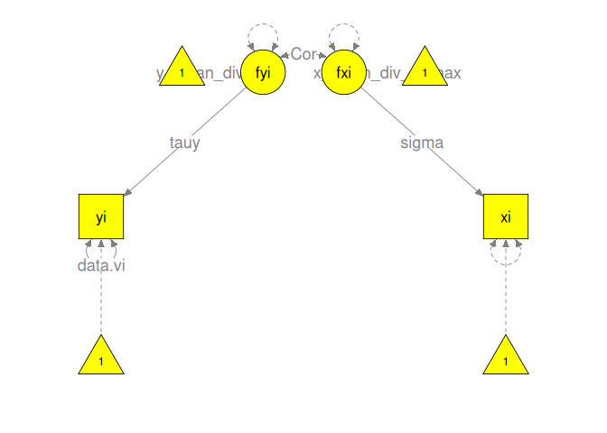<!-- -->

``` r
## Both yi and xi are observed variables
ram10 <- lavaan2RAM(m10, obs.variables = c("yi", "xi"), std.lv = TRUE)

impliedS(ram10)
```

```
## Correlation matrix: FALSE
## 
## Amatrix:
##     yi  xi  fyi    fxi    
## yi  "0" "0" "tauy" "0"    
## xi  "0" "0" "0"    "sigma"
## fyi "0" "0" "0"    "0"    
## fxi "0" "0" "0"    "0"    
## 
## Smatrix:
##     yi        xi  fyi   fxi  
## yi  "data.vi" "0" "0"   "0"  
## xi  "0"       "0" "0"   "0"  
## fyi "0"       "0" "1"   "Cor"
## fxi "0"       "0" "Cor" "1"  
## 
## Fmatrix:
##    yi xi fyi fxi
## yi  1  0   0   0
## xi  0  1   0   0
## 
## Mmatrix:
##   yi  xi  fyi               fxi                
## 1 "0" "0" "y_mean_div_tauy" "x_mean_div_sigmax"
## 
## Model implied covariance matrix (Sigma):
##    yi                 xi              
## yi "data.vi + tauy^2" "Cor*sigma*tauy"
## xi "Cor*sigma*tauy"   "sigma^2"       
## 
## Model implied mean vector (Mu):
##   yi                     xi                       
## 1 "tauy*y_mean_div_tauy" "sigma*x_mean_div_sigmax"
```

``` r
fit10 <- sem("Correlation", RAM=ram10, data=dat1)
summary(fit10)
```

```
## 95% confidence intervals: z statistic approximation (robust=FALSE)
## Coefficients:
##                      Estimate   Std.Error      lbound      ubound z value
## tauy               1.3027e-01  1.5856e-02  9.9190e-02  1.6134e-01  8.2156
## sigma              1.8978e+01  1.7182e+00  1.5611e+01  2.2346e+01 11.0454
## Cor               -1.9251e-01  1.3987e-01 -4.6665e-01  8.1640e-02 -1.3763
## y_mean_div_tauy    1.4276e+00  2.3022e-01  9.7633e-01  1.8788e+00  6.2008
## x_mean_div_sigmax -8.0385e-10  1.2804e-01 -2.5095e-01  2.5095e-01  0.0000
##                    Pr(>|z|)    
## tauy              2.220e-16 ***
## sigma             < 2.2e-16 ***
## Cor                  0.1687    
## y_mean_div_tauy   5.619e-10 ***
## x_mean_div_sigmax    1.0000    
## ---
## Signif. codes:  0 '***' 0.001 '**' 0.01 '*' 0.05 '.' 0.1 ' ' 1
## 
## Information Criteria:
##      df Penalty Parameters Penalty Sample-Size Adjusted
## AIC: 240.949308           484.9493             486.0402
## BIC:  -6.022934           495.5037             479.7747
## 
## Number of subjects (or studies): 61
## Number of observed statistics: 122
## Number of estimated parameters: 5
## Degrees of freedom: 117
## -2 log likelihood: 474.9493 
## OpenMx status1: 0 ("0" or "1": The optimization is considered fine.
## Other values may indicate problems.)
```

``` r
plot(fit10, color = "green", sizeInt=6, nDigits = 4)
```

<!-- -->

### Meta-regression with completely and partially standardized variables

``` r
## Completely standardized fyi and xi
m11 <- "yi ~ 0*1
        yi ~~ data.vi*yi
        ## fyi: Standardized true effect size of yi
        fyi =~ tauy*yi       ## tauy: sd of fyi
        fyi ~~ tau2_res*fyi  ## tau2_res: residual heterogeneity
        fyi ~ b0*1 + b1*fxi
        ## fxi: Standardized score of xi
        fxi =~ sigma*xi      ## sigma: sd of xi
        fxi ~~ 1*fxi         ## Var(fxi) =1
        fxi ~ mu_x_sd*1
        xi ~ 0*1
        xi ~~ 0*xi
        ## Nonlinear constraint to ensure Var(fyi) = 1
        tau2_res == 1 - b1^2
        ## Define R2
        R2 := b1^2
"

plot(m11, color="yellow", layout="spring", sizeInt=6)
```

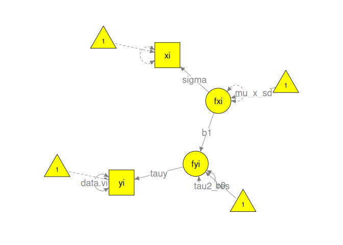<!-- -->

``` r
## Both yi and xi are observed variables
ram11 <- lavaan2RAM(m11, obs.variables = c("yi", "xi"), std.lv = FALSE)

impliedS(ram11, replace.constraints = TRUE)
```

```
## Correlation matrix: FALSE
## 
## Amatrix:
##     yi  xi  fyi    fxi    
## yi  "0" "0" "tauy" "0"    
## xi  "0" "0" "0"    "sigma"
## fyi "0" "0" "0"    "b1"   
## fxi "0" "0" "0"    "0"    
## 
## Smatrix:
##     yi        xi  fyi        fxi
## yi  "data.vi" "0" "0"        "0"
## xi  "0"       "0" "0"        "0"
## fyi "0"       "0" "1 - b1^2" "0"
## fxi "0"       "0" "0"        "1"
## 
## Fmatrix:
##    yi xi fyi fxi
## yi  1  0   0   0
## xi  0  1   0   0
## 
## Mmatrix:
##   yi  xi  fyi  fxi      
## 1 "0" "0" "b0" "mu_x_sd"
## 
## Model implied covariance matrix (Sigma):
##    yi                 xi             
## yi "data.vi + tauy^2" "b1*sigma*tauy"
## xi "b1*sigma*tauy"    "sigma^2"      
## 
## Model implied mean vector (Mu):
##   yi                          xi             
## 1 "b0*tauy + b1*mu_x_sd*tauy" "mu_x_sd*sigma"
```

``` r
fit11 <- sem("Complete_standardize", RAM=ram11, data=dat1, intervals.type = "LB",
             lbound = list(tauy=0))
summary(fit11)
```

```
## 95% confidence intervals: Likelihood-based statistic
## Coefficients:
##             Estimate Std.Error      lbound      ubound z value Pr(>|z|)
## b0        1.4276e+00        NA  1.0064e+00  1.9130e+00      NA       NA
## b1       -1.9251e-01        NA -4.4848e-01          NA      NA       NA
## mu_x_sd   9.6296e-09        NA -2.5097e-01  2.5098e-01      NA       NA
## sigma     1.8978e+01        NA  1.6050e+01  2.2917e+01      NA       NA
## tau2_res  9.6294e-01        NA  8.0646e-01  1.0000e+00      NA       NA
## tauy      1.3027e-01        NA  1.0268e-01  1.6599e-01      NA       NA
## 
## Mxalgebras:
##          lbound   estimate    ubound
## R2 1.110347e-24 0.03705907 0.1936213
## 
## Information Criteria:
##      df Penalty Parameters Penalty Sample-Size Adjusted
## AIC: 240.949308           486.9493             488.5049
## BIC:  -6.022934           499.6146             480.7398
## 
## Number of subjects (or studies): 61
## Number of observed statistics: 123
## Number of estimated parameters: 6
## Degrees of freedom: 117
## -2 log likelihood: 474.9493 
## OpenMx status1: 0 ("0" or "1": The optimization is considered fine.
## Other values may indicate problems.)
```

``` r
plot(fit11, color="green", sizeInt=6, nDigits=4)
```

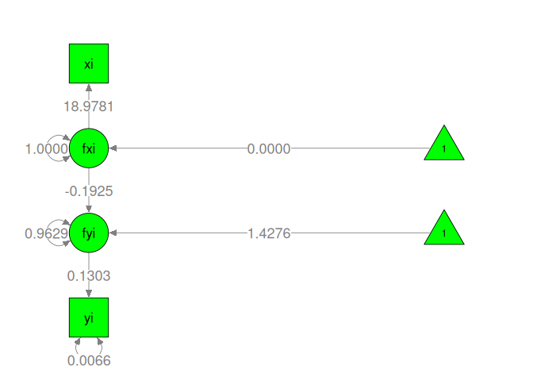<!-- -->

``` r
## Partial standardized xi but not yi
m12 <- "yi ~ 0*1
        yi ~~ data.vi*yi
        ## fyi: Unstandardized true effect size of yi
        fyi =~ 1*yi
        fyi ~~ tau2_res*fyi   ## tau2_res: residual heterogeneity
        fyi ~ b0*1 + b1*fxi
        ## fxi: Standardized score of xi
        fxi =~ sigma*xi       ## sigma: sd of xi
        fxi ~~ 1*fxi          ## Var(fxi) =1
        fxi ~ mu_x_sd*1
        xi ~ 0*1
        xi ~~ 0*xi
        ## Define R2
        R2 := b1^2/(b1^2 + tau2_res)
"

plot(m12, color="yellow", layout="spring", sizeInt=6)
```

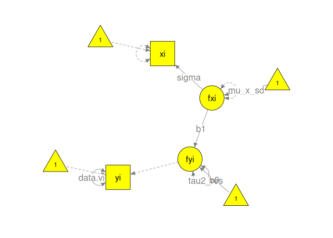<!-- -->

``` r
## Both yi and xi are observed variables
ram12 <- lavaan2RAM(m12, obs.variables = c("yi", "xi"), std.lv = FALSE)
ram12
```

```
## $A
##     yi  xi  fyi fxi        
## yi  "0" "0" "1" "0"        
## xi  "0" "0" "0" "0.1*sigma"
## fyi "0" "0" "0" "0.1*b1"   
## fxi "0" "0" "0" "0"        
## 
## $S
##     yi            xi  fyi            fxi
## yi  "0.5*data.vi" "0" "0"            "0"
## xi  "0"           "0" "0"            "0"
## fyi "0"           "0" "0.5*tau2_res" "0"
## fxi "0"           "0" "0"            "1"
## 
## $F
##    yi xi fyi fxi
## yi  1  0   0   0
## xi  0  1   0   0
## 
## $M
##   yi  xi  fyi    fxi        
## 1 "0" "0" "0*b0" "0*mu_x_sd"
## 
## $mxalgebras
## $mxalgebras$R2
## mxAlgebra 'R2' 
## $formula:  b1^2/(b1^2 + tau2_res) 
## $result: (not yet computed) <0 x 0 matrix>
## dimnames: NULL
```

``` r
impliedS(ram12)
```

```
## Correlation matrix: FALSE
## 
## Amatrix:
##     yi  xi  fyi fxi    
## yi  "0" "0" "1" "0"    
## xi  "0" "0" "0" "sigma"
## fyi "0" "0" "0" "b1"   
## fxi "0" "0" "0" "0"    
## 
## Smatrix:
##     yi        xi  fyi        fxi
## yi  "data.vi" "0" "0"        "0"
## xi  "0"       "0" "0"        "0"
## fyi "0"       "0" "tau2_res" "0"
## fxi "0"       "0" "0"        "1"
## 
## Fmatrix:
##    yi xi fyi fxi
## yi  1  0   0   0
## xi  0  1   0   0
## 
## Mmatrix:
##   yi  xi  fyi  fxi      
## 1 "0" "0" "b0" "mu_x_sd"
## 
## Model implied covariance matrix (Sigma):
##    yi                          xi        
## yi "b1^2 + data.vi + tau2_res" "b1*sigma"
## xi "b1*sigma"                  "sigma^2" 
## 
## Model implied mean vector (Mu):
##   yi                xi             
## 1 "b0 + b1*mu_x_sd" "mu_x_sd*sigma"
```

``` r
fit12 <- sem("Partial_standardize", RAM=ram12, data=dat1, intervals.type = "LB")
summary(fit12)
```

```
## 95% confidence intervals: Likelihood-based statistic
## Coefficients:
##             Estimate Std.Error      lbound      ubound z value Pr(>|z|)
## b0        1.8596e-01        NA  1.4784e-01  2.2388e-01      NA       NA
## b1       -2.5077e-02        NA -6.2383e-02  1.1941e-02      NA       NA
## mu_x_sd   1.0930e-09        NA -2.5237e-01  2.5244e-01      NA       NA
## sigma     1.8978e+01        NA  1.6039e+01  2.2919e+01      NA       NA
## tau2_res  1.6341e-02        NA  1.0578e-02  2.6605e-02      NA       NA
## 
## Mxalgebras:
##          lbound   estimate    ubound
## R2 6.346385e-34 0.03705905 0.2000467
## 
## Information Criteria:
##      df Penalty Parameters Penalty Sample-Size Adjusted
## AIC: 240.949308           484.9493             486.0402
## BIC:  -6.022934           495.5037             479.7747
## 
## Number of subjects (or studies): 61
## Number of observed statistics: 122
## Number of estimated parameters: 5
## Degrees of freedom: 117
## -2 log likelihood: 474.9493 
## OpenMx status1: 0 ("0" or "1": The optimization is considered fine.
## Other values may indicate problems.)
```

``` r
plot(fit12, color="green", sizeInt=6, nDigits=4)
```

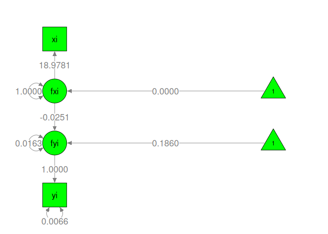<!-- -->

### Location-scale and nonlinear models

``` r
## Location-scale model with an additive heterogeneity variance
m13 <- "yi ~ mu*1          ## Mean(yi) = mu
        yi ~~ data.vi*yi   ## Var(ei) = vi 
        ## ui is the latent variable of the random effect
        ui =~ 1*yi         ## yi = 1*ui
        ui ~~ tau2*ui      ## Var(ui) = tau2
        ## Specify nonlinear on mean and tau2
        mu == b0 + b1*data.xi
        tau2 == exp(a0 + a1*data.xi)
"

ram13 <- lavaan2RAM(m13, obs.variables="yi", std.lv = FALSE)

## Get the model implied structures
## We need to replace the constraints with the new parameters
impliedS(ram13, replace.constraints=TRUE)
```

```
## Correlation matrix: FALSE
## 
## Amatrix:
##    yi ui
## yi  0  1
## ui  0  0
## 
## Smatrix:
##    yi        ui                      
## yi "data.vi" "0"                     
## ui "0"       "exp(a0 + a1 * data.xi)"
## 
## Fmatrix:
##    yi ui
## yi  1  0
## 
## Mmatrix:
##   yi                  ui 
## 1 "b0 + b1 * data.xi" "0"
## 
## Model implied covariance matrix (Sigma):
##    yi                              
## yi "data.vi + exp(a0 + a1*data.xi)"
## 
## Model implied mean vector (Mu):
##   yi               
## 1 "b0 + b1*data.xi"
```

``` r
fit13 <- sem("Location_additive", RAM=ram13, data=dat1,
             replace.constraints=TRUE)
summary(fit13)
```

```
## 95% confidence intervals: z statistic approximation (robust=FALSE)
## Coefficients:
##       Estimate   Std.Error      lbound      ubound  z value Pr(>|z|)    
## a0 -4.11206737  0.24483731 -4.59193967 -3.63219506 -16.7951   <2e-16 ***
## a1  0.00541492  0.01314676 -0.02035226  0.03118209   0.4119   0.6804    
## b0  0.18596386  0.01908419  0.14855954  0.22336818   9.7444   <2e-16 ***
## b1 -0.00129620  0.00090683 -0.00307355  0.00048115  -1.4294   0.1529    
## ---
## Signif. codes:  0 '***' 0.001 '**' 0.01 '*' 0.05 '.' 0.1 ' ' 1
## 
## Information Criteria:
##      df Penalty Parameters Penalty Sample-Size Adjusted
## AIC:  -171.4105          -49.41046            -48.69617
## BIC:  -291.7303          -40.96696            -53.55013
## 
## Number of subjects (or studies): 61
## Number of observed statistics: 61
## Number of estimated parameters: 4
## Degrees of freedom: 57
## -2 log likelihood: -57.41046 
## OpenMx status1: 0 ("0" or "1": The optimization is considered fine.
## Other values may indicate problems.)
```

``` r
## Location-scale model with a multiplicative heterogeneity variance
m14 <- "yi ~ mu*1          ## Mean(yi) = mu
        yi ~~ sigma2*yi    ## Var(yi) = sigma2 
        ## Specify nonlinear on mean and sigma2
        mu == b0 + b1*data.xi
        sigma2 == exp(a0 + a1*data.xi)*data.vi
"

ram14 <- lavaan2RAM(m14, obs.variables="yi", std.lv = FALSE)

impliedS(ram14, replace.constraints = TRUE)
```

```
## Correlation matrix: FALSE
## 
## Amatrix:
##    yi
## yi  0
## 
## Smatrix:
##    yi                                
## yi "exp(a0 + a1 * data.xi) * data.vi"
## 
## Fmatrix:
##    yi
## yi  1
## 
## Mmatrix:
##   yi                 
## 1 "b0 + b1 * data.xi"
## 
## Model implied covariance matrix (Sigma):
##    yi                            
## yi "data.vi*exp(a0 + a1*data.xi)"
## 
## Model implied mean vector (Mu):
##   yi               
## 1 "b0 + b1*data.xi"
```

``` r
fit14 <- sem("Location_multiplicative", RAM=ram14, data=dat1,
             replace.constraints=TRUE)
summary(fit14)
```

```
## 95% confidence intervals: z statistic approximation (robust=FALSE)
## Coefficients:
##       Estimate   Std.Error      lbound      ubound z value Pr(>|z|)    
## a0  1.58794178  0.18107149  1.23304819  1.94283538  8.7697  < 2e-16 ***
## a1 -0.01096064  0.01035791 -0.03126177  0.00934049 -1.0582  0.28997    
## b0  0.18875409  0.01764541  0.15416972  0.22333846 10.6971  < 2e-16 ***
## b1 -0.00260230  0.00108036 -0.00471976 -0.00048483 -2.4087  0.01601 *  
## ---
## Signif. codes:  0 '***' 0.001 '**' 0.01 '*' 0.05 '.' 0.1 ' ' 1
## 
## Information Criteria:
##      df Penalty Parameters Penalty Sample-Size Adjusted
## AIC:  -166.4544          -44.45438            -43.74009
## BIC:  -286.7742          -36.01088            -48.59405
## 
## Number of subjects (or studies): 61
## Number of observed statistics: 61
## Number of estimated parameters: 4
## Degrees of freedom: 57
## -2 log likelihood: -52.45438 
## OpenMx status1: 0 ("0" or "1": The optimization is considered fine.
## Other values may indicate problems.)
```

# Multivariate Meta-Analyses
## Data preparation

``` r
## Replace missing values with 0 as NA is not allowed in definition variables
Chan17$v_misinfo[is.na(Chan17$v_misinfo)] <-0 
Chan17$c_mis_deb[is.na(Chan17$c_mis_deb)] <-0
Chan17$v_debunk[is.na(Chan17$v_debunk)] <-0

dat2 <- data.frame(y1i=Chan17$g_misinfo,
                   y2i=Chan17$g_debunk,
                   V11i=Chan17$v_misinfo,
                   V21i=Chan17$c_mis_deb,
                   V22i=Chan17$v_debunk,
                   se11i=sqrt(Chan17$v_misinfo),
                   se22i=sqrt(Chan17$v_debunk),
                   xi=scale(Chan17$PublicationYear))
```

## Models without any external variables
### Bivariate random-effects model with known sampling covariance

``` r
## Multivariate random-effects model
m15 <- "## Means of y1 and y2
        y1i ~ mu_y1*1
        y2i ~ mu_y2*1
        ## Known sampling variances
        y1i ~~ data.V11i*y1i
        y2i ~~ data.V22i*y2i
        ## Known sampling covariance
        y1i ~~ data.V21i*y2i
        ## Random effects
        f1i =~ 1*y1i
        f2i =~ 1*y2i
        ## Heterogeneity variance-covariance matrix
        f1i ~~ T_11*f1i
        f1i ~~ T_21*f2i        
        f2i ~~ T_22*f2i
        ## Define the correlation of the random effects
        cor := T_21/sqrt(T_11*T_22)
"
plot(m15, color="yellow")
```

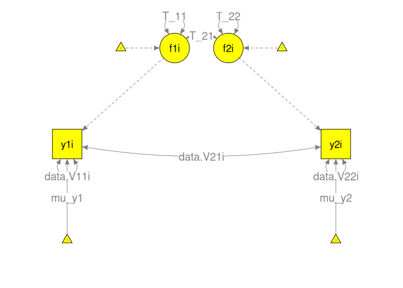<!-- -->

``` r
ram15 <- lavaan2RAM(m15, obs.variables = c("y1i", "y2i"), std.lv = FALSE)

impliedS(ram15)
```

```
## Correlation matrix: FALSE
## 
## Amatrix:
##     y1i y2i f1i f2i
## y1i   0   0   1   0
## y2i   0   0   0   1
## f1i   0   0   0   0
## f2i   0   0   0   0
## 
## Smatrix:
##     y1i         y2i         f1i    f2i   
## y1i "data.V11i" "data.V21i" "0"    "0"   
## y2i "data.V21i" "data.V22i" "0"    "0"   
## f1i "0"         "0"         "T_11" "T_21"
## f2i "0"         "0"         "T_21" "T_22"
## 
## Fmatrix:
##     y1i y2i f1i f2i
## y1i   1   0   0   0
## y2i   0   1   0   0
## 
## Mmatrix:
##   y1i     y2i     f1i f2i
## 1 "mu_y1" "mu_y2" "0" "0"
## 
## Model implied covariance matrix (Sigma):
##     y1i                y2i               
## y1i "T_11 + data.V11i" "T_21 + data.V21i"
## y2i "T_21 + data.V21i" "T_22 + data.V22i"
## 
## Model implied mean vector (Mu):
##   y1i     y2i    
## 1 "mu_y1" "mu_y2"
```

``` r
fit15 <- sem("Mul_MA", RAM=ram15, data=dat2, intervals.type = "LB")
summary(fit15)
```

```
## 95% confidence intervals: Likelihood-based statistic
## Coefficients:
##       Estimate Std.Error  lbound  ubound z value Pr(>|z|)
## mu_y1  2.46250        NA 1.68022 3.24917      NA       NA
## mu_y2  1.32116        NA 0.80909 1.86970      NA       NA
## T_11   3.42730        NA 1.62053 7.49377      NA       NA
## T_21   2.34275        NA 1.12467 4.66124      NA       NA
## T_22   2.00459        NA 1.09309 3.87635      NA       NA
## 
## Mxalgebras:
##        lbound  estimate    ubound
## cor 0.6438956 0.8937947 0.9583192
## 
## Information Criteria:
##      df Penalty Parameters Penalty Sample-Size Adjusted
## AIC:   81.24518           173.2452             175.3880
## BIC:   18.66440           180.8770             165.2725
## 
## Number of subjects (or studies): 34
## Number of observed statistics: 46
## Number of estimated parameters: 5
## Degrees of freedom: 41
## -2 log likelihood: 163.2452 
## OpenMx status1: 0 ("0" or "1": The optimization is considered fine.
## Other values may indicate problems.)
```

``` r
plot(fit15, color="green", nDigits=4)
```

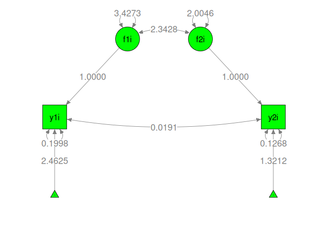<!-- -->

``` r
## Multivariate random-effects model with equal means
m15b <- "## Means of y1 and y2
         y1i ~ mu_y*1
         y2i ~ mu_y*1
         ## Known sampling variances
         y1i ~~ data.V11i*y1i
         y2i ~~ data.V22i*y2i
         ## Known sampling covariance
         y1i ~~ data.V21i*y2i
         ## Random effects
         f1i =~ 1*y1i
         f2i =~ 1*y2i
         ## Heterogeneity variance-covariance matrix
         f1i ~~ T_11*f1i
         f1i ~~ T_21*f2i        
         f2i ~~ T_22*f2i
         ## Define the correlation of the random effects
         cor := T_21/sqrt(T_11*T_22)
"
plot(m15b, color="yellow")
```

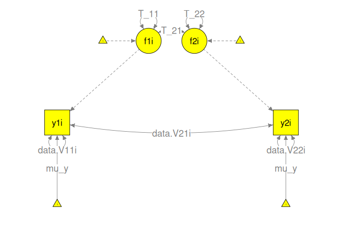<!-- -->

``` r
ram15b <- lavaan2RAM(m15b, obs.variables = c("y1i", "y2i"), std.lv = FALSE)

impliedS(ram15b)
```

```
## Correlation matrix: FALSE
## 
## Amatrix:
##     y1i y2i f1i f2i
## y1i   0   0   1   0
## y2i   0   0   0   1
## f1i   0   0   0   0
## f2i   0   0   0   0
## 
## Smatrix:
##     y1i         y2i         f1i    f2i   
## y1i "data.V11i" "data.V21i" "0"    "0"   
## y2i "data.V21i" "data.V22i" "0"    "0"   
## f1i "0"         "0"         "T_11" "T_21"
## f2i "0"         "0"         "T_21" "T_22"
## 
## Fmatrix:
##     y1i y2i f1i f2i
## y1i   1   0   0   0
## y2i   0   1   0   0
## 
## Mmatrix:
##   y1i    y2i    f1i f2i
## 1 "mu_y" "mu_y" "0" "0"
## 
## Model implied covariance matrix (Sigma):
##     y1i                y2i               
## y1i "T_11 + data.V11i" "T_21 + data.V21i"
## y2i "T_21 + data.V21i" "T_22 + data.V22i"
## 
## Model implied mean vector (Mu):
##   y1i    y2i   
## 1 "mu_y" "mu_y"
```

``` r
fit15b <- sem("Mul_MA_eq", RAM=ram15b, data=dat2, intervals.type = "LB")
summary(fit15b)
```

```
## 95% confidence intervals: Likelihood-based statistic
## Coefficients:
##      Estimate Std.Error   lbound   ubound z value Pr(>|z|)
## mu_y  1.11652        NA  0.57667  1.65539      NA       NA
## T_11  7.15653        NA  3.51740 15.10396      NA       NA
## T_21  3.13158        NA  1.37705  6.24789      NA       NA
## T_22  1.93691        NA  1.05781  3.75966      NA       NA
## 
## Mxalgebras:
##        lbound  estimate    ubound
## cor 0.4891738 0.8411191 0.9482105
## 
## Information Criteria:
##      df Penalty Parameters Penalty Sample-Size Adjusted
## AIC:   91.09663           183.0966             184.4759
## BIC:   26.98949           189.2021             176.7185
## 
## Number of subjects (or studies): 34
## Number of observed statistics: 46
## Number of estimated parameters: 4
## Degrees of freedom: 42
## -2 log likelihood: 175.0966 
## OpenMx status1: 0 ("0" or "1": The optimization is considered fine.
## Other values may indicate problems.)
```

``` r
## Compare the two models
anova(fit15, fit15b)
```

```
##     base comparison ep minus2LL df      AIC   diffLL diffdf            p
## 1 Mul_MA       <NA>  5 163.2452 41 173.2452       NA     NA           NA
## 2 Mul_MA  Mul_MA_eq  4 175.0966 42 183.0966 11.85145      1 0.0005761634
```

### Bivariate random-effects model with a common between- and within-correlation

``` r
## Multivariate random-effects model with a common between- and within-correlation
m16 <- "## Means of y1 and y2
        y1i ~ mu_y1*1
        y2i ~ mu_y2*1
        ## Error variances of y1i and y2i are set at 0 because e1i and e2i 
        ## are used to represent the sampling errors.
        y1i ~~ 0*y1i
        y2i ~~ 0*y2i
        ## e1i and e2i: sampling errors
        ## Known sampling sds
        e1i =~ data.se11i*y1i
        e2i =~ data.se22i*y2i
        ## Common correlation (within)
        e1i ~~ cor*e2i
        ## e1i and e2i variances are set at 1
        e1i ~~ 1*e1i
        e2i ~~ 1*e2i
        ## Random effect taus (SDs)
        f1i =~ sd_11*y1i
        f2i =~ sd_22*y2i
        ## Common correlation (between)
        f1i ~~ cor*f2i
        ## f1i and f2i variances are set at 1
        f1i ~~ 1*f1i
        f2i ~~ 1*f2i
        ## Compute the original T
        T_11 := sd_11^2
        T_21 := cor*sd_11*sd_22
        T_22 := sd_22^2
"
plot(m16, color="yellow")
```

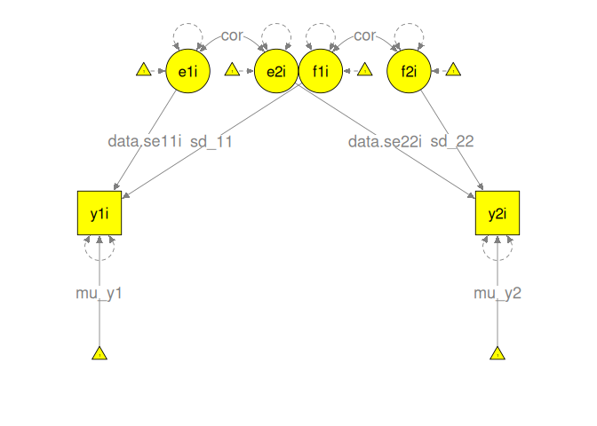<!-- -->

``` r
ram16 <- lavaan2RAM(m16, obs.variables = c("y1i", "y2i"), std.lv = TRUE)

impliedS(ram16)
```

```
## Correlation matrix: FALSE
## 
## Amatrix:
##     y1i y2i e1i          e2i          f1i     f2i    
## y1i "0" "0" "data.se11i" "0"          "sd_11" "0"    
## y2i "0" "0" "0"          "data.se22i" "0"     "sd_22"
## e1i "0" "0" "0"          "0"          "0"     "0"    
## e2i "0" "0" "0"          "0"          "0"     "0"    
## f1i "0" "0" "0"          "0"          "0"     "0"    
## f2i "0" "0" "0"          "0"          "0"     "0"    
## 
## Smatrix:
##     y1i y2i e1i   e2i   f1i   f2i  
## y1i "0" "0" "0"   "0"   "0"   "0"  
## y2i "0" "0" "0"   "0"   "0"   "0"  
## e1i "0" "0" "1"   "cor" "0"   "0"  
## e2i "0" "0" "cor" "1"   "0"   "0"  
## f1i "0" "0" "0"   "0"   "1"   "cor"
## f2i "0" "0" "0"   "0"   "cor" "1"  
## 
## Fmatrix:
##     y1i y2i e1i e2i f1i f2i
## y1i   1   0   0   0   0   0
## y2i   0   1   0   0   0   0
## 
## Mmatrix:
##   y1i     y2i     e1i e2i f1i f2i
## 1 "mu_y1" "mu_y2" "0" "0" "0" "0"
## 
## Model implied covariance matrix (Sigma):
##     y1i                                        
## y1i "data.se11i^2 + sd_11^2"                   
## y2i "cor*(data.se11i*data.se22i + sd_11*sd_22)"
##     y2i                                        
## y1i "cor*(data.se11i*data.se22i + sd_11*sd_22)"
## y2i "data.se22i^2 + sd_22^2"                   
## 
## Model implied mean vector (Mu):
##   y1i     y2i    
## 1 "mu_y1" "mu_y2"
```

``` r
fit16 <- sem("Mul_no_cor", RAM=ram16, data=dat2, intervals.type = "LB")
summary(fit16)
```

```
## 95% confidence intervals: Likelihood-based statistic
## Coefficients:
##       Estimate Std.Error   lbound   ubound z value Pr(>|z|)
## cor    0.88890        NA  0.65480  0.95815      NA       NA
## mu_y1  2.47023        NA  1.69323  3.25322      NA       NA
## mu_y2  1.31957        NA  0.80622  1.86682      NA       NA
## sd_11  1.85706        NA -2.62492  2.73485      NA       NA
## sd_22  1.41526        NA -1.93626  1.96625      NA       NA
## 
## Mxalgebras:
##        lbound estimate   ubound
## T_11 1.637613 3.448678 6.490188
## T_21 1.137789 2.336228 4.571310
## T_22 1.094094 2.002973 3.865531
## 
## Information Criteria:
##      df Penalty Parameters Penalty Sample-Size Adjusted
## AIC:   80.98687           172.9869             175.1297
## BIC:   18.40609           180.6187             165.0142
## 
## Number of subjects (or studies): 34
## Number of observed statistics: 46
## Number of estimated parameters: 5
## Degrees of freedom: 41
## -2 log likelihood: 162.9869 
## OpenMx status1: 0 ("0" or "1": The optimization is considered fine.
## Other values may indicate problems.)
```

``` r
plot(fit16, color="green", nDigits=4)
```

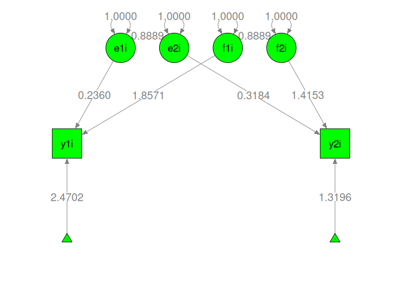<!-- -->

### Bivariate random-effects model by regressing a true effect on another true effect

``` r
## Multivariate meta-regression: regressing f2i on f1i
m17 <- "## Means of y1 and y2
        y1i + y2i ~ 0*1
        ## Known sampling variances and covariance
        y1i ~~ data.V11i*y1i
        y2i ~~ data.V22i*y2i
        y1i ~~ data.V21i*y2i
        ## f1i and f2i: True effect sizes
        f1i =~ 1*y1i
        f2i =~ 1*y2i
        ## Heterogeneity variances
        f1i ~~ T_11*f1i
        f2i ~~ T_22*f2i
        ## Regressing f2i on f1i
        f2i ~ b0*1+ b1*f1i
        f1i ~ mu_1*1
        ## Define R2 on f2i
        R2 := b1^2*T_11/(b1^2*T_11 + T_22)
"
plot(m17, color="yellow", layout="spring")
```

<!-- -->

``` r
ram17 <- lavaan2RAM(m17, obs.variables = c("y1i", "y2i"), std.lv = FALSE)

impliedS(ram17)
```

```
## Correlation matrix: FALSE
## 
## Amatrix:
##     y1i y2i f1i  f2i
## y1i "0" "0" "1"  "0"
## y2i "0" "0" "0"  "1"
## f1i "0" "0" "0"  "0"
## f2i "0" "0" "b1" "0"
## 
## Smatrix:
##     y1i         y2i         f1i    f2i   
## y1i "data.V11i" "data.V21i" "0"    "0"   
## y2i "data.V21i" "data.V22i" "0"    "0"   
## f1i "0"         "0"         "T_11" "0"   
## f2i "0"         "0"         "0"    "T_22"
## 
## Fmatrix:
##     y1i y2i f1i f2i
## y1i   1   0   0   0
## y2i   0   1   0   0
## 
## Mmatrix:
##   y1i y2i f1i    f2i 
## 1 "0" "0" "mu_1" "b0"
## 
## Model implied covariance matrix (Sigma):
##     y1i                   y2i                           
## y1i "T_11 + data.V11i"    "T_11*b1 + data.V21i"         
## y2i "T_11*b1 + data.V21i" "T_11*b1^2 + T_22 + data.V22i"
## 
## Model implied mean vector (Mu):
##   y1i    y2i           
## 1 "mu_1" "b0 + b1*mu_1"
```

``` r
fit17 <- sem("Mul_meta_reg", RAM=ram17, data=dat2, intervals.type = "LB")
summary(fit17)
```

```
## 95% confidence intervals: Likelihood-based statistic
## Coefficients:
##      Estimate Std.Error   lbound   ubound z value Pr(>|z|)
## b0   -0.36210        NA -1.10631  0.34321      NA       NA
## b1    0.68356        NA  0.40918  0.93797      NA       NA
## mu_1  2.46250        NA  1.67733  3.24930      NA       NA
## T_11  3.42730        NA  1.62485  7.48329      NA       NA
## T_22  0.40318        NA  0.17598  1.06625      NA       NA
## 
## Mxalgebras:
##       lbound  estimate    ubound
## R2 0.4181369 0.7988689 0.9292883
## 
## Information Criteria:
##      df Penalty Parameters Penalty Sample-Size Adjusted
## AIC:   81.24518           173.2452             175.3880
## BIC:   18.66440           180.8770             165.2725
## 
## Number of subjects (or studies): 34
## Number of observed statistics: 46
## Number of estimated parameters: 5
## Degrees of freedom: 41
## -2 log likelihood: 163.2452 
## OpenMx status1: 0 ("0" or "1": The optimization is considered fine.
## Other values may indicate problems.)
```

``` r
plot(fit17, color="green", nDigits=4, layout="spring")
```

<!-- -->

## Models with external variables

### Bivariate meta-regression

``` r
## Multivariate meta-regression: regressing f2i and f1i on xi
## Treating xi as a variable
# m18 <- "## Means of y1 and y2
#         y1i + y2i ~ 0*1
#         ## Known sampling variances
#         y1i ~~ data.V11i*y1i
#         y2i ~~ data.V22i*y2i
#         y1i ~~ data.V21i*y2i
#         ## f1i and f2i: True effect sizes
#         f1i =~ 1*y1i
#         f2i =~ 1*y2i
#         ## Heterogeneity variances and covariance
#         f1i ~~ T_11*f1i
#         f1i ~~ T_21*f2i
#         f2i ~~ T_22*f2i
#         ## Regressing f2i on f1i
#         f1i ~ b0_1*1 + b1_1*xi
#         f2i ~ b0_2*1 + b1_2*xi
#         xi ~ meanx*1
#         xi ~~ varx*xi
#         # Define R2s
#         R2_1 := b1_1^2*varx/(b1_1^2*varx + T_11)
#         R2_2 := b1_2^2*varx/(b1_2^2*varx + T_22)
# "

## Multivariate meta-regression: regressing f2i and f1i on xi
## Treating xi as a design matrix
m18 <- "## Means of y1 and y2
        y1i + y2i ~ 0*1
        ## Known sampling variances
        y1i ~~ data.V11i*y1i
        y2i ~~ data.V22i*y2i
        y1i ~~ data.V21i*y2i
        ## f1i and f2i: True effect sizes
        f1i =~ 1*y1i
        f2i =~ 1*y2i
        ## Heterogeneity variances and covariance
        f1i ~~ T_11*f1i 
        f1i ~~ T_21*f2i        
        f2i ~~ T_22*f2i
        ## etai: a phantom latent variable to represent the covariate x
        etai =~ 0*y1i        ## Arbitarily loaded on either y1i or y2i
        etai ~ data.xi*1     ## etai = xi
        etai ~~ 0*etai       ## Var(etai) = 0
        ## Regressing f2i on f1i
        f1i ~ b0_1*1 + b1_1*etai
        f2i ~ b0_2*1 + b1_2*etai
"

plot(m18, color="yellow", layout="tree")
```

<!-- -->

``` r
ram18 <- lavaan2RAM(m18, obs.variables = c("y1i", "y2i"), std.lv = FALSE)

impliedS(ram18)
```

```
## Correlation matrix: FALSE
## 
## Amatrix:
##      y1i y2i f1i f2i etai  
## y1i  "0" "0" "1" "0" "0"   
## y2i  "0" "0" "0" "1" "0"   
## f1i  "0" "0" "0" "0" "b1_1"
## f2i  "0" "0" "0" "0" "b1_2"
## etai "0" "0" "0" "0" "0"   
## 
## Smatrix:
##      y1i         y2i         f1i    f2i    etai
## y1i  "data.V11i" "data.V21i" "0"    "0"    "0" 
## y2i  "data.V21i" "data.V22i" "0"    "0"    "0" 
## f1i  "0"         "0"         "T_11" "T_21" "0" 
## f2i  "0"         "0"         "T_21" "T_22" "0" 
## etai "0"         "0"         "0"    "0"    "0" 
## 
## Fmatrix:
##     y1i y2i f1i f2i etai
## y1i   1   0   0   0    0
## y2i   0   1   0   0    0
## 
## Mmatrix:
##   y1i y2i f1i    f2i    etai     
## 1 "0" "0" "b0_1" "b0_2" "data.xi"
## 
## Model implied covariance matrix (Sigma):
##     y1i                y2i               
## y1i "T_11 + data.V11i" "T_21 + data.V21i"
## y2i "T_21 + data.V21i" "T_22 + data.V22i"
## 
## Model implied mean vector (Mu):
##   y1i                   y2i                  
## 1 "b0_1 + b1_1*data.xi" "b0_2 + b1_2*data.xi"
```

``` r
fit18 <- sem("Mul_covariate", RAM=ram18, data=dat2, intervals.type = "z")
summary(fit18)
```

```
## 95% confidence intervals: z statistic approximation (robust=FALSE)
## Coefficients:
##      Estimate Std.Error   lbound   ubound z value  Pr(>|z|)    
## b1_1  0.13337   0.34484 -0.54251  0.80925  0.3868  0.698935    
## b1_2  0.28044   0.24539 -0.20052  0.76140  1.1428  0.253113    
## T_11  3.72489   1.45800  0.86726  6.58252  2.5548  0.010625 *  
## T_21  2.42713   0.85227  0.75670  4.09756  2.8478  0.004402 ** 
## T_22  1.89816   0.60970  0.70317  3.09315  3.1133  0.001850 ** 
## b0_1  2.38906   0.39042  1.62385  3.15427  6.1192 9.407e-10 ***
## b0_2  1.32371   0.25263  0.82856  1.81885  5.2397 1.608e-07 ***
## ---
## Signif. codes:  0 '***' 0.001 '**' 0.01 '*' 0.05 '.' 0.1 ' ' 1
## 
## Information Criteria:
##      df Penalty Parameters Penalty Sample-Size Adjusted
## AIC:   82.49036           174.4904             178.7981
## BIC:   22.96230           185.1749             163.3286
## 
## Number of subjects (or studies): 34
## Number of observed statistics: 46
## Number of estimated parameters: 7
## Degrees of freedom: 39
## -2 log likelihood: 160.4904 
## OpenMx status1: 0 ("0" or "1": The optimization is considered fine.
## Other values may indicate problems.)
```

``` r
plot(fit18, color="green", nDigits=4, layout="tree")
```

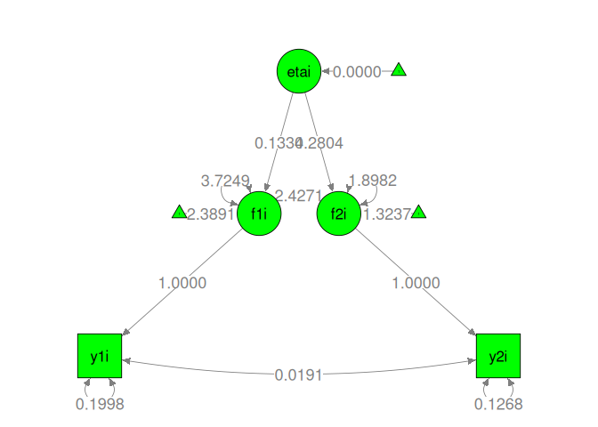<!-- -->

``` r
## Multivariate meta-regression: regressing f2i and f1i on xi
## The regression coefficients are assumed the same
m18b <- "## Means of y1 and y2
         y1i + y2i ~ 0*1
         ## Known sampling variances
         y1i ~~ data.V11i*y1i
         y2i ~~ data.V22i*y2i
         y1i ~~ data.V21i*y2i
         ## f1i and f2i: True effect sizes
         f1i =~ 1*y1i
         f2i =~ 1*y2i
         ## Heterogeneity variances and covariance
         f1i ~~ T_11*f1i 
         f1i ~~ T_21*f2i        
         f2i ~~ T_22*f2i
         ## etai: a phantom latent variable to represent the covariate x
         etai =~ 0*y1i        ## Arbitarily loading on either y1i or y2i
         etai ~ data.xi*1     ## etai = xi
         etai ~~ 0*etai       ## Var(etai) = 0
         ## Regressing f2i on f1i with the same regression coefficients
         f1i ~ b0_1*1 + b1*etai
         f2i ~ b0_2*1 + b1*etai
"

plot(m18b, color="yellow", layout="tree")
```

<!-- -->

``` r
ram18b <- lavaan2RAM(m18b, obs.variables = c("y1i", "y2i"), std.lv = FALSE)

impliedS(ram18b)
```

```
## Correlation matrix: FALSE
## 
## Amatrix:
##      y1i y2i f1i f2i etai
## y1i  "0" "0" "1" "0" "0" 
## y2i  "0" "0" "0" "1" "0" 
## f1i  "0" "0" "0" "0" "b1"
## f2i  "0" "0" "0" "0" "b1"
## etai "0" "0" "0" "0" "0" 
## 
## Smatrix:
##      y1i         y2i         f1i    f2i    etai
## y1i  "data.V11i" "data.V21i" "0"    "0"    "0" 
## y2i  "data.V21i" "data.V22i" "0"    "0"    "0" 
## f1i  "0"         "0"         "T_11" "T_21" "0" 
## f2i  "0"         "0"         "T_21" "T_22" "0" 
## etai "0"         "0"         "0"    "0"    "0" 
## 
## Fmatrix:
##     y1i y2i f1i f2i etai
## y1i   1   0   0   0    0
## y2i   0   1   0   0    0
## 
## Mmatrix:
##   y1i y2i f1i    f2i    etai     
## 1 "0" "0" "b0_1" "b0_2" "data.xi"
## 
## Model implied covariance matrix (Sigma):
##     y1i                y2i               
## y1i "T_11 + data.V11i" "T_21 + data.V21i"
## y2i "T_21 + data.V21i" "T_22 + data.V22i"
## 
## Model implied mean vector (Mu):
##   y1i                 y2i                
## 1 "b0_1 + b1*data.xi" "b0_2 + b1*data.xi"
```

``` r
fit18b <- sem("Mul_covariate_eq_beta", RAM=ram18b, data=dat2, intervals.type = "z")
summary(fit18b)
```

```
## 95% confidence intervals: z statistic approximation (robust=FALSE)
## Coefficients:
##      Estimate Std.Error   lbound   ubound z value  Pr(>|z|)    
## b1    0.35320   0.23887 -0.11499  0.82138  1.4786  0.139249    
## T_11  3.75986   1.51453  0.79143  6.72830  2.4825  0.013046 *  
## T_21  2.41700   0.87153  0.70884  4.12515  2.7733  0.005549 ** 
## T_22  1.89275   0.61069  0.69583  3.08967  3.0994  0.001939 ** 
## b0_1  2.41763   0.39451  1.64440  3.19087  6.1281 8.892e-10 ***
## b0_2  1.32098   0.25259  0.82591  1.81605  5.2297 1.697e-07 ***
## ---
## Signif. codes:  0 '***' 0.001 '**' 0.01 '*' 0.05 '.' 0.1 ' ' 1
## 
## Information Criteria:
##      df Penalty Parameters Penalty Sample-Size Adjusted
## AIC:   81.23251           173.2325             176.3436
## BIC:   20.17809           182.3907             163.6653
## 
## Number of subjects (or studies): 34
## Number of observed statistics: 46
## Number of estimated parameters: 6
## Degrees of freedom: 40
## -2 log likelihood: 161.2325 
## OpenMx status1: 0 ("0" or "1": The optimization is considered fine.
## Other values may indicate problems.)
```

``` r
plot(fit18b, color="green", nDigits=4, layout="tree")
```

<!-- -->

``` r
## Compare the two models
anova(fit18, fit18b)
```

```
##            base            comparison ep minus2LL df      AIC   diffLL diffdf
## 1 Mul_covariate                  <NA>  7 160.4904 39 174.4904       NA     NA
## 2 Mul_covariate Mul_covariate_eq_beta  6 161.2325 40 173.2325 0.742145      1
##           p
## 1        NA
## 2 0.3889746
```

### Mediation model with a true effect size as a mediator

``` r
## Multivariate random-effects model: a mediation model
## Treating xi as a variable
# m19 <- "## Means of y1 and y2
#         y1i + y2i ~ 0*1
#         ## Known sampling variances
#         y1i ~~ data.V11i*y1i
#         y2i ~~ data.V22i*y2i
#         y1i ~~ data.V21i*y2i
#         ## f1i and f2i: True effect sizes
#         f1i =~ 1*y1i
#         f2i =~ 1*y2i
#         ## Heterogeneity variances
#         f1i ~~ T_11*f1i
#         f2i ~~ T_22*f2i
#         ## Regressing f2i on f1i
#         f2i ~ b*f1i + cp*xi
#         f1i ~ a*xi
#         xi ~ meanx*1
#         xi ~~ varx*xi
#         f1i ~ interceptf1*1
#         f2i ~ interceptf2*1
#         ## Define the direct, indirect, and total effects
#         direct := cp
#         indirect := a*b
#         total := a*b + cp
# "

## Multivariate random-effects model: a mediation model
## Treating xi as a design matrix
m19 <- "## Means of y1 and y2 are 0
        y1i + y2i ~ 0*1
        ## Known sampling variances
        y1i ~~ data.V11i*y1i
        y2i ~~ data.V22i*y2i
        y1i ~~ data.V21i*y2i
        ## f1i and f2i: True effect sizes
        f1i =~ 1*y1i
        f2i =~ 1*y2i
        ## Heterogeneity variances
        f1i ~~ T_11*f1i
        f2i ~~ T_22*f2i
        ## etai: a phantom latent variable to represent the covariate x
        etai =~ 0*y1i        ## Arbitarily loading on either y1i or y2i
        etai ~ data.xi*1     ## etai = xi
        etai ~~ 0*etai       ## Var(etai) = 0     
        ## Mediation model
        f1i ~ interceptf1*1 + a*etai
        f2i ~ interceptf2*1 + b*f1i + cp*etai
        ## Define the direct, indirect, and total effects
        direct := cp
        indirect := a*b
        total := a*b + cp
"
plot(m19, color="yellow", layout="tree")
```

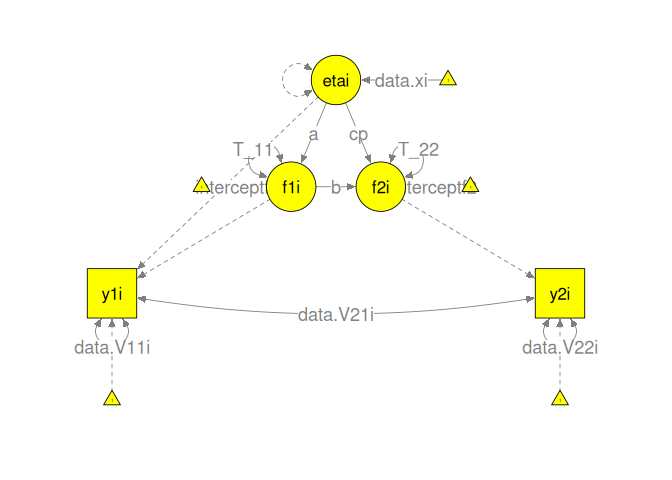<!-- -->

``` r
ram19 <- lavaan2RAM(m19, obs.variables = c("y1i", "y2i"), std.lv = FALSE)

impliedS(ram19, replace.constraints = TRUE)
```

```
## Correlation matrix: FALSE
## 
## Amatrix:
##      y1i y2i f1i f2i etai
## y1i  "0" "0" "1" "0" "0" 
## y2i  "0" "0" "0" "1" "0" 
## f1i  "0" "0" "0" "0" "a" 
## f2i  "0" "0" "b" "0" "cp"
## etai "0" "0" "0" "0" "0" 
## 
## Smatrix:
##      y1i         y2i         f1i    f2i    etai
## y1i  "data.V11i" "data.V21i" "0"    "0"    "0" 
## y2i  "data.V21i" "data.V22i" "0"    "0"    "0" 
## f1i  "0"         "0"         "T_11" "0"    "0" 
## f2i  "0"         "0"         "0"    "T_22" "0" 
## etai "0"         "0"         "0"    "0"    "0" 
## 
## Fmatrix:
##     y1i y2i f1i f2i etai
## y1i   1   0   0   0    0
## y2i   0   1   0   0    0
## 
## Mmatrix:
##   y1i y2i f1i           f2i           etai     
## 1 "0" "0" "interceptf1" "interceptf2" "data.xi"
## 
## Model implied covariance matrix (Sigma):
##     y1i                  y2i                          
## y1i "T_11 + data.V11i"   "T_11*b + data.V21i"         
## y2i "T_11*b + data.V21i" "T_11*b^2 + T_22 + data.V22i"
## 
## Model implied mean vector (Mu):
##   y1i                       y2i                                               
## 1 "a*data.xi + interceptf1" "b*interceptf1 + data.xi*(a*b + cp) + interceptf2"
```

``` r
fit19 <- sem("Mul_mediation", RAM=ram19, data=dat2, intervals.type = "LB")
summary(fit19)
```

```
## 95% confidence intervals: Likelihood-based statistic
## Coefficients:
##             Estimate Std.Error   lbound   ubound z value Pr(>|z|)
## a            0.13337        NA -0.60336  0.84454      NA       NA
## b            0.65160        NA  0.41732  0.88895      NA       NA
## cp           0.19354        NA -0.05546  0.42924      NA       NA
## interceptf1  2.38906        NA  1.56743  3.18664      NA       NA
## interceptf2 -0.23300        NA -0.95005  0.39975      NA       NA
## T_11         3.72489        NA  1.72998  8.14576      NA       NA
## T_22         0.31665        NA  0.13556  0.86963      NA       NA
## 
## Mxalgebras:
##               lbound   estimate    ubound
## direct   -0.05545953 0.19353602 0.4292424
## indirect -0.38098155 0.08690437 0.5612046
## total    -0.22448848 0.28044039 0.7828064
## 
## Information Criteria:
##      df Penalty Parameters Penalty Sample-Size Adjusted
## AIC:   82.49036           174.4904             178.7981
## BIC:   22.96230           185.1749             163.3286
## 
## Number of subjects (or studies): 34
## Number of observed statistics: 46
## Number of estimated parameters: 7
## Degrees of freedom: 39
## -2 log likelihood: 160.4904 
## OpenMx status1: 0 ("0" or "1": The optimization is considered fine.
## Other values may indicate problems.)
```

``` r
plot(fit19, color="green", nDigits=4, layout="tree")
```

<!-- -->

## One-stage meta-analytic structural equation modeling (OSMASEM)

### OSMASEM using the osmasem() function

``` r
#### Data preparation
dat_osmasem <- Cor2DataFrame(Becker92)

#### Specify the model to fit
m20 <- "Math ~ s2m*Spatial + v2m*Verbal
        Spatial ~~ r_sv*Verbal
        Spatial ~~ 1*Spatial
        Verbal ~~ 1*Verbal
"
plot(m20, col = "yellow")
```

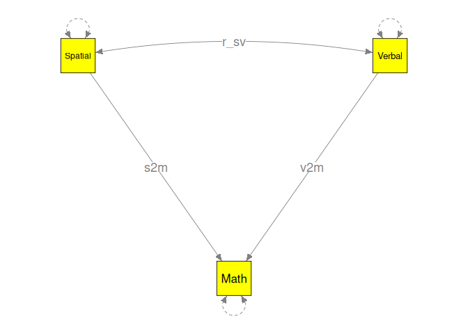<!-- -->

``` r
## std.lv = TRUE to standardize the latent variables
ram20 <- lavaan2RAM(m20, obs.variables = c("Math", "Spatial", "Verbal"), std.lv = TRUE)

## Fit the osmasem using m20
fit.osmasem <- osmasem(RAM=ram20, data=dat_osmasem)
summary(fit.osmasem)
```

```
## Summary of osmasem 
##  
## free parameters:
##     name  matrix    row     col   Estimate  Std.Error A   z value     Pr(>|z|)
## 1    s2m      A0   Math Spatial  0.3420455 0.04489421    7.618922 2.553513e-14
## 2    v2m      A0   Math  Verbal  0.2445485 0.09485628    2.578095 9.934665e-03
## 3   r_sv      S0 Verbal Spatial  0.1570785 0.05033867    3.120434 1.805845e-03
## 4 Tau1_1 vecTau1      1       1 -6.2104200 2.68058695   -2.316813 2.051389e-02
## 5 Tau1_2 vecTau1      2       1 -3.1741347 0.75128419   -4.224945 2.389987e-05
## 6 Tau1_3 vecTau1      3       1 -5.4735694 2.37038631   -2.309147 2.093545e-02
## 
## To obtain confidence intervals re-run with intervals=TRUE
## 
## Model Statistics: 
##                |  Parameters  |  Degrees of Freedom  |  Fit (-2lnL units)
##        Model:              6                     12             -18.20738
##    Saturated:              9                      9                    NA
## Independence:              6                     12                    NA
## Number of observations/statistics: 538/18
## 
## Information Criteria: 
##       |  df Penalty  |  Parameters Penalty  |  Sample-Size Adjusted
## AIC:      -42.20738              -6.207377                -6.049185
## BIC:      -93.66168              19.519774                 0.473715
## To get additional fit indices, see help(mxRefModels)
## timestamp: 2024-10-15 10:19:53 
## Wall clock time: 0.04102325 secs 
## optimizer:  SLSQP 
## OpenMx version number: 2.21.12 
## Need help?  See help(mxSummary)
```

``` r
plot(fit.osmasem, col = "green")
```

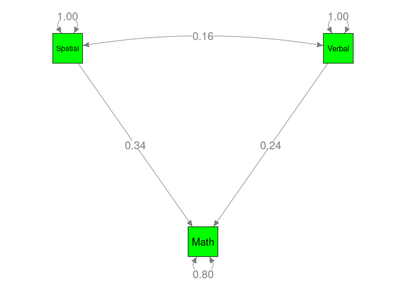<!-- -->

### OSMASEM using the sem() function

``` r
#### Data preparation
## Use the correlations and sampling covariance matrices prepared by Cor2DataFrame(Becker92)
dat3 <- dat_osmasem$data

## Use better names for the correlations and sampling covariance matrices
colnames(dat3) <- c("rS_M", "rV_M", "rV_S", 
                    "cSM_SM", "cVM_SM", "cVS_SM", "cVM_VM", "cVS_VM", "cVS_VS")

## Data set including the correlation coefficients and sampling covariance matrices
dat3
```

```
##                   rS_M   rV_M   rV_S      cSM_SM       cVM_SM      cVS_SM
## Berry (1957)     0.460  0.310  0.190 0.007146778 0.0008225680 0.002045514
## Rosenberg (1981) 0.460  0.550  0.320 0.010668379 0.0012278914 0.003053448
## Weiner 1 (1984)  0.397  0.402  0.183 0.010668379 0.0012278914 0.003053448
## Weiner 2 (1984)  0.266  0.567  0.218 0.010515974 0.0012103501 0.003009828
## Becker 1 (1978)  0.280  0.190  0.180 0.004811230 0.0005537549 0.001377045
## Becker 2 (1978)  0.470 -0.210 -0.150 0.009947543 0.0011449258 0.002847134
##                       cVM_VM      cVS_VM      cVS_VS
## Berry (1957)     0.008242393 0.003113865 0.009219172
## Rosenberg (1981) 0.012303862 0.004648233 0.013761952
## Weiner 1 (1984)  0.012303862 0.004648233 0.013761952
## Weiner 2 (1984)  0.012128093 0.004581829 0.013565353
## Becker 1 (1978)  0.005548800 0.002096262 0.006206370
## Becker 2 (1978)  0.011472520 0.004334163 0.012832090
```

``` r
## corr = TRUE to get the model-implied correlation vector
impliedS(ram20, corr = TRUE)
```

```
## Correlation matrix: TRUE
## 
## Amatrix:
##         Math Spatial Verbal
## Math    "0"  "s2m"   "v2m" 
## Spatial "0"  "0"     "0"   
## Verbal  "0"  "0"     "0"   
## 
## Smatrix:
##         Math           Spatial Verbal
## Math    "MathWITHMath" "0"     "0"   
## Spatial "0"            "1"     "r_sv"
## Verbal  "0"            "r_sv"  "1"   
## 
## Fmatrix:
##         Math Spatial Verbal
## Math       1       0      0
## Spatial    0       1      0
## Verbal     0       0      1
## 
## Mmatrix:
##   Math       Spatial       Verbal      
## 1 "Mathmean" "Spatialmean" "Verbalmean"
## 
## Model implied covariance matrix (Sigma):
##         Math             Spatial          Verbal          
## Math    "1"              "r_sv*v2m + s2m" "r_sv*s2m + v2m"
## Spatial "r_sv*v2m + s2m" "1"              "r_sv"          
## Verbal  "r_sv*s2m + v2m" "r_sv"           "1"             
## 
## Model implied mean vector (Mu):
##   Math                                          Spatial       Verbal      
## 1 "Mathmean + Spatialmean*s2m + Verbalmean*v2m" "Spatialmean" "Verbalmean"
```

``` r
#### OSMASEM using the SEM-based meta-analysis
m21 <- "## Create true effect sizes
        rhoS_M =~ 1*rS_M
        rhoV_M =~ 1*rV_M                  
        rhoV_S =~ 1*rV_S
        ## Average effect sizes
        rhoS_M ~ muS_M*1
        rhoV_M ~ muV_M*1
        rhoV_S ~ muV_S*1
        ## Heterogeneity variances
        ## As there are only a few studies, random effects are assumed to be independent.
        rhoS_M ~~ tau2S_M*rhoS_M
        rhoV_M ~~ tau2V_M*rhoV_M
        rhoV_S ~~ tau2V_S*rhoV_S
        ## Known sampling variances and covariances
        rS_M ~~ data.cSM_SM*rS_M
        rV_M ~~ data.cVM_SM*rS_M
        rV_S ~~ data.cVS_SM*rS_M
        rV_M ~~ data.cVM_VM*rV_M
        rV_S ~~ data.cVS_VM*rV_M
        rV_S ~~ data.cVS_VS*rV_S
        ## Fit the model-implied correlation vector based on impliedS(ram20, corr=TRUE)
        muS_M == r_sv*v2m + s2m
        muV_M == r_sv*s2m + v2m
        muV_S == r_sv
"

## std.lv = FALSE to keep the true effect sizes unstandardized
ram21 <- lavaan2RAM(m21, obs.variables = c("rS_M", "rV_M", "rV_S"), std.lv = FALSE)

fit21 <- sem("OSMASEM", RAM=ram21, data=dat3, replace.constraints = TRUE)
summary(fit21)
```

```
## 95% confidence intervals: z statistic approximation (robust=FALSE)
## Coefficients:
##           Estimate  Std.Error     lbound     ubound z value  Pr(>|z|)    
## tau2S_M  0.0020084  0.0053837 -0.0085434  0.0125602  0.3731  0.709109    
## tau2V_M  0.0418303  0.0314264 -0.0197644  0.1034250  1.3311  0.183171    
## tau2V_S  0.0041962  0.0099467 -0.0152989  0.0236914  0.4219  0.673118    
## r_sv     0.1570785  0.0503387  0.0584165  0.2557405  3.1204  0.001806 ** 
## s2m      0.3420455  0.0448942  0.2540545  0.4300365  7.6189 2.554e-14 ***
## v2m      0.2445485  0.0948563  0.0586336  0.4304634  2.5781  0.009935 ** 
## ---
## Signif. codes:  0 '***' 0.001 '**' 0.01 '*' 0.05 '.' 0.1 ' ' 1
## 
## Information Criteria:
##      df Penalty Parameters Penalty Sample-Size Adjusted
## AIC:  -42.20738          -6.207377            -90.20738
## BIC:  -39.70849          -7.456820            -24.79905
## 
## Number of subjects (or studies): 6
## Number of observed statistics: 18
## Number of estimated parameters: 6
## Degrees of freedom: 12
## -2 log likelihood: -18.20738 
## OpenMx status1: 0 ("0" or "1": The optimization is considered fine.
## Other values may indicate problems.)
```

``` r
sessionInfo()
```

```
## R version 4.4.1 (2024-06-14)
## Platform: x86_64-pc-linux-gnu
## Running under: Ubuntu 24.04.1 LTS
## 
## Matrix products: default
## BLAS:   /usr/lib/x86_64-linux-gnu/blas/libblas.so.3.12.0 
## LAPACK: /home/mikewlcheung/Sync/Apps/miniconda3/lib/libmkl_rt.so.2;  LAPACK version 3.10.1
## 
## locale:
##  [1] LC_CTYPE=en_SG.UTF-8       LC_NUMERIC=C              
##  [3] LC_TIME=en_SG.UTF-8        LC_COLLATE=en_SG.UTF-8    
##  [5] LC_MONETARY=en_SG.UTF-8    LC_MESSAGES=en_SG.UTF-8   
##  [7] LC_PAPER=en_SG.UTF-8       LC_NAME=C                 
##  [9] LC_ADDRESS=C               LC_TELEPHONE=C            
## [11] LC_MEASUREMENT=en_SG.UTF-8 LC_IDENTIFICATION=C       
## 
## time zone: Asia/Singapore
## tzcode source: system (glibc)
## 
## attached base packages:
## [1] stats     graphics  grDevices utils     datasets  methods   base     
## 
## other attached packages:
## [1] symSEM_0.4.1   caracas_2.1.1  metaSEM_1.5.0  OpenMx_2.21.12
## 
## loaded via a namespace (and not attached):
##   [1] psych_2.4.6.26     tidyselect_1.2.1   dplyr_1.1.4       
##   [4] fastmap_1.2.0      rpart_4.1.23       XML_3.99-0.16.1   
##   [7] digest_0.6.37      semPlot_1.1.6      mi_1.1            
##  [10] lifecycle_1.0.4    cluster_2.1.6      magrittr_2.0.3    
##  [13] compiler_4.4.1     rlang_1.1.4        Hmisc_5.1-3       
##  [16] sass_0.4.9         tools_4.4.1        igraph_2.0.3      
##  [19] utf8_1.2.4         yaml_2.3.10        data.table_1.16.0 
##  [22] knitr_1.48         htmlwidgets_1.6.4  mnormt_2.1.1      
##  [25] reticulate_1.39.0  plyr_1.8.9         abind_1.4-8       
##  [28] withr_3.0.1        foreign_0.8-86     nnet_7.3-19       
##  [31] grid_4.4.1         stats4_4.4.1       fansi_1.0.6       
##  [34] lavaan_0.6-19      xtable_1.8-4       colorspace_2.1-1  
##  [37] ggplot2_3.5.1      gtools_3.9.5       scales_1.3.0      
##  [40] MASS_7.3-61        cli_3.6.3          mvtnorm_1.3-1     
##  [43] ellipse_0.5.0      rmarkdown_2.28     generics_0.1.3    
##  [46] RcppParallel_5.1.9 rstudioapi_0.16.0  reshape2_1.4.4    
##  [49] pbapply_1.7-2      minqa_1.2.8        cachem_1.1.0      
##  [52] stringr_1.5.1      splines_4.4.1      parallel_4.4.1    
##  [55] base64enc_0.1-3    vctrs_0.6.5        boot_1.3-30       
##  [58] Matrix_1.7-0       jsonlite_1.8.8     carData_3.0-5     
##  [61] glasso_1.11        htmlTable_2.4.3    Formula_1.2-5     
##  [64] jpeg_0.1-10        jquerylib_0.1.4    qgraph_1.9.8      
##  [67] glue_1.7.0         nloptr_2.1.1       stringi_1.8.4     
##  [70] sem_3.1-16         gtable_0.3.5       quadprog_1.5-8    
##  [73] lme4_1.1-35.5      munsell_0.5.1      tibble_3.2.1      
##  [76] lisrelToR_0.3      pillar_1.9.0       htmltools_0.5.8.1 
##  [79] R6_2.5.1           evaluate_1.0.0     pbivnorm_0.6.0    
##  [82] lattice_0.22-5     highr_0.11         backports_1.5.0   
##  [85] png_0.1-8          rockchalk_1.8.157  kutils_1.73       
##  [88] openxlsx_4.2.7     arm_1.14-4         corpcor_1.6.10    
##  [91] bslib_0.8.0        fdrtool_1.2.18     Rcpp_1.0.13       
##  [94] zip_2.3.1          checkmate_2.3.2    gridExtra_2.3     
##  [97] coda_0.19-4.1      nlme_3.1-165       xfun_0.47         
## [100] pkgconfig_2.0.3
```


