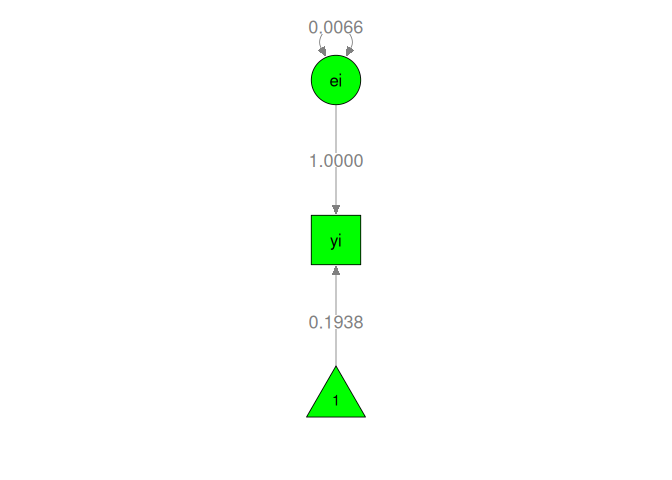
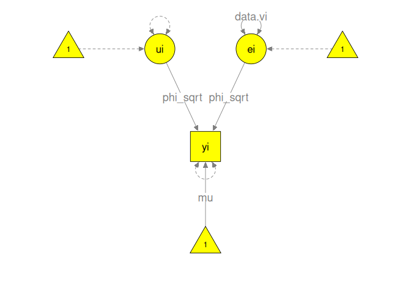
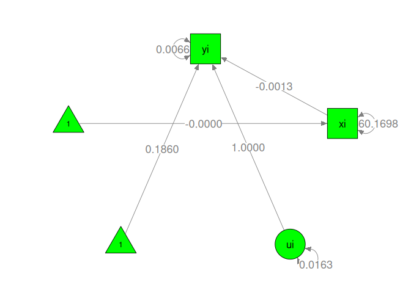
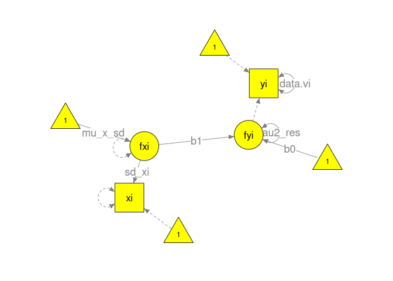
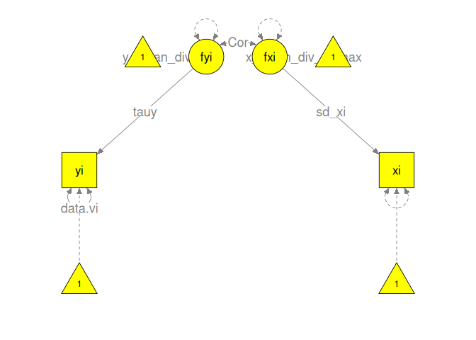

# Illustrations using Jaramillo, Mulki, and Marshall (2005)

## Data preparation

``` r
## Load the required libraries
library(metafor)
library(metaSEM)
library(symSEM)

## Prepare a sample data
## xi: a predictor
## zi: an outcome variable
dat1 <- data.frame(yi=Jaramillo05$r, 
                   vi=Jaramillo05$r_v,
                   xi=scale(Jaramillo05$IDV, scale=FALSE),
                   zi=scale(Jaramillo05$Citations, scale=TRUE))
```

## Models without any external variables

### Fixed-effect model

``` r
## Fixed-effect model with a latent variable ei
## data.vi means that vi in the data are fixed at each case in the model.
m1a <- "ei =~ 1*yi           ## e is a latent variable and yi is its indicator
        yi ~ mu*1            ## Mean(yi) = mu
        yi ~~ 0*yi           ## Set the measurement error variance of yi at 0
        ei ~~ data.vi*ei     ## Var(yi) = vi, which is assumed known in meta-analysis
"                            

## Display the conceptual model using the semPlot package.
## sizeInt=7: Set 7 as the size of the intercept, see help(semPaths) in R.
plot(m1a, color = "yellow", sizeInt = 7)
```

<!-- -->

``` r
## Fixed-effect model without specifying ei
m1b <- "yi ~ mu*1            ## Mean(yi) = mu
        yi ~~ data.vi*yi     ## Var(yi) = vi, the measurement error variance is assigned from the data
"

plot(m1b, color = "yellow", sizeInt = 7)
```

<!-- -->

``` r
## Convert the lavaan model to RAM specification
## obs.variables = "yi": "yi" is the observed variable
ram1 <- lavaan2RAM(m1a, obs.variables = "yi", std.lv = FALSE)

## Display the RAM model
ram1
```

```
## $A
##    yi  ei 
## yi "0" "1"
## ei "0" "0"
## 
## $S
##    yi  ei           
## yi "0" "0"          
## ei "0" "0.5*data.vi"
## 
## $F
##    yi ei
## yi  1  0
## 
## $M
##   yi     ei 
## 1 "0*mu" "0"
```

``` r
## Get the model-implied mean and variance structures
impliedS(ram1)
```

```
## Correlation matrix: FALSE
## 
## Amatrix:
##    yi ei
## yi  0  1
## ei  0  0
## 
## Smatrix:
##    yi  ei       
## yi "0" "0"      
## ei "0" "data.vi"
## 
## Fmatrix:
##    yi ei
## yi  1  0
## 
## Mmatrix:
##   yi   ei 
## 1 "mu" "0"
## 
## Model implied covariance matrix (Sigma):
##    yi       
## yi "data.vi"
## 
## Model implied mean vector (Mu):
##   yi  
## 1 "mu"
```

``` r
## Fit the model to the data
fit1 <- sem("Fixed", RAM = ram1, data = dat1)
summary(fit1)
```

```
## 95% confidence intervals: z statistic approximation (robust=FALSE)
## Coefficients:
##     Estimate Std.Error    lbound    ubound z value  Pr(>|z|)    
## mu 0.1937681 0.0079323 0.1782212 0.2093151  24.428 < 2.2e-16 ***
## ---
## Signif. codes:  0 '***' 0.001 '**' 0.01 '*' 0.05 '.' 0.1 ' ' 1
## 
## Information Criteria:
##       df Penalty Parameters Penalty Sample-Size Adjusted
## AIC:    9.069733           131.0697             131.1375
## BIC: -117.582699           133.1806             130.0348
## 
## Number of subjects (or studies): 61
## Number of observed statistics: 61
## Number of estimated parameters: 1
## Degrees of freedom: 60
## -2 log likelihood: 129.0697 
## OpenMx status1: 0 ("0" or "1": The optimization is considered fine.
## Other values may indicate problems.)
```

``` r
## Display the model with results using the semPlot package
## nDigits=4: Display 4 digits
plot(fit1, color = "green", sizeInt = 7, nDigits = 4)
```

<!-- -->

``` r
## Compare the results with metafor
rma(yi, vi, data = dat1, method = "FE")
```

```
## 
## Fixed-Effects Model (k = 61)
## 
## I^2 (total heterogeneity / total variability):   82.32%
## H^2 (total variability / sampling variability):  5.66
## 
## Test for Heterogeneity:
## Q(df = 60) = 339.3886, p-val < .0001
## 
## Model Results:
## 
## estimate      se     zval    pval   ci.lb   ci.ub      
##   0.1938  0.0079  24.4278  <.0001  0.1782  0.2093  *** 
## 
## ---
## Signif. codes:  0 '***' 0.001 '**' 0.01 '*' 0.05 '.' 0.1 ' ' 1
```

### Random-effects model

``` r
## ei is conceptualized as a latent variable
## data.vi means that vi in the data are fixed at each case in the model.
m2a <- "ui =~ 1*yi          ## ui is the random effect
        ui ~~ tau2*ui       ## Var(ui) = tau2
        ei =~ 1*yi          ## ei, the error term, is conceptualized as a latent variable
        ei ~~ data.vi*ei    ## Var(ei) = vi, which is assigned from data
        yi ~ mu*1           ## Mean(yi) = mu
        yi ~~ 0*yi          ## Set the measurement error variance of yi at 0
"

## Display the conceptual model
plot(m2a, color="yellow", sizeInt = 7)
```

<!-- -->

``` r
## ei is conceptualized as the measurement error of yi
## data.vi means that vi in the data are fixed at each case in the model.
m2b <- "ui =~ 1*yi          ## ui is the random effect
        ui ~~ tau2*ui       ## Var(ui) = tau2
        yi ~ mu*1           ## Mean(yi) = mu
        yi ~~ data.vi*yi    ## Var(yi) = vi, the measurement error variance is assigned from the data
"

plot(m2b, color="yellow", sizeInt = 7)
```

<!-- -->

``` r
## Convert the lavaan model to RAM specification
## std.lv = FALSE: Ensure the latent variable is not standardized
ram2 <- lavaan2RAM(m2b, obs.variables = "yi", std.lv = FALSE)

## Get the model-implied mean and variance structures
impliedS(ram2)
```

```
## Correlation matrix: FALSE
## 
## Amatrix:
##    yi ui
## yi  0  1
## ui  0  0
## 
## Smatrix:
##    yi        ui    
## yi "data.vi" "0"   
## ui "0"       "tau2"
## 
## Fmatrix:
##    yi ui
## yi  1  0
## 
## Mmatrix:
##   yi   ui 
## 1 "mu" "0"
## 
## Model implied covariance matrix (Sigma):
##    yi              
## yi "data.vi + tau2"
## 
## Model implied mean vector (Mu):
##   yi  
## 1 "mu"
```

``` r
fit2 <- sem("Random", RAM = ram2, data = dat1)
summary(fit2)
```

```
## 95% confidence intervals: z statistic approximation (robust=FALSE)
## Coefficients:
##       Estimate Std.Error    lbound    ubound z value  Pr(>|z|)    
## tau2 0.0170341 0.0041352 0.0089292 0.0251389  4.1193 3.801e-05 ***
## mu   0.1866221 0.0193303 0.1487354 0.2245088  9.6544 < 2.2e-16 ***
## ---
## Signif. codes:  0 '***' 0.001 '**' 0.01 '*' 0.05 '.' 0.1 ' ' 1
## 
## Information Criteria:
##      df Penalty Parameters Penalty Sample-Size Adjusted
## AIC:  -173.4423          -51.44225            -51.23536
## BIC:  -297.9838          -47.22051            -53.51209
## 
## Number of subjects (or studies): 61
## Number of observed statistics: 61
## Number of estimated parameters: 2
## Degrees of freedom: 59
## -2 log likelihood: -55.44225 
## OpenMx status1: 0 ("0" or "1": The optimization is considered fine.
## Other values may indicate problems.)
```

``` r
## Display the model with results
plot(fit2, color="green", sizeInt = 7, nDigits = 4)
```

<!-- -->

``` r
## Compare the results with metafor using ML estimation method
rma(yi, vi, data = dat1, method = "ML")
```

```
## 
## Random-Effects Model (k = 61; tau^2 estimator: ML)
## 
## tau^2 (estimated amount of total heterogeneity): 0.0170 (SE = 0.0041)
## tau (square root of estimated tau^2 value):      0.1305
## I^2 (total heterogeneity / total variability):   81.44%
## H^2 (total variability / sampling variability):  5.39
## 
## Test for Heterogeneity:
## Q(df = 60) = 339.3886, p-val < .0001
## 
## Model Results:
## 
## estimate      se    zval    pval   ci.lb   ci.ub      
##   0.1866  0.0193  9.6557  <.0001  0.1487  0.2245  *** 
## 
## ---
## Signif. codes:  0 '***' 0.001 '**' 0.01 '*' 0.05 '.' 0.1 ' ' 1
```

### Multiplicative-error model

``` r
## Multiplicative error, same as the UWLS model
m3 <- "ei =~ phi_sqrt*yi   ## phi (phi_sqrt^2) is the heterogeneity scaling factor
       ei ~~ data.vi*ei    ## Var(ei) = vi
       yi ~ mu*1           ## Mean(yi) = mu
       yi ~~ 0*yi          ## Set the default error variance of yi at 0
       phi := phi_sqrt^2   ## Define phi as a function of phi_sqrt
"

plot(m3, color = "yellow", sizeInt = 7)
```

<!-- -->

``` r
ram3 <- lavaan2RAM(m3, obs.variables = "yi", std.lv = FALSE)

impliedS(ram3)
```

```
## Correlation matrix: FALSE
## 
## Amatrix:
##    yi  ei        
## yi "0" "phi_sqrt"
## ei "0" "0"       
## 
## Smatrix:
##    yi  ei       
## yi "0" "0"      
## ei "0" "data.vi"
## 
## Fmatrix:
##    yi ei
## yi  1  0
## 
## Mmatrix:
##   yi   ei 
## 1 "mu" "0"
## 
## Model implied covariance matrix (Sigma):
##    yi                  
## yi "data.vi*phi_sqrt^2"
## 
## Model implied mean vector (Mu):
##   yi  
## 1 "mu"
```

``` r
fit3 <- sem("Multiplicative", RAM = ram3, data = dat1)
summary(fit3)
```

```
## 95% confidence intervals: z statistic approximation (robust=FALSE)
## Coefficients:
##          Estimate Std.Error  lbound  ubound z value  Pr(>|z|)    
## phi_sqrt  2.35876   0.21355 1.94020 2.77731  11.045 < 2.2e-16 ***
## mu        0.19377   0.01871 0.15710 0.23044  10.356 < 2.2e-16 ***
## ---
## Signif. codes:  0 '***' 0.001 '**' 0.01 '*' 0.05 '.' 0.1 ' ' 1
## 
## Mxalgebras:
##      lbound estimate   ubound
## phi 3.58914 5.563747 7.538354
## 
## Information Criteria:
##      df Penalty Parameters Penalty Sample-Size Adjusted
## AIC:  -162.6262          -40.62625            -40.41935
## BIC:  -287.1678          -36.40450            -42.69609
## 
## Number of subjects (or studies): 61
## Number of observed statistics: 61
## Number of estimated parameters: 2
## Degrees of freedom: 59
## -2 log likelihood: -44.62625 
## OpenMx status1: 0 ("0" or "1": The optimization is considered fine.
## Other values may indicate problems.)
```

``` r
plot(fit3, color="green", sizeInt=6, nDigits=4)
```

<!-- -->

``` r
## Compare the results with regression with UWLS estimation method
summary( lm(yi ~ 1, weights=1/vi, data = dat1) )
```

```
## 
## Call:
## lm(formula = yi ~ 1, data = dat1, weights = 1/vi)
## 
## Weighted Residuals:
##    Min     1Q Median     3Q    Max 
## -3.759 -1.811 -0.372  1.593  9.031 
## 
## Coefficients:
##             Estimate Std. Error t value Pr(>|t|)    
## (Intercept)  0.19377    0.01887   10.27 7.69e-15 ***
## ---
## Signif. codes:  0 '***' 0.001 '**' 0.01 '*' 0.05 '.' 0.1 ' ' 1
## 
## Residual standard error: 2.378 on 60 degrees of freedom
```

### Hybrid models of additive and multiplicative errors

``` r
## Hybrid model 1: multiplicative and additive error
m4 <- "yi ~ mu*1              ## Mean(yi) = mu 
       yi ~~ 0*yi             ## Set the measurement error variance of yi at 0
       ## additive error
       ui =~ 1*yi
       ui ~~ tau2*ui          ## Var(ui) = tau2
       ## multiplicative error
       ei =~ phi_sqrt*yi      ## phi is a scaling factor
       ei ~~ data.vi*ei       ## Var(ei) = vi
       phi := phi_sqrt^2      ## Define phi as a function of phi_sqrt
"
plot(m4, color="yellow", sizeInt=6)
```

<!-- -->

``` r
ram4 <- lavaan2RAM(m4, obs.variables = "yi", std.lv = FALSE)

impliedS(ram4)
```

```
## Correlation matrix: FALSE
## 
## Amatrix:
##    yi  ui  ei        
## yi "0" "1" "phi_sqrt"
## ui "0" "0" "0"       
## ei "0" "0" "0"       
## 
## Smatrix:
##    yi  ui     ei       
## yi "0" "0"    "0"      
## ui "0" "tau2" "0"      
## ei "0" "0"    "data.vi"
## 
## Fmatrix:
##    yi ui ei
## yi  1  0  0
## 
## Mmatrix:
##   yi   ui  ei 
## 1 "mu" "0" "0"
## 
## Model implied covariance matrix (Sigma):
##    yi                         
## yi "data.vi*phi_sqrt^2 + tau2"
## 
## Model implied mean vector (Mu):
##   yi  
## 1 "mu"
```

``` r
fit4 <- sem("Hybrid1", RAM = ram4, data = dat1)
summary(fit4)
```

```
## 95% confidence intervals: z statistic approximation (robust=FALSE)
## Coefficients:
##            Estimate  Std.Error     lbound     ubound z value  Pr(>|z|)    
## phi_sqrt 1.28704040 0.46151229 0.38249294 2.19158785  2.7887  0.005291 ** 
## tau2     0.01366383 0.00662834 0.00067251 0.02665514  2.0614  0.039263 *  
## mu       0.18737040 0.01923366 0.14967312 0.22506768  9.7418 < 2.2e-16 ***
## ---
## Signif. codes:  0 '***' 0.001 '**' 0.01 '*' 0.05 '.' 0.1 ' ' 1
## 
## Mxalgebras:
##         lbound estimate   ubound
## phi -0.6719868 1.656473 3.984933
## 
## Information Criteria:
##      df Penalty Parameters Penalty Sample-Size Adjusted
## AIC:  -171.7740          -49.77403            -49.35298
## BIC:  -294.2047          -43.44141            -52.87879
## 
## Number of subjects (or studies): 61
## Number of observed statistics: 61
## Number of estimated parameters: 3
## Degrees of freedom: 58
## -2 log likelihood: -55.77403 
## OpenMx status1: 0 ("0" or "1": The optimization is considered fine.
## Other values may indicate problems.)
```

``` r
plot(fit4, color="green", sizeInt=6, nDigits=4)
```

<!-- -->

``` r
## Hybrid model 2: multiplicative and addictive error
m5 <- "yi ~ mu*1         ## Mean(yi) = mu
       yi ~~ Vary*yi     ## Var(yi) = vary
       ## Define Vary as a function of vi, tau2, and omega
       Vary == data.vi + tau2*data.vi^omega
"

ram5 <- lavaan2RAM(m5, obs.variables = "yi", std.lv = FALSE)

## replace.constraints = TRUE: Replace the constraint "Vary" with the new parameters
impliedS(ram5, replace.constraints = TRUE)
```

```
## Correlation matrix: FALSE
## 
## Amatrix:
##    yi
## yi  0
## 
## Smatrix:
##    yi                              
## yi "data.vi + tau2 * data.vi^omega"
## 
## Fmatrix:
##    yi
## yi  1
## 
## Mmatrix:
##   yi  
## 1 "mu"
## 
## Model implied covariance matrix (Sigma):
##    yi                            
## yi "data.vi + data.vi^omega*tau2"
## 
## Model implied mean vector (Mu):
##   yi  
## 1 "mu"
```

``` r
## replace.constraints = TRUE: Replace the constraint "Vary" with the new parameters
fit5 <- sem("Hybrid2", RAM = ram5, data = dat1, replace.constraints = TRUE)
summary(fit5)
```

```
## 95% confidence intervals: z statistic approximation (robust=FALSE)
## Coefficients:
##        Estimate Std.Error    lbound    ubound z value Pr(>|z|)    
## omega  0.120418  0.294207 -0.456217  0.697054  0.4093   0.6823    
## tau2   0.033074  0.054260 -0.073273  0.139421  0.6095   0.5422    
## mu     0.186936  0.019327  0.149055  0.224816  9.6722   <2e-16 ***
## ---
## Signif. codes:  0 '***' 0.001 '**' 0.01 '*' 0.05 '.' 0.1 ' ' 1
## 
## Information Criteria:
##      df Penalty Parameters Penalty Sample-Size Adjusted
## AIC:  -171.6036          -49.60361            -49.18256
## BIC:  -294.0343          -43.27099            -52.70837
## 
## Number of subjects (or studies): 61
## Number of observed statistics: 61
## Number of estimated parameters: 3
## Degrees of freedom: 58
## -2 log likelihood: -55.60361 
## OpenMx status1: 0 ("0" or "1": The optimization is considered fine.
## Other values may indicate problems.)
```

``` r
## Hybrid model 3: Hartung-Knapp-Sidik-Jonkman method
m6 <- "yi ~ mu*1            ## Mean(yi) = mu
       yi ~~ 0*yi           ## Set the measurement error variance of yi at 0  
       ## additive error
       ui =~ phi_sqrt*yi    ## phi is a scaling factor
       ui ~~ 0.01703407*ui  ## Estimated tau2 is obtained from the random-effects model
       ## multiplicative error
       ei =~ phi_sqrt*yi    ## phi is a scaling factor
       ei ~~ data.vi*ei     ## Var(ei) = vi
       phi := phi_sqrt^2    ## Define phi as a function of phi_sqrt
"
plot(m6, color="yellow", sizeInt=6)
```

<!-- -->

``` r
ram6 <- lavaan2RAM(m6, obs.variables = "yi", std.lv = FALSE)

impliedS(ram6)
```

```
## Correlation matrix: FALSE
## 
## Amatrix:
##    yi  ui         ei        
## yi "0" "phi_sqrt" "phi_sqrt"
## ui "0" "0"        "0"       
## ei "0" "0"        "0"       
## 
## Smatrix:
##    yi  ui           ei       
## yi "0" "0"          "0"      
## ui "0" "0.01703407" "0"      
## ei "0" "0"          "data.vi"
## 
## Fmatrix:
##    yi ui ei
## yi  1  0  0
## 
## Mmatrix:
##   yi   ui  ei 
## 1 "mu" "0" "0"
## 
## Model implied covariance matrix (Sigma):
##    yi                                 
## yi "phi_sqrt^2*(data.vi + 0.01703407)"
## 
## Model implied mean vector (Mu):
##   yi  
## 1 "mu"
```

``` r
fit6 <- sem("Hybrid3", RAM = ram6, data = dat1)
summary(fit6)
```

```
## 95% confidence intervals: z statistic approximation (robust=FALSE)
## Coefficients:
##          Estimate Std.Error   lbound   ubound z value  Pr(>|z|)    
## phi_sqrt 1.008628  0.091317 0.829650 1.187606 11.0454 < 2.2e-16 ***
## mu       0.186622  0.019494 0.148414 0.224830  9.5731 < 2.2e-16 ***
## ---
## Signif. codes:  0 '***' 0.001 '**' 0.01 '*' 0.05 '.' 0.1 ' ' 1
## 
## Mxalgebras:
##        lbound estimate   ubound
## phi 0.6562735  1.01733 1.378387
## 
## Information Criteria:
##      df Penalty Parameters Penalty Sample-Size Adjusted
## AIC:  -173.4513          -51.45131            -51.24441
## BIC:  -297.9929          -47.22956            -53.52115
## 
## Number of subjects (or studies): 61
## Number of observed statistics: 61
## Number of estimated parameters: 2
## Degrees of freedom: 59
## -2 log likelihood: -55.45131 
## OpenMx status1: 0 ("0" or "1": The optimization is considered fine.
## Other values may indicate problems.)
```

``` r
plot(fit6, color="green", sizeInt=6, nDigits=4)
```

<!-- -->

``` r
## Compare the results with metafor using the Hartung-Knapp-Sidik-Jonkman method
rma(yi, vi, data = dat1, method = "SJ")
```

```
## 
## Random-Effects Model (k = 61; tau^2 estimator: SJ)
## 
## tau^2 (estimated amount of total heterogeneity): 0.0192 (SE = 0.0037)
## tau (square root of estimated tau^2 value):      0.1385
## I^2 (total heterogeneity / total variability):   83.18%
## H^2 (total variability / sampling variability):  5.94
## 
## Test for Heterogeneity:
## Q(df = 60) = 339.3886, p-val < .0001
## 
## Model Results:
## 
## estimate      se    zval    pval   ci.lb   ci.ub      
##   0.1865  0.0202  9.2091  <.0001  0.1468  0.2261  *** 
## 
## ---
## Signif. codes:  0 '***' 0.001 '**' 0.01 '*' 0.05 '.' 0.1 ' ' 1
```

### Comparison of the six models

``` r
## A helper function to extract the results
extractResults <- function(x) {
  out <- summary(x)
  para <- out$coefficients[c("mu", "tau2", "phi_sqrt", "omega"), 
                           c("Estimate", "Std.Error")]
  out <- c(unlist(para), out$estPara, out$Minus2LL, 
           out$informationCriteria["AIC:", "Parameters Penalty"],
           out$informationCriteria["BIC:", "Parameters Penalty"])
  names(out) <- c("mu", "tau2", "phi_sqrt", "omega",
                  "mu_SE", "tau2_SE", "phi_sqrt_SE", "omega_SE",
                  "No_parameters",  "-2LL", "AIC", "BIC")
  out
}

table1 <- sapply(list(fit1, fit2, fit3, fit4, fit5, fit6), extractResults)
table1 <- data.frame(Name=rownames(table1), table1)
rownames(table1) <- NULL
colnames(table1) <- c("Name", "Fixed", "Random", "Multiplicative", "Hybrid1", 
                      "Hybrid2", "Hybrid3")
## Add the estimated tau2 and tau2_SE from the random-effects model to
## the table in an ad-hoc manner
table1[table1$Name=="tau2", "Hybrid3"] <- table1[table1$Name=="tau2", "Random"]
table1[table1$Name=="tau2_SE", "Hybrid3"] <- table1[table1$Name=="tau2_SE", "Random"]
knitr::kable(table1, digits=4, caption="Results of the Six Meta-Analytic Models")
```


Table: Results of the Six Meta-Analytic Models

|Name          |    Fixed|   Random| Multiplicative|  Hybrid1|  Hybrid2|  Hybrid3|
|:-------------|--------:|--------:|--------------:|--------:|--------:|--------:|
|mu            |   0.1938|   0.1866|         0.1938|   0.1874|   0.1869|   0.1866|
|tau2          |       NA|   0.0170|             NA|   0.0137|   0.0331|   0.0170|
|phi_sqrt      |       NA|       NA|         2.3588|   1.2870|       NA|   1.0086|
|omega         |       NA|       NA|             NA|       NA|   0.1204|       NA|
|mu_SE         |   0.0079|   0.0193|         0.0187|   0.0192|   0.0193|   0.0195|
|tau2_SE       |       NA|   0.0041|             NA|   0.0066|   0.0543|   0.0041|
|phi_sqrt_SE   |       NA|       NA|         0.2136|   0.4615|       NA|   0.0913|
|omega_SE      |       NA|       NA|             NA|       NA|   0.2942|       NA|
|No_parameters |   1.0000|   2.0000|         2.0000|   3.0000|   3.0000|   2.0000|
|-2LL          | 129.0697| -55.4423|       -44.6262| -55.7740| -55.6036| -55.4513|
|AIC           | 131.0697| -51.4423|       -40.6262| -49.7740| -49.6036| -51.4513|
|BIC           | 133.1806| -47.2205|       -36.4045| -43.4414| -43.2710| -47.2296|

## Models with external variables
### A fixed-x meta-regression

``` r
## Mixed-effects model with the covariate as a design matrix
m7 <- "yi ~ b0*1         ## Intercept of yi: b0
       yi ~~ data.vi*yi  ## Known sampling variance vi
       ui =~ 1*yi        ## ui: random effects
       ui ~~ tau2*ui     ## Residual heterogeneity variance tau2
       ## etai: a phantom latent variable to represent the covariate x
       etai =~ b1*yi     ## yi = b1*etai
       etai ~ data.xi*1  ## etai = xi
       etai ~~ 0*etai    ## Var(etai) = 0
"

plot(m7, color = "yellow", layout = "spring")
```

<!-- -->

``` r
## Only yi is an observed variable
ram7 <- lavaan2RAM(m7, obs.variables = "yi", std.lv = FALSE)

impliedS(ram7)
```

```
## Correlation matrix: FALSE
## 
## Amatrix:
##      yi  ui  etai
## yi   "0" "1" "b1"
## ui   "0" "0" "0" 
## etai "0" "0" "0" 
## 
## Smatrix:
##      yi        ui     etai
## yi   "data.vi" "0"    "0" 
## ui   "0"       "tau2" "0" 
## etai "0"       "0"    "0" 
## 
## Fmatrix:
##    yi ui etai
## yi  1  0    0
## 
## Mmatrix:
##   yi   ui  etai     
## 1 "b0" "0" "data.xi"
## 
## Model implied covariance matrix (Sigma):
##    yi              
## yi "data.vi + tau2"
## 
## Model implied mean vector (Mu):
##   yi               
## 1 "b0 + b1*data.xi"
```

``` r
fit7 <- sem("Fixed_x", RAM=ram7, data=dat1)
summary(fit7)
```

```
## 95% confidence intervals: z statistic approximation (robust=FALSE)
## Coefficients:
##         Estimate   Std.Error      lbound      ubound z value  Pr(>|z|)    
## b1   -0.00132138  0.00097695 -0.00323617  0.00059341 -1.3526    0.1762    
## tau2  0.01634054  0.00402026  0.00846097  0.02422010  4.0645 4.813e-05 ***
## b0    0.18596328  0.01903036  0.14866446  0.22326210  9.7719 < 2.2e-16 ***
## ---
## Signif. codes:  0 '***' 0.001 '**' 0.01 '*' 0.05 '.' 0.1 ' ' 1
## 
## Information Criteria:
##      df Penalty Parameters Penalty Sample-Size Adjusted
## AIC:  -173.2423          -51.24231            -50.82126
## BIC:  -295.6730          -44.90969            -54.34707
## 
## Number of subjects (or studies): 61
## Number of observed statistics: 61
## Number of estimated parameters: 3
## Degrees of freedom: 58
## -2 log likelihood: -57.24231 
## OpenMx status1: 0 ("0" or "1": The optimization is considered fine.
## Other values may indicate problems.)
```

``` r
plot(fit7, color = "green", sizeInt=6,  nDigits = 4)
```

<!-- -->

``` r
## Compare the results with metafor using the ML method
rma(yi, vi, mod= ~xi, data = dat1, method = "ML")
```

```
## 
## Mixed-Effects Model (k = 61; tau^2 estimator: ML)
## 
## tau^2 (estimated amount of residual heterogeneity):     0.0163 (SE = 0.0039)
## tau (square root of estimated tau^2 value):             0.1278
## I^2 (residual heterogeneity / unaccounted variability): 80.60%
## H^2 (unaccounted variability / sampling variability):   5.15
## R^2 (amount of heterogeneity accounted for):            4.07%
## 
## Test for Residual Heterogeneity:
## QE(df = 59) = 304.6147, p-val < .0001
## 
## Test of Moderators (coefficient 2):
## QM(df = 1) = 1.8294, p-val = 0.1762
## 
## Model Results:
## 
##          estimate      se     zval    pval    ci.lb   ci.ub      
## intrcpt    0.1860  0.0190   9.7725  <.0001   0.1487  0.2233  *** 
## xi        -0.0013  0.0010  -1.3526  0.1762  -0.0032  0.0006      
## 
## ---
## Signif. codes:  0 '***' 0.001 '**' 0.01 '*' 0.05 '.' 0.1 ' ' 1
```

### A random-x meta-regression

``` r
## Mixed-effects model with the covariate as a variable
m8 <- "yi ~ b0*1 + b1*xi ## Intercept (b0) and slope (b1)
       yi ~~ data.vi*yi  ## Known sampling variance vi
       ui =~ 1*yi        ## ui: random effects
       ui ~~ tau2*ui     ## Residual heterogeneity variance tau2
       xi ~ Meanx*1      ## Mean(xi) = Meanx
       xi ~~ Varx*xi     ## Var(xi) = Varx
       ## Define R2: explained variance/total variance
       R2 := b1^2*Varx/(b1^2*Varx + tau2)
"

plot(m8, color = "yellow", layout = "spring", sizeInt=6)
```

<!-- -->

``` r
## Both yi and xi are observed variables
ram8 <- lavaan2RAM(m8, obs.variables = c("yi", "xi"), std.lv = FALSE)

impliedS(ram8)
```

```
## Correlation matrix: FALSE
## 
## Amatrix:
##    yi  xi   ui 
## yi "0" "b1" "1"
## xi "0" "0"  "0"
## ui "0" "0"  "0"
## 
## Smatrix:
##    yi        xi     ui    
## yi "data.vi" "0"    "0"   
## xi "0"       "Varx" "0"   
## ui "0"       "0"    "tau2"
## 
## Fmatrix:
##    yi xi ui
## yi  1  0  0
## xi  0  1  0
## 
## Mmatrix:
##   yi   xi      ui 
## 1 "b0" "Meanx" "0"
## 
## Model implied covariance matrix (Sigma):
##    yi                           xi       
## yi "Varx*b1^2 + data.vi + tau2" "Varx*b1"
## xi "Varx*b1"                    "Varx"   
## 
## Model implied mean vector (Mu):
##   yi              xi     
## 1 "Meanx*b1 + b0" "Meanx"
```

``` r
## Request LBCIs on the R2
fit8 <- sem("Random_x", RAM=ram8, data=dat1, intervals.type = "LB")
summary(fit8)
```

```
## 95% confidence intervals: Likelihood-based statistic
## Coefficients:
##          Estimate Std.Error      lbound      ubound z value Pr(>|z|)
## b0     1.8596e-01        NA  1.4793e-01  2.2388e-01      NA       NA
## b1    -1.3214e-03        NA -3.2753e-03  6.2752e-04      NA       NA
## Meanx -1.4973e-07        NA -4.7632e+00  4.7632e+00      NA       NA
## tau2   1.6341e-02        NA  1.0080e-02  2.6682e-02      NA       NA
## Varx   3.6017e+02        NA  2.5761e+02  5.2612e+02      NA       NA
## 
## Mxalgebras:
##         lbound   estimate    ubound
## R2 1.75629e-29 0.03705905 0.1926174
## 
## Information Criteria:
##      df Penalty Parameters Penalty Sample-Size Adjusted
## AIC: 240.949308           484.9493             486.0402
## BIC:  -6.022934           495.5037             479.7747
## 
## Number of subjects (or studies): 61
## Number of observed statistics: 122
## Number of estimated parameters: 5
## Degrees of freedom: 117
## -2 log likelihood: 474.9493 
## OpenMx status1: 0 ("0" or "1": The optimization is considered fine.
## Other values may indicate problems.)
```

``` r
plot(fit8, color="green", sizeInt=6, nDigits = 4, layout = "spring")
```

<!-- -->

### Regressing a covariate on the true effect size

``` r
## Regressing a covariate on the true effect size
m9 <- "fyi =~ 1*yi         ## fyi: true effect size
       fyi ~~ tau2*fyi     ## Var(fyi) = tau2
       fyi ~ Meany*1       ## Mean(fyi) = Meany
       yi ~ 0*1         
       yi ~~ data.vi*yi    ## Var(ei) = vi
       zi ~ b0*1 + b1*fyi  ## Intercept (b0) and slope (b1)
       zi ~~ ErrVarz*zi    ## Error variance of zi
       ## Define an R2
       R2 := b1^2*tau2/(b1^2*tau2 + ErrVarz)
"

plot(m9, color = "yellow", sizeInt=6, layout = "spring")
```

<!-- -->

``` r
## Both yi and xi are observed variables
ram9 <- lavaan2RAM(m9, obs.variables = c("yi", "zi"), std.lv = FALSE)

impliedS(ram9)
```

```
## Correlation matrix: FALSE
## 
## Amatrix:
##     yi  zi  fyi 
## yi  "0" "0" "1" 
## zi  "0" "0" "b1"
## fyi "0" "0" "0" 
## 
## Smatrix:
##     yi        zi        fyi   
## yi  "data.vi" "0"       "0"   
## zi  "0"       "ErrVarz" "0"   
## fyi "0"       "0"       "tau2"
## 
## Fmatrix:
##    yi zi fyi
## yi  1  0   0
## zi  0  1   0
## 
## Mmatrix:
##   yi  zi   fyi    
## 1 "0" "b0" "Meany"
## 
## Model implied covariance matrix (Sigma):
##    yi               zi                   
## yi "data.vi + tau2" "b1*tau2"            
## zi "b1*tau2"        "ErrVarz + b1^2*tau2"
## 
## Model implied mean vector (Mu):
##   yi      zi             
## 1 "Meany" "Meany*b1 + b0"
```

``` r
fit9 <- sem("Regress_covariate", RAM=ram9, data=dat1)
summary(fit9)
```

```
## 95% confidence intervals: z statistic approximation (robust=FALSE)
## Coefficients:
##           Estimate  Std.Error     lbound     ubound z value  Pr(>|z|)    
## b1      -1.9754710  1.0732769 -4.0790550  0.1281131 -1.8406   0.06568 .  
## ErrVarz  0.9174958  0.1691732  0.5859225  1.2490691  5.4234 5.847e-08 ***
## tau2     0.0169407  0.0041062  0.0088927  0.0249887  4.1256 3.697e-05 ***
## b0       0.3701115  0.2370840 -0.0945646  0.8347876  1.5611   0.11850    
## Meany    0.1873536  0.0192787  0.1495680  0.2251391  9.7182 < 2.2e-16 ***
## ---
## Signif. codes:  0 '***' 0.001 '**' 0.01 '*' 0.05 '.' 0.1 ' ' 1
## 
## Mxalgebras:
##         lbound   estimate    ubound
## R2 -0.06982718 0.06721261 0.2042524
## 
## Information Criteria:
##      df Penalty Parameters Penalty Sample-Size Adjusted
## AIC:  -120.6995           123.3005             124.3914
## BIC:  -367.6717           133.8549             118.1259
## 
## Number of subjects (or studies): 61
## Number of observed statistics: 122
## Number of estimated parameters: 5
## Degrees of freedom: 117
## -2 log likelihood: 113.3005 
## OpenMx status1: 0 ("0" or "1": The optimization is considered fine.
## Other values may indicate problems.)
```

``` r
plot(fit9, color = "green", sizeInt=6, nDigits = 4)
```

<!-- -->

``` r
## Compare the incorrect results with regression ignoring the known sampling variance vi on yi
summary( lm(zi ~ yi, data = dat1) )
```

```
## 
## Call:
## lm(formula = zi ~ yi, data = dat1)
## 
## Residuals:
##     Min      1Q  Median      3Q     Max 
## -0.9961 -0.5344 -0.3379  0.2321  5.5090 
## 
## Coefficients:
##             Estimate Std. Error t value Pr(>|t|)  
## (Intercept)   0.2585     0.1939   1.333   0.1876  
## yi           -1.4114     0.8051  -1.753   0.0848 .
## ---
## Signif. codes:  0 '***' 0.001 '**' 0.01 '*' 0.05 '.' 0.1 ' ' 1
## 
## Residual standard error: 0.9832 on 59 degrees of freedom
## Multiple R-squared:  0.04951,	Adjusted R-squared:  0.0334 
## F-statistic: 3.073 on 1 and 59 DF,  p-value: 0.08479
```

### Meta-regression with partially standardized variables

``` r
## Partial standardized xi but not yi
m10 <- "fyi =~ 1*yi          ## fyi: Latent effect size of yi
        fyi ~~ tau2_res*fyi  ## tau2_res: residual heterogeneity variance
        fyi ~ b0*1 + b1*fxi  ## b0: intercept, b1: slope
        yi ~ 0*1
        yi ~~ data.vi*yi     ## Var(ei) = vi
        ## fxi: Standardized score of xi
        fxi =~ sd_xi*xi      ## sd_xi: sd of xi
        fxi ~~ 1*fxi         ## Var(fxi) =1 for standardization
        fxi ~ mu_x_sd*1
        xi ~ 0*1
        xi ~~ 0*xi
        ## Define R2
        R2 := b1^2/(b1^2 + tau2_res)
"

plot(m10, color="yellow", layout="spring", sizeInt=6)
```

<!-- -->

``` r
## Both yi and xi are observed variables
ram10 <- lavaan2RAM(m10, obs.variables = c("yi", "xi"), std.lv = FALSE)
ram10
```

```
## $A
##     yi  xi  fyi fxi        
## yi  "0" "0" "1" "0"        
## xi  "0" "0" "0" "0.1*sd_xi"
## fyi "0" "0" "0" "0.1*b1"   
## fxi "0" "0" "0" "0"        
## 
## $S
##     yi            xi  fyi            fxi
## yi  "0.5*data.vi" "0" "0"            "0"
## xi  "0"           "0" "0"            "0"
## fyi "0"           "0" "0.5*tau2_res" "0"
## fxi "0"           "0" "0"            "1"
## 
## $F
##    yi xi fyi fxi
## yi  1  0   0   0
## xi  0  1   0   0
## 
## $M
##   yi  xi  fyi    fxi        
## 1 "0" "0" "0*b0" "0*mu_x_sd"
## 
## $mxalgebras
## $mxalgebras$R2
## mxAlgebra 'R2' 
## $formula:  b1^2/(b1^2 + tau2_res) 
## $result: (not yet computed) <0 x 0 matrix>
## dimnames: NULL
```

``` r
impliedS(ram10)
```

```
## Correlation matrix: FALSE
## 
## Amatrix:
##     yi  xi  fyi fxi    
## yi  "0" "0" "1" "0"    
## xi  "0" "0" "0" "sd_xi"
## fyi "0" "0" "0" "b1"   
## fxi "0" "0" "0" "0"    
## 
## Smatrix:
##     yi        xi  fyi        fxi
## yi  "data.vi" "0" "0"        "0"
## xi  "0"       "0" "0"        "0"
## fyi "0"       "0" "tau2_res" "0"
## fxi "0"       "0" "0"        "1"
## 
## Fmatrix:
##    yi xi fyi fxi
## yi  1  0   0   0
## xi  0  1   0   0
## 
## Mmatrix:
##   yi  xi  fyi  fxi      
## 1 "0" "0" "b0" "mu_x_sd"
## 
## Model implied covariance matrix (Sigma):
##    yi                          xi        
## yi "b1^2 + data.vi + tau2_res" "b1*sd_xi"
## xi "b1*sd_xi"                  "sd_xi^2" 
## 
## Model implied mean vector (Mu):
##   yi                xi             
## 1 "b0 + b1*mu_x_sd" "mu_x_sd*sd_xi"
```

``` r
fit10 <- sem("Partial_standardize", RAM=ram10, data=dat1)
summary(fit10)
```

```
## 95% confidence intervals: z statistic approximation (robust=FALSE)
## Coefficients:
##             Estimate   Std.Error      lbound      ubound z value  Pr(>|z|)    
## sd_xi     1.8978e+01  1.7182e+00  1.5611e+01  2.2346e+01 11.0454 < 2.2e-16 ***
## b1       -2.5077e-02  1.8679e-02 -6.1688e-02  1.1533e-02 -1.3425    0.1794    
## tau2_res  1.6341e-02  4.0203e-03  8.4610e-03  2.4220e-02  4.0645 4.813e-05 ***
## b0        1.8596e-01  1.9030e-02  1.4866e-01  2.2326e-01  9.7719 < 2.2e-16 ***
## mu_x_sd   1.0930e-09  1.2804e-01 -2.5095e-01  2.5095e-01  0.0000    1.0000    
## ---
## Signif. codes:  0 '***' 0.001 '**' 0.01 '*' 0.05 '.' 0.1 ' ' 1
## 
## Mxalgebras:
##         lbound   estimate    ubound
## R2 -0.06843004 0.03705905 0.1425481
## 
## Information Criteria:
##      df Penalty Parameters Penalty Sample-Size Adjusted
## AIC: 240.949308           484.9493             486.0402
## BIC:  -6.022934           495.5037             479.7747
## 
## Number of subjects (or studies): 61
## Number of observed statistics: 122
## Number of estimated parameters: 5
## Degrees of freedom: 117
## -2 log likelihood: 474.9493 
## OpenMx status1: 0 ("0" or "1": The optimization is considered fine.
## Other values may indicate problems.)
```

``` r
plot(fit10, color="green", sizeInt=6, nDigits=4)
```

<!-- -->

``` r
## Compare the incorrect results with metafor using the ML method
rma(yi, vi, mod= ~ scale(xi), data = dat1, method = "ML")
```

```
## 
## Mixed-Effects Model (k = 61; tau^2 estimator: ML)
## 
## tau^2 (estimated amount of residual heterogeneity):     0.0163 (SE = 0.0039)
## tau (square root of estimated tau^2 value):             0.1278
## I^2 (residual heterogeneity / unaccounted variability): 80.60%
## H^2 (unaccounted variability / sampling variability):   5.15
## R^2 (amount of heterogeneity accounted for):            4.07%
## 
## Test for Residual Heterogeneity:
## QE(df = 59) = 304.6147, p-val < .0001
## 
## Test of Moderators (coefficient 2):
## QM(df = 1) = 1.8294, p-val = 0.1762
## 
## Model Results:
## 
##            estimate      se     zval    pval    ci.lb   ci.ub      
## intrcpt      0.1860  0.0190   9.7725  <.0001   0.1487  0.2233  *** 
## scale(xi)   -0.0253  0.0187  -1.3526  0.1762  -0.0619  0.0114      
## 
## ---
## Signif. codes:  0 '***' 0.001 '**' 0.01 '*' 0.05 '.' 0.1 ' ' 1
```

### Correlating a covariate with a true effect size

``` r
## Correlation between fyi and fxi
m11 <- "## fyi: Standardized true effect size of yi
        fyi =~ tauy*yi     ## tauy: sd of fyi
        fyi ~~ 1*fyi       ## Var(fyi) = 1
        fyi ~ y_mean_div_tauy*1   ## rescaled mean
        yi ~ 0*1
        yi ~~ data.vi*yi
        ## fxi: Standardized score of xi
        fxi =~ sd_xi*xi   ## sd_xi: sd of xi
        fxi ~~ 1*fxi      ## Var(fxi) = 1 for standardization
        fxi ~~ Cor*fyi    ## Correlation between fyi and fxi
        fxi ~ x_mean_div_sigmax*1 ## rescaled mean
        xi ~ 0*1
        xi ~~ 0*xi       
"

plot(m11, color = "yellow", sizeInt=6)
```

<!-- -->

``` r
## Both yi and xi are observed variables
ram11 <- lavaan2RAM(m11, obs.variables = c("yi", "xi"), std.lv = TRUE)

impliedS(ram11)
```

```
## Correlation matrix: FALSE
## 
## Amatrix:
##     yi  xi  fyi    fxi    
## yi  "0" "0" "tauy" "0"    
## xi  "0" "0" "0"    "sd_xi"
## fyi "0" "0" "0"    "0"    
## fxi "0" "0" "0"    "0"    
## 
## Smatrix:
##     yi        xi  fyi   fxi  
## yi  "data.vi" "0" "0"   "0"  
## xi  "0"       "0" "0"   "0"  
## fyi "0"       "0" "1"   "Cor"
## fxi "0"       "0" "Cor" "1"  
## 
## Fmatrix:
##    yi xi fyi fxi
## yi  1  0   0   0
## xi  0  1   0   0
## 
## Mmatrix:
##   yi  xi  fyi               fxi                
## 1 "0" "0" "y_mean_div_tauy" "x_mean_div_sigmax"
## 
## Model implied covariance matrix (Sigma):
##    yi                 xi              
## yi "data.vi + tauy^2" "Cor*sd_xi*tauy"
## xi "Cor*sd_xi*tauy"   "sd_xi^2"       
## 
## Model implied mean vector (Mu):
##   yi                     xi                       
## 1 "tauy*y_mean_div_tauy" "sd_xi*x_mean_div_sigmax"
```

``` r
fit11 <- sem("Correlation", RAM=ram11, data=dat1)
summary(fit11)
```

```
## 95% confidence intervals: z statistic approximation (robust=FALSE)
## Coefficients:
##                      Estimate   Std.Error      lbound      ubound z value
## tauy               1.3027e-01  1.5856e-02  9.9190e-02  1.6134e-01  8.2156
## sd_xi              1.8978e+01  1.7182e+00  1.5611e+01  2.2346e+01 11.0454
## Cor               -1.9251e-01  1.3987e-01 -4.6665e-01  8.1640e-02 -1.3763
## y_mean_div_tauy    1.4276e+00  2.3022e-01  9.7633e-01  1.8788e+00  6.2008
## x_mean_div_sigmax -8.0385e-10  1.2804e-01 -2.5095e-01  2.5095e-01  0.0000
##                    Pr(>|z|)    
## tauy              2.220e-16 ***
## sd_xi             < 2.2e-16 ***
## Cor                  0.1687    
## y_mean_div_tauy   5.619e-10 ***
## x_mean_div_sigmax    1.0000    
## ---
## Signif. codes:  0 '***' 0.001 '**' 0.01 '*' 0.05 '.' 0.1 ' ' 1
## 
## Information Criteria:
##      df Penalty Parameters Penalty Sample-Size Adjusted
## AIC: 240.949308           484.9493             486.0402
## BIC:  -6.022934           495.5037             479.7747
## 
## Number of subjects (or studies): 61
## Number of observed statistics: 122
## Number of estimated parameters: 5
## Degrees of freedom: 117
## -2 log likelihood: 474.9493 
## OpenMx status1: 0 ("0" or "1": The optimization is considered fine.
## Other values may indicate problems.)
```

``` r
plot(fit11, color = "green", sizeInt=6, nDigits = 4)
```

<!-- -->

``` r
## Compare the incorrect results with correlation analysis ignoring the known sampling variance vi on yi
cor.test(~ yi + zi, data = dat1)
```

```
## 
## 	Pearson's product-moment correlation
## 
## data:  yi and zi
## t = -1.753, df = 59, p-value = 0.08479
## alternative hypothesis: true correlation is not equal to 0
## 95 percent confidence interval:
##  -0.44915865  0.03105597
## sample estimates:
##        cor 
## -0.2225049
```

### Location-scale and nonlinear models with an additive heterogeneity variance

``` r
## Location-scale model with an additive heterogeneity variance
m12 <- "yi ~ mu*1          ## Mean(yi) = mu
        yi ~~ data.vi*yi   ## Var(ei) = vi 
        ## ui is the latent variable of the random effect
        ui =~ 1*yi         ## yi = 1*ui
        ui ~~ tau2*ui      ## Var(ui) = tau2 of the residual heterogenenity variance
        ## Specify a linear relationship on the mean structure
        mu == b0 + b1*data.xi
        ## Specify a nonlinear relationship on the variance structure
        tau2 == exp(a0 + a1*data.xi)
"

ram12 <- lavaan2RAM(m12, obs.variables="yi", std.lv = FALSE)

## Get the model implied structures
## We need to replace the constraints with the new parameters
impliedS(ram12, replace.constraints=TRUE)
```

```
## Correlation matrix: FALSE
## 
## Amatrix:
##    yi ui
## yi  0  1
## ui  0  0
## 
## Smatrix:
##    yi        ui                      
## yi "data.vi" "0"                     
## ui "0"       "exp(a0 + a1 * data.xi)"
## 
## Fmatrix:
##    yi ui
## yi  1  0
## 
## Mmatrix:
##   yi                  ui 
## 1 "b0 + b1 * data.xi" "0"
## 
## Model implied covariance matrix (Sigma):
##    yi                              
## yi "data.vi + exp(a0 + a1*data.xi)"
## 
## Model implied mean vector (Mu):
##   yi               
## 1 "b0 + b1*data.xi"
```

``` r
fit12 <- sem("Location_scale_additive", RAM=ram12, data=dat1, replace.constraints=TRUE)
summary(fit12)
```

```
## 95% confidence intervals: z statistic approximation (robust=FALSE)
## Coefficients:
##       Estimate   Std.Error      lbound      ubound  z value Pr(>|z|)    
## a0 -4.11206737  0.24483731 -4.59193967 -3.63219506 -16.7951   <2e-16 ***
## a1  0.00541492  0.01314676 -0.02035226  0.03118209   0.4119   0.6804    
## b0  0.18596386  0.01908419  0.14855954  0.22336818   9.7444   <2e-16 ***
## b1 -0.00129620  0.00090683 -0.00307355  0.00048115  -1.4294   0.1529    
## ---
## Signif. codes:  0 '***' 0.001 '**' 0.01 '*' 0.05 '.' 0.1 ' ' 1
## 
## Information Criteria:
##      df Penalty Parameters Penalty Sample-Size Adjusted
## AIC:  -171.4105          -49.41046            -48.69617
## BIC:  -291.7303          -40.96696            -53.55013
## 
## Number of subjects (or studies): 61
## Number of observed statistics: 61
## Number of estimated parameters: 4
## Degrees of freedom: 57
## -2 log likelihood: -57.41046 
## OpenMx status1: 0 ("0" or "1": The optimization is considered fine.
## Other values may indicate problems.)
```

``` r
## Compare the incorrect results with metafor using the ML method
rma(yi, vi, mod= ~xi, scale= ~xi, data = dat1, method = "ML")
```

```
## 
## Location-Scale Model (k = 61; tau^2 estimator: ML)
## 
## Test for Residual Heterogeneity:
## QE(df = 59) = 304.6147, p-val < .0001
## 
## Test of Location Coefficients (coefficient 2):
## QM(df = 1) = 2.0540, p-val = 0.1518
## 
## Model Results (Location):
## 
##          estimate      se     zval    pval    ci.lb   ci.ub      
## intrcpt    0.1860  0.0191   9.7453  <.0001   0.1486  0.2234  *** 
## xi        -0.0013  0.0009  -1.4332  0.1518  -0.0031  0.0005      
## 
## Test of Scale Coefficients (coefficient 2):
## QM(df = 1) = 0.1696, p-val = 0.6804
## 
## Model Results (Scale):
## 
##          estimate      se      zval    pval    ci.lb    ci.ub      
## intrcpt   -4.1121  0.2448  -16.7951  <.0001  -4.5919  -3.6322  *** 
## xi         0.0054  0.0131    0.4119  0.6804  -0.0204   0.0312      
## 
## ---
## Signif. codes:  0 '***' 0.001 '**' 0.01 '*' 0.05 '.' 0.1 ' ' 1
```

### Location-scale and nonlinear models with a multiplicative heterogeneity variance

``` r
## Location-scale model with a multiplicative heterogeneity variance
m13 <- "yi ~ mu*1          ## Mean(yi) = mu
        yi ~~ sigma2*yi    ## Var(yi) = sigma2 
        ## Specify nonlinear on mean and variance structures
        mu == b0 + b1*data.xi
        sigma2 == exp(a0 + a1*data.xi)*data.vi
"

ram13 <- lavaan2RAM(m13, obs.variables="yi", std.lv = FALSE)

impliedS(ram13, replace.constraints = TRUE)
```

```
## Correlation matrix: FALSE
## 
## Amatrix:
##    yi
## yi  0
## 
## Smatrix:
##    yi                                
## yi "exp(a0 + a1 * data.xi) * data.vi"
## 
## Fmatrix:
##    yi
## yi  1
## 
## Mmatrix:
##   yi                 
## 1 "b0 + b1 * data.xi"
## 
## Model implied covariance matrix (Sigma):
##    yi                            
## yi "data.vi*exp(a0 + a1*data.xi)"
## 
## Model implied mean vector (Mu):
##   yi               
## 1 "b0 + b1*data.xi"
```

``` r
fit13 <- sem("Location_scale_multiplicative", RAM=ram13, data=dat1, replace.constraints=TRUE)

summary(fit13)
```

```
## 95% confidence intervals: z statistic approximation (robust=FALSE)
## Coefficients:
##       Estimate   Std.Error      lbound      ubound z value Pr(>|z|)    
## a0  1.58794178  0.18107149  1.23304819  1.94283538  8.7697  < 2e-16 ***
## a1 -0.01096064  0.01035791 -0.03126177  0.00934049 -1.0582  0.28997    
## b0  0.18875409  0.01764541  0.15416972  0.22333846 10.6971  < 2e-16 ***
## b1 -0.00260230  0.00108036 -0.00471976 -0.00048483 -2.4087  0.01601 *  
## ---
## Signif. codes:  0 '***' 0.001 '**' 0.01 '*' 0.05 '.' 0.1 ' ' 1
## 
## Information Criteria:
##      df Penalty Parameters Penalty Sample-Size Adjusted
## AIC:  -166.4544          -44.45438            -43.74009
## BIC:  -286.7742          -36.01088            -48.59405
## 
## Number of subjects (or studies): 61
## Number of observed statistics: 61
## Number of estimated parameters: 4
## Degrees of freedom: 57
## -2 log likelihood: -52.45438 
## OpenMx status1: 0 ("0" or "1": The optimization is considered fine.
## Other values may indicate problems.)
```

# Illustrations using Chan et al. (2017)

## Data preparation

``` r
## Replace missing values with 0, as NA is not allowed in definition variables
## The imputed "0" will be dropped because the corresponding effect sizes are missing.
Chan17$v_misinfo[is.na(Chan17$v_misinfo)] <-0 
Chan17$c_mis_deb[is.na(Chan17$c_mis_deb)] <-0
Chan17$v_debunk[is.na(Chan17$v_debunk)] <-0

dat2 <- data.frame(y1i=Chan17$g_misinfo,
                   y2i=Chan17$g_debunk,
                   V11i=Chan17$v_misinfo,
                   V21i=Chan17$c_mis_deb,
                   V22i=Chan17$v_debunk)
```

## Regressing one effect size on another effect size

``` r
## Regressing true effect sizes f2i on f1i
m14 <- "## Means of y1 and y2 are fixed at 0
        y1i + y2i ~ 0*1
        ## Known sampling variances and covariance
        y1i ~~ data.V11i*y1i
        y2i ~~ data.V22i*y2i
        y1i ~~ data.V21i*y2i
        ## f1i and f2i: True effect sizes
        f1i =~ 1*y1i
        f2i =~ 1*y2i
        ## Heterogeneity variances
        f1i ~~ T_11*f1i
        f2i ~~ T_22*f2i
        ## Regressing f2i on f1i
        f2i ~ b0*1+ b1*f1i
        f1i ~ mu_1*1
        ## Define R2 on f2i
        R2 := b1^2*T_11/(b1^2*T_11 + T_22)
"
plot(m14, color="yellow", layout="spring")
```

<!-- -->

``` r
ram14 <- lavaan2RAM(m14, obs.variables = c("y1i", "y2i"), std.lv = FALSE)

impliedS(ram14)
```

```
## Correlation matrix: FALSE
## 
## Amatrix:
##     y1i y2i f1i  f2i
## y1i "0" "0" "1"  "0"
## y2i "0" "0" "0"  "1"
## f1i "0" "0" "0"  "0"
## f2i "0" "0" "b1" "0"
## 
## Smatrix:
##     y1i         y2i         f1i    f2i   
## y1i "data.V11i" "data.V21i" "0"    "0"   
## y2i "data.V21i" "data.V22i" "0"    "0"   
## f1i "0"         "0"         "T_11" "0"   
## f2i "0"         "0"         "0"    "T_22"
## 
## Fmatrix:
##     y1i y2i f1i f2i
## y1i   1   0   0   0
## y2i   0   1   0   0
## 
## Mmatrix:
##   y1i y2i f1i    f2i 
## 1 "0" "0" "mu_1" "b0"
## 
## Model implied covariance matrix (Sigma):
##     y1i                   y2i                           
## y1i "T_11 + data.V11i"    "T_11*b1 + data.V21i"         
## y2i "T_11*b1 + data.V21i" "T_11*b1^2 + T_22 + data.V22i"
## 
## Model implied mean vector (Mu):
##   y1i    y2i           
## 1 "mu_1" "b0 + b1*mu_1"
```

``` r
fit14 <- sem("Regress_y2_y1", RAM=ram14, data=dat2)
summary(fit14)
```

```
## 95% confidence intervals: z statistic approximation (robust=FALSE)
## Coefficients:
##       Estimate Std.Error    lbound    ubound z value  Pr(>|z|)    
## b1    0.683556  0.126263  0.436084  0.931027  5.4137 6.172e-08 ***
## T_11  3.427303  1.323537  0.833218  6.021388  2.5895  0.009611 ** 
## T_22  0.403185  0.182613  0.045269  0.761100  2.2079  0.027254 *  
## mu_1  2.462504  0.378344  1.720963  3.204046  6.5086 7.584e-11 ***
## b0   -0.362096  0.353740 -1.055413  0.331221 -1.0236  0.306014    
## ---
## Signif. codes:  0 '***' 0.001 '**' 0.01 '*' 0.05 '.' 0.1 ' ' 1
## 
## Mxalgebras:
##       lbound  estimate  ubound
## R2 0.5850078 0.7988689 1.01273
## 
## Information Criteria:
##      df Penalty Parameters Penalty Sample-Size Adjusted
## AIC:   81.24518           173.2452             175.3880
## BIC:   18.66440           180.8770             165.2725
## 
## Number of subjects (or studies): 34
## Number of observed statistics: 46
## Number of estimated parameters: 5
## Degrees of freedom: 41
## -2 log likelihood: 163.2452 
## OpenMx status1: 0 ("0" or "1": The optimization is considered fine.
## Other values may indicate problems.)
```

``` r
plot(fit14, color="green", nDigits=4, layout="spring")
```

<!-- -->

``` r
sessionInfo()
```

```
## R version 4.5.1 (2025-06-13)
## Platform: x86_64-pc-linux-gnu
## Running under: Linux Mint 22.1
## 
## Matrix products: default
## BLAS:   /usr/lib/x86_64-linux-gnu/blas/libblas.so.3.12.0 
## LAPACK: /usr/lib/x86_64-linux-gnu/lapack/liblapack.so.3.12.0  LAPACK version 3.12.0
## 
## locale:
##  [1] LC_CTYPE=en_SG.UTF-8       LC_NUMERIC=C              
##  [3] LC_TIME=en_SG.UTF-8        LC_COLLATE=en_SG.UTF-8    
##  [5] LC_MONETARY=en_SG.UTF-8    LC_MESSAGES=en_SG.UTF-8   
##  [7] LC_PAPER=en_SG.UTF-8       LC_NAME=C                 
##  [9] LC_ADDRESS=C               LC_TELEPHONE=C            
## [11] LC_MEASUREMENT=en_SG.UTF-8 LC_IDENTIFICATION=C       
## 
## time zone: Asia/Singapore
## tzcode source: system (glibc)
## 
## attached base packages:
## [1] stats     graphics  grDevices utils     datasets  methods   base     
## 
## other attached packages:
## [1] symSEM_0.4          caracas_2.1.1       metaSEM_1.5.2      
## [4] OpenMx_2.22.9       metafor_4.8-0       numDeriv_2016.8-1.1
## [7] metadat_1.4-0       Matrix_1.7-4       
## 
## loaded via a namespace (and not attached):
##   [1] Rdpack_2.6.4          mnormt_2.1.1          pbapply_1.7-4        
##   [4] gridExtra_2.3         fdrtool_1.2.18        rlang_1.1.6          
##   [7] magrittr_2.0.3        rockchalk_1.8.157     compiler_4.5.1       
##  [10] png_0.1-8             vctrs_0.6.5           reshape2_1.4.4       
##  [13] quadprog_1.5-8        stringr_1.5.2         pkgconfig_2.0.3      
##  [16] fastmap_1.2.0         arm_1.14-4            backports_1.5.0      
##  [19] pbivnorm_0.6.0        rmarkdown_2.29        nloptr_2.2.1         
##  [22] xfun_0.53             cachem_1.1.0          kutils_1.73          
##  [25] jsonlite_2.0.0        jpeg_0.1-11           psych_2.5.6          
##  [28] parallel_4.5.1        lavaan_0.6-19         cluster_2.1.8.1      
##  [31] R6_2.6.1              bslib_0.9.0           stringi_1.8.7        
##  [34] RColorBrewer_1.1-3    reticulate_1.43.0     boot_1.3-31          
##  [37] rpart_4.1.24          jquerylib_0.1.4       Rcpp_1.1.0           
##  [40] knitr_1.50            base64enc_0.1-3       splines_4.5.1        
##  [43] nnet_7.3-20           igraph_2.1.4          tidyselect_1.2.1     
##  [46] rstudioapi_0.17.1     abind_1.4-8           yaml_2.3.10          
##  [49] qgraph_1.9.8          lattice_0.22-5        tibble_3.3.0         
##  [52] plyr_1.8.9            S7_0.2.0              coda_0.19-4.1        
##  [55] evaluate_1.0.5        foreign_0.8-90        RcppParallel_5.1.11-1
##  [58] zip_2.3.3             pillar_1.11.0         carData_3.0-5        
##  [61] checkmate_2.3.3       stats4_4.5.1          reformulas_0.4.1     
##  [64] ellipse_0.5.0         generics_0.1.4        mathjaxr_1.8-0       
##  [67] ggplot2_4.0.0         scales_1.4.0          semPlot_1.1.7        
##  [70] minqa_1.2.8           gtools_3.9.5          xtable_1.8-4         
##  [73] glue_1.8.0            mi_1.2                Hmisc_5.2-3          
##  [76] tools_4.5.1           data.table_1.17.8     lme4_1.1-37          
##  [79] openxlsx_4.2.8        mvtnorm_1.3-3         XML_3.99-0.16.1      
##  [82] grid_4.5.1            sem_3.1-16            rbibutils_2.3        
##  [85] colorspace_2.1-1      nlme_3.1-168          htmlTable_2.4.3      
##  [88] Formula_1.2-5         cli_3.6.5             dplyr_1.1.4          
##  [91] corpcor_1.6.10        glasso_1.11           gtable_0.3.6         
##  [94] sass_0.4.10           digest_0.6.37         htmlwidgets_1.6.4    
##  [97] farver_2.1.2          htmltools_0.5.8.1     lifecycle_1.0.4      
## [100] lisrelToR_0.3         MASS_7.3-65
```
