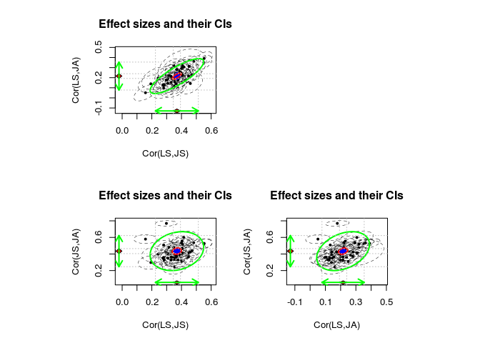
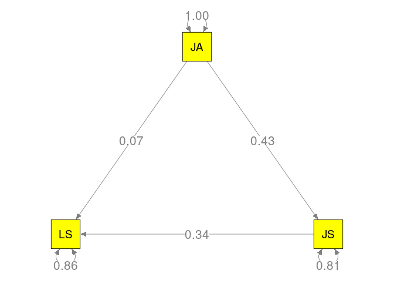
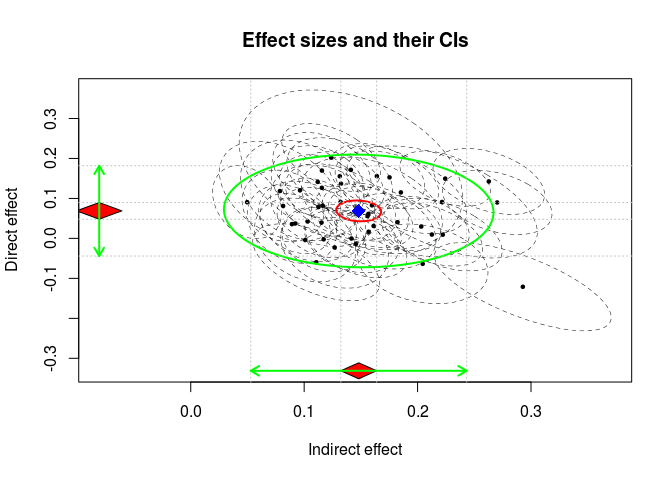
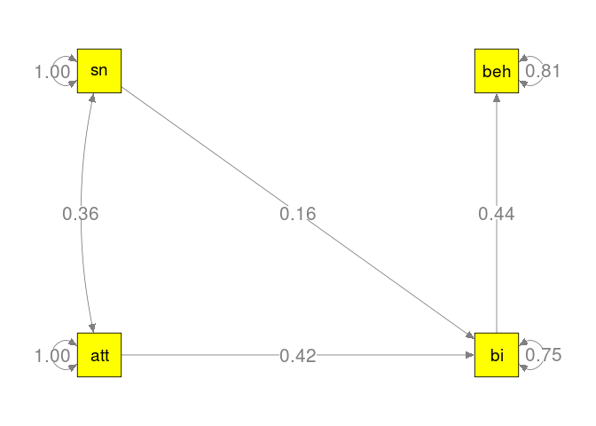
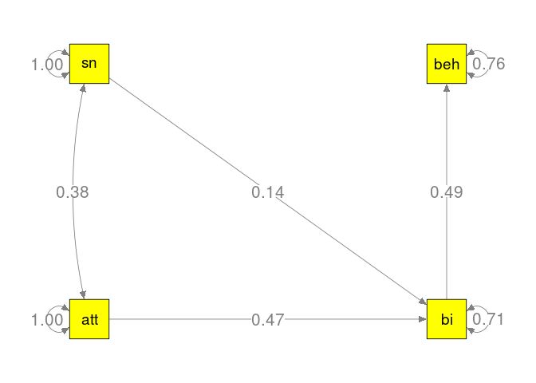

# Correlation-based versus parameter-based MASEM
Mike W.-L. Cheung and Shu Fai Cheung  
19 Feb 2016  

This file includes examples used in Cheung and Cheung (2016):

Cheung, M.W.-L., and Cheung, S.-F. (2016). Random effects models for meta-analytic structural equation modeling: Review, issues, and illustrations. *Research Synthesis Methods*. Manuscript accepted for publication.

# Installing the R packages
* R can be downloaded at http://www.r-project.org/.
* Before running the analyses, we need to install some R packages and download the data. 
* We only need to install them once.

```r
## Installing R packages from the CRAN
install.packages(c("semPlot", "lavaan", "metaSEM"))
```

# Illustration 1: World Values Survey

## Show some sample data

```r
## Load the libraries for TSSEM
library("metaSEM")
library("semPlot")
library("lavaan")

## Display some data
head(wvs94b$data)
```

```
## $france
##          LS       JS       JA
## LS 3.177214 1.355090 1.131718
## JS 1.355090 3.898144 2.372865
## JA 1.131718 2.372865 7.034310
## 
## $britain
##           LS       JS        JA
## LS 3.0906124 1.305764 0.6298882
## JS 1.3057637 4.213234 2.0351779
## JA 0.6298882 2.035178 6.4146887
## 
## $wgermany
##          LS       JS       JA
## LS 2.926122 1.232729 1.291051
## JS 1.232729 3.132200 2.161086
## JA 1.291051 2.161086 5.578932
## 
## $italy
##          LS       JS       JA
## LS 3.686455 1.891624 1.160637
## JS 1.891624 4.357002 2.398691
## JA 1.160637 2.398691 6.819014
## 
## $nethland
##           LS        JS        JA
## LS 1.8066423 0.5455268 0.5927539
## JS 0.5455268 2.8032735 1.5050056
## JA 0.5927539 1.5050056 5.0953228
## 
## $denmark
##           LS        JS        JA
## LS 2.4411541 0.7349914 0.4666241
## JS 0.7349914 2.7641231 1.3065347
## JA 0.4666241 1.3065347 5.7448539
```

```r
## Display some sample sizes
head(wvs94b$n)
```

```
##   france  britain wgermany    italy nethland  denmark 
##      457      840     1160     1032      435      653
```

## Correlation-based MASEM

```r
## First stage of TSSEM: Random-effects model
rand1 <- tssem1(wvs94b$data, wvs94b$n, method="REM")

## Show the summary
summary(rand1)
```

```
## 
## Call:
## meta(y = ES, v = acovR, RE.startvalues = RE.startvalues, RE.lbound = RE.lbound, 
##     I2 = I2, model.name = model.name, suppressWarnings = TRUE, 
##     silent = silent, run = run)
## 
## 95% confidence intervals: z statistic approximation
## Coefficients:
##               Estimate   Std.Error      lbound      ubound z value
## Intercept1  0.36901858  0.01240007  0.34471490  0.39332226 29.7594
## Intercept2  0.21621988  0.01214080  0.19242435  0.24001541 17.8094
## Intercept3  0.43475043  0.01551059  0.40435022  0.46515063 28.0293
## Tau2_1_1    0.00543988  0.00137535  0.00274424  0.00813551  3.9553
## Tau2_2_1    0.00428684  0.00119637  0.00194199  0.00663168  3.5832
## Tau2_2_2    0.00498842  0.00131545  0.00241018  0.00756665  3.7922
## Tau2_3_1    0.00141852  0.00125678 -0.00104472  0.00388177  1.1287
## Tau2_3_2    0.00232871  0.00127532 -0.00017087  0.00482829  1.8260
## Tau2_3_3    0.00917270  0.00215278  0.00495333  0.01339208  4.2609
##             Pr(>|z|)    
## Intercept1 < 2.2e-16 ***
## Intercept2 < 2.2e-16 ***
## Intercept3 < 2.2e-16 ***
## Tau2_1_1   7.645e-05 ***
## Tau2_2_1   0.0003394 ***
## Tau2_2_2   0.0001493 ***
## Tau2_3_1   0.2590265    
## Tau2_3_2   0.0678524 .  
## Tau2_3_3   2.036e-05 ***
## ---
## Signif. codes:  0 '***' 0.001 '**' 0.01 '*' 0.05 '.' 0.1 ' ' 1
## 
## Q statistic on the homogeneity of effect sizes: 1391.381
## Degrees of freedom of the Q statistic: 123
## P value of the Q statistic: 0
## 
## Heterogeneity indices (based on the estimated Tau2):
##                              Estimate
## Intercept1: I2 (Q statistic)   0.8645
## Intercept2: I2 (Q statistic)   0.8254
## Intercept3: I2 (Q statistic)   0.9286
## 
## Number of studies (or clusters): 42
## Number of observed statistics: 126
## Number of estimated parameters: 9
## Degrees of freedom: 117
## -2 log likelihood: -300.9769 
## OpenMx status1: 0 ("0" or "1": The optimization is considered fine.
## Other values may indicate problems.)
```

```r
## Plot the effect sizes
plot.meta(rand1, axis.labels=c("Cor(LS,JS)", "Cor(LS,JA)", "Cor(JS,JA)"), 
          study.min.cex=0.5, main="Effect sizes and their CIs")
```



```r
## Build a model with indirect effect
## A1: Regression coefficients; 
## parameters are labelled with "a", "b", and "c"
## S1: Variance-covariance of parameters
A1 <- create.mxMatrix(c(0,"0.2*b","0.2*c",
                        0,0,"0.2*a",
                        0,0,0), 
    	                type="Full", ncol=3, nrow=3, as.mxMatrix=FALSE, byrow=TRUE)
dimnames(A1) <- list(c("LS","JS","JA"), c("LS","JS","JA"))
A1
```

```
##    LS  JS      JA     
## LS "0" "0.2*b" "0.2*c"
## JS "0" "0"     "0.2*a"
## JA "0" "0"     "0"
```

```r
S1 <- create.mxMatrix(c("0.2*Error_y","0.2*Error_m",1), type="Diag", as.mxMatrix=FALSE)
dimnames(S1) <- list(c("LS","JS","JA"), c("LS","JS","JA"))
S1
```

```
##    LS            JS            JA 
## LS "0.2*Error_y" "0"           "0"
## JS "0"           "0.2*Error_m" "0"
## JA "0"           "0"           "1"
```

```r
## Second stage of TSSEM: Random-effects model
## Estimate direct and indirect effects
rand2 <- tssem2(rand1, Amatrix=A1, Smatrix=S1, 
                diag.constraints=TRUE, intervals.type="LB",
                mx.algebras=list( indirect=mxAlgebra(a*b, name="indirect"), 
                                  direct=mxAlgebra(c, name="direct") ))

## Show the summary
summary(rand2)
```

```
## 
## Call:
## wls(Cov = pooledS, asyCov = asyCov, n = tssem1.obj$total.n, Amatrix = Amatrix, 
##     Smatrix = Smatrix, Fmatrix = Fmatrix, diag.constraints = diag.constraints, 
##     cor.analysis = cor.analysis, intervals.type = intervals.type, 
##     mx.algebras = mx.algebras, model.name = model.name, suppressWarnings = suppressWarnings, 
##     silent = silent, run = run)
## 
## 95% confidence intervals: Likelihood-based statistic
## Coefficients:
##         Estimate Std.Error   lbound   ubound z value Pr(>|z|)
## b       0.339112        NA 0.316699 0.361675      NA       NA
## c       0.068791        NA 0.048185 0.089250      NA       NA
## a       0.434750        NA 0.404334 0.465242      NA       NA
## Error_y 0.859988        NA 0.840559 0.878148      NA       NA
## Error_m 0.810992        NA 0.783633 0.836506      NA       NA
## 
## mxAlgebras objects (and their 95% likelihood-based CIs):
##                   lbound   Estimate     ubound
## indirect[1,1] 0.13241536 0.14742895 0.16353154
## direct[1,1]   0.04818516 0.06879093 0.08925038
## 
## Goodness-of-fit indices:
##                                              Value
## Sample size                                35663.0
## Chi-square of target model                     0.0
## DF of target model                             0.0
## p value of target model                        0.0
## Number of constraints imposed on "Smatrix"     2.0
## DF manually adjusted                           0.0
## Chi-square of independence model            1601.7
## DF of independence model                       3.0
## RMSEA                                          0.0
## RMSEA lower 95% CI                             0.0
## RMSEA upper 95% CI                             0.0
## SRMR                                           0.0
## TLI                                           -Inf
## CFI                                            1.0
## AIC                                            0.0
## BIC                                            0.0
## OpenMx status1: 0 ("0" or "1": The optimization is considered fine.
## Other values indicate problems.)
```

```r
## Plot the model
my.plot1 <- meta2semPlot(rand2)
semPaths(my.plot1, whatLabels="est", edge.label.cex=1.5, sizeMan=8, color="yellow")
```



## Parameter-based MASEM

```r
## First stage of analysis: Extract the direct 
## and indirect effects per study
(indirect1 <- indirectEffect(wvs94b$data, wvs94b$n))
```

```
##             ind_eff       dir_eff      ind_var   ind_dir_cov      dir_var
## france   0.15978141  0.0827522431 0.0006426889 -4.659352e-04 0.0024426794
## britain  0.14168820 -0.0002263006 0.0002891774 -1.628594e-04 0.0012231401
## wgermany 0.17524960  0.1527287440 0.0003160793 -2.686299e-04 0.0010403311
## italy    0.20321233  0.0296684555 0.0002997084 -1.505074e-04 0.0009558993
## nethland 0.07862686  0.1185534095 0.0004752478 -4.176474e-04 0.0025998998
## denmark  0.08921949  0.0357811043 0.0002584755 -1.635535e-04 0.0015970313
## belgium  0.18234893  0.0406592532 0.0002431905 -1.639931e-04 0.0008551220
## spain    0.15684423  0.0166711391 0.0001386116 -8.535496e-05 0.0005436663
## ireland  0.20451372 -0.0635826274 0.0005540251 -2.117564e-04 0.0016590964
## nireland 0.14117359  0.1715056548 0.0016310868 -1.137911e-03 0.0067148723
## usa      0.21260852  0.0097460309 0.0003355500 -2.567798e-04 0.0010405733
## canada   0.15592998  0.0559244094 0.0002677214 -1.926679e-04 0.0010355020
## japan    0.29279252 -0.1210110118 0.0010149349 -9.994713e-04 0.0020319893
## mexico   0.27017766  0.0899476460 0.0003902704 -2.366794e-04 0.0010794907
## s africa 0.22436811  0.1495906058 0.0002664471 -2.112609e-04 0.0007997194
## hungary  0.11562915  0.1698170964 0.0003134071 -2.145078e-04 0.0015114144
## norway   0.11717420 -0.0022129614 0.0002265684 -1.072010e-04 0.0011005334
## sweden   0.14566226 -0.0139555999 0.0003340818 -2.808965e-04 0.0011892902
## iceland  0.10093202 -0.0039303578 0.0003336176 -2.167107e-04 0.0018334352
## argentin 0.12691382 -0.0226665421 0.0003771584 -1.913267e-04 0.0017279311
## finland  0.22153359  0.0911586142 0.0011819266 -1.068610e-03 0.0032887041
## skorea   0.26277918  0.1425267801 0.0004041715 -2.713560e-04 0.0011342315
## poland   0.11064977 -0.0597440148 0.0005229728 -4.943737e-04 0.0015468192
## switz    0.22223141  0.0093824786 0.0004571214 -3.593569e-04 0.0013721375
## brazil   0.13247467  0.1370104168 0.0002411023 -1.563668e-04 0.0010607604
## nigeria  0.11195614  0.1413833608 0.0002813959 -1.341408e-04 0.0013634255
## chile    0.11531262  0.0395808324 0.0002569745 -1.572959e-04 0.0012841786
## byelorus 0.11559917  0.1265705848 0.0002318938 -1.475425e-04 0.0011419077
## india    0.15666943  0.0614854208 0.0002110465 -9.147194e-05 0.0007809664
## czech    0.09205198  0.0373221690 0.0001603435 -1.109961e-04 0.0009433472
## egermany 0.12373178  0.2026104211 0.0003155205 -2.794842e-04 0.0011994117
## slovenia 0.11637801  0.0818733455 0.0003588966 -1.803961e-04 0.0017447498
## bulgaria 0.18526507  0.1151116428 0.0005621641 -4.814075e-04 0.0017898810
## romania  0.16122300  0.0311905872 0.0005057022 -3.325896e-04 0.0019383149
## china    0.16410105  0.1558057177 0.0002978551 -1.825137e-04 0.0011046614
## portugal 0.10308383  0.0423772978 0.0003108868 -1.964654e-04 0.0016999190
## austria  0.08144816  0.0812577499 0.0002190283 -7.901212e-05 0.0013404392
## turkey   0.09635418  0.1202190086 0.0004608066 -2.868848e-04 0.0026492180
## lithuan  0.04971959  0.0906341984 0.0001547141 -1.261018e-04 0.0014005275
## latvia   0.13141244  0.1555683547 0.0003636352 -2.773161e-04 0.0015478234
## estonia  0.13213639  0.0910846401 0.0003968020 -3.413673e-04 0.0015334538
## russia   0.11256496  0.0784023892 0.0001843395 -1.408835e-04 0.0008860497
```

```r
## Second stage of analysis: Multivariate meta-analysis on 
## the direct and indirect effect sizes
indirect2 <- meta(indirect1[, c("ind_eff", "dir_eff")], 
                  indirect1[, c("ind_var", "ind_dir_cov", "dir_var")], intervals.type="z")

## Show the summary
summary(indirect2)  
```

```
## 
## Call:
## meta(y = indirect1[, c("ind_eff", "dir_eff")], v = indirect1[, 
##     c("ind_var", "ind_dir_cov", "dir_var")], intervals.type = "z")
## 
## 95% confidence intervals: z statistic approximation
## Coefficients:
##               Estimate   Std.Error      lbound      ubound z value
## Intercept1  1.4809e-01  8.0687e-03  1.3227e-01  1.6390e-01 18.3536
## Intercept2  6.8791e-02  1.0638e-02  4.7940e-02  8.9642e-02  6.4663
## Tau2_1_1    2.3566e-03  6.0242e-04  1.1758e-03  3.5373e-03  3.9119
## Tau2_2_1   -7.9491e-05  5.7032e-04 -1.1973e-03  1.0383e-03 -0.1394
## Tau2_2_2    3.3153e-03  1.0385e-03  1.2799e-03  5.3507e-03  3.1925
##             Pr(>|z|)    
## Intercept1 < 2.2e-16 ***
## Intercept2 1.004e-10 ***
## Tau2_1_1   9.159e-05 ***
## Tau2_2_1     0.88915    
## Tau2_2_2     0.00141 ** 
## ---
## Signif. codes:  0 '***' 0.001 '**' 0.01 '*' 0.05 '.' 0.1 ' ' 1
## 
## Q statistic on the homogeneity of effect sizes: 561.3146
## Degrees of freedom of the Q statistic: 82
## P value of the Q statistic: 0
## 
## Heterogeneity indices (based on the estimated Tau2):
##                              Estimate
## Intercept1: I2 (Q statistic)   0.8836
## Intercept2: I2 (Q statistic)   0.7195
## 
## Number of studies (or clusters): 42
## Number of observed statistics: 84
## Number of estimated parameters: 5
## Degrees of freedom: 79
## -2 log likelihood: -232.163 
## OpenMx status1: 0 ("0" or "1": The optimization is considered fine.
## Other values may indicate problems.)
```

```r
## Plot the indirect and direct effects as effect sizes
plot.meta(indirect2, axis.labels=c("Indirect effect", "Direct effect"),
          study.min.cex=0.5, main="Effect sizes and their CIs")
```



# Illustration 2: Theory of Planned Behavior

## Show some sample data and check the data

```r
## Display some data
head(Cheung00$data)
```

```
## $`Ajzen & Madden (1986a)`
##       att    sn   bi  beh
## att 1.000 0.332 0.51   NA
## sn  0.332 1.000 0.35   NA
## bi  0.510 0.350 1.00 0.36
## beh    NA    NA 0.36 1.00
## 
## $`Ajzen & Madden (1986b)`
##       att    sn   bi  beh
## att 1.000 0.261 0.48   NA
## sn  0.261 1.000 0.11   NA
## bi  0.480 0.110 1.00 0.26
## beh    NA    NA 0.26 1.00
## 
## $`Louies (1996)`
##       att    sn    bi   beh
## att 1.000 0.355 0.469 0.308
## sn  0.355 1.000 0.328 0.105
## bi  0.469 0.328 1.000 0.519
## beh 0.308 0.105 0.519 1.000
## 
## $`Borgida & Conner (1992)`
##      att   sn   bi beh
## att 1.00 0.26 0.39  NA
## sn  0.26 1.00 0.12  NA
## bi  0.39 0.12 1.00  NA
## beh   NA   NA   NA   1
## 
## $`Courneya & Mcauley (1995)`
##      att    sn    bi  beh
## att 1.00  0.07  0.29 0.01
## sn  0.07  1.00 -0.10 0.11
## bi  0.29 -0.10  1.00 0.46
## beh 0.01  0.11  0.46 1.00
## 
## $`Courneya, Nigg, & Estabrooks (1998)`
##      att   sn   bi  beh
## att 1.00 0.48 0.49 0.18
## sn  0.48 1.00 0.51 0.08
## bi  0.49 0.51 1.00 0.49
## beh 0.18 0.08 0.49 1.00
```

```r
## Display some sample sizes
head(Cheung00$n)
```

```
##              Ajzen & Madden (1986a)              Ajzen & Madden (1986b) 
##                                 169                                  90 
##                       Louies (1996)             Borgida & Conner (1992) 
##                                 238                                 201 
##           Courneya & Mcauley (1995) Courneya, Nigg, & Estabrooks (1998) 
##                                  62                                 131
```

```r
# Check pd in the data
pd_check <- is.pd(Cheung00$data)
sum(!is.na(pd_check))
```

```
## [1] 29
```

```r
## Studies with positive definite matrices happen to be studies without missing data.
my.pd <- list()
my.pd$data <- Cheung00$data[!is.na(pd_check)]
my.pd$n <- Cheung00$n[!is.na(pd_check)]

# No. of studies: All data
pattern.na(Cheung00$data, show.na=FALSE)
```

```
##     att sn bi beh
## att  50 46 50  29
## sn   46 50 50  29
## bi   50 50 50  44
## beh  29 29 44  50
```

```r
# No. of studies: Positive definite
pattern.na(my.pd$data, show.na=FALSE)
```

```
##     att sn bi beh
## att  29 29 29  29
## sn   29 29 29  29
## bi   29 29 29  29
## beh  29 29 29  29
```

```r
# Sample sizes: All data
pattern.n(Cheung00$data, Cheung00$n)
```

```
##      att   sn   bi  beh
## att 8182 7781 8182 4454
## sn  7781 8182 8182 4454
## bi  8182 8182 8182 6520
## beh 4454 4454 6520 8182
```

```r
# Sample sizes: Positive definite
pattern.n(my.pd$data, my.pd$n)
```

```
##      att   sn   bi  beh
## att 4454 4454 4454 4454
## sn  4454 4454 4454 4454
## bi  4454 4454 4454 4454
## beh 4454 4454 4454 4454
```

## Correlation-based MASEM

```r
## Stage 1 analysis: Random-effects model
## All studies used.
tra_random_1 <- tssem1(Cheung00$data, Cheung00$n, method="REM")
summary(tra_random_1)
```

```
## 
## Call:
## meta(y = ES, v = acovR, RE.startvalues = RE.startvalues, RE.lbound = RE.lbound, 
##     I2 = I2, model.name = model.name, suppressWarnings = TRUE, 
##     silent = silent, run = run)
## 
## 95% confidence intervals: z statistic approximation
## Coefficients:
##               Estimate   Std.Error      lbound      ubound z value
## Intercept1  3.5789e-01  2.5402e-02  3.0811e-01  4.0768e-01 14.0891
## Intercept2  4.8637e-01  2.1223e-02  4.4478e-01  5.2797e-01 22.9171
## Intercept3  2.7423e-01  2.9857e-02  2.1571e-01  3.3275e-01  9.1848
## Intercept4  3.0924e-01  2.2681e-02  2.6478e-01  3.5369e-01 13.6342
## Intercept5  1.3417e-01  2.4076e-02  8.6979e-02  1.8136e-01  5.5726
## Intercept6  4.3921e-01  2.5078e-02  3.9006e-01  4.8836e-01 17.5136
## Tau2_1_1    2.3615e-02  6.2394e-03  1.1386e-02  3.5844e-02  3.7849
## Tau2_2_1    7.6316e-03  4.2150e-03 -6.2954e-04  1.5893e-02  1.8106
## Tau2_2_2    1.6635e-02  4.3113e-03  8.1851e-03  2.5085e-02  3.8585
## Tau2_3_1   -1.3776e-03  5.9218e-03 -1.2984e-02  1.0229e-02 -0.2326
## Tau2_3_2    9.7808e-03  5.0122e-03 -4.2882e-05  1.9605e-02  1.9514
## Tau2_3_3    2.0186e-02  6.8179e-03  6.8232e-03  3.3549e-02  2.9607
## Tau2_4_1    1.5803e-02  4.9203e-03  6.1594e-03  2.5447e-02  3.2118
## Tau2_4_2    8.1775e-03  3.6120e-03  1.0981e-03  1.5257e-02  2.2640
## Tau2_4_3    8.0613e-04  4.7972e-03 -8.5962e-03  1.0208e-02  0.1680
## Tau2_4_4    1.8402e-02  5.0379e-03  8.5284e-03  2.8277e-02  3.6528
## Tau2_5_1    3.0894e-03  4.8819e-03 -6.4790e-03  1.2658e-02  0.6328
## Tau2_5_2    2.1754e-03  3.8733e-03 -5.4162e-03  9.7670e-03  0.5616
## Tau2_5_3    8.5509e-03  4.4045e-03 -8.1866e-05  1.7184e-02  1.9414
## Tau2_5_4    4.8475e-03  4.0442e-03 -3.0789e-03  1.2774e-02  1.1987
## Tau2_5_5    8.1756e-03  4.0920e-03  1.5543e-04  1.6196e-02  1.9979
## Tau2_6_1   -5.1217e-03  4.5098e-03 -1.3961e-02  3.7173e-03 -1.1357
## Tau2_6_2    2.3361e-03  3.8851e-03 -5.2785e-03  9.9507e-03  0.6013
## Tau2_6_3    1.3481e-02  5.0535e-03  3.5769e-03  2.3386e-02  2.6678
## Tau2_6_4   -2.5721e-03  3.8825e-03 -1.0182e-02  5.0375e-03 -0.6625
## Tau2_6_5    6.7730e-03  3.8487e-03 -7.7036e-04  1.4316e-02  1.7598
## Tau2_6_6    2.0667e-02  5.5427e-03  9.8033e-03  3.1530e-02  3.7287
##             Pr(>|z|)    
## Intercept1 < 2.2e-16 ***
## Intercept2 < 2.2e-16 ***
## Intercept3 < 2.2e-16 ***
## Intercept4 < 2.2e-16 ***
## Intercept5  2.51e-08 ***
## Intercept6 < 2.2e-16 ***
## Tau2_1_1   0.0001538 ***
## Tau2_2_1   0.0702019 .  
## Tau2_2_2   0.0001141 ***
## Tau2_3_1   0.8160462    
## Tau2_3_2   0.0510085 .  
## Tau2_3_3   0.0030689 ** 
## Tau2_4_1   0.0013191 ** 
## Tau2_4_2   0.0235745 *  
## Tau2_4_3   0.8665496    
## Tau2_4_4   0.0002594 ***
## Tau2_5_1   0.5268498    
## Tau2_5_2   0.5743629    
## Tau2_5_3   0.0522125 .  
## Tau2_5_4   0.2306628    
## Tau2_5_5   0.0457223 *  
## Tau2_6_1   0.2560831    
## Tau2_6_2   0.5476354    
## Tau2_6_3   0.0076357 ** 
## Tau2_6_4   0.5076553    
## Tau2_6_5   0.0784411 .  
## Tau2_6_6   0.0001925 ***
## ---
## Signif. codes:  0 '***' 0.001 '**' 0.01 '*' 0.05 '.' 0.1 ' ' 1
## 
## Q statistic on the homogeneity of effect sizes: 1324.594
## Degrees of freedom of the Q statistic: 242
## P value of the Q statistic: 0
## 
## Heterogeneity indices (based on the estimated Tau2):
##                              Estimate
## Intercept1: I2 (Q statistic)   0.8374
## Intercept2: I2 (Q statistic)   0.8415
## Intercept3: I2 (Q statistic)   0.7911
## Intercept4: I2 (Q statistic)   0.7886
## Intercept5: I2 (Q statistic)   0.5738
## Intercept6: I2 (Q statistic)   0.8452
## 
## Number of studies (or clusters): 50
## Number of observed statistics: 248
## Number of estimated parameters: 27
## Degrees of freedom: 221
## -2 log likelihood: -300.6699 
## OpenMx status1: 0 ("0" or "1": The optimization is considered fine.
## Other values may indicate problems.)
```

```r
## Variable labels
labels <- c("att","sn","bi","beh")

## Complete mediation model
tra_S <- Diag(c("1", "1", ".2*e_bi", ".2*e_beh"))
tra_S[2,1] <- tra_S[1,2] <- ".2*c_att_sn"
dimnames(tra_S) <- list(labels, labels)
tra_S
```

```
##     att           sn            bi        beh       
## att "1"           ".2*c_att_sn" "0"       "0"       
## sn  ".2*c_att_sn" "1"           "0"       "0"       
## bi  "0"           "0"           ".2*e_bi" "0"       
## beh "0"           "0"           "0"       ".2*e_beh"
```

```r
tra_A <- matrix(c("0","0","0","0",
                  "0","0","0","0",
                  ".2*att2bi", ".2*sn2bi", "0", "0",
                  "0", "0", ".2*bi2beh", "0"),
                byrow=TRUE, 4, 4)
dimnames(tra_A) <- list(labels, labels)
tra_A
```

```
##     att         sn         bi          beh
## att "0"         "0"        "0"         "0"
## sn  "0"         "0"        "0"         "0"
## bi  ".2*att2bi" ".2*sn2bi" "0"         "0"
## beh "0"         "0"        ".2*bi2beh" "0"
```

```r
## Stage 2
tra_random_2 <- tssem2(tra_random_1, Amatrix=tra_A, Smatrix=tra_S, 
                       intervals.type="LB", diag.constraints=FALSE)
summary(tra_random_2)
```

```
## 
## Call:
## wls(Cov = pooledS, asyCov = asyCov, n = tssem1.obj$total.n, Amatrix = Amatrix, 
##     Smatrix = Smatrix, Fmatrix = Fmatrix, diag.constraints = diag.constraints, 
##     cor.analysis = cor.analysis, intervals.type = intervals.type, 
##     mx.algebras = mx.algebras, model.name = model.name, suppressWarnings = suppressWarnings, 
##     silent = silent, run = run)
## 
## 95% confidence intervals: Likelihood-based statistic
## Coefficients:
##          Estimate Std.Error  lbound  ubound z value Pr(>|z|)
## att2bi    0.42470        NA 0.38129 0.46843      NA       NA
## sn2bi     0.15685        NA 0.11919 0.19518      NA       NA
## bi2beh    0.43559        NA 0.38596 0.48527      NA       NA
## c_att_sn  0.36039        NA 0.31079 0.41001      NA       NA
## 
## Goodness-of-fit indices:
##                                                Value
## Sample size                                8182.0000
## Chi-square of target model                    8.0242
## DF of target model                            2.0000
## p value of target model                       0.0181
## Number of constraints imposed on "Smatrix"    0.0000
## DF manually adjusted                          0.0000
## Chi-square of independence model            907.1880
## DF of independence model                      6.0000
## RMSEA                                         0.0192
## RMSEA lower 95% CI                            0.0067
## RMSEA upper 95% CI                            0.0339
## SRMR                                          0.0265
## TLI                                           0.9799
## CFI                                           0.9933
## AIC                                           4.0242
## BIC                                          -9.9952
## OpenMx status1: 0 ("0" or "1": The optimization is considered fine.
## Other values indicate problems.)
```

```r
my.plot2 <- meta2semPlot(tra_random_2)
semPaths(my.plot2, whatLabels="est", rotation=2, edge.label.cex=1.5, sizeMan=8, 
         color="yellow")
```



```r
## Stage 1
# Only use studies with positive definite matrices
## Not enough data to estimate the variance component for all random effects
## A diagonal matrix is used
tra_random_pd_1 <- tssem1(my.pd$data, my.pd$n, method="REM", RE.type="Diag")
summary(tra_random_pd_1)
```

```
## 
## Call:
## meta(y = ES, v = acovR, RE.constraints = Diag(x = paste(RE.startvalues, 
##     "*Tau2_", 1:no.es, "_", 1:no.es, sep = "")), RE.lbound = RE.lbound, 
##     I2 = I2, model.name = model.name, suppressWarnings = TRUE, 
##     silent = silent, run = run)
## 
## 95% confidence intervals: z statistic approximation
## Coefficients:
##              Estimate  Std.Error     lbound     ubound z value  Pr(>|z|)
## Intercept1 0.38101062 0.02640039 0.32926681 0.43275443 14.4320 < 2.2e-16
## Intercept2 0.50909535 0.02125127 0.46744363 0.55074707 23.9560 < 2.2e-16
## Intercept3 0.30877037 0.02829476 0.25331366 0.36422708 10.9126 < 2.2e-16
## Intercept4 0.32003820 0.02499212 0.27105455 0.36902186 12.8056 < 2.2e-16
## Intercept5 0.15663976 0.02215870 0.11320950 0.20007001  7.0690 1.561e-12
## Intercept6 0.46859205 0.02996210 0.40986742 0.52731669 15.6395 < 2.2e-16
## Tau2_1_1   0.01372592 0.00509133 0.00374709 0.02370474  2.6959  0.007019
## Tau2_2_2   0.00779679 0.00286533 0.00218085 0.01341272  2.7211  0.006507
## Tau2_3_3   0.01546670 0.00529501 0.00508867 0.02584472  2.9210  0.003489
## Tau2_4_4   0.01115768 0.00431927 0.00269205 0.01962330  2.5832  0.009788
## Tau2_5_5   0.00615205 0.00301010 0.00025237 0.01205173  2.0438  0.040973
## Tau2_6_6   0.01950958 0.00654649 0.00667870 0.03234046  2.9802  0.002881
##               
## Intercept1 ***
## Intercept2 ***
## Intercept3 ***
## Intercept4 ***
## Intercept5 ***
## Intercept6 ***
## Tau2_1_1   ** 
## Tau2_2_2   ** 
## Tau2_3_3   ** 
## Tau2_4_4   ** 
## Tau2_5_5   *  
## Tau2_6_6   ** 
## ---
## Signif. codes:  0 '***' 0.001 '**' 0.01 '*' 0.05 '.' 0.1 ' ' 1
## 
## Q statistic on the homogeneity of effect sizes: 757.918
## Degrees of freedom of the Q statistic: 168
## P value of the Q statistic: 0
## 
## Heterogeneity indices (based on the estimated Tau2):
##                              Estimate
## Intercept1: I2 (Q statistic)   0.7396
## Intercept2: I2 (Q statistic)   0.7024
## Intercept3: I2 (Q statistic)   0.7504
## Intercept4: I2 (Q statistic)   0.6742
## Intercept5: I2 (Q statistic)   0.4893
## Intercept6: I2 (Q statistic)   0.8492
## 
## Number of studies (or clusters): 29
## Number of observed statistics: 174
## Number of estimated parameters: 12
## Degrees of freedom: 162
## -2 log likelihood: -199.394 
## OpenMx status1: 0 ("0" or "1": The optimization is considered fine.
## Other values may indicate problems.)
```

```r
## Stage 2
tra_random_pd_2 <- tssem2(tra_random_pd_1, Amatrix=tra_A, Smatrix=tra_S, 
                          intervals.type="LB", diag.constraints=FALSE)
summary(tra_random_pd_2)
```

```
## 
## Call:
## wls(Cov = pooledS, asyCov = asyCov, n = tssem1.obj$total.n, Amatrix = Amatrix, 
##     Smatrix = Smatrix, Fmatrix = Fmatrix, diag.constraints = diag.constraints, 
##     cor.analysis = cor.analysis, intervals.type = intervals.type, 
##     mx.algebras = mx.algebras, model.name = model.name, suppressWarnings = suppressWarnings, 
##     silent = silent, run = run)
## 
## 95% confidence intervals: Likelihood-based statistic
## Coefficients:
##          Estimate Std.Error   lbound   ubound z value Pr(>|z|)
## att2bi   0.467266        NA 0.418345 0.516531      NA       NA
## sn2bi    0.140557        NA 0.082785 0.196563      NA       NA
## bi2beh   0.494276        NA 0.442368 0.546330      NA       NA
## c_att_sn 0.381425        NA 0.329689 0.433172      NA       NA
## 
## Goodness-of-fit indices:
##                                                Value
## Sample size                                4454.0000
## Chi-square of target model                    5.0609
## DF of target model                            2.0000
## p value of target model                       0.0796
## Number of constraints imposed on "Smatrix"    0.0000
## DF manually adjusted                          0.0000
## Chi-square of independence model           1049.1131
## DF of independence model                      6.0000
## RMSEA                                         0.0185
## RMSEA lower 95% CI                            0.0000
## RMSEA upper 95% CI                            0.0394
## SRMR                                          0.0239
## TLI                                           0.9912
## CFI                                           0.9971
## AIC                                           1.0609
## BIC                                         -11.7422
## OpenMx status1: 0 ("0" or "1": The optimization is considered fine.
## Other values indicate problems.)
```

```r
my.plot3 <- meta2semPlot(tra_random_pd_2)
semPaths(my.plot3, whatLabels="est", rotation=2, edge.label.cex=1.5, sizeMan=8,
         color="yellow")
```



## Parameter-based MASEM

```r
## Stage 1 analysis

# Use lavaan to the model
tra_model <- 'bi  ~ att + sn
              beh ~ bi
              att ~~ sn'
  
tra_study_lavaan <- function(id, data, para_names=NULL, model, ...) {
    cor_i   <- data$data[[id]]
    n_i     <- data$n[[id]]
    fit_i <- sem(model=model, sample.cov=cor_i, sample.nobs=n_i,  ...)
    results <- list()
    coefs <- standardizedSolution(fit_i)$est.std[1:4]
    vcoefs <- vcov(fit_i)[1:4,1:4]
    if (is.null(para_names)) para_names <- names(coefs)
    names(coefs) <- para_names
    colnames(vcoefs) <- rownames(vcoefs) <- para_names
    results$coefs <- coefs
    results$vcoefs <- vcoefs
    results$fit <- fit_i
    results
}  
  
# Analyze complete data with positive definite matrices
k <- length(my.pd$data)
para_names <- c("att2bi","sn2bi","bi2beh","c_att_sn")
var_names <- c("att", "sn", "bi", "beh")

tra_fit_all <- lapply(1:k, FUN=tra_study_lavaan, data=my.pd, para_names=para_names,
                      model=tra_model, estimator="ML", fixed.x=FALSE)                
                            
## Parameter-based: Stage 2: Random and Fixed         
tra_coefs_all <- t(sapply(1:k, function(x) {tra_fit_all[[x]]$coefs}))
tra_vcoefs_all <- t(sapply(1:k, function(x) {lav_matrix_vech(tra_fit_all[[x]]$vcoefs)}))

## Not enough data to estimate the variance component for all random effects
## A diagonal matrix is used
tra_pbased_random <- meta(tra_coefs_all, tra_vcoefs_all,
                          RE.constraints=Diag(paste("0.2*Tau2_",1:4,"_", 1:4, sep="")))
summary(tra_pbased_random)
```

```
## 
## Call:
## meta(y = tra_coefs_all, v = tra_vcoefs_all, RE.constraints = Diag(paste("0.2*Tau2_", 
##     1:4, "_", 1:4, sep = "")))
## 
## 95% confidence intervals: z statistic approximation
## Coefficients:
##               Estimate   Std.Error      lbound      ubound z value
## Intercept1  0.45250420  0.02442529  0.40463151  0.50037690 18.5260
## Intercept2  0.14523327  0.02323158  0.09970020  0.19076634  6.2515
## Intercept3  0.45712168  0.03156754  0.39525044  0.51899291 14.4808
## Intercept4  0.35458131  0.02602190  0.30357933  0.40558328 13.6263
## Tau2_1_1    0.00935382  0.00364211  0.00221542  0.01649222  2.5682
## Tau2_2_2    0.00791799  0.00372970  0.00060792  0.01522806  2.1230
## Tau2_3_3    0.02062625  0.00730362  0.00631142  0.03494109  2.8241
## Tau2_4_4    0.00886575  0.00476366 -0.00047085  0.01820235  1.8611
##             Pr(>|z|)    
## Intercept1 < 2.2e-16 ***
## Intercept2 4.064e-10 ***
## Intercept3 < 2.2e-16 ***
## Intercept4 < 2.2e-16 ***
## Tau2_1_1    0.010222 *  
## Tau2_2_2    0.033757 *  
## Tau2_3_3    0.004741 ** 
## Tau2_4_4    0.062727 .  
## ---
## Signif. codes:  0 '***' 0.001 '**' 0.01 '*' 0.05 '.' 0.1 ' ' 1
## 
## Q statistic on the homogeneity of effect sizes: 373.4459
## Degrees of freedom of the Q statistic: 112
## P value of the Q statistic: 0
## 
## Heterogeneity indices (based on the estimated Tau2):
##                              Estimate
## Intercept1: I2 (Q statistic)   0.6360
## Intercept2: I2 (Q statistic)   0.5967
## Intercept3: I2 (Q statistic)   0.8077
## Intercept4: I2 (Q statistic)   0.5409
## 
## Number of studies (or clusters): 29
## Number of observed statistics: 116
## Number of estimated parameters: 8
## Degrees of freedom: 108
## -2 log likelihood: -123.6302 
## OpenMx status1: 0 ("0" or "1": The optimization is considered fine.
## Other values may indicate problems.)
```

```r
tra_pbased_fixed  <- meta(tra_coefs_all, tra_vcoefs_all, 
                          RE.constraints=matrix("0", ncol=4, nrow=4))
summary(tra_pbased_fixed)
```

```
## 
## Call:
## meta(y = tra_coefs_all, v = tra_vcoefs_all, RE.constraints = matrix("0", 
##     ncol = 4, nrow = 4))
## 
## 95% confidence intervals: z statistic approximation
## Coefficients:
##            Estimate Std.Error   lbound   ubound z value  Pr(>|z|)    
## Intercept1 0.485098  0.013196 0.459235 0.510961 36.7624 < 2.2e-16 ***
## Intercept2 0.118433  0.013196 0.092570 0.144295  8.9752 < 2.2e-16 ***
## Intercept3 0.501034  0.012774 0.475997 0.526071 39.2220 < 2.2e-16 ***
## Intercept4 0.337432  0.015819 0.306427 0.368437 21.3305 < 2.2e-16 ***
## ---
## Signif. codes:  0 '***' 0.001 '**' 0.01 '*' 0.05 '.' 0.1 ' ' 1
## 
## Q statistic on the homogeneity of effect sizes: 373.4459
## Degrees of freedom of the Q statistic: 112
## P value of the Q statistic: 0
## 
## Heterogeneity indices (based on the estimated Tau2):
##                              Estimate
## Intercept1: I2 (Q statistic)        0
## Intercept2: I2 (Q statistic)        0
## Intercept3: I2 (Q statistic)        0
## Intercept4: I2 (Q statistic)        0
## 
## Number of studies (or clusters): 29
## Number of observed statistics: 116
## Number of estimated parameters: 4
## Degrees of freedom: 112
## -2 log likelihood: 20.87336 
## OpenMx status1: 0 ("0" or "1": The optimization is considered fine.
## Other values may indicate problems.)
```

```r
# Compare All Methods

## Parameter estimates
coef_cbased_random  <- coef(tra_random_2)[para_names]
coef_cbased_random_pd  <- coef(tra_random_pd_2)[para_names]
coef_pbased_random  <- coef(tra_pbased_random)[1:4]

coef_all <- as.data.frame(rbind(coef_cbased_random,
                                coef_cbased_random_pd,
                                coef_pbased_random))
```


```r
library(lavaan)

## Estimated sampling variances of parameter estimates
### Make the results reproducible.
set.seed(98717341)                                
secoef_cbased_random <- sqrt(diag(vcov(tra_random_2))[1:4])
secoef_cbased_random_pd <- sqrt(diag(vcov(tra_random_pd_2))[1:4])
secoef_pbased_random <- summary(tra_pbased_random)$coefficients$Std.Error[1:4]

secoef_all <- as.data.frame(rbind(secoef_cbased_random,
                                  secoef_cbased_random_pd,
                                  secoef_pbased_random))
                                  
## Compare them
coef_all
```

```
##                          att2bi     sn2bi    bi2beh  c_att_sn
## coef_cbased_random    0.4246984 0.1568474 0.4355947 0.3603892
## coef_cbased_random_pd 0.4672663 0.1405567 0.4942760 0.3814253
## coef_pbased_random    0.4525042 0.1452333 0.4571217 0.3545813
```

```r
secoef_all
```

```
##                             att2bi      sn2bi     bi2beh   c_att_sn
## secoef_cbased_random    0.02220906 0.01935184 0.02533529 0.02530357
## secoef_cbased_random_pd 0.02499048 0.02895997 0.02650955 0.02639665
## secoef_pbased_random    0.02442529 0.02323158 0.03156754 0.02602190
```

```r
## Variance components
## Cbased_random
c_labels <- lav_matrix_vech(outer(labels, labels, 
                                  function(x,y) paste("c_",x, "_", y,sep="")), 
                            diagonal = FALSE)

cbased.vc <- vec2symMat( coef(tra_random_1, select="random"), diag=TRUE, byrow=TRUE )
dimnames(cbased.vc) <- list(c_labels, c_labels)
cbased.vc
```

```
##               c_sn_att    c_bi_att     c_beh_att       c_bi_sn    c_beh_sn
## c_sn_att   0.023615164 0.007631615 -0.0013776014  0.0158030618 0.003089392
## c_bi_att   0.007631615 0.016635089  0.0097808100  0.0081774977 0.002175408
## c_beh_att -0.001377601 0.009780810  0.0201860271  0.0008061335 0.008550852
## c_bi_sn    0.015803062 0.008177498  0.0008061335  0.0184024510 0.004847536
## c_beh_sn   0.003089392 0.002175408  0.0085508517  0.0048475362 0.008175630
## c_beh_bi  -0.005121737 0.002336112  0.0134814892 -0.0025721457 0.006772953
##               c_beh_bi
## c_sn_att  -0.005121737
## c_bi_att   0.002336112
## c_beh_att  0.013481489
## c_bi_sn   -0.002572146
## c_beh_sn   0.006772953
## c_beh_bi   0.020666819
```

```r
cbased.vc_pd <- diag(coef(tra_random_pd_1, select="random"))
dimnames(cbased.vc_pd) <- list(c_labels, c_labels)
cbased.vc_pd
```

```
##             c_sn_att    c_bi_att c_beh_att    c_bi_sn   c_beh_sn
## c_sn_att  0.01372592 0.000000000 0.0000000 0.00000000 0.00000000
## c_bi_att  0.00000000 0.007796786 0.0000000 0.00000000 0.00000000
## c_beh_att 0.00000000 0.000000000 0.0154667 0.00000000 0.00000000
## c_bi_sn   0.00000000 0.000000000 0.0000000 0.01115768 0.00000000
## c_beh_sn  0.00000000 0.000000000 0.0000000 0.00000000 0.00615205
## c_beh_bi  0.00000000 0.000000000 0.0000000 0.00000000 0.00000000
##             c_beh_bi
## c_sn_att  0.00000000
## c_bi_att  0.00000000
## c_beh_att 0.00000000
## c_bi_sn   0.00000000
## c_beh_sn  0.00000000
## c_beh_bi  0.01950958
```

```r
## Pbased_random
pbased.vc <- diag( coef(tra_pbased_random, select="random") )
dimnames(pbased.vc) <- list(para_names, para_names)
pbased.vc
```

```
##               att2bi       sn2bi     bi2beh   c_att_sn
## att2bi   0.009353823 0.000000000 0.00000000 0.00000000
## sn2bi    0.000000000 0.007917993 0.00000000 0.00000000
## bi2beh   0.000000000 0.000000000 0.02062625 0.00000000
## c_att_sn 0.000000000 0.000000000 0.00000000 0.00886575
```

```r
## Chi-squares and p values of the parameter-based models
tra_model_fit <- t(sapply(tra_fit_all, function(x) { 
                                       fitMeasures(x$fit, c("chisq", "pvalue", "ntotal"))}))
row.names(tra_model_fit) <- names(my.pd$data)
options(scipen=50)
round(tra_model_fit,4)
```

```
##                                                   chisq pvalue ntotal
## Louies (1996)                                    4.3810 0.1119    238
## Courneya & Mcauley (1995)                        3.7195 0.1557     62
## Courneya, Nigg, & Estabrooks (1998)              6.9183 0.0315    131
## Dzewaltowski & Noble (1990)                      0.3454 0.8414    254
## Fishbein & Stasson (1990)                       16.7679 0.0002     98
## Giles & Cairns (1995)                            7.5500 0.0229    141
## Godin, Valois, & Lepage (1993a)                  4.1284 0.1269    347
## Godin, Valois, & Lepage (1993b)                  5.8278 0.0543    136
## Godin, Savard, Kok, Fortin, & Boyer (1996a)      2.0986 0.3502     43
## Godin, Savard, Kok, Fortin, & Boyer (1996b)      1.9091 0.3850     78
## Granrose & Kaplan (1994)                         0.6365 0.7274    100
## Hamid & Cheng (1995)                            16.1901 0.0003     64
## Kimiecik (1992)                                  9.4859 0.0087    332
## Mccaul, Sandgren, O'Neill, & Hinsz (1993a)       2.2917 0.3180     81
## Mccaul, Sandgren, O'Neill, & Hinsz (1993b)       2.3566 0.3078     58
## Mccaul, Sandgren, O'Neill, & Hinsz (1993c)       0.7944 0.6722     63
## Netemeyer & Burton (1990)                        0.0149 0.9926    141
## Norman & Smith (1995)                           12.4640 0.0020     83
## O'Callaghan, Chant, Callan, & Baglioni (1997)    7.1355 0.0282    122
## Prislin & Kovrlija (1992a)                       0.1797 0.9141     24
## Prislin & Kovrlija (1992b)                       1.1180 0.5718     29
## Prislin (1993)                                   0.5339 0.7657     51
## Schifter & Ajzen (1985)                          0.6469 0.7236     76
## Taylor & Todd (1995)                            30.7387 0.0000    786
## Terry & O'Leary (1995)                          15.7374 0.0004    135
## Terry & Hogg (1996a)                             1.4773 0.4778    105
## Terry & Hogg (1996b)                             0.2279 0.8923     81
## Theodorakis (1994)                              24.5094 0.0000    395
## Verplanken, Aarts, Knippenberg, & Moonen (1998)  0.5505 0.7594    200
```


```r
sessionInfo()
```

```
## R version 3.2.3 (2015-12-10)
## Platform: x86_64-pc-linux-gnu (64-bit)
## Running under: Ubuntu 14.04.4 LTS
## 
## locale:
##  [1] LC_CTYPE=en_SG.UTF-8       LC_NUMERIC=C              
##  [3] LC_TIME=en_SG.UTF-8        LC_COLLATE=en_SG.UTF-8    
##  [5] LC_MONETARY=en_SG.UTF-8    LC_MESSAGES=en_SG.UTF-8   
##  [7] LC_PAPER=en_SG.UTF-8       LC_NAME=C                 
##  [9] LC_ADDRESS=C               LC_TELEPHONE=C            
## [11] LC_MEASUREMENT=en_SG.UTF-8 LC_IDENTIFICATION=C       
## 
## attached base packages:
## [1] parallel  stats     graphics  grDevices utils     datasets  methods  
## [8] base     
## 
## other attached packages:
## [1] lavaan_0.5-20   semPlot_1.0.1   metaSEM_0.9.7-1 OpenMx_2.3.1-71
## [5] Matrix_1.2-3    MASS_7.3-45     digest_0.6.9   
## 
## loaded via a namespace (and not attached):
##  [1] jsonlite_0.9.19     splines_3.2.3       ellipse_0.3-8      
##  [4] gtools_3.5.0        Formula_1.2-1       stats4_3.2.3       
##  [7] latticeExtra_0.6-28 d3Network_0.5.2.1   yaml_2.1.13        
## [10] lisrelToR_0.1.4     pbivnorm_0.6.0      lattice_0.20-33    
## [13] quantreg_5.21       quadprog_1.5-5      RColorBrewer_1.1-2 
## [16] ggm_2.3             minqa_1.2.4         colorspace_1.2-6   
## [19] htmltools_0.3       plyr_1.8.3          psych_1.5.8        
## [22] XML_3.98-1.3        SparseM_1.7         DiagrammeR_0.8.2   
## [25] corpcor_1.6.8       scales_0.3.0        whisker_0.3-2      
## [28] glasso_1.8          sna_2.3-2           jpeg_0.1-8         
## [31] fdrtool_1.2.15      lme4_1.1-11         MatrixModels_0.4-1 
## [34] huge_1.2.7          arm_1.8-6           rockchalk_1.8.98   
## [37] mgcv_1.8-11         car_2.1-1           ggplot2_2.0.0      
## [40] nnet_7.3-12         pbkrtest_0.4-6      mnormt_1.5-3       
## [43] survival_2.38-3     magrittr_1.5        evaluate_0.8       
## [46] nlme_3.1-124        foreign_0.8-66      tools_3.2.3        
## [49] formatR_1.2.1       stringr_1.0.0       munsell_0.4.3      
## [52] cluster_2.0.3       sem_3.1-6           grid_3.2.3         
## [55] nloptr_1.0.4        rstudioapi_0.5      rjson_0.2.15       
## [58] htmlwidgets_0.5     visNetwork_0.2.1    igraph_1.0.1       
## [61] tcltk_3.2.3         rmarkdown_0.9.2     boot_1.3-17        
## [64] mi_1.0              gtable_0.1.2        abind_1.4-3        
## [67] reshape2_1.4.1      qgraph_1.3.2        gridExtra_2.0.0    
## [70] knitr_1.12.3        Hmisc_3.17-1        stringi_1.0-1      
## [73] matrixcalc_1.0-3    Rcpp_0.12.3         rpart_4.1-10       
## [76] acepack_1.3-3.3     png_0.1-7           coda_0.18-1
```
