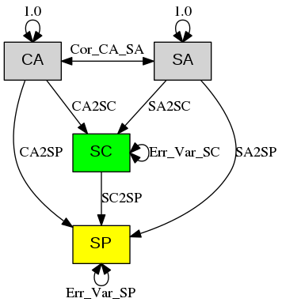
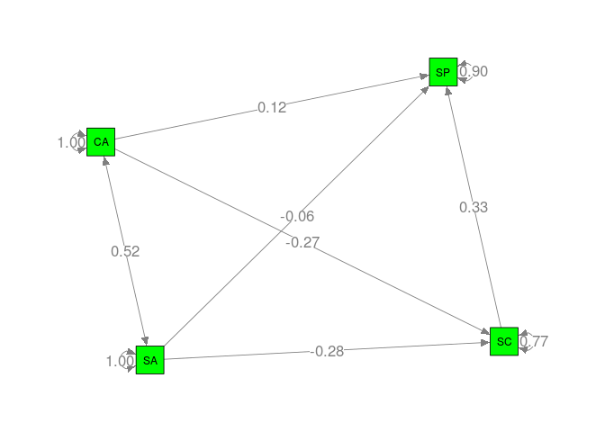
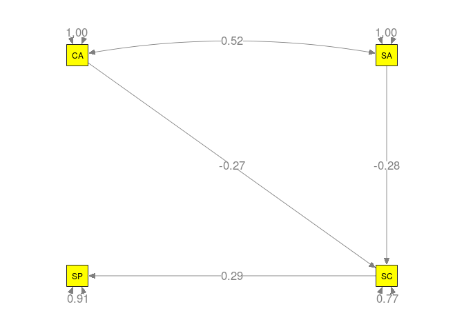

# Special Issue on Meta-analytic Structural Equation Modeling: Introduction from the Guest Editors
Mike W.-L. Cheung and Adam R. Hafdahl  
10 Mar 2016  

# Introduction
*  Becker (2009) tested a mediation model on "Sport Performance" (`SP`). The independent variables were "Cognitive Anxiety" (`CA`) and "Somatic Anxiety" (`SA`) while the mediator was "Self confidence" (`SC`). The following figure displays the model with the labels of the parameters.




* The analysis was conducted in [R](https://www.r-project.org/) with the [metaSEM package](https://courses.nus.edu.sg/course/psycwlm/internet/metasem/). If you have not installed it yet, you may install it by using the following code in R.

```r
## Install the stable version from CRAN
install.packages("metaSEM")
```

* The dataset is stored as an R object `Becker09` in the metaSEM package. The correlation matrices and the sample sizes are stored as `Becker09$data` and `Becker09$n`, respectively. `NA` represents missing value.
* In this illustration, we calculated the sampling variances based on the unweighted means of the correlation matrices.


```r
options(width=100)

## Load the library for data analysis 
library(metaSEM)

## Display the correlation matrices
Becker09$data
```

```
## $`Study 1`
##                 Performance Cognitive Somatic Self confidence
## Performance            1.00     -0.55   -0.48            0.66
## Cognitive             -0.55      1.00    0.47           -0.38
## Somatic               -0.48      0.47    1.00           -0.46
## Self confidence        0.66     -0.38   -0.46            1.00
## 
## $`Study 3`
##                 Performance Cognitive Somatic Self confidence
## Performance            1.00      0.53   -0.12            0.03
## Cognitive              0.53      1.00    0.52           -0.48
## Somatic               -0.12      0.52    1.00           -0.40
## Self confidence        0.03     -0.48   -0.40            1.00
## 
## $`Study 6`
##                 Performance Cognitive Somatic Self confidence
## Performance            1.00      0.44    0.46              NA
## Cognitive              0.44      1.00    0.67              NA
## Somatic                0.46      0.67    1.00              NA
## Self confidence          NA        NA      NA              NA
## 
## $`Study 10`
##                 Performance Cognitive Somatic Self confidence
## Performance            1.00     -0.39   -0.17            0.19
## Cognitive             -0.39      1.00    0.21           -0.54
## Somatic               -0.17      0.21    1.00           -0.43
## Self confidence        0.19     -0.54   -0.43            1.00
## 
## $`Study 17`
##                 Performance Cognitive Somatic Self confidence
## Performance            1.00       0.1    0.31           -0.17
## Cognitive              0.10       1.0      NA              NA
## Somatic                0.31        NA      NA              NA
## Self confidence       -0.17        NA      NA              NA
## 
## $`Study 22`
##                 Performance Cognitive Somatic Self confidence
## Performance            1.00      0.23    0.08            0.51
## Cognitive              0.23      1.00    0.45           -0.29
## Somatic                0.08      0.45    1.00           -0.44
## Self confidence        0.51     -0.29   -0.44            1.00
## 
## $`Study 26`
##                 Performance Cognitive Somatic Self confidence
## Performance            1.00     -0.52   -0.43            0.16
## Cognitive             -0.52      1.00    0.57           -0.18
## Somatic               -0.43      0.57    1.00           -0.26
## Self confidence        0.16     -0.18   -0.26            1.00
## 
## $`Study 28`
##                 Performance Cognitive Somatic Self confidence
## Performance            1.00      0.14    0.02            0.13
## Cognitive              0.14      1.00    0.56           -0.53
## Somatic                0.02      0.56    1.00           -0.27
## Self confidence        0.13     -0.53   -0.27            1.00
## 
## $`Study 36`
##                 Performance Cognitive Somatic Self confidence
## Performance            1.00     -0.01   -0.16            0.42
## Cognitive             -0.01      1.00    0.62           -0.46
## Somatic               -0.16      0.62    1.00           -0.54
## Self confidence        0.42     -0.46   -0.54            1.00
## 
## $`Study 38`
##                 Performance Cognitive Somatic Self confidence
## Performance            1.00     -0.27   -0.13            0.15
## Cognitive             -0.27      1.00    0.63           -0.68
## Somatic               -0.13      0.63    1.00           -0.71
## Self confidence        0.15     -0.68   -0.71            1.00
```

```r
## Display the sample sizes
Becker09$n
```

```
##  [1] 142  37  16  14  45 100  51 128  70  30
```

```r
## Display the numbers of studies present in each cell of the correlation matrix
pattern.na(Becker09$data, show.na = FALSE)
```

```
##                 Performance Cognitive Somatic Self confidence
## Performance              10        10      10               9
## Cognitive                10        10       9               8
## Somatic                  10         9       9               8
## Self confidence           9         8       8               8
```

```r
## Display the cumulative sample size in each cell of the correlation matrix
pattern.n(Becker09$data, Becker09$n)
```

```
##                 Performance Cognitive Somatic Self confidence
## Performance             633       633     633             617
## Cognitive               633       633     588             572
## Somatic                 633       588     588             572
## Self confidence         617       572     572             572
```


# Fixed-effects GLS approach
## Stage 1 analysis


```r
## Construct a column vector y of correlation coefficients
## Extract the correlation coefficients without missing values for each study
y <- lapply(Becker09$data, function(x) {x <- vechs(x)
                                        x[complete.cases(x)]})
y
```

```
## $`Study 1`
## [1] -0.55 -0.48  0.66  0.47 -0.38 -0.46
## 
## $`Study 3`
## [1]  0.53 -0.12  0.03  0.52 -0.48 -0.40
## 
## $`Study 6`
## [1] 0.44 0.46 0.67
## 
## $`Study 10`
## [1] -0.39 -0.17  0.19  0.21 -0.54 -0.43
## 
## $`Study 17`
## [1]  0.10  0.31 -0.17
## 
## $`Study 22`
## [1]  0.23  0.08  0.51  0.45 -0.29 -0.44
## 
## $`Study 26`
## [1] -0.52 -0.43  0.16  0.57 -0.18 -0.26
## 
## $`Study 28`
## [1]  0.14  0.02  0.13  0.56 -0.53 -0.27
## 
## $`Study 36`
## [1] -0.01 -0.16  0.42  0.62 -0.46 -0.54
## 
## $`Study 38`
## [1] -0.27 -0.13  0.15  0.63 -0.68 -0.71
```

```r
## Convert it into a column vector
y <- matrix(unlist(y), ncol=1)
y
```

```
##        [,1]
##  [1,] -0.55
##  [2,] -0.48
##  [3,]  0.66
##  [4,]  0.47
##  [5,] -0.38
##  [6,] -0.46
##  [7,]  0.53
##  [8,] -0.12
##  [9,]  0.03
## [10,]  0.52
## [11,] -0.48
## [12,] -0.40
## [13,]  0.44
## [14,]  0.46
## [15,]  0.67
## [16,] -0.39
## [17,] -0.17
## [18,]  0.19
## [19,]  0.21
## [20,] -0.54
## [21,] -0.43
## [22,]  0.10
## [23,]  0.31
## [24,] -0.17
## [25,]  0.23
## [26,]  0.08
## [27,]  0.51
## [28,]  0.45
## [29,] -0.29
## [30,] -0.44
## [31,] -0.52
## [32,] -0.43
## [33,]  0.16
## [34,]  0.57
## [35,] -0.18
## [36,] -0.26
## [37,]  0.14
## [38,]  0.02
## [39,]  0.13
## [40,]  0.56
## [41,] -0.53
## [42,] -0.27
## [43,] -0.01
## [44,] -0.16
## [45,]  0.42
## [46,]  0.62
## [47,] -0.46
## [48,] -0.54
## [49,] -0.27
## [50,] -0.13
## [51,]  0.15
## [52,]  0.63
## [53,] -0.68
## [54,] -0.71
```

```r
## Create indicators on whether the correlation matrices are missing
X.design <- lapply(Becker09$data, function(x) {ifelse(is.na(vechs(x)), yes = 0, no = 1)})
X.design
```

```
## $`Study 1`
## [1] 1 1 1 1 1 1
## 
## $`Study 3`
## [1] 1 1 1 1 1 1
## 
## $`Study 6`
## [1] 1 1 0 1 0 0
## 
## $`Study 10`
## [1] 1 1 1 1 1 1
## 
## $`Study 17`
## [1] 1 1 1 0 0 0
## 
## $`Study 22`
## [1] 1 1 1 1 1 1
## 
## $`Study 26`
## [1] 1 1 1 1 1 1
## 
## $`Study 28`
## [1] 1 1 1 1 1 1
## 
## $`Study 36`
## [1] 1 1 1 1 1 1
## 
## $`Study 38`
## [1] 1 1 1 1 1 1
```

```r
## Create the design matrices
X.design <- lapply(X.design, function(x) create.Fmatrix(x, as.mxMatrix = FALSE))
X.design
```

```
## $`Study 1`
##      [,1] [,2] [,3] [,4] [,5] [,6]
## [1,]    1    0    0    0    0    0
## [2,]    0    1    0    0    0    0
## [3,]    0    0    1    0    0    0
## [4,]    0    0    0    1    0    0
## [5,]    0    0    0    0    1    0
## [6,]    0    0    0    0    0    1
## 
## $`Study 3`
##      [,1] [,2] [,3] [,4] [,5] [,6]
## [1,]    1    0    0    0    0    0
## [2,]    0    1    0    0    0    0
## [3,]    0    0    1    0    0    0
## [4,]    0    0    0    1    0    0
## [5,]    0    0    0    0    1    0
## [6,]    0    0    0    0    0    1
## 
## $`Study 6`
##      [,1] [,2] [,3] [,4] [,5] [,6]
## [1,]    1    0    0    0    0    0
## [2,]    0    1    0    0    0    0
## [3,]    0    0    0    1    0    0
## 
## $`Study 10`
##      [,1] [,2] [,3] [,4] [,5] [,6]
## [1,]    1    0    0    0    0    0
## [2,]    0    1    0    0    0    0
## [3,]    0    0    1    0    0    0
## [4,]    0    0    0    1    0    0
## [5,]    0    0    0    0    1    0
## [6,]    0    0    0    0    0    1
## 
## $`Study 17`
##      [,1] [,2] [,3] [,4] [,5] [,6]
## [1,]    1    0    0    0    0    0
## [2,]    0    1    0    0    0    0
## [3,]    0    0    1    0    0    0
## 
## $`Study 22`
##      [,1] [,2] [,3] [,4] [,5] [,6]
## [1,]    1    0    0    0    0    0
## [2,]    0    1    0    0    0    0
## [3,]    0    0    1    0    0    0
## [4,]    0    0    0    1    0    0
## [5,]    0    0    0    0    1    0
## [6,]    0    0    0    0    0    1
## 
## $`Study 26`
##      [,1] [,2] [,3] [,4] [,5] [,6]
## [1,]    1    0    0    0    0    0
## [2,]    0    1    0    0    0    0
## [3,]    0    0    1    0    0    0
## [4,]    0    0    0    1    0    0
## [5,]    0    0    0    0    1    0
## [6,]    0    0    0    0    0    1
## 
## $`Study 28`
##      [,1] [,2] [,3] [,4] [,5] [,6]
## [1,]    1    0    0    0    0    0
## [2,]    0    1    0    0    0    0
## [3,]    0    0    1    0    0    0
## [4,]    0    0    0    1    0    0
## [5,]    0    0    0    0    1    0
## [6,]    0    0    0    0    0    1
## 
## $`Study 36`
##      [,1] [,2] [,3] [,4] [,5] [,6]
## [1,]    1    0    0    0    0    0
## [2,]    0    1    0    0    0    0
## [3,]    0    0    1    0    0    0
## [4,]    0    0    0    1    0    0
## [5,]    0    0    0    0    1    0
## [6,]    0    0    0    0    0    1
## 
## $`Study 38`
##      [,1] [,2] [,3] [,4] [,5] [,6]
## [1,]    1    0    0    0    0    0
## [2,]    0    1    0    0    0    0
## [3,]    0    0    1    0    0    0
## [4,]    0    0    0    1    0    0
## [5,]    0    0    0    0    1    0
## [6,]    0    0    0    0    0    1
```

```r
## Combine into a matrix
X <- do.call(rbind, X.design)
X
```

```
##       [,1] [,2] [,3] [,4] [,5] [,6]
##  [1,]    1    0    0    0    0    0
##  [2,]    0    1    0    0    0    0
##  [3,]    0    0    1    0    0    0
##  [4,]    0    0    0    1    0    0
##  [5,]    0    0    0    0    1    0
##  [6,]    0    0    0    0    0    1
##  [7,]    1    0    0    0    0    0
##  [8,]    0    1    0    0    0    0
##  [9,]    0    0    1    0    0    0
## [10,]    0    0    0    1    0    0
## [11,]    0    0    0    0    1    0
## [12,]    0    0    0    0    0    1
## [13,]    1    0    0    0    0    0
## [14,]    0    1    0    0    0    0
## [15,]    0    0    0    1    0    0
## [16,]    1    0    0    0    0    0
## [17,]    0    1    0    0    0    0
## [18,]    0    0    1    0    0    0
## [19,]    0    0    0    1    0    0
## [20,]    0    0    0    0    1    0
## [21,]    0    0    0    0    0    1
## [22,]    1    0    0    0    0    0
## [23,]    0    1    0    0    0    0
## [24,]    0    0    1    0    0    0
## [25,]    1    0    0    0    0    0
## [26,]    0    1    0    0    0    0
## [27,]    0    0    1    0    0    0
## [28,]    0    0    0    1    0    0
## [29,]    0    0    0    0    1    0
## [30,]    0    0    0    0    0    1
## [31,]    1    0    0    0    0    0
## [32,]    0    1    0    0    0    0
## [33,]    0    0    1    0    0    0
## [34,]    0    0    0    1    0    0
## [35,]    0    0    0    0    1    0
## [36,]    0    0    0    0    0    1
## [37,]    1    0    0    0    0    0
## [38,]    0    1    0    0    0    0
## [39,]    0    0    1    0    0    0
## [40,]    0    0    0    1    0    0
## [41,]    0    0    0    0    1    0
## [42,]    0    0    0    0    0    1
## [43,]    1    0    0    0    0    0
## [44,]    0    1    0    0    0    0
## [45,]    0    0    1    0    0    0
## [46,]    0    0    0    1    0    0
## [47,]    0    0    0    0    1    0
## [48,]    0    0    0    0    0    1
## [49,]    1    0    0    0    0    0
## [50,]    0    1    0    0    0    0
## [51,]    0    0    1    0    0    0
## [52,]    0    0    0    1    0    0
## [53,]    0    0    0    0    1    0
## [54,]    0    0    0    0    0    1
```

```r
## Sampling variance covariance matrix based on the unweighted mean of correlations
V <- asyCov(Becker09$data, Becker09$n, acov="unweighted", as.matrix = FALSE)

## Function to remove missing values in V: x*v*x'
filter <- function(x,v) { x %*% v %*% t(x) }

## Extract known sampling covariance matrices without the missing values
V <- mapply(filter, X.design, V)

## Convert it into a diagonal matrix
V <- bdiagMat(V)

## Only show part of V as it is too big
V[1:8, 1:8]
```

```
##               [,1]          [,2]          [,3]          [,4]          [,5]          [,6]       [,7]
## [1,]  0.0070295194  3.655404e-03 -2.928601e-03 -2.772428e-04  0.0012723260  5.996385e-04 0.00000000
## [2,]  0.0036554036  6.988179e-03 -2.874994e-03 -7.042039e-05  0.0005249307  1.236102e-03 0.00000000
## [3,] -0.0029286008 -2.874994e-03  6.310025e-03 -1.493057e-05  0.0001114126 -6.138744e-05 0.00000000
## [4,] -0.0002772428 -7.042039e-05 -1.493057e-05  3.724904e-03 -0.0013662800 -1.392960e-03 0.00000000
## [5,]  0.0012723260  5.249307e-04  1.114126e-04 -1.366280e-03  0.0045543712  2.017801e-03 0.00000000
## [6,]  0.0005996385  1.236102e-03 -6.138744e-05 -1.392960e-03  0.0020178005  4.591872e-03 0.00000000
## [7,]  0.0000000000  0.000000e+00  0.000000e+00  0.000000e+00  0.0000000000  0.000000e+00 0.02697809
## [8,]  0.0000000000  0.000000e+00  0.000000e+00  0.000000e+00  0.0000000000  0.000000e+00 0.01402873
##            [,8]
## [1,] 0.00000000
## [2,] 0.00000000
## [3,] 0.00000000
## [4,] 0.00000000
## [5,] 0.00000000
## [6,] 0.00000000
## [7,] 0.01402873
## [8,] 0.02681930
```

```r
## Textbook formula; it may not be numerically stable
## Common correlation matrix under the fixed-effects model
r.fixed <- solve( t(X)%*%solve(V)%*%X ) %*% t(X) %*% solve(V) %*% y
r.fixed
```

```
##             [,1]
## [1,] -0.07395104
## [2,] -0.12660487
## [3,]  0.31552522
## [4,]  0.52371725
## [5,] -0.41663718
## [6,] -0.40948168
```

```r
## Sampling covariance matrix of r.fixed
V.fixed <- solve( t(X)%*%solve(V)%*%X )
V.fixed
```

```
##               [,1]          [,2]          [,3]          [,4]          [,5]          [,6]
## [1,]  1.576927e-03  8.200114e-04 -6.569663e-04 -6.220142e-05  2.854222e-04  1.345159e-04
## [2,]  8.200114e-04  1.567644e-03 -6.449364e-04 -1.580473e-05  1.177631e-04  2.772961e-04
## [3,] -6.569663e-04 -6.449364e-04  1.443012e-03 -3.299198e-06  2.826988e-05 -1.149996e-05
## [4,] -6.220142e-05 -1.580473e-05 -3.299198e-06  8.993023e-04 -3.288098e-04 -3.360438e-04
## [5,]  2.854222e-04  1.177631e-04  2.826988e-05 -3.288098e-04  1.120494e-03  4.946163e-04
## [6,]  1.345159e-04  2.772961e-04 -1.149996e-05 -3.360438e-04  4.946163e-04  1.130509e-03
```

```r
## Q statistic in testing the homogeneity of correlation matrices
Q.fixed <- t(y) %*% (solve(V)-solve(V)%*% X %*%solve(t(X)%*%solve(V)%*%X) %*% t(X) %*%solve(V)) %*% y
Q.fixed
```

```
##          [,1]
## [1,] 190.2517
```

```r
## df for the Q statistic
Q.df <- sum(vechs(pattern.na(Becker09$data, show.na = FALSE))) - 6
Q.df
```

```
## [1] 48
```

```r
## p value of the Q statistic
pchisq(Q.fixed, df=Q.df, lower.tail=FALSE)
```

```
##              [,1]
## [1,] 7.836051e-19
```

## Stage 2 analysis
* The models were specified in the [RAM formulation](http://openmx.psyc.virginia.edu/docs/OpenMx/latest/Examples_Matrix.html) and analyzed with the `wls()` function.

```r
## A matrix for regression coefficients
A1 <- create.mxMatrix(c(0, "0.1*CA2SP", "0.1*SA2SP", "0.1*SC2SP",
                        0, 0, 0, 0,
                        0, 0, 0, 0,
                        0, "0.1*CA2SC", "0.1*SA2SC",0),
                      type="Full", byrow=TRUE, ncol=4, nrow=4,
                      as.mxMatrix=FALSE)

## Variable names
var.names <- c("Performance","Cognitive","Somatic","Self confidence")

## This step is not necessary but it is useful for inspecting the model.
dimnames(A1) <- list(var.names, var.names)
A1
```

```
##                 Performance Cognitive   Somatic     Self confidence
## Performance     "0"         "0.1*CA2SP" "0.1*SA2SP" "0.1*SC2SP"    
## Cognitive       "0"         "0"         "0"         "0"            
## Somatic         "0"         "0"         "0"         "0"            
## Self confidence "0"         "0.1*CA2SC" "0.1*SA2SC" "0"
```

```r
## S matrix for variance and covariance matrix
## Since the correlation matrix is used, the variances of the predictors are fixed at 1.0.
S1 <- create.mxMatrix(c("0.1*Err_Var_SP",
                        0, 1,
                        0, "0.1*Cor_CA_SA", 1,
                        0, 0, 0, "0.1*Err_Var_SC"), byrow=TRUE, type="Symm",
                      as.mxMatrix=FALSE)

## This step is not necessary but it is useful for inspecting the model.
dimnames(S1) <- list(var.names, var.names)
S1
```

```
##                 Performance      Cognitive       Somatic         Self confidence 
## Performance     "0.1*Err_Var_SP" "0"             "0"             "0"             
## Cognitive       "0"              "1"             "0.1*Cor_CA_SA" "0"             
## Somatic         "0"              "0.1*Cor_CA_SA" "1"             "0"             
## Self confidence "0"              "0"             "0"             "0.1*Err_Var_SC"
```

```r
## Total sample size
n.total <- sum(Becker09$n)

## Convert r vector to a matrix
R.fixed <- vec2symMat(r.fixed, diag = FALSE)
R.fixed
```

```
##             [,1]        [,2]       [,3]       [,4]
## [1,]  1.00000000 -0.07395104 -0.1266049  0.3155252
## [2,] -0.07395104  1.00000000  0.5237173 -0.4166372
## [3,] -0.12660487  0.52371725  1.0000000 -0.4094817
## [4,]  0.31552522 -0.41663718 -0.4094817  1.0000000
```

```r
gls.fixed2 <- wls(Cov=R.fixed, asyCov=V.fixed, n=n.total, Amatrix=A1, Smatrix=S1, 
                  model.name="Fixed effects GLS 2nd stage with direct effects")
summary(gls.fixed2)
```

```
## 
## Call:
## wls(Cov = R.fixed, asyCov = V.fixed, n = n.total, Amatrix = A1, 
##     Smatrix = S1, model.name = "Fixed effects GLS 2nd stage with direct effects")
## 
## 95% confidence intervals: z statistic approximation
## Coefficients:
##             Estimate  Std.Error     lbound     ubound z value  Pr(>|z|)    
## CA2SP      0.0833672  0.0470697 -0.0088878  0.1756221  1.7711   0.07654 .  
## SA2SP     -0.0322482  0.0467174 -0.1238128  0.0593163 -0.6903   0.49002    
## SC2SP      0.3370540  0.0422678  0.2542106  0.4198974  7.9743 1.554e-15 ***
## CA2SC     -0.2785985  0.0410844 -0.3591224 -0.1980746 -6.7811 1.192e-11 ***
## SA2SC     -0.2635748  0.0411418 -0.3442114 -0.1829383 -6.4065 1.489e-10 ***
## Cor_CA_SA  0.5237173  0.0299884  0.4649411  0.5824934 17.4640 < 2.2e-16 ***
## ---
## Signif. codes:  0 '***' 0.001 '**' 0.01 '*' 0.05 '.' 0.1 ' ' 1
## 
## Goodness-of-fit indices:
##                                             Value
## Sample size                                633.00
## Chi-square of target model                   0.00
## DF of target model                           0.00
## p value of target model                      0.00
## Number of constraints imposed on "Smatrix"   0.00
## DF manually adjusted                         0.00
## Chi-square of independence model           470.88
## DF of independence model                     6.00
## RMSEA                                        0.00
## RMSEA lower 95% CI                           0.00
## RMSEA upper 95% CI                           0.00
## SRMR                                         0.00
## TLI                                          -Inf
## CFI                                          1.00
## AIC                                          0.00
## BIC                                          0.00
## OpenMx status1: 0 ("0" or "1": The optimization is considered fine.
## Other values indicate problems.)
```

* We also illustrated how to fit a model without the direct effects from `CA` and `SA` to `SP`. We created a new matrix `A2` to represent the regression coefficients. The matrix `S1` was the same as the one we used before.

```r
## A matrix for regression coefficients with the direct effects
A2 <- create.mxMatrix(c(0, 0, 0, "0.1*SC2SP",
                        0, 0, 0, 0,
                        0, 0, 0, 0,
                        0, "0.1*CA2SC", "0.1*SA2SC",0),
                      type="Full", byrow=TRUE, ncol=4, nrow=4,
                      as.mxMatrix=FALSE)

## This step is not necessary but it is useful for inspecting the model.
dimnames(A2) <- list(var.names, var.names)
A2
```

```
##                 Performance Cognitive   Somatic     Self confidence
## Performance     "0"         "0"         "0"         "0.1*SC2SP"    
## Cognitive       "0"         "0"         "0"         "0"            
## Somatic         "0"         "0"         "0"         "0"            
## Self confidence "0"         "0.1*CA2SC" "0.1*SA2SC" "0"
```

```r
gls.fixed3 <- wls(Cov=R.fixed, asyCov=V.fixed, n=n.total, Amatrix=A2, Smatrix=S1, 
                  model.name="Fixed effects GLS 2nd stage without direct effect)")
summary(gls.fixed3)
```

```
## 
## Call:
## wls(Cov = R.fixed, asyCov = V.fixed, n = n.total, Amatrix = A2, 
##     Smatrix = S1, model.name = "Fixed effects GLS 2nd stage without direct effect)")
## 
## 95% confidence intervals: z statistic approximation
## Coefficients:
##            Estimate Std.Error    lbound    ubound z value  Pr(>|z|)    
## SC2SP      0.318358  0.038073  0.243737  0.392979  8.3618 < 2.2e-16 ***
## CA2SC     -0.274675  0.041123 -0.355274 -0.194077 -6.6794 2.399e-11 ***
## SA2SC     -0.266004  0.041079 -0.346517 -0.185491 -6.4755 9.451e-11 ***
## Cor_CA_SA  0.523265  0.029881  0.464700  0.581830 17.5118 < 2.2e-16 ***
## ---
## Signif. codes:  0 '***' 0.001 '**' 0.01 '*' 0.05 '.' 0.1 ' ' 1
## 
## Goodness-of-fit indices:
##                                               Value
## Sample size                                633.0000
## Chi-square of target model                   3.1833
## DF of target model                           2.0000
## p value of target model                      0.2036
## Number of constraints imposed on "Smatrix"   0.0000
## DF manually adjusted                         0.0000
## Chi-square of independence model           470.8811
## DF of independence model                     6.0000
## RMSEA                                        0.0306
## RMSEA lower 95% CI                           0.0000
## RMSEA upper 95% CI                           0.0905
## SRMR                                         0.0237
## TLI                                          0.9924
## CFI                                          0.9975
## AIC                                         -0.8167
## BIC                                         -9.7177
## OpenMx status1: 0 ("0" or "1": The optimization is considered fine.
## Other values indicate problems.)
```


# Random-effects GLS approach
## Stage 1 analysis
* Following Becker (2009), we only estimated the diagonals of the random effects. For completeness, we repeated the process by reading the data.


```r
## Extract the correlation coefficients without missing values
y <- lapply(Becker09$data, function(x) {x <- vechs(x); x[complete.cases(x)]})

## Convert it into a column vector
y <- matrix(unlist(y), ncol=1)
y
```

```
##        [,1]
##  [1,] -0.55
##  [2,] -0.48
##  [3,]  0.66
##  [4,]  0.47
##  [5,] -0.38
##  [6,] -0.46
##  [7,]  0.53
##  [8,] -0.12
##  [9,]  0.03
## [10,]  0.52
## [11,] -0.48
## [12,] -0.40
## [13,]  0.44
## [14,]  0.46
## [15,]  0.67
## [16,] -0.39
## [17,] -0.17
## [18,]  0.19
## [19,]  0.21
## [20,] -0.54
## [21,] -0.43
## [22,]  0.10
## [23,]  0.31
## [24,] -0.17
## [25,]  0.23
## [26,]  0.08
## [27,]  0.51
## [28,]  0.45
## [29,] -0.29
## [30,] -0.44
## [31,] -0.52
## [32,] -0.43
## [33,]  0.16
## [34,]  0.57
## [35,] -0.18
## [36,] -0.26
## [37,]  0.14
## [38,]  0.02
## [39,]  0.13
## [40,]  0.56
## [41,] -0.53
## [42,] -0.27
## [43,] -0.01
## [44,] -0.16
## [45,]  0.42
## [46,]  0.62
## [47,] -0.46
## [48,] -0.54
## [49,] -0.27
## [50,] -0.13
## [51,]  0.15
## [52,]  0.63
## [53,] -0.68
## [54,] -0.71
```

```r
## Extract whether the correlation matrices are missing
X.design <- lapply(Becker09$data, function(x) {ifelse(is.na(vechs(x)), yes = 0, no = 1)})

## Create the design matrices
X.design <- lapply(X.design, function(x) create.Fmatrix(x, as.mxMatrix = FALSE))

## Combine into a matrix
X <- do.call(rbind, X.design)
X
```

```
##       [,1] [,2] [,3] [,4] [,5] [,6]
##  [1,]    1    0    0    0    0    0
##  [2,]    0    1    0    0    0    0
##  [3,]    0    0    1    0    0    0
##  [4,]    0    0    0    1    0    0
##  [5,]    0    0    0    0    1    0
##  [6,]    0    0    0    0    0    1
##  [7,]    1    0    0    0    0    0
##  [8,]    0    1    0    0    0    0
##  [9,]    0    0    1    0    0    0
## [10,]    0    0    0    1    0    0
## [11,]    0    0    0    0    1    0
## [12,]    0    0    0    0    0    1
## [13,]    1    0    0    0    0    0
## [14,]    0    1    0    0    0    0
## [15,]    0    0    0    1    0    0
## [16,]    1    0    0    0    0    0
## [17,]    0    1    0    0    0    0
## [18,]    0    0    1    0    0    0
## [19,]    0    0    0    1    0    0
## [20,]    0    0    0    0    1    0
## [21,]    0    0    0    0    0    1
## [22,]    1    0    0    0    0    0
## [23,]    0    1    0    0    0    0
## [24,]    0    0    1    0    0    0
## [25,]    1    0    0    0    0    0
## [26,]    0    1    0    0    0    0
## [27,]    0    0    1    0    0    0
## [28,]    0    0    0    1    0    0
## [29,]    0    0    0    0    1    0
## [30,]    0    0    0    0    0    1
## [31,]    1    0    0    0    0    0
## [32,]    0    1    0    0    0    0
## [33,]    0    0    1    0    0    0
## [34,]    0    0    0    1    0    0
## [35,]    0    0    0    0    1    0
## [36,]    0    0    0    0    0    1
## [37,]    1    0    0    0    0    0
## [38,]    0    1    0    0    0    0
## [39,]    0    0    1    0    0    0
## [40,]    0    0    0    1    0    0
## [41,]    0    0    0    0    1    0
## [42,]    0    0    0    0    0    1
## [43,]    1    0    0    0    0    0
## [44,]    0    1    0    0    0    0
## [45,]    0    0    1    0    0    0
## [46,]    0    0    0    1    0    0
## [47,]    0    0    0    0    1    0
## [48,]    0    0    0    0    0    1
## [49,]    1    0    0    0    0    0
## [50,]    0    1    0    0    0    0
## [51,]    0    0    1    0    0    0
## [52,]    0    0    0    1    0    0
## [53,]    0    0    0    0    1    0
## [54,]    0    0    0    0    0    1
```

* We estimated the heterogeneity variance $\tau^2$ `Tau2` on each correlation coefficient with the maximum likelihood (ML) estimation method.

```r
## Stack the correlation coefficients
y.vec <- t(sapply(Becker09$data, function(x) vechs(x)))
y.vec
```

```
##           [,1]  [,2]  [,3] [,4]  [,5]  [,6]
## Study 1  -0.55 -0.48  0.66 0.47 -0.38 -0.46
## Study 3   0.53 -0.12  0.03 0.52 -0.48 -0.40
## Study 6   0.44  0.46    NA 0.67    NA    NA
## Study 10 -0.39 -0.17  0.19 0.21 -0.54 -0.43
## Study 17  0.10  0.31 -0.17   NA    NA    NA
## Study 22  0.23  0.08  0.51 0.45 -0.29 -0.44
## Study 26 -0.52 -0.43  0.16 0.57 -0.18 -0.26
## Study 28  0.14  0.02  0.13 0.56 -0.53 -0.27
## Study 36 -0.01 -0.16  0.42 0.62 -0.46 -0.54
## Study 38 -0.27 -0.13  0.15 0.63 -0.68 -0.71
```

```r
## Extract the data by effect sizes (by column)
y.vec <- lapply(1:6, function(x) y.vec[, x] )
y.vec
```

```
## [[1]]
##  Study 1  Study 3  Study 6 Study 10 Study 17 Study 22 Study 26 Study 28 Study 36 Study 38 
##    -0.55     0.53     0.44    -0.39     0.10     0.23    -0.52     0.14    -0.01    -0.27 
## 
## [[2]]
##  Study 1  Study 3  Study 6 Study 10 Study 17 Study 22 Study 26 Study 28 Study 36 Study 38 
##    -0.48    -0.12     0.46    -0.17     0.31     0.08    -0.43     0.02    -0.16    -0.13 
## 
## [[3]]
##  Study 1  Study 3  Study 6 Study 10 Study 17 Study 22 Study 26 Study 28 Study 36 Study 38 
##     0.66     0.03       NA     0.19    -0.17     0.51     0.16     0.13     0.42     0.15 
## 
## [[4]]
##  Study 1  Study 3  Study 6 Study 10 Study 17 Study 22 Study 26 Study 28 Study 36 Study 38 
##     0.47     0.52     0.67     0.21       NA     0.45     0.57     0.56     0.62     0.63 
## 
## [[5]]
##  Study 1  Study 3  Study 6 Study 10 Study 17 Study 22 Study 26 Study 28 Study 36 Study 38 
##    -0.38    -0.48       NA    -0.54       NA    -0.29    -0.18    -0.53    -0.46    -0.68 
## 
## [[6]]
##  Study 1  Study 3  Study 6 Study 10 Study 17 Study 22 Study 26 Study 28 Study 36 Study 38 
##    -0.46    -0.40       NA    -0.43       NA    -0.44    -0.26    -0.27    -0.54    -0.71
```

```r
## Function to estimate the tau^2 with ML estimation method
est.tau2 <- function(x, n) {
  ## remove missing values in x
  y <- x[!is.na(x)]
  ## unweighted mean of the correlation coefficients
  r <- mean(x, na.rm = TRUE)
  ## sampling variances based on the unweighted mean
  v <- (1-r^2)^2/n[!is.na(x)]
  ## meta-analysis with ML estimation
  out <- meta(y, v)
  ## extract the tau2
  coef(out, select = "random")
}

## Digaonal matrix of random effects (tau2)
Tau2 <- diag(sapply(y.vec, est.tau2, n=Becker09$n))
Tau2
```

```
##           [,1]       [,2]       [,3]  [,4]        [,5]        [,6]
## [1,] 0.1071188 0.00000000 0.00000000 0e+00 0.000000000 0.000000000
## [2,] 0.0000000 0.05104107 0.00000000 0e+00 0.000000000 0.000000000
## [3,] 0.0000000 0.00000000 0.05023368 0e+00 0.000000000 0.000000000
## [4,] 0.0000000 0.00000000 0.00000000 1e-10 0.000000000 0.000000000
## [5,] 0.0000000 0.00000000 0.00000000 0e+00 0.006437978 0.000000000
## [6,] 0.0000000 0.00000000 0.00000000 0e+00 0.000000000 0.004854097
```

```r
## Sampling variance covariance matrix based on the unweighted mean of correlations
V <- asyCov(Becker09$data, Becker09$n, acov="unweighted", as.matrix = FALSE)

## Function to filter the elements with missing data and add Tau2
filter <- function(x,v) { x %*% (v+Tau2) %*% t(x) }

## New V = old V + Tau2
V <- mapply(filter, X.design, V)

## Convert it into a diagonal matrix
V <- bdiagMat(V)

## Show part of V
V[1:8, 1:8]
```

```
##               [,1]          [,2]          [,3]          [,4]          [,5]          [,6]       [,7]
## [1,]  0.1141482903  3.655323e-03 -2.928532e-03 -2.772846e-04  0.0012723384  5.996186e-04 0.00000000
## [2,]  0.0036553230  5.802912e-02 -2.874871e-03 -7.043949e-05  0.0005249483  1.236096e-03 0.00000000
## [3,] -0.0029285315 -2.874871e-03  5.654362e-02 -1.491765e-05  0.0001114272 -6.134296e-05 0.00000000
## [4,] -0.0002772846 -7.043949e-05 -1.491765e-05  3.724900e-03 -0.0013662920 -1.392954e-03 0.00000000
## [5,]  0.0012723384  5.249483e-04  1.114272e-04 -1.366292e-03  0.0109923589  2.017799e-03 0.00000000
## [6,]  0.0005996186  1.236096e-03 -6.134296e-05 -1.392954e-03  0.0020177986  9.445951e-03 0.00000000
## [7,]  0.0000000000  0.000000e+00  0.000000e+00  0.000000e+00  0.0000000000  0.000000e+00 0.13409714
## [8,]  0.0000000000  0.000000e+00  0.000000e+00  0.000000e+00  0.0000000000  0.000000e+00 0.01402886
##            [,8]
## [1,] 0.00000000
## [2,] 0.00000000
## [3,] 0.00000000
## [4,] 0.00000000
## [5,] 0.00000000
## [6,] 0.00000000
## [7,] 0.01402886
## [8,] 0.07786043
```

```r
## Average correlation matrix under the random-effects model
r.random <- solve(t(X)%*%solve(V)%*%X) %*% t(X) %*% solve(V) %*% y
r.random
```

```
##             [,1]
## [1,] -0.04568625
## [2,] -0.08799689
## [3,]  0.24632203
## [4,]  0.52319907
## [5,] -0.41734430
## [6,] -0.41817192
```

```r
## Sampling covariance matrix of r.random
V.random <- solve(t(X)%*%solve(V)%*%X)
V.random
```

```
##               [,1]          [,2]          [,3]          [,4]          [,5]          [,6]
## [1,]  0.0130600959  1.088249e-03 -8.005977e-04 -6.019450e-05  2.976364e-04  1.295588e-04
## [2,]  0.0010882493  7.320099e-03 -7.726332e-04 -1.532561e-05  1.145478e-04  2.830102e-04
## [3,] -0.0008005977 -7.726332e-04  7.558044e-03 -3.083018e-06  3.246097e-05 -1.120926e-05
## [4,] -0.0000601945 -1.532561e-05 -3.083018e-06  8.995231e-04 -3.297834e-04 -3.362906e-04
## [5,]  0.0002976364  1.145478e-04  3.246097e-05 -3.297834e-04  2.116757e-03  5.178743e-04
## [6,]  0.0001295588  2.830102e-04 -1.120926e-05 -3.362906e-04  5.178743e-04  1.895874e-03
```

## Stage 2 analysis
* We fitted the model with the direct effects from `CA` and `SA` to `SP`.

```r
## Total sample size
n.total <- sum(Becker09$n)

## Convert r vector to a matrix
R.random <- vec2symMat(r.random, diag = FALSE)
R.random
```

```
##             [,1]        [,2]        [,3]       [,4]
## [1,]  1.00000000 -0.04568625 -0.08799689  0.2463220
## [2,] -0.04568625  1.00000000  0.52319907 -0.4173443
## [3,] -0.08799689  0.52319907  1.00000000 -0.4181719
## [4,]  0.24632203 -0.41734430 -0.41817192  1.0000000
```

```r
gls.random2 <- wls(Cov=R.random, asyCov=V.random, n=n.total, Amatrix=A1, Smatrix=S1, 
                   model.name="Random effects GLS 2nd stage with direct effects")

summary(gls.random2)
```

```
## 
## Call:
## wls(Cov = R.random, asyCov = V.random, n = n.total, Amatrix = A1, 
##     Smatrix = S1, model.name = "Random effects GLS 2nd stage with direct effects")
## 
## 95% confidence intervals: z statistic approximation
## Coefficients:
##            Estimate Std.Error    lbound    ubound z value  Pr(>|z|)    
## CA2SP      0.074833  0.172390 -0.263046  0.412712  0.4341   0.66422    
## SA2SP     -0.013434  0.139664 -0.287169  0.260302 -0.0962   0.92337    
## SC2SP      0.271936  0.118866  0.038962  0.504910  2.2877   0.02215 *  
## CA2SC     -0.273396  0.062629 -0.396146 -0.150646 -4.3653 1.269e-05 ***
## SA2SC     -0.275132  0.060114 -0.392953 -0.157310 -4.5768 4.721e-06 ***
## Cor_CA_SA  0.523199  0.029992  0.464416  0.581982 17.4446 < 2.2e-16 ***
## ---
## Signif. codes:  0 '***' 0.001 '**' 0.01 '*' 0.05 '.' 0.1 ' ' 1
## 
## Goodness-of-fit indices:
##                                             Value
## Sample size                                633.00
## Chi-square of target model                   0.00
## DF of target model                           0.00
## p value of target model                      0.00
## Number of constraints imposed on "Smatrix"   0.00
## DF manually adjusted                         0.00
## Chi-square of independence model           357.03
## DF of independence model                     6.00
## RMSEA                                        0.00
## RMSEA lower 95% CI                           0.00
## RMSEA upper 95% CI                           0.00
## SRMR                                         0.00
## TLI                                          -Inf
## CFI                                          1.00
## AIC                                          0.00
## BIC                                          0.00
## OpenMx status1: 0 ("0" or "1": The optimization is considered fine.
## Other values indicate problems.)
```

* We fitted the model without the direct effects from `CA` and `SA` to `SP`.

```r
gls.random3 <- wls(Cov=R.random, asyCov=V.fixed, n=n.total, Amatrix=A2, Smatrix=S1, 
                   model.name="Random effects GLS 2nd stage without direct effect")
summary(gls.random3)
```

```
## 
## Call:
## wls(Cov = R.random, asyCov = V.fixed, n = n.total, Amatrix = A2, 
##     Smatrix = S1, model.name = "Random effects GLS 2nd stage without direct effect")
## 
## 95% confidence intervals: z statistic approximation
## Coefficients:
##            Estimate Std.Error    lbound    ubound z value  Pr(>|z|)    
## SC2SP      0.249089  0.038075  0.174462  0.323715  6.5420 6.071e-11 ***
## CA2SC     -0.274370  0.041121 -0.354965 -0.193775 -6.6723 2.518e-11 ***
## SA2SC     -0.275133  0.041126 -0.355738 -0.194528 -6.6900 2.231e-11 ***
## Cor_CA_SA  0.522822  0.029932  0.464157  0.581488 17.4671 < 2.2e-16 ***
## ---
## Signif. codes:  0 '***' 0.001 '**' 0.01 '*' 0.05 '.' 0.1 ' ' 1
## 
## Goodness-of-fit indices:
##                                               Value
## Sample size                                633.0000
## Chi-square of target model                   2.7864
## DF of target model                           2.0000
## p value of target model                      0.2483
## Number of constraints imposed on "Smatrix"   0.0000
## DF manually adjusted                         0.0000
## Chi-square of independence model           445.3699
## DF of independence model                     6.0000
## RMSEA                                        0.0249
## RMSEA lower 95% CI                           0.0000
## RMSEA upper 95% CI                           0.0869
## SRMR                                         0.0248
## TLI                                          0.9946
## CFI                                          0.9982
## AIC                                         -1.2136
## BIC                                        -10.1145
## OpenMx status1: 0 ("0" or "1": The optimization is considered fine.
## Other values indicate problems.)
```

# Fixed-effects TSSEM approach
## Stage 1 analysis
* Since the fixed-effects TSSEM uses a multiple-group structural equation modeling approach, it does not need to estimate the sampling covariance matrix of the correlation coefficients.


```r
tssem.fixed1 <- tssem1(Becker09$data, Becker09$n, method="FEM", 
                       model.name="Fixed effects TSSEM 1st stage")
summary(tssem.fixed1)
```

```
## 
## Call:
## tssem1FEM(my.df = my.df, n = n, cor.analysis = cor.analysis, 
##     model.name = model.name, cluster = cluster, suppressWarnings = suppressWarnings, 
##     silent = silent, run = run)
## 
## Coefficients:
##         Estimate Std.Error  z value  Pr(>|z|)    
## S[1,2] -0.067649  0.041996  -1.6109 0.1072107    
## S[1,3] -0.157168  0.040966  -3.8365 0.0001248 ***
## S[1,4]  0.369860  0.037133   9.9605 < 2.2e-16 ***
## S[2,3]  0.526319  0.029981  17.5551 < 2.2e-16 ***
## S[2,4] -0.413867  0.034900 -11.8588 < 2.2e-16 ***
## S[3,4] -0.416681  0.034772 -11.9832 < 2.2e-16 ***
## ---
## Signif. codes:  0 '***' 0.001 '**' 0.01 '*' 0.05 '.' 0.1 ' ' 1
## 
## Goodness-of-fit indices:
##                                     Value
## Sample size                      633.0000
## Chi-square of target model       212.2591
## DF of target model                46.0000
## p value of target model            0.0000
## Chi-square of independence model 638.4062
## DF of independence model          52.0000
## RMSEA                              0.2391
## RMSEA lower 95% CI                 0.2086
## RMSEA upper 95% CI                 0.2741
## SRMR                               0.2048
## TLI                                0.6795
## CFI                                0.7165
## AIC                              120.2591
## BIC                              -84.4626
## OpenMx status1: 0 ("0" or "1": The optimization is considered fine.
## Other values may indicate problems.)
```

```r
## Estimated common correlation matrix
coef(tssem.fixed1)
```

```
##                 Performance  Cognitive    Somatic Self confidence
## Performance       1.0000000 -0.0676493 -0.1571675       0.3698599
## Cognitive        -0.0676493  1.0000000  0.5263193      -0.4138671
## Somatic          -0.1571675  0.5263193  1.0000000      -0.4166809
## Self confidence   0.3698599 -0.4138671 -0.4166809       1.0000000
```

## Stage 2 analysis
* We fitted the model with the direct effects from `CA` and `SA` to `SP`.

```r
tssem.fixed2 <- tssem2(tssem.fixed1, Amatrix=A1, Smatrix=S1, 
                       model.name="Fixed effects TSSEM 2nd stage with direct effects")
summary(tssem.fixed2)
```

```
## 
## Call:
## wls(Cov = coef.tssem1FEM(tssem1.obj), asyCov = vcov.tssem1FEM(tssem1.obj), 
##     n = sum(tssem1.obj$n), Amatrix = Amatrix, Smatrix = Smatrix, 
##     Fmatrix = Fmatrix, diag.constraints = diag.constraints, cor.analysis = tssem1.obj$cor.analysis, 
##     intervals.type = intervals.type, mx.algebras = mx.algebras, 
##     model.name = model.name, suppressWarnings = suppressWarnings, 
##     silent = silent, run = run)
## 
## 95% confidence intervals: z statistic approximation
## Coefficients:
##            Estimate Std.Error    lbound    ubound z value  Pr(>|z|)    
## CA2SP      0.128077  0.048824  0.032384  0.223770  2.6232   0.00871 ** 
## SA2SP     -0.058540  0.048095 -0.152805  0.035725 -1.2172   0.22354    
## SC2SP      0.398474  0.042687  0.314809  0.482139  9.3348 < 2.2e-16 ***
## CA2SC     -0.269105  0.042632 -0.352663 -0.185548 -6.3123 2.750e-10 ***
## SA2SC     -0.275046  0.042578 -0.358497 -0.191595 -6.4598 1.048e-10 ***
## Cor_CA_SA  0.526319  0.029981  0.467558  0.585081 17.5551 < 2.2e-16 ***
## ---
## Signif. codes:  0 '***' 0.001 '**' 0.01 '*' 0.05 '.' 0.1 ' ' 1
## 
## Goodness-of-fit indices:
##                                             Value
## Sample size                                633.00
## Chi-square of target model                   0.00
## DF of target model                           0.00
## p value of target model                      0.00
## Number of constraints imposed on "Smatrix"   0.00
## DF manually adjusted                         0.00
## Chi-square of independence model           530.33
## DF of independence model                     6.00
## RMSEA                                        0.00
## RMSEA lower 95% CI                           0.00
## RMSEA upper 95% CI                           0.00
## SRMR                                         0.00
## TLI                                          -Inf
## CFI                                          1.00
## AIC                                          0.00
## BIC                                          0.00
## OpenMx status1: 0 ("0" or "1": The optimization is considered fine.
## Other values indicate problems.)
```

* We fitted the model without the direct effects from `CA` and `SA` to `SP`.

```r
tssem.fixed3 <- tssem2(tssem.fixed1, Amatrix=A2, Smatrix=S1, 
                       model.name="Fixed effects TSSEM 2nd stage without direct effect)")
summary(tssem.fixed3)
```

```
## 
## Call:
## wls(Cov = coef.tssem1FEM(tssem1.obj), asyCov = vcov.tssem1FEM(tssem1.obj), 
##     n = sum(tssem1.obj$n), Amatrix = Amatrix, Smatrix = Smatrix, 
##     Fmatrix = Fmatrix, diag.constraints = diag.constraints, cor.analysis = tssem1.obj$cor.analysis, 
##     intervals.type = intervals.type, mx.algebras = mx.algebras, 
##     model.name = model.name, suppressWarnings = suppressWarnings, 
##     silent = silent, run = run)
## 
## 95% confidence intervals: z statistic approximation
## Coefficients:
##            Estimate Std.Error    lbound    ubound z value  Pr(>|z|)    
## SC2SP      0.374235  0.037557  0.300625  0.447845  9.9645 < 2.2e-16 ***
## CA2SC     -0.269780  0.043610 -0.355254 -0.184305 -6.1862 6.165e-10 ***
## SA2SC     -0.274042  0.043279 -0.358869 -0.189216 -6.3319 2.421e-10 ***
## Cor_CA_SA  0.532670  0.029718  0.474424  0.590916 17.9242 < 2.2e-16 ***
## ---
## Signif. codes:  0 '***' 0.001 '**' 0.01 '*' 0.05 '.' 0.1 ' ' 1
## 
## Goodness-of-fit indices:
##                                               Value
## Sample size                                633.0000
## Chi-square of target model                   6.8666
## DF of target model                           2.0000
## p value of target model                      0.0323
## Number of constraints imposed on "Smatrix"   0.0000
## DF manually adjusted                         0.0000
## Chi-square of independence model           530.3276
## DF of independence model                     6.0000
## RMSEA                                        0.0620
## RMSEA lower 95% CI                           0.0155
## RMSEA upper 95% CI                           0.1156
## SRMR                                         0.0361
## TLI                                          0.9722
## CFI                                          0.9907
## AIC                                          2.8666
## BIC                                         -6.0344
## OpenMx status1: 0 ("0" or "1": The optimization is considered fine.
## Other values indicate problems.)
```


# Random-effects TSSEM approach
## Stage 1 analysis

```r
## Run the analysis with the unweighted correlation matrx to calculate 
## the sampling covariance matrices of the correlation coefficients.
tssem.random1 <- tssem1(Becker09$data, Becker09$n, method="REM", RE.type="Diag",
                        acov="unweighted", model.name="Random effects TSSEM 1st stage")
summary(tssem.random1)
```

```
## 
## Call:
## meta(y = ES, v = acovR, RE.constraints = Diag(x = paste(RE.startvalues, 
##     "*Tau2_", 1:no.es, "_", 1:no.es, sep = "")), RE.lbound = RE.lbound, 
##     I2 = I2, model.name = model.name, suppressWarnings = TRUE, 
##     silent = silent, run = run)
## 
## 95% confidence intervals: z statistic approximation
## Coefficients:
##               Estimate   Std.Error      lbound      ubound z value  Pr(>|z|)    
## Intercept1 -4.6527e-02  1.0737e-01 -2.5696e-01  1.6391e-01 -0.4333 0.6647650    
## Intercept2 -1.3641e-01  7.7082e-02 -2.8749e-01  1.4670e-02 -1.7697 0.0767852 .  
## Intercept3  3.0183e-01  8.0776e-02  1.4351e-01  4.6015e-01  3.7366 0.0001865 ***
## Intercept4  5.2319e-01  3.4074e-02  4.5640e-01  5.8997e-01 15.3544 < 2.2e-16 ***
## Intercept5 -4.1586e-01  4.5161e-02 -5.0438e-01 -3.2735e-01 -9.2084 < 2.2e-16 ***
## Intercept6 -4.1860e-01  4.6178e-02 -5.0910e-01 -3.2809e-01 -9.0648 < 2.2e-16 ***
## Tau2_1_1    9.1852e-02  4.9958e-02 -6.0628e-03  1.8977e-01  1.8386 0.0659732 .  
## Tau2_2_2    3.1860e-02  2.3009e-02 -1.3236e-02  7.6956e-02  1.3847 0.1661455    
## Tau2_3_3    3.3772e-02  2.2989e-02 -1.1287e-02  7.8830e-02  1.4690 0.1418297    
## Tau2_4_4    1.0000e-10  9.3027e-03 -1.8233e-02  1.8233e-02  0.0000 1.0000000    
## Tau2_5_5    4.3802e-03  7.5349e-03 -1.0388e-02  1.9148e-02  0.5813 0.5610297    
## Tau2_6_6    4.8565e-03  6.9905e-03 -8.8445e-03  1.8558e-02  0.6947 0.4872188    
## ---
## Signif. codes:  0 '***' 0.001 '**' 0.01 '*' 0.05 '.' 0.1 ' ' 1
## 
## Q statistic on the homogeneity of effect sizes: 158.9473
## Degrees of freedom of the Q statistic: 46
## P value of the Q statistic: 2.38698e-14
## 
## Heterogeneity indices (based on the estimated Tau2):
##                              Estimate
## Intercept1: I2 (Q statistic)   0.8467
## Intercept2: I2 (Q statistic)   0.6583
## Intercept3: I2 (Q statistic)   0.6889
## Intercept4: I2 (Q statistic)   0.0000
## Intercept5: I2 (Q statistic)   0.2557
## Intercept6: I2 (Q statistic)   0.2749
## 
## Number of studies (or clusters): 10
## Number of observed statistics: 52
## Number of estimated parameters: 12
## Degrees of freedom: 40
## -2 log likelihood: -30.64656 
## OpenMx status1: 0 ("0" or "1": The optimization is considered fine.
## Other values may indicate problems.)
```

```r
## Estimated average correlation matrix
vec2symMat( coef(tssem.random1, select="fixed"), diag = FALSE)
```

```
##            [,1]       [,2]       [,3]       [,4]
## [1,]  1.0000000 -0.0465269 -0.1364086  0.3018273
## [2,] -0.0465269  1.0000000  0.5231885 -0.4158644
## [3,] -0.1364086  0.5231885  1.0000000 -0.4185966
## [4,]  0.3018273 -0.4158644 -0.4185966  1.0000000
```

## Stage 2 analysis
* We fitted the model with the direct effects from `CA` and `SA` to `SP`.

```r
tssem.random2 <- tssem2(tssem.random1, Amatrix=A1, Smatrix=S1, 
                        model.name="Random effects TSSEM 2nd stage with direct effects")
summary(tssem.random2)
```

```
## 
## Call:
## wls(Cov = pooledS, asyCov = asyCov, n = tssem1.obj$total.n, Amatrix = Amatrix, 
##     Smatrix = Smatrix, Fmatrix = Fmatrix, diag.constraints = diag.constraints, 
##     cor.analysis = cor.analysis, intervals.type = intervals.type, 
##     mx.algebras = mx.algebras, model.name = model.name, suppressWarnings = suppressWarnings, 
##     silent = silent, run = run)
## 
## 95% confidence intervals: z statistic approximation
## Coefficients:
##            Estimate Std.Error    lbound    ubound z value  Pr(>|z|)    
## CA2SP      0.122559  0.161794 -0.194552  0.439669  0.7575  0.448751    
## SA2SP     -0.064079  0.127255 -0.313494  0.185335 -0.5036  0.614577    
## SC2SP      0.325972  0.110738  0.108929  0.543015  2.9436  0.003244 ** 
## CA2SC     -0.271054  0.061589 -0.391767 -0.150341 -4.4010 1.078e-05 ***
## SA2SC     -0.276784  0.062773 -0.399817 -0.153751 -4.4093 1.037e-05 ***
## Cor_CA_SA  0.523189  0.034074  0.456404  0.589973 15.3544 < 2.2e-16 ***
## ---
## Signif. codes:  0 '***' 0.001 '**' 0.01 '*' 0.05 '.' 0.1 ' ' 1
## 
## Goodness-of-fit indices:
##                                             Value
## Sample size                                633.00
## Chi-square of target model                   0.00
## DF of target model                           0.00
## p value of target model                      0.00
## Number of constraints imposed on "Smatrix"   0.00
## DF manually adjusted                         0.00
## Chi-square of independence model           310.24
## DF of independence model                     6.00
## RMSEA                                        0.00
## RMSEA lower 95% CI                           0.00
## RMSEA upper 95% CI                           0.00
## SRMR                                         0.00
## TLI                                          -Inf
## CFI                                          1.00
## AIC                                          0.00
## BIC                                          0.00
## OpenMx status1: 0 ("0" or "1": The optimization is considered fine.
## Other values indicate problems.)
```

* We fitted the model without the direct effects from `CA` and `SA` to `SP`.

```r
tssem.random3 <- tssem2(tssem.random1, Amatrix=A2, Smatrix=S1, 
                       model.name="Random effects TSSEM 2nd stage without direct effect)")
summary(tssem.random3)
```

```
## 
## Call:
## wls(Cov = pooledS, asyCov = asyCov, n = tssem1.obj$total.n, Amatrix = Amatrix, 
##     Smatrix = Smatrix, Fmatrix = Fmatrix, diag.constraints = diag.constraints, 
##     cor.analysis = cor.analysis, intervals.type = intervals.type, 
##     mx.algebras = mx.algebras, model.name = model.name, suppressWarnings = suppressWarnings, 
##     silent = silent, run = run)
## 
## 95% confidence intervals: z statistic approximation
## Coefficients:
##            Estimate Std.Error    lbound    ubound z value  Pr(>|z|)    
## SC2SP      0.294159  0.075215  0.146740  0.441578  3.9109 9.196e-05 ***
## CA2SC     -0.267828  0.061450 -0.388267 -0.147389 -4.3585 1.310e-05 ***
## SA2SC     -0.279081  0.062520 -0.401617 -0.156544 -4.4639 8.050e-06 ***
## Cor_CA_SA  0.523233  0.034061  0.456474  0.589992 15.3615 < 2.2e-16 ***
## ---
## Signif. codes:  0 '***' 0.001 '**' 0.01 '*' 0.05 '.' 0.1 ' ' 1
## 
## Goodness-of-fit indices:
##                                               Value
## Sample size                                633.0000
## Chi-square of target model                   0.5772
## DF of target model                           2.0000
## p value of target model                      0.7493
## Number of constraints imposed on "Smatrix"   0.0000
## DF manually adjusted                         0.0000
## Chi-square of independence model           310.2362
## DF of independence model                     6.0000
## RMSEA                                        0.0000
## RMSEA lower 95% CI                           0.0000
## RMSEA upper 95% CI                           0.0542
## SRMR                                         0.0313
## TLI                                          1.0140
## CFI                                          1.0000
## AIC                                         -3.4228
## BIC                                        -12.3237
## OpenMx status1: 0 ("0" or "1": The optimization is considered fine.
## Other values indicate problems.)
```


# Summary of parameter estimates and and their standard errors
## Tables
* We combined the results for the ease of comparisions for the model with direct effects.

```r
gls.fixed.est <- coef(gls.fixed2)
gls.fixed.se <- sqrt(diag(vcov(gls.fixed2)))

gls.random.est <- coef(gls.random2)
gls.random.se <- sqrt(diag(vcov(gls.random2)))

tssem.fixed.est <- coef(tssem.fixed2)
tssem.fixed.se <- sqrt(diag(vcov(tssem.fixed2)))

tssem.random.est <- coef(tssem.random2)
tssem.random.se <- sqrt(diag(vcov(tssem.random2)))

para <- data.frame(gls.fixed=gls.fixed.est, tssem.fixed=tssem.fixed.est, 
                   gls.random=gls.random.est, tssem.random=tssem.random.est)

se <- data.frame(gls.fixed=gls.fixed.se, tssem.fixed=tssem.fixed.se, 
                 gls.random=gls.random.se, tssem.random=tssem.random.se)
## Arrange rows according to para
se <- se[row.names(para), ]

knitr::kable(para, digits=4, caption="Parameter estimates of various methods (model with direct effects)")
```


Table: Parameter estimates of various methods (model with direct effects)

             gls.fixed   tssem.fixed   gls.random   tssem.random
----------  ----------  ------------  -----------  -------------
CA2SP           0.0834        0.1281       0.0748         0.1226
CA2SC          -0.2786       -0.2691      -0.2734        -0.2711
SA2SP          -0.0322       -0.0585      -0.0134        -0.0641
SA2SC          -0.2636       -0.2750      -0.2751        -0.2768
SC2SP           0.3371        0.3985       0.2719         0.3260
Cor_CA_SA       0.5237        0.5263       0.5232         0.5232

```r
knitr::kable(se, digits=4, caption="Standard errors of various methods (model with direct effects)")
```


Table: Standard errors of various methods (model with direct effects)

             gls.fixed   tssem.fixed   gls.random   tssem.random
----------  ----------  ------------  -----------  -------------
CA2SP           0.0471        0.0488       0.1724         0.1618
CA2SC           0.0411        0.0426       0.0626         0.0616
SA2SP           0.0467        0.0481       0.1397         0.1273
SA2SC           0.0411        0.0426       0.0601         0.0628
SC2SP           0.0423        0.0427       0.1189         0.1107
Cor_CA_SA       0.0300        0.0300       0.0300         0.0341

* We combined the results for the ease of comparisions for the model without direct effect.

```r
gls.fixed.est <- coef(gls.fixed3)
gls.fixed.se <- sqrt(diag(vcov(gls.fixed3)))

gls.random.est <- coef(gls.random3)
gls.random.se <- sqrt(diag(vcov(gls.random3)))

tssem.fixed.est <- coef(tssem.fixed3)
tssem.fixed.se <- sqrt(diag(vcov(tssem.fixed3)))

tssem.random.est <- coef(tssem.random3)
tssem.random.se <- sqrt(diag(vcov(tssem.random3)))

para <- data.frame(gls.fixed=gls.fixed.est, tssem.fixed=tssem.fixed.est, 
                   gls.random=gls.random.est, tssem.random=tssem.random.est)

se <- data.frame(gls.fixed=gls.fixed.se, tssem.fixed=tssem.fixed.se, 
                 gls.random=gls.random.se, tssem.random=tssem.random.se)
## Arrange rows according to para
se <- se[row.names(para), ]

knitr::kable(para, digits=4, caption="Parameter estimates of various methods (model without direct effects)")
```


Table: Parameter estimates of various methods (model without direct effects)

             gls.fixed   tssem.fixed   gls.random   tssem.random
----------  ----------  ------------  -----------  -------------
CA2SC          -0.2747       -0.2698      -0.2744        -0.2678
SA2SC          -0.2660       -0.2740      -0.2751        -0.2791
SC2SP           0.3184        0.3742       0.2491         0.2942
Cor_CA_SA       0.5233        0.5327       0.5228         0.5232

```r
knitr::kable(se, digits=4, caption="Standard errors of various methods (model without direct effects)")
```


Table: Standard errors of various methods (model without direct effects)

             gls.fixed   tssem.fixed   gls.random   tssem.random
----------  ----------  ------------  -----------  -------------
CA2SC           0.0411        0.0436       0.0411         0.0614
SA2SC           0.0411        0.0433       0.0411         0.0625
SC2SP           0.0381        0.0376       0.0381         0.0752
Cor_CA_SA       0.0299        0.0297       0.0299         0.0341

## Figures
* We plotted the output of the model with the direct effects based on the TSSEM approach.

```r
## Install the library if it is not available in R
# install.packages("semPlot")

## Load the library to plot the figure
library(semPlot)

## Convert the model to semPlotModel object
my.plot1 <- meta2semPlot(tssem.random2, manNames=c("SP", "CA", "SA", "SC"))

## Plot the parameter estimates
semPaths(my.plot1, whatLabels="est", nCharNodes=10, edge.label.cex=1.2,
         layout="spring", color="green")
```



* We may plot the output of the model without the direct effects based on the TSSEM approach.

```r
## Convert the model to semPlotModel object
my.plot2 <- meta2semPlot(tssem.random3, manNames=c("SP", "CA", "SA", "SC"))

## Plot the parameter estimates
semPaths(my.plot2, whatLabels="est", nCharNodes=10, edge.label.cex=1.2, color="yellow")
```



```r
## R settings for the analyses
sessionInfo()
```

```
## R version 3.2.3 (2015-12-10)
## Platform: x86_64-pc-linux-gnu (64-bit)
## Running under: Ubuntu 14.04.3 LTS
## 
## locale:
##  [1] LC_CTYPE=en_SG.UTF-8       LC_NUMERIC=C               LC_TIME=en_SG.UTF-8       
##  [4] LC_COLLATE=en_SG.UTF-8     LC_MONETARY=en_SG.UTF-8    LC_MESSAGES=en_SG.UTF-8   
##  [7] LC_PAPER=en_SG.UTF-8       LC_NAME=C                  LC_ADDRESS=C              
## [10] LC_TELEPHONE=C             LC_MEASUREMENT=en_SG.UTF-8 LC_IDENTIFICATION=C       
## 
## attached base packages:
## [1] parallel  stats     graphics  grDevices utils     datasets  methods   base     
## 
## other attached packages:
## [1] semPlot_1.0.1   metaSEM_0.9.7-2 OpenMx_2.5.2    Rcpp_0.12.3     Matrix_1.2-4    MASS_7.3-45    
## [7] digest_0.6.9    rmarkdown_0.9.5
## 
## loaded via a namespace (and not attached):
##  [1] jsonlite_0.9.19     splines_3.2.3       ellipse_0.3-8       gtools_3.5.0       
##  [5] Formula_1.2-1       highr_0.5.1         stats4_3.2.3        latticeExtra_0.6-28
##  [9] d3Network_0.5.2.1   yaml_2.1.13         lisrelToR_0.1.4     pbivnorm_0.6.0     
## [13] lattice_0.20-33     quantreg_5.21       quadprog_1.5-5      RColorBrewer_1.1-2 
## [17] ggm_2.3             minqa_1.2.4         colorspace_1.2-6    htmltools_0.3      
## [21] plyr_1.8.3          psych_1.5.8         XML_3.98-1.4        SparseM_1.7        
## [25] DiagrammeR_0.8.2    corpcor_1.6.8       scales_0.4.0        whisker_0.3-2      
## [29] glasso_1.8          sna_2.3-2           jpeg_0.1-8          fdrtool_1.2.15     
## [33] lme4_1.1-11         MatrixModels_0.4-1  huge_1.2.7          arm_1.8-6          
## [37] rockchalk_1.8.101   mgcv_1.8-12         car_2.1-1           ggplot2_2.1.0      
## [41] nnet_7.3-12         pbkrtest_0.4-6      mnormt_1.5-4        survival_2.38-3    
## [45] magrittr_1.5        evaluate_0.8.3      nlme_3.1-125        foreign_0.8-66     
## [49] tools_3.2.3         formatR_1.3         stringr_1.0.0       munsell_0.4.3      
## [53] cluster_2.0.3       sem_3.1-6           grid_3.2.3          nloptr_1.0.4       
## [57] rstudioapi_0.5      rjson_0.2.15        htmlwidgets_0.6     visNetwork_0.2.1   
## [61] igraph_1.0.1        lavaan_0.5-20       tcltk_3.2.3         boot_1.3-18        
## [65] mi_1.0              gtable_0.2.0        abind_1.4-3         reshape2_1.4.1     
## [69] qgraph_1.3.2        gridExtra_2.2.1     knitr_1.12.3        Hmisc_3.17-2       
## [73] stringi_1.0-1       matrixcalc_1.0-3    rpart_4.1-10        acepack_1.3-3.3    
## [77] png_0.1-7           coda_0.18-1
```
