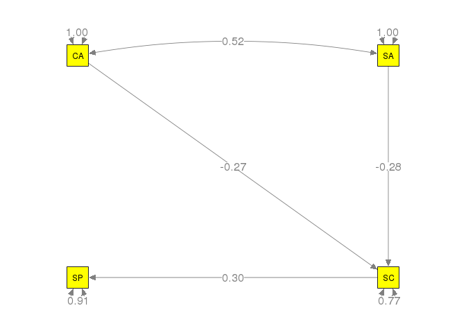

# Special Issue on Meta-analytic Structural Equation Modeling: Introduction from the Guest Editors
Mike W.-L. Cheung and Adam R. Hafdahl  
17 Feb 2016  

# Introduction
*  Becker (2009) tested a mediation model on "Sport Performance" (`SP`). The independent variables were "Cognitive Anxiety" (`CA`) and "Somatic Anxiety" (`SA`) while the mediator was "Self confidence" (`SC`). The following figure displays the model with the labels of the parameters.


* The analysis was conducted in [R](https://www.r-project.org/) with the [metaSEM package](https://courses.nus.edu.sg/course/psycwlm/internet/metasem/). If you have not installed it yet, you may install it by using the following code in R.

```r
## Install the stable version from CRAN
install.packages("metaSEM")
```

* The dataset is stored as an R object `Becker09` in the metaSEM package. The correlation matrices and the sample sizes are stored as `Becker09$data` and `Becker09$n`, respectively. `NA` represents missing value.
* In this illustration, we calculated the sampling variances based on the unweighted means of the correlation matrices.


```r
options(width=100)

## Load the library for data analysis 
library(metaSEM)

## Display the correlation matrices
Becker09$data
```

```
## $`Study 1`
##                 Performance Cognitive Somatic Self confidence
## Performance            1.00     -0.55   -0.48            0.66
## Cognitive             -0.55      1.00    0.47           -0.38
## Somatic               -0.48      0.47    1.00           -0.46
## Self confidence        0.66     -0.38   -0.46            1.00
## 
## $`Study 3`
##                 Performance Cognitive Somatic Self confidence
## Performance            1.00      0.53   -0.12            0.03
## Cognitive              0.53      1.00    0.52           -0.48
## Somatic               -0.12      0.52    1.00           -0.40
## Self confidence        0.03     -0.48   -0.40            1.00
## 
## $`Study 6`
##                 Performance Cognitive Somatic Self confidence
## Performance            1.00      0.44    0.46              NA
## Cognitive              0.44      1.00    0.67              NA
## Somatic                0.46      0.67    1.00              NA
## Self confidence          NA        NA      NA              NA
## 
## $`Study 10`
##                 Performance Cognitive Somatic Self confidence
## Performance            1.00     -0.39   -0.17            0.19
## Cognitive             -0.39      1.00    0.21           -0.54
## Somatic               -0.17      0.21    1.00           -0.43
## Self confidence        0.19     -0.54   -0.43            1.00
## 
## $`Study 17`
##                 Performance Cognitive Somatic Self confidence
## Performance            1.00       0.1    0.31           -0.17
## Cognitive              0.10       1.0      NA              NA
## Somatic                0.31        NA      NA              NA
## Self confidence       -0.17        NA      NA              NA
## 
## $`Study 22`
##                 Performance Cognitive Somatic Self confidence
## Performance            1.00      0.23    0.08            0.51
## Cognitive              0.23      1.00    0.45           -0.29
## Somatic                0.08      0.45    1.00           -0.44
## Self confidence        0.51     -0.29   -0.44            1.00
## 
## $`Study 26`
##                 Performance Cognitive Somatic Self confidence
## Performance            1.00     -0.52   -0.43            0.16
## Cognitive             -0.52      1.00    0.57           -0.18
## Somatic               -0.43      0.57    1.00           -0.26
## Self confidence        0.16     -0.18   -0.26            1.00
## 
## $`Study 28`
##                 Performance Cognitive Somatic Self confidence
## Performance            1.00      0.14    0.02            0.13
## Cognitive              0.14      1.00    0.56           -0.53
## Somatic                0.02      0.56    1.00           -0.27
## Self confidence        0.13     -0.53   -0.27            1.00
## 
## $`Study 36`
##                 Performance Cognitive Somatic Self confidence
## Performance            1.00     -0.01   -0.16            0.42
## Cognitive             -0.01      1.00    0.62           -0.46
## Somatic               -0.16      0.62    1.00           -0.54
## Self confidence        0.42     -0.46   -0.54            1.00
## 
## $`Study 38`
##                 Performance Cognitive Somatic Self confidence
## Performance            1.00     -0.27   -0.13            0.15
## Cognitive             -0.27      1.00    0.63           -0.68
## Somatic               -0.13      0.63    1.00           -0.71
## Self confidence        0.15     -0.68   -0.71            1.00
```

```r
## Display the sample sizes
Becker09$n
```

```
##  [1] 142  37  16  14  45 100  51 128  70  30
```

```r
## Display the numbers of studies present in each cell of the correlation matrix
pattern.na(Becker09$data, show.na = FALSE)
```

```
##                 Performance Cognitive Somatic Self confidence
## Performance              10        10      10               9
## Cognitive                10        10       9               8
## Somatic                  10         9       9               8
## Self confidence           9         8       8               8
```

```r
## Display the cumulative sample size in each cell of the correlation matrix
pattern.n(Becker09$data, Becker09$n)
```

```
##                 Performance Cognitive Somatic Self confidence
## Performance             633       633     633             617
## Cognitive               633       633     588             572
## Somatic                 633       588     588             572
## Self confidence         617       572     572             572
```


# Fixed-effects GLS approach
## Stage 1 analysis


```r
## Construct a column vector y of correlation coefficients
## Extract the correlation coefficients without missing values for each study
y <- lapply(Becker09$data, function(x) {x <- vechs(x)
                                        x[complete.cases(x)]})
y
```

```
## $`Study 1`
## [1] -0.55 -0.48  0.66  0.47 -0.38 -0.46
## 
## $`Study 3`
## [1]  0.53 -0.12  0.03  0.52 -0.48 -0.40
## 
## $`Study 6`
## [1] 0.44 0.46 0.67
## 
## $`Study 10`
## [1] -0.39 -0.17  0.19  0.21 -0.54 -0.43
## 
## $`Study 17`
## [1]  0.10  0.31 -0.17
## 
## $`Study 22`
## [1]  0.23  0.08  0.51  0.45 -0.29 -0.44
## 
## $`Study 26`
## [1] -0.52 -0.43  0.16  0.57 -0.18 -0.26
## 
## $`Study 28`
## [1]  0.14  0.02  0.13  0.56 -0.53 -0.27
## 
## $`Study 36`
## [1] -0.01 -0.16  0.42  0.62 -0.46 -0.54
## 
## $`Study 38`
## [1] -0.27 -0.13  0.15  0.63 -0.68 -0.71
```

```r
## Convert it into a column vector
y <- matrix(unlist(y), ncol=1)
y
```

```
##        [,1]
##  [1,] -0.55
##  [2,] -0.48
##  [3,]  0.66
##  [4,]  0.47
##  [5,] -0.38
##  [6,] -0.46
##  [7,]  0.53
##  [8,] -0.12
##  [9,]  0.03
## [10,]  0.52
## [11,] -0.48
## [12,] -0.40
## [13,]  0.44
## [14,]  0.46
## [15,]  0.67
## [16,] -0.39
## [17,] -0.17
## [18,]  0.19
## [19,]  0.21
## [20,] -0.54
## [21,] -0.43
## [22,]  0.10
## [23,]  0.31
## [24,] -0.17
## [25,]  0.23
## [26,]  0.08
## [27,]  0.51
## [28,]  0.45
## [29,] -0.29
## [30,] -0.44
## [31,] -0.52
## [32,] -0.43
## [33,]  0.16
## [34,]  0.57
## [35,] -0.18
## [36,] -0.26
## [37,]  0.14
## [38,]  0.02
## [39,]  0.13
## [40,]  0.56
## [41,] -0.53
## [42,] -0.27
## [43,] -0.01
## [44,] -0.16
## [45,]  0.42
## [46,]  0.62
## [47,] -0.46
## [48,] -0.54
## [49,] -0.27
## [50,] -0.13
## [51,]  0.15
## [52,]  0.63
## [53,] -0.68
## [54,] -0.71
```

```r
## Create indicators on whether the correlation matrices are missing
X.design <- lapply(Becker09$data, function(x) {ifelse(is.na(vechs(x)), yes = 0, no = 1)})
X.design
```

```
## $`Study 1`
## [1] 1 1 1 1 1 1
## 
## $`Study 3`
## [1] 1 1 1 1 1 1
## 
## $`Study 6`
## [1] 1 1 0 1 0 0
## 
## $`Study 10`
## [1] 1 1 1 1 1 1
## 
## $`Study 17`
## [1] 1 1 1 0 0 0
## 
## $`Study 22`
## [1] 1 1 1 1 1 1
## 
## $`Study 26`
## [1] 1 1 1 1 1 1
## 
## $`Study 28`
## [1] 1 1 1 1 1 1
## 
## $`Study 36`
## [1] 1 1 1 1 1 1
## 
## $`Study 38`
## [1] 1 1 1 1 1 1
```

```r
## Create the design matrices
X.design <- lapply(X.design, function(x) create.Fmatrix(x, as.mxMatrix = FALSE))
X.design
```

```
## $`Study 1`
##      [,1] [,2] [,3] [,4] [,5] [,6]
## [1,]    1    0    0    0    0    0
## [2,]    0    1    0    0    0    0
## [3,]    0    0    1    0    0    0
## [4,]    0    0    0    1    0    0
## [5,]    0    0    0    0    1    0
## [6,]    0    0    0    0    0    1
## 
## $`Study 3`
##      [,1] [,2] [,3] [,4] [,5] [,6]
## [1,]    1    0    0    0    0    0
## [2,]    0    1    0    0    0    0
## [3,]    0    0    1    0    0    0
## [4,]    0    0    0    1    0    0
## [5,]    0    0    0    0    1    0
## [6,]    0    0    0    0    0    1
## 
## $`Study 6`
##      [,1] [,2] [,3] [,4] [,5] [,6]
## [1,]    1    0    0    0    0    0
## [2,]    0    1    0    0    0    0
## [3,]    0    0    0    1    0    0
## 
## $`Study 10`
##      [,1] [,2] [,3] [,4] [,5] [,6]
## [1,]    1    0    0    0    0    0
## [2,]    0    1    0    0    0    0
## [3,]    0    0    1    0    0    0
## [4,]    0    0    0    1    0    0
## [5,]    0    0    0    0    1    0
## [6,]    0    0    0    0    0    1
## 
## $`Study 17`
##      [,1] [,2] [,3] [,4] [,5] [,6]
## [1,]    1    0    0    0    0    0
## [2,]    0    1    0    0    0    0
## [3,]    0    0    1    0    0    0
## 
## $`Study 22`
##      [,1] [,2] [,3] [,4] [,5] [,6]
## [1,]    1    0    0    0    0    0
## [2,]    0    1    0    0    0    0
## [3,]    0    0    1    0    0    0
## [4,]    0    0    0    1    0    0
## [5,]    0    0    0    0    1    0
## [6,]    0    0    0    0    0    1
## 
## $`Study 26`
##      [,1] [,2] [,3] [,4] [,5] [,6]
## [1,]    1    0    0    0    0    0
## [2,]    0    1    0    0    0    0
## [3,]    0    0    1    0    0    0
## [4,]    0    0    0    1    0    0
## [5,]    0    0    0    0    1    0
## [6,]    0    0    0    0    0    1
## 
## $`Study 28`
##      [,1] [,2] [,3] [,4] [,5] [,6]
## [1,]    1    0    0    0    0    0
## [2,]    0    1    0    0    0    0
## [3,]    0    0    1    0    0    0
## [4,]    0    0    0    1    0    0
## [5,]    0    0    0    0    1    0
## [6,]    0    0    0    0    0    1
## 
## $`Study 36`
##      [,1] [,2] [,3] [,4] [,5] [,6]
## [1,]    1    0    0    0    0    0
## [2,]    0    1    0    0    0    0
## [3,]    0    0    1    0    0    0
## [4,]    0    0    0    1    0    0
## [5,]    0    0    0    0    1    0
## [6,]    0    0    0    0    0    1
## 
## $`Study 38`
##      [,1] [,2] [,3] [,4] [,5] [,6]
## [1,]    1    0    0    0    0    0
## [2,]    0    1    0    0    0    0
## [3,]    0    0    1    0    0    0
## [4,]    0    0    0    1    0    0
## [5,]    0    0    0    0    1    0
## [6,]    0    0    0    0    0    1
```

```r
## Combine into a matrix
X <- do.call(rbind, X.design)
X
```

```
##       [,1] [,2] [,3] [,4] [,5] [,6]
##  [1,]    1    0    0    0    0    0
##  [2,]    0    1    0    0    0    0
##  [3,]    0    0    1    0    0    0
##  [4,]    0    0    0    1    0    0
##  [5,]    0    0    0    0    1    0
##  [6,]    0    0    0    0    0    1
##  [7,]    1    0    0    0    0    0
##  [8,]    0    1    0    0    0    0
##  [9,]    0    0    1    0    0    0
## [10,]    0    0    0    1    0    0
## [11,]    0    0    0    0    1    0
## [12,]    0    0    0    0    0    1
## [13,]    1    0    0    0    0    0
## [14,]    0    1    0    0    0    0
## [15,]    0    0    0    1    0    0
## [16,]    1    0    0    0    0    0
## [17,]    0    1    0    0    0    0
## [18,]    0    0    1    0    0    0
## [19,]    0    0    0    1    0    0
## [20,]    0    0    0    0    1    0
## [21,]    0    0    0    0    0    1
## [22,]    1    0    0    0    0    0
## [23,]    0    1    0    0    0    0
## [24,]    0    0    1    0    0    0
## [25,]    1    0    0    0    0    0
## [26,]    0    1    0    0    0    0
## [27,]    0    0    1    0    0    0
## [28,]    0    0    0    1    0    0
## [29,]    0    0    0    0    1    0
## [30,]    0    0    0    0    0    1
## [31,]    1    0    0    0    0    0
## [32,]    0    1    0    0    0    0
## [33,]    0    0    1    0    0    0
## [34,]    0    0    0    1    0    0
## [35,]    0    0    0    0    1    0
## [36,]    0    0    0    0    0    1
## [37,]    1    0    0    0    0    0
## [38,]    0    1    0    0    0    0
## [39,]    0    0    1    0    0    0
## [40,]    0    0    0    1    0    0
## [41,]    0    0    0    0    1    0
## [42,]    0    0    0    0    0    1
## [43,]    1    0    0    0    0    0
## [44,]    0    1    0    0    0    0
## [45,]    0    0    1    0    0    0
## [46,]    0    0    0    1    0    0
## [47,]    0    0    0    0    1    0
## [48,]    0    0    0    0    0    1
## [49,]    1    0    0    0    0    0
## [50,]    0    1    0    0    0    0
## [51,]    0    0    1    0    0    0
## [52,]    0    0    0    1    0    0
## [53,]    0    0    0    0    1    0
## [54,]    0    0    0    0    0    1
```

```r
## Sampling variance covariance matrix based on the unweighted mean of correlations
V <- asyCov(Becker09$data, Becker09$n, acov="unweighted", as.matrix = FALSE)

## Function to remove missing values in V: x*v*x'
filter <- function(x,v) { x %*% v %*% t(x) }

## Extract known sampling covariance matrices without the missing values
V <- mapply(filter, X.design, V)

## Convert it into a diagonal matrix
V <- bdiagMat(V)

## Only show part of V as it is too big
V[1:8, 1:8]
```

```
##               [,1]          [,2]          [,3]          [,4]          [,5]          [,6]       [,7]
## [1,]  0.0070794958  3.681413e-03 -2.949461e-03 -2.792773e-04  0.0012813958  6.039161e-04 0.00000000
## [2,]  0.0036814134  7.037838e-03 -2.895465e-03 -7.097326e-05  0.0005286830  1.244920e-03 0.00000000
## [3,] -0.0029494612 -2.895465e-03  6.354858e-03 -1.505444e-05  0.0001122063 -6.181858e-05 0.00000000
## [4,] -0.0002792773 -7.097326e-05 -1.505444e-05  3.751398e-03 -0.0013760577 -1.402917e-03 0.00000000
## [5,]  0.0012813958  5.286830e-04  1.122063e-04 -1.376058e-03  0.0045867731  2.032183e-03 0.00000000
## [6,]  0.0006039161  1.244920e-03 -6.181858e-05 -1.402917e-03  0.0020321834  4.624544e-03 0.00000000
## [7,]  0.0000000000  0.000000e+00  0.000000e+00  0.000000e+00  0.0000000000  0.000000e+00 0.02772768
## [8,]  0.0000000000  0.000000e+00  0.000000e+00  0.000000e+00  0.0000000000  0.000000e+00 0.01441858
##            [,8]
## [1,] 0.00000000
## [2,] 0.00000000
## [3,] 0.00000000
## [4,] 0.00000000
## [5,] 0.00000000
## [6,] 0.00000000
## [7,] 0.01441858
## [8,] 0.02756441
```

```r
## Textbook formula; it may not be numerically stable
## Common correlation matrix under the fixed-effects model
r.fixed <- solve( t(X)%*%solve(V)%*%X ) %*% t(X) %*% solve(V) %*% y
r.fixed
```

```
##             [,1]
## [1,] -0.07465414
## [2,] -0.12763961
## [3,]  0.31726139
## [4,]  0.52373133
## [5,] -0.41628484
## [6,] -0.40921471
```

```r
## Sampling covariance matrix of r.fixed
V.fixed <- solve( t(X)%*%solve(V)%*%X )
V.fixed
```

```
##               [,1]          [,2]          [,3]          [,4]          [,5]          [,6]
## [1,]  1.602253e-03  8.331848e-04 -6.675273e-04 -6.320412e-05  2.900053e-04  1.366760e-04
## [2,]  8.331848e-04  1.592821e-03 -6.553048e-04 -1.606064e-05  1.196516e-04  2.817491e-04
## [3,] -6.675273e-04 -6.553048e-04  1.464833e-03 -3.358359e-06  2.855997e-05 -1.179929e-05
## [4,] -6.320412e-05 -1.606064e-05 -3.358359e-06  9.132940e-04 -3.339420e-04 -3.412807e-04
## [5,]  2.900053e-04  1.196516e-04  2.855997e-05 -3.339420e-04  1.136665e-03  5.018449e-04
## [6,]  1.366760e-04  2.817491e-04 -1.179929e-05 -3.412807e-04  5.018449e-04  1.146823e-03
```

```r
## Q statistic in testing the homogeneity of correlation matrices
Q.fixed <- t(y) %*% (solve(V)-solve(V)%*% X %*%solve(t(X)%*%solve(V)%*%X) %*% t(X) %*%solve(V)) %*% y
Q.fixed
```

```
##          [,1]
## [1,] 186.6425
```

```r
## df for the Q statistic
Q.df <- sum(vechs(pattern.na(Becker09$data, show.na = FALSE))) - 6
Q.df
```

```
## [1] 48
```

```r
## p value of the Q statistic
pchisq(Q.fixed, df=Q.df, lower.tail=FALSE)
```

```
##              [,1]
## [1,] 3.083881e-18
```

## Stage 2 analysis
* The models were specified in the [RAM formulation](http://openmx.psyc.virginia.edu/docs/OpenMx/latest/Examples_Matrix.html) and analyzed with the `wls()` function.

```r
## A matrix for regression coefficients
A1 <- create.mxMatrix(c(0, "0.1*CA2SP", "0.1*SA2SP", "0.1*SC2SP",
                        0, 0, 0, 0,
                        0, 0, 0, 0,
                        0, "0.1*CA2SC", "0.1*SA2SC",0),
                      type="Full", byrow=TRUE, ncol=4, nrow=4,
                      as.mxMatrix=FALSE)

## Variable names
var.names <- c("Performance","Cognitive","Somatic","Self confidence")

## This step is not necessary but it is useful for inspecting the model.
dimnames(A1) <- list(var.names, var.names)
A1
```

```
##                 Performance Cognitive   Somatic     Self confidence
## Performance     "0"         "0.1*CA2SP" "0.1*SA2SP" "0.1*SC2SP"    
## Cognitive       "0"         "0"         "0"         "0"            
## Somatic         "0"         "0"         "0"         "0"            
## Self confidence "0"         "0.1*CA2SC" "0.1*SA2SC" "0"
```

```r
## S matrix for variance and covariance matrix
## Since the correlation matrix is used, the variances of the predictors are fixed at 1.0.
S1 <- create.mxMatrix(c("0.1*Err_Var_SP",
                        0, 1,
                        0, "0.1*Cor_CA_SA", 1,
                        0, 0, 0, "0.1*Err_Var_SC"), byrow=TRUE, type="Symm",
                      as.mxMatrix=FALSE)

## This step is not necessary but it is useful for inspecting the model.
dimnames(S1) <- list(var.names, var.names)
S1
```

```
##                 Performance      Cognitive       Somatic         Self confidence 
## Performance     "0.1*Err_Var_SP" "0"             "0"             "0"             
## Cognitive       "0"              "1"             "0.1*Cor_CA_SA" "0"             
## Somatic         "0"              "0.1*Cor_CA_SA" "1"             "0"             
## Self confidence "0"              "0"             "0"             "0.1*Err_Var_SC"
```

```r
## Total sample size
n.total <- sum(Becker09$n)

## Convert r vector to a matrix
R.fixed <- vec2symMat(r.fixed, diag = FALSE)
R.fixed
```

```
##             [,1]        [,2]       [,3]       [,4]
## [1,]  1.00000000 -0.07465414 -0.1276396  0.3172614
## [2,] -0.07465414  1.00000000  0.5237313 -0.4162848
## [3,] -0.12763961  0.52373133  1.0000000 -0.4092147
## [4,]  0.31726139 -0.41628484 -0.4092147  1.0000000
```

```r
gls.fixed2 <- wls(Cov=R.fixed, asyCov=V.fixed, n=n.total, Amatrix=A1, Smatrix=S1, 
                  model.name="Fixed effects GLS 2nd stage with direct effects")
summary(gls.fixed2)
```

```
## 
## Call:
## wls(Cov = R.fixed, asyCov = V.fixed, n = n.total, Amatrix = A1, 
##     Smatrix = S1, model.name = "Fixed effects GLS 2nd stage with direct effects")
## 
## 95% confidence intervals: z statistic approximation
## Coefficients:
##            Estimate Std.Error    lbound    ubound z value  Pr(>|z|)    
## CA2SP      0.083474  0.047442 -0.009511  0.176460  1.7595   0.07849 .  
## SA2SP     -0.032803  0.047087 -0.125093  0.059487 -0.6966   0.48603    
## SC2SP      0.338587  0.042563  0.255166  0.422009  7.9550 1.776e-15 ***
## CA2SC     -0.278303  0.041378 -0.359402 -0.197204 -6.7259 1.745e-11 ***
## SA2SC     -0.263458  0.041436 -0.344672 -0.182245 -6.3582 2.041e-10 ***
## Cor_CA_SA  0.523731  0.030221  0.464500  0.582963 17.3302 < 2.2e-16 ***
## ---
## Signif. codes:  0 '***' 0.001 '**' 0.01 '*' 0.05 '.' 0.1 ' ' 1
## 
## Goodness-of-fit indices:
##                                            Value
## Sample size                                633.0
## Chi-square of target model                   0.0
## DF of target model                           0.0
## p value of target model                      0.0
## Number of constraints imposed on "Smatrix"   0.0
## DF manually adjusted                         0.0
## Chi-square of independence model           464.4
## DF of independence model                     6.0
## RMSEA                                        0.0
## RMSEA lower 95% CI                           0.0
## RMSEA upper 95% CI                           0.0
## SRMR                                         0.0
## TLI                                         -Inf
## CFI                                          1.0
## AIC                                          0.0
## BIC                                          0.0
## OpenMx status1: 0 ("0" or "1": The optimization is considered fine.
## Other values indicate problems.)
```

* We also illustrated how to fit a model without the direct effects from `CA` and `SA` to `SP`. We created a new matrix `A2` to represent the regression coefficients. The matrix `S1` was the same as the one we used before.

```r
## A matrix for regression coefficients with the direct effects
A2 <- create.mxMatrix(c(0, 0, 0, "0.1*SC2SP",
                        0, 0, 0, 0,
                        0, 0, 0, 0,
                        0, "0.1*CA2SC", "0.1*SA2SC",0),
                      type="Full", byrow=TRUE, ncol=4, nrow=4,
                      as.mxMatrix=FALSE)

## This step is not necessary but it is useful for inspecting the model.
dimnames(A2) <- list(var.names, var.names)
A2
```

```
##                 Performance Cognitive   Somatic     Self confidence
## Performance     "0"         "0"         "0"         "0.1*SC2SP"    
## Cognitive       "0"         "0"         "0"         "0"            
## Somatic         "0"         "0"         "0"         "0"            
## Self confidence "0"         "0.1*CA2SC" "0.1*SA2SC" "0"
```

```r
gls.fixed3 <- wls(Cov=R.fixed, asyCov=V.fixed, n=n.total, Amatrix=A2, Smatrix=S1, 
                  model.name="Fixed effects GLS 2nd stage without direct effect)")
summary(gls.fixed3)
```

```
## 
## Call:
## wls(Cov = R.fixed, asyCov = V.fixed, n = n.total, Amatrix = A2, 
##     Smatrix = S1, model.name = "Fixed effects GLS 2nd stage without direct effect)")
## 
## 95% confidence intervals: z statistic approximation
## Coefficients:
##            Estimate Std.Error    lbound    ubound z value  Pr(>|z|)    
## SC2SP      0.320129  0.038357  0.244950  0.395307  8.3460 < 2.2e-16 ***
## CA2SC     -0.274276  0.041414 -0.355445 -0.193107 -6.6229 3.523e-11 ***
## SA2SC     -0.265960  0.041371 -0.347046 -0.184875 -6.4287 1.287e-10 ***
## Cor_CA_SA  0.523290  0.030111  0.464274  0.582306 17.3788 < 2.2e-16 ***
## ---
## Signif. codes:  0 '***' 0.001 '**' 0.01 '*' 0.05 '.' 0.1 ' ' 1
## 
## Goodness-of-fit indices:
##                                               Value
## Sample size                                633.0000
## Chi-square of target model                   3.1397
## DF of target model                           2.0000
## p value of target model                      0.2081
## Number of constraints imposed on "Smatrix"   0.0000
## DF manually adjusted                         0.0000
## Chi-square of independence model           464.3958
## DF of independence model                     6.0000
## RMSEA                                        0.0300
## RMSEA lower 95% CI                           0.0000
## RMSEA upper 95% CI                           0.0901
## SRMR                                         0.0237
## TLI                                          0.9925
## CFI                                          0.9975
## AIC                                         -0.8603
## BIC                                         -9.7612
## OpenMx status1: 0 ("0" or "1": The optimization is considered fine.
## Other values indicate problems.)
```


# Random-effects GLS approach
## Stage 1 analysis
* Following Becker (2009), we only estimated the diagonals of the random effects. For completeness, we repeated the process by reading the data.


```r
## Extract the correlation coefficients without missing values
y <- lapply(Becker09$data, function(x) {x <- vechs(x); x[complete.cases(x)]})

## Convert it into a column vector
y <- matrix(unlist(y), ncol=1)
y
```

```
##        [,1]
##  [1,] -0.55
##  [2,] -0.48
##  [3,]  0.66
##  [4,]  0.47
##  [5,] -0.38
##  [6,] -0.46
##  [7,]  0.53
##  [8,] -0.12
##  [9,]  0.03
## [10,]  0.52
## [11,] -0.48
## [12,] -0.40
## [13,]  0.44
## [14,]  0.46
## [15,]  0.67
## [16,] -0.39
## [17,] -0.17
## [18,]  0.19
## [19,]  0.21
## [20,] -0.54
## [21,] -0.43
## [22,]  0.10
## [23,]  0.31
## [24,] -0.17
## [25,]  0.23
## [26,]  0.08
## [27,]  0.51
## [28,]  0.45
## [29,] -0.29
## [30,] -0.44
## [31,] -0.52
## [32,] -0.43
## [33,]  0.16
## [34,]  0.57
## [35,] -0.18
## [36,] -0.26
## [37,]  0.14
## [38,]  0.02
## [39,]  0.13
## [40,]  0.56
## [41,] -0.53
## [42,] -0.27
## [43,] -0.01
## [44,] -0.16
## [45,]  0.42
## [46,]  0.62
## [47,] -0.46
## [48,] -0.54
## [49,] -0.27
## [50,] -0.13
## [51,]  0.15
## [52,]  0.63
## [53,] -0.68
## [54,] -0.71
```

```r
## Extract whether the correlation matrices are missing
X.design <- lapply(Becker09$data, function(x) {ifelse(is.na(vechs(x)), yes = 0, no = 1)})

## Create the design matrices
X.design <- lapply(X.design, function(x) create.Fmatrix(x, as.mxMatrix = FALSE))

## Combine into a matrix
X <- do.call(rbind, X.design)
X
```

```
##       [,1] [,2] [,3] [,4] [,5] [,6]
##  [1,]    1    0    0    0    0    0
##  [2,]    0    1    0    0    0    0
##  [3,]    0    0    1    0    0    0
##  [4,]    0    0    0    1    0    0
##  [5,]    0    0    0    0    1    0
##  [6,]    0    0    0    0    0    1
##  [7,]    1    0    0    0    0    0
##  [8,]    0    1    0    0    0    0
##  [9,]    0    0    1    0    0    0
## [10,]    0    0    0    1    0    0
## [11,]    0    0    0    0    1    0
## [12,]    0    0    0    0    0    1
## [13,]    1    0    0    0    0    0
## [14,]    0    1    0    0    0    0
## [15,]    0    0    0    1    0    0
## [16,]    1    0    0    0    0    0
## [17,]    0    1    0    0    0    0
## [18,]    0    0    1    0    0    0
## [19,]    0    0    0    1    0    0
## [20,]    0    0    0    0    1    0
## [21,]    0    0    0    0    0    1
## [22,]    1    0    0    0    0    0
## [23,]    0    1    0    0    0    0
## [24,]    0    0    1    0    0    0
## [25,]    1    0    0    0    0    0
## [26,]    0    1    0    0    0    0
## [27,]    0    0    1    0    0    0
## [28,]    0    0    0    1    0    0
## [29,]    0    0    0    0    1    0
## [30,]    0    0    0    0    0    1
## [31,]    1    0    0    0    0    0
## [32,]    0    1    0    0    0    0
## [33,]    0    0    1    0    0    0
## [34,]    0    0    0    1    0    0
## [35,]    0    0    0    0    1    0
## [36,]    0    0    0    0    0    1
## [37,]    1    0    0    0    0    0
## [38,]    0    1    0    0    0    0
## [39,]    0    0    1    0    0    0
## [40,]    0    0    0    1    0    0
## [41,]    0    0    0    0    1    0
## [42,]    0    0    0    0    0    1
## [43,]    1    0    0    0    0    0
## [44,]    0    1    0    0    0    0
## [45,]    0    0    1    0    0    0
## [46,]    0    0    0    1    0    0
## [47,]    0    0    0    0    1    0
## [48,]    0    0    0    0    0    1
## [49,]    1    0    0    0    0    0
## [50,]    0    1    0    0    0    0
## [51,]    0    0    1    0    0    0
## [52,]    0    0    0    1    0    0
## [53,]    0    0    0    0    1    0
## [54,]    0    0    0    0    0    1
```

* We estimated the heterogeneity variance $\tau^2$ `Tau2` on each correlation coefficient with the maximum likelihood (ML) estimation method.

```r
## Stack the correlation coefficients
y.vec <- t(sapply(Becker09$data, function(x) vechs(x)))
y.vec
```

```
##           [,1]  [,2]  [,3] [,4]  [,5]  [,6]
## Study 1  -0.55 -0.48  0.66 0.47 -0.38 -0.46
## Study 3   0.53 -0.12  0.03 0.52 -0.48 -0.40
## Study 6   0.44  0.46    NA 0.67    NA    NA
## Study 10 -0.39 -0.17  0.19 0.21 -0.54 -0.43
## Study 17  0.10  0.31 -0.17   NA    NA    NA
## Study 22  0.23  0.08  0.51 0.45 -0.29 -0.44
## Study 26 -0.52 -0.43  0.16 0.57 -0.18 -0.26
## Study 28  0.14  0.02  0.13 0.56 -0.53 -0.27
## Study 36 -0.01 -0.16  0.42 0.62 -0.46 -0.54
## Study 38 -0.27 -0.13  0.15 0.63 -0.68 -0.71
```

```r
## Extract the data by effect sizes (by column)
y.vec <- lapply(1:6, function(x) y.vec[, x] )
y.vec
```

```
## [[1]]
##  Study 1  Study 3  Study 6 Study 10 Study 17 Study 22 Study 26 Study 28 Study 36 Study 38 
##    -0.55     0.53     0.44    -0.39     0.10     0.23    -0.52     0.14    -0.01    -0.27 
## 
## [[2]]
##  Study 1  Study 3  Study 6 Study 10 Study 17 Study 22 Study 26 Study 28 Study 36 Study 38 
##    -0.48    -0.12     0.46    -0.17     0.31     0.08    -0.43     0.02    -0.16    -0.13 
## 
## [[3]]
##  Study 1  Study 3  Study 6 Study 10 Study 17 Study 22 Study 26 Study 28 Study 36 Study 38 
##     0.66     0.03       NA     0.19    -0.17     0.51     0.16     0.13     0.42     0.15 
## 
## [[4]]
##  Study 1  Study 3  Study 6 Study 10 Study 17 Study 22 Study 26 Study 28 Study 36 Study 38 
##     0.47     0.52     0.67     0.21       NA     0.45     0.57     0.56     0.62     0.63 
## 
## [[5]]
##  Study 1  Study 3  Study 6 Study 10 Study 17 Study 22 Study 26 Study 28 Study 36 Study 38 
##    -0.38    -0.48       NA    -0.54       NA    -0.29    -0.18    -0.53    -0.46    -0.68 
## 
## [[6]]
##  Study 1  Study 3  Study 6 Study 10 Study 17 Study 22 Study 26 Study 28 Study 36 Study 38 
##    -0.46    -0.40       NA    -0.43       NA    -0.44    -0.26    -0.27    -0.54    -0.71
```

```r
## Function to estimate the tau^2 with ML estimation method
est.tau2 <- function(x, n) {
  ## remove missing values in x
  y <- x[!is.na(x)]
  ## unweighted mean of the correlation coefficients
  r <- mean(x, na.rm = TRUE)
  ## sampling variances based on the unweighted mean
  v <- (1-r^2)^2/n[!is.na(x)]
  ## meta-analysis with ML estimation
  out <- meta(y, v)
  ## extract the tau2
  coef(out, select = "random")
}

## Digaonal matrix of random effects (tau2)
Tau2 <- diag(sapply(y.vec, est.tau2, n=Becker09$n))
Tau2
```

```
##           [,1]       [,2]       [,3]  [,4]        [,5]        [,6]
## [1,] 0.1071188 0.00000000 0.00000000 0e+00 0.000000000 0.000000000
## [2,] 0.0000000 0.05104107 0.00000000 0e+00 0.000000000 0.000000000
## [3,] 0.0000000 0.00000000 0.05023368 0e+00 0.000000000 0.000000000
## [4,] 0.0000000 0.00000000 0.00000000 1e-10 0.000000000 0.000000000
## [5,] 0.0000000 0.00000000 0.00000000 0e+00 0.006437978 0.000000000
## [6,] 0.0000000 0.00000000 0.00000000 0e+00 0.000000000 0.004854097
```

```r
## Sampling variance covariance matrix based on the unweighted mean of correlations
V <- asyCov(Becker09$data, Becker09$n, acov="unweighted", as.matrix = FALSE)

## Function to filter the elements with missing data and add Tau2
filter <- function(x,v) { x %*% (v+Tau2) %*% t(x) }

## New V = old V + Tau2
V <- mapply(filter, X.design, V)

## Convert it into a diagonal matrix
V <- bdiagMat(V)

## Show part of V
V[1:8, 1:8]
```

```
##               [,1]          [,2]          [,3]          [,4]          [,5]          [,6]       [,7]
## [1,]  0.1141982111  3.681340e-03 -2.949393e-03 -2.792597e-04  0.0012813541  6.038792e-04 0.00000000
## [2,]  0.0036813402  5.807881e-02 -2.895389e-03 -7.095888e-05  0.0005286586  1.244874e-03 0.00000000
## [3,] -0.0029493929 -2.895389e-03  5.658847e-02 -1.503769e-05  0.0001122107 -6.181069e-05 0.00000000
## [4,] -0.0002792597 -7.095888e-05 -1.503769e-05  3.751361e-03 -0.0013760229 -1.402884e-03 0.00000000
## [5,]  0.0012813541  5.286586e-04  1.122107e-04 -1.376023e-03  0.0110246865  2.032143e-03 0.00000000
## [6,]  0.0006038792  1.244874e-03 -6.181069e-05 -1.402884e-03  0.0020321428  9.478583e-03 0.00000000
## [7,]  0.0000000000  0.000000e+00  0.000000e+00  0.000000e+00  0.0000000000  0.000000e+00 0.13484664
## [8,]  0.0000000000  0.000000e+00  0.000000e+00  0.000000e+00  0.0000000000  0.000000e+00 0.01441874
##            [,8]
## [1,] 0.00000000
## [2,] 0.00000000
## [3,] 0.00000000
## [4,] 0.00000000
## [5,] 0.00000000
## [6,] 0.00000000
## [7,] 0.01441874
## [8,] 0.07860573
```

```r
## Average correlation matrix under the random-effects model
r.random <- solve(t(X)%*%solve(V)%*%X) %*% t(X) %*% solve(V) %*% y
r.random
```

```
##             [,1]
## [1,] -0.04629338
## [2,] -0.08919571
## [3,]  0.24711563
## [4,]  0.52321499
## [5,] -0.41662373
## [6,] -0.41769915
```

```r
## Sampling covariance matrix of r.random
V.random <- solve(t(X)%*%solve(V)%*%X)
V.random
```

```
##               [,1]          [,2]          [,3]          [,4]          [,5]          [,6]
## [1,]  1.313721e-02  1.114051e-03 -8.184129e-04 -6.111793e-05  0.0003029071  0.0001315615
## [2,]  1.114051e-03  7.383641e-03 -7.889699e-04 -1.556409e-05  0.0001163680  0.0002878333
## [3,] -8.184129e-04 -7.889699e-04  7.608865e-03 -3.127877e-06  0.0000330270 -0.0000113705
## [4,] -6.111793e-05 -1.556409e-05 -3.127877e-06  9.135100e-04 -0.0003349117 -0.0003415201
## [5,]  3.029071e-04  1.163680e-04  3.302700e-05 -3.349117e-04  0.0021402615  0.0005254519
## [6,]  1.315615e-04  2.878333e-04 -1.137050e-05 -3.415201e-04  0.0005254519  0.0019179407
```


## Stage 2 analysis
* We fitted the model with the direct effects from `CA` and `SA` to `SP`.

```r
## Total sample size
n.total <- sum(Becker09$n)

## Convert r vector to a matrix
R.random <- vec2symMat(r.random, diag = FALSE)
R.random
```

```
##             [,1]        [,2]        [,3]       [,4]
## [1,]  1.00000000 -0.04629338 -0.08919571  0.2471156
## [2,] -0.04629338  1.00000000  0.52321499 -0.4166237
## [3,] -0.08919571  0.52321499  1.00000000 -0.4176991
## [4,]  0.24711563 -0.41662373 -0.41769915  1.0000000
```

```r
gls.random2 <- wls(Cov=R.random, asyCov=V.random, n=n.total, Amatrix=A1, Smatrix=S1, 
                   model.name="Random effects GLS 2nd stage with direct effects")

summary(gls.random2)
```

```
## 
## Call:
## wls(Cov = R.random, asyCov = V.random, n = n.total, Amatrix = A1, 
##     Smatrix = S1, model.name = "Random effects GLS 2nd stage with direct effects")
## 
## 95% confidence intervals: z statistic approximation
## Coefficients:
##            Estimate Std.Error    lbound    ubound z value  Pr(>|z|)    
## CA2SP      0.074742  0.172731 -0.263804  0.413288  0.4327   0.66523    
## SA2SP     -0.014627  0.140081 -0.289181  0.259927 -0.1044   0.91684    
## SC2SP      0.272145  0.119060  0.038792  0.505498  2.2858   0.02227 *  
## CA2SC     -0.272741  0.062951 -0.396122 -0.149360 -4.3326 1.473e-05 ***
## SA2SC     -0.274997  0.060434 -0.393445 -0.156549 -4.5504 5.355e-06 ***
## Cor_CA_SA  0.523215  0.030224  0.463976  0.582454 17.3111 < 2.2e-16 ***
## ---
## Signif. codes:  0 '***' 0.001 '**' 0.01 '*' 0.05 '.' 0.1 ' ' 1
## 
## Goodness-of-fit indices:
##                                             Value
## Sample size                                633.00
## Chi-square of target model                   0.00
## DF of target model                           0.00
## p value of target model                      0.00
## Number of constraints imposed on "Smatrix"   0.00
## DF manually adjusted                         0.00
## Chi-square of independence model           351.65
## DF of independence model                     6.00
## RMSEA                                        0.00
## RMSEA lower 95% CI                           0.00
## RMSEA upper 95% CI                           0.00
## SRMR                                         0.00
## TLI                                          -Inf
## CFI                                          1.00
## AIC                                          0.00
## BIC                                          0.00
## OpenMx status1: 0 ("0" or "1": The optimization is considered fine.
## Other values indicate problems.)
```

* We fitted the model without the direct effects from `CA` and `SA` to `SP`.

```r
gls.random3 <- wls(Cov=R.random, asyCov=V.fixed, n=n.total, Amatrix=A2, Smatrix=S1, 
                   model.name="Random effects GLS 2nd stage without direct effect")
summary(gls.random3)
```

```
## 
## Call:
## wls(Cov = R.random, asyCov = V.fixed, n = n.total, Amatrix = A2, 
##     Smatrix = S1, model.name = "Random effects GLS 2nd stage without direct effect")
## 
## 95% confidence intervals: z statistic approximation
## Coefficients:
##            Estimate Std.Error    lbound    ubound z value  Pr(>|z|)    
## SC2SP      0.249922  0.038359  0.174740  0.325104  6.5154 7.251e-11 ***
## CA2SC     -0.273665  0.041417 -0.354842 -0.192489 -6.6075 3.908e-11 ***
## SA2SC     -0.275010  0.041425 -0.356202 -0.193818 -6.6387 3.165e-11 ***
## Cor_CA_SA  0.522882  0.030163  0.463763  0.582000 17.3352 < 2.2e-16 ***
## ---
## Signif. codes:  0 '***' 0.001 '**' 0.01 '*' 0.05 '.' 0.1 ' ' 1
## 
## Goodness-of-fit indices:
##                                               Value
## Sample size                                633.0000
## Chi-square of target model                   2.7143
## DF of target model                           2.0000
## p value of target model                      0.2574
## Number of constraints imposed on "Smatrix"   0.0000
## DF manually adjusted                         0.0000
## Chi-square of independence model           438.4331
## DF of independence model                     6.0000
## RMSEA                                        0.0238
## RMSEA lower 95% CI                           0.0000
## RMSEA upper 95% CI                           0.0862
## SRMR                                         0.0245
## TLI                                          0.9950
## CFI                                          0.9983
## AIC                                         -1.2857
## BIC                                        -10.1866
## OpenMx status1: 0 ("0" or "1": The optimization is considered fine.
## Other values indicate problems.)
```

# Fixed-effects TSSEM approach
## Stage 1 analysis
* Since the fixed-effects TSSEM uses a multiple-group structural equation modeling approach, it does not need to estimate the sampling covariance matrix of the correlation coefficients.


```r
tssem.fixed1 <- tssem1(Becker09$data, Becker09$n, method="FEM", 
                       model.name="Fixed effects TSSEM 1st stage")
summary(tssem.fixed1)
```

```
## 
## Call:
## tssem1FEM(my.df = my.df, n = n, cor.analysis = cor.analysis, 
##     model.name = model.name, cluster = cluster, suppressWarnings = suppressWarnings, 
##     silent = silent, run = run)
## 
## Coefficients:
##         Estimate Std.Error  z value  Pr(>|z|)    
## S[1,2] -0.068497  0.042323  -1.6184 0.1055669    
## S[1,3] -0.158146  0.041270  -3.8320 0.0001271 ***
## S[1,4]  0.371528  0.037348   9.9477 < 2.2e-16 ***
## S[2,3]  0.526242  0.030213  17.4178 < 2.2e-16 ***
## S[2,4] -0.413506  0.035155 -11.7623 < 2.2e-16 ***
## S[3,4] -0.416417  0.035026 -11.8889 < 2.2e-16 ***
## ---
## Signif. codes:  0 '***' 0.001 '**' 0.01 '*' 0.05 '.' 0.1 ' ' 1
## 
## Goodness-of-fit indices:
##                                     Value
## Sample size                      633.0000
## Chi-square of target model       208.9383
## DF of target model                46.0000
## p value of target model            0.0000
## Chi-square of independence model 628.7646
## DF of independence model          52.0000
## RMSEA                              0.2367
## RMSEA lower 95% CI                 0.2062
## RMSEA upper 95% CI                 0.2717
## SRMR                               0.2049
## TLI                                0.6806
## CFI                                0.7175
## AIC                              116.9383
## BIC                              -87.7833
## OpenMx status1: 0 ("0" or "1": The optimization is considered fine.
## Other values may indicate problems.)
```

```r
## Estimated common correlation matrix
coef(tssem.fixed1)
```

```
##                 Performance   Cognitive    Somatic Self confidence
## Performance      1.00000000 -0.06849689 -0.1581465       0.3715276
## Cognitive       -0.06849689  1.00000000  0.5262420      -0.4135057
## Somatic         -0.15814648  0.52624203  1.0000000      -0.4164165
## Self confidence  0.37152756 -0.41350572 -0.4164165       1.0000000
```

## Stage 2 analysis
* We fitted the model with the direct effects from `CA` and `SA` to `SP`.

```r
tssem.fixed2 <- tssem2(tssem.fixed1, Amatrix=A1, Smatrix=S1, 
                       model.name="Fixed effects TSSEM 2nd stage with direct effects")
summary(tssem.fixed2)
```

```
## 
## Call:
## wls(Cov = coef.tssem1FEM(tssem1.obj), asyCov = vcov.tssem1FEM(tssem1.obj), 
##     n = sum(tssem1.obj$n), Amatrix = Amatrix, Smatrix = Smatrix, 
##     Fmatrix = Fmatrix, diag.constraints = diag.constraints, cor.analysis = tssem1.obj$cor.analysis, 
##     intervals.type = intervals.type, mx.algebras = mx.algebras, 
##     model.name = model.name, suppressWarnings = suppressWarnings, 
##     silent = silent, run = run)
## 
## 95% confidence intervals: z statistic approximation
## Coefficients:
##            Estimate Std.Error    lbound    ubound z value  Pr(>|z|)    
## CA2SP      0.127854  0.049159  0.031504  0.224204  2.6008    0.0093 ** 
## SA2SP     -0.058920  0.048419 -0.153819  0.035979 -1.2169    0.2236    
## SC2SP      0.399861  0.042928  0.315723  0.483998  9.3147 < 2.2e-16 ***
## CA2SC     -0.268812  0.042946 -0.352984 -0.184640 -6.2594 3.866e-10 ***
## SA2SC     -0.274956  0.042892 -0.359024 -0.190889 -6.4104 1.452e-10 ***
## Cor_CA_SA  0.526242  0.030213  0.467026  0.585458 17.4178 < 2.2e-16 ***
## ---
## Signif. codes:  0 '***' 0.001 '**' 0.01 '*' 0.05 '.' 0.1 ' ' 1
## 
## Goodness-of-fit indices:
##                                             Value
## Sample size                                633.00
## Chi-square of target model                   0.00
## DF of target model                           0.00
## p value of target model                      0.00
## Number of constraints imposed on "Smatrix"   0.00
## DF manually adjusted                         0.00
## Chi-square of independence model           523.29
## DF of independence model                     6.00
## RMSEA                                        0.00
## RMSEA lower 95% CI                           0.00
## RMSEA upper 95% CI                           0.00
## SRMR                                         0.00
## TLI                                          -Inf
## CFI                                          1.00
## AIC                                          0.00
## BIC                                          0.00
## OpenMx status1: 0 ("0" or "1": The optimization is considered fine.
## Other values indicate problems.)
```

* We fitted the model without the direct effects from `CA` and `SA` to `SP`.

```r
tssem.fixed3 <- tssem2(tssem.fixed1, Amatrix=A2, Smatrix=S1, 
                       model.name="Fixed effects TSSEM 2nd stage without direct effect)")
summary(tssem.fixed3)
```

```
## 
## Call:
## wls(Cov = coef.tssem1FEM(tssem1.obj), asyCov = vcov.tssem1FEM(tssem1.obj), 
##     n = sum(tssem1.obj$n), Amatrix = Amatrix, Smatrix = Smatrix, 
##     Fmatrix = Fmatrix, diag.constraints = diag.constraints, cor.analysis = tssem1.obj$cor.analysis, 
##     intervals.type = intervals.type, mx.algebras = mx.algebras, 
##     model.name = model.name, suppressWarnings = suppressWarnings, 
##     silent = silent, run = run)
## 
## 95% confidence intervals: z statistic approximation
## Coefficients:
##            Estimate Std.Error    lbound    ubound z value  Pr(>|z|)    
## SC2SP      0.375988  0.037770  0.301960  0.450015  9.9547 < 2.2e-16 ***
## CA2SC     -0.269461  0.043932 -0.355566 -0.183357 -6.1337 8.588e-10 ***
## SA2SC     -0.273956  0.043606 -0.359423 -0.188489 -6.2825 3.333e-10 ***
## Cor_CA_SA  0.532648  0.029947  0.473953  0.591344 17.7863 < 2.2e-16 ***
## ---
## Signif. codes:  0 '***' 0.001 '**' 0.01 '*' 0.05 '.' 0.1 ' ' 1
## 
## Goodness-of-fit indices:
##                                               Value
## Sample size                                633.0000
## Chi-square of target model                   6.7506
## DF of target model                           2.0000
## p value of target model                      0.0342
## Number of constraints imposed on "Smatrix"   0.0000
## DF manually adjusted                         0.0000
## Chi-square of independence model           523.2938
## DF of independence model                     6.0000
## RMSEA                                        0.0613
## RMSEA lower 95% CI                           0.0144
## RMSEA upper 95% CI                           0.1150
## SRMR                                         0.0360
## TLI                                          0.9724
## CFI                                          0.9908
## AIC                                          2.7506
## BIC                                         -6.1503
## OpenMx status1: 0 ("0" or "1": The optimization is considered fine.
## Other values indicate problems.)
```


# Random-effects TSSEM approach
## Stage 1 analysis

```r
## Run the analysis with the unweighted correlation matrx to calculate 
## the sampling covariance matrices of the correlation coefficients.
tssem.random1 <- tssem1(Becker09$data, Becker09$n, method="REM", RE.type="Diag",
                        acov="unweighted", model.name="Random effects TSSEM 1st stage")
summary(tssem.random1)
```

```
## 
## Call:
## meta(y = ES, v = acovR, RE.constraints = Diag(x = paste(RE.startvalues, 
##     "*Tau2_", 1:no.es, "_", 1:no.es, sep = "")), RE.lbound = RE.lbound, 
##     I2 = I2, model.name = model.name, suppressWarnings = TRUE, 
##     silent = silent, run = run)
## 
## 95% confidence intervals: z statistic approximation
## Coefficients:
##               Estimate   Std.Error      lbound      ubound z value  Pr(>|z|)    
## Intercept1 -4.7120e-02  1.0732e-01 -2.5746e-01  1.6322e-01 -0.4391 0.6606058    
## Intercept2 -1.3802e-01  7.6965e-02 -2.8887e-01  1.2824e-02 -1.7933 0.0729183 .  
## Intercept3  3.0289e-01  8.1069e-02  1.4399e-01  4.6178e-01  3.7361 0.0001869 ***
## Intercept4  5.2320e-01  3.4801e-02  4.5499e-01  5.9141e-01 15.0340 < 2.2e-16 ***
## Intercept5 -4.1522e-01  4.5245e-02 -5.0390e-01 -3.2654e-01 -9.1772 < 2.2e-16 ***
## Intercept6 -4.1817e-01  4.6401e-02 -5.0911e-01 -3.2722e-01 -9.0120 < 2.2e-16 ***
## Tau2_1_1    9.1016e-02  4.9745e-02 -6.4828e-03  1.8851e-01  1.8296 0.0673032 .  
## Tau2_2_2    3.1206e-02  2.2680e-02 -1.3247e-02  7.5658e-02  1.3759 0.1688524    
## Tau2_3_3    3.3686e-02  2.3062e-02 -1.1515e-02  7.8886e-02  1.4607 0.1441107    
## Tau2_4_4    1.0130e-10  1.0110e-02 -1.9816e-02  1.9816e-02  0.0000 1.0000000    
## Tau2_5_5    4.2738e-03  7.6538e-03 -1.0727e-02  1.9275e-02  0.5584 0.5765752    
## Tau2_6_6    4.8244e-03  7.1235e-03 -9.1375e-03  1.8786e-02  0.6772 0.4982503    
## ---
## Signif. codes:  0 '***' 0.001 '**' 0.01 '*' 0.05 '.' 0.1 ' ' 1
## 
## Q statistic on the homogeneity of effect sizes: 155.9271
## Degrees of freedom of the Q statistic: 46
## P value of the Q statistic: 7.127632e-14
## 
## Heterogeneity indices (based on the estimated Tau2):
##                              Estimate
## Intercept1: I2 (Q statistic)   0.8432
## Intercept2: I2 (Q statistic)   0.6496
## Intercept3: I2 (Q statistic)   0.6845
## Intercept4: I2 (Q statistic)   0.0000
## Intercept5: I2 (Q statistic)   0.2478
## Intercept6: I2 (Q statistic)   0.2701
## 
## Number of studies (or clusters): 10
## Number of observed statistics: 52
## Number of estimated parameters: 12
## Degrees of freedom: 40
## -2 log likelihood: -30.58644 
## OpenMx status1: 0 ("0" or "1": The optimization is considered fine.
## Other values may indicate problems.)
```

```r
## Estimated average correlation matrix
vec2symMat( coef(tssem.random1, select="fixed"), diag = FALSE)
```

```
##             [,1]        [,2]       [,3]       [,4]
## [1,]  1.00000000 -0.04711999 -0.1380243  0.3028857
## [2,] -0.04711999  1.00000000  0.5232031 -0.4152227
## [3,] -0.13802427  0.52320312  1.0000000 -0.4181686
## [4,]  0.30288572 -0.41522272 -0.4181686  1.0000000
```

## Stage 2 analysis
* We fitted the model with the direct effects from `CA` and `SA` to `SP`.

```r
tssem.random2 <- tssem2(tssem.random1, Amatrix=A1, Smatrix=S1, 
                        model.name="Random effects TSSEM 2nd stage with direct effects")
summary(tssem.random2)
```

```
## 
## Call:
## wls(Cov = pooledS, asyCov = asyCov, n = tssem1.obj$total.n, Amatrix = Amatrix, 
##     Smatrix = Smatrix, Fmatrix = Fmatrix, diag.constraints = diag.constraints, 
##     cor.analysis = cor.analysis, intervals.type = intervals.type, 
##     mx.algebras = mx.algebras, model.name = model.name, suppressWarnings = suppressWarnings, 
##     silent = silent, run = run)
## 
## 95% confidence intervals: z statistic approximation
## Coefficients:
##            Estimate Std.Error    lbound    ubound z value  Pr(>|z|)    
## CA2SP      0.122828  0.161543 -0.193791  0.439447  0.7603  0.447052    
## SA2SP     -0.065812  0.126956 -0.314642  0.183017 -0.5184  0.604190    
## SC2SP      0.326366  0.110877  0.109050  0.543682  2.9435  0.003245 ** 
## CA2SC     -0.270476  0.061655 -0.391317 -0.149635 -4.3870 1.149e-05 ***
## SA2SC     -0.276655  0.063012 -0.400157 -0.153153 -4.3905 1.131e-05 ***
## Cor_CA_SA  0.523203  0.034801  0.454994  0.591413 15.0340 < 2.2e-16 ***
## ---
## Signif. codes:  0 '***' 0.001 '**' 0.01 '*' 0.05 '.' 0.1 ' ' 1
## 
## Goodness-of-fit indices:
##                                             Value
## Sample size                                633.00
## Chi-square of target model                   0.00
## DF of target model                           0.00
## p value of target model                      0.00
## Number of constraints imposed on "Smatrix"   0.00
## DF manually adjusted                         0.00
## Chi-square of independence model           301.36
## DF of independence model                     6.00
## RMSEA                                        0.00
## RMSEA lower 95% CI                           0.00
## RMSEA upper 95% CI                           0.00
## SRMR                                         0.00
## TLI                                          -Inf
## CFI                                          1.00
## AIC                                          0.00
## BIC                                          0.00
## OpenMx status1: 0 ("0" or "1": The optimization is considered fine.
## Other values indicate problems.)
```

* We fitted the model without the direct effects from `CA` and `SA` to `SP`.

```r
tssem.random3 <- tssem2(tssem.random1, Amatrix=A2, Smatrix=S1, 
                       model.name="Random effects TSSEM 2nd stage without direct effect)")
summary(tssem.random3)
```

```
## 
## Call:
## wls(Cov = pooledS, asyCov = asyCov, n = tssem1.obj$total.n, Amatrix = Amatrix, 
##     Smatrix = Smatrix, Fmatrix = Fmatrix, diag.constraints = diag.constraints, 
##     cor.analysis = cor.analysis, intervals.type = intervals.type, 
##     mx.algebras = mx.algebras, model.name = model.name, suppressWarnings = suppressWarnings, 
##     silent = silent, run = run)
## 
## 95% confidence intervals: z statistic approximation
## Coefficients:
##            Estimate Std.Error    lbound    ubound z value  Pr(>|z|)    
## SC2SP      0.295664  0.075498  0.147690  0.443638  3.9162 8.997e-05 ***
## CA2SC     -0.267194  0.061516 -0.387763 -0.146625 -4.3435 1.402e-05 ***
## SA2SC     -0.279055  0.062755 -0.402054 -0.156057 -4.4467 8.720e-06 ***
## Cor_CA_SA  0.523265  0.034788  0.455082  0.591448 15.0416 < 2.2e-16 ***
## ---
## Signif. codes:  0 '***' 0.001 '**' 0.01 '*' 0.05 '.' 0.1 ' ' 1
## 
## Goodness-of-fit indices:
##                                               Value
## Sample size                                633.0000
## Chi-square of target model                   0.5825
## DF of target model                           2.0000
## p value of target model                      0.7473
## Number of constraints imposed on "Smatrix"   0.0000
## DF manually adjusted                         0.0000
## Chi-square of independence model           301.3627
## DF of independence model                     6.0000
## RMSEA                                        0.0000
## RMSEA lower 95% CI                           0.0000
## RMSEA upper 95% CI                           0.0544
## SRMR                                         0.0313
## TLI                                          1.0144
## CFI                                          1.0000
## AIC                                         -3.4175
## BIC                                        -12.3184
## OpenMx status1: 0 ("0" or "1": The optimization is considered fine.
## Other values indicate problems.)
```


# Summary of parameter estimates and and their standard errors
## Tables
* We combined the results for the ease of comparisions for the model with direct effects.

```r
gls.fixed.est <- coef(gls.fixed2)
gls.fixed.se <- sqrt(diag(vcov(gls.fixed2)))

gls.random.est <- coef(gls.random2)
gls.random.se <- sqrt(diag(vcov(gls.random2)))

tssem.fixed.est <- coef(tssem.fixed2)
tssem.fixed.se <- sqrt(diag(vcov(tssem.fixed2)))

tssem.random.est <- coef(tssem.random2)
tssem.random.se <- sqrt(diag(vcov(tssem.random2)))

para <- data.frame(gls.fixed=gls.fixed.est, tssem.fixed=tssem.fixed.est, 
                   gls.random=gls.random.est, tssem.random=tssem.random.est)

se <- data.frame(gls.fixed=gls.fixed.se, tssem.fixed=tssem.fixed.se, 
                 gls.random=gls.random.se, tssem.random=tssem.random.se)

knitr::kable(para, digits=4, caption="Parameter estimates of various methods (model with direct effects)")
```


Table: Parameter estimates of various methods (model with direct effects)

             gls.fixed   tssem.fixed   gls.random   tssem.random
----------  ----------  ------------  -----------  -------------
CA2SP           0.0835        0.1279       0.0747         0.1228
CA2SC          -0.2783       -0.2688      -0.2727        -0.2705
SA2SP          -0.0328       -0.0589      -0.0146        -0.0658
SA2SC          -0.2635       -0.2750      -0.2750        -0.2767
SC2SP           0.3386        0.3999       0.2721         0.3264
Cor_CA_SA       0.5237        0.5262       0.5232         0.5232

```r
knitr::kable(se, digits=4, caption="Standard errors of various methods (model with direct effects)")
```


Table: Standard errors of various methods (model with direct effects)

             gls.fixed   tssem.fixed   gls.random   tssem.random
----------  ----------  ------------  -----------  -------------
CA2SP           0.0474        0.0492       0.1727         0.1615
SA2SP           0.0471        0.0484       0.1401         0.1270
SC2SP           0.0426        0.0429       0.1191         0.1109
CA2SC           0.0414        0.0429       0.0630         0.0617
SA2SC           0.0414        0.0429       0.0604         0.0630
Cor_CA_SA       0.0302        0.0302       0.0302         0.0348

* We combined the results for the ease of comparisions for the model without direct effect.

```r
gls.fixed.est <- coef(gls.fixed3)
gls.fixed.se <- sqrt(diag(vcov(gls.fixed3)))

gls.random.est <- coef(gls.random3)
gls.random.se <- sqrt(diag(vcov(gls.random3)))

tssem.fixed.est <- coef(tssem.fixed3)
tssem.fixed.se <- sqrt(diag(vcov(tssem.fixed3)))

tssem.random.est <- coef(tssem.random3)
tssem.random.se <- sqrt(diag(vcov(tssem.random3)))

para <- data.frame(gls.fixed=gls.fixed.est, tssem.fixed=tssem.fixed.est, 
                   gls.random=gls.random.est, tssem.random=tssem.random.est)

se <- data.frame(gls.fixed=gls.fixed.se, tssem.fixed=tssem.fixed.se, 
                 gls.random=gls.random.se, tssem.random=tssem.random.se)

knitr::kable(para, digits=4, caption="Parameter estimates of various methods (model without direct effects)")
```


Table: Parameter estimates of various methods (model without direct effects)

             gls.fixed   tssem.fixed   gls.random   tssem.random
----------  ----------  ------------  -----------  -------------
CA2SC          -0.2743       -0.2695      -0.2737        -0.2672
SA2SC          -0.2660       -0.2740      -0.2750        -0.2791
SC2SP           0.3201        0.3760       0.2499         0.2957
Cor_CA_SA       0.5233        0.5326       0.5229         0.5233

```r
knitr::kable(se, digits=4, caption="Standard errors of various methods (model without direct effects)")
```


Table: Standard errors of various methods (model without direct effects)

             gls.fixed   tssem.fixed   gls.random   tssem.random
----------  ----------  ------------  -----------  -------------
SC2SP           0.0384        0.0378       0.0384         0.0755
CA2SC           0.0414        0.0439       0.0414         0.0615
SA2SC           0.0414        0.0436       0.0414         0.0628
Cor_CA_SA       0.0301        0.0299       0.0302         0.0348

## Figures
* We plotted the output of the model with the direct effects based on the TSSEM approach.

```r
## Install the library if it is not available in R
# install.packages("semPlot")

## Load the library to plot the figure
library(semPlot)

## Convert the model to semPlotModel object
my.plot1 <- meta2semPlot(tssem.random2, manNames=c("SP", "CA", "SA", "SC"))

## Plot the parameter estimates
semPaths(my.plot1, whatLabels="est", nCharNodes=10, edge.label.cex=1.2,
         layout="spring", color="green")
```


* We may plot the output of the model without the direct effects based on the TSSEM approach.

```r
## Convert the model to semPlotModel object
my.plot2 <- meta2semPlot(tssem.random3, manNames=c("SP", "CA", "SA", "SC"))

## Plot the parameter estimates
semPaths(my.plot2, whatLabels="est", nCharNodes=10, edge.label.cex=1.2, color="yellow")
```



```r
## R settings for the analyses
sessionInfo()
```

```
## R version 3.2.3 (2015-12-10)
## Platform: i686-redhat-linux-gnu (32-bit)
## Running under: Fedora 23 (Workstation Edition)
## 
## locale:
##  [1] LC_CTYPE=en_US.UTF-8       LC_NUMERIC=C               LC_TIME=en_US.UTF-8       
##  [4] LC_COLLATE=en_US.UTF-8     LC_MONETARY=en_US.UTF-8    LC_MESSAGES=en_US.UTF-8   
##  [7] LC_PAPER=en_US.UTF-8       LC_NAME=C                  LC_ADDRESS=C              
## [10] LC_TELEPHONE=C             LC_MEASUREMENT=en_US.UTF-8 LC_IDENTIFICATION=C       
## 
## attached base packages:
## [1] parallel  stats     graphics  grDevices utils     datasets  methods   base     
## 
## other attached packages:
## [1] semPlot_1.0.1   metaSEM_0.9.7-1 OpenMx_2.3.1    MASS_7.3-45     digest_0.6.9   
## 
## loaded via a namespace (and not attached):
##  [1] Rcpp_0.12.3         Formula_1.2-1       whisker_0.3-2       lisrelToR_0.1.4    
##  [5] knitr_1.12.3        magrittr_1.5        cluster_2.0.3       splines_3.2.3      
##  [9] mnormt_1.5-3        huge_1.2.7          ellipse_0.3-8       colorspace_1.2-6   
## [13] lattice_0.20-33     quadprog_1.5-5      jpeg_0.1-8          qgraph_1.3.2       
## [17] mi_1.0              d3Network_0.5.2.1   tcltk_3.2.3         visNetwork_0.2.1   
## [21] latticeExtra_0.6-28 coda_0.18-1         sna_2.3-2           DiagrammeR_0.8.2   
## [25] corpcor_1.6.8       gtools_3.5.0        MatrixModels_0.4-1  htmltools_0.3      
## [29] lme4_1.1-10         abind_1.4-3         Matrix_1.2-3        rockchalk_1.8.98   
## [33] acepack_1.3-3.3     rmarkdown_0.9.2     scales_0.3.0        Hmisc_3.17-1       
## [37] boot_1.3-17         stats4_3.2.3        jsonlite_0.9.19     igraph_1.0.1       
## [41] rstudioapi_0.5      munsell_0.4.2       fdrtool_1.2.15      ggm_2.3            
## [45] pbivnorm_0.6.0      arm_1.8-6           sem_3.1-6           rjson_0.2.15       
## [49] minqa_1.2.4         highr_0.5.1         plyr_1.8.3          stringr_1.0.0      
## [53] car_2.1-1           matrixcalc_1.0-3    tools_3.2.3         grid_3.2.3         
## [57] nnet_7.3-12         pbkrtest_0.4-6      nlme_3.1-124        gtable_0.1.2       
## [61] mgcv_1.8-11         quantreg_5.19       png_0.1-7           psych_1.5.8        
## [65] yaml_2.1.13         survival_2.38-3     lavaan_0.5-20       gridExtra_2.0.0    
## [69] formatR_1.2.1       ggplot2_2.0.0       nloptr_1.0.4        reshape2_1.4.1     
## [73] RColorBrewer_1.1-2  htmlwidgets_0.5     rpart_4.1-10        evaluate_0.8       
## [77] stringi_1.0-1       XML_3.98-1.3        SparseM_1.7         foreign_0.8-66     
## [81] glasso_1.8
```
