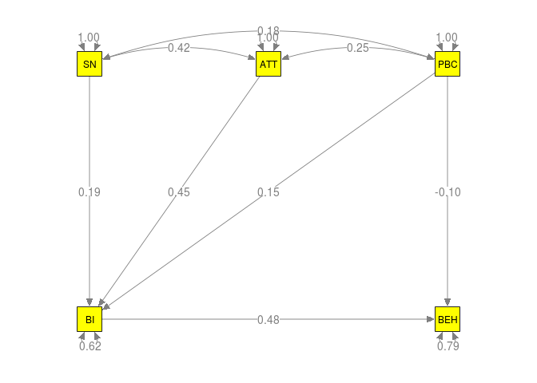
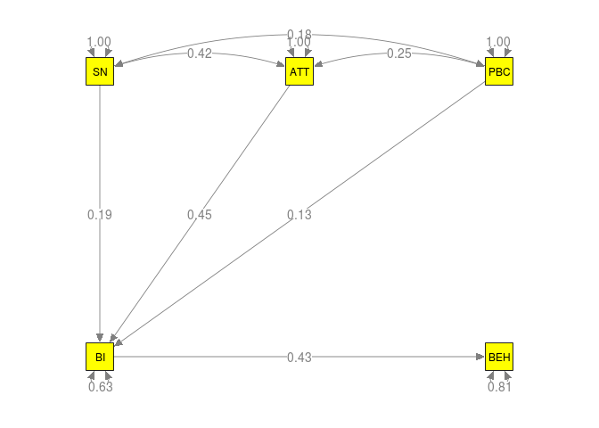

# Illustration of MASEM: Theory of planned behavior
Mike Cheung and Ryan Hong  
`r format(Sys.Date(), "%B %d, %Y")`  

This file includes examples used in Cheung and Hong (in press):
Cheung, M. W.-L., & Hong, R. Y. (in press). Applications of meta-analytic structural equation modeling in health psychology: Examples, issues, and recommendations. *Health Psychology Review*.

# Displaying some descriptive statistics of the data

```r
## Load the libraries required for the analysis
library("metaSEM")
library("semPlot")

## Read the data
# source("Cooke16.R")

## Check whether the correlation matrices are valid (positive definite)
## Since the correlation matrix in Study 3 is not valid, we excluded it from the analyses.
is.pd(Cooke16$data)
```

```
##                     Ajzen and Sheikh (2013) 
##                                        TRUE 
##         Armitage, Norman, and Conner (2002) 
##                                        TRUE 
## Conner, Warren, Close, and Sparks (1999a) 1 
##                                       FALSE 
## Conner, Warren, Close, and Sparks (1999a) 2 
##                                        TRUE 
## Conner, Warren, Close, and Sparks (1999a) 3 
##                                        TRUE 
## Conner, Warren, Close, and Sparks (1999b) 1 
##                                        TRUE 
## Conner, Warren, Close, and Sparks (1999b) 2 
##                                        TRUE 
##   Conner, Warren, Close, and Sparks (1999c) 
##                                        TRUE 
##                    Cooke and French (2011a) 
##                                        TRUE 
##                    Cooke and French (2011b) 
##                                        TRUE 
##          Cooke, Sniehotta and Schuez (2007) 
##                                        TRUE 
##               Elliot and Ainsworth (2012) 1 
##                                        TRUE 
##               Elliot and Ainsworth (2012) 2 
##                                        TRUE 
##               Elliot and Ainsworth (2012) 3 
##                                        TRUE 
##               Elliot and Ainsworth (2012) 4 
##                                        TRUE 
##                       Gagnon, et al. (2012) 
##                                        TRUE 
##        Gardner, de Bruijn, and Lally (2012) 
##                                        TRUE 
##                    Glassman, et al. (2010a) 
##                                        TRUE 
##                    Glassman, et al. (2010b) 
##                                        TRUE 
##                    Glassman, et al. (2010c) 
##                                        TRUE 
##                    Glassman, et al. (2010d) 
##                                        TRUE 
##                       Hagger, et al. (2012) 
##                                        TRUE 
##                    Jamison and Myers (2008) 
##                                        TRUE 
##                   Johnston and White (2003) 
##                                        TRUE 
##                         Kim and Hong (2013) 
##                                        TRUE 
##                             Norman (2011) 1 
##                                        TRUE 
##                             Norman (2011) 2 
##                                        TRUE 
##                             Norman (2011) 3 
##                                        TRUE 
##                             Norman (2011) 4 
##                                        TRUE 
##      Norman, Armitage, and Quigley (2007) 1 
##                                        TRUE 
##      Norman, Armitage, and Quigley (2007) 2 
##                                        TRUE 
##                    Norman and Conner (2006) 
##                                        TRUE 
##         Norman, Conner, and Stride (2012) 1 
##                                        TRUE 
##         Norman, Conner, and Stride (2012) 2 
##                                        TRUE
```

```r
## Since the correlation matrix in Study 3 is not positive definite,
## we may exclude it the following analyses
my.data <- Cooke16$data[-3]
my.n <- Cooke16$n[-3]

## Show the no. of studies per correlation
pattern.na(my.data, show.na = FALSE)
```

```
##     SN ATT PBC BI BEH
## SN  33  33  33 29  19
## ATT 33  33  33 29  19
## PBC 33  33  33 29  19
## BI  29  29  29 29  19
## BEH 19  19  19 19  19
```

```r
## Show the total sample sizes per correlation
pattern.n(my.data, my.n)
```

```
##       SN  ATT  PBC   BI  BEH
## SN  7973 7973 7973 7227 3628
## ATT 7973 7973 7973 7227 3628
## PBC 7973 7973 7973 7227 3628
## BI  7227 7227 7227 7227 3628
## BEH 3628 3628 3628 3628 3628
```

# Stage 1 analysis

```r
## Fixed-effects model: method="FEM"
fixed1 <- tssem1(my.data, my.n, method="FEM")
summary(fixed1)
```

```
## 
## Call:
## tssem1FEM(my.df = my.df, n = n, cor.analysis = cor.analysis, 
##     model.name = model.name, cluster = cluster, suppressWarnings = suppressWarnings, 
##     silent = silent, run = run)
## 
## Coefficients:
##         Estimate Std.Error z value  Pr(>|z|)    
## S[1,2] 0.4214478 0.0093858 44.9029 < 2.2e-16 ***
## S[1,3] 0.2368401 0.0107845 21.9612 < 2.2e-16 ***
## S[1,4] 0.4728029 0.0091735 51.5399 < 2.2e-16 ***
## S[1,5] 0.1686525 0.0161884 10.4181 < 2.2e-16 ***
## S[2,3] 0.2924019 0.0105892 27.6131 < 2.2e-16 ***
## S[2,4] 0.5461977 0.0084691 64.4929 < 2.2e-16 ***
## S[2,5] 0.2030472 0.0158716 12.7931 < 2.2e-16 ***
## S[3,4] 0.3623555 0.0104896 34.5442 < 2.2e-16 ***
## S[3,5] 0.0613639 0.0170263  3.6041 0.0003133 ***
## S[4,5] 0.3934428 0.0153318 25.6618 < 2.2e-16 ***
## ---
## Signif. codes:  0 '***' 0.001 '**' 0.01 '*' 0.05 '.' 0.1 ' ' 1
## 
## Goodness-of-fit indices:
##                                      Value
## Sample size                      7973.0000
## Chi-square of target model       3372.5637
## DF of target model                252.0000
## p value of target model             0.0000
## Chi-square of independence model 9819.9708
## DF of independence model          262.0000
## RMSEA                               0.2264
## RMSEA lower 95% CI                  0.2201
## RMSEA upper 95% CI                  0.2337
## SRMR                                0.1992
## TLI                                 0.6606
## CFI                                 0.6735
## AIC                              2868.5637
## BIC                              1108.6421
## OpenMx status1: 0 ("0" or "1": The optimization is considered fine.
## Other values may indicate problems.)
```

```r
## Common correlation matrix under a fixed-effects model
coef(fixed1)
```

```
##            SN       ATT       PBC        BI       BEH
## SN  1.0000000 0.4214478 0.2368401 0.4728029 0.1686525
## ATT 0.4214478 1.0000000 0.2924019 0.5461977 0.2030472
## PBC 0.2368401 0.2924019 1.0000000 0.3623555 0.0613639
## BI  0.4728029 0.5461977 0.3623555 1.0000000 0.3934428
## BEH 0.1686525 0.2030472 0.0613639 0.3934428 1.0000000
```

```r
## Random-effects model
random1 <- tssem1(my.data, my.n, method="REM", RE.type="Diag")
summary(random1)
```

```
## 
## Call:
## meta(y = ES, v = acovR, RE.constraints = Diag(x = paste(RE.startvalues, 
##     "*Tau2_", 1:no.es, "_", 1:no.es, sep = "")), RE.lbound = RE.lbound, 
##     I2 = I2, model.name = model.name, suppressWarnings = TRUE, 
##     silent = silent, run = run)
## 
## 95% confidence intervals: z statistic approximation
## Coefficients:
##               Estimate  Std.Error     lbound     ubound z value  Pr(>|z|)
## Intercept1   0.4200803  0.0283378  0.3645393  0.4756213 14.8240 < 2.2e-16
## Intercept2   0.1760095  0.0356971  0.1060444  0.2459746  4.9306 8.196e-07
## Intercept3   0.4095000  0.0287724  0.3531071  0.4658929 14.2324 < 2.2e-16
## Intercept4   0.1608071  0.0462024  0.0702521  0.2513622  3.4805 0.0005005
## Intercept5   0.2540752  0.0465866  0.1627672  0.3453831  5.4538 4.930e-08
## Intercept6   0.5623700  0.0326337  0.4984091  0.6263309 17.2328 < 2.2e-16
## Intercept7   0.2781562  0.0530788  0.1741236  0.3821889  5.2404 1.602e-07
## Intercept8   0.2985260  0.0598783  0.1811668  0.4158852  4.9855 6.179e-07
## Intercept9   0.0385757  0.0782508 -0.1147929  0.1919444  0.4930 0.6220296
## Intercept10  0.4280688  0.0736125  0.2837910  0.5723466  5.8152 6.057e-09
## Tau2_1_1     0.0226389  0.0065919  0.0097191  0.0355588  3.4344 0.0005939
## Tau2_2_2     0.0369123  0.0100773  0.0171612  0.0566634  3.6629 0.0002494
## Tau2_3_3     0.0200702  0.0063447  0.0076348  0.0325056  3.1633 0.0015600
## Tau2_4_4     0.0352121  0.0125255  0.0106626  0.0597616  2.8112 0.0049351
## Tau2_5_5     0.0671042  0.0175074  0.0327904  0.1014181  3.8329 0.0001266
## Tau2_6_6     0.0284970  0.0079681  0.0128797  0.0441142  3.5764 0.0003484
## Tau2_7_7     0.0490049  0.0169657  0.0157528  0.0822571  2.8885 0.0038712
## Tau2_8_8     0.1001031  0.0272638  0.0466669  0.1535393  3.6716 0.0002410
## Tau2_9_9     0.1113731  0.0372766  0.0383122  0.1844339  2.9877 0.0028104
## Tau2_10_10   0.0997398  0.0330917  0.0348812  0.1645984  3.0140 0.0025779
##                
## Intercept1  ***
## Intercept2  ***
## Intercept3  ***
## Intercept4  ***
## Intercept5  ***
## Intercept6  ***
## Intercept7  ***
## Intercept8  ***
## Intercept9     
## Intercept10 ***
## Tau2_1_1    ***
## Tau2_2_2    ***
## Tau2_3_3    ** 
## Tau2_4_4    ** 
## Tau2_5_5    ***
## Tau2_6_6    ***
## Tau2_7_7    ** 
## Tau2_8_8    ***
## Tau2_9_9    ** 
## Tau2_10_10  ** 
## ---
## Signif. codes:  0 '***' 0.001 '**' 0.01 '*' 0.05 '.' 0.1 ' ' 1
## 
## Q statistic on the homogeneity of effect sizes: 6627.499
## Degrees of freedom of the Q statistic: 252
## P value of the Q statistic: 0
## 
## Heterogeneity indices (based on the estimated Tau2):
##                               Estimate
## Intercept1: I2 (Q statistic)    0.9000
## Intercept2: I2 (Q statistic)    0.9160
## Intercept3: I2 (Q statistic)    0.8897
## Intercept4: I2 (Q statistic)    0.9012
## Intercept5: I2 (Q statistic)    0.9592
## Intercept6: I2 (Q statistic)    0.9502
## Intercept7: I2 (Q statistic)    0.9317
## Intercept8: I2 (Q statistic)    0.9755
## Intercept9: I2 (Q statistic)    0.9691
## Intercept10: I2 (Q statistic)   0.9803
## 
## Number of studies (or clusters): 33
## Number of observed statistics: 262
## Number of estimated parameters: 20
## Degrees of freedom: 242
## -2 log likelihood: -32.2498 
## OpenMx status1: 0 ("0" or "1": The optimization is considered fine.
## Other values may indicate problems.)
```

```r
## Average correlation matrix under a random-effects model
vec2symMat(coef(random1, select="fixed"), diag = FALSE)
```

```
##           [,1]      [,2]       [,3]      [,4]       [,5]
## [1,] 1.0000000 0.4200803 0.17600953 0.4095000 0.16080712
## [2,] 0.4200803 1.0000000 0.25407515 0.5623700 0.27815623
## [3,] 0.1760095 0.2540752 1.00000000 0.2985260 0.03857574
## [4,] 0.4095000 0.5623700 0.29852601 1.0000000 0.42806880
## [5,] 0.1608071 0.2781562 0.03857574 0.4280688 1.00000000
```

# Stage 2 analysis: original model (Model A)
* The models are specified in the [RAM formulation](http://openmx.psyc.virginia.edu/docs/OpenMx/latest/Examples_Matrix.html). Matrices `A`, `S` and `F` represent the regression coefficients, variance-covariance matrix of variables, and selection matrix of the latent variables, respectively. We may skip the `F` matrix when there is no latent variable.
* Consider the element `SN2BI` in `A1` as an example. It is the regression coefficient from `SN` to `BI` with a starting value of 0.2.

```r
A1 <- create.mxMatrix(c(0,0,0,0,0,
                        0,0,0,0,0,
                        0,0,0,0,0,
                        "0.2*SN2BI","0.2*ATT2BI","0.2*PBC2BI",0,0,
                        0,0,"0.2*PBC2BEH","0.2*BI2BEH",0),
                        type="Full", ncol=5, nrow=5,
                        byrow=TRUE, as.mxMatrix=FALSE)

## This step is not necessary but it is useful for inspecting the model.
dimnames(A1)[[1]] <- dimnames(A1)[[2]] <- colnames(Cooke16$data[[1]])

## Display A1
A1
```

```
##     SN          ATT          PBC           BI           BEH
## SN  "0"         "0"          "0"           "0"          "0"
## ATT "0"         "0"          "0"           "0"          "0"
## PBC "0"         "0"          "0"           "0"          "0"
## BI  "0.2*SN2BI" "0.2*ATT2BI" "0.2*PBC2BI"  "0"          "0"
## BEH "0"         "0"          "0.2*PBC2BEH" "0.2*BI2BEH" "0"
```

```r
S1 <- create.mxMatrix(c(1,
                        "0.1*ATT_SN", 1,
                        "0.1*PBC_SN", "0.1*PBC_ATT", 1,
                        0, 0, 0, "0.5*VarBI",
                        0, 0, 0, 0, "0.5*VarBEH"),
                      type = "Symm", ncol=5, nrow=5,
                      byrow=TRUE, as.mxMatrix=FALSE)

dimnames(S1)[[1]] <- dimnames(S1)[[2]] <- colnames(Cooke16$data[[1]])
S1
```

```
##     SN           ATT           PBC           BI          BEH         
## SN  "1"          "0.1*ATT_SN"  "0.1*PBC_SN"  "0"         "0"         
## ATT "0.1*ATT_SN" "1"           "0.1*PBC_ATT" "0"         "0"         
## PBC "0.1*PBC_SN" "0.1*PBC_ATT" "1"           "0"         "0"         
## BI  "0"          "0"           "0"           "0.5*VarBI" "0"         
## BEH "0"          "0"           "0"           "0"         "0.5*VarBEH"
```

* The columns `lbound` and `ubound` are the lower and upper bounds of the 95% confidence intervals. If they include 0, the parameter estimates are not statistically significant at $\alpha=.05$.

```r
ModelA <- tssem2(random1, Amatrix=A1, Smatrix=S1, diag.constraints=TRUE, intervals.type="LB")
summary(ModelA)
```

```
## 
## Call:
## wls(Cov = pooledS, asyCov = asyCov, n = tssem1.obj$total.n, Amatrix = Amatrix, 
##     Smatrix = Smatrix, Fmatrix = Fmatrix, diag.constraints = diag.constraints, 
##     cor.analysis = cor.analysis, intervals.type = intervals.type, 
##     mx.algebras = mx.algebras, model.name = model.name, suppressWarnings = suppressWarnings, 
##     silent = silent, run = run)
## 
## 95% confidence intervals: Likelihood-based statistic
## Coefficients:
##          Estimate Std.Error    lbound    ubound z value Pr(>|z|)
## SN2BI    0.191328        NA  0.111581  0.267447      NA       NA
## ATT2BI   0.449443        NA  0.361769  0.535924      NA       NA
## PBC2BI   0.151839        NA  0.015280  0.284518      NA       NA
## PBC2BEH -0.100206        NA -0.294226  0.081172      NA       NA
## BI2BEH   0.476466        NA  0.343550  0.618420      NA       NA
## ATT_SN   0.420175        NA  0.364633  0.475716      NA       NA
## PBC_SN   0.176849        NA  0.106965  0.246703      NA       NA
## PBC_ATT  0.251642        NA  0.160458  0.342905      NA       NA
## VarBI    0.621456        NA  0.543098  0.688221      NA       NA
## VarBEH   0.791469        NA  0.657920  0.883379      NA       NA
## 
## Goodness-of-fit indices:
##                                                Value
## Sample size                                7973.0000
## Chi-square of target model                    0.6250
## DF of target model                            2.0000
## p value of target model                       0.7316
## Number of constraints imposed on "Smatrix"    2.0000
## DF manually adjusted                          0.0000
## Chi-square of independence model            782.6452
## DF of independence model                     10.0000
## RMSEA                                         0.0000
## RMSEA lower 95% CI                            0.0000
## RMSEA upper 95% CI                            0.0157
## SRMR                                          0.0131
## TLI                                           1.0089
## CFI                                           1.0000
## AIC                                          -3.3750
## BIC                                         -17.3427
## OpenMx status1: 0 ("0" or "1": The optimization is considered fine.
## Other values indicate problems.)
```

* To facilitate the interpretations, we may print the model with the parameter estimates using the `semPlot` package.

```r
## Convert the model to semPlotModel object
my.plota <- meta2semPlot(ModelA)

## Plot the parameter estimates
semPaths(my.plota, whatLabels="est", edge.label.cex=1, color="yellow")
```

<!-- -->

# Stage 2 analysis: no direct effect from PBC (Model C)

```r
## Delete the direct effect from PBC to BEH
A2 <- create.mxMatrix(c(0,0,0,0,0,
                        0,0,0,0,0,
                        0,0,0,0,0,
                        "0.2*SN2BI","0.2*ATT2BI","0.2*PBC2BI",0,0,
                        0,0,0,"0.2*BI2BEH",0),
                        type="Full", ncol=5, nrow=5,
                        byrow=TRUE, as.mxMatrix=FALSE)

## This step is not necessary but it is useful for inspecting the model.
dimnames(A2)[[1]] <- dimnames(A2)[[2]] <- colnames(Cooke16$data[[1]])

## Display A1
A2
```

```
##     SN          ATT          PBC          BI           BEH
## SN  "0"         "0"          "0"          "0"          "0"
## ATT "0"         "0"          "0"          "0"          "0"
## PBC "0"         "0"          "0"          "0"          "0"
## BI  "0.2*SN2BI" "0.2*ATT2BI" "0.2*PBC2BI" "0"          "0"
## BEH "0"         "0"          "0"          "0.2*BI2BEH" "0"
```

```r
ModelC <- tssem2(random1, Amatrix=A2, Smatrix=S1, diag.constraints=TRUE, intervals.type="LB")
summary(ModelC)
```

```
## 
## Call:
## wls(Cov = pooledS, asyCov = asyCov, n = tssem1.obj$total.n, Amatrix = Amatrix, 
##     Smatrix = Smatrix, Fmatrix = Fmatrix, diag.constraints = diag.constraints, 
##     cor.analysis = cor.analysis, intervals.type = intervals.type, 
##     mx.algebras = mx.algebras, model.name = model.name, suppressWarnings = suppressWarnings, 
##     silent = silent, run = run)
## 
## 95% confidence intervals: Likelihood-based statistic
## Coefficients:
##           Estimate Std.Error     lbound     ubound z value Pr(>|z|)
## SN2BI    0.1942871        NA  0.1144419  0.2704321      NA       NA
## ATT2BI   0.4530917        NA  0.3650477  0.5398159      NA       NA
## PBC2BI   0.1293778        NA -0.0010325  0.2562694      NA       NA
## BI2BEH   0.4301733        NA  0.3276167  0.5340960      NA       NA
## ATT_SN   0.4201689        NA  0.3646283  0.4757119      NA       NA
## PBC_SN   0.1759434        NA  0.1059759  0.2459079      NA       NA
## PBC_ATT  0.2543738        NA  0.1630667  0.3456844      NA       NA
## VarBI    0.6275790        NA  0.5525930  0.6925185      NA       NA
## VarBEH   0.8149510        NA  0.7147508  0.8928874      NA       NA
## 
## Goodness-of-fit indices:
##                                                Value
## Sample size                                7973.0000
## Chi-square of target model                    1.7699
## DF of target model                            3.0000
## p value of target model                       0.6215
## Number of constraints imposed on "Smatrix"    2.0000
## DF manually adjusted                          0.0000
## Chi-square of independence model            782.6452
## DF of independence model                     10.0000
## RMSEA                                         0.0000
## RMSEA lower 95% CI                            0.0000
## RMSEA upper 95% CI                            0.0154
## SRMR                                          0.0290
## TLI                                           1.0053
## CFI                                           1.0000
## AIC                                          -4.2301
## BIC                                         -25.1816
## OpenMx status1: 0 ("0" or "1": The optimization is considered fine.
## Other values indicate problems.)
```

```r
## Convert the model to semPlotModel object
my.plotc <- meta2semPlot(ModelC)

## Plot the parameter estimates
semPaths(my.plotc, whatLabels="est", edge.label.cex=1, color="yellow")
```

<!-- -->

# Stage 2 analysis: all direct effects (Model B)

```r
## Delete the direct effect from PBC to BEH
A3 <- create.mxMatrix(c(0,0,0,0,0,
                        0,0,0,0,0,
                        0,0,0,0,0,
                        "0.2*SN2BI","0.2*ATT2BI","0.2*PBC2BI",0,0,
                        "0.2*SN2BEH","0.2*ATT2BEH","0.2*PBC2BEH","0.2*BI2BEH",0),
                        type="Full", ncol=5, nrow=5,
                        byrow=TRUE, as.mxMatrix=FALSE)

## This step is not necessary but it is useful for inspecting the model.
dimnames(A3)[[1]] <- dimnames(A3)[[2]] <- colnames(Cooke16$data[[1]])

## Display A1
A3
```

```
##     SN           ATT           PBC           BI           BEH
## SN  "0"          "0"           "0"           "0"          "0"
## ATT "0"          "0"           "0"           "0"          "0"
## PBC "0"          "0"           "0"           "0"          "0"
## BI  "0.2*SN2BI"  "0.2*ATT2BI"  "0.2*PBC2BI"  "0"          "0"
## BEH "0.2*SN2BEH" "0.2*ATT2BEH" "0.2*PBC2BEH" "0.2*BI2BEH" "0"
```

* We may calculate functions of parameters with the `mx.algebras` argument. In this example, we calculate the indirect and direct effects. After the analysis, 95% CI on the indirect and direct effects are estimated.

```r
ModelB <- tssem2(random1, Amatrix=A3, Smatrix=S1, diag.constraints=TRUE, intervals.type="LB",
                 mx.algebras=list(indirect=mxAlgebra((SN2BI+ATT2BI+PBC2BI)*BI2BEH, name="indirect"),
                                  direct=mxAlgebra(SN2BEH+ATT2BEH+PBC2BEH, name="direct")))
summary(ModelB)
```

```
## 
## Call:
## wls(Cov = pooledS, asyCov = asyCov, n = tssem1.obj$total.n, Amatrix = Amatrix, 
##     Smatrix = Smatrix, Fmatrix = Fmatrix, diag.constraints = diag.constraints, 
##     cor.analysis = cor.analysis, intervals.type = intervals.type, 
##     mx.algebras = mx.algebras, model.name = model.name, suppressWarnings = suppressWarnings, 
##     silent = silent, run = run)
## 
## 95% confidence intervals: Likelihood-based statistic
## Coefficients:
##          Estimate Std.Error    lbound    ubound z value Pr(>|z|)
## SN2BI    0.197620        NA  0.115813  0.275563      NA       NA
## ATT2BI   0.440798        NA  0.349554  0.530085      NA       NA
## PBC2BI   0.151747        NA  0.016496  0.283172      NA       NA
## SN2BEH  -0.027947        NA -0.162520  0.102502      NA       NA
## ATT2BEH  0.075530        NA -0.128632  0.270610      NA       NA
## PBC2BEH -0.103440        NA -0.293783  0.076180      NA       NA
## BI2BEH   0.427917        NA  0.182890  0.681224      NA       NA
## ATT_SN   0.420080        NA  0.364540  0.475621      NA       NA
## PBC_SN   0.176010        NA  0.106044  0.245980      NA       NA
## PBC_ATT  0.254075        NA  0.162768  0.345383      NA       NA
## VarBI    0.625882        NA  0.547068  0.692931      NA       NA
## VarBEH   0.804297        NA  0.639227  0.903561      NA       NA
## 
## mxAlgebras objects (and their 95% likelihood-based CIs):
##                   lbound    Estimate    ubound
## indirect[1,1]  0.1429922  0.33812515 0.5693834
## direct[1,1]   -0.3522901 -0.05585679 0.2151004
## 
## Goodness-of-fit indices:
##                                              Value
## Sample size                                7973.00
## Chi-square of target model                    0.00
## DF of target model                            0.00
## p value of target model                       0.00
## Number of constraints imposed on "Smatrix"    2.00
## DF manually adjusted                          0.00
## Chi-square of independence model            782.65
## DF of independence model                     10.00
## RMSEA                                         0.00
## RMSEA lower 95% CI                            0.00
## RMSEA upper 95% CI                            0.00
## SRMR                                          0.00
## TLI                                           -Inf
## CFI                                           1.00
## AIC                                           0.00
## BIC                                           0.00
## OpenMx status1: 0 ("0" or "1": The optimization is considered fine.
## Other values indicate problems.)
```

```r
## Convert the model to semPlotModel object
my.plotb <- meta2semPlot(ModelB)

## Plot the parameter estimates
semPaths(my.plotb, whatLabels="est", edge.label.cex=1, color="yellow")
```

<!-- -->

```r
## Settings of R for the analysis
sessionInfo()
```

```
## R version 3.3.1 (2016-06-21)
## Platform: x86_64-pc-linux-gnu (64-bit)
## Running under: Linux Mint 18
## 
## locale:
##  [1] LC_CTYPE=en_SG.UTF-8       LC_NUMERIC=C              
##  [3] LC_TIME=en_SG.UTF-8        LC_COLLATE=en_SG.UTF-8    
##  [5] LC_MONETARY=en_SG.UTF-8    LC_MESSAGES=en_SG.UTF-8   
##  [7] LC_PAPER=en_SG.UTF-8       LC_NAME=C                 
##  [9] LC_ADDRESS=C               LC_TELEPHONE=C            
## [11] LC_MEASUREMENT=en_SG.UTF-8 LC_IDENTIFICATION=C       
## 
## attached base packages:
## [1] parallel  stats     graphics  grDevices utils     datasets  methods  
## [8] base     
## 
## other attached packages:
## [1] semPlot_1.0.1      metaSEM_0.9.11-5   OpenMx_2.6.9      
## [4] Rcpp_0.12.7        Matrix_1.2-7.1     MASS_7.3-45       
## [7] digest_0.6.10      rmarkdown_1.0.9015
## 
## loaded via a namespace (and not attached):
##  [1] splines_3.3.1        ellipse_0.3-8        gtools_3.5.0        
##  [4] network_1.13.0       Formula_1.2-1        assertthat_0.1      
##  [7] stats4_3.3.1         latticeExtra_0.6-28  d3Network_0.5.2.1   
## [10] yaml_2.1.13          lisrelToR_0.1.4      pbivnorm_0.6.0      
## [13] lattice_0.20-34      quantreg_5.29        quadprog_1.5-5      
## [16] chron_2.3-47         RColorBrewer_1.1-2   ggm_2.3             
## [19] minqa_1.2.4          colorspace_1.2-6     htmltools_0.3.5     
## [22] plyr_1.8.4           psych_1.6.9          XML_3.98-1.4        
## [25] SparseM_1.72         corpcor_1.6.8        scales_0.4.0        
## [28] whisker_0.3-2        glasso_1.8           sna_2.4             
## [31] jpeg_0.1-8           fdrtool_1.2.15       lme4_1.1-12         
## [34] MatrixModels_0.4-1   huge_1.2.7           arm_1.9-1           
## [37] tibble_1.2           rockchalk_1.8.101    mgcv_1.8-15         
## [40] car_2.1-3            ggplot2_2.1.0        nnet_7.3-12         
## [43] pbkrtest_0.4-6       mnormt_1.5-4         survival_2.39-5     
## [46] magrittr_1.5         statnet.common_3.3.0 evaluate_0.9        
## [49] nlme_3.1-128         foreign_0.8-67       tools_3.3.1         
## [52] data.table_1.9.6     formatR_1.4          stringr_1.1.0       
## [55] munsell_0.4.3        cluster_2.0.4        sem_3.1-8           
## [58] grid_3.3.1           nloptr_1.0.4         rjson_0.2.15        
## [61] igraph_1.0.1         lavaan_0.5-22        boot_1.3-18         
## [64] mi_1.0               gtable_0.2.0         abind_1.4-5         
## [67] reshape2_1.4.1       qgraph_1.3.5         gridExtra_2.2.1     
## [70] knitr_1.14           Hmisc_3.17-4         stringi_1.1.1       
## [73] matrixcalc_1.0-3     rpart_4.1-10         acepack_1.3-3.3     
## [76] png_0.1-7            coda_0.18-1
```
