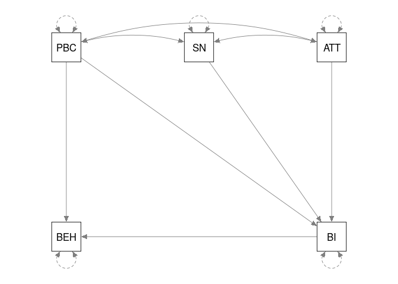
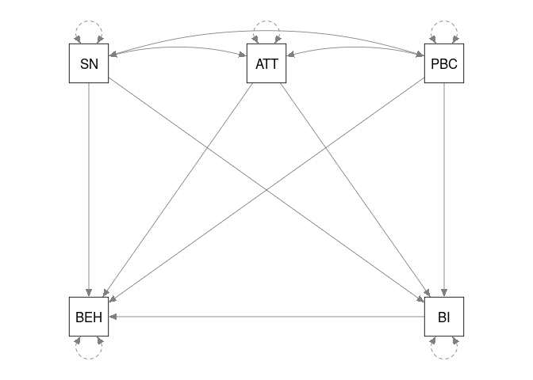

This file includes examples used in Cheung and Hong (2017):
Cheung, M. W.-L., & Hong, R. Y. (2017). Applications of meta-analytic structural equation modeling in health psychology: Examples, issues, and recommendations. *Health Psychology Review*, *11*(3), 265-279. http://doi.org/10.1080/17437199.2017.1343678

# Displaying some descriptive statistics of the data

```r
## Load the library required for the analysis
library("metaSEM")

## Check whether the correlation matrices are valid (positive definite)
## Since the correlation matrix in Study 3 is not valid, we excluded it from the analyses.
is.pd(Cooke16$data)
```

```
##                     Ajzen and Sheikh (2013) 
##                                        TRUE 
##         Armitage, Norman, and Conner (2002) 
##                                        TRUE 
## Conner, Warren, Close, and Sparks (1999a) 1 
##                                       FALSE 
## Conner, Warren, Close, and Sparks (1999a) 2 
##                                        TRUE 
## Conner, Warren, Close, and Sparks (1999a) 3 
##                                        TRUE 
## Conner, Warren, Close, and Sparks (1999b) 1 
##                                        TRUE 
## Conner, Warren, Close, and Sparks (1999b) 2 
##                                        TRUE 
##   Conner, Warren, Close, and Sparks (1999c) 
##                                        TRUE 
##                    Cooke and French (2011a) 
##                                        TRUE 
##                    Cooke and French (2011b) 
##                                        TRUE 
##          Cooke, Sniehotta and Schuez (2007) 
##                                        TRUE 
##               Elliot and Ainsworth (2012) 1 
##                                        TRUE 
##               Elliot and Ainsworth (2012) 2 
##                                        TRUE 
##               Elliot and Ainsworth (2012) 3 
##                                        TRUE 
##               Elliot and Ainsworth (2012) 4 
##                                        TRUE 
##                       Gagnon, et al. (2012) 
##                                        TRUE 
##        Gardner, de Bruijn, and Lally (2012) 
##                                        TRUE 
##                    Glassman, et al. (2010a) 
##                                        TRUE 
##                    Glassman, et al. (2010b) 
##                                        TRUE 
##                    Glassman, et al. (2010c) 
##                                        TRUE 
##                    Glassman, et al. (2010d) 
##                                        TRUE 
##                       Hagger, et al. (2012) 
##                                        TRUE 
##                    Jamison and Myers (2008) 
##                                        TRUE 
##                   Johnston and White (2003) 
##                                        TRUE 
##                         Kim and Hong (2013) 
##                                        TRUE 
##                             Norman (2011) 1 
##                                        TRUE 
##                             Norman (2011) 2 
##                                        TRUE 
##                             Norman (2011) 3 
##                                        TRUE 
##                             Norman (2011) 4 
##                                        TRUE 
##      Norman, Armitage, and Quigley (2007) 1 
##                                        TRUE 
##      Norman, Armitage, and Quigley (2007) 2 
##                                        TRUE 
##                    Norman and Conner (2006) 
##                                        TRUE 
##         Norman, Conner, and Stride (2012) 1 
##                                        TRUE 
##         Norman, Conner, and Stride (2012) 2 
##                                        TRUE
```

```r
## Since the correlation matrix in Study 3 is not positive definite,
## we may exclude it the following analyses
my.data <- Cooke16$data[-3]
my.n <- Cooke16$n[-3]

## Show the no. of studies per correlation
pattern.na(my.data, show.na = FALSE)
```

```
##     SN ATT PBC BI BEH
## SN  33  33  33 29  19
## ATT 33  33  33 29  19
## PBC 33  33  33 29  19
## BI  29  29  29 29  19
## BEH 19  19  19 19  19
```

```r
## Show the total sample sizes per correlation
pattern.n(my.data, my.n)
```

```
##       SN  ATT  PBC   BI  BEH
## SN  7973 7973 7973 7227 3628
## ATT 7973 7973 7973 7227 3628
## PBC 7973 7973 7973 7227 3628
## BI  7227 7227 7227 7227 3628
## BEH 3628 3628 3628 3628 3628
```

# Stage 1 analysis

```r
## Fixed-effects model: method="FEM"
fixed1 <- tssem1(my.data, my.n, method="FEM")
summary(fixed1)
```

```
## 
## Call:
## tssem1FEM(Cov = Cov, n = n, cor.analysis = cor.analysis, model.name = model.name, 
##     cluster = cluster, suppressWarnings = suppressWarnings, silent = silent, 
##     run = run)
## 
## Coefficients:
##         Estimate Std.Error z value  Pr(>|z|)    
## S[1,2] 0.4214478 0.0093843 44.9100 < 2.2e-16 ***
## S[1,3] 0.2368401 0.0107832 21.9638 < 2.2e-16 ***
## S[1,4] 0.4728029 0.0091714 51.5517 < 2.2e-16 ***
## S[1,5] 0.1686525 0.0161876 10.4186 < 2.2e-16 ***
## S[2,3] 0.2924019 0.0105879 27.6166 < 2.2e-16 ***
## S[2,4] 0.5461977 0.0084676 64.5042 < 2.2e-16 ***
## S[2,5] 0.2030472 0.0158711 12.7935 < 2.2e-16 ***
## S[3,4] 0.3623555 0.0104882 34.5488 < 2.2e-16 ***
## S[3,5] 0.0613639 0.0170260  3.6041 0.0003132 ***
## S[4,5] 0.3934428 0.0153311 25.6630 < 2.2e-16 ***
## ---
## Signif. codes:  0 '***' 0.001 '**' 0.01 '*' 0.05 '.' 0.1 ' ' 1
## 
## Goodness-of-fit indices:
##                                      Value
## Sample size                      7973.0000
## Chi-square of target model       3372.5637
## DF of target model                252.0000
## p value of target model             0.0000
## Chi-square of independence model 9819.9708
## DF of independence model          262.0000
## RMSEA                               0.2264
## RMSEA lower 95% CI                  0.2201
## RMSEA upper 95% CI                  0.2337
## SRMR                                0.1992
## TLI                                 0.6606
## CFI                                 0.6735
## AIC                              2868.5637
## BIC                              1108.6421
## OpenMx status1: 0 ("0" or "1": The optimization is considered fine.
## Other values may indicate problems.)
```

```r
## Common correlation matrix under a fixed-effects model
coef(fixed1)
```

```
##            SN       ATT       PBC        BI       BEH
## SN  1.0000000 0.4214478 0.2368401 0.4728029 0.1686525
## ATT 0.4214478 1.0000000 0.2924019 0.5461977 0.2030472
## PBC 0.2368401 0.2924019 1.0000000 0.3623555 0.0613639
## BI  0.4728029 0.5461977 0.3623555 1.0000000 0.3934428
## BEH 0.1686525 0.2030472 0.0613639 0.3934428 1.0000000
```

```r
## Random-effects model
random1 <- tssem1(my.data, my.n, method="REM", RE.type="Diag")
summary(random1)
```

```
## 
## Call:
## meta(y = ES, v = acovR, RE.constraints = Diag(paste0(RE.startvalues, 
##     "*Tau2_", 1:no.es, "_", 1:no.es)), RE.lbound = RE.lbound, 
##     I2 = I2, model.name = model.name, suppressWarnings = TRUE, 
##     silent = silent, run = run)
## 
## 95% confidence intervals: z statistic approximation (robust=FALSE)
## Coefficients:
##               Estimate  Std.Error     lbound     ubound z value  Pr(>|z|)
## Intercept1   0.4160786  0.0290461  0.3591492  0.4730079 14.3248 < 2.2e-16
## Intercept2   0.1819517  0.0337283  0.1158454  0.2480580  5.3946 6.867e-08
## Intercept3   0.4103474  0.0292481  0.3530221  0.4676727 14.0299 < 2.2e-16
## Intercept4   0.1571082  0.0462777  0.0664055  0.2478108  3.3949 0.0006865
## Intercept5   0.2520239  0.0454915  0.1628623  0.3411856  5.5400 3.024e-08
## Intercept6   0.5622006  0.0325187  0.4984651  0.6259361 17.2885 < 2.2e-16
## Intercept7   0.2788657  0.0536501  0.1737134  0.3840180  5.1979 2.016e-07
## Intercept8   0.2978187  0.0586302  0.1829056  0.4127318  5.0796 3.782e-07
## Intercept9   0.0348951  0.0780574 -0.1180947  0.1878849  0.4470 0.6548434
## Intercept10  0.4306070  0.0734985  0.2865526  0.5746614  5.8587 4.664e-09
## Tau2_1_1     0.0237208  0.0068522  0.0102908  0.0371509  3.4618 0.0005366
## Tau2_2_2     0.0321573  0.0090636  0.0143930  0.0499215  3.5480 0.0003882
## Tau2_3_3     0.0207954  0.0064549  0.0081441  0.0334467  3.2217 0.0012745
## Tau2_4_4     0.0343873  0.0126286  0.0096357  0.0591388  2.7230 0.0064697
## Tau2_5_5     0.0630935  0.0168264  0.0301144  0.0960725  3.7497 0.0001771
## Tau2_6_6     0.0271064  0.0079133  0.0115966  0.0426163  3.4254 0.0006138
## Tau2_7_7     0.0483815  0.0171142  0.0148383  0.0819248  2.8270 0.0046990
## Tau2_8_8     0.0948256  0.0261755  0.0435227  0.1461285  3.6227 0.0002916
## Tau2_9_9     0.1092995  0.0373008  0.0361912  0.1824078  2.9302 0.0033873
## Tau2_10_10   0.0965131  0.0326607  0.0324994  0.1605268  2.9550 0.0031264
##                
## Intercept1  ***
## Intercept2  ***
## Intercept3  ***
## Intercept4  ***
## Intercept5  ***
## Intercept6  ***
## Intercept7  ***
## Intercept8  ***
## Intercept9     
## Intercept10 ***
## Tau2_1_1    ***
## Tau2_2_2    ***
## Tau2_3_3    ** 
## Tau2_4_4    ** 
## Tau2_5_5    ***
## Tau2_6_6    ***
## Tau2_7_7    ** 
## Tau2_8_8    ***
## Tau2_9_9    ** 
## Tau2_10_10  ** 
## ---
## Signif. codes:  0 '***' 0.001 '**' 0.01 '*' 0.05 '.' 0.1 ' ' 1
## 
## Q statistic on the homogeneity of effect sizes: 3122.602
## Degrees of freedom of the Q statistic: 252
## P value of the Q statistic: 0
## 
## Heterogeneity indices (based on the estimated Tau2):
##                               Estimate
## Intercept1: I2 (Q statistic)    0.8895
## Intercept2: I2 (Q statistic)    0.8937
## Intercept3: I2 (Q statistic)    0.8769
## Intercept4: I2 (Q statistic)    0.8911
## Intercept5: I2 (Q statistic)    0.9456
## Intercept6: I2 (Q statistic)    0.9146
## Intercept7: I2 (Q statistic)    0.9211
## Intercept8: I2 (Q statistic)    0.9651
## Intercept9: I2 (Q statistic)    0.9628
## Intercept10: I2 (Q statistic)   0.9601
## 
## Number of studies (or clusters): 33
## Number of observed statistics: 262
## Number of estimated parameters: 20
## Degrees of freedom: 242
## -2 log likelihood: -33.6995 
## OpenMx status1: 0 ("0" or "1": The optimization is considered fine.
## Other values may indicate problems.)
```

```r
## Average correlation matrix under a random-effects model
vec2symMat(coef(random1, select="fixed"), diag = FALSE)
```

```
##           [,1]      [,2]      [,3]      [,4]      [,5]
## [1,] 1.0000000 0.4160786 0.1819517 0.4103474 0.1571082
## [2,] 0.4160786 1.0000000 0.2520239 0.5622006 0.2788657
## [3,] 0.1819517 0.2520239 1.0000000 0.2978187 0.0348951
## [4,] 0.4103474 0.5622006 0.2978187 1.0000000 0.4306070
## [5,] 0.1571082 0.2788657 0.0348951 0.4306070 1.0000000
```

# Stage 2 analysis: original model (Model A)
* The models can specified in the [RAM formulation](http://openmx.psyc.virginia.edu/docs/OpenMx/latest/Examples_Matrix.html). Matrices `A`, `S` and `F` represent the regression coefficients, variance-covariance matrix of variables, and selection matrix of the latent variables, respectively. We may skip the `F` matrix when there is no latent variable.
* Alternatively, we may also use a subset of the [lavaan syntax](http://lavaan.ugent.be/tutorial/syntax1.html).
* Consider the element `SN2BI` in `A1` as an example. It is the regression coefficient from `SN` to `BI` with a starting value of 0.2.

```r
## lavaan synatx
modelA <- "# Regression paths
           BEH ~ BI + PBC
           BI ~ SN + ATT + PBC
           # Fix the variances of independent variables to 1
           SN ~~ 1*SN
           ATT ~~ 1*ATT
           PBC ~~ 1*PBC
           # Free the correlations among the independent variables
           SN ~~ ATT
           SN ~~ PBC
           ATT ~~ PBC"

## Plot the model
plot(modelA)
```

<!-- -->

```r
## Convert the lavaan model to RAM specification
RAMA <- lavaan2RAM(modelA, obs.variables = c("SN", "ATT", "PBC", "BI", "BEH"),
                   A.notation="on", S.notation="with")
RAMA
```

```
## $A
##     SN         ATT         PBC          BI          BEH
## SN  "0"        "0"         "0"          "0"         "0"
## ATT "0"        "0"         "0"          "0"         "0"
## PBC "0"        "0"         "0"          "0"         "0"
## BI  "0*BIonSN" "0*BIonATT" "0*BIonPBC"  "0"         "0"
## BEH "0"        "0"         "0*BEHonPBC" "0*BEHonBI" "0"
## 
## $S
##     SN            ATT            PBC            BI          
## SN  "1"           "0*SNwithATT"  "0*PBCwithSN"  "0"         
## ATT "0*SNwithATT" "1"            "0*PBCwithATT" "0"         
## PBC "0*PBCwithSN" "0*PBCwithATT" "1"            "0"         
## BI  "0"           "0"            "0"            "0*BIwithBI"
## BEH "0"           "0"            "0"            "0"         
##     BEH           
## SN  "0"           
## ATT "0"           
## PBC "0"           
## BI  "0"           
## BEH "0*BEHwithBEH"
## 
## $F
##     SN ATT PBC BI BEH
## SN   1   0   0  0   0
## ATT  0   1   0  0   0
## PBC  0   0   1  0   0
## BI   0   0   0  1   0
## BEH  0   0   0  0   1
## 
## $M
##   SN ATT PBC BI BEH
## 1  0   0   0  0   0
```

* The columns `lbound` and `ubound` are the lower and upper bounds of the 95% confidence intervals. If they include 0, the parameter estimates are not statistically significant at $\alpha=.05$.

```r
ModelA <- tssem2(random1, RAM=RAMA, intervals.type="LB")
summary(ModelA)
```

```
## 
## Call:
## wls(Cov = pooledS, aCov = aCov, n = tssem1.obj$total.n, RAM = RAM, 
##     Amatrix = Amatrix, Smatrix = Smatrix, Fmatrix = Fmatrix, 
##     diag.constraints = diag.constraints, cor.analysis = cor.analysis, 
##     intervals.type = intervals.type, mx.algebras = mx.algebras, 
##     model.name = model.name, suppressWarnings = suppressWarnings, 
##     silent = silent, run = run)
## 
## 95% confidence intervals: Likelihood-based statistic
## Coefficients:
##             Estimate Std.Error    lbound    ubound z value Pr(>|z|)
## BIonSN      0.191959        NA  0.111751  0.268375      NA       NA
## BIonATT     0.450570        NA  0.364971  0.535463      NA       NA
## BIonPBC     0.150639        NA  0.017176  0.280465      NA       NA
## BEHonPBC   -0.104969        NA -0.297746  0.075515      NA       NA
## BEHonBI     0.478139        NA  0.344334  0.620882      NA       NA
## SNwithATT   0.416152        NA  0.359224  0.473085      NA       NA
## PBCwithSN   0.182899        NA  0.116849  0.248921      NA       NA
## PBCwithATT  0.249586        NA  0.160580  0.338661      NA       NA
## 
## Goodness-of-fit indices:
##                                                Value
## Sample size                                7973.0000
## Chi-square of target model                    0.6815
## DF of target model                            2.0000
## p value of target model                       0.7112
## Number of constraints imposed on "Smatrix"    0.0000
## DF manually adjusted                          0.0000
## Chi-square of independence model            765.2374
## DF of independence model                     10.0000
## RMSEA                                         0.0000
## RMSEA lower 95% CI                            0.0000
## RMSEA upper 95% CI                            0.0161
## SRMR                                          0.0133
## TLI                                           1.0087
## CFI                                           1.0000
## AIC                                          -3.3185
## BIC                                         -17.2861
## OpenMx status1: 0 ("0" or "1": The optimization is considered fine.
## Other values indicate problems.)
```

* To facilitate the interpretations, we may print the model with the parameter estimates using the `semPlot` package.

```r
## Plot the parameter estimates
plot(ModelA, color="yellow")
```

<!-- -->

# Stage 2 analysis: no direct effect from PBC (Model C)

```r
modelC <- "# Regression paths
           BEH ~ BI
           BI ~ SN + ATT + PBC
           # Fix the variances of independent variables to 1
           SN ~~ 1*SN
           ATT ~~ 1*ATT
           PBC ~~ 1*PBC
           # Free the correlations among the independent variables
           SN ~~ ATT
           SN ~~ PBC
           ATT ~~ PBC"

## Plot the model
plot(modelC)
```

<!-- -->

```r
## Convert the lavaan model to RAM specification
RAMC <- lavaan2RAM(modelC, obs.variables = c("SN", "ATT", "PBC", "BI", "BEH"),
                   A.notation="on", S.notation="with")
RAMC
```

```
## $A
##     SN         ATT         PBC         BI          BEH
## SN  "0"        "0"         "0"         "0"         "0"
## ATT "0"        "0"         "0"         "0"         "0"
## PBC "0"        "0"         "0"         "0"         "0"
## BI  "0*BIonSN" "0*BIonATT" "0*BIonPBC" "0"         "0"
## BEH "0"        "0"         "0"         "0*BEHonBI" "0"
## 
## $S
##     SN            ATT            PBC            BI          
## SN  "1"           "0*SNwithATT"  "0*SNwithPBC"  "0"         
## ATT "0*SNwithATT" "1"            "0*ATTwithPBC" "0"         
## PBC "0*SNwithPBC" "0*ATTwithPBC" "1"            "0"         
## BI  "0"           "0"            "0"            "0*BIwithBI"
## BEH "0"           "0"            "0"            "0"         
##     BEH           
## SN  "0"           
## ATT "0"           
## PBC "0"           
## BI  "0"           
## BEH "0*BEHwithBEH"
## 
## $F
##     SN ATT PBC BI BEH
## SN   1   0   0  0   0
## ATT  0   1   0  0   0
## PBC  0   0   1  0   0
## BI   0   0   0  1   0
## BEH  0   0   0  0   1
## 
## $M
##   SN ATT PBC BI BEH
## 1  0   0   0  0   0
```

```r
ModelC <- tssem2(random1, RAM=RAMC, intervals.type="LB")
summary(ModelC)
```

```
## 
## Call:
## wls(Cov = pooledS, aCov = aCov, n = tssem1.obj$total.n, RAM = RAM, 
##     Amatrix = Amatrix, Smatrix = Smatrix, Fmatrix = Fmatrix, 
##     diag.constraints = diag.constraints, cor.analysis = cor.analysis, 
##     intervals.type = intervals.type, mx.algebras = mx.algebras, 
##     model.name = model.name, suppressWarnings = suppressWarnings, 
##     silent = silent, run = run)
## 
## 95% confidence intervals: Likelihood-based statistic
## Coefficients:
##              Estimate Std.Error     lbound     ubound z value Pr(>|z|)
## BIonSN     0.19514722        NA 0.11474428 0.27161433      NA       NA
## BIonATT    0.45427518        NA 0.36825975 0.53942637      NA       NA
## BIonPBC    0.12766479        NA 0.00013821 0.25179525      NA       NA
## BEHonBI    0.43032319        NA 0.32544242 0.53669665      NA       NA
## SNwithATT  0.41611697        NA 0.35918928 0.47304494      NA       NA
## SNwithPBC  0.18168491        NA 0.11558105 0.24778858      NA       NA
## ATTwithPBC 0.25202097        NA 0.16286100 0.34118153      NA       NA
## 
## Goodness-of-fit indices:
##                                                Value
## Sample size                                7973.0000
## Chi-square of target model                    1.9530
## DF of target model                            3.0000
## p value of target model                       0.5822
## Number of constraints imposed on "Smatrix"    0.0000
## DF manually adjusted                          0.0000
## Chi-square of independence model            765.2374
## DF of independence model                     10.0000
## RMSEA                                         0.0000
## RMSEA lower 95% CI                            0.0000
## RMSEA upper 95% CI                            0.0160
## SRMR                                          0.0302
## TLI                                           1.0046
## CFI                                           1.0000
## AIC                                          -4.0470
## BIC                                         -24.9985
## OpenMx status1: 0 ("0" or "1": The optimization is considered fine.
## Other values indicate problems.)
```

```r
## Plot the parameter estimates
plot(ModelC, color="yellow")
```

<!-- -->

# Stage 2 analysis: all direct effects (Model B)

```r
## Delete the direct effect from PBC to BEH
modelB <- "# Regression paths
           BEH ~ BI + SN + ATT + PBC
           BI ~ SN + ATT + PBC
           # Fix the variances of independent variables to 1
           SN ~~ 1*SN
           ATT ~~ 1*ATT
           PBC ~~ 1*PBC
           # Free the correlations among the independent variables
           SN ~~ ATT
           SN ~~ PBC
           ATT ~~ PBC"

## Plot the model
plot(modelB)
```

<!-- -->

```r
## Convert the lavaan model to RAM specification
RAMB <- lavaan2RAM(modelB, obs.variables = c("SN", "ATT", "PBC", "BI", "BEH"),
                   A.notation="on", S.notation="with")
RAMB
```

```
## $A
##     SN          ATT          PBC          BI          BEH
## SN  "0"         "0"          "0"          "0"         "0"
## ATT "0"         "0"          "0"          "0"         "0"
## PBC "0"         "0"          "0"          "0"         "0"
## BI  "0*BIonSN"  "0*BIonATT"  "0*BIonPBC"  "0"         "0"
## BEH "0*BEHonSN" "0*BEHonATT" "0*BEHonPBC" "0*BEHonBI" "0"
## 
## $S
##     SN            ATT            PBC            BI          
## SN  "1"           "0*SNwithATT"  "0*SNwithPBC"  "0"         
## ATT "0*SNwithATT" "1"            "0*ATTwithPBC" "0"         
## PBC "0*SNwithPBC" "0*ATTwithPBC" "1"            "0"         
## BI  "0"           "0"            "0"            "0*BIwithBI"
## BEH "0"           "0"            "0"            "0"         
##     BEH           
## SN  "0"           
## ATT "0"           
## PBC "0"           
## BI  "0"           
## BEH "0*BEHwithBEH"
## 
## $F
##     SN ATT PBC BI BEH
## SN   1   0   0  0   0
## ATT  0   1   0  0   0
## PBC  0   0   1  0   0
## BI   0   0   0  1   0
## BEH  0   0   0  0   1
## 
## $M
##   SN ATT PBC BI BEH
## 1  0   0   0  0   0
```

* We may calculate functions of parameters with the `mx.algebras` argument. In this example, we calculate the indirect and direct effects. After the analysis, 95% CI on the indirect and direct effects are estimated.

```r
ModelB <- tssem2(random1, RAM=RAMB, intervals.type="LB",
                 mx.algebras=list(indirect=mxAlgebra((BIonSN+BIonATT+BIonPBC)*BEHonBI, name="indirect"),
                                  direct=mxAlgebra(BEHonSN+BEHonATT+BEHonPBC, name="direct")))
summary(ModelB)
```

```
## 
## Call:
## wls(Cov = pooledS, aCov = aCov, n = tssem1.obj$total.n, RAM = RAM, 
##     Amatrix = Amatrix, Smatrix = Smatrix, Fmatrix = Fmatrix, 
##     diag.constraints = diag.constraints, cor.analysis = cor.analysis, 
##     intervals.type = intervals.type, mx.algebras = mx.algebras, 
##     model.name = model.name, suppressWarnings = suppressWarnings, 
##     silent = silent, run = run)
## 
## 95% confidence intervals: Likelihood-based statistic
## Coefficients:
##             Estimate Std.Error    lbound    ubound z value Pr(>|z|)
## BIonSN      0.199353        NA  0.116707  0.277927      NA       NA
## BIonATT     0.441373        NA  0.352050  0.529203      NA       NA
## BIonPBC     0.150310        NA  0.018040  0.278985      NA       NA
## BEHonSN    -0.032773        NA -0.167496  0.097192      NA       NA
## BEHonATT    0.075933        NA -0.128358  0.270753      NA       NA
## BEHonPBC   -0.107333        NA -0.296731  0.071623      NA       NA
## BEHonBI     0.433331        NA  0.189551  0.685586      NA       NA
## SNwithATT   0.416079        NA  0.359149  0.473007      NA       NA
## SNwithPBC   0.181952        NA  0.115846  0.248058      NA       NA
## ATTwithPBC  0.252024        NA  0.162863  0.341185      NA       NA
## 
## mxAlgebras objects (and their 95% likelihood-based CIs):
##                   lbound    Estimate    ubound
## indirect[1,1]  0.1482431  0.34278027 0.5732102
## direct[1,1]   -0.3600619 -0.06417281 0.2063420
## 
## Goodness-of-fit indices:
##                                              Value
## Sample size                                7973.00
## Chi-square of target model                    0.00
## DF of target model                            0.00
## p value of target model                       0.00
## Number of constraints imposed on "Smatrix"    0.00
## DF manually adjusted                          0.00
## Chi-square of independence model            765.24
## DF of independence model                     10.00
## RMSEA                                         0.00
## RMSEA lower 95% CI                            0.00
## RMSEA upper 95% CI                            0.00
## SRMR                                          0.00
## TLI                                           -Inf
## CFI                                           1.00
## AIC                                           0.00
## BIC                                           0.00
## OpenMx status1: 0 ("0" or "1": The optimization is considered fine.
## Other values indicate problems.)
```

```r
## Plot the parameter estimates
plot(ModelB, color="yellow")
```

<!-- -->

```r
## Settings of R for the analysis
sessionInfo()
```

```
## R version 3.6.1 (2019-07-05)
## Platform: x86_64-pc-linux-gnu (64-bit)
## Running under: Ubuntu 18.04.3 LTS
## 
## Matrix products: default
## BLAS:   /usr/lib/x86_64-linux-gnu/blas/libblas.so.3.7.1
## LAPACK: /usr/lib/x86_64-linux-gnu/lapack/liblapack.so.3.7.1
## 
## locale:
##  [1] LC_CTYPE=en_SG.UTF-8       LC_NUMERIC=C              
##  [3] LC_TIME=en_SG.UTF-8        LC_COLLATE=en_SG.UTF-8    
##  [5] LC_MONETARY=en_SG.UTF-8    LC_MESSAGES=en_SG.UTF-8   
##  [7] LC_PAPER=en_SG.UTF-8       LC_NAME=C                 
##  [9] LC_ADDRESS=C               LC_TELEPHONE=C            
## [11] LC_MEASUREMENT=en_SG.UTF-8 LC_IDENTIFICATION=C       
## 
## attached base packages:
## [1] stats     graphics  grDevices utils     datasets  methods   base     
## 
## other attached packages:
## [1] metaSEM_1.2.3  OpenMx_2.14.11 rmarkdown_1.16
## 
## loaded via a namespace (and not attached):
##   [1] nlme_3.1-141        RColorBrewer_1.1-2  mi_1.0             
##   [4] tools_3.6.1         backports_1.1.4     R6_2.4.0           
##   [7] d3Network_0.5.2.1   rpart_4.1-15        Hmisc_4.2-0        
##  [10] lazyeval_0.2.2      colorspace_1.4-1    nnet_7.3-12        
##  [13] tidyselect_0.2.5    gridExtra_2.3       mnormt_1.5-5       
##  [16] compiler_3.6.1      qgraph_1.6.3        fdrtool_1.2.15     
##  [19] htmlTable_1.13.2    regsem_1.3.9        scales_1.0.0       
##  [22] checkmate_1.9.4     mvtnorm_1.0-11      psych_1.8.12       
##  [25] pbapply_1.4-2       sem_3.1-9           stringr_1.4.0      
##  [28] digest_0.6.21       pbivnorm_0.6.0      foreign_0.8-72     
##  [31] minqa_1.2.4         base64enc_0.1-3     jpeg_0.1-8         
##  [34] pkgconfig_2.0.3     htmltools_0.3.6     lme4_1.1-21        
##  [37] lisrelToR_0.1.4     htmlwidgets_1.3     rlang_0.4.0        
##  [40] huge_1.3.3          rstudioapi_0.10     gtools_3.8.1       
##  [43] acepack_1.4.1       dplyr_0.8.3         zip_2.0.4          
##  [46] magrittr_1.5        Formula_1.2-3       Matrix_1.2-17      
##  [49] Rcpp_1.0.2          munsell_0.5.0       abind_1.4-5        
##  [52] rockchalk_1.8.144   whisker_0.4         stringi_1.4.3      
##  [55] yaml_2.2.0          carData_3.0-2       MASS_7.3-51.4      
##  [58] plyr_1.8.4          matrixcalc_1.0-3    lavaan_0.6-5       
##  [61] grid_3.6.1          parallel_3.6.1      crayon_1.3.4       
##  [64] lattice_0.20-38     semPlot_1.1.2       kutils_1.69        
##  [67] splines_3.6.1       knitr_1.25          pillar_1.4.2       
##  [70] igraph_1.2.4.1      rjson_0.2.20        boot_1.3-23        
##  [73] corpcor_1.6.9       BDgraph_2.61        reshape2_1.4.3     
##  [76] stats4_3.6.1        XML_3.98-1.20       glue_1.3.1         
##  [79] evaluate_0.14       latticeExtra_0.6-28 data.table_1.12.2  
##  [82] png_0.1-7           nloptr_1.2.1        gtable_0.3.0       
##  [85] purrr_0.3.2         assertthat_0.2.1    ggplot2_3.2.1      
##  [88] xfun_0.9            openxlsx_4.1.0.1    xtable_1.8-4       
##  [91] coda_0.19-3         Rsolnp_1.16         survival_2.44-1.1  
##  [94] glasso_1.10         truncnorm_1.0-8     tibble_2.1.3       
##  [97] arm_1.10-1          ggm_2.3             ellipse_0.4.1      
## [100] cluster_2.1.0
```
