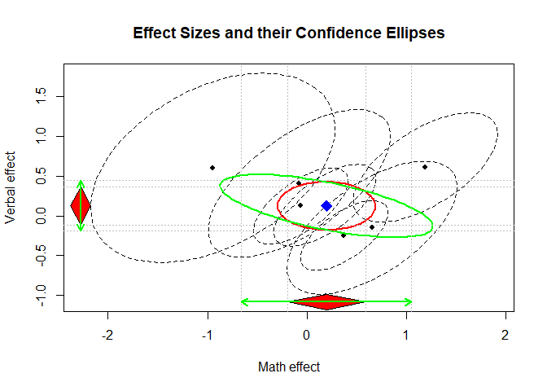
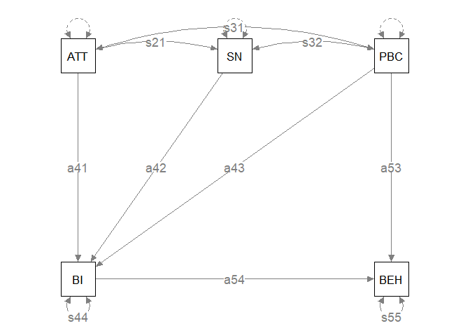
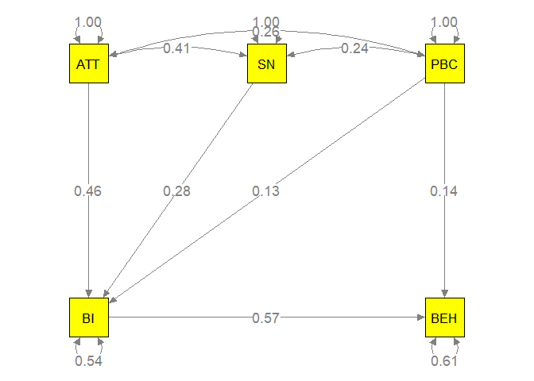
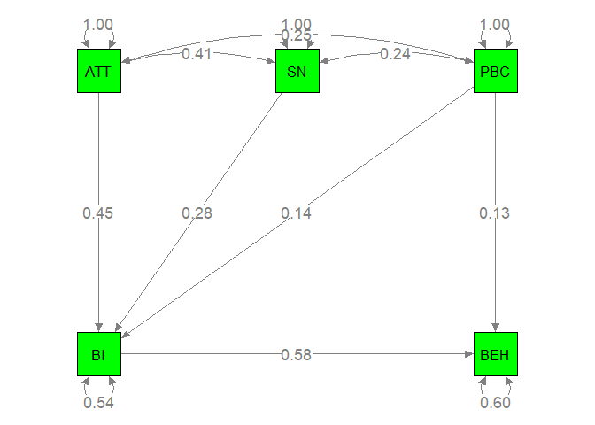
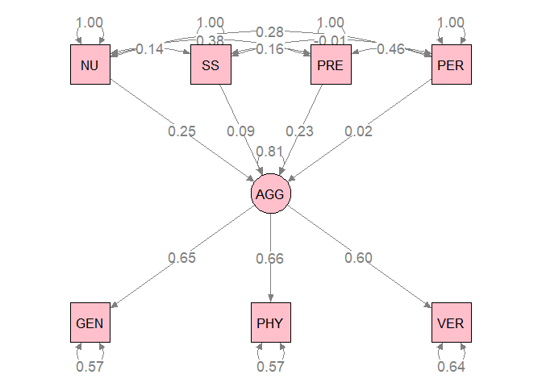

# Multivariate meta-analysis

```r
## Load the library
library(metaSEM)

## Dataset
Gleser94$MES
```

```
##   Study N.Uncoached N.Coached Mean.Uncoached.Math Mean.Uncoached.Verbal
## 1     1          34        21              510.00                503.00
## 2     2          17        16              383.00                385.00
## 3     3          52        52              475.32                451.15
## 4     4          14        13              431.43                393.57
## 5     5          47        93              512.00                462.00
## 6     6          45        45              630.44                597.47
## 7     7           8         8              342.50                250.00
##   Mean.Coached.Math Mean.Coached.Verbal SD.Uncoached.Math SD.Uncoached.Verbal
## 1            620.00              561.00             83.60              102.40
## 2            446.00              375.00             82.90               73.30
## 3            469.32              462.12             88.97               86.19
## 4            423.31              436.15             83.47              102.48
## 5            540.00              443.00             72.00               78.00
## 6            641.94              607.22             70.02               72.86
## 7            290.00              293.75             65.19               29.28
##   SD.Coached.Math SD.Coached.Verbal Cor.Math.Verbal
## 1          102.50             78.50            0.66
## 2          104.70             56.70            0.66
## 3           96.38             89.62            0.66
## 4          115.48            100.04            0.66
## 5           76.00             76.00            0.66
## 6           56.94             72.10            0.66
## 7           35.05             92.42            0.66
```

```r
## Calculate the sampling variances and covariance and amend into the data set
Gleser94$MES$Uncoached.V11 <- with(Gleser94$MES, SD.Uncoached.Math^2)
Gleser94$MES$Uncoached.V21 <- with(Gleser94$MES,
                                   SD.Uncoached.Math*Cor.Math.Verbal*SD.Uncoached.Verbal)
Gleser94$MES$Uncoached.V22 <- with(Gleser94$MES, SD.Uncoached.Verbal^2)

Gleser94$MES$Coached.V11 <- with(Gleser94$MES, SD.Coached.Math^2)
Gleser94$MES$Coached.V21 <- with(Gleser94$MES,
                                 SD.Coached.Math*Cor.Math.Verbal*SD.Coached.Verbal)
Gleser94$MES$Coached.V22 <- with(Gleser94$MES, SD.Coached.Verbal^2)

## Assuming homogeneity of covariance matrices
my.MES <- t(apply(Gleser94$MES, MARGIN=1,
                  function(x)
                    smdMES(m1=x[c("Mean.Uncoached.Math", "Mean.Uncoached.Verbal")],
                           m2=x[c("Mean.Coached.Math", "Mean.Coached.Verbal")],
                           V1=vec2symMat(x[c("Uncoached.V11", "Uncoached.V21", "Uncoached.V22")]),
                           V2=vec2symMat(x[c("Coached.V11", "Coached.V21", "Coached.V22")]),
                           n1=x["N.Uncoached"],
                           n2=x["N.Coached"],
                           homogeneity="covariance", list.output=FALSE)))

## Fixed-effects multivariate meta-analysis
fit.MES <- meta(y=my.MES[, 1:2], 
                v=my.MES[, 3:5], 
                model.name="MES")
summary(fit.MES)
```

```
## 
## Call:
## meta(y = my.MES[, 1:2], v = my.MES[, 3:5], model.name = "MES")
## 
## 95% confidence intervals: z statistic approximation (robust=FALSE)
## Coefficients:
##             Estimate Std.Error    lbound    ubound z value Pr(>|z|)
## Intercept1  0.195504  0.200979 -0.198407  0.589415  0.9728   0.3307
## Intercept2  0.124491  0.123464 -0.117494  0.366476  1.0083   0.3133
## Tau2_1_1    0.190715  0.177423 -0.157027  0.538457  1.0749   0.2824
## Tau2_2_1   -0.045387  0.074441 -0.191288  0.100514 -0.6097   0.5421
## Tau2_2_2    0.025947  0.049153 -0.070392  0.122286  0.5279   0.5976
## 
## Q statistic on the homogeneity of effect sizes: 45.05502
## Degrees of freedom of the Q statistic: 12
## P value of the Q statistic: 1.008372e-05
## 
## Heterogeneity indices (based on the estimated Tau2):
##                              Estimate
## Intercept1: I2 (Q statistic)   0.7387
## Intercept2: I2 (Q statistic)   0.2826
## 
## Number of studies (or clusters): 7
## Number of observed statistics: 14
## Number of estimated parameters: 5
## Degrees of freedom: 9
## -2 log likelihood: 16.18746 
## OpenMx status1: 0 ("0" or "1": The optimization is considered fine.
## Other values may indicate problems.)
```

```r
## Correlation between the random effects
cov2cor(VarCorr(fit.MES))
```

```
##            [,1]       [,2]
## [1,]  1.0000000 -0.6451966
## [2,] -0.6451966  1.0000000
```

```r
plot(fit.MES, axis.labels=c("Math effect", "Verbal effect"), univariate.polygon.width = 0.1)
```

<!-- -->

# Three-level meta-analysis

```r
## Show the first few cases of the dataset
head(Bornmann07)
```

```
##   Id                       Study Cluster    logOR          v Year       Type
## 1  1 Ackers (2000a; Marie Curie)       1 -0.40108 0.01391692 1996 Fellowship
## 2  2 Ackers (2000b; Marie Curie)       1 -0.05727 0.03428793 1996 Fellowship
## 3  3 Ackers (2000c; Marie Curie)       1 -0.29852 0.03391122 1996 Fellowship
## 4  4 Ackers (2000d; Marie Curie)       1  0.36094 0.03404025 1996 Fellowship
## 5  5 Ackers (2000e; Marie Curie)       1 -0.33336 0.01282103 1996 Fellowship
## 6  6 Ackers (2000f; Marie Curie)       1 -0.07173 0.01361189 1996 Fellowship
##                   Discipline Country
## 1          Physical sciences  Europe
## 2          Physical sciences  Europe
## 3          Physical sciences  Europe
## 4          Physical sciences  Europe
## 5 Social sciences/humanities  Europe
## 6          Physical sciences  Europe
```

```r
## No. of effect sizes per cluster
table(table(Bornmann07$Cluster))
```

```
## 
## 1 2 3 4 5 7 8 9 
## 9 2 3 2 1 2 1 1
```

```r
#### ML estimation method
## No predictor
summary( meta3L(y=logOR, v=v, cluster=Cluster, data=Bornmann07) )
```

```
## 
## Call:
## meta3L(y = logOR, v = v, cluster = Cluster, data = Bornmann07)
## 
## 95% confidence intervals: z statistic approximation (robust=FALSE)
## Coefficients:
##             Estimate  Std.Error     lbound     ubound z value Pr(>|z|)  
## Intercept -0.1007784  0.0401327 -0.1794371 -0.0221198 -2.5111  0.01203 *
## Tau2_2     0.0037965  0.0027210 -0.0015367  0.0091297  1.3952  0.16295  
## Tau2_3     0.0141352  0.0091445 -0.0037877  0.0320580  1.5458  0.12216  
## ---
## Signif. codes:  0 '***' 0.001 '**' 0.01 '*' 0.05 '.' 0.1 ' ' 1
## 
## Q statistic on the homogeneity of effect sizes: 221.2809
## Degrees of freedom of the Q statistic: 65
## P value of the Q statistic: 0
## 
## Heterogeneity indices (based on the estimated Tau2):
##                               Estimate
## I2_2 (Typical v: Q statistic)   0.1568
## I2_3 (Typical v: Q statistic)   0.5839
## 
## Number of studies (or clusters): 21
## Number of observed statistics: 66
## Number of estimated parameters: 3
## Degrees of freedom: 63
## -2 log likelihood: 25.80256 
## OpenMx status1: 0 ("0" or "1": The optimization is considered fine.
## Other values may indicate problems.)
```

```r
## Type as a predictor
## Grant: 0
## Fellowship: 1
summary( meta3L(y=logOR, v=v, x=(as.numeric(Type)-1), cluster=Cluster, data=Bornmann07) )
```

```
## 
## Call:
## meta3L(y = logOR, v = v, cluster = Cluster, x = (as.numeric(Type) - 
##     1), data = Bornmann07)
## 
## 95% confidence intervals: z statistic approximation (robust=FALSE)
## Coefficients:
##             Estimate  Std.Error     lbound     ubound z value  Pr(>|z|)    
## Intercept -0.0066071  0.0371125 -0.0793462  0.0661320 -0.1780 0.8587001    
## Slope_1   -0.1955869  0.0541649 -0.3017483 -0.0894256 -3.6110 0.0003051 ***
## Tau2_2     0.0035335  0.0024306 -0.0012303  0.0082974  1.4538 0.1460058    
## Tau2_3     0.0029079  0.0031183 -0.0032039  0.0090197  0.9325 0.3510704    
## ---
## Signif. codes:  0 '***' 0.001 '**' 0.01 '*' 0.05 '.' 0.1 ' ' 1
## 
## Q statistic on the homogeneity of effect sizes: 221.2809
## Degrees of freedom of the Q statistic: 65
## P value of the Q statistic: 0
## 
## Explained variances (R2):
##                          Level 2 Level 3
## Tau2 (no predictor)    0.0037965  0.0141
## Tau2 (with predictors) 0.0035335  0.0029
## R2                     0.0692595  0.7943
## 
## Number of studies (or clusters): 21
## Number of observed statistics: 66
## Number of estimated parameters: 4
## Degrees of freedom: 62
## -2 log likelihood: 17.62569 
## OpenMx status1: 0 ("0" or "1": The optimization is considered fine.
## Other values may indicate problems.)
```

# Meta-analytic structural equation modeling (MASEM)

## Model specification

```r
## Dataset
pattern.na(Scalco17$data, show.na=FALSE)
```

```
##     ATT SN PBC BI BEH
## ATT  23 22  22 23   6
## SN   22 23  22 23   6
## PBC  22 22  23 23   6
## BI   23 23  23 23   6
## BEH   6  6   6  6   6
```

```r
## Variable names
varnames <- colnames(Scalco17$data[[1]])

## Model specified in lavaan syntax
modelH <-'BI ~ a41*ATT + a42*SN + a43*PBC
          BEH ~ a54*BI + a53*PBC
          ATT ~~ s21*SN
          ATT ~~ s31*PBC
          SN ~~ s32*PBC
          ATT ~~ 1*ATT
          SN ~~ 1*SN
          PBC ~~ 1*PBC
          BI ~~ s44*BI
          BEH ~~ s55*BEH'

plot(modelH)
```

<!-- -->

```r
## Model in RAM speciification
RAM1 <- lavaan2RAM(modelH, obs.variables = varnames, A.notation="on", S.notation="with")

RAM1
```

```
## $A
##     ATT       SN        PBC       BI        BEH
## ATT "0"       "0"       "0"       "0"       "0"
## SN  "0"       "0"       "0"       "0"       "0"
## PBC "0"       "0"       "0"       "0"       "0"
## BI  "0.1*a41" "0.1*a42" "0.1*a43" "0"       "0"
## BEH "0"       "0"       "0.1*a53" "0.1*a54" "0"
## 
## $S
##     ATT     SN      PBC     BI        BEH      
## ATT "1"     "0*s21" "0*s31" "0"       "0"      
## SN  "0*s21" "1"     "0*s32" "0"       "0"      
## PBC "0*s31" "0*s32" "1"     "0"       "0"      
## BI  "0"     "0"     "0"     "0.5*s44" "0"      
## BEH "0"     "0"     "0"     "0"       "0.5*s55"
## 
## $F
##     ATT SN PBC BI BEH
## ATT   1  0   0  0   0
## SN    0  1   0  0   0
## PBC   0  0   1  0   0
## BI    0  0   0  1   0
## BEH   0  0   0  0   1
## 
## $M
##   ATT SN PBC BI BEH
## 1   0  0   0  0   0
```

## Two-stage structural equation modeling (TSSEM)

```r
## First stage of analysis
stage1random <- tssem1(Cov=Scalco17$data, n = Scalco17$n, method="REM", RE.type="Diag")

## Average correlation matrix under a random-effects model
average.R <- vec2symMat(coef(stage1random, select="fixed"), diag = FALSE)
dimnames(average.R) <- list(varnames, varnames)
average.R
```

```
##           ATT        SN       PBC        BI       BEH
## ATT 1.0000000 0.4124050 0.2529692 0.5956740 0.4253957
## SN  0.4124050 1.0000000 0.2358014 0.4866840 0.3656798
## PBC 0.2529692 0.2358014 1.0000000 0.3210878 0.3080911
## BI  0.5956740 0.4866840 0.3210878 1.0000000 0.5290901
## BEH 0.4253957 0.3656798 0.3080911 0.5290901 1.0000000
```

```r
## Second stage of analysis
stage2Out <- tssem2(stage1random, Amatrix=RAM1$A, Smatrix=RAM1$S)
summary(stage2Out)
```

```
## 
## Call:
## wls(Cov = pooledS, aCov = aCov, n = tssem1.obj$total.n, RAM = RAM, 
##     Amatrix = Amatrix, Smatrix = Smatrix, Fmatrix = Fmatrix, 
##     diag.constraints = diag.constraints, cor.analysis = cor.analysis, 
##     intervals.type = intervals.type, mx.algebras = mx.algebras, 
##     mxModel.Args = mxModel.Args, subset.variables = subset.variables, 
##     model.name = model.name, suppressWarnings = suppressWarnings, 
##     silent = silent, run = run)
## 
## 95% confidence intervals: z statistic approximation
## Coefficients:
##      Estimate Std.Error    lbound    ubound z value  Pr(>|z|)    
## a54 0.5706772 0.0561335 0.4606576 0.6806967 10.1664 < 2.2e-16 ***
## a53 0.1369475 0.0689542 0.0017998 0.2720952  1.9861   0.04703 *  
## a41 0.4562908 0.0386360 0.3805656 0.5320160 11.8100 < 2.2e-16 ***
## a43 0.1349339 0.0332996 0.0696679 0.2001998  4.0521 5.076e-05 ***
## a42 0.2806839 0.0459094 0.1907031 0.3706647  6.1139 9.725e-10 ***
## s31 0.2556669 0.0303645 0.1961536 0.3151803  8.4199 < 2.2e-16 ***
## s32 0.2372074 0.0231337 0.1918662 0.2825485 10.2538 < 2.2e-16 ***
## s21 0.4128843 0.0400585 0.3343710 0.4913975 10.3070 < 2.2e-16 ***
## ---
## Signif. codes:  0 '***' 0.001 '**' 0.01 '*' 0.05 '.' 0.1 ' ' 1
## 
## Goodness-of-fit indices:
##                                                 Value
## Sample size                                11349.0000
## Chi-square of target model                     4.2472
## DF of target model                             2.0000
## p value of target model                        0.1196
## Number of constraints imposed on "Smatrix"     0.0000
## DF manually adjusted                           0.0000
## Chi-square of independence model            1117.1822
## DF of independence model                      10.0000
## RMSEA                                          0.0100
## RMSEA lower 95% CI                             0.0000
## RMSEA upper 95% CI                             0.0233
## SRMR                                           0.0345
## TLI                                            0.9899
## CFI                                            0.9980
## AIC                                            0.2472
## BIC                                          -14.4265
## OpenMx status1: 0 ("0" or "1": The optimization is considered fine.
## Other values indicate problems.)
```

```r
plot(stage2Out, col="yellow")
```

<!-- -->

## One-stage meta-analytical structural equation modeling (OSMASEM)

```r
## Data preparation
data_scalco <- Cor2DataFrame(x = Scalco17$data, n = Scalco17$n)

## Model without any moderator
osmasemOut <- osmasem(RAM = RAM1, data = data_scalco)
summary(osmasemOut, fitIndices = TRUE)
```

```
## Summary of osmasem 
##  
## free parameters:
##       name  matrix row col   Estimate  Std.Error A    z value     Pr(>|z|)
## 1      a41      A0  BI ATT  0.4548365 0.03958523    11.490056 0.000000e+00
## 2      a42      A0  BI  SN  0.2781751 0.04707428     5.909279 3.436076e-09
## 3      a43      A0  BI PBC  0.1369546 0.03334842     4.106777 4.012176e-05
## 4      a53      A0 BEH PBC  0.1305298 0.07190046     1.815423 6.945892e-02
## 5      a54      A0 BEH  BI  0.5825793 0.07659635     7.605836 2.819966e-14
## 6      s21      S0  SN ATT  0.4127350 0.04003477    10.309412 0.000000e+00
## 7      s31      S0 PBC ATT  0.2549528 0.03031157     8.411074 0.000000e+00
## 8      s32      S0 PBC  SN  0.2367971 0.02308960    10.255576 0.000000e+00
## 9   Tau1_1 vecTau1   1   1 -3.4174846 0.32640832   -10.469968 0.000000e+00
## 10  Tau1_2 vecTau1   2   1 -4.0475548 0.34541631   -11.717903 0.000000e+00
## 11  Tau1_3 vecTau1   3   1 -3.9631221 0.31649622   -12.521862 0.000000e+00
## 12  Tau1_4 vecTau1   4   1 -4.3571400 0.65215592    -6.681132 2.371037e-11
## 13  Tau1_5 vecTau1   5   1 -4.7251577 0.40835076   -11.571321 0.000000e+00
## 14  Tau1_6 vecTau1   6   1 -3.6019191 0.31551989   -11.415823 0.000000e+00
## 15  Tau1_7 vecTau1   7   1 -4.1704613 0.65208184    -6.395610 1.599074e-10
## 16  Tau1_8 vecTau1   8   1 -4.2846713 0.34785958   -12.317244 0.000000e+00
## 17  Tau1_9 vecTau1   9   1 -3.9774805 0.59091385    -6.731067 1.684231e-11
## 18 Tau1_10 vecTau1  10   1 -3.4394344 0.70132327    -4.904207 9.380559e-07
## 
## To obtain confidence intervals re-run with intervals=TRUE
## 
## Model Statistics: 
##                |  Parameters  |  Degrees of Freedom  |  Fit (-2lnL units)
##        Model:             18                    141             -153.2011
##    Saturated:             20                    139             -156.9808
## Independence:             10                    149              159.8486
## Number of observations/statistics: 11349/159
## 
## chi-square:  χ² ( df=2 ) = 3.779661,  p = 0.1510974
## Information Criteria: 
##       |  df Penalty  |  Parameters Penalty  |  Sample-Size Adjusted
## AIC:      -435.2011              -117.2011                -117.1408
## BIC:     -1469.7019                14.8628                 -42.3390
## CFI: 0.9941998 
## TLI: 0.9709992   (also known as NNFI) 
## RMSEA:  0.008854721  [95% CI (0, 0.02466774)]
## Prob(RMSEA <= 0.05): 1
## timestamp: 2024-07-02 13:50:32 
## Wall clock time: 0.5184071 secs 
## optimizer:  SLSQP 
## OpenMx version number: 2.21.8 
## Need help?  See help(mxSummary)
```

```r
plot(osmasemOut, col="green")
```

<!-- -->

```r
## one-stage MASEM with mean age as moderator
## add moderator with centered age
data_scalco$data$Age <- scale(Scalco17$Age, scale=FALSE)

## Indicator on the presence of data
present_age <- !is.na(Scalco17$Age)

## Create matrix for moderating effects
Ax <- matrix(c(0,0,0,0,0,
               0,0,0,0,0,
               0,0,0,0,0,
               0,0,0,0,0,
               0,0,0,"0*data.Age",0),
             nrow=5, ncol=5, byrow=TRUE)
Ax
```

```
##      [,1] [,2] [,3] [,4]         [,5]
## [1,] "0"  "0"  "0"  "0"          "0" 
## [2,] "0"  "0"  "0"  "0"          "0" 
## [3,] "0"  "0"  "0"  "0"          "0" 
## [4,] "0"  "0"  "0"  "0"          "0" 
## [5,] "0"  "0"  "0"  "0*data.Age" "0"
```

```r
## Create the model implied correlation structure with moderator
M1 <- create.vechsR(A0=RAM1$A, S0=RAM1$S, Ax=Ax)

T1 <- create.Tau2(RAM1)

## Fit model without the moderator
osmasem_modOut <- osmasem(model.name = "moderator",
                          Mmatrix=M1, Tmatrix=T1, 
                          data=data_scalco,
                          subset.rows = present_age)
summary(osmasem_modOut)
```

```
## Summary of moderator 
##  
## free parameters:
##       name  matrix row col    Estimate  Std.Error A    z value     Pr(>|z|)
## 1      a41      A0  BI ATT  0.48676642 0.04153192    11.720297 0.000000e+00
## 2      a42      A0  BI  SN  0.29348533 0.06076016     4.830227 1.363776e-06
## 3      a43      A0  BI PBC  0.10109519 0.03716504     2.720169 6.524858e-03
## 4      a53      A0 BEH PBC  0.18505970 0.09285832     1.992925 4.626961e-02
## 5      a54      A0 BEH  BI  0.50999243 0.09935072     5.133254 2.847759e-07
## 6      s21      S0  SN ATT  0.43621087 0.04513545     9.664484 0.000000e+00
## 7      s31      S0 PBC ATT  0.25433728 0.03278637     7.757409 8.659740e-15
## 8      s32      S0 PBC  SN  0.24532418 0.02683890     9.140620 0.000000e+00
## 9    a54_1      A1 BEH  BI  0.01805342 0.01415641     1.275282 2.022094e-01
## 10  Tau1_1 vecTau1   1   1 -3.37695510 0.35822319    -9.426958 0.000000e+00
## 11  Tau1_2 vecTau1   2   1 -4.09332650 0.38451981   -10.645294 0.000000e+00
## 12  Tau1_3 vecTau1   3   1 -4.27915599 0.35081329   -12.197816 0.000000e+00
## 13  Tau1_4 vecTau1   4   1 -4.98700192 0.83114050    -6.000191 1.970853e-09
## 14  Tau1_5 vecTau1   5   1 -4.61026052 0.43952344   -10.489226 0.000000e+00
## 15  Tau1_6 vecTau1   6   1 -3.43442146 0.35202135    -9.756287 0.000000e+00
## 16  Tau1_7 vecTau1   7   1 -4.64860350 0.95910039    -4.846837 1.254452e-06
## 17  Tau1_8 vecTau1   8   1 -4.32112754 0.38651694   -11.179659 0.000000e+00
## 18  Tau1_9 vecTau1   9   1 -3.72118072 0.73612672    -5.055082 4.302065e-07
## 19 Tau1_10 vecTau1  10   1 -5.26557956 0.97253820    -5.414265 6.154096e-08
## 
## To obtain confidence intervals re-run with intervals=TRUE
## 
## Model Statistics: 
##                |  Parameters  |  Degrees of Freedom  |  Fit (-2lnL units)
##        Model:             19                    108             -133.2417
##    Saturated:             65                     62                    NA
## Independence:             20                    107                    NA
## Number of observations/statistics: 9507/127
## 
## Information Criteria: 
##       |  df Penalty  |  Parameters Penalty  |  Sample-Size Adjusted
## AIC:      -349.2417              -95.24175                -95.16164
## BIC:     -1122.4984               40.79414                -19.58488
## To get additional fit indices, see help(mxRefModels)
## timestamp: 2024-07-02 13:50:34 
## Wall clock time: 0.8066709 secs 
## optimizer:  SLSQP 
## OpenMx version number: 2.21.8 
## Need help?  See help(mxSummary)
```

```r
## Make sure that the same number of studies is used in the overall moderator test
osmasemOut <- osmasem(RAM = RAM1, data = data_scalco, subset.rows = present_age)

anova(osmasem_modOut, osmasemOut)
```

```
##        base comparison ep  minus2LL  df       AIC  diffLL diffdf         p
## 1 moderator       <NA> 19 -133.2417 108 -95.24175      NA     NA        NA
## 2 moderator    osmasem 18 -131.9769 109 -95.97692 1.26483      1 0.2607389
```

## full SEM using OSMASEM

```r
load('Bresin2019.Rdat')

## number of studies per bivariate relation
pattern.na(Bresin2019$data, show.na=FALSE)
```

```
##     NU SS PRE PER GEN PHY VER
## NU  50 14  28  16  33  20  13
## SS  14 29  14  12  14  14   9
## PRE 28 14  86  16  61  27  19
## PER 16 12  16  29  18   9   4
## GEN 33 14  61  18  75  18   6
## PHY 20 14  27   9  18  35  20
## VER 13  9  19   4   6  20  27
```

```r
## total sample size per bivariate relation
pattern.n(Bresin2019$data, Bresin2019$n)
```

```
##        NU   SS   PRE   PER   GEN  PHY  VER
## NU  16512 6117 10964  6903  9995 5324 3729
## SS   6117 9062  4023  3540  3195 3083 2049
## PRE 10964 4023 29099  5765 21124 6787 5288
## PER  6903 3540  5765 10876  5440 2460 1122
## GEN  9995 3195 21124  5440 24281 4452 2196
## PHY  5324 3083  6787  2460  4452 8556 4864
## VER  3729 2049  5288  1122  2196 4864 7057
```

```r
varnames <- colnames(Bresin2019$data[[1]])

model1 <- '
## Factor loadings
AGG =~ GEN + PHY+ VER

#Regressions
AGG ~ NU + SS + PRE +PER

##variances
NU~~1*NU
SS~~1*SS
PRE~~1*PRE
PER~~1*PER
AGG ~~ AGG
GEN~~GEN
PHY~~PHY
VER~~VER

# covariances
NU~~SS
NU~~PER
NU~~PRE
SS~~PRE
SS~~PER
PRE~~PER'

RAM1 <- lavaan2RAM(model1, obs.variables = varnames,
                    A.notation="on", S.notation="with")

# The A, S and F matrices
RAM1
```

```
## $A
##     NU            SS            PRE            PER            GEN PHY VER
## NU  "0"           "0"           "0"            "0"            "0" "0" "0"
## SS  "0"           "0"           "0"            "0"            "0" "0" "0"
## PRE "0"           "0"           "0"            "0"            "0" "0" "0"
## PER "0"           "0"           "0"            "0"            "0" "0" "0"
## GEN "0"           "0"           "0"            "0"            "0" "0" "0"
## PHY "0"           "0"           "0"            "0"            "0" "0" "0"
## VER "0"           "0"           "0"            "0"            "0" "0" "0"
## AGG "0.1*AGGonNU" "0.1*AGGonSS" "0.1*AGGonPRE" "0.1*AGGonPER" "0" "0" "0"
##     AGG           
## NU  "0"           
## SS  "0"           
## PRE "0"           
## PER "0"           
## GEN "0.1*GENonAGG"
## PHY "0.1*PHYonAGG"
## VER "0.1*VERonAGG"
## AGG "0"           
## 
## $S
##     NU            SS            PRE            PER            GEN             
## NU  "1"           "0*NUwithSS"  "0*NUwithPRE"  "0*NUwithPER"  "0"             
## SS  "0*NUwithSS"  "1"           "0*SSwithPRE"  "0*SSwithPER"  "0"             
## PRE "0*NUwithPRE" "0*SSwithPRE" "1"            "0*PREwithPER" "0"             
## PER "0*NUwithPER" "0*SSwithPER" "0*PREwithPER" "1"            "0"             
## GEN "0"           "0"           "0"            "0"            "0.5*GENwithGEN"
## PHY "0"           "0"           "0"            "0"            "0"             
## VER "0"           "0"           "0"            "0"            "0"             
## AGG "0"           "0"           "0"            "0"            "0"             
##     PHY              VER              AGG
## NU  "0"              "0"              "0"
## SS  "0"              "0"              "0"
## PRE "0"              "0"              "0"
## PER "0"              "0"              "0"
## GEN "0"              "0"              "0"
## PHY "0.5*PHYwithPHY" "0"              "0"
## VER "0"              "0.5*VERwithVER" "0"
## AGG "0"              "0"              "1"
## 
## $F
##     NU SS PRE PER GEN PHY VER AGG
## NU   1  0   0   0   0   0   0   0
## SS   0  1   0   0   0   0   0   0
## PRE  0  0   1   0   0   0   0   0
## PER  0  0   0   1   0   0   0   0
## GEN  0  0   0   0   1   0   0   0
## PHY  0  0   0   0   0   1   0   0
## VER  0  0   0   0   0   0   1   0
## 
## $M
##   NU SS PRE PER GEN PHY VER AGG
## 1  0  0   0   0   0   0   0   0
```

```r
## one-stage MASEM

## prepare data

data_bresin <- Cor2DataFrame(x = Bresin2019$data, n = Bresin2019$n)

## run MASEM (ignore warning message 'The variances of the dependent variables in 'Smatrix' should be free')
osmasemOut <- osmasem(RAM = RAM1, data = data_bresin)

## Need to rerun for convergence
osmasemOut <- rerun(osmasemOut)
```


```r
summary(osmasemOut, fitIndices = TRUE)
```

```
## Summary of osmasem 
##  
## free parameters:
##          name  matrix row col     Estimate    Std.Error A      z value
## 1     AGGonNU      A0 AGG  NU   0.25465937 3.485304e-02     7.30666069
## 2     AGGonSS      A0 AGG  SS   0.09122791 3.966902e-02     2.29972702
## 3    AGGonPRE      A0 AGG PRE   0.23149548 3.276429e-02     7.06548055
## 4    AGGonPER      A0 AGG PER   0.02182880 4.142363e-02     0.52696494
## 5    GENonAGG      A0 GEN AGG   0.65325719 3.271940e-02    19.96543871
## 6    PHYonAGG      A0 PHY AGG   0.65874642 3.007324e-02    21.90474062
## 7    VERonAGG      A0 VER AGG   0.59726183 3.664183e-02    16.29999873
## 8    NUwithSS      S0  SS  NU   0.14370465 1.918858e-02     7.48907345
## 9   NUwithPRE      S0 PRE  NU   0.38126834 3.058422e-02    12.46617711
## 10  NUwithPER      S0 PER  NU   0.28188760 4.549603e-02     6.19587275
## 11  SSwithPRE      S0 PRE  SS   0.16478128 4.286204e-02     3.84445722
## 12  SSwithPER      S0 PER  SS  -0.00720883 4.255402e-02    -0.16940420
## 13 PREwithPER      S0 PER PRE   0.45771870 4.184718e-02    10.93786192
## 14     Tau1_1 vecTau1   1   1  -6.23729275 9.196089e-01    -6.78254909
## 15     Tau1_2 vecTau1   2   1  -3.81094537 3.126431e-01   -12.18944369
## 16     Tau1_3 vecTau1   3   1  -3.53275547 3.742867e-01    -9.43863500
## 17     Tau1_4 vecTau1   4   1  -3.75437995 2.947193e-01   -12.73883289
## 18     Tau1_5 vecTau1   5   1  -4.53591045 4.072894e-01   -11.13682356
## 19     Tau1_6 vecTau1   6   1  -4.82433395 5.266375e-01    -9.16063548
## 20     Tau1_7 vecTau1   7   1  -3.86209372 4.548218e-01    -8.49144453
## 21     Tau1_8 vecTau1   8   1  -4.06743886 4.927956e-01    -8.25380482
## 22     Tau1_9 vecTau1   9   1  -4.54368953 5.514212e-01    -8.23996091
## 23    Tau1_10 vecTau1  10   1  -4.71368419 5.742612e-01    -8.20825873
## 24    Tau1_11 vecTau1  11   1  -6.76003589 2.446099e+00    -2.76359864
## 25    Tau1_12 vecTau1  12   1  -3.66301735 3.860736e-01    -9.48787424
## 26    Tau1_13 vecTau1  13   1  -4.59729774 2.644441e-01   -17.38476249
## 27    Tau1_14 vecTau1  14   1  -5.30174751 4.901533e-01   -10.81650967
## 28    Tau1_15 vecTau1  15   1  -5.57284832 6.197656e-01    -8.99186472
## 29    Tau1_16 vecTau1  16   1  -4.34085408 4.594779e-01    -9.44736239
## 30    Tau1_17 vecTau1  17   1 -24.04597963 1.093998e+03    -0.02197992
## 31    Tau1_18 vecTau1  18   1  -5.18964406 1.093744e+00    -4.74484478
## 32    Tau1_19 vecTau1  19   1  -5.01979027 6.486440e-01    -7.73889899
## 33    Tau1_20 vecTau1  20   1  -4.41106178 8.406411e-01    -5.24725898
## 34    Tau1_21 vecTau1  21   1  -4.40086297 4.297362e-01   -10.24084837
##        Pr(>|z|)
## 1  2.737810e-13
## 2  2.146369e-02
## 3  1.600720e-12
## 4  5.982179e-01
## 5  0.000000e+00
## 6  0.000000e+00
## 7  0.000000e+00
## 8  6.927792e-14
## 9  0.000000e+00
## 10 5.796295e-10
## 11 1.208196e-04
## 12 8.654787e-01
## 13 0.000000e+00
## 14 1.180744e-11
## 15 0.000000e+00
## 16 0.000000e+00
## 17 0.000000e+00
## 18 0.000000e+00
## 19 0.000000e+00
## 20 0.000000e+00
## 21 2.220446e-16
## 22 2.220446e-16
## 23 2.220446e-16
## 24 5.716781e-03
## 25 0.000000e+00
## 26 0.000000e+00
## 27 0.000000e+00
## 28 0.000000e+00
## 29 0.000000e+00
## 30 9.824640e-01
## 31 2.086663e-06
## 32 9.992007e-15
## 33 1.543788e-07
## 34 0.000000e+00
## 
## To obtain confidence intervals re-run with intervals=TRUE
## 
## Model Statistics: 
##                |  Parameters  |  Degrees of Freedom  |  Fit (-2lnL units)
##        Model:             34                    351            -485.82352
##    Saturated:             42                    343            -499.91014
## Independence:             21                    364              53.21347
## Number of observations/statistics: 33741/385
## 
## chi-square:  χ² ( df=8 ) = 14.08662,  p = 0.07953543
## Information Criteria: 
##       |  df Penalty  |  Parameters Penalty  |  Sample-Size Adjusted
## AIC:      -1187.824              -417.8235                -417.7529
## BIC:      -4145.514              -131.3236                -239.3754
## CFI: 0.9885616 
## TLI: 0.9699743   (also known as NNFI) 
## RMSEA:  0.004748584  [95% CI (0, 0.009413186)]
## Prob(RMSEA <= 0.05): 1
## timestamp: 2024-07-02 13:51:05 
## Wall clock time: 7.97465 secs 
## optimizer:  SLSQP 
## OpenMx version number: 2.21.8 
## Need help?  See help(mxSummary)
```

```r
plot(osmasemOut, col="pink")
```

<!-- -->
