```{r, message=FALSE, echo=FALSE, eval=FALSE}
set.seed(802140618)

## No. of studies
k <- 50

## Mean age of participants
x <- round( rnorm(k, mean=40, sd=13), 2 )

## correlation between mean age and true effect size
rho <- -0.3

## true effect size
theta <- rho*x + sqrt(1-rho^2)*rnorm(k, mean=0, sd=13)

## rescale theta to mean=.75 and SD=.2
theta <- -.75+scale(theta)*0.2

## Correlation between true effect size and age
cor(theta, x)

# plot(theta~x, xlab="Mean age", ylab="True effect size")
# abline(lm(theta~x), col="red")

## Generate sample sizes in the studies from a Poisson distribution
## Mean=50
n <- rpois(k, 50)

## c(m) calculation function
cmi <- function(m) {
   1 - 3/( 4*m - 1 )
}

## function to generate bias corrected standardized mean differences
generate.yi <- function(thetai, ni, mi, cmmi, k) {
	cmmi * rnorm(k, mean=thetai, sd=sqrt(2/ni)) / sqrt( rchisq(k, df=mi) / mi )
}

## function to generate the sampling variances of the bias corrected standardized mean differences
generate.vi <- function(thetai, ni, mi, cmmi, k, yi) {
	cmmi^2 * ( 2/ni + yi^2 / (4*ni) ) 
}

my.true <- data.frame(theta=theta, n1=n, n2=n, cmmi=cmi(n), k=1)

## Sample effect sizes
my.true$y <- apply(my.true, 1, function(x) generate.yi(x[1], x[2], x[3], x[4], x[5]))

## Sample sampling variances
my.true$v <- apply(my.true, 1, function(x) generate.vi(x[1], x[2], x[3], x[4], x[5], x[6]))
my.true$x <- x

my.samples <- data.frame(round(my.true[, c("y", "v")], 4), x=x)

write.csv(my.samples, "./stata/data.csv", row.names = FALSE)
write.csv(my.samples, "data.csv", row.names = FALSE)
write.table(my.samples, "./mplus/data.dat", row.names = FALSE, col.names = FALSE)
```

# Introduction
* This page is a supporting document to Cheung and Vijayakumar (2016). It provides a quick introduction on how to conduct meta-analysis in various software packages. Since different default estimators are used in different packages, the results may be slightly different.
* Cheung, M. W.-L., & Vijayakumar, R. (2016). *An introduction to when and how to conduct a meta-analysis*. Manuscript in preparation. 

# Descriptive statistics of the data
* The sample data sets are available as [CSV](./stata/data.csv) and [plain text](./mplus/data.dat) formats.
* Effect size (`y`): standardized mean difference between schizophrenic and control groups.
* Sampling variance (`v`): Sampling variance of `y`.
* Moderator (`x`): Mean age of the participants.

```{r, echo=FALSE}
my.df <- read.csv("data.csv")

## summary(my.df$y)
hist(my.df$y, main="", xlab="Observed effect size")
```

* IV (x): Mean age of participants

```{r, echo=FALSE}
## summary(my.df$x)
hist(my.df$x, main="", xlab="Mean age")
```


# R
* There are several [packages](https://cran.r-project.org/web/views/MetaAnalysis.html) to conduct meta-analysis in [R](https://www.r-project.org/). We are going to illustrate the procedures with the [metaSEM](https://cran.r-project.org/web/packages/metaSEM/index.html) package.

## Fixed-effects model
```{r, message=FALSE}
## You need to install the metaSEM package before using it. 
## You need to install it only once.
## install.packages("metaSEM") 

## Load the library
library(metaSEM)

## Read the data file
my.df <- read.csv("data.csv")

## Display the first few studies
head(my.df)

## Fixed-effects model by restricting the random effects to 0
summary(meta(y=y, v=v, data=my.df, RE.constraints = 0))
```

## Random-effects model
```{r}
summary(meta(y=y, v=v, data=my.df))
```

## Mixed-effects model
```{r}
summary(meta(y=y, v=v, x=x, data=my.df))
```


# Mplus
* [Mike Cheung](https://courses.nus.edu.sg/course/psycwlm/internet/) provides sample [Mplus code](https://github.com/mikewlcheung/metaSEM-book/blob/master/metaSEMbook.md) on how to conduct meta-analysis in [Mplus](https://www.statmodel.com/).
* The sample data set for Mplus is available [here](./mplus/data.dat).

```{r, echo=FALSE}
mplus <- function(x, msg="my message") {  
 ## Mplus inp file
 my.inp <- paste("./mplus/", x,".inp", sep="")
 txt.inp <- readLines(my.inp, warn = FALSE)
 ## Mplus output file
 my.out <- paste("./mplus/", x,".out", sep="")
 txt.out <- readLines(my.out, warn = FALSE)
 
 cat("[",msg,"](", my.inp, ")\n", sep="")
 
 cat("```\n")
 cat(txt.inp, sep="\n", append=TRUE)
 cat("```\n")
 
 cat("[Mplus output file](", my.out, ")\n", sep="")
 
 cat("```\n")
 cat(txt.out, sep="\n", append=TRUE)
 cat("```\n")  
}
```

## Fixed-effects model
```{r, echo=FALSE, results='asis'}
mplus("mplus1", "Mplus input file")
```

## Random-effects model
```{r, echo=FALSE, results='asis'}
mplus("mplus2", "Mplus input file")
```

## Mixed-effects model
```{r, echo=FALSE, results='asis'}
mplus("mplus2", "Mplus input file")
```

# Stata
* There are several user-contributed packages in [meta-analysis](http://www.stata.com/support/faqs/statistics/meta-analysis/) in [Stata](http://www.stata.com/).
* The followings files are used in this illustration: [data](./stata/data.csv), [do-file](./stata/stata.do), and [log file](./stata/stata.log).

## Fixed- and random-effects models
```
* Read the data file "data.csv".
. import delim using data.csv
```

```
(3 vars, 50 obs)
```

```
* Generate se (standard error) from v (sampling variance).
. generate se=sqrt(v)

* Display the content.
. describe
```

```
Contains data
  obs:            50                          
 vars:             4                          
 size:           800                          
----------------------------------------------------------------------------------------
              storage   display    value
variable name   type    format     label      variable label
----------------------------------------------------------------------------------------
y               float   %9.0g                 
v               float   %9.0g                 
x               float   %9.0g
se              float   %9.0g   
----------------------------------------------------------------------------------------
```

```
* Run a meta-analysis on y with se as the standard error.
. meta y se
```

```
Meta-analysis 

       |  Pooled      95% CI         Asymptotic      No. of
Method |     Est   Lower   Upper  z_value  p_value   studies
-------+----------------------------------------------------
Fixed  |  -0.722  -0.779  -0.666  -25.017    0.000     50
Random |  -0.729  -0.804  -0.654  -19.030    0.000

Test for heterogeneity: Q= 85.712 on 49 degrees of freedom (p= 0.001)
Moment-based estimate of between studies variance =  0.031
```

## Mixed-effects model
```
* Run a mixed-effects meta-analysis on y with x as the predictor and se as the standard error.
. metareg y x, wsse(se)
```

```
Meta-regression                                       Number of obs  =      50
REML estimate of between-study variance               tau2           =  .02432
% residual variation due to heterogeneity             I-squared_res  =  38.44%
Proportion of between-study variance explained        Adj R-squared  =  15.93%
With Knapp-Hartung modification
------------------------------------------------------------------------------
           y |      Coef.   Std. Err.      t    P>|t|     [95% Conf. Interval]
-------------+----------------------------------------------------------------
           x |  -.0071645   .0030496    -2.35   0.023    -.0132961   -.0010329
       _cons |  -.4422977   .1273233    -3.47   0.001    -.6982984   -.1862969
------------------------------------------------------------------------------
```


# SPSS 
* To use SPSS to conduct meta-analysis, we use the [macros](http://mason.gmu.edu/~dwilsonb/ma.html) provided by [David Wilson](http://mason.gmu.edu/~dwilsonb/).
* There are three macros at the site for meta-analysis. We use `MEANES` macro to conduct the basic meta-analysis, and the `METAREG` macro for study-level moderator analysis, using meta-regression. `METAF` is used to conduct moderator analysis with a categorical moderator.
* In our dataset, our study effect size is labeled `y`, its sampling variance as `v`, and moderator Mean Age of the participants as `x`. 
* Because the macros require us to input study weights, we first compute a new variable labelled `w`, which indicates the weights allotted to each study. We use the formula: w = 1/v to compute this variable.
* Once we have the variables `y`, `x`, and `w` in SPSS, we are ready to use the macros.

## Fixed- and random- effects models
* SPSS syntax:
```
INCLUDE 'C:\MEANES.SPS'.
MEANES ES = y /W = w.
```

* Output:

```
Run MATRIX procedure:

Version 2005.05.23

*****  Meta-Analytic Results  *****

------- Distribution Description ---------------------------------
           N      Min ES      Max ES    Wghtd SD
      50.000      -1.859       -.234        .267

------- Fixed & Random Effects Model -----------------------------
         Mean ES    -95%CI    +95%CI        SE         Z         P
Fixed     -.7225    -.7791    -.6659     .0289  -25.0171     .0000
Random    -.7292    -.8043    -.6541     .0383  -19.0298     .0000

------- Random Effects Variance Component ------------------------
v    =    .031257

------- Homogeneity Analysis -------------------------------------
           Q          df           p
     85.7115     49.0000       .0009

Random effects v estimated via noniterative method of moments.

------ END MATRIX -----

```

## Mixed-effects model
* There are three estimation methods that can be used: method-of-moments(M-M) which is non-iterative; maximum likelihood (ML); and restricted maximum likelihood (REML). 
* These different methods can be called by specifying one of the following commands in SPSS syntax:
    + `METAREG ES = y /W = w /IVS =   x /MODEL = MM.`
    + `METAREG ES = y /W = w /IVS =   x /MODEL = ML.`
    + `METAREG ES = y /W = w /IVS =   x /MODEL = REML.`

* We will use ML to estimate the meta-regression mixed model by the following command:
```
INCLUDE 'C:\METAREG.SPS' .
METAREG ES = y /W = w /IVS =   x /MODEL = ML.
```

* Output:

```
Run MATRIX procedure:

Version 2005.05.23

 *****  Inverse Variance Weighted Regression  *****

 *****  Random Intercept, Fixed Slopes Model  *****

------- Descriptives -------
      Mean ES     R-Square            k
       -.7277        .1020      50.0000

------- Homogeneity Analysis -------
                    Q           df            p
Model          6.0021       1.0000        .0143
Residual      52.8294      48.0000        .2929
Total         58.8314      49.0000        .1587

------- Regression Coefficients -------
                B       SE  -95% CI  +95% CI        Z        P     Beta
Constant   -.4439    .1212   -.6815   -.2064  -3.6632    .0002    .0000
x          -.0071    .0029   -.0128   -.0014  -2.4499    .0143   -.3194

------- Maximum Likelihood Random Effects Variance Component -------
v      =   .02143
se(v)  =   .01263

------ END MATRIX -----
```

# Comprehensive Meta-Analsyis (CMA)

* [CMA](https://www.meta-analysis.com/) provides a graphical user interface to conduct meta-analysis. The program has a regular spread-sheet like window. This makes it easier to copy data from spreadsheets onto this program. 

## Data Entry

* To initiate a meta-analysis, you can first include the study names into a column specially designated for it, by using the drop-down options as shown below:

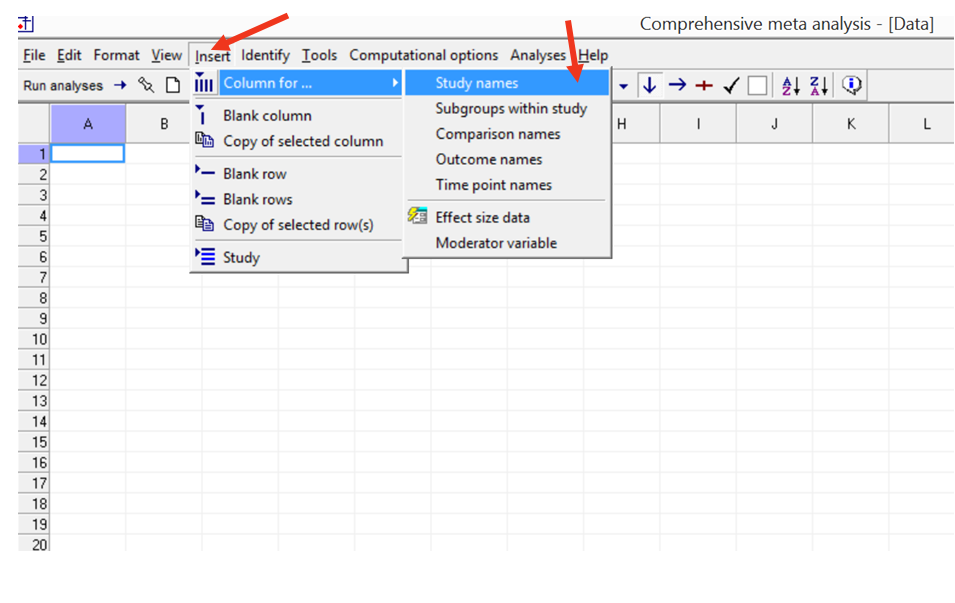

* This creates a column for the study names. It is customary to have the first author and year in the study detail. For our purposes, i just labeled studies by numbers (see screenshot below).
* After this, you can input effect sizes. CMA can accept many varieties of effect size parameters, so you need to specify it. We will specify Hedges's *d* as our effect size. 

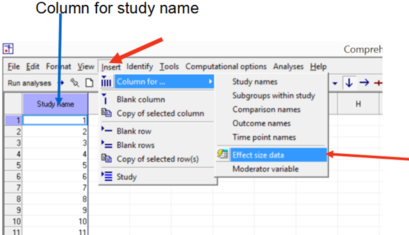

The following window pops up. Click 'Next'.

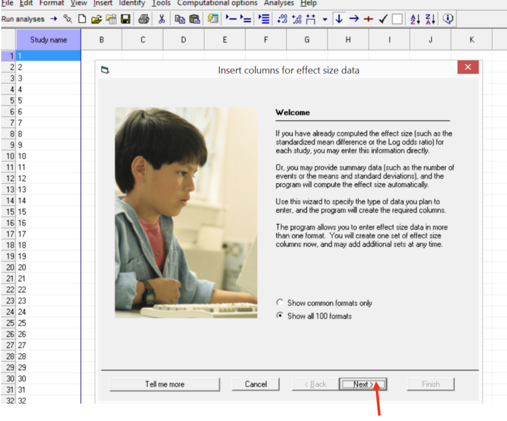

* You can now select the kind of studies you are analyzing. Here, since we are comparing studies that compare schizophrenics with a control group, we choose the first option, and then click 'Next'. See below.

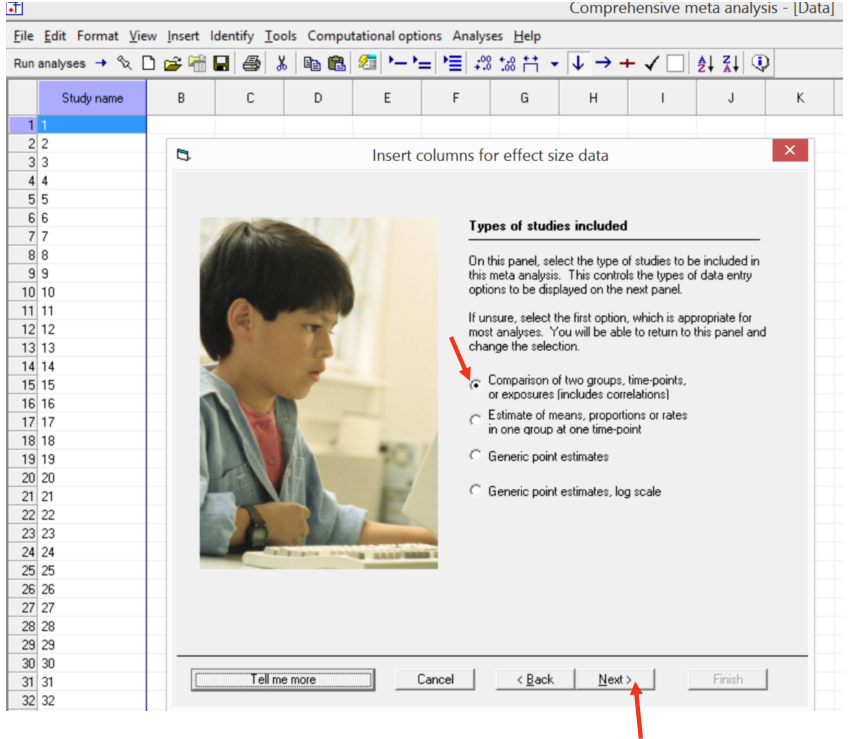

* A new window appears, from which you can choose the desired effect size metric. Our metric is Hedge's *d*, so we click on 'continuous means', which gives us the option, 'computed effect sizes', which then gives us a lot of effect sizes, from which we choose Hedges's *d* with variance. See below.


* The main window now appears with columns where we can input the effect sizes of individual studies. We can also optionally label our groups as well. We label them as 'Schizophrenia' and 'Control', as below.


* We can now transfer our effect sizes from spreadsheets onto this window. The window after transferring our effect size and variance column is as below. 

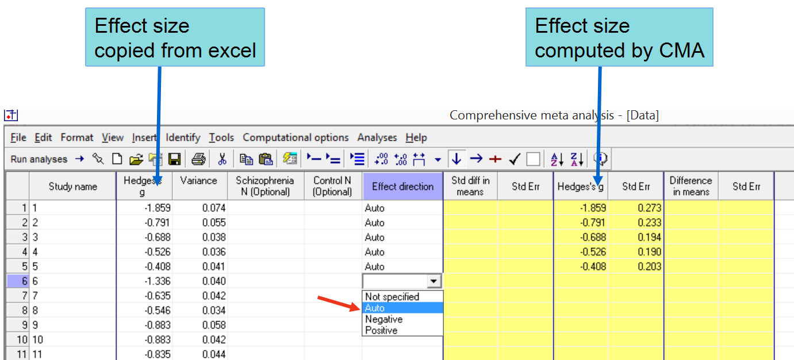

* As shown above, you have to specify the direction (sign) of the effect size. For each study we specify it to be 'auto'; it then takes the sign of our input Hedges's *d*.
* You can also see that the yellow-highlighted columns are calculated outputs by CMA. In our case, since we have given the effect sizes already, this seems redundant. But you can instead opt to input just the means and SDs of the two groups; CMA will calculate the effect size and display it in the yellow column.
* We are also interested in looking at the effect of age as a moderator. So we will include the age in the dataset as follows: 

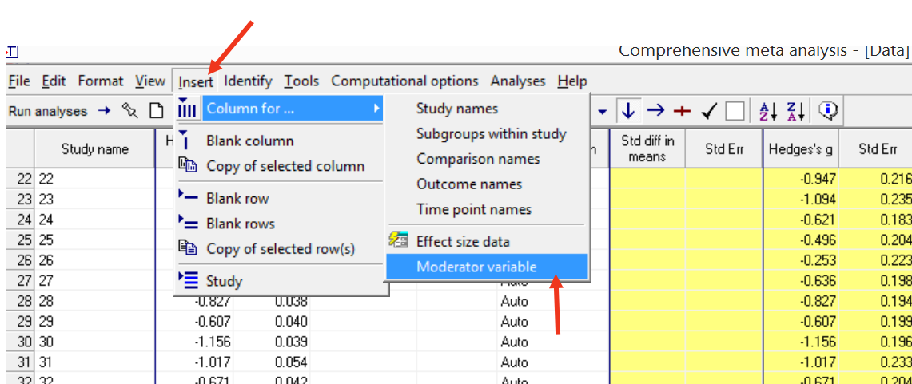

* We then get a new window where we can specify the variable name and data type. We specify 'Age' as the moderator.

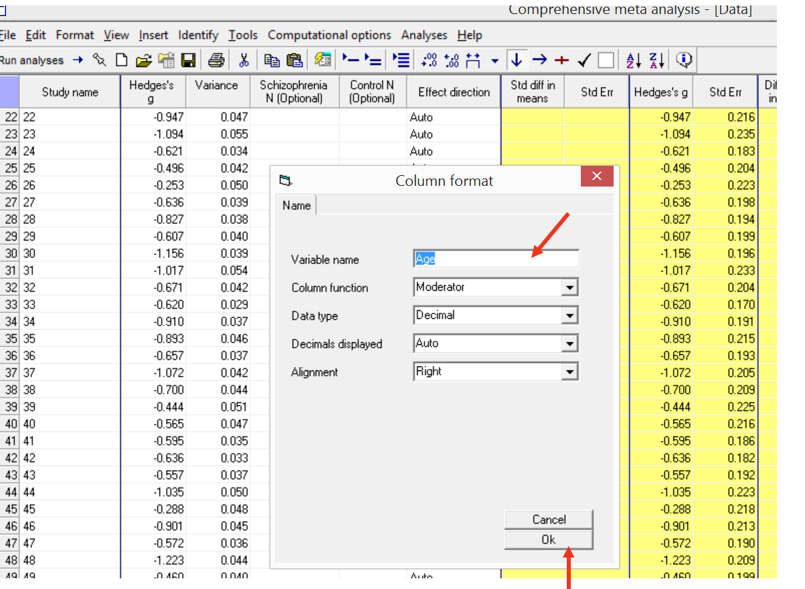

* We get the final dataset with both the effect size and moderator columns, as shown below.

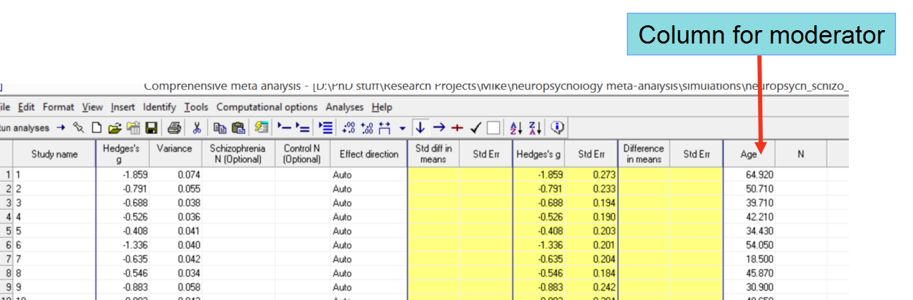

* Now we can conduct our analysis. We will do both a meta-analysis using fixed effects model as well as random-effects model. We will then do a meta-regression, with age as the moderator.

## Fixed- and mixed-effects models

* Click the 'run analyses' icon, as shown below.

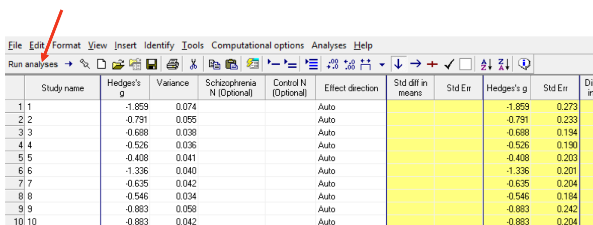

* The default analysis is fixed effects model, so you get the display below.

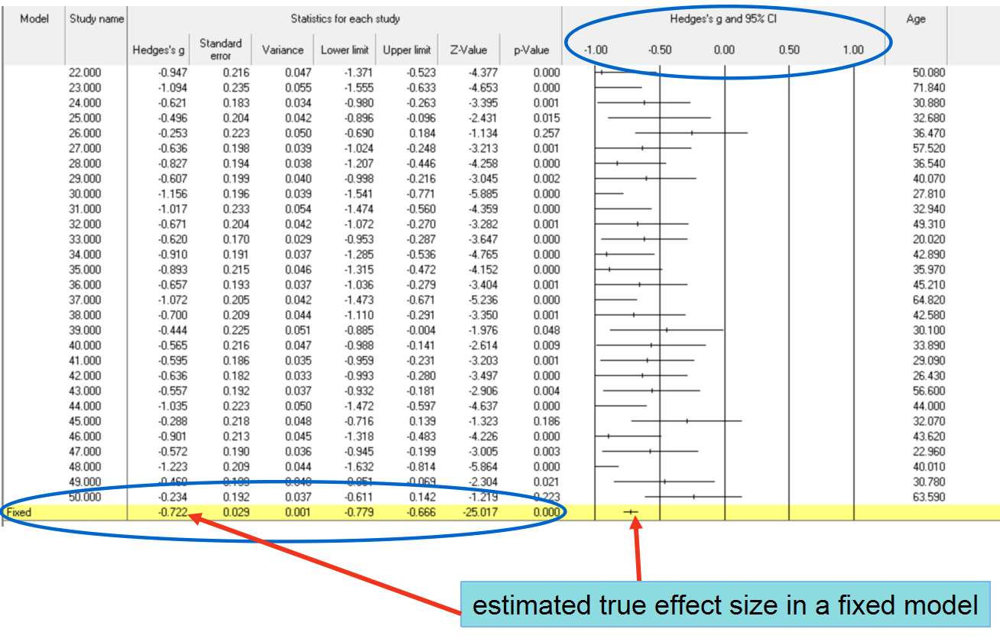

* Clicking on "Both models" icon (see figure below) will show both fixed-effects and random-effects models.

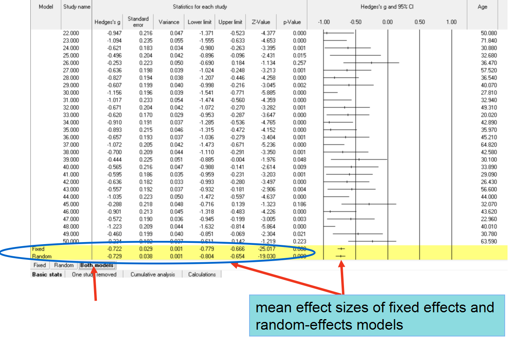

* Clicking on 'View', as shown below, brings up the 'statistics' option.

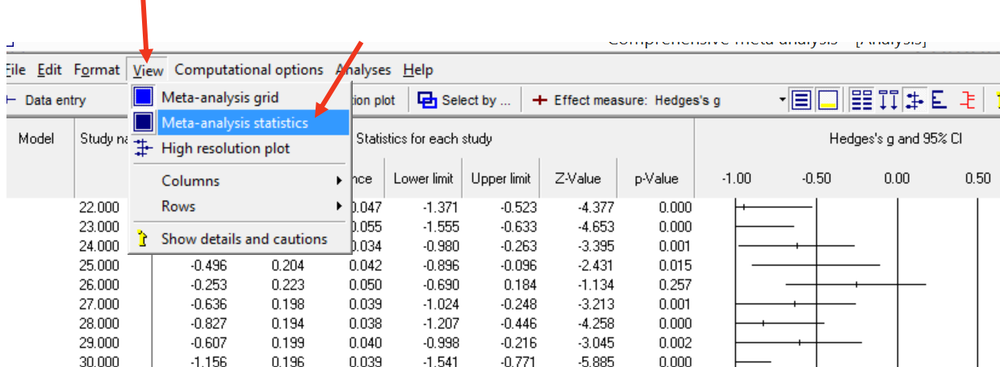

* That brings up the window below. It gives both the fixed-effects as well as random-effects results. 

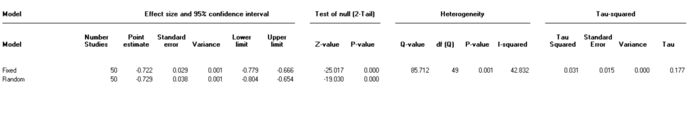


## Mixed-effects model

* Click on 'analyses' and then 'meta regression 2' icons as shown below:

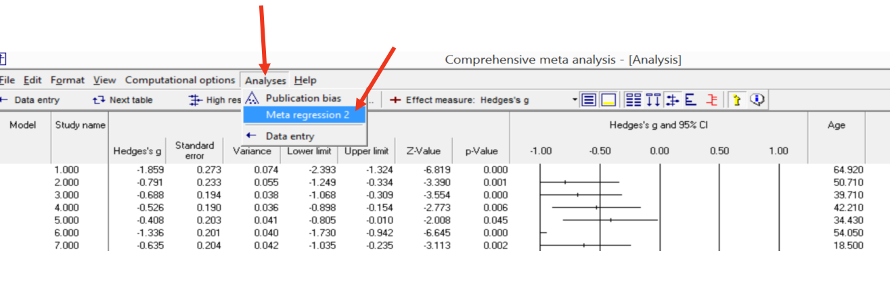

* We get the screen below. This screen shows all variables we had included in the main window spreadsheet under the label 'moderator'.  The window shows that currently, we do not have any moderators in our meta-analysis model. We specify that we should include 'age' in our model, by clicking on 'Age', and then 'Add to main screen.' 

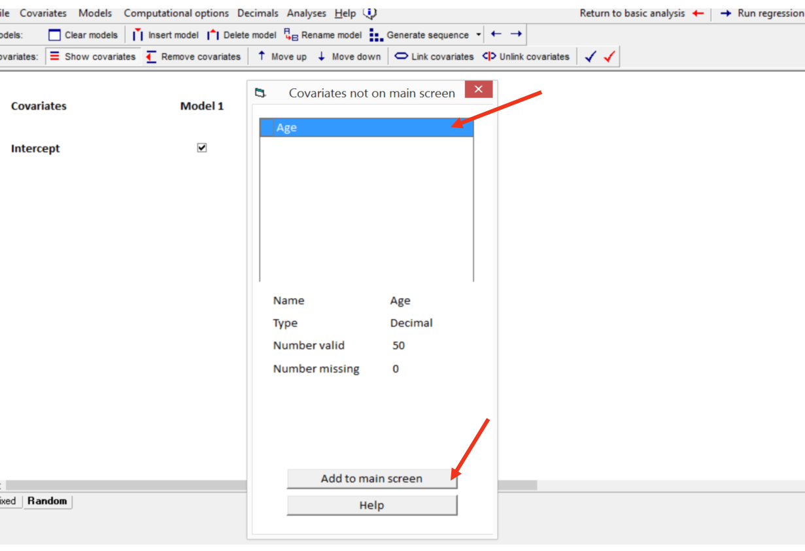

* Then, we specify the type of estimation method we want to employ ('Maximum Likelihood'), make sure the "Random" icon at the lower left is highlighted to specify a mixed model, and then click 'Run Regression'. See below.

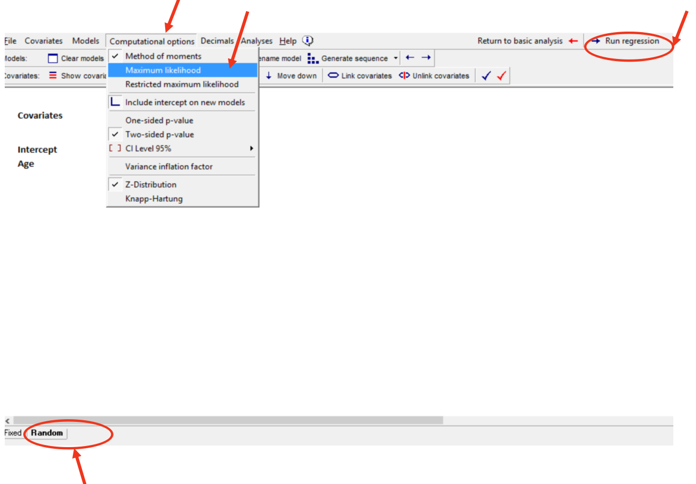

* We get the results below:

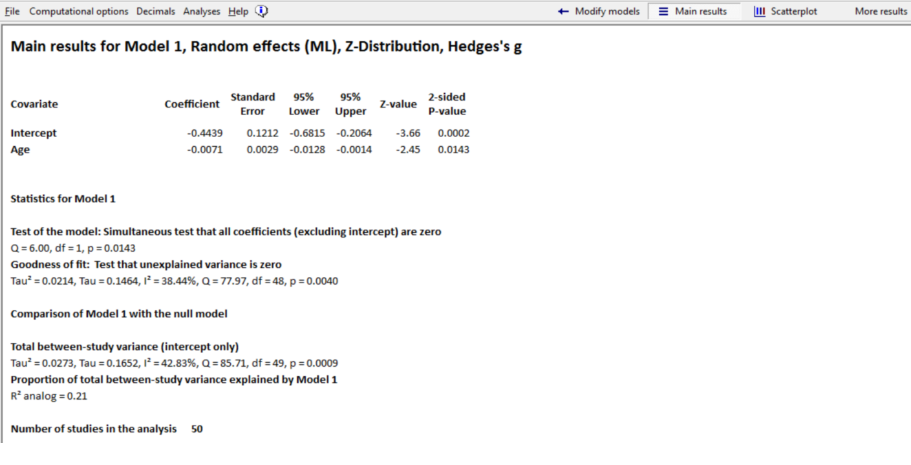

* We can get more details by clicking on the tabs at the top of the window. For instance, clicking on "Scatterplot" gives you the following figure:

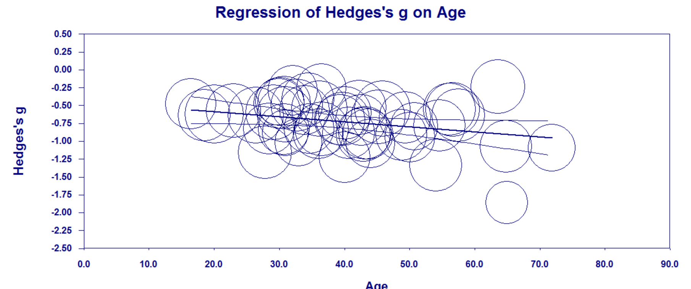

