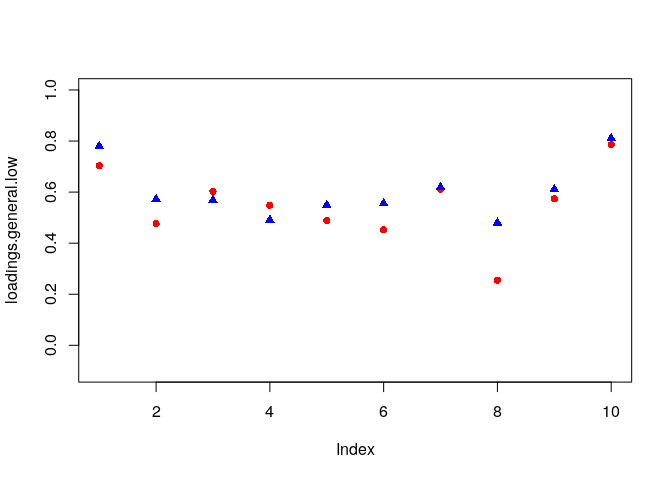
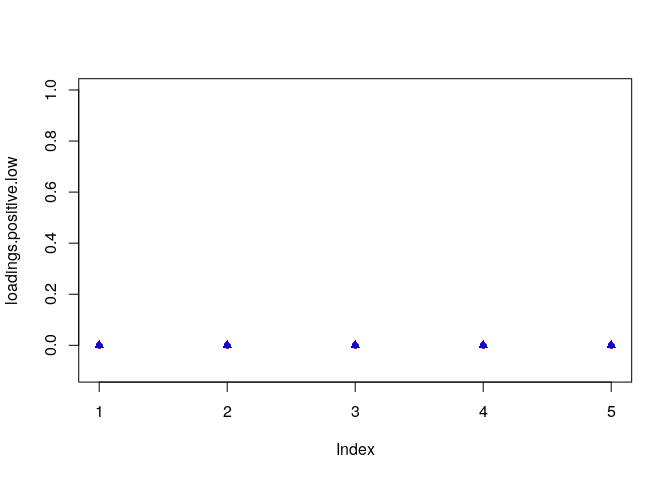
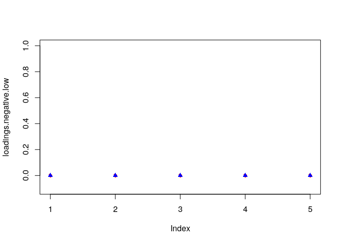

# Data preparation  

```r
library(metaSEM)

## Create a new dataset without missing value in Individualism
index_na <- is.na(Gnambs18$Individualism)
Gnambs18 <- lapply(Gnambs18, function(x) x[!index_na])

## Select data with the correlation matrices, i.e., exclude studies with only factor loadings
index <- Gnambs18$CorMat==1
Gnambs18 <- lapply(Gnambs18, function(x) x[index])

## Create a dataframe with the data and the asymptotic variances and covariances (acov)
my.df <- Cor2DataFrame(Gnambs18$data, Gnambs18$n, acov = "weighted")

## Add the standardized individualism as the moderator
## Standardization of the moderator improves the convergence.
my.df$data <- data.frame(my.df$data,
                         Individualism=scale(Gnambs18$Individualism),
                         check.names=FALSE)
summary(my.df)
```

```
##         Length Class      Mode     
## data    1081   data.frame list     
## n         34   -none-     numeric  
## ylabels   45   -none-     character
## vlabels 1035   -none-     character
```

# One-Stage MASEM
## Bifactor model without moderation

```r
## Specify the bifactor model

model0 <- "G =~  g1*I1 + g2*I2 + g3*I3 + g4*I4 + g5*I5 + 
                 g6*I6 + g7*I7 + g8*I8 + g9*I9 + g10*I10
          POS =~ p1*I1 + p3*I3 + p4*I4 + p7*I7 + p10*I10
          NEG =~ n2*I2 + n5*I5 + n6*I6 + n8*I8 + n9*I9"

RAM0 <- lavaan2RAM(model0, obs.variables = paste0("I", 1:10))
RAM0
```

```
## $A
##     I1  I2  I3  I4  I5  I6  I7  I8  I9  I10 G       POS     NEG   
## I1  "0" "0" "0" "0" "0" "0" "0" "0" "0" "0" "0*g1"  "0*p1"  "0"   
## I2  "0" "0" "0" "0" "0" "0" "0" "0" "0" "0" "0*g2"  "0"     "0*n2"
## I3  "0" "0" "0" "0" "0" "0" "0" "0" "0" "0" "0*g3"  "0*p3"  "0"   
## I4  "0" "0" "0" "0" "0" "0" "0" "0" "0" "0" "0*g4"  "0*p4"  "0"   
## I5  "0" "0" "0" "0" "0" "0" "0" "0" "0" "0" "0*g5"  "0"     "0*n5"
## I6  "0" "0" "0" "0" "0" "0" "0" "0" "0" "0" "0*g6"  "0"     "0*n6"
## I7  "0" "0" "0" "0" "0" "0" "0" "0" "0" "0" "0*g7"  "0*p7"  "0"   
## I8  "0" "0" "0" "0" "0" "0" "0" "0" "0" "0" "0*g8"  "0"     "0*n8"
## I9  "0" "0" "0" "0" "0" "0" "0" "0" "0" "0" "0*g9"  "0"     "0*n9"
## I10 "0" "0" "0" "0" "0" "0" "0" "0" "0" "0" "0*g10" "0*p10" "0"   
## G   "0" "0" "0" "0" "0" "0" "0" "0" "0" "0" "0"     "0"     "0"   
## POS "0" "0" "0" "0" "0" "0" "0" "0" "0" "0" "0"     "0"     "0"   
## NEG "0" "0" "0" "0" "0" "0" "0" "0" "0" "0" "0"     "0"     "0"   
## 
## $S
##     I1           I2           I3           I4           I5          
## I1  "0*I1WITHI1" "0"          "0"          "0"          "0"         
## I2  "0"          "0*I2WITHI2" "0"          "0"          "0"         
## I3  "0"          "0"          "0*I3WITHI3" "0"          "0"         
## I4  "0"          "0"          "0"          "0*I4WITHI4" "0"         
## I5  "0"          "0"          "0"          "0"          "0*I5WITHI5"
## I6  "0"          "0"          "0"          "0"          "0"         
## I7  "0"          "0"          "0"          "0"          "0"         
## I8  "0"          "0"          "0"          "0"          "0"         
## I9  "0"          "0"          "0"          "0"          "0"         
## I10 "0"          "0"          "0"          "0"          "0"         
## G   "0"          "0"          "0"          "0"          "0"         
## POS "0"          "0"          "0"          "0"          "0"         
## NEG "0"          "0"          "0"          "0"          "0"         
##     I6           I7           I8           I9           I10            G  
## I1  "0"          "0"          "0"          "0"          "0"            "0"
## I2  "0"          "0"          "0"          "0"          "0"            "0"
## I3  "0"          "0"          "0"          "0"          "0"            "0"
## I4  "0"          "0"          "0"          "0"          "0"            "0"
## I5  "0"          "0"          "0"          "0"          "0"            "0"
## I6  "0*I6WITHI6" "0"          "0"          "0"          "0"            "0"
## I7  "0"          "0*I7WITHI7" "0"          "0"          "0"            "0"
## I8  "0"          "0"          "0*I8WITHI8" "0"          "0"            "0"
## I9  "0"          "0"          "0"          "0*I9WITHI9" "0"            "0"
## I10 "0"          "0"          "0"          "0"          "0*I10WITHI10" "0"
## G   "0"          "0"          "0"          "0"          "0"            "1"
## POS "0"          "0"          "0"          "0"          "0"            "0"
## NEG "0"          "0"          "0"          "0"          "0"            "0"
##     POS NEG
## I1  "0" "0"
## I2  "0" "0"
## I3  "0" "0"
## I4  "0" "0"
## I5  "0" "0"
## I6  "0" "0"
## I7  "0" "0"
## I8  "0" "0"
## I9  "0" "0"
## I10 "0" "0"
## G   "0" "0"
## POS "1" "0"
## NEG "0" "1"
## 
## $F
##     I1 I2 I3 I4 I5 I6 I7 I8 I9 I10 G POS NEG
## I1   1  0  0  0  0  0  0  0  0   0 0   0   0
## I2   0  1  0  0  0  0  0  0  0   0 0   0   0
## I3   0  0  1  0  0  0  0  0  0   0 0   0   0
## I4   0  0  0  1  0  0  0  0  0   0 0   0   0
## I5   0  0  0  0  1  0  0  0  0   0 0   0   0
## I6   0  0  0  0  0  1  0  0  0   0 0   0   0
## I7   0  0  0  0  0  0  1  0  0   0 0   0   0
## I8   0  0  0  0  0  0  0  1  0   0 0   0   0
## I9   0  0  0  0  0  0  0  0  1   0 0   0   0
## I10  0  0  0  0  0  0  0  0  0   1 0   0   0
## 
## $M
##   I1 I2 I3 I4 I5 I6 I7 I8 I9 I10 G POS NEG
## 1  0  0  0  0  0  0  0  0  0   0 0   0   0
```

```r
## Create matrices with implicit diagonal constraints
M0 <- create.vechsR(A0=RAM0$A, S0=RAM0$S, F0=RAM0$F)

## Create heterogeneity variances
T0 <- create.Tau2(RAM=RAM0, RE.type="Diag", Transform="expLog", RE.startvalues=0.05)

## Fit the bifactor model with One-Stage MASEM
fit0 <- osmasem(model.name="No moderator", Mmatrix=M0, Tmatrix=T0, data=my.df)
```

```
## Running No moderator with 65 parameters
```

```r
summary(fit0, Saturated=TRUE)
```

```
## Summary of No moderator 
##  
## free parameters:
##       name  matrix row col    Estimate  Std.Error A     z value
## 1       g1      A0  I1   G  0.75244921 0.01446325    52.0248925
## 2       g2      A0  I2   G  0.53608523 0.01349408    39.7274285
## 3       g3      A0  I3   G  0.59497998 0.01812569    32.8252241
## 4       g4      A0  I4   G  0.52192287 0.01293412    40.3524037
## 5       g5      A0  I5   G  0.52813421 0.01556592    33.9288701
## 6       g6      A0  I6   G  0.51469565 0.01182057    43.5423555
## 7       g7      A0  I7   G  0.62027274 0.01400771    44.2808175
## 8       g8      A0  I8   G  0.38546751 0.01892852    20.3643758
## 9       g9      A0  I9   G  0.59454167 0.01423274    41.7728106
## 10     g10      A0 I10   G  0.80265501 0.01495073    53.6866798
## 11      p1      A0  I1 POS -0.04575850 0.04371546    -1.0467348
## 12      p3      A0  I3 POS  0.53259358 0.07105377     7.4956418
## 13      p4      A0  I4 POS  0.30699391 0.03823746     8.0286176
## 14      p7      A0  I7 POS  0.31793304 0.04172815     7.6191509
## 15     p10      A0 I10 POS -0.03367472 0.04534146    -0.7426915
## 16      n2      A0  I2 NEG  0.58802947 0.02531073    23.2324178
## 17      n5      A0  I5 NEG  0.32329292 0.02319257    13.9395031
## 18      n6      A0  I6 NEG  0.59884499 0.02421514    24.7301866
## 19      n8      A0  I8 NEG  0.39899613 0.03153413    12.6528352
## 20      n9      A0  I9 NEG  0.38519527 0.02312992    16.6535464
## 21  Tau1_1 vecTau1   1   1 -2.35054289 0.13014430   -18.0610512
## 22  Tau1_2 vecTau1   2   1 -2.55664300 0.13146084   -19.4479437
## 23  Tau1_3 vecTau1   3   1 -2.52515268 0.13230771   -19.0854534
## 24  Tau1_4 vecTau1   4   1 -2.17353428 0.13170623   -16.5028967
## 25  Tau1_5 vecTau1   5   1 -2.71989494 0.13902077   -19.5646655
## 26  Tau1_6 vecTau1   6   1 -2.27957449 0.12784321   -17.8310178
## 27  Tau1_7 vecTau1   7   1 -1.84781188 0.12524387   -14.7537114
## 28  Tau1_8 vecTau1   8   1 -2.44592860 0.13081305   -18.6978949
## 29  Tau1_9 vecTau1   9   1 -2.19252982 0.12784454   -17.1499687
## 30 Tau1_10 vecTau1  10   1 -2.58088133 0.13241958   -19.4901784
## 31 Tau1_11 vecTau1  11   1 -2.67041565 0.13382618   -19.9543585
## 32 Tau1_12 vecTau1  12   1 -2.64662301 0.13600133   -19.4602735
## 33 Tau1_13 vecTau1  13   1 -2.34564148 0.13584675   -17.2668211
## 34 Tau1_14 vecTau1  14   1 -2.39550736 0.12763891   -18.7678454
## 35 Tau1_15 vecTau1  15   1 -2.05947245 0.12808154   -16.0793857
## 36 Tau1_16 vecTau1  16   1 -2.61225405 0.13731708   -19.0235191
## 37 Tau1_17 vecTau1  17   1 -2.51181754 0.12844348   -19.5558193
## 38 Tau1_18 vecTau1  18   1 -2.78116592 0.13708232   -20.2882908
## 39 Tau1_19 vecTau1  19   1 -2.34790243 0.13428754   -17.4841420
## 40 Tau1_20 vecTau1  20   1 -2.73822516 0.14075133   -19.4543462
## 41 Tau1_21 vecTau1  21   1 -2.01793992 0.12584569   -16.0350335
## 42 Tau1_22 vecTau1  22   1 -2.13510668 0.13108433   -16.2880385
## 43 Tau1_23 vecTau1  23   1 -2.63652213 0.13213003   -19.9539963
## 44 Tau1_24 vecTau1  24   1 -2.64701475 0.13780715   -19.2081088
## 45 Tau1_25 vecTau1  25   1 -2.55203633 0.13651238   -18.6945415
## 46 Tau1_26 vecTau1  26   1 -2.73492072 0.13613712   -20.0894558
## 47 Tau1_27 vecTau1  27   1 -2.23643924 0.13055917   -17.1296989
## 48 Tau1_28 vecTau1  28   1 -2.08843909 0.12935902   -16.1445181
## 49 Tau1_29 vecTau1  29   1 -2.53507502 0.13405283   -18.9110150
## 50 Tau1_30 vecTau1  30   1 -2.74816855 0.13738407   -20.0035464
## 51 Tau1_31 vecTau1  31   1 -2.76147750 0.14356565   -19.2349461
## 52 Tau1_32 vecTau1  32   1 -2.35285593 0.12975562   -18.1329784
## 53 Tau1_33 vecTau1  33   1 -2.32743590 0.13326906   -17.4641879
## 54 Tau1_34 vecTau1  34   1 -2.09259458 0.13007996   -16.0869861
## 55 Tau1_35 vecTau1  35   1 -2.32911405 0.13729266   -16.9645927
## 56 Tau1_36 vecTau1  36   1 -2.66552749 0.13172536   -20.2354924
## 57 Tau1_37 vecTau1  37   1 -2.02206268 0.12939228   -15.6273829
## 58 Tau1_38 vecTau1  38   1 -2.81011584 0.13973542   -20.1102621
## 59 Tau1_39 vecTau1  39   1 -2.76842154 0.13396202   -20.6657201
## 60 Tau1_40 vecTau1  40   1 -2.04198983 0.12698413   -16.0806689
## 61 Tau1_41 vecTau1  41   1 -2.44275401 0.12767372   -19.1327863
## 62 Tau1_42 vecTau1  42   1 -2.48741256 0.12792749   -19.4439251
## 63 Tau1_43 vecTau1  43   1 -2.02989147 0.12748797   -15.9222194
## 64 Tau1_44 vecTau1  44   1 -1.73665732 0.12526855   -13.8634748
## 65 Tau1_45 vecTau1  45   1 -2.47511105 0.12975597   -19.0751234
##        Pr(>|z|)
## 1  0.000000e+00
## 2  0.000000e+00
## 3  0.000000e+00
## 4  0.000000e+00
## 5  0.000000e+00
## 6  0.000000e+00
## 7  0.000000e+00
## 8  0.000000e+00
## 9  0.000000e+00
## 10 0.000000e+00
## 11 2.952219e-01
## 12 6.594725e-14
## 13 8.881784e-16
## 14 2.553513e-14
## 15 4.576685e-01
## 16 0.000000e+00
## 17 0.000000e+00
## 18 0.000000e+00
## 19 0.000000e+00
## 20 0.000000e+00
## 21 0.000000e+00
## 22 0.000000e+00
## 23 0.000000e+00
## 24 0.000000e+00
## 25 0.000000e+00
## 26 0.000000e+00
## 27 0.000000e+00
## 28 0.000000e+00
## 29 0.000000e+00
## 30 0.000000e+00
## 31 0.000000e+00
## 32 0.000000e+00
## 33 0.000000e+00
## 34 0.000000e+00
## 35 0.000000e+00
## 36 0.000000e+00
## 37 0.000000e+00
## 38 0.000000e+00
## 39 0.000000e+00
## 40 0.000000e+00
## 41 0.000000e+00
## 42 0.000000e+00
## 43 0.000000e+00
## 44 0.000000e+00
## 45 0.000000e+00
## 46 0.000000e+00
## 47 0.000000e+00
## 48 0.000000e+00
## 49 0.000000e+00
## 50 0.000000e+00
## 51 0.000000e+00
## 52 0.000000e+00
## 53 0.000000e+00
## 54 0.000000e+00
## 55 0.000000e+00
## 56 0.000000e+00
## 57 0.000000e+00
## 58 0.000000e+00
## 59 0.000000e+00
## 60 0.000000e+00
## 61 0.000000e+00
## 62 0.000000e+00
## 63 0.000000e+00
## 64 0.000000e+00
## 65 0.000000e+00
## 
## Model Statistics: 
##                |  Parameters  |  Degrees of Freedom  |  Fit (-2lnL units)
##        Model:             65                   1465             -2611.382
##    Saturated:             90                   1440             -2647.319
## Independence:             90                   1440                    NA
## Number of observations/statistics: 104684/1530
## 
## chi-square:  χ² ( df=25 ) = 35.93692,  p = 0.07256245
## Information Criteria: 
##       |  df Penalty  |  Parameters Penalty  |  Sample-Size Adjusted
## AIC:      -5541.382              -2481.382                -2481.300
## BIC:     -19544.880              -1860.066                -2066.639
## CFI: NA 
## TLI: NA   (also known as NNFI) 
## RMSEA:  0.002044266  [95% CI (0, 0.003674861)]
## Prob(RMSEA <= 0.05): 1
## To get additional fit indices, see help(mxRefModels)
## timestamp: 2018-11-21 20:53:16 
## Wall clock time: 142.9647 secs 
## optimizer:  SLSQP 
## OpenMx version number: 2.11.5 
## Need help?  See help(mxSummary)
```

```r
## SRMR
osmasemSRMR(fit0)
```

```
## [1] 0.01620694
```

```r
## Estimated Tau2
diag(VarCorr(fit0))
```

```
##      Tau2_1      Tau2_2      Tau2_3      Tau2_4      Tau2_5      Tau2_6 
## 0.009085407 0.006016281 0.006407377 0.012944704 0.004340395 0.010470966 
##      Tau2_7      Tau2_8      Tau2_9     Tau2_10     Tau2_11     Tau2_12 
## 0.024831960 0.007507467 0.012462145 0.005731588 0.004791886 0.005025421 
##     Tau2_13     Tau2_14     Tau2_15     Tau2_16     Tau2_17     Tau2_18 
## 0.009174908 0.008304027 0.016261663 0.005383007 0.006580562 0.003839812 
##     Tau2_19     Tau2_20     Tau2_21     Tau2_22     Tau2_23     Tau2_24 
## 0.009133513 0.004184156 0.017670126 0.013978800 0.005127976 0.005021485 
##     Tau2_25     Tau2_26     Tau2_27     Tau2_28     Tau2_29     Tau2_30 
## 0.006071967 0.004211900 0.011414412 0.015346341 0.006281478 0.004101768 
##     Tau2_31     Tau2_32     Tau2_33     Tau2_34     Tau2_35     Tau2_36 
## 0.003994028 0.009043474 0.009515133 0.015219327 0.009483251 0.004838962 
##     Tau2_37     Tau2_38     Tau2_39     Tau2_40     Tau2_41     Tau2_42 
## 0.017525026 0.003623801 0.003938942 0.016840313 0.007555285 0.006909727 
##     Tau2_43     Tau2_44     Tau2_45 
## 0.017252764 0.031014059 0.007081836
```

## Bifactor model  with `Individualism` as a moderator on the A matrix

```r
## Create the A1 matrix with moderator effects of "Individualism"
Ax1 <- RAM0$A
Ax1[grep("\\*", Ax1)] <- "0*data.Individualism"
Ax1
```

```
##     I1  I2  I3  I4  I5  I6  I7  I8  I9  I10 G                     
## I1  "0" "0" "0" "0" "0" "0" "0" "0" "0" "0" "0*data.Individualism"
## I2  "0" "0" "0" "0" "0" "0" "0" "0" "0" "0" "0*data.Individualism"
## I3  "0" "0" "0" "0" "0" "0" "0" "0" "0" "0" "0*data.Individualism"
## I4  "0" "0" "0" "0" "0" "0" "0" "0" "0" "0" "0*data.Individualism"
## I5  "0" "0" "0" "0" "0" "0" "0" "0" "0" "0" "0*data.Individualism"
## I6  "0" "0" "0" "0" "0" "0" "0" "0" "0" "0" "0*data.Individualism"
## I7  "0" "0" "0" "0" "0" "0" "0" "0" "0" "0" "0*data.Individualism"
## I8  "0" "0" "0" "0" "0" "0" "0" "0" "0" "0" "0*data.Individualism"
## I9  "0" "0" "0" "0" "0" "0" "0" "0" "0" "0" "0*data.Individualism"
## I10 "0" "0" "0" "0" "0" "0" "0" "0" "0" "0" "0*data.Individualism"
## G   "0" "0" "0" "0" "0" "0" "0" "0" "0" "0" "0"                   
## POS "0" "0" "0" "0" "0" "0" "0" "0" "0" "0" "0"                   
## NEG "0" "0" "0" "0" "0" "0" "0" "0" "0" "0" "0"                   
##     POS                    NEG                   
## I1  "0*data.Individualism" "0"                   
## I2  "0"                    "0*data.Individualism"
## I3  "0*data.Individualism" "0"                   
## I4  "0*data.Individualism" "0"                   
## I5  "0"                    "0*data.Individualism"
## I6  "0"                    "0*data.Individualism"
## I7  "0*data.Individualism" "0"                   
## I8  "0"                    "0*data.Individualism"
## I9  "0"                    "0*data.Individualism"
## I10 "0*data.Individualism" "0"                   
## G   "0"                    "0"                   
## POS "0"                    "0"                   
## NEG "0"                    "0"
```

```r
## Create matrices with implicit diagonal constraints
M1 <- create.vechsR(A0=RAM0$A, S0=RAM0$S, F0=RAM0$F, Ax=Ax1)

## Fit the bifactor model with moderator
fit1 <- osmasem(model.name="Moderation by individualism", Mmatrix=M1, Tmatrix=T0, data=my.df)
```

```
## Running Moderation by individualism with 85 parameters
```

```r
summary(fit1)
```

```
## Summary of Moderation by individualism 
##  
## free parameters:
##       name  matrix row col      Estimate  Std.Error A      z value
## 1       g1      A0  I1   G  0.7267730592 0.01945663    37.35348914
## 2       g2      A0  I2   G  0.5513982008 0.01850664    29.79461762
## 3       g3      A0  I3   G  0.5685814940 0.02076062    27.38749655
## 4       g4      A0  I4   G  0.5043325694 0.01818264    27.73703956
## 5       g5      A0  I5   G  0.5462138345 0.02102743    25.97625738
## 6       g6      A0  I6   G  0.5307463570 0.01691030    31.38597234
## 7       g7      A0  I7   G  0.5959744078 0.01882220    31.66337555
## 8       g8      A0  I8   G  0.3917142942 0.01951364    20.07387392
## 9       g9      A0  I9   G  0.6162444970 0.02143666    28.74722768
## 10     g10      A0 I10   G  0.7773692412 0.02123726    36.60402042
## 11      p1      A0  I1 POS  0.0032398705 0.05182172     0.06251954
## 12      p3      A0  I3 POS  0.5045002768 0.04440561    11.36118407
## 13      p4      A0  I4 POS  0.3537903658 0.03871810     9.13759610
## 14      p7      A0  I7 POS  0.3585414916 0.04183096     8.57119837
## 15     p10      A0 I10 POS  0.0157718488 0.05396914     0.29223830
## 16      n2      A0  I2 NEG  0.5690593492 0.02840241    20.03560143
## 17      n5      A0  I5 NEG  0.3003226468 0.03141427     9.56007071
## 18      n6      A0  I6 NEG  0.5804915248 0.02622161    22.13790934
## 19      n8      A0  I8 NEG  0.3904780982 0.03059079    12.76456537
## 20      n9      A0  I9 NEG  0.3578808386 0.03401957    10.51985110
## 21    g1_1      A1  I1   G  0.0875084639 0.02096123     4.17477729
## 22    g2_1      A1  I2   G  0.0221092420 0.01956025     1.13031503
## 23    g3_1      A1  I3   G  0.0727608801 0.01649162     4.41199183
## 24    g4_1      A1  I4   G  0.0353518713 0.01633840     2.16372945
## 25    g5_1      A1  I5   G  0.0006452665 0.02102225     0.03069445
## 26    g6_1      A1  I6   G  0.0200899124 0.01811552     1.10898885
## 27    g7_1      A1  I7   G  0.0727038006 0.01762043     4.12610801
## 28    g8_1      A1  I8   G  0.1228599556 0.02008005     6.11850732
## 29    g9_1      A1  I9   G -0.0168852714 0.02261586    -0.74661191
## 30   g10_1      A1 I10   G  0.0658304403 0.02271717     2.89782812
## 31    p1_1      A1  I1 POS -0.1620714986 0.03394960    -4.77388568
## 32    p3_1      A1  I3 POS -0.0600509617 0.02963955    -2.02604173
## 33    p4_1      A1  I4 POS -0.0424580683 0.02578839    -1.64640249
## 34    p7_1      A1  I7 POS -0.0749900729 0.03046985    -2.46112410
## 35   p10_1      A1 I10 POS -0.1798610162 0.03488908    -5.15522422
## 36    n2_1      A1  I2 NEG  0.0067356037 0.02955351     0.22791216
## 37    n5_1      A1  I5 NEG -0.0012634397 0.03076787    -0.04106361
## 38    n6_1      A1  I6 NEG  0.0045877557 0.02693389     0.17033395
## 39    n8_1      A1  I8 NEG  0.0329745248 0.03050509     1.08095143
## 40    n9_1      A1  I9 NEG  0.0650140619 0.03508244     1.85317950
## 41  Tau1_1 vecTau1   1   1 -2.4635839441 0.13083640   -18.82949954
## 42  Tau1_2 vecTau1   2   1 -2.6006915114 0.13325868   -19.51611292
## 43  Tau1_3 vecTau1   3   1 -2.5348826654 0.13286345   -19.07885591
## 44  Tau1_4 vecTau1   4   1 -2.2190521243 0.13199788   -16.81127083
## 45  Tau1_5 vecTau1   5   1 -2.9220310049 0.14420623   -20.26286270
## 46  Tau1_6 vecTau1   6   1 -2.3321976924 0.12888041   -18.09582833
## 47  Tau1_7 vecTau1   7   1 -2.0583214896 0.12605879   -16.32826625
## 48  Tau1_8 vecTau1   8   1 -2.5190244723 0.13232133   -19.03717653
## 49  Tau1_9 vecTau1   9   1 -2.3464720141 0.13987992   -16.77490272
## 50 Tau1_10 vecTau1  10   1 -2.6106419273 0.13184448   -19.80091945
## 51 Tau1_11 vecTau1  11   1 -2.6943063228 0.13390852   -20.12050015
## 52 Tau1_12 vecTau1  12   1 -2.6587781933 0.13646517   -19.48320024
## 53 Tau1_13 vecTau1  13   1 -2.3464174041 0.13840611   -16.95313445
## 54 Tau1_14 vecTau1  14   1 -2.4655111794 0.12765108   -19.31445534
## 55 Tau1_15 vecTau1  15   1 -2.2225397809 0.12863185   -17.27830019
## 56 Tau1_16 vecTau1  16   1 -2.7004840632 0.14093231   -19.16156769
## 57 Tau1_17 vecTau1  17   1 -2.6053157577 0.12953191   -20.11331227
## 58 Tau1_18 vecTau1  18   1 -2.8028602123 0.13852361   -20.23380840
## 59 Tau1_19 vecTau1  19   1 -2.3747195004 0.13528782   -17.55309106
## 60 Tau1_20 vecTau1  20   1 -2.7833244141 0.14052299   -19.80689738
## 61 Tau1_21 vecTau1  21   1 -2.0491903832 0.12737600   -16.08772703
## 62 Tau1_22 vecTau1  22   1 -2.2997231089 0.13308095   -17.28063342
## 63 Tau1_23 vecTau1  23   1 -2.6497244713 0.13501428   -19.62551218
## 64 Tau1_24 vecTau1  24   1 -2.7070410860 0.13721387   -19.72862514
## 65 Tau1_25 vecTau1  25   1 -2.5952572706 0.13859929   -18.72489583
## 66 Tau1_26 vecTau1  26   1 -2.7737521792 0.13634626   -20.34344215
## 67 Tau1_27 vecTau1  27   1 -2.2379930919 0.13303099   -16.82309600
## 68 Tau1_28 vecTau1  28   1 -2.2049883923 0.13157000   -16.75905158
## 69 Tau1_29 vecTau1  29   1 -2.5703007831 0.13418955   -19.15425465
## 70 Tau1_30 vecTau1  30   1 -2.8157932479 0.13780868   -20.43262679
## 71 Tau1_31 vecTau1  31   1 -2.8081731363 0.14351329   -19.56733887
## 72 Tau1_32 vecTau1  32   1 -2.4048853609 0.13015256   -18.47743385
## 73 Tau1_33 vecTau1  33   1 -2.4778668126 0.13554259   -18.28109375
## 74 Tau1_34 vecTau1  34   1 -2.1210708756 0.13031497   -16.27649394
## 75 Tau1_35 vecTau1  35   1 -2.3359132961 0.13875157   -16.83522009
## 76 Tau1_36 vecTau1  36   1 -2.7616176831 0.13292188   -20.77624574
## 77 Tau1_37 vecTau1  37   1 -2.1925665799 0.12998790   -16.86746618
## 78 Tau1_38 vecTau1  38   1 -2.9215515577 0.14367550   -20.33437557
## 79 Tau1_39 vecTau1  39   1 -2.9584669752 0.13861687   -21.34276251
## 80 Tau1_40 vecTau1  40   1 -2.2524364621 0.12755200   -17.65896600
## 81 Tau1_41 vecTau1  41   1 -2.4862304280 0.12824314   -19.38684979
## 82 Tau1_42 vecTau1  42   1 -2.5311755259 0.12819301   -19.74503483
## 83 Tau1_43 vecTau1  43   1 -2.2889271454 0.13088308   -17.48833540
## 84 Tau1_44 vecTau1  44   1 -1.9860997224 0.12672386   -15.67265796
## 85 Tau1_45 vecTau1  45   1 -2.5404029088 0.13271005   -19.14250647
##        Pr(>|z|)
## 1  0.000000e+00
## 2  0.000000e+00
## 3  0.000000e+00
## 4  0.000000e+00
## 5  0.000000e+00
## 6  0.000000e+00
## 7  0.000000e+00
## 8  0.000000e+00
## 9  0.000000e+00
## 10 0.000000e+00
## 11 9.501491e-01
## 12 0.000000e+00
## 13 0.000000e+00
## 14 0.000000e+00
## 15 7.701044e-01
## 16 0.000000e+00
## 17 0.000000e+00
## 18 0.000000e+00
## 19 0.000000e+00
## 20 0.000000e+00
## 21 2.982777e-05
## 22 2.583435e-01
## 23 1.024240e-05
## 24 3.048512e-02
## 25 9.755132e-01
## 26 2.674350e-01
## 27 3.689540e-05
## 28 9.445593e-10
## 29 4.552979e-01
## 30 3.757565e-03
## 31 1.807050e-06
## 32 4.276051e-02
## 33 9.968092e-02
## 34 1.385024e-02
## 35 2.533276e-07
## 36 8.197145e-01
## 37 9.672452e-01
## 38 8.647475e-01
## 39 2.797187e-01
## 40 6.385664e-02
## 41 0.000000e+00
## 42 0.000000e+00
## 43 0.000000e+00
## 44 0.000000e+00
## 45 0.000000e+00
## 46 0.000000e+00
## 47 0.000000e+00
## 48 0.000000e+00
## 49 0.000000e+00
## 50 0.000000e+00
## 51 0.000000e+00
## 52 0.000000e+00
## 53 0.000000e+00
## 54 0.000000e+00
## 55 0.000000e+00
## 56 0.000000e+00
## 57 0.000000e+00
## 58 0.000000e+00
## 59 0.000000e+00
## 60 0.000000e+00
## 61 0.000000e+00
## 62 0.000000e+00
## 63 0.000000e+00
## 64 0.000000e+00
## 65 0.000000e+00
## 66 0.000000e+00
## 67 0.000000e+00
## 68 0.000000e+00
## 69 0.000000e+00
## 70 0.000000e+00
## 71 0.000000e+00
## 72 0.000000e+00
## 73 0.000000e+00
## 74 0.000000e+00
## 75 0.000000e+00
## 76 0.000000e+00
## 77 0.000000e+00
## 78 0.000000e+00
## 79 0.000000e+00
## 80 0.000000e+00
## 81 0.000000e+00
## 82 0.000000e+00
## 83 0.000000e+00
## 84 0.000000e+00
## 85 0.000000e+00
## 
## Model Statistics: 
##                |  Parameters  |  Degrees of Freedom  |  Fit (-2lnL units)
##        Model:             85                   1445             -2882.271
##    Saturated:           1080                    450                    NA
## Independence:             90                   1440                    NA
## Number of observations/statistics: 104684/1530
## 
## Information Criteria: 
##       |  df Penalty  |  Parameters Penalty  |  Sample-Size Adjusted
## AIC:      -5772.271              -2712.271                -2712.131
## BIC:     -19584.595              -1899.781                -2169.914
## To get additional fit indices, see help(mxRefModels)
## timestamp: 2018-11-21 21:06:04 
## Wall clock time: 276.8083 secs 
## optimizer:  SLSQP 
## OpenMx version number: 2.11.5 
## Need help?  See help(mxSummary)
```

```r
## Get the R2
osmasemR2(fit1, fit0)
```

```
## $Tau2.0
##    Tau2_1_1    Tau2_2_2    Tau2_3_3    Tau2_4_4    Tau2_5_5    Tau2_6_6 
## 0.009085407 0.006016281 0.006407377 0.012944704 0.004340395 0.010470966 
##    Tau2_7_7    Tau2_8_8    Tau2_9_9  Tau2_10_10  Tau2_11_11  Tau2_12_12 
## 0.024831960 0.007507467 0.012462145 0.005731588 0.004791886 0.005025421 
##  Tau2_13_13  Tau2_14_14  Tau2_15_15  Tau2_16_16  Tau2_17_17  Tau2_18_18 
## 0.009174908 0.008304027 0.016261663 0.005383007 0.006580562 0.003839812 
##  Tau2_19_19  Tau2_20_20  Tau2_21_21  Tau2_22_22  Tau2_23_23  Tau2_24_24 
## 0.009133513 0.004184156 0.017670126 0.013978800 0.005127976 0.005021485 
##  Tau2_25_25  Tau2_26_26  Tau2_27_27  Tau2_28_28  Tau2_29_29  Tau2_30_30 
## 0.006071967 0.004211900 0.011414412 0.015346341 0.006281478 0.004101768 
##  Tau2_31_31  Tau2_32_32  Tau2_33_33  Tau2_34_34  Tau2_35_35  Tau2_36_36 
## 0.003994028 0.009043474 0.009515133 0.015219327 0.009483251 0.004838962 
##  Tau2_37_37  Tau2_38_38  Tau2_39_39  Tau2_40_40  Tau2_41_41  Tau2_42_42 
## 0.017525026 0.003623801 0.003938942 0.016840313 0.007555285 0.006909727 
##  Tau2_43_43  Tau2_44_44  Tau2_45_45 
## 0.017252764 0.031014059 0.007081836 
## 
## $Tau2.1
##    Tau2_1_1    Tau2_2_2    Tau2_3_3    Tau2_4_4    Tau2_5_5    Tau2_6_6 
## 0.007246999 0.005508940 0.006283895 0.011818322 0.002897051 0.009424945 
##    Tau2_7_7    Tau2_8_8    Tau2_9_9  Tau2_10_10  Tau2_11_11  Tau2_12_12 
## 0.016299139 0.006486391 0.009159680 0.005400391 0.004568307 0.004904724 
##  Tau2_13_13  Tau2_14_14  Tau2_15_15  Tau2_16_16  Tau2_17_17  Tau2_18_18 
## 0.009160681 0.007219119 0.011736172 0.004512210 0.005458226 0.003676771 
##  Tau2_19_19  Tau2_20_20  Tau2_21_21  Tau2_22_22  Tau2_23_23  Tau2_24_24 
## 0.008656550 0.003823271 0.016599532 0.010057404 0.004994345 0.004453423 
##  Tau2_25_25  Tau2_26_26  Tau2_27_27  Tau2_28_28  Tau2_29_29  Tau2_30_30 
## 0.005569141 0.003897171 0.011378995 0.012155461 0.005854167 0.003582887 
##  Tau2_31_31  Tau2_32_32  Tau2_33_33  Tau2_34_34  Tau2_35_35  Tau2_36_36 
## 0.003637909 0.008149728 0.007042912 0.014376767 0.009355166 0.003992909 
##  Tau2_37_37  Tau2_38_38  Tau2_39_39  Tau2_40_40  Tau2_41_41  Tau2_42_42 
## 0.012461229 0.002899830 0.002693446 0.011054995 0.006926083 0.006330658 
##  Tau2_43_43  Tau2_44_44  Tau2_45_45 
## 0.010276924 0.018831968 0.006214899 
## 
## $R2
##    Tau2_1_1    Tau2_2_2    Tau2_3_3    Tau2_4_4    Tau2_5_5    Tau2_6_6 
## 0.202347398 0.084327962 0.019271856 0.087014866 0.332537539 0.099897286 
##    Tau2_7_7    Tau2_8_8    Tau2_9_9  Tau2_10_10  Tau2_11_11  Tau2_12_12 
## 0.343622512 0.136007978 0.264999711 0.057784433 0.046657787 0.024017246 
##  Tau2_13_13  Tau2_14_14  Tau2_15_15  Tau2_16_16  Tau2_17_17  Tau2_18_18 
## 0.001550642 0.130648411 0.278292008 0.161767707 0.170553312 0.042460758 
##  Tau2_19_19  Tau2_20_20  Tau2_21_21  Tau2_22_22  Tau2_23_23  Tau2_24_24 
## 0.052221197 0.086250216 0.060587798 0.280524534 0.026059126 0.113126280 
##  Tau2_25_25  Tau2_26_26  Tau2_27_27  Tau2_28_28  Tau2_29_29  Tau2_30_30 
## 0.082811150 0.074723731 0.003102887 0.207924534 0.068027089 0.126501961 
##  Tau2_31_31  Tau2_32_32  Tau2_33_33  Tau2_34_34  Tau2_35_35  Tau2_36_36 
## 0.089162952 0.098827750 0.259819954 0.055361144 0.013506452 0.174841996 
##  Tau2_37_37  Tau2_38_38  Tau2_39_39  Tau2_40_40  Tau2_41_41  Tau2_42_42 
## 0.288946637 0.199782271 0.316200725 0.343539830 0.083279670 0.083804883 
##  Tau2_43_43  Tau2_44_44  Tau2_45_45 
## 0.404331725 0.392792559 0.122416986
```

```r
## Compare the models with and without moderator
anova(fit1, fit0)
```

```
##                          base   comparison ep  minus2LL   df       AIC
## 1 Moderation by individualism         <NA> 85 -2882.271 1445 -5772.271
## 2 Moderation by individualism No moderator 65 -2611.382 1465 -5541.382
##    diffLL diffdf            p
## 1      NA     NA           NA
## 2 270.889     20 6.806204e-46
```

```r
## Get the estimated A0 (intercepts of factor loadings) and 
## A1 (regression coefficients of moderator on factor loadings)
A0 <- mxEval(A0, fit1$mx.fit)
A0
```

```
##     I1 I2 I3 I4 I5 I6 I7 I8 I9 I10         G        POS       NEG
## I1   0  0  0  0  0  0  0  0  0   0 0.7267731 0.00323987 0.0000000
## I2   0  0  0  0  0  0  0  0  0   0 0.5513982 0.00000000 0.5690593
## I3   0  0  0  0  0  0  0  0  0   0 0.5685815 0.50450028 0.0000000
## I4   0  0  0  0  0  0  0  0  0   0 0.5043326 0.35379037 0.0000000
## I5   0  0  0  0  0  0  0  0  0   0 0.5462138 0.00000000 0.3003226
## I6   0  0  0  0  0  0  0  0  0   0 0.5307464 0.00000000 0.5804915
## I7   0  0  0  0  0  0  0  0  0   0 0.5959744 0.35854149 0.0000000
## I8   0  0  0  0  0  0  0  0  0   0 0.3917143 0.00000000 0.3904781
## I9   0  0  0  0  0  0  0  0  0   0 0.6162445 0.00000000 0.3578808
## I10  0  0  0  0  0  0  0  0  0   0 0.7773692 0.01577185 0.0000000
## G    0  0  0  0  0  0  0  0  0   0 0.0000000 0.00000000 0.0000000
## POS  0  0  0  0  0  0  0  0  0   0 0.0000000 0.00000000 0.0000000
## NEG  0  0  0  0  0  0  0  0  0   0 0.0000000 0.00000000 0.0000000
```

```r
A1 <- mxEval(A1, fit1$mx.fit)
A1
```

```
##     I1 I2 I3 I4 I5 I6 I7 I8 I9 I10             G         POS          NEG
## I1   0  0  0  0  0  0  0  0  0   0  0.0875084639 -0.16207150  0.000000000
## I2   0  0  0  0  0  0  0  0  0   0  0.0221092420  0.00000000  0.006735604
## I3   0  0  0  0  0  0  0  0  0   0  0.0727608801 -0.06005096  0.000000000
## I4   0  0  0  0  0  0  0  0  0   0  0.0353518713 -0.04245807  0.000000000
## I5   0  0  0  0  0  0  0  0  0   0  0.0006452665  0.00000000 -0.001263440
## I6   0  0  0  0  0  0  0  0  0   0  0.0200899124  0.00000000  0.004587756
## I7   0  0  0  0  0  0  0  0  0   0  0.0727038006 -0.07499007  0.000000000
## I8   0  0  0  0  0  0  0  0  0   0  0.1228599556  0.00000000  0.032974525
## I9   0  0  0  0  0  0  0  0  0   0 -0.0168852714  0.00000000  0.065014062
## I10  0  0  0  0  0  0  0  0  0   0  0.0658304403 -0.17986102  0.000000000
## G    0  0  0  0  0  0  0  0  0   0  0.0000000000  0.00000000  0.000000000
## POS  0  0  0  0  0  0  0  0  0   0  0.0000000000  0.00000000  0.000000000
## NEG  0  0  0  0  0  0  0  0  0   0  0.0000000000  0.00000000  0.000000000
```

```r
# To calculate simple slopes
## Compute the estimated A matrix at -1SD (-1) of the standardized individualism
A0 - A1
```

```
##     I1 I2 I3 I4 I5 I6 I7 I8 I9 I10         G       POS       NEG
## I1   0  0  0  0  0  0  0  0  0   0 0.6392646 0.1653114 0.0000000
## I2   0  0  0  0  0  0  0  0  0   0 0.5292890 0.0000000 0.5623237
## I3   0  0  0  0  0  0  0  0  0   0 0.4958206 0.5645512 0.0000000
## I4   0  0  0  0  0  0  0  0  0   0 0.4689807 0.3962484 0.0000000
## I5   0  0  0  0  0  0  0  0  0   0 0.5455686 0.0000000 0.3015861
## I6   0  0  0  0  0  0  0  0  0   0 0.5106564 0.0000000 0.5759038
## I7   0  0  0  0  0  0  0  0  0   0 0.5232706 0.4335316 0.0000000
## I8   0  0  0  0  0  0  0  0  0   0 0.2688543 0.0000000 0.3575036
## I9   0  0  0  0  0  0  0  0  0   0 0.6331298 0.0000000 0.2928668
## I10  0  0  0  0  0  0  0  0  0   0 0.7115388 0.1956329 0.0000000
## G    0  0  0  0  0  0  0  0  0   0 0.0000000 0.0000000 0.0000000
## POS  0  0  0  0  0  0  0  0  0   0 0.0000000 0.0000000 0.0000000
## NEG  0  0  0  0  0  0  0  0  0   0 0.0000000 0.0000000 0.0000000
```

```r
## Compute the estimated A matrix at 0 (mean) of the standardized individualism
A0
```

```
##     I1 I2 I3 I4 I5 I6 I7 I8 I9 I10         G        POS       NEG
## I1   0  0  0  0  0  0  0  0  0   0 0.7267731 0.00323987 0.0000000
## I2   0  0  0  0  0  0  0  0  0   0 0.5513982 0.00000000 0.5690593
## I3   0  0  0  0  0  0  0  0  0   0 0.5685815 0.50450028 0.0000000
## I4   0  0  0  0  0  0  0  0  0   0 0.5043326 0.35379037 0.0000000
## I5   0  0  0  0  0  0  0  0  0   0 0.5462138 0.00000000 0.3003226
## I6   0  0  0  0  0  0  0  0  0   0 0.5307464 0.00000000 0.5804915
## I7   0  0  0  0  0  0  0  0  0   0 0.5959744 0.35854149 0.0000000
## I8   0  0  0  0  0  0  0  0  0   0 0.3917143 0.00000000 0.3904781
## I9   0  0  0  0  0  0  0  0  0   0 0.6162445 0.00000000 0.3578808
## I10  0  0  0  0  0  0  0  0  0   0 0.7773692 0.01577185 0.0000000
## G    0  0  0  0  0  0  0  0  0   0 0.0000000 0.00000000 0.0000000
## POS  0  0  0  0  0  0  0  0  0   0 0.0000000 0.00000000 0.0000000
## NEG  0  0  0  0  0  0  0  0  0   0 0.0000000 0.00000000 0.0000000
```

```r
## Compute the estimated A matrix at +1SD (+1) of the standardized individualism
A0 + A1
```

```
##     I1 I2 I3 I4 I5 I6 I7 I8 I9 I10         G        POS       NEG
## I1   0  0  0  0  0  0  0  0  0   0 0.8142815 -0.1588316 0.0000000
## I2   0  0  0  0  0  0  0  0  0   0 0.5735074  0.0000000 0.5757950
## I3   0  0  0  0  0  0  0  0  0   0 0.6413424  0.4444493 0.0000000
## I4   0  0  0  0  0  0  0  0  0   0 0.5396844  0.3113323 0.0000000
## I5   0  0  0  0  0  0  0  0  0   0 0.5468591  0.0000000 0.2990592
## I6   0  0  0  0  0  0  0  0  0   0 0.5508363  0.0000000 0.5850793
## I7   0  0  0  0  0  0  0  0  0   0 0.6686782  0.2835514 0.0000000
## I8   0  0  0  0  0  0  0  0  0   0 0.5145742  0.0000000 0.4234526
## I9   0  0  0  0  0  0  0  0  0   0 0.5993592  0.0000000 0.4228949
## I10  0  0  0  0  0  0  0  0  0   0 0.8431997 -0.1640892 0.0000000
## G    0  0  0  0  0  0  0  0  0   0 0.0000000  0.0000000 0.0000000
## POS  0  0  0  0  0  0  0  0  0   0 0.0000000  0.0000000 0.0000000
## NEG  0  0  0  0  0  0  0  0  0   0 0.0000000  0.0000000 0.0000000
```


# TSSEM
## Bifactor model without moderation

```r
# Stage 1 analysis with TSSEM
overall_stage1_tssem.fit <- tssem1(Gnambs18$data, Gnambs18$n, 
                                   method="REM", RE.type="Diag")
summary(overall_stage1_tssem.fit)
```

```
## 
## Call:
## meta(y = ES, v = acovR, RE.constraints = Diag(paste0(RE.startvalues, 
##     "*Tau2_", 1:no.es, "_", 1:no.es)), RE.lbound = RE.lbound, 
##     I2 = I2, model.name = model.name, suppressWarnings = TRUE, 
##     silent = silent, run = run)
## 
## 95% confidence intervals: z statistic approximation
## Coefficients:
##               Estimate  Std.Error     lbound     ubound z value  Pr(>|z|)
## Intercept1  0.40544037 0.01700735 0.37210658 0.43877416 23.8391 < 2.2e-16
## Intercept2  0.42482090 0.01416870 0.39705075 0.45259104 29.9831 < 2.2e-16
## Intercept3  0.38473638 0.01462369 0.35607448 0.41339827 26.3091 < 2.2e-16
## Intercept4  0.36585951 0.01938236 0.32787078 0.40384825 18.8759 < 2.2e-16
## Intercept5  0.39648014 0.01211294 0.37273922 0.42022106 32.7320 < 2.2e-16
## Intercept6  0.43750199 0.01803627 0.40215156 0.47285242 24.2568 < 2.2e-16
## Intercept7  0.30700200 0.02738419 0.25332998 0.36067402 11.2109 < 2.2e-16
## Intercept8  0.43551408 0.01545503 0.40522278 0.46580539 28.1794 < 2.2e-16
## Intercept9  0.61867553 0.01938972 0.58067239 0.65667868 31.9074 < 2.2e-16
## Intercept10 0.31114723 0.01386273 0.28397679 0.33831767 22.4449 < 2.2e-16
## Intercept11 0.28198716 0.01296412 0.25657796 0.30739636 21.7514 < 2.2e-16
## Intercept12 0.46342205 0.01288537 0.43816719 0.48867691 35.9650 < 2.2e-16
## Intercept13 0.65004497 0.01638469 0.61793156 0.68215837 39.6739 < 2.2e-16
## Intercept14 0.33698702 0.01641065 0.30482274 0.36915130 20.5347 < 2.2e-16
## Intercept15 0.42779131 0.02233827 0.38400910 0.47157352 19.1506 < 2.2e-16
## Intercept16 0.53672355 0.01316696 0.51091679 0.56253031 40.7629 < 2.2e-16
## Intercept17 0.43643903 0.01462169 0.40778104 0.46509702 29.8487 < 2.2e-16
## Intercept18 0.47471424 0.01161668 0.45194596 0.49748251 40.8649 < 2.2e-16
## Intercept19 0.34696479 0.01620600 0.31520162 0.37872796 21.4097 < 2.2e-16
## Intercept20 0.29135160 0.01193852 0.26795254 0.31475067 24.4043 < 2.2e-16
## Intercept21 0.53844677 0.02326908 0.49284020 0.58405333 23.1400 < 2.2e-16
## Intercept22 0.20429792 0.02068872 0.16374878 0.24484707  9.8748 < 2.2e-16
## Intercept23 0.35037652 0.01325957 0.32438823 0.37636481 26.4244 < 2.2e-16
## Intercept24 0.46524596 0.01297858 0.43980841 0.49068351 35.8472 < 2.2e-16
## Intercept25 0.28944833 0.01417667 0.26166257 0.31723410 20.4172 < 2.2e-16
## Intercept26 0.26915771 0.01228350 0.24508249 0.29323293 21.9121 < 2.2e-16
## Intercept27 0.41788625 0.01903175 0.38058471 0.45518778 21.9573 < 2.2e-16
## Intercept28 0.18006908 0.02179430 0.13735304 0.22278513  8.2622 2.220e-16
## Intercept29 0.30410721 0.01453251 0.27562402 0.33259040 20.9260 < 2.2e-16
## Intercept30 0.40236843 0.01198705 0.37887425 0.42586261 33.5669 < 2.2e-16
## Intercept31 0.45712726 0.01165825 0.43427752 0.47997700 39.2106 < 2.2e-16
## Intercept32 0.33995849 0.01689844 0.30683816 0.37307881 20.1177 < 2.2e-16
## Intercept33 0.35205617 0.01719217 0.31836014 0.38575219 20.4777 < 2.2e-16
## Intercept34 0.48878588 0.01976456 0.45004805 0.52752372 24.7304 < 2.2e-16
## Intercept35 0.38684010 0.01616962 0.35514822 0.41853197 23.9239 < 2.2e-16
## Intercept36 0.31923238 0.01294677 0.29385718 0.34460757 24.6573 < 2.2e-16
## Intercept37 0.41903437 0.02305621 0.37384503 0.46422371 18.1745 < 2.2e-16
## Intercept38 0.53204065 0.01110210 0.51028092 0.55380037 47.9225 < 2.2e-16
## Intercept39 0.41761898 0.01165501 0.39477557 0.44046239 35.8317 < 2.2e-16
## Intercept40 0.23010674 0.02292352 0.18517746 0.27503601 10.0380 < 2.2e-16
## Intercept41 0.37995404 0.01560305 0.34937263 0.41053545 24.3513 < 2.2e-16
## Intercept42 0.48256493 0.01496347 0.45323706 0.51189280 32.2495 < 2.2e-16
## Intercept43 0.40299458 0.02280658 0.35829450 0.44769466 17.6701 < 2.2e-16
## Intercept44 0.33626586 0.03025804 0.27696120 0.39557052 11.1133 < 2.2e-16
## Intercept45 0.47866910 0.01509727 0.44907899 0.50825920 31.7057 < 2.2e-16
## Tau2_1_1    0.00899219 0.00234089 0.00440413 0.01358025  3.8414 0.0001224
## Tau2_2_2    0.00597116 0.00156987 0.00289428 0.00904804  3.8036 0.0001426
## Tau2_3_3    0.00634585 0.00167519 0.00306253 0.00962917  3.7881 0.0001518
## Tau2_4_4    0.01183466 0.00305276 0.00585136 0.01781796  3.8767 0.0001059
## Tau2_5_5    0.00418775 0.00115873 0.00191668 0.00645883  3.6141 0.0003014
## Tau2_6_6    0.01017242 0.00259134 0.00509350 0.01525135  3.9256 8.653e-05
## Tau2_7_7    0.02436991 0.00609215 0.01242951 0.03631031  4.0002 6.329e-05
## Tau2_8_8    0.00731096 0.00189998 0.00358707 0.01103486  3.8479 0.0001191
## Tau2_9_9    0.01223872 0.00308707 0.00618818 0.01828926  3.9645 7.355e-05
## Tau2_10_10  0.00560326 0.00148232 0.00269796 0.00850856  3.7801 0.0001568
## Tau2_11_11  0.00474961 0.00127088 0.00225874 0.00724048  3.7373 0.0001860
## Tau2_12_12  0.00485414 0.00131430 0.00227816 0.00743012  3.6933 0.0002213
## Tau2_13_13  0.00865184 0.00223539 0.00427055 0.01303313  3.8704 0.0001087
## Tau2_14_14  0.00822538 0.00209862 0.00411216 0.01233860  3.9194 8.876e-05
## Tau2_15_15  0.01599762 0.00407847 0.00800398 0.02399127  3.9225 8.765e-05
## Tau2_16_16  0.00524241 0.00143218 0.00243539 0.00804942  3.6604 0.0002518
## Tau2_17_17  0.00649323 0.00166431 0.00323124 0.00975523  3.9014 9.562e-05
## Tau2_18_18  0.00382420 0.00104889 0.00176841 0.00588000  3.6459 0.0002664
## Tau2_19_19  0.00796894 0.00208545 0.00388155 0.01205634  3.8212 0.0001328
## Tau2_20_20  0.00393851 0.00109846 0.00178557 0.00609146  3.5855 0.0003365
## Tau2_21_21  0.01764390 0.00444085 0.00893998 0.02634781  3.9731 7.095e-05
## Tau2_22_22  0.01334135 0.00346401 0.00655202 0.02013068  3.8514 0.0001174
## Tau2_23_23  0.00505701 0.00133772 0.00243513 0.00767888  3.7803 0.0001566
## Tau2_24_24  0.00495211 0.00135880 0.00228891 0.00761530  3.6445 0.0002679
## Tau2_25_25  0.00582671 0.00158019 0.00272959 0.00892383  3.6873 0.0002266
## Tau2_26_26  0.00417646 0.00113883 0.00194439 0.00640852  3.6673 0.0002451
## Tau2_27_27  0.01137457 0.00296814 0.00555712 0.01719201  3.8322 0.0001270
## Tau2_28_28  0.01489626 0.00383461 0.00738056 0.02241196  3.8847 0.0001025
## Tau2_29_29  0.00620220 0.00166271 0.00294334 0.00946106  3.7302 0.0001914
## Tau2_30_30  0.00404325 0.00110872 0.00187020 0.00621629  3.6468 0.0002655
## Tau2_31_31  0.00387665 0.00110633 0.00170828 0.00604501  3.5041 0.0004582
## Tau2_32_32  0.00873784 0.00226094 0.00430649 0.01316920  3.8647 0.0001112
## Tau2_33_33  0.00901023 0.00238150 0.00434258 0.01367789  3.7834 0.0001547
## Tau2_34_34  0.01249830 0.00318569 0.00625446 0.01874215  3.9233 8.736e-05
## Tau2_35_35  0.00800308 0.00208905 0.00390862 0.01209755  3.8310 0.0001276
## Tau2_36_36  0.00479031 0.00126285 0.00231517 0.00726544  3.7933 0.0001487
## Tau2_37_37  0.01708821 0.00438829 0.00848733 0.02568910  3.8940 9.858e-05
## Tau2_38_38  0.00356686 0.00099369 0.00161925 0.00551446  3.5895 0.0003313
## Tau2_39_39  0.00386863 0.00103487 0.00184031 0.00589694  3.7383 0.0001853
## Tau2_40_40  0.01666813 0.00422683 0.00838369 0.02495257  3.9434 8.033e-05
## Tau2_41_41  0.00737622 0.00187621 0.00369891 0.01105352  3.9314 8.444e-05
## Tau2_42_42  0.00684121 0.00174945 0.00341234 0.01027007  3.9105 9.211e-05
## Tau2_43_43  0.01670164 0.00424157 0.00838831 0.02501497  3.9376 8.230e-05
## Tau2_44_44  0.03006327 0.00750559 0.01535258 0.04477396  4.0054 6.190e-05
## Tau2_45_45  0.00701293 0.00182021 0.00344539 0.01058048  3.8528 0.0001168
##                
## Intercept1  ***
## Intercept2  ***
## Intercept3  ***
## Intercept4  ***
## Intercept5  ***
## Intercept6  ***
## Intercept7  ***
## Intercept8  ***
## Intercept9  ***
## Intercept10 ***
## Intercept11 ***
## Intercept12 ***
## Intercept13 ***
## Intercept14 ***
## Intercept15 ***
## Intercept16 ***
## Intercept17 ***
## Intercept18 ***
## Intercept19 ***
## Intercept20 ***
## Intercept21 ***
## Intercept22 ***
## Intercept23 ***
## Intercept24 ***
## Intercept25 ***
## Intercept26 ***
## Intercept27 ***
## Intercept28 ***
## Intercept29 ***
## Intercept30 ***
## Intercept31 ***
## Intercept32 ***
## Intercept33 ***
## Intercept34 ***
## Intercept35 ***
## Intercept36 ***
## Intercept37 ***
## Intercept38 ***
## Intercept39 ***
## Intercept40 ***
## Intercept41 ***
## Intercept42 ***
## Intercept43 ***
## Intercept44 ***
## Intercept45 ***
## Tau2_1_1    ***
## Tau2_2_2    ***
## Tau2_3_3    ***
## Tau2_4_4    ***
## Tau2_5_5    ***
## Tau2_6_6    ***
## Tau2_7_7    ***
## Tau2_8_8    ***
## Tau2_9_9    ***
## Tau2_10_10  ***
## Tau2_11_11  ***
## Tau2_12_12  ***
## Tau2_13_13  ***
## Tau2_14_14  ***
## Tau2_15_15  ***
## Tau2_16_16  ***
## Tau2_17_17  ***
## Tau2_18_18  ***
## Tau2_19_19  ***
## Tau2_20_20  ***
## Tau2_21_21  ***
## Tau2_22_22  ***
## Tau2_23_23  ***
## Tau2_24_24  ***
## Tau2_25_25  ***
## Tau2_26_26  ***
## Tau2_27_27  ***
## Tau2_28_28  ***
## Tau2_29_29  ***
## Tau2_30_30  ***
## Tau2_31_31  ***
## Tau2_32_32  ***
## Tau2_33_33  ***
## Tau2_34_34  ***
## Tau2_35_35  ***
## Tau2_36_36  ***
## Tau2_37_37  ***
## Tau2_38_38  ***
## Tau2_39_39  ***
## Tau2_40_40  ***
## Tau2_41_41  ***
## Tau2_42_42  ***
## Tau2_43_43  ***
## Tau2_44_44  ***
## Tau2_45_45  ***
## ---
## Signif. codes:  0 '***' 0.001 '**' 0.01 '*' 0.05 '.' 0.1 ' ' 1
## 
## Q statistic on the homogeneity of effect sizes: 30323.49
## Degrees of freedom of the Q statistic: 1485
## P value of the Q statistic: 0
## 
## Heterogeneity indices (based on the estimated Tau2):
##                               Estimate
## Intercept1: I2 (Q statistic)    0.9748
## Intercept2: I2 (Q statistic)    0.9616
## Intercept3: I2 (Q statistic)    0.9606
## Intercept4: I2 (Q statistic)    0.9795
## Intercept5: I2 (Q statistic)    0.9463
## Intercept6: I2 (Q statistic)    0.9777
## Intercept7: I2 (Q statistic)    0.9887
## Intercept8: I2 (Q statistic)    0.9707
## Intercept9: I2 (Q statistic)    0.9893
## Intercept10: I2 (Q statistic)   0.9524
## Intercept11: I2 (Q statistic)   0.9416
## Intercept12: I2 (Q statistic)   0.9571
## Intercept13: I2 (Q statistic)   0.9867
## Intercept14: I2 (Q statistic)   0.9688
## Intercept15: I2 (Q statistic)   0.9853
## Intercept16: I2 (Q statistic)   0.9674
## Intercept17: I2 (Q statistic)   0.9672
## Intercept18: I2 (Q statistic)   0.9471
## Intercept19: I2 (Q statistic)   0.9679
## Intercept20: I2 (Q statistic)   0.9320
## Intercept21: I2 (Q statistic)   0.9896
## Intercept22: I2 (Q statistic)   0.9767
## Intercept23: I2 (Q statistic)   0.9493
## Intercept24: I2 (Q statistic)   0.9576
## Intercept25: I2 (Q statistic)   0.9529
## Intercept26: I2 (Q statistic)   0.9339
## Intercept27: I2 (Q statistic)   0.9791
## Intercept28: I2 (Q statistic)   0.9787
## Intercept29: I2 (Q statistic)   0.9558
## Intercept30: I2 (Q statistic)   0.9416
## Intercept31: I2 (Q statistic)   0.9476
## Intercept32: I2 (Q statistic)   0.9708
## Intercept33: I2 (Q statistic)   0.9710
## Intercept34: I2 (Q statistic)   0.9842
## Intercept35: I2 (Q statistic)   0.9705
## Intercept36: I2 (Q statistic)   0.9459
## Intercept37: I2 (Q statistic)   0.9859
## Intercept38: I2 (Q statistic)   0.9527
## Intercept39: I2 (Q statistic)   0.9446
## Intercept40: I2 (Q statistic)   0.9820
## Intercept41: I2 (Q statistic)   0.9669
## Intercept42: I2 (Q statistic)   0.9706
## Intercept43: I2 (Q statistic)   0.9857
## Intercept44: I2 (Q statistic)   0.9914
## Intercept45: I2 (Q statistic)   0.9720
## 
## Number of studies (or clusters): 34
## Number of observed statistics: 1530
## Number of estimated parameters: 90
## Degrees of freedom: 1440
## -2 log likelihood: -2647.364 
## OpenMx status1: 0 ("0" or "1": The optimization is considered fine.
## Other values may indicate problems.)
```

```r
# Stage 2 analysis with TSSEM
overall_stage2_tssem.fit <- tssem2(overall_stage1_tssem.fit, Amatrix = RAM0$A, 
                                   Smatrix = RAM0$S, Fmatrix = RAM0$F)
summary(overall_stage2_tssem.fit)
```

```
## 
## Call:
## wls(Cov = pooledS, aCov = aCov, n = tssem1.obj$total.n, Amatrix = Amatrix, 
##     Smatrix = Smatrix, Fmatrix = Fmatrix, diag.constraints = diag.constraints, 
##     cor.analysis = cor.analysis, intervals.type = intervals.type, 
##     mx.algebras = mx.algebras, model.name = model.name, suppressWarnings = suppressWarnings, 
##     silent = silent, run = run)
## 
## 95% confidence intervals: z statistic approximation
## Coefficients:
##      Estimate Std.Error    lbound    ubound z value  Pr(>|z|)    
## g1   0.752661  0.014051  0.725122  0.780200 53.5672 < 2.2e-16 ***
## p1  -0.047642  0.042722 -0.131376  0.036092 -1.1152    0.2648    
## g10  0.801856  0.014488  0.773460  0.830253 55.3448 < 2.2e-16 ***
## p10 -0.034060  0.044047 -0.120391  0.052271 -0.7733    0.4394    
## g2   0.535599  0.013252  0.509626  0.561573 40.4171 < 2.2e-16 ***
## n2   0.587799  0.024186  0.540395  0.635204 24.3030 < 2.2e-16 ***
## g3   0.595887  0.017363  0.561855  0.629918 34.3190 < 2.2e-16 ***
## p3   0.531257  0.070412  0.393252  0.669261  7.5450 4.530e-14 ***
## g4   0.522439  0.012646  0.497652  0.547225 41.3113 < 2.2e-16 ***
## p4   0.306156  0.037994  0.231690  0.380622  8.0581 6.661e-16 ***
## g5   0.527209  0.014154  0.499468  0.554950 37.2484 < 2.2e-16 ***
## n5   0.326077  0.021632  0.283680  0.368475 15.0740 < 2.2e-16 ***
## g6   0.514346  0.011522  0.491763  0.536929 44.6392 < 2.2e-16 ***
## n6   0.597995  0.022935  0.553043  0.642946 26.0737 < 2.2e-16 ***
## g7   0.620786  0.013670  0.593992  0.647579 45.4111 < 2.2e-16 ***
## p7   0.317102  0.041469  0.235824  0.398380  7.6467 2.065e-14 ***
## g8   0.384992  0.018314  0.349097  0.420887 21.0218 < 2.2e-16 ***
## n8   0.399932  0.030376  0.340397  0.459467 13.1662 < 2.2e-16 ***
## g9   0.594679  0.013886  0.567462  0.621896 42.8246 < 2.2e-16 ***
## n9   0.386959  0.022302  0.343249  0.430670 17.3512 < 2.2e-16 ***
## ---
## Signif. codes:  0 '***' 0.001 '**' 0.01 '*' 0.05 '.' 0.1 ' ' 1
## 
## Goodness-of-fit indices:
##                                                  Value
## Sample size                                104684.0000
## Chi-square of target model                     37.6223
## DF of target model                             25.0000
## p value of target model                         0.0503
## Number of constraints imposed on "Smatrix"      0.0000
## DF manually adjusted                            0.0000
## Chi-square of independence model            20601.8012
## DF of independence model                       45.0000
## RMSEA                                           0.0022
## RMSEA lower 95% CI                              0.0000
## RMSEA upper 95% CI                              0.0036
## SRMR                                            0.0161
## TLI                                             0.9989
## CFI                                             0.9994
## AIC                                           -12.3777
## BIC                                          -251.3452
## OpenMx status1: 0 ("0" or "1": The optimization is considered fine.
## Other values indicate problems.)
```

```r
plot(overall_stage2_tssem.fit, col="green")
```

<!-- -->

## Subgroup analysis

```r
# Data for studies with individualism below the mean
data_g1 <- Gnambs18$data[my.df$data$Individualism < 0 ]
n_g1 <- Gnambs18$n[my.df$data$Individualism < 0 ]

# Data for studies with individualism above or equal the mean
data_g2 <- Gnambs18$data[my.df$data$Individualism >= 0 ]
n_g2 <- Gnambs18$n[my.df$data$Individualism >= 0 ]
```

### Fitting the Stage 1 model in two subgroups

```r
## Stage 1 analysis per subgroup (random-effects analysis)
stage1_g1.fit <- tssem1(Cov = data_g1, n = n_g1, method = "REM", RE.type = "Diag")
stage1_g2.fit <- tssem1(Cov = data_g2, n = n_g2, method = "REM", RE.type = "Diag")
```

### Fitting the Stage 2 bifactor model in both subgroups

```r
## Stage 2 analysis per subgroup (random-effect analysis)
stage2_g1.fit <- tssem2(stage1_g1.fit, Amatrix=RAM0$A, 
                        Smatrix=RAM0$S, Fmatrix=RAM0$F)

stage2_g2.fit <- tssem2(stage1_g2.fit, Amatrix=RAM0$A, 
                        Smatrix=RAM0$S, Fmatrix=RAM0$F)

summary(stage2_g1.fit)
```

```
## 
## Call:
## wls(Cov = pooledS, aCov = aCov, n = tssem1.obj$total.n, Amatrix = Amatrix, 
##     Smatrix = Smatrix, Fmatrix = Fmatrix, diag.constraints = diag.constraints, 
##     cor.analysis = cor.analysis, intervals.type = intervals.type, 
##     mx.algebras = mx.algebras, model.name = model.name, suppressWarnings = suppressWarnings, 
##     silent = silent, run = run)
## 
## 95% confidence intervals: z statistic approximation
## Coefficients:
##      Estimate Std.Error    lbound    ubound z value  Pr(>|z|)    
## g1   0.703309  0.021985  0.660219  0.746399 31.9902 < 2.2e-16 ***
## p1  -0.040533  0.068556 -0.174901  0.093834 -0.5912    0.5544    
## g10  0.785613  0.024000  0.738573  0.832653 32.7333 < 2.2e-16 ***
## p10 -0.038489  0.079228 -0.193773  0.116796 -0.4858    0.6271    
## g2   0.476162  0.020282  0.436410  0.515914 23.4769 < 2.2e-16 ***
## n2   0.621038  0.039422  0.543772  0.698303 15.7537 < 2.2e-16 ***
## g3   0.603297  0.029138  0.546188  0.660406 20.7049 < 2.2e-16 ***
## p3   0.475223  0.119783  0.240453  0.709994  3.9674 7.267e-05 ***
## g4   0.548822  0.019713  0.510186  0.587459 27.8408 < 2.2e-16 ***
## p4   0.264587  0.063195  0.140728  0.388446  4.1869 2.828e-05 ***
## g5   0.488374  0.023388  0.442534  0.534214 20.8813 < 2.2e-16 ***
## n5   0.364434  0.033167  0.299427  0.429441 10.9877 < 2.2e-16 ***
## g6   0.452089  0.017943  0.416921  0.487257 25.1957 < 2.2e-16 ***
## n6   0.612245  0.037455  0.538834  0.685655 16.3462 < 2.2e-16 ***
## g7   0.610678  0.024081  0.563479  0.657876 25.3591 < 2.2e-16 ***
## p7   0.312816  0.077040  0.161821  0.463812  4.0604 4.898e-05 ***
## g8   0.254636  0.031566  0.192767  0.316504  8.0667 6.661e-16 ***
## n8   0.401005  0.050727  0.301582  0.500428  7.9052 2.665e-15 ***
## g9   0.573784  0.022536  0.529614  0.617954 25.4608 < 2.2e-16 ***
## n9   0.374162  0.034294  0.306947  0.441377 10.9104 < 2.2e-16 ***
## ---
## Signif. codes:  0 '***' 0.001 '**' 0.01 '*' 0.05 '.' 0.1 ' ' 1
## 
## Goodness-of-fit indices:
##                                                 Value
## Sample size                                39984.0000
## Chi-square of target model                    10.4227
## DF of target model                            25.0000
## p value of target model                        0.9953
## Number of constraints imposed on "Smatrix"     0.0000
## DF manually adjusted                           0.0000
## Chi-square of independence model            6506.8047
## DF of independence model                      45.0000
## RMSEA                                          0.0000
## RMSEA lower 95% CI                             0.0000
## RMSEA upper 95% CI                             0.0000
## SRMR                                           0.0147
## TLI                                            1.0041
## CFI                                            1.0000
## AIC                                          -39.5773
## BIC                                         -254.4831
## OpenMx status1: 0 ("0" or "1": The optimization is considered fine.
## Other values indicate problems.)
```

```r
summary(stage2_g2.fit)
```

```
## 
## Call:
## wls(Cov = pooledS, aCov = aCov, n = tssem1.obj$total.n, Amatrix = Amatrix, 
##     Smatrix = Smatrix, Fmatrix = Fmatrix, diag.constraints = diag.constraints, 
##     cor.analysis = cor.analysis, intervals.type = intervals.type, 
##     mx.algebras = mx.algebras, model.name = model.name, suppressWarnings = suppressWarnings, 
##     silent = silent, run = run)
## 
## 95% confidence intervals: z statistic approximation
## Coefficients:
##      Estimate Std.Error    lbound    ubound z value  Pr(>|z|)    
## g1   0.780512  0.015990  0.749173  0.811851 48.8136 < 2.2e-16 ***
## p1  -0.023204  0.047417 -0.116140  0.069732 -0.4894    0.6246    
## g10  0.811452  0.016224  0.779654  0.843250 50.0156 < 2.2e-16 ***
## p10 -0.013345  0.045179 -0.101894  0.075204 -0.2954    0.7677    
## g2   0.572567  0.014856  0.543449  0.601684 38.5410 < 2.2e-16 ***
## n2   0.541138  0.023866  0.494361  0.587915 22.6739 < 2.2e-16 ***
## g3   0.569017  0.018897  0.531979  0.606054 30.1117 < 2.2e-16 ***
## p3   0.601698  0.084433  0.436214  0.767183  7.1264 1.031e-12 ***
## g4   0.490945  0.014440  0.462643  0.519247 33.9985 < 2.2e-16 ***
## p4   0.342473  0.045611  0.253077  0.431869  7.5086 5.973e-14 ***
## g5   0.549628  0.016325  0.517632  0.581625 33.6679 < 2.2e-16 ***
## n5   0.305603  0.026085  0.254476  0.356729 11.7154 < 2.2e-16 ***
## g6   0.555869  0.012223  0.531912  0.579825 45.4776 < 2.2e-16 ***
## n6   0.562852  0.021263  0.521178  0.604526 26.4714 < 2.2e-16 ***
## g7   0.619683  0.014714  0.590843  0.648523 42.1142 < 2.2e-16 ***
## p7   0.328311  0.045100  0.239917  0.416705  7.2797 3.346e-13 ***
## g8   0.479940  0.015573  0.449417  0.510462 30.8188 < 2.2e-16 ***
## n8   0.385427  0.024793  0.336834  0.434019 15.5460 < 2.2e-16 ***
## g9   0.611709  0.015838  0.580668  0.642750 38.6239 < 2.2e-16 ***
## n9   0.405910  0.025352  0.356222  0.455599 16.0111 < 2.2e-16 ***
## ---
## Signif. codes:  0 '***' 0.001 '**' 0.01 '*' 0.05 '.' 0.1 ' ' 1
## 
## Goodness-of-fit indices:
##                                                 Value
## Sample size                                64700.0000
## Chi-square of target model                    69.7344
## DF of target model                            25.0000
## p value of target model                        0.0000
## Number of constraints imposed on "Smatrix"     0.0000
## DF manually adjusted                           0.0000
## Chi-square of independence model           22861.9449
## DF of independence model                      45.0000
## RMSEA                                          0.0053
## RMSEA lower 95% CI                             0.0038
## RMSEA upper 95% CI                             0.0067
## SRMR                                           0.0199
## TLI                                            0.9965
## CFI                                            0.9980
## AIC                                           19.7344
## BIC                                         -207.2035
## OpenMx status1: 0 ("0" or "1": The optimization is considered fine.
## Other values indicate problems.)
```


```r
# Create matrices for subgroup analyses (same labels for factor loadings, 
# but not for residual variances)
CFAmodel.g2 <- 'G =~   g1*I1 + g2*I2 + g3*I3 + g4*I4 + g5*I5 + 
                       g6*I6 + g7*I7 + g8*I8 + g9*I9 + g10*I10
                POS =~ p1*I1 + p3*I3 + p4*I4 + p7*I7 + p10*I10
                NEG =~ n2*I2 + n5*I5 + n6*I6 + n8*I8 + n9*I9
                
                # Residual variances
                I1 ~~ hight1*I1
                I2 ~~ hight2*I2
                I3 ~~ hight3*I3
                I4 ~~ hight4*I4
                I5 ~~ hight5*I5
                I6 ~~ hight6*I6
                I7 ~~ hight7*I7
                I8 ~~ hight8*I8
                I9 ~~ hight9*I9
                I10 ~~ hight10*I10'

RAM0.g2 <- lavaan2RAM(CFAmodel.g2, obs.variables=paste0("I",1:10))


# Create the models for the two groups, make sure to set the argument run=FALSE
stage2_g1 <- tssem2(stage1_g1.fit, Amatrix=RAM0$A, Smatrix=RAM0$S, 
                    Fmatrix=RAM0$F, run=FALSE, model.name="low")

stage2_g2 <- tssem2(stage1_g2.fit, Amatrix=RAM0.g2$A, Smatrix=RAM0.g2$S, 
                    Fmatrix=RAM0.g2$F, run=FALSE, model.name="high")


# Create the multigroup model
stage2_constrained <- mxModel(model="same_loadings", stage2_g1, stage2_g2,
                              mxFitFunctionMultigroup(c("low", "high")))

# Fit multigroup model with equality constraints
Stage2_constrained.fit <- mxRun(stage2_constrained, intervals=FALSE)
```

```
## Running same_loadings with 20 parameters
```

```r
# load function from website
source("http://www.suzannejak.nl/subgroup.functions.R")

# Make a list of the fitted models in the separate groups
submodels.fit <- list(stage2_g1.fit,stage2_g2.fit)

# Ask for summary, compare fit of constrained and unconstrained model
subgroup.summary(submodels.fit,Stage2_constrained.fit)
```

```
## # # # # # # # # # # # # # # # # # # #
##  Output for subgroup MASEM analysis 
## # # # # # # # # # # # # # # # # # # #
## 
##  Total sample size: 104684
## 
##  Parameter estimates of the constrained model
## 
## [1] "Set 'print.est=TRUE' to print the parameter estimates of the constrained model"
## 
##  - - - - - - - - - - - - - - - - - - - - - - - - - - - - - - - - - - -
##  Fit indices of the free model:
## 
##           Statistic Free_m1
##                  df  50.000
##          Chi-square  80.157
##                   p   0.004
##               RMSEA   0.003
##  RMSEA lower 95% CI   0.002
##  RMSEA upper 95% CI   0.005
##                 CFI   0.999
##                 TLI   0.998
##                 AIC 200.157
##                 BIC 773.679
##                SRMR   0.018
## - - - - - - - - - - - - - - - - - - - - - - - - - - - - - - - - - - -
##  Fit indices of the model with equality constraints:
## 
##           Statistic Constrained_m2
##                  df         70.000
##          Chi-square        245.927
##                   p          0.000
##               RMSEA          0.007
##  RMSEA lower 95% CI          0.006
##  RMSEA upper 95% CI          0.008
##                 CFI          0.994
##                 TLI          0.992
##                 AIC        325.927
##                 BIC        708.275
##                SRMR          0.046
## - - - - - - - - - - - - - - - - - - - - - - - - - - - - - - - - - - -
##  Chi-square difference between free and constrained model:
## 
##   Statistic Diff_m1_m2
##          df      20.00
##  Chi-square     165.77
##           p       0.00
## 
##  # # # # # # # # # # # # # # # # # # # # # # # # # # # # # # # # # # #
```

### Plots of factor loadings in subgroups

```r
# General factor (red = low individualism, blue = high individualism)
loadings.general.low <- c(stage2_g1.fit$mx.fit$Amatrix$values[1:10,11])
loadings.general.high <- c(stage2_g2.fit$mx.fit$Amatrix$values[1:10,11])

plot(loadings.general.low, type = "p", pch = 16, col = "red", ylim = c(-.1,1))
points(loadings.general.high, type = "p", pch = 17, col = "blue")
```

<!-- -->

```r
# Positive factor(red = low individualism, blue = high individualism)
loadings.positive.low <- c(stage2_g1.fit$mx.fit$Amatrix$values[c(1,3,4,7,10),13])
loadings.positive.high <- c(stage2_g2.fit$mx.fit$Amatrix$values[c(1,3,4,7,10),13])

plot(loadings.positive.low, type = "p", pch = 16, col = "red", ylim = c(-.1,1))
points(loadings.positive.high, type = "p", pch = 17, col = "blue")
```

<!-- -->

```r
# Negative factor (red = low individualism, blue = high individualism)
loadings.negative.low <- c(stage2_g1.fit$mx.fit$Amatrix$values[c(2,5,6,8,9),12])
loadings.negative.high <- c(stage2_g2.fit$mx.fit$Amatrix$values[c(2,5,6,8,9),12])

plot(loadings.negative.low, type = "p", pch = 16, col = "red", ylim = c(-.1,1))
points(loadings.negative.high, type = "p", pch = 17, col = "blue")
```

<!-- -->

```r
save.image(file="AnalysisGnambs2018.RData")

sessionInfo()
```

```
## R version 3.5.1 (2018-07-02)
## Platform: x86_64-pc-linux-gnu (64-bit)
## Running under: Ubuntu 18.04.1 LTS
## 
## Matrix products: default
## BLAS: /opt/microsoft/ropen/3.5.1/lib64/R/lib/libRblas.so
## LAPACK: /opt/microsoft/ropen/3.5.1/lib64/R/lib/libRlapack.so
## 
## locale:
##  [1] LC_CTYPE=en_US.UTF-8       LC_NUMERIC=C              
##  [3] LC_TIME=en_US.UTF-8        LC_COLLATE=en_US.UTF-8    
##  [5] LC_MONETARY=en_US.UTF-8    LC_MESSAGES=en_US.UTF-8   
##  [7] LC_PAPER=en_US.UTF-8       LC_NAME=C                 
##  [9] LC_ADDRESS=C               LC_TELEPHONE=C            
## [11] LC_MEASUREMENT=en_US.UTF-8 LC_IDENTIFICATION=C       
## 
## attached base packages:
## [1] stats     graphics  grDevices utils     datasets  methods   base     
## 
## other attached packages:
## [1] metaSEM_1.2.0        OpenMx_2.11.5        RevoUtils_11.0.1    
## [4] RevoUtilsMath_11.0.0
## 
## loaded via a namespace (and not attached):
##   [1] nlme_3.1-137         RColorBrewer_1.1-2   rprojroot_1.3-2     
##   [4] mi_1.0               tools_3.5.1          backports_1.1.2     
##   [7] R6_2.3.0             rpart_4.1-13         d3Network_0.5.2.1   
##  [10] Hmisc_4.1-1          lazyeval_0.2.1       colorspace_1.3-2    
##  [13] nnet_7.3-12          tidyselect_0.2.5     gridExtra_2.3       
##  [16] mnormt_1.5-5         compiler_3.5.1       qgraph_1.5          
##  [19] fdrtool_1.2.15       htmlTable_1.12       network_1.13.0.1    
##  [22] scales_1.0.0         checkmate_1.8.5      mvtnorm_1.0-8       
##  [25] psych_1.8.10         pbapply_1.3-4        sem_3.1-9           
##  [28] stringr_1.3.1        digest_0.6.18        pbivnorm_0.6.0      
##  [31] foreign_0.8-71       minqa_1.2.4          rmarkdown_1.10      
##  [34] base64enc_0.1-3      jpeg_0.1-8           pkgconfig_2.0.2     
##  [37] htmltools_0.3.6      lme4_1.1-18-1        lisrelToR_0.1.4     
##  [40] htmlwidgets_1.3      rlang_0.3.0.1        rstudioapi_0.8      
##  [43] huge_1.2.7           bindr_0.1.1          gtools_3.8.1        
##  [46] statnet.common_4.1.4 acepack_1.4.1        dplyr_0.7.7         
##  [49] magrittr_1.5         Formula_1.2-3        Matrix_1.2-14       
##  [52] Rcpp_0.12.19         munsell_0.5.0        abind_1.4-5         
##  [55] rockchalk_1.8.117    whisker_0.3-2        stringi_1.2.4       
##  [58] yaml_2.2.0           carData_3.0-2        MASS_7.3-50         
##  [61] plyr_1.8.4           matrixcalc_1.0-3     lavaan_0.6-3        
##  [64] grid_3.5.1           parallel_3.5.1       crayon_1.3.4        
##  [67] lattice_0.20-35      semPlot_1.1          splines_3.5.1       
##  [70] sna_2.4              knitr_1.20           pillar_1.3.0        
##  [73] igraph_1.2.2         rjson_0.2.20         boot_1.3-20         
##  [76] corpcor_1.6.9        BDgraph_2.52         reshape2_1.4.3      
##  [79] codetools_0.2-15     stats4_3.5.1         XML_3.98-1.16       
##  [82] glue_1.3.0           evaluate_0.12        latticeExtra_0.6-28 
##  [85] data.table_1.11.8    png_0.1-7            nloptr_1.2.1        
##  [88] gtable_0.2.0         purrr_0.2.5          assertthat_0.2.0    
##  [91] ggplot2_3.1.0        semTools_0.5-1       coda_0.19-2         
##  [94] survival_2.43-1      glasso_1.10          tibble_1.4.2        
##  [97] arm_1.10-1           ggm_2.3              ellipse_0.4.1       
## [100] bindrcpp_0.2.2       cluster_2.0.7-1
```

