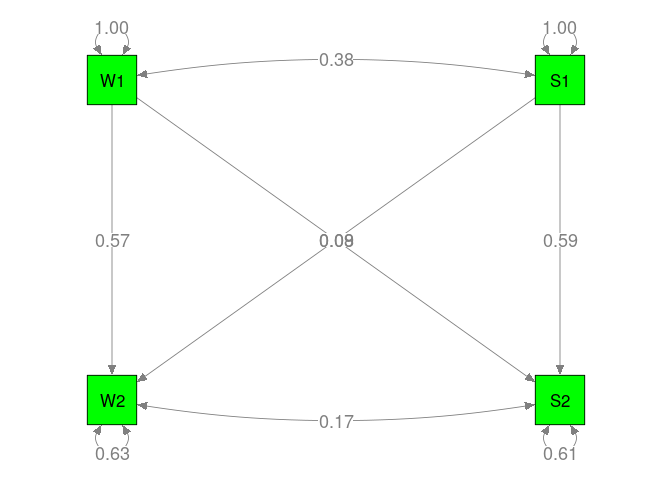

# Data preparation

```r
library(metaSEM)

## Get the data
data <- Nohe15A1$data
n <- Nohe15A1$n
Lag <- Nohe15A1$Lag

## Calculate the sampling covariance matrix of the correlations
my.df <- Cor2DataFrame(data, n, acov = "weighted")

## Add standardized Lag as a moderator.
## Standardization of the moderator improves the convergence.
my.df$data <- data.frame(my.df$data, Lag=scale(Nohe15A1$Lag),
                         check.names=FALSE)
head(my.df$data)
```

```
##                                        S1_W1 W2_W1 S2_W1 W2_S1 S2_S1 S2_W2 C(S1_W1 S1_W1)
## Britt...Dawson..2005.                   0.29  0.58  0.22  0.24  0.57  0.27   0.0014224802
## Demerouti.et.al...2004.                 0.53  0.57  0.41  0.41  0.68  0.54   0.0020763973
## Ford..2010.                             0.35  0.75  0.32  0.26  0.74  0.30   0.0021207115
## Hammer.et.al...2005...female.subsample  0.32  0.57  0.22  0.30  0.43  0.30   0.0029726183
## Hammer.et.al...2005...male.subsample    0.19  0.54  0.17  0.21  0.60  0.30   0.0029726160
## Innstrand.et.al...2008.                 0.42  0.63  0.31  0.30  0.62  0.44   0.0003112267
##                                        C(W2_W1 S1_W1) C(S2_W1 S1_W1) C(W2_S1 S1_W1) C(S2_S1 S1_W1)
## Britt...Dawson..2005.                    2.033644e-04   0.0008791263   0.0008736627   2.047357e-04
## Demerouti.et.al...2004.                  2.968526e-04   0.0012832628   0.0012752878   2.988536e-04
## Ford..2010.                              3.031871e-04   0.0013106502   0.0013025055   3.052328e-04
## Hammer.et.al...2005...female.subsample   4.249795e-04   0.0018371464   0.0018257299   4.278435e-04
## Hammer.et.al...2005...male.subsample     4.249768e-04   0.0018371440   0.0018257268   4.278429e-04
## Innstrand.et.al...2008.                  4.449397e-05   0.0001923449   0.0001911497   4.479414e-05
##                                        C(S2_W2 S1_W1) C(W2_W1 W2_W1) C(S2_W1 W2_W1) C(W2_S1 W2_W1)
## Britt...Dawson..2005.                    0.0004890911   0.0007981111   3.750403e-04   3.671029e-04
## Demerouti.et.al...2004.                  0.0007139277   0.0011650047   5.474480e-04   5.358619e-04
## Ford..2010.                              0.0007291649   0.0011898669   5.591305e-04   5.472972e-04
## Hammer.et.al...2005...female.subsample   0.0010220725   0.0016678478   7.837376e-04   7.671508e-04
## Hammer.et.al...2005...male.subsample     0.0010220702   0.0016678459   7.837346e-04   7.671476e-04
## Innstrand.et.al...2008.                  0.0001070085   0.0001746200   8.205513e-05   8.031856e-05
##                                        C(S2_S1 W2_W1) C(S2_W2 W2_W1) C(S2_W1 S2_W1) C(W2_S1 S2_W1)
## Britt...Dawson..2005.                    1.042816e-04   2.035390e-04   0.0016496838   0.0005769122
## Demerouti.et.al...2004.                  1.522206e-04   2.971071e-04   0.0024080465   0.0008421206
## Ford..2010.                              1.554694e-04   3.034471e-04   0.0024594384   0.0008600936
## Hammer.et.al...2005...female.subsample   2.179216e-04   4.253434e-04   0.0034474129   0.0012055962
## Hammer.et.al...2005...male.subsample     2.179204e-04   4.253409e-04   0.0034474104   0.0012055929
## Innstrand.et.al...2008.                  2.281565e-05   4.453213e-05   0.0003609365   0.0001262227
##                                        C(S2_S1 S2_W1) C(S2_W2 S2_W1) C(W2_S1 W2_S1) C(S2_S1 W2_S1)
## Britt...Dawson..2005.                    3.592788e-04   0.0008607808    0.001660142   0.0003727425
## Demerouti.et.al...2004.                  5.244403e-04   0.0012564835    0.002423313   0.0005440931
## Ford..2010.                              5.356338e-04   0.0012832993    0.002475032   0.0005557066
## Hammer.et.al...2005...female.subsample   7.507983e-04   0.0017988079    0.003469270   0.0007789346
## Hammer.et.al...2005...male.subsample     7.507977e-04   0.0017988056    0.003469266   0.0007789336
## Innstrand.et.al...2008.                  7.860675e-05   0.0001883310    0.000363225   0.0000815526
##                                        C(S2_W2 W2_S1) C(S2_S1 S2_S1) C(S2_W2 S2_S1) C(S2_W2 S2_W2)
## Britt...Dawson..2005.                    0.0008739042   0.0007805644   1.951877e-04   0.0013981165
## Demerouti.et.al...2004.                  0.0012756398   0.0011393911   2.849159e-04   0.0020408328
## Ford..2010.                              0.0013028651   0.0011637082   2.909980e-04   0.0020843880
## Hammer.et.al...2005...female.subsample   0.0018262333   0.0016311786   4.078900e-04   0.0029217026
## Hammer.et.al...2005...male.subsample     0.0018262301   0.0016311786   4.078894e-04   0.0029217004
## Innstrand.et.al...2008.                  0.0001912024   0.0001707810   4.270502e-05   0.0003058959
##                                               Lag
## Britt...Dawson..2005.                  -0.6794521
## Demerouti.et.al...2004.                -0.7711151
## Ford..2010.                            -0.8016694
## Hammer.et.al...2005...female.subsample -0.1294740
## Hammer.et.al...2005...male.subsample   -0.1294740
## Innstrand.et.al...2008.                 0.6038301
```

```r
## Check the number of studies per correlation coefficient
pattern.na(Nohe15A1$data, show.na = FALSE)
```

```
##    W1 S1 W2 S2
## W1 32 32 32 32
## S1 32 32 32 32
## W2 32 32 32 32
## S2 32 32 32 32
```

# One-Stage MASEM

```r
## Model without moderation

model1 <-  'W2 ~ w2w*W1 + s2w*S1
            S2 ~ w2s*W1 + s2s*S1
            W1 ~~ w1WITHs1*S1
            W2 ~~ w2WITHs2*S2
            W1 ~~ 1*W1
            S1 ~~ 1*S1
            W2 ~~ Errw2*W2
            S2 ~~ Errs2*S2'

plot(model1, col="yellow")     
```

<!-- -->

```r
## Convert the lavaan syntax into the RAM specification
RAM1 <- lavaan2RAM(model1, obs.variables=c("W1", "S1", "W2", "S2"))
RAM1
```

```
## $A
##    W1      S1      W2  S2 
## W1 "0"     "0"     "0" "0"
## S1 "0"     "0"     "0" "0"
## W2 "0*w2w" "0*s2w" "0" "0"
## S2 "0*w2s" "0*s2s" "0" "0"
## 
## $S
##    W1           S1           W2           S2          
## W1 "1"          "0*w1WITHs1" "0"          "0"         
## S1 "0*w1WITHs1" "1"          "0"          "0"         
## W2 "0"          "0"          "0*Errw2"    "0*w2WITHs2"
## S2 "0"          "0"          "0*w2WITHs2" "0*Errs2"   
## 
## $F
##    W1 S1 W2 S2
## W1  1  0  0  0
## S1  0  1  0  0
## W2  0  0  1  0
## S2  0  0  0  1
## 
## $M
##   W1 S1 W2 S2
## 1  0  0  0  0
```

## Model without moderator

```r
## Create the model implied correlation structure with implicit diagonal constraints
M0 <- create.vechsR(A0=RAM1$A, S0=RAM1$S)

## Create the heterogeneity variance-covariance matrix
## RE.type= either "Diag" or "Symm"
## Transform= either "expLog" or "sqSD" for better estimation of variances
T0 <- create.Tau2(RAM=RAM1, RE.type="Diag", Transform="expLog", RE.startvalues=0.05)

## Fit the model using One-Stage MASEM
mx.fit0 <- osmasem(model.name="No moderator", Mmatrix=M0, Tmatrix=T0, data=my.df)
```

```
## Running No moderator with 12 parameters
```

```r
summary(mx.fit0)
```

```
## Summary of No moderator 
##  
## free parameters:
##        name  matrix row col    Estimate  Std.Error A    z value     Pr(>|z|)
## 1       w2w      A0  W2  W1  0.57247128 0.02226456    25.712220 0.000000e+00
## 2       w2s      A0  S2  W1  0.08023683 0.02484213     3.229869 1.238472e-03
## 3       s2w      A0  W2  S1  0.08584125 0.02479589     3.461914 5.363481e-04
## 4       s2s      A0  S2  S1  0.58612399 0.02079000    28.192593 0.000000e+00
## 5  w1WITHs1      S0  S1  W1  0.38045214 0.02256156    16.862851 0.000000e+00
## 6  w2WITHs2      S0  S2  W2  0.16888458 0.02523191     6.693293 2.182032e-11
## 7    Tau1_1 vecTau1   1   1 -2.15335889 0.14358419   -14.997187 0.000000e+00
## 8    Tau1_2 vecTau1   2   1 -2.36882262 0.14419312   -16.428125 0.000000e+00
## 9    Tau1_3 vecTau1   3   1 -2.47296535 0.15796628   -15.655020 0.000000e+00
## 10   Tau1_4 vecTau1   4   1 -2.47676199 0.15669548   -15.806212 0.000000e+00
## 11   Tau1_5 vecTau1   5   1 -2.46245698 0.14519711   -16.959407 0.000000e+00
## 12   Tau1_6 vecTau1   6   1 -2.19983815 0.14187314   -15.505670 0.000000e+00
## 
## Model Statistics: 
##                |  Parameters  |  Degrees of Freedom  |  Fit (-2lnL units)
##        Model:             12                    180             -300.1701
##    Saturated:             27                    165                    NA
## Independence:             12                    180                    NA
## Number of observations/statistics: 12906/192
## 
## Information Criteria: 
##       |  df Penalty  |  Parameters Penalty  |  Sample-Size Adjusted
## AIC:      -660.1701              -276.1701                -276.1459
## BIC:     -2003.9507              -186.5847                -224.7195
## To get additional fit indices, see help(mxRefModels)
## timestamp: 2018-11-21 20:48:19 
## Wall clock time: 0.3428583 secs 
## optimizer:  SLSQP 
## OpenMx version number: 2.11.5 
## Need help?  See help(mxSummary)
```

```r
## The variance-covariance matrix in mx.fit0 is based on the untransformed matrix
## Extract the heterogeneity variance-covariance matrix using VarCorr()
VarCorr(mx.fit0)
```

```
##            Tau2_1      Tau2_2      Tau2_3      Tau2_4      Tau2_5     Tau2_6
## Tau2_1 0.01347771 0.000000000 0.000000000 0.000000000 0.000000000 0.00000000
## Tau2_2 0.00000000 0.008759248 0.000000000 0.000000000 0.000000000 0.00000000
## Tau2_3 0.00000000 0.000000000 0.007112292 0.000000000 0.000000000 0.00000000
## Tau2_4 0.00000000 0.000000000 0.000000000 0.007058491 0.000000000 0.00000000
## Tau2_5 0.00000000 0.000000000 0.000000000 0.000000000 0.007263351 0.00000000
## Tau2_6 0.00000000 0.000000000 0.000000000 0.000000000 0.000000000 0.01228131
```

## Model with `Lag` as a moderator on the A matrix

```r
Ax <- matrix(c(0,0,0,0,
               0,0,0,0,
               "0*data.Lag","0*data.Lag",0,0,
               "0*data.Lag","0*data.Lag",0,0),
             nrow=4, ncol=4, byrow=TRUE)
Ax              
```

```
##      [,1]         [,2]         [,3] [,4]
## [1,] "0"          "0"          "0"  "0" 
## [2,] "0"          "0"          "0"  "0" 
## [3,] "0*data.Lag" "0*data.Lag" "0"  "0" 
## [4,] "0*data.Lag" "0*data.Lag" "0"  "0"
```

```r
## When there are more than one moderators
## Ax <- list(A1, A2, A3)

## Create the model implied correlation structure with standardized Lag as the moderator
M1 <- create.vechsR(A0=RAM1$A, S0=RAM1$S, Ax=Ax)

## Fit the model with moderator
mx.fit1 <- osmasem(model.name="Ax as moderator", Mmatrix=M1, Tmatrix=T0, data=my.df)
summary(mx.fit1)
```

```
## Summary of Ax as moderator 
##  
## free parameters:
##        name  matrix row col     Estimate  Std.Error A     z value     Pr(>|z|)
## 1       w2w      A0  W2  W1  0.573039758 0.01839765    31.1474410 0.000000e+00
## 2       w2s      A0  S2  W1  0.079844954 0.02419488     3.3000758 9.665871e-04
## 3       s2w      A0  W2  S1  0.085391023 0.02393612     3.5674548 3.604655e-04
## 4       s2s      A0  S2  S1  0.586234248 0.01962561    29.8708878 0.000000e+00
## 5  w1WITHs1      S0  S1  W1  0.381183693 0.02282277    16.7019042 0.000000e+00
## 6  w2WITHs2      S0  S2  W2  0.166974816 0.02500439     6.6778211 2.425216e-11
## 7     w2w_1      A1  W2  W1 -0.062015585 0.01850573    -3.3511555 8.047508e-04
## 8     w2s_1      A1  S2  W1 -0.025933718 0.02096724    -1.2368688 2.161358e-01
## 9     s2w_1      A1  W2  S1 -0.002382813 0.02055897    -0.1159014 9.077307e-01
## 10    s2s_1      A1  S2  S1 -0.027809757 0.01974172    -1.4086798 1.589299e-01
## 11   Tau1_1 vecTau1   1   1 -2.138190672 0.14360102   -14.8898010 0.000000e+00
## 12   Tau1_2 vecTau1   2   1 -2.630518274 0.16155260   -16.2827353 0.000000e+00
## 13   Tau1_3 vecTau1   3   1 -2.524193936 0.16007541   -15.7687803 0.000000e+00
## 14   Tau1_4 vecTau1   4   1 -2.519908671 0.15983964   -15.7652300 0.000000e+00
## 15   Tau1_5 vecTau1   5   1 -2.537475706 0.14712277   -17.2473350 0.000000e+00
## 16   Tau1_6 vecTau1   6   1 -2.198863426 0.14144099   -15.5461544 0.000000e+00
## 
## Model Statistics: 
##                |  Parameters  |  Degrees of Freedom  |  Fit (-2lnL units)
##        Model:             16                    176             -323.6921
##    Saturated:             27                    165                    NA
## Independence:             12                    180                    NA
## Number of observations/statistics: 12906/192
## 
## Information Criteria: 
##       |  df Penalty  |  Parameters Penalty  |  Sample-Size Adjusted
## AIC:      -675.6921              -291.6921                -291.6499
## BIC:     -1989.6109              -172.2449                -223.0913
## To get additional fit indices, see help(mxRefModels)
## timestamp: 2018-11-21 20:48:20 
## Wall clock time: 0.6362844 secs 
## optimizer:  SLSQP 
## OpenMx version number: 2.11.5 
## Need help?  See help(mxSummary)
```

```r
## Extract the residual heterogeneity variance-covariance matrix
VarCorr(mx.fit1)
```

```
##            Tau2_1      Tau2_2      Tau2_3      Tau2_4     Tau2_5     Tau2_6
## Tau2_1 0.01389284 0.000000000 0.000000000 0.000000000 0.00000000 0.00000000
## Tau2_2 0.00000000 0.005189922 0.000000000 0.000000000 0.00000000 0.00000000
## Tau2_3 0.00000000 0.000000000 0.006419674 0.000000000 0.00000000 0.00000000
## Tau2_4 0.00000000 0.000000000 0.000000000 0.006474931 0.00000000 0.00000000
## Tau2_5 0.00000000 0.000000000 0.000000000 0.000000000 0.00625139 0.00000000
## Tau2_6 0.00000000 0.000000000 0.000000000 0.000000000 0.00000000 0.01230528
```

```r
## Calculate the R2
## Tau2.0: Heterogeneity variances without the predictors
## Tau2.1: Heterogeneity variances with the predictors
## R2: (Tau2.0-Tau2.1)/Tau2.0
osmasemR2(mx.fit1, mx.fit0)
```

```
## $Tau2.0
##    Tau2_1_1    Tau2_2_2    Tau2_3_3    Tau2_4_4    Tau2_5_5    Tau2_6_6 
## 0.013477714 0.008759248 0.007112292 0.007058491 0.007263351 0.012281315 
## 
## $Tau2.1
##    Tau2_1_1    Tau2_2_2    Tau2_3_3    Tau2_4_4    Tau2_5_5    Tau2_6_6 
## 0.013892845 0.005189922 0.006419674 0.006474931 0.006251390 0.012305280 
## 
## $R2
##   Tau2_1_1   Tau2_2_2   Tau2_3_3   Tau2_4_4   Tau2_5_5   Tau2_6_6 
## 0.00000000 0.40749224 0.09738319 0.08267492 0.13932426 0.00000000
```

```r
## Compare the models with and without the moderator
anova(mx.fit1, mx.fit0)
```

```
##              base   comparison ep  minus2LL  df       AIC   diffLL diffdf            p
## 1 Ax as moderator         <NA> 16 -323.6921 176 -675.6921       NA     NA           NA
## 2 Ax as moderator No moderator 12 -300.1701 180 -660.1701 23.52199      4 9.957462e-05
```

```r
## Get the estimated A0 and A1
A0 <- mxEval(A0, mx.fit1$mx.fit)
A0
```

```
##            W1         S1 W2 S2
## W1 0.00000000 0.00000000  0  0
## S1 0.00000000 0.00000000  0  0
## W2 0.57303976 0.08539102  0  0
## S2 0.07984495 0.58623425  0  0
```

```r
A1 <- mxEval(A1, mx.fit1$mx.fit)
A1
```

```
##             W1           S1 W2 S2
## W1  0.00000000  0.000000000  0  0
## S1  0.00000000  0.000000000  0  0
## W2 -0.06201558 -0.002382813  0  0
## S2 -0.02593372 -0.027809757  0  0
```

```r
# For simple slopes:
## Compute the estimated A matrix at -1SD (-1) of the standardized Lag
A0 - A1
```

```
##           W1         S1 W2 S2
## W1 0.0000000 0.00000000  0  0
## S1 0.0000000 0.00000000  0  0
## W2 0.6350553 0.08777384  0  0
## S2 0.1057787 0.61404401  0  0
```

```r
## Compute the estimated A matrix at 0 (mean) of the standardized Lag
A0
```

```
##            W1         S1 W2 S2
## W1 0.00000000 0.00000000  0  0
## S1 0.00000000 0.00000000  0  0
## W2 0.57303976 0.08539102  0  0
## S2 0.07984495 0.58623425  0  0
```

```r
## Compute the estimated A matrix at +1SD (+1) of the standardized Lag
A0 + A1
```

```
##            W1         S1 W2 S2
## W1 0.00000000 0.00000000  0  0
## S1 0.00000000 0.00000000  0  0
## W2 0.51102417 0.08300821  0  0
## S2 0.05391124 0.55842449  0  0
```

# TSSEM
## Model without moderator

```r
## Stage 1 analysis
random1 <- tssem1(Nohe15A1$data, Nohe15A1$n, method="REM", RE.type="Diag")
summary(random1)
```

```
## 
## Call:
## meta(y = ES, v = acovR, RE.constraints = Diag(paste0(RE.startvalues, 
##     "*Tau2_", 1:no.es, "_", 1:no.es)), RE.lbound = RE.lbound, 
##     I2 = I2, model.name = model.name, suppressWarnings = TRUE, 
##     silent = silent, run = run)
## 
## 95% confidence intervals: z statistic approximation
## Coefficients:
##             Estimate Std.Error    lbound    ubound z value  Pr(>|z|)    
## Intercept1 0.3804522 0.0225616 0.3362323 0.4246720 16.8629 < 2.2e-16 ***
## Intercept2 0.6051298 0.0180362 0.5697794 0.6404802 33.5508 < 2.2e-16 ***
## Intercept3 0.3032290 0.0178803 0.2681842 0.3382738 16.9588 < 2.2e-16 ***
## Intercept4 0.3036392 0.0178408 0.2686718 0.3386065 17.0194 < 2.2e-16 ***
## Intercept5 0.6166503 0.0166427 0.5840312 0.6492694 37.0523 < 2.2e-16 ***
## Intercept6 0.3954085 0.0216645 0.3529469 0.4378701 18.2515 < 2.2e-16 ***
## Tau2_1_1   0.0134777 0.0038704 0.0058919 0.0210635  3.4823 0.0004972 ***
## Tau2_2_2   0.0087592 0.0025260 0.0038083 0.0137102  3.4676 0.0005252 ***
## Tau2_3_3   0.0071123 0.0022470 0.0027082 0.0115163  3.1652 0.0015496 ** 
## Tau2_4_4   0.0070585 0.0022121 0.0027229 0.0113941  3.1909 0.0014183 ** 
## Tau2_5_5   0.0072634 0.0021092 0.0031293 0.0113974  3.4436 0.0005740 ***
## Tau2_6_6   0.0122813 0.0034848 0.0054513 0.0191114  3.5243 0.0004246 ***
## ---
## Signif. codes:  0 '***' 0.001 '**' 0.01 '*' 0.05 '.' 0.1 ' ' 1
## 
## Q statistic on the homogeneity of effect sizes: 1466.16
## Degrees of freedom of the Q statistic: 186
## P value of the Q statistic: 0
## 
## Heterogeneity indices (based on the estimated Tau2):
##                              Estimate
## Intercept1: I2 (Q statistic)   0.8829
## Intercept2: I2 (Q statistic)   0.8973
## Intercept3: I2 (Q statistic)   0.7743
## Intercept4: I2 (Q statistic)   0.7718
## Intercept5: I2 (Q statistic)   0.8810
## Intercept6: I2 (Q statistic)   0.8748
## 
## Number of studies (or clusters): 32
## Number of observed statistics: 192
## Number of estimated parameters: 12
## Degrees of freedom: 180
## -2 log likelihood: -300.1701 
## OpenMx status1: 0 ("0" or "1": The optimization is considered fine.
## Other values may indicate problems.)
```

```r
## Stage 2 analysis
random2 <- tssem2(random1, Amatrix=RAM1$A, Smatrix=RAM1$S)
summary(random2)
```

```
## 
## Call:
## wls(Cov = pooledS, aCov = aCov, n = tssem1.obj$total.n, Amatrix = Amatrix, 
##     Smatrix = Smatrix, Fmatrix = Fmatrix, diag.constraints = diag.constraints, 
##     cor.analysis = cor.analysis, intervals.type = intervals.type, 
##     mx.algebras = mx.algebras, model.name = model.name, suppressWarnings = suppressWarnings, 
##     silent = silent, run = run)
## 
## 95% confidence intervals: z statistic approximation
## Coefficients:
##          Estimate Std.Error   lbound   ubound z value  Pr(>|z|)    
## s2s      0.586124  0.020790 0.545376 0.626872 28.1926 < 2.2e-16 ***
## w2s      0.080237  0.024842 0.031547 0.128926  3.2299 0.0012385 ** 
## s2w      0.085841  0.024796 0.037242 0.134440  3.4619 0.0005364 ***
## w2w      0.572471  0.022265 0.528834 0.616109 25.7122 < 2.2e-16 ***
## w1WITHs1 0.380452  0.022562 0.336232 0.424672 16.8629 < 2.2e-16 ***
## w2WITHs2 0.168885  0.025232 0.119431 0.218338  6.6933 2.182e-11 ***
## ---
## Signif. codes:  0 '***' 0.001 '**' 0.01 '*' 0.05 '.' 0.1 ' ' 1
## 
## Goodness-of-fit indices:
##                                            Value
## Sample size                                12906
## Chi-square of target model                     0
## DF of target model                             0
## p value of target model                        0
## Number of constraints imposed on "Smatrix"     0
## DF manually adjusted                           0
## Chi-square of independence model            3079
## DF of independence model                       6
## RMSEA                                          0
## RMSEA lower 95% CI                             0
## RMSEA upper 95% CI                             0
## SRMR                                           0
## TLI                                         -Inf
## CFI                                            1
## AIC                                            0
## BIC                                            0
## OpenMx status1: 0 ("0" or "1": The optimization is considered fine.
## Other values indicate problems.)
```

```r
## Plot the model
plot(random2, col="green")
```

<!-- -->

## Subgroup analysis (three subgroups)

```r
## Get the necessary functions
source("http://www.suzannejak.nl/subgroup.functions.R")

data <- Nohe15A1$data
n <- Nohe15A1$n
Lag <- Nohe15A1$Lag

# Data for studies with short Lag 
data_g1 <- data[Lag<7]
n_g1 <- n[Lag<7]

# Data for studies with medium Lag 
data_g2 <- data[Lag>=7&Lag<13]
n_g2 <- n[Lag>=7&Lag<13]

# Data for studies with long Lag 
data_g3 <- data[Lag>=13]
n_g3 <- n[Lag>=13]

# Stage 1 analysis per subgroup (random-effects analysis)
stage1_g1.fit <- tssem1(Cov = data_g1, n = n_g1, method = "REM", RE.type = "Diag")
stage1_g2.fit <- tssem1(Cov = data_g2, n = n_g2, method = "REM", RE.type = "Diag")
stage1_g3.fit <- tssem1(Cov = data_g3, n = n_g3, method = "REM", RE.type = "Diag")

# Rerun it to remove the error code for group 3
stage1_g3.fit <- rerun(stage1_g3.fit)
```

```
## 
## Beginning initial fit attempt
```

```
## 
##  Lowest minimum so far:  -91.8365894087371
```

```
## 
##  OpenMx status code 6 not in list of acceptable status codes, (0,1)
```

```
## 
## Beginning fit attempt 1 of at maximum 10 extra tries
```

```
## 
##  Lowest minimum so far:  -91.8365894097277
```

```
## 
## Solution found
```



```
## 
## Solution found!  Final fit=-91.836589 (started at -91.836589)  (2 attempt(s): 2 valid, 0 errors)
```

```r
# Stage 2 analysis per subgroup (random-effect analysis)
stage2_g1.fit <- tssem2(stage1_g1.fit, Amatrix=RAM1$A, Smatrix=RAM1$S)
stage2_g2.fit <- tssem2(stage1_g2.fit, Amatrix=RAM1$A, Smatrix=RAM1$S)
stage2_g3.fit <- tssem2(stage1_g3.fit, Amatrix=RAM1$A, Smatrix=RAM1$S)

# Results
summary(stage2_g1.fit)
```

```
## 
## Call:
## wls(Cov = pooledS, aCov = aCov, n = tssem1.obj$total.n, Amatrix = Amatrix, 
##     Smatrix = Smatrix, Fmatrix = Fmatrix, diag.constraints = diag.constraints, 
##     cor.analysis = cor.analysis, intervals.type = intervals.type, 
##     mx.algebras = mx.algebras, model.name = model.name, suppressWarnings = suppressWarnings, 
##     silent = silent, run = run)
## 
## 95% confidence intervals: z statistic approximation
## Coefficients:
##             Estimate   Std.Error      lbound      ubound z value  Pr(>|z|)    
## s2s       0.66553740  0.03569843  0.59556977  0.73550502 18.6433 < 2.2e-16 ***
## w2s       0.06199847  0.04876836 -0.03358576  0.15758271  1.2713  0.203627    
## s2w       0.09348605  0.04754751  0.00029466  0.18667745  1.9662  0.049280 *  
## w2w       0.60886913  0.03478418  0.54069338  0.67704487 17.5042 < 2.2e-16 ***
## w1WITHs1  0.42860577  0.03711508  0.35586155  0.50134999 11.5480 < 2.2e-16 ***
## w2WITHs2  0.14870269  0.05135549  0.04804778  0.24935759  2.8956  0.003785 ** 
## ---
## Signif. codes:  0 '***' 0.001 '**' 0.01 '*' 0.05 '.' 0.1 ' ' 1
## 
## Goodness-of-fit indices:
##                                             Value
## Sample size                                2845.0
## Chi-square of target model                    0.0
## DF of target model                            0.0
## p value of target model                       0.0
## Number of constraints imposed on "Smatrix"    0.0
## DF manually adjusted                          0.0
## Chi-square of independence model           1561.7
## DF of independence model                      6.0
## RMSEA                                         0.0
## RMSEA lower 95% CI                            0.0
## RMSEA upper 95% CI                            0.0
## SRMR                                          0.0
## TLI                                          -Inf
## CFI                                           1.0
## AIC                                           0.0
## BIC                                           0.0
## OpenMx status1: 0 ("0" or "1": The optimization is considered fine.
## Other values indicate problems.)
```

```r
summary(stage2_g2.fit)
```

```
## 
## Call:
## wls(Cov = pooledS, aCov = aCov, n = tssem1.obj$total.n, Amatrix = Amatrix, 
##     Smatrix = Smatrix, Fmatrix = Fmatrix, diag.constraints = diag.constraints, 
##     cor.analysis = cor.analysis, intervals.type = intervals.type, 
##     mx.algebras = mx.algebras, model.name = model.name, suppressWarnings = suppressWarnings, 
##     silent = silent, run = run)
## 
## 95% confidence intervals: z statistic approximation
## Coefficients:
##          Estimate Std.Error   lbound   ubound z value  Pr(>|z|)    
## s2s      0.556431  0.029435 0.498739 0.614123 18.9036 < 2.2e-16 ***
## w2s      0.092085  0.035876 0.021770 0.162400  2.5668   0.01026 *  
## s2w      0.086149  0.036990 0.013651 0.158648  2.3290   0.01986 *  
## w2w      0.580718  0.025338 0.531056 0.630379 22.9189 < 2.2e-16 ***
## w1WITHs1 0.348297  0.037169 0.275447 0.421147  9.3706 < 2.2e-16 ***
## w2WITHs2 0.151898  0.035147 0.083011 0.220785  4.3218 1.548e-05 ***
## ---
## Signif. codes:  0 '***' 0.001 '**' 0.01 '*' 0.05 '.' 0.1 ' ' 1
## 
## Goodness-of-fit indices:
##                                             Value
## Sample size                                5991.0
## Chi-square of target model                    0.0
## DF of target model                            0.0
## p value of target model                       0.0
## Number of constraints imposed on "Smatrix"    0.0
## DF manually adjusted                          0.0
## Chi-square of independence model           1662.6
## DF of independence model                      6.0
## RMSEA                                         0.0
## RMSEA lower 95% CI                            0.0
## RMSEA upper 95% CI                            0.0
## SRMR                                          0.0
## TLI                                          -Inf
## CFI                                           1.0
## AIC                                           0.0
## BIC                                           0.0
## OpenMx status1: 0 ("0" or "1": The optimization is considered fine.
## Other values indicate problems.)
```

```r
summary(stage2_g3.fit)
```

```
## 
## Call:
## wls(Cov = pooledS, aCov = aCov, n = tssem1.obj$total.n, Amatrix = Amatrix, 
##     Smatrix = Smatrix, Fmatrix = Fmatrix, diag.constraints = diag.constraints, 
##     cor.analysis = cor.analysis, intervals.type = intervals.type, 
##     mx.algebras = mx.algebras, model.name = model.name, suppressWarnings = suppressWarnings, 
##     silent = silent, run = run)
## 
## 95% confidence intervals: z statistic approximation
## Coefficients:
##           Estimate Std.Error    lbound    ubound z value  Pr(>|z|)    
## s2s       0.549852  0.030202  0.490657  0.609047 18.2058 < 2.2e-16 ***
## w2s       0.078499  0.028028  0.023566  0.133433  2.8008  0.005098 ** 
## s2w       0.078761  0.061391 -0.041564  0.199086  1.2829  0.199515    
## w2w       0.505340  0.055374  0.396809  0.613872  9.1259 < 2.2e-16 ***
## w1WITHs1  0.396591  0.040657  0.316906  0.476276  9.7547 < 2.2e-16 ***
## w2WITHs2  0.230256  0.039856  0.152139  0.308373  5.7772 7.597e-09 ***
## ---
## Signif. codes:  0 '***' 0.001 '**' 0.01 '*' 0.05 '.' 0.1 ' ' 1
## 
## Goodness-of-fit indices:
##                                             Value
## Sample size                                4070.0
## Chi-square of target model                    0.0
## DF of target model                            0.0
## p value of target model                       0.0
## Number of constraints imposed on "Smatrix"    0.0
## DF manually adjusted                          0.0
## Chi-square of independence model           1319.6
## DF of independence model                      6.0
## RMSEA                                         0.0
## RMSEA lower 95% CI                            0.0
## RMSEA upper 95% CI                            0.0
## SRMR                                          0.0
## TLI                                          -Inf
## CFI                                           1.0
## AIC                                           0.0
## BIC                                           0.0
## OpenMx status1: 0 ("0" or "1": The optimization is considered fine.
## Other values indicate problems.)
```


```r
# Testing the equality of regression coefficients across subgroups
# Create different labels for the variances and covariances

## Proposed model g2
model2 <- ' W2 ~ w2w*W1 + s2w*S1
            S2 ~ w2s*W1 + s2s*S1
            W1 ~~ g2w1WITHs1*S1
            W2 ~~ g2w2WITHs2*S2
            W1 ~~ 1*W1
            S1 ~~ 1*S1
            W2 ~~ g2Errw2*W2
            S2 ~~ g2Errs2*S2'

RAM2 <- lavaan2RAM(model2, obs.variables=c("W1", "S1", "W2", "S2"))

## Proposed model g3
model3 <- ' W2 ~ w2w*W1 + s2w*S1
            S2 ~ w2s*W1 + s2s*S1
            W1 ~~ g3w1WITHs1*S1
            W2 ~~ g3w2WITHs2*S2
            W1 ~~ 1*W1
            S1 ~~ 1*S1
            W2 ~~ g3Errw2*W2
            S2 ~~ g3Errs2*S2'

RAM3 <- lavaan2RAM(model3, obs.variables=c("W1", "S1", "W2", "S2"))

## Create the models for the three groups, make sure to set the argument run=FALSE
stage2_g1 <- tssem2(stage1_g1.fit, Amatrix=RAM1$A, Smatrix=RAM1$S, run=FALSE, model.name="g1")

stage2_g2 <- tssem2(stage1_g2.fit, Amatrix=RAM1$A, Smatrix=RAM2$S, run=FALSE, model.name="g2")

stage2_g3 <- tssem2(stage1_g3.fit, Amatrix=RAM1$A, Smatrix=RAM3$S, run=FALSE, model.name="g3")

## Create the multigroup model
stage2_constrained <- mxModel(model="same_regression_coef", stage2_g1, stage2_g2,stage2_g3,
                              mxFitFunctionMultigroup(c("g1", "g2", "g3")))

## Fit multigroup model with equality constraints
Stage2_constrained.fit <- mxRun(stage2_constrained, intervals=TRUE)
```

```
## Running same_regression_coef with 10 parameters
```

```r
## Make a list of the fitted models in the separate groups
submodels.fit <- list(stage2_g1.fit, stage2_g2.fit, stage2_g3.fit)

subgroup.summary(submodels.fit,Stage2_constrained.fit)
```

```
## # # # # # # # # # # # # # # # # # # #
##  Output for subgroup MASEM analysis 
## # # # # # # # # # # # # # # # # # # #
## 
##  Total sample size: 12906
## 
##  Parameter estimates of the constrained model
## 
## [1] "Set 'print.est=TRUE' to print the parameter estimates of the constrained model"
## 
##  - - - - - - - - - - - - - - - - - - - - - - - - - - - - - - - - - - -
##  Fit indices of the free model:
## 
##           Statistic Free_m1
##                  df   0.000
##          Chi-square   0.000
##                   p   0.000
##               RMSEA     Inf
##  RMSEA lower 95% CI     Inf
##  RMSEA upper 95% CI     Inf
##                 CFI   1.000
##                 TLI    -Inf
##                 AIC  60.000
##                 BIC 283.963
##                SRMR   0.000
## - - - - - - - - - - - - - - - - - - - - - - - - - - - - - - - - - - -
##  Fit indices of the model with equality constraints:
## 
##           Statistic Constrained_m2
##                  df          8.000
##          Chi-square         14.739
##                   p          0.064
##               RMSEA          0.014
##  RMSEA lower 95% CI          0.000
##  RMSEA upper 95% CI          0.027
##                 CFI          0.999
##                 TLI          0.997
##                 AIC         58.739
##                 BIC        222.978
##                SRMR          0.033
## - - - - - - - - - - - - - - - - - - - - - - - - - - - - - - - - - - -
##  Chi-square difference between free and constrained model:
## 
##   Statistic Diff_m1_m2
##          df      8.000
##  Chi-square     14.739
##           p      0.064
## 
##  # # # # # # # # # # # # # # # # # # # # # # # # # # # # # # # # # # #
```

### Testing the equality of one regression coefficient (w2w)


```r
## Proposed model g2
model2 <-  'W2 ~ w2w*W1 + g2s2w*S1
            S2 ~ g2w2s*W1 + g2s2s*S1
            W1 ~~ g2w1WITHs1*S1
            W2 ~~ g2w2WITHs2*S2
            W1 ~~ 1*W1
            S1 ~~ 1*S1
            W2 ~~ g2Errw2*W2
            S2 ~~ g2Errs2*S2'

RAM2 <- lavaan2RAM(model2, obs.variables=c("W1", "S1", "W2", "S2"))

## Proposed model g3
model3 <-  'W2 ~ w2w*W1 + g3s2w*S1
            S2 ~ g3w2s*W1 + g3s2s*S1
            W1 ~~ g3w1WITHs1*S1
            W2 ~~ g3w2WITHs2*S2
            W1 ~~ 1*W1
            S1 ~~ 1*S1
            W2 ~~ g3Errw2*W2
            S2 ~~ g3Errs2*S2'

RAM3 <- lavaan2RAM(model3, obs.variables=c("W1", "S1", "W2", "S2"))

## Create the models for the three groups, make sure to set the argument run=FALSE
stage2_g1 <- tssem2(stage1_g1.fit, Amatrix=RAM1$A, Smatrix=RAM1$S, run=FALSE, model.name="g1")

stage2_g2 <- tssem2(stage1_g2.fit, Amatrix=RAM2$A, Smatrix=RAM2$S, run=FALSE, model.name="g2")

stage2_g3 <- tssem2(stage1_g3.fit, Amatrix=RAM3$A, Smatrix=RAM3$S, run=FALSE, model.name="g3")

## Create the multigroup model
stage2_constrained <- mxModel(model="same_regression_coef", stage2_g1, stage2_g2,stage2_g3,
                              mxFitFunctionMultigroup(c("g1", "g2", "g3")))

## Fit multigroup model with equality constraints
Stage2_constrained.fit <- mxRun(stage2_constrained, intervals=TRUE)
```

```
## Running same_regression_coef with 16 parameters
```

```r
## First make a list of the fitted models in the separate groups
submodels.fit <- list(stage2_g1.fit,stage2_g2.fit,stage2_g3.fit)

subgroup.summary(submodels.fit,Stage2_constrained.fit)
```

```
## # # # # # # # # # # # # # # # # # # #
##  Output for subgroup MASEM analysis 
## # # # # # # # # # # # # # # # # # # #
## 
##  Total sample size: 12906
## 
##  Parameter estimates of the constrained model
## 
## [1] "Set 'print.est=TRUE' to print the parameter estimates of the constrained model"
## 
##  - - - - - - - - - - - - - - - - - - - - - - - - - - - - - - - - - - -
##  Fit indices of the free model:
## 
##           Statistic Free_m1
##                  df   0.000
##          Chi-square   0.000
##                   p   0.000
##               RMSEA     Inf
##  RMSEA lower 95% CI     Inf
##  RMSEA upper 95% CI     Inf
##                 CFI   1.000
##                 TLI    -Inf
##                 AIC  60.000
##                 BIC 283.963
##                SRMR   0.000
## - - - - - - - - - - - - - - - - - - - - - - - - - - - - - - - - - - -
##  Fit indices of the model with equality constraints:
## 
##           Statistic Constrained_m2
##                  df          2.000
##          Chi-square          2.527
##                   p          0.283
##               RMSEA          0.008
##  RMSEA lower 95% CI          0.000
##  RMSEA upper 95% CI          0.036
##                 CFI          1.000
##                 TLI          0.999
##                 AIC         58.527
##                 BIC        267.560
##                SRMR          0.015
## - - - - - - - - - - - - - - - - - - - - - - - - - - - - - - - - - - -
##  Chi-square difference between free and constrained model:
## 
##   Statistic Diff_m1_m2
##          df      2.000
##  Chi-square      2.527
##           p      0.283
## 
##  # # # # # # # # # # # # # # # # # # # # # # # # # # # # # # # # # # #
```

## Subgroup analysis (two subgroups)

```r
# Data for studies with short Lag 
data_g1 <- data[Lag<median(Lag)]
n_g1 <- n[Lag<median(Lag)]

# Data for studies with long Lag 
data_g2 <- data[Lag>=median(Lag)]
n_g2 <- n[Lag>=median(Lag)]

## Stage 1 analysis per subgroup (random-effects analysis)
stage1_g1.fit <- tssem1(Cov = data_g1, n = n_g1, method = "REM", RE.type = "Diag")
stage1_g2.fit <- tssem1(Cov = data_g2, n = n_g2, method = "REM", RE.type = "Diag")

## Rerun the analysis to remove error from group 2
stage1_g2.fit <- rerun(stage1_g2.fit)
```

```
## 
## Beginning initial fit attempt
```

```
## 
## Solution found
```



```
## 
## Solution found!  Final fit=-240.09031 (started at -240.09031)  (1 attempt(s): 1 valid, 0 errors)
```


```r
## Stage 2 analysis per subgroup 
stage2_g1.fit <- tssem2(stage1_g1.fit, Amatrix=RAM1$A, Smatrix=RAM1$S)
stage2_g2.fit <- tssem2(stage1_g2.fit, Amatrix=RAM1$A, Smatrix=RAM1$S)

summary(stage2_g1.fit)
```

```
## 
## Call:
## wls(Cov = pooledS, aCov = aCov, n = tssem1.obj$total.n, Amatrix = Amatrix, 
##     Smatrix = Smatrix, Fmatrix = Fmatrix, diag.constraints = diag.constraints, 
##     cor.analysis = cor.analysis, intervals.type = intervals.type, 
##     mx.algebras = mx.algebras, model.name = model.name, suppressWarnings = suppressWarnings, 
##     silent = silent, run = run)
## 
## 95% confidence intervals: z statistic approximation
## Coefficients:
##             Estimate   Std.Error      lbound      ubound z value  Pr(>|z|)    
## s2s       0.63876944  0.03971217  0.56093501  0.71660387 16.0850 < 2.2e-16 ***
## w2s       0.07329758  0.04729104 -0.01939115  0.16598631  1.5499 0.1211594    
## s2w       0.09167719  0.04642781  0.00068034  0.18267403  1.9746 0.0483115 *  
## w2w       0.61623242  0.03020865  0.55702456  0.67544029 20.3992 < 2.2e-16 ***
## w1WITHs1  0.46330810  0.03480190  0.39509764  0.53151857 13.3127 < 2.2e-16 ***
## w2WITHs2  0.15691516  0.04756353  0.06369235  0.25013796  3.2991 0.0009701 ***
## ---
## Signif. codes:  0 '***' 0.001 '**' 0.01 '*' 0.05 '.' 0.1 ' ' 1
## 
## Goodness-of-fit indices:
##                                             Value
## Sample size                                4863.0
## Chi-square of target model                    0.0
## DF of target model                            0.0
## p value of target model                       0.0
## Number of constraints imposed on "Smatrix"    0.0
## DF manually adjusted                          0.0
## Chi-square of independence model           2025.5
## DF of independence model                      6.0
## RMSEA                                         0.0
## RMSEA lower 95% CI                            0.0
## RMSEA upper 95% CI                            0.0
## SRMR                                          0.0
## TLI                                          -Inf
## CFI                                           1.0
## AIC                                           0.0
## BIC                                           0.0
## OpenMx status1: 0 ("0" or "1": The optimization is considered fine.
## Other values indicate problems.)
```

```r
summary(stage2_g2.fit)
```

```
## 
## Call:
## wls(Cov = pooledS, aCov = aCov, n = tssem1.obj$total.n, Amatrix = Amatrix, 
##     Smatrix = Smatrix, Fmatrix = Fmatrix, diag.constraints = diag.constraints, 
##     cor.analysis = cor.analysis, intervals.type = intervals.type, 
##     mx.algebras = mx.algebras, model.name = model.name, suppressWarnings = suppressWarnings, 
##     silent = silent, run = run)
## 
## 95% confidence intervals: z statistic approximation
## Coefficients:
##          Estimate Std.Error   lbound   ubound z value  Pr(>|z|)    
## s2s      0.550458  0.018924 0.513368 0.587547 29.0884 < 2.2e-16 ***
## w2s      0.082166  0.019219 0.044498 0.119834  4.2753 1.909e-05 ***
## s2w      0.074617  0.018300 0.038749 0.110485  4.0774 4.554e-05 ***
## w2w      0.546394  0.026741 0.493983 0.598805 20.4330 < 2.2e-16 ***
## w1WITHs1 0.325734  0.022863 0.280923 0.370544 14.2472 < 2.2e-16 ***
## w2WITHs2 0.177559  0.021402 0.135612 0.219506  8.2964 < 2.2e-16 ***
## ---
## Signif. codes:  0 '***' 0.001 '**' 0.01 '*' 0.05 '.' 0.1 ' ' 1
## 
## Goodness-of-fit indices:
##                                             Value
## Sample size                                8043.0
## Chi-square of target model                    0.0
## DF of target model                            0.0
## p value of target model                       0.0
## Number of constraints imposed on "Smatrix"    0.0
## DF manually adjusted                          0.0
## Chi-square of independence model           2241.6
## DF of independence model                      6.0
## RMSEA                                         0.0
## RMSEA lower 95% CI                            0.0
## RMSEA upper 95% CI                            0.0
## SRMR                                          0.0
## TLI                                          -Inf
## CFI                                           1.0
## AIC                                           0.0
## BIC                                           0.0
## OpenMx status1: 0 ("0" or "1": The optimization is considered fine.
## Other values indicate problems.)
```

```r
#Testing the equality of regression coefficients


## Proposed model g2
model2 <-  'W2 ~ w2w*W1 + s2w*S1
            S2 ~ w2s*W1 + s2s*S1
            W1 ~~ g2w1WITHs1*S1
            W2 ~~ g2w2WITHs2*S2
            W1 ~~ 1*W1
            S1 ~~ 1*S1
            W2 ~~ g2Errw2*W2
            S2 ~~ g2Errs2*S2'

RAM2 <- lavaan2RAM(model2, obs.variables=c("W1", "S1", "W2", "S2"))

# Create the models for the two groups, make sure to set the argument run=FALSE
stage2_g1 <- tssem2(stage1_g1.fit, Amatrix=RAM1$A, Smatrix=RAM1$S, run=FALSE, model.name="g1")

stage2_g2 <- tssem2(stage1_g2.fit, Amatrix=RAM1$A, Smatrix=RAM2$S, run=FALSE, model.name="g2")

# Create the multigroup model
stage2_constrained <- mxModel(model="same_regression_coef", stage2_g1, stage2_g2,
                              mxFitFunctionMultigroup(c("g1", "g2")))

# Fit multigroup model with equality constraints
Stage2_constrained.fit <- mxRun(stage2_constrained, intervals=TRUE)
```

```
## Running same_regression_coef with 8 parameters
```

```r
# Make a list of the fitted models in the separate groups
submodels.fit <- list(stage2_g1.fit,stage2_g2.fit)

subgroup.summary(submodels.fit,Stage2_constrained.fit)
```

```
## # # # # # # # # # # # # # # # # # # #
##  Output for subgroup MASEM analysis 
## # # # # # # # # # # # # # # # # # # #
## 
##  Total sample size: 12906
## 
##  Parameter estimates of the constrained model
## 
## [1] "Set 'print.est=TRUE' to print the parameter estimates of the constrained model"
## 
##  - - - - - - - - - - - - - - - - - - - - - - - - - - - - - - - - - - -
##  Fit indices of the free model:
## 
##           Statistic Free_m1
##                  df   0.000
##          Chi-square   0.000
##                   p   0.000
##               RMSEA     Inf
##  RMSEA lower 95% CI     Inf
##  RMSEA upper 95% CI     Inf
##                 CFI   1.000
##                 TLI    -Inf
##                 AIC  40.000
##                 BIC 189.309
##                SRMR   0.000
## - - - - - - - - - - - - - - - - - - - - - - - - - - - - - - - - - - -
##  Fit indices of the model with equality constraints:
## 
##           Statistic Constrained_m2
##                  df          4.000
##          Chi-square         13.247
##                   p          0.010
##               RMSEA          0.019
##  RMSEA lower 95% CI          0.006
##  RMSEA upper 95% CI          0.033
##                 CFI          0.998
##                 TLI          0.993
##                 AIC         45.247
##                 BIC        164.694
##                SRMR          0.025
## - - - - - - - - - - - - - - - - - - - - - - - - - - - - - - - - - - -
##  Chi-square difference between free and constrained model:
## 
##   Statistic Diff_m1_m2
##          df      4.000
##  Chi-square     13.247
##           p      0.010
## 
##  # # # # # # # # # # # # # # # # # # # # # # # # # # # # # # # # # # #
```


```r
sessionInfo()
```

```
## R version 3.5.1 (2018-07-02)
## Platform: x86_64-pc-linux-gnu (64-bit)
## Running under: Ubuntu 18.04.1 LTS
## 
## Matrix products: default
## BLAS: /opt/microsoft/ropen/3.5.1/lib64/R/lib/libRblas.so
## LAPACK: /opt/microsoft/ropen/3.5.1/lib64/R/lib/libRlapack.so
## 
## locale:
##  [1] LC_CTYPE=en_US.UTF-8       LC_NUMERIC=C               LC_TIME=en_US.UTF-8       
##  [4] LC_COLLATE=en_US.UTF-8     LC_MONETARY=en_US.UTF-8    LC_MESSAGES=en_US.UTF-8   
##  [7] LC_PAPER=en_US.UTF-8       LC_NAME=C                  LC_ADDRESS=C              
## [10] LC_TELEPHONE=C             LC_MEASUREMENT=en_US.UTF-8 LC_IDENTIFICATION=C       
## 
## attached base packages:
## [1] stats     graphics  grDevices utils     datasets  methods   base     
## 
## other attached packages:
## [1] metaSEM_1.2.0        OpenMx_2.11.5        RevoUtils_11.0.1     RevoUtilsMath_11.0.0
## 
## loaded via a namespace (and not attached):
##   [1] nlme_3.1-137         RColorBrewer_1.1-2   rprojroot_1.3-2      mi_1.0              
##   [5] tools_3.5.1          backports_1.1.2      R6_2.3.0             rpart_4.1-13        
##   [9] d3Network_0.5.2.1    Hmisc_4.1-1          lazyeval_0.2.1       colorspace_1.3-2    
##  [13] nnet_7.3-12          tidyselect_0.2.5     gridExtra_2.3        mnormt_1.5-5        
##  [17] compiler_3.5.1       qgraph_1.5           fdrtool_1.2.15       htmlTable_1.12      
##  [21] network_1.13.0.1     scales_1.0.0         checkmate_1.8.5      mvtnorm_1.0-8       
##  [25] psych_1.8.10         pbapply_1.3-4        sem_3.1-9            stringr_1.3.1       
##  [29] digest_0.6.18        pbivnorm_0.6.0       foreign_0.8-71       minqa_1.2.4         
##  [33] rmarkdown_1.10       base64enc_0.1-3      jpeg_0.1-8           pkgconfig_2.0.2     
##  [37] htmltools_0.3.6      lme4_1.1-18-1        lisrelToR_0.1.4      htmlwidgets_1.3     
##  [41] rlang_0.3.0.1        rstudioapi_0.8       huge_1.2.7           bindr_0.1.1         
##  [45] gtools_3.8.1         statnet.common_4.1.4 acepack_1.4.1        dplyr_0.7.7         
##  [49] magrittr_1.5         Formula_1.2-3        Matrix_1.2-14        Rcpp_0.12.19        
##  [53] munsell_0.5.0        abind_1.4-5          rockchalk_1.8.117    whisker_0.3-2       
##  [57] stringi_1.2.4        yaml_2.2.0           carData_3.0-2        MASS_7.3-50         
##  [61] plyr_1.8.4           matrixcalc_1.0-3     lavaan_0.6-3         grid_3.5.1          
##  [65] parallel_3.5.1       crayon_1.3.4         lattice_0.20-35      semPlot_1.1         
##  [69] splines_3.5.1        sna_2.4              knitr_1.20           pillar_1.3.0        
##  [73] igraph_1.2.2         rjson_0.2.20         boot_1.3-20          corpcor_1.6.9       
##  [77] BDgraph_2.52         reshape2_1.4.3       stats4_3.5.1         XML_3.98-1.16       
##  [81] glue_1.3.0           evaluate_0.12        latticeExtra_0.6-28  data.table_1.11.8   
##  [85] png_0.1-7            nloptr_1.2.1         gtable_0.2.0         purrr_0.2.5         
##  [89] assertthat_0.2.0     ggplot2_3.1.0        semTools_0.5-1       coda_0.19-2         
##  [93] survival_2.43-1      glasso_1.10          tibble_1.4.2         arm_1.10-1          
##  [97] ggm_2.3              ellipse_0.4.1        bindrcpp_0.2.2       cluster_2.0.7-1
```
