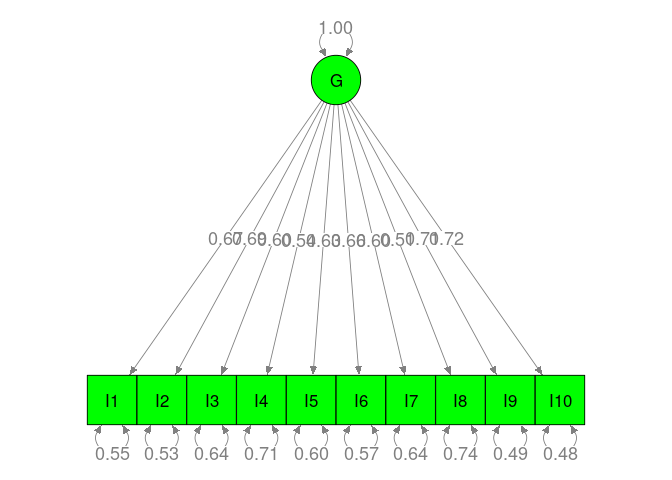
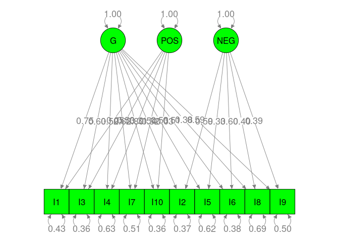

# Data preparation

```r
library(metaSEM)

## Use more cores to speed up the analysis
mxOption(NULL, 'Number of Threads', parallel::detectCores()-2)

## Create a new dataset without missing value in Individualism
index_na <- is.na(Gnambs18$Individualism)
Gnambs18 <- lapply(Gnambs18, function(x) x[!index_na])

## Select data with the correlation matrices, i.e., exclude studies with factor loadings
index <- Gnambs18$CorMat==1
Gnambs18 <- lapply(Gnambs18, function(x) x[index])

my.df <- Cor2DataFrame(Gnambs18$data, Gnambs18$n, acov = "weighted")

## Add the standardized individualism as the moderator
## Standardization of the moderator improves the convergence.
my.df$data <- data.frame(my.df$data,
                         Individualism=scale(Gnambs18$Individualism),
                         check.names=FALSE)
summary(my.df)
```

```
##         Length Class      Mode     
## data    1081   data.frame list     
## n         34   -none-     numeric  
## ylabels   45   -none-     character
## vlabels 1035   -none-     character
```

# TSSEM
## One general factor model


```r
rand1 <- tssem1(Gnambs18$data, Gnambs18$n, method="REM", RE.type="Diag")
summary(rand1)
```

```
## 
## Call:
## meta(y = ES, v = acovR, RE.constraints = Diag(paste0(RE.startvalues, 
##     "*Tau2_", 1:no.es, "_", 1:no.es)), RE.lbound = RE.lbound, 
##     I2 = I2, model.name = model.name, suppressWarnings = TRUE, 
##     silent = silent, run = run)
## 
## 95% confidence intervals: z statistic approximation
## Coefficients:
##               Estimate  Std.Error     lbound     ubound z value  Pr(>|z|)    
## Intercept1  0.40544204 0.01700733 0.37210828 0.43877580 23.8392 < 2.2e-16 ***
## Intercept2  0.42482259 0.01416881 0.39705223 0.45259295 29.9829 < 2.2e-16 ***
## Intercept3  0.38473794 0.01462371 0.35607599 0.41339989 26.3092 < 2.2e-16 ***
## Intercept4  0.36586132 0.01938231 0.32787269 0.40384995 18.8760 < 2.2e-16 ***
## Intercept5  0.39648175 0.01211295 0.37274080 0.42022269 32.7321 < 2.2e-16 ***
## Intercept6  0.43750389 0.01803637 0.40215325 0.47285452 24.2568 < 2.2e-16 ***
## Intercept7  0.30700381 0.02738407 0.25333203 0.36067559 11.2110 < 2.2e-16 ***
## Intercept8  0.43551574 0.01545502 0.40522445 0.46580702 28.1796 < 2.2e-16 ***
## Intercept9  0.61867687 0.01938968 0.58067381 0.65667994 31.9075 < 2.2e-16 ***
## Intercept10 0.31114873 0.01386275 0.28397824 0.33831922 22.4450 < 2.2e-16 ***
## Intercept11 0.28198880 0.01296416 0.25657952 0.30739808 21.7514 < 2.2e-16 ***
## Intercept12 0.46342328 0.01288556 0.43816804 0.48867851 35.9645 < 2.2e-16 ***
## Intercept13 0.65004592 0.01638469 0.61793251 0.68215933 39.6740 < 2.2e-16 ***
## Intercept14 0.33698866 0.01641067 0.30482434 0.36915298 20.5347 < 2.2e-16 ***
## Intercept15 0.42779282 0.02233819 0.38401078 0.47157487 19.1507 < 2.2e-16 ***
## Intercept16 0.53672466 0.01316698 0.51091785 0.56253147 40.7629 < 2.2e-16 ***
## Intercept17 0.43644055 0.01462176 0.40778244 0.46509867 29.8487 < 2.2e-16 ***
## Intercept18 0.47471534 0.01161676 0.45194690 0.49748378 40.8647 < 2.2e-16 ***
## Intercept19 0.34696634 0.01620602 0.31520312 0.37872956 21.4097 < 2.2e-16 ***
## Intercept20 0.29135318 0.01193863 0.26795390 0.31475247 24.4042 < 2.2e-16 ***
## Intercept21 0.53844803 0.02326900 0.49284162 0.58405444 23.1401 < 2.2e-16 ***
## Intercept22 0.20429950 0.02068877 0.16375026 0.24484874  9.8749 < 2.2e-16 ***
## Intercept23 0.35037812 0.01325970 0.32438958 0.37636666 26.4243 < 2.2e-16 ***
## Intercept24 0.46524741 0.01297873 0.43980956 0.49068526 35.8469 < 2.2e-16 ***
## Intercept25 0.28945007 0.01417680 0.26166404 0.31723610 20.4172 < 2.2e-16 ***
## Intercept26 0.26915936 0.01228352 0.24508409 0.29323462 21.9122 < 2.2e-16 ***
## Intercept27 0.41788766 0.01903174 0.38058615 0.45518918 21.9574 < 2.2e-16 ***
## Intercept28 0.18007070 0.02179438 0.13735450 0.22278689  8.2623 2.220e-16 ***
## Intercept29 0.30410880 0.01453263 0.27562537 0.33259223 20.9259 < 2.2e-16 ***
## Intercept30 0.40236983 0.01198708 0.37887557 0.42586408 33.5669 < 2.2e-16 ***
## Intercept31 0.45712838 0.01165838 0.43427837 0.47997838 39.2103 < 2.2e-16 ***
## Intercept32 0.33996025 0.01689847 0.30683986 0.37308063 20.1178 < 2.2e-16 ***
## Intercept33 0.35205761 0.01719225 0.31836143 0.38575380 20.4777 < 2.2e-16 ***
## Intercept34 0.48878709 0.01976465 0.45004909 0.52752508 24.7304 < 2.2e-16 ***
## Intercept35 0.38684171 0.01616964 0.35514981 0.41853362 23.9240 < 2.2e-16 ***
## Intercept36 0.31923408 0.01294688 0.29385866 0.34460950 24.6572 < 2.2e-16 ***
## Intercept37 0.41903586 0.02305615 0.37384663 0.46422509 18.1746 < 2.2e-16 ***
## Intercept38 0.53204180 0.01110221 0.51028186 0.55380173 47.9221 < 2.2e-16 ***
## Intercept39 0.41762040 0.01165507 0.39477689 0.44046392 35.8317 < 2.2e-16 ***
## Intercept40 0.23010851 0.02292353 0.18517922 0.27503780 10.0381 < 2.2e-16 ***
## Intercept41 0.37995574 0.01560315 0.34937413 0.41053735 24.3512 < 2.2e-16 ***
## Intercept42 0.48256656 0.01496355 0.45323854 0.51189459 32.2495 < 2.2e-16 ***
## Intercept43 0.40299589 0.02280663 0.35829571 0.44769606 17.6701 < 2.2e-16 ***
## Intercept44 0.33626752 0.03025795 0.27696303 0.39557201 11.1134 < 2.2e-16 ***
## Intercept45 0.47867054 0.01509736 0.44908025 0.50826082 31.7056 < 2.2e-16 ***
## Tau2_1_1    0.00899218 0.00234089 0.00440412 0.01358024  3.8414 0.0001224 ***
## Tau2_2_2    0.00597126 0.00156990 0.00289433 0.00904820  3.8036 0.0001426 ***
## Tau2_3_3    0.00634587 0.00167520 0.00306255 0.00962920  3.7881 0.0001518 ***
## Tau2_4_4    0.01183459 0.00305274 0.00585133 0.01781786  3.8767 0.0001059 ***
## Tau2_5_5    0.00418777 0.00115874 0.00191668 0.00645885  3.6141 0.0003014 ***
## Tau2_6_6    0.01017255 0.00259137 0.00509356 0.01525154  3.9255 8.653e-05 ***
## Tau2_7_7    0.02436969 0.00609210 0.01242940 0.03630998  4.0002 6.329e-05 ***
## Tau2_8_8    0.00731095 0.00189998 0.00358706 0.01103484  3.8479 0.0001191 ***
## Tau2_9_9    0.01223867 0.00308706 0.00618815 0.01828918  3.9645 7.355e-05 ***
## Tau2_10_10  0.00560329 0.00148233 0.00269798 0.00850859  3.7801 0.0001568 ***
## Tau2_11_11  0.00474965 0.00127088 0.00225876 0.00724054  3.7373 0.0001860 ***
## Tau2_12_12  0.00485431 0.00131434 0.00227824 0.00743037  3.6933 0.0002213 ***
## Tau2_13_13  0.00865184 0.00223540 0.00427054 0.01303314  3.8704 0.0001087 ***
## Tau2_14_14  0.00822540 0.00209862 0.00411217 0.01233863  3.9194 8.876e-05 ***
## Tau2_15_15  0.01599750 0.00407843 0.00800393 0.02399106  3.9225 8.765e-05 ***
## Tau2_16_16  0.00524243 0.00143218 0.00243541 0.00804945  3.6605 0.0002518 ***
## Tau2_17_17  0.00649330 0.00166433 0.00323128 0.00975533  3.9015 9.562e-05 ***
## Tau2_18_18  0.00382427 0.00104891 0.00176845 0.00588009  3.6460 0.0002664 ***
## Tau2_19_19  0.00796897 0.00208545 0.00388157 0.01205637  3.8212 0.0001328 ***
## Tau2_20_20  0.00393860 0.00109848 0.00178562 0.00609159  3.5855 0.0003364 ***
## Tau2_21_21  0.01764378 0.00444082 0.00893993 0.02634763  3.9731 7.095e-05 ***
## Tau2_22_22  0.01334142 0.00346402 0.00655208 0.02013077  3.8514 0.0001174 ***
## Tau2_23_23  0.00505712 0.00133774 0.00243519 0.00767905  3.7803 0.0001566 ***
## Tau2_24_24  0.00495224 0.00135883 0.00228897 0.00761550  3.6445 0.0002679 ***
## Tau2_25_25  0.00582684 0.00158023 0.00272965 0.00892402  3.6873 0.0002266 ***
## Tau2_26_26  0.00417648 0.00113883 0.00194440 0.00640855  3.6673 0.0002451 ***
## Tau2_27_27  0.01137455 0.00296813 0.00555712 0.01719199  3.8322 0.0001270 ***
## Tau2_28_28  0.01489637 0.00383464 0.00738062 0.02241213  3.8847 0.0001025 ***
## Tau2_29_29  0.00620232 0.00166274 0.00294340 0.00946124  3.7302 0.0001914 ***
## Tau2_30_30  0.00404328 0.00110872 0.00187022 0.00621634  3.6468 0.0002655 ***
## Tau2_31_31  0.00387675 0.00110636 0.00170833 0.00604517  3.5041 0.0004582 ***
## Tau2_32_32  0.00873788 0.00226094 0.00430652 0.01316924  3.8647 0.0001112 ***
## Tau2_33_33  0.00901033 0.00238152 0.00434264 0.01367802  3.7834 0.0001547 ***
## Tau2_34_34  0.01249842 0.00318572 0.00625453 0.01874231  3.9233 8.736e-05 ***
## Tau2_35_35  0.00800310 0.00208905 0.00390864 0.01209757  3.8310 0.0001276 ***
## Tau2_36_36  0.00479041 0.00126287 0.00231522 0.00726559  3.7933 0.0001487 ***
## Tau2_37_37  0.01708813 0.00438826 0.00848730 0.02568897  3.8941 9.858e-05 ***
## Tau2_38_38  0.00356694 0.00099371 0.00161930 0.00551458  3.5895 0.0003313 ***
## Tau2_39_39  0.00386867 0.00103488 0.00184034 0.00589701  3.7383 0.0001853 ***
## Tau2_40_40  0.01666814 0.00422683 0.00838371 0.02495258  3.9434 8.033e-05 ***
## Tau2_41_41  0.00737633 0.00187623 0.00369897 0.01105368  3.9315 8.443e-05 ***
## Tau2_42_42  0.00684128 0.00174947 0.00341238 0.01027019  3.9105 9.211e-05 ***
## Tau2_43_43  0.01670172 0.00424159 0.00838836 0.02501508  3.9376 8.230e-05 ***
## Tau2_44_44  0.03006310 0.00750555 0.01535250 0.04477370  4.0055 6.190e-05 ***
## Tau2_45_45  0.00701303 0.00182023 0.00344543 0.01058062  3.8528 0.0001168 ***
## ---
## Signif. codes:  0 '***' 0.001 '**' 0.01 '*' 0.05 '.' 0.1 ' ' 1
## 
## Q statistic on the homogeneity of effect sizes: 30324.8
## Degrees of freedom of the Q statistic: 1485
## P value of the Q statistic: 0
## 
## Heterogeneity indices (based on the estimated Tau2):
##                               Estimate
## Intercept1: I2 (Q statistic)    0.9748
## Intercept2: I2 (Q statistic)    0.9616
## Intercept3: I2 (Q statistic)    0.9606
## Intercept4: I2 (Q statistic)    0.9795
## Intercept5: I2 (Q statistic)    0.9463
## Intercept6: I2 (Q statistic)    0.9777
## Intercept7: I2 (Q statistic)    0.9887
## Intercept8: I2 (Q statistic)    0.9707
## Intercept9: I2 (Q statistic)    0.9893
## Intercept10: I2 (Q statistic)   0.9524
## Intercept11: I2 (Q statistic)   0.9416
## Intercept12: I2 (Q statistic)   0.9571
## Intercept13: I2 (Q statistic)   0.9867
## Intercept14: I2 (Q statistic)   0.9688
## Intercept15: I2 (Q statistic)   0.9853
## Intercept16: I2 (Q statistic)   0.9674
## Intercept17: I2 (Q statistic)   0.9672
## Intercept18: I2 (Q statistic)   0.9471
## Intercept19: I2 (Q statistic)   0.9679
## Intercept20: I2 (Q statistic)   0.9320
## Intercept21: I2 (Q statistic)   0.9896
## Intercept22: I2 (Q statistic)   0.9767
## Intercept23: I2 (Q statistic)   0.9493
## Intercept24: I2 (Q statistic)   0.9576
## Intercept25: I2 (Q statistic)   0.9529
## Intercept26: I2 (Q statistic)   0.9339
## Intercept27: I2 (Q statistic)   0.9792
## Intercept28: I2 (Q statistic)   0.9787
## Intercept29: I2 (Q statistic)   0.9558
## Intercept30: I2 (Q statistic)   0.9416
## Intercept31: I2 (Q statistic)   0.9476
## Intercept32: I2 (Q statistic)   0.9708
## Intercept33: I2 (Q statistic)   0.9710
## Intercept34: I2 (Q statistic)   0.9842
## Intercept35: I2 (Q statistic)   0.9705
## Intercept36: I2 (Q statistic)   0.9459
## Intercept37: I2 (Q statistic)   0.9859
## Intercept38: I2 (Q statistic)   0.9527
## Intercept39: I2 (Q statistic)   0.9446
## Intercept40: I2 (Q statistic)   0.9820
## Intercept41: I2 (Q statistic)   0.9669
## Intercept42: I2 (Q statistic)   0.9706
## Intercept43: I2 (Q statistic)   0.9857
## Intercept44: I2 (Q statistic)   0.9914
## Intercept45: I2 (Q statistic)   0.9720
## 
## Number of studies (or clusters): 34
## Number of observed statistics: 1530
## Number of estimated parameters: 90
## Degrees of freedom: 1440
## -2 log likelihood: -2647.363 
## OpenMx status1: 0 ("0" or "1": The optimization is considered fine.
## Other values may indicate problems.)
```

```r
## One general factor
model1 <- "G =~ g1*I1 + g2*I2 + g3*I3 + g4*I4 + g5*I5 +
                g6*I6 + g7*I7 + g8*I8 + g9*I9 + g10*I10"

RAM1 <- lavaan2RAM(model1, obs.variables = paste0("I", 1:10))
RAM1
```

```
## $A
##     I1  I2  I3  I4  I5  I6  I7  I8  I9  I10 G      
## I1  "0" "0" "0" "0" "0" "0" "0" "0" "0" "0" "0*g1" 
## I2  "0" "0" "0" "0" "0" "0" "0" "0" "0" "0" "0*g2" 
## I3  "0" "0" "0" "0" "0" "0" "0" "0" "0" "0" "0*g3" 
## I4  "0" "0" "0" "0" "0" "0" "0" "0" "0" "0" "0*g4" 
## I5  "0" "0" "0" "0" "0" "0" "0" "0" "0" "0" "0*g5" 
## I6  "0" "0" "0" "0" "0" "0" "0" "0" "0" "0" "0*g6" 
## I7  "0" "0" "0" "0" "0" "0" "0" "0" "0" "0" "0*g7" 
## I8  "0" "0" "0" "0" "0" "0" "0" "0" "0" "0" "0*g8" 
## I9  "0" "0" "0" "0" "0" "0" "0" "0" "0" "0" "0*g9" 
## I10 "0" "0" "0" "0" "0" "0" "0" "0" "0" "0" "0*g10"
## G   "0" "0" "0" "0" "0" "0" "0" "0" "0" "0" "0"    
## 
## $S
##     I1           I2           I3           I4           I5           I6           I7          
## I1  "0*I1WITHI1" "0"          "0"          "0"          "0"          "0"          "0"         
## I2  "0"          "0*I2WITHI2" "0"          "0"          "0"          "0"          "0"         
## I3  "0"          "0"          "0*I3WITHI3" "0"          "0"          "0"          "0"         
## I4  "0"          "0"          "0"          "0*I4WITHI4" "0"          "0"          "0"         
## I5  "0"          "0"          "0"          "0"          "0*I5WITHI5" "0"          "0"         
## I6  "0"          "0"          "0"          "0"          "0"          "0*I6WITHI6" "0"         
## I7  "0"          "0"          "0"          "0"          "0"          "0"          "0*I7WITHI7"
## I8  "0"          "0"          "0"          "0"          "0"          "0"          "0"         
## I9  "0"          "0"          "0"          "0"          "0"          "0"          "0"         
## I10 "0"          "0"          "0"          "0"          "0"          "0"          "0"         
## G   "0"          "0"          "0"          "0"          "0"          "0"          "0"         
##     I8           I9           I10            G  
## I1  "0"          "0"          "0"            "0"
## I2  "0"          "0"          "0"            "0"
## I3  "0"          "0"          "0"            "0"
## I4  "0"          "0"          "0"            "0"
## I5  "0"          "0"          "0"            "0"
## I6  "0"          "0"          "0"            "0"
## I7  "0"          "0"          "0"            "0"
## I8  "0*I8WITHI8" "0"          "0"            "0"
## I9  "0"          "0*I9WITHI9" "0"            "0"
## I10 "0"          "0"          "0*I10WITHI10" "0"
## G   "0"          "0"          "0"            "1"
## 
## $F
##     I1 I2 I3 I4 I5 I6 I7 I8 I9 I10 G
## I1   1  0  0  0  0  0  0  0  0   0 0
## I2   0  1  0  0  0  0  0  0  0   0 0
## I3   0  0  1  0  0  0  0  0  0   0 0
## I4   0  0  0  1  0  0  0  0  0   0 0
## I5   0  0  0  0  1  0  0  0  0   0 0
## I6   0  0  0  0  0  1  0  0  0   0 0
## I7   0  0  0  0  0  0  1  0  0   0 0
## I8   0  0  0  0  0  0  0  1  0   0 0
## I9   0  0  0  0  0  0  0  0  1   0 0
## I10  0  0  0  0  0  0  0  0  0   1 0
## 
## $M
##   I1 I2 I3 I4 I5 I6 I7 I8 I9 I10 G
## 1  0  0  0  0  0  0  0  0  0   0 0
```

```r
rand2a <- tssem2(rand1, Amatrix = RAM1$A, Smatrix = RAM1$S, Fmatrix = RAM1$F)
summary(rand2a)
```

```
## 
## Call:
## wls(Cov = pooledS, aCov = aCov, n = tssem1.obj$total.n, Amatrix = Amatrix, 
##     Smatrix = Smatrix, Fmatrix = Fmatrix, diag.constraints = diag.constraints, 
##     cor.analysis = cor.analysis, intervals.type = intervals.type, 
##     mx.algebras = mx.algebras, model.name = model.name, suppressWarnings = suppressWarnings, 
##     silent = silent, run = run)
## 
## 95% confidence intervals: z statistic approximation
## Coefficients:
##      Estimate Std.Error    lbound    ubound z value  Pr(>|z|)    
## g1  0.6718567 0.0092048 0.6538156 0.6898979  72.990 < 2.2e-16 ***
## g10 0.7190284 0.0084647 0.7024380 0.7356188  84.945 < 2.2e-16 ***
## g2  0.6875416 0.0085784 0.6707282 0.7043550  80.148 < 2.2e-16 ***
## g3  0.5970902 0.0082729 0.5808755 0.6133048  72.174 < 2.2e-16 ***
## g4  0.5367408 0.0081164 0.5208330 0.5526486  66.131 < 2.2e-16 ***
## g5  0.6322061 0.0088254 0.6149087 0.6495035  71.635 < 2.2e-16 ***
## g6  0.6562616 0.0075209 0.6415209 0.6710023  87.258 < 2.2e-16 ***
## g7  0.5964122 0.0094530 0.5778846 0.6149398  63.092 < 2.2e-16 ***
## g8  0.5099212 0.0124635 0.4854931 0.5343493  40.913 < 2.2e-16 ***
## g9  0.7131067 0.0084100 0.6966235 0.7295900  84.793 < 2.2e-16 ***
## ---
## Signif. codes:  0 '***' 0.001 '**' 0.01 '*' 0.05 '.' 0.1 ' ' 1
## 
## Goodness-of-fit indices:
##                                                 Value
## Sample size                                1.0468e+05
## Chi-square of target model                 1.0343e+03
## DF of target model                         3.5000e+01
## p value of target model                    0.0000e+00
## Number of constraints imposed on "Smatrix" 0.0000e+00
## DF manually adjusted                       0.0000e+00
## Chi-square of independence model           2.0602e+04
## DF of independence model                   4.5000e+01
## RMSEA                                      1.6500e-02
## RMSEA lower 95% CI                         1.5700e-02
## RMSEA upper 95% CI                         1.7400e-02
## SRMR                                       7.7500e-02
## TLI                                        9.3750e-01
## CFI                                        9.5140e-01
## AIC                                        9.6428e+02
## BIC                                        6.2973e+02
## OpenMx status1: 0 ("0" or "1": The optimization is considered fine.
## Other values indicate problems.)
```

```r
plot(rand2a, col="green")
```

<!-- -->

## Bifactor model with positive and negative Self-Esteem

```r
model2 <- "G =~ g1*I1 + g2*I2 + g3*I3 + g4*I4 + g5*I5 + 
                g6*I6 + g7*I7 + g8*I8 + g9*I9 + g10*I10
           POS =~ p1*I1 + p3*I3 + p4*I4 + p7*I7 + p10*I10
           NEG =~ n2*I2 + n5*I5 + n6*I6 + n8*I8 + n9*I9"

RAM2 <- lavaan2RAM(model2, obs.variables = paste0("I", 1:10))
RAM2
```

```
## $A
##     I1  I2  I3  I4  I5  I6  I7  I8  I9  I10 G       POS     NEG   
## I1  "0" "0" "0" "0" "0" "0" "0" "0" "0" "0" "0*g1"  "0*p1"  "0"   
## I2  "0" "0" "0" "0" "0" "0" "0" "0" "0" "0" "0*g2"  "0"     "0*n2"
## I3  "0" "0" "0" "0" "0" "0" "0" "0" "0" "0" "0*g3"  "0*p3"  "0"   
## I4  "0" "0" "0" "0" "0" "0" "0" "0" "0" "0" "0*g4"  "0*p4"  "0"   
## I5  "0" "0" "0" "0" "0" "0" "0" "0" "0" "0" "0*g5"  "0"     "0*n5"
## I6  "0" "0" "0" "0" "0" "0" "0" "0" "0" "0" "0*g6"  "0"     "0*n6"
## I7  "0" "0" "0" "0" "0" "0" "0" "0" "0" "0" "0*g7"  "0*p7"  "0"   
## I8  "0" "0" "0" "0" "0" "0" "0" "0" "0" "0" "0*g8"  "0"     "0*n8"
## I9  "0" "0" "0" "0" "0" "0" "0" "0" "0" "0" "0*g9"  "0"     "0*n9"
## I10 "0" "0" "0" "0" "0" "0" "0" "0" "0" "0" "0*g10" "0*p10" "0"   
## G   "0" "0" "0" "0" "0" "0" "0" "0" "0" "0" "0"     "0"     "0"   
## POS "0" "0" "0" "0" "0" "0" "0" "0" "0" "0" "0"     "0"     "0"   
## NEG "0" "0" "0" "0" "0" "0" "0" "0" "0" "0" "0"     "0"     "0"   
## 
## $S
##     I1           I2           I3           I4           I5           I6           I7          
## I1  "0*I1WITHI1" "0"          "0"          "0"          "0"          "0"          "0"         
## I2  "0"          "0*I2WITHI2" "0"          "0"          "0"          "0"          "0"         
## I3  "0"          "0"          "0*I3WITHI3" "0"          "0"          "0"          "0"         
## I4  "0"          "0"          "0"          "0*I4WITHI4" "0"          "0"          "0"         
## I5  "0"          "0"          "0"          "0"          "0*I5WITHI5" "0"          "0"         
## I6  "0"          "0"          "0"          "0"          "0"          "0*I6WITHI6" "0"         
## I7  "0"          "0"          "0"          "0"          "0"          "0"          "0*I7WITHI7"
## I8  "0"          "0"          "0"          "0"          "0"          "0"          "0"         
## I9  "0"          "0"          "0"          "0"          "0"          "0"          "0"         
## I10 "0"          "0"          "0"          "0"          "0"          "0"          "0"         
## G   "0"          "0"          "0"          "0"          "0"          "0"          "0"         
## POS "0"          "0"          "0"          "0"          "0"          "0"          "0"         
## NEG "0"          "0"          "0"          "0"          "0"          "0"          "0"         
##     I8           I9           I10            G   POS NEG
## I1  "0"          "0"          "0"            "0" "0" "0"
## I2  "0"          "0"          "0"            "0" "0" "0"
## I3  "0"          "0"          "0"            "0" "0" "0"
## I4  "0"          "0"          "0"            "0" "0" "0"
## I5  "0"          "0"          "0"            "0" "0" "0"
## I6  "0"          "0"          "0"            "0" "0" "0"
## I7  "0"          "0"          "0"            "0" "0" "0"
## I8  "0*I8WITHI8" "0"          "0"            "0" "0" "0"
## I9  "0"          "0*I9WITHI9" "0"            "0" "0" "0"
## I10 "0"          "0"          "0*I10WITHI10" "0" "0" "0"
## G   "0"          "0"          "0"            "1" "0" "0"
## POS "0"          "0"          "0"            "0" "1" "0"
## NEG "0"          "0"          "0"            "0" "0" "1"
## 
## $F
##     I1 I2 I3 I4 I5 I6 I7 I8 I9 I10 G POS NEG
## I1   1  0  0  0  0  0  0  0  0   0 0   0   0
## I2   0  1  0  0  0  0  0  0  0   0 0   0   0
## I3   0  0  1  0  0  0  0  0  0   0 0   0   0
## I4   0  0  0  1  0  0  0  0  0   0 0   0   0
## I5   0  0  0  0  1  0  0  0  0   0 0   0   0
## I6   0  0  0  0  0  1  0  0  0   0 0   0   0
## I7   0  0  0  0  0  0  1  0  0   0 0   0   0
## I8   0  0  0  0  0  0  0  1  0   0 0   0   0
## I9   0  0  0  0  0  0  0  0  1   0 0   0   0
## I10  0  0  0  0  0  0  0  0  0   1 0   0   0
## 
## $M
##   I1 I2 I3 I4 I5 I6 I7 I8 I9 I10 G POS NEG
## 1  0  0  0  0  0  0  0  0  0   0 0   0   0
```

```r
rand2b <- tssem2(rand1, Amatrix = RAM2$A, Smatrix = RAM2$S, Fmatrix = RAM2$F)
summary(rand2b)
```

```
## 
## Call:
## wls(Cov = pooledS, aCov = aCov, n = tssem1.obj$total.n, Amatrix = Amatrix, 
##     Smatrix = Smatrix, Fmatrix = Fmatrix, diag.constraints = diag.constraints, 
##     cor.analysis = cor.analysis, intervals.type = intervals.type, 
##     mx.algebras = mx.algebras, model.name = model.name, suppressWarnings = suppressWarnings, 
##     silent = silent, run = run)
## 
## 95% confidence intervals: z statistic approximation
## Coefficients:
##      Estimate Std.Error    lbound    ubound z value  Pr(>|z|)    
## g1   0.752662  0.014051  0.725123  0.780201 53.5674 < 2.2e-16 ***
## p1  -0.047643  0.042722 -0.131377  0.036091 -1.1152    0.2648    
## g10  0.801857  0.014488  0.773460  0.830254 55.3450 < 2.2e-16 ***
## p10 -0.034061  0.044047 -0.120392  0.052271 -0.7733    0.4394    
## g2   0.535601  0.013252  0.509628  0.561574 40.4172 < 2.2e-16 ***
## n2   0.587799  0.024186  0.540395  0.635204 24.3029 < 2.2e-16 ***
## g3   0.595888  0.017363  0.561857  0.629919 34.3191 < 2.2e-16 ***
## p3   0.531255  0.070412  0.393250  0.669260  7.5449 4.530e-14 ***
## g4   0.522440  0.012646  0.497654  0.547227 41.3114 < 2.2e-16 ***
## p4   0.306155  0.037994  0.231689  0.380622  8.0580 6.661e-16 ***
## g5   0.527210  0.014154  0.499469  0.554951 37.2486 < 2.2e-16 ***
## n5   0.326077  0.021632  0.283680  0.368475 15.0739 < 2.2e-16 ***
## g6   0.514347  0.011522  0.491764  0.536931 44.6393 < 2.2e-16 ***
## n6   0.597995  0.022935  0.553043  0.642946 26.0735 < 2.2e-16 ***
## g7   0.620787  0.013670  0.593994  0.647581 45.4112 < 2.2e-16 ***
## p7   0.317101  0.041469  0.235823  0.398379  7.6466 2.065e-14 ***
## g8   0.384994  0.018314  0.349099  0.420888 21.0219 < 2.2e-16 ***
## n8   0.399932  0.030376  0.340397  0.459467 13.1662 < 2.2e-16 ***
## g9   0.594681  0.013886  0.567464  0.621897 42.8247 < 2.2e-16 ***
## n9   0.386959  0.022302  0.343249  0.430670 17.3511 < 2.2e-16 ***
## ---
## Signif. codes:  0 '***' 0.001 '**' 0.01 '*' 0.05 '.' 0.1 ' ' 1
## 
## Goodness-of-fit indices:
##                                                  Value
## Sample size                                104684.0000
## Chi-square of target model                     37.6220
## DF of target model                             25.0000
## p value of target model                         0.0503
## Number of constraints imposed on "Smatrix"      0.0000
## DF manually adjusted                            0.0000
## Chi-square of independence model            20601.8807
## DF of independence model                       45.0000
## RMSEA                                           0.0022
## RMSEA lower 95% CI                              0.0000
## RMSEA upper 95% CI                              0.0036
## SRMR                                            0.0161
## TLI                                             0.9989
## CFI                                             0.9994
## AIC                                           -12.3780
## BIC                                          -251.3455
## OpenMx status1: 0 ("0" or "1": The optimization is considered fine.
## Other values indicate problems.)
```

```r
plot(rand2b, col="green")
```

<!-- -->

```r
## Compare the one general factor to the bifactor model
anova(rand2b, rand2a)
```

```
##                 base         comparison ep   minus2LL  df AIC   diffLL diffdf             p
## 1 TSSEM2 Correlation               <NA> 20   37.62202 -20  NA       NA     NA            NA
## 2 TSSEM2 Correlation TSSEM2 Correlation 10 1034.28213 -10  NA 996.6601     10 9.802951e-208
```

## Models with two subgroup analysis

```r
# Data for studies with individualism below the mean
data_g1 <- Gnambs18$data[my.df$data$Individualism < 0 ]
n_g1 <- Gnambs18$n[my.df$data$Individualism < 0 ]

# Data for studies with individualism above or equal the mean
data_g2 <- Gnambs18$data[my.df$data$Individualism >= 0 ]
n_g2 <- Gnambs18$n[my.df$data$Individualism >= 0 ]
```

### Fitting a random-effects Stage 1 model in two subgroups

```r
## Stage 1 analysis per subgroup (random-effects analysis)
stage1_g1.fit <- tssem1(Cov = data_g1, n = n_g1, method = "REM", RE.type = "Diag")
stage1_g2.fit <- tssem1(Cov = data_g2, n = n_g2, method = "REM", RE.type = "Diag")

summary(stage1_g1.fit)
```

```
## 
## Call:
## meta(y = ES, v = acovR, RE.constraints = Diag(paste0(RE.startvalues, 
##     "*Tau2_", 1:no.es, "_", 1:no.es)), RE.lbound = RE.lbound, 
##     I2 = I2, model.name = model.name, suppressWarnings = TRUE, 
##     silent = silent, run = run)
## 
## 95% confidence intervals: z statistic approximation
## Coefficients:
##               Estimate  Std.Error     lbound     ubound z value  Pr(>|z|)    
## Intercept1  0.33167733 0.02715305 0.27845832 0.38489634 12.2151 < 2.2e-16 ***
## Intercept2  0.40117758 0.01977319 0.36242284 0.43993233 20.2890 < 2.2e-16 ***
## Intercept3  0.38259249 0.01859854 0.34614002 0.41904495 20.5711 < 2.2e-16 ***
## Intercept4  0.31549570 0.03409773 0.24866538 0.38232603  9.2527 < 2.2e-16 ***
## Intercept5  0.32992986 0.01978089 0.29116002 0.36869970 16.6792 < 2.2e-16 ***
## Intercept6  0.41402910 0.02716855 0.36077972 0.46727848 15.2393 < 2.2e-16 ***
## Intercept7  0.20248409 0.04867303 0.10708671 0.29788148  4.1601 3.181e-05 ***
## Intercept8  0.38622677 0.02597675 0.33531328 0.43714025 14.8682 < 2.2e-16 ***
## Intercept9  0.55983962 0.02678686 0.50733834 0.61234089 20.8998 < 2.2e-16 ***
## Intercept10 0.27582932 0.02050901 0.23563240 0.31602625 13.4492 < 2.2e-16 ***
## Intercept11 0.26795227 0.01837314 0.23194159 0.30396295 14.5839 < 2.2e-16 ***
## Intercept12 0.45167006 0.02201456 0.40852233 0.49481780 20.5169 < 2.2e-16 ***
## Intercept13 0.61521136 0.02924611 0.55789005 0.67253267 21.0357 < 2.2e-16 ***
## Intercept14 0.28548173 0.02453084 0.23740217 0.33356129 11.6377 < 2.2e-16 ***
## Intercept15 0.35727111 0.04264659 0.27368533 0.44085688  8.3775 < 2.2e-16 ***
## Intercept16 0.49587811 0.02420536 0.44843648 0.54331974 20.4863 < 2.2e-16 ***
## Intercept17 0.38773476 0.02400214 0.34069143 0.43477809 16.1542 < 2.2e-16 ***
## Intercept18 0.45691616 0.01642994 0.42471406 0.48911825 27.8100 < 2.2e-16 ***
## Intercept19 0.31836903 0.02564510 0.26810557 0.36863250 12.4144 < 2.2e-16 ***
## Intercept20 0.25372269 0.02085345 0.21285068 0.29459471 12.1669 < 2.2e-16 ***
## Intercept21 0.51752923 0.03365546 0.45156575 0.58349271 15.3773 < 2.2e-16 ***
## Intercept22 0.13433228 0.03907020 0.05775609 0.21090848  3.4382 0.0005855 ***
## Intercept23 0.35092661 0.02103827 0.30969236 0.39216087 16.6804 < 2.2e-16 ***
## Intercept24 0.46380085 0.02090882 0.42282032 0.50478138 22.1821 < 2.2e-16 ***
## Intercept25 0.26522477 0.02410057 0.21798852 0.31246102 11.0049 < 2.2e-16 ***
## Intercept26 0.24760522 0.01770719 0.21289975 0.28231068 13.9833 < 2.2e-16 ***
## Intercept27 0.41562957 0.03266179 0.35161364 0.47964550 12.7253 < 2.2e-16 ***
## Intercept28 0.12945250 0.04324158 0.04470056 0.21420444  2.9937 0.0027561 ** 
## Intercept29 0.31701137 0.02237802 0.27315126 0.36087148 14.1662 < 2.2e-16 ***
## Intercept30 0.41581834 0.01407391 0.38823398 0.44340269 29.5453 < 2.2e-16 ***
## Intercept31 0.43547033 0.02011272 0.39605011 0.47489054 21.6515 < 2.2e-16 ***
## Intercept32 0.30333911 0.02912932 0.24624670 0.36043152 10.4135 < 2.2e-16 ***
## Intercept33 0.29160945 0.03325033 0.22644000 0.35677891  8.7701 < 2.2e-16 ***
## Intercept34 0.47252874 0.03919657 0.39570487 0.54935261 12.0554 < 2.2e-16 ***
## Intercept35 0.36672958 0.02867582 0.31052600 0.42293315 12.7888 < 2.2e-16 ***
## Intercept36 0.27445833 0.02144081 0.23243512 0.31648153 12.8007 < 2.2e-16 ***
## Intercept37 0.34424227 0.04385741 0.25828332 0.43020121  7.8491 4.219e-15 ***
## Intercept38 0.48485102 0.01917014 0.44727825 0.52242380 25.2920 < 2.2e-16 ***
## Intercept39 0.36024280 0.01925724 0.32249930 0.39798631 18.7069 < 2.2e-16 ***
## Intercept40 0.13863210 0.03705636 0.06600298 0.21126122  3.7411 0.0001832 ***
## Intercept41 0.36298052 0.02500598 0.31396970 0.41199134 14.5157 < 2.2e-16 ***
## Intercept42 0.46488895 0.02397506 0.41789869 0.51187921 19.3905 < 2.2e-16 ***
## Intercept43 0.30610649 0.03950018 0.22868755 0.38352542  7.7495 9.326e-15 ***
## Intercept44 0.21569806 0.05177713 0.11421675 0.31717937  4.1659 3.101e-05 ***
## Intercept45 0.44022054 0.02709309 0.38711905 0.49332203 16.2484 < 2.2e-16 ***
## Tau2_1_1    0.01071122 0.00401996 0.00283225 0.01859019  2.6645 0.0077101 ** 
## Tau2_2_2    0.00524154 0.00210845 0.00110905 0.00937404  2.4860 0.0129201 *  
## Tau2_3_3    0.00447364 0.00192021 0.00071010 0.00823717  2.3298 0.0198184 *  
## Tau2_4_4    0.01744156 0.00653024 0.00464252 0.03024059  2.6709 0.0075650 ** 
## Tau2_5_5    0.00516788 0.00203705 0.00117534 0.00916042  2.5369 0.0111825 *  
## Tau2_6_6    0.01078867 0.00404587 0.00285892 0.01871843  2.6666 0.0076625 ** 
## Tau2_7_7    0.03634219 0.01316392 0.01054137 0.06214301  2.7607 0.0057670 ** 
## Tau2_8_8    0.00977108 0.00372081 0.00247843 0.01706372  2.6261 0.0086378 ** 
## Tau2_9_9    0.01083352 0.00403790 0.00291938 0.01874766  2.6830 0.0072974 ** 
## Tau2_10_10  0.00558453 0.00216810 0.00133513 0.00983394  2.5758 0.0100017 *  
## Tau2_11_11  0.00422647 0.00171902 0.00085725 0.00759570  2.4587 0.0139460 *  
## Tau2_12_12  0.00678978 0.00262805 0.00163890 0.01194065  2.5836 0.0097780 ** 
## Tau2_13_13  0.01315432 0.00485514 0.00363843 0.02267022  2.7094 0.0067413 ** 
## Tau2_14_14  0.00850157 0.00314464 0.00233819 0.01466495  2.7035 0.0068611 ** 
## Tau2_15_15  0.02773120 0.01021900 0.00770233 0.04776006  2.7137 0.0066538 ** 
## Tau2_16_16  0.00850939 0.00333735 0.00196831 0.01505048  2.5497 0.0107802 *  
## Tau2_17_17  0.00821620 0.00305306 0.00223232 0.01420009  2.6911 0.0071209 ** 
## Tau2_18_18  0.00338420 0.00145451 0.00053342 0.00623499  2.3267 0.0199813 *  
## Tau2_19_19  0.00932883 0.00352289 0.00242409 0.01623357  2.6481 0.0080955 ** 
## Tau2_20_20  0.00574971 0.00228870 0.00126393 0.01023548  2.5122 0.0119977 *  
## Tau2_21_21  0.01736792 0.00642852 0.00476824 0.02996759  2.7017 0.0068987 ** 
## Tau2_22_22  0.02277524 0.00850837 0.00609914 0.03945134  2.6768 0.0074328 ** 
## Tau2_23_23  0.00593437 0.00227114 0.00148303 0.01038572  2.6130 0.0089763 ** 
## Tau2_24_24  0.00606849 0.00247635 0.00121493 0.01092204  2.4506 0.0142627 *  
## Tau2_25_25  0.00799328 0.00316916 0.00178184 0.01420471  2.5222 0.0116620 *  
## Tau2_26_26  0.00382303 0.00157917 0.00072792 0.00691814  2.4209 0.0154815 *  
## Tau2_27_27  0.01601100 0.00602971 0.00419297 0.02782902  2.6553 0.0079226 ** 
## Tau2_28_28  0.02823241 0.01040505 0.00783890 0.04862593  2.7133 0.0066609 ** 
## Tau2_29_29  0.00681324 0.00266907 0.00158196 0.01204453  2.5527 0.0106903 *  
## Tau2_30_30  0.00222390 0.00103959 0.00018635 0.00426146  2.1392 0.0324179 *  
## Tau2_31_31  0.00547435 0.00222229 0.00111874 0.00982996  2.4634 0.0137634 *  
## Tau2_32_32  0.01236774 0.00466197 0.00323045 0.02150504  2.6529 0.0079803 ** 
## Tau2_33_33  0.01623325 0.00615803 0.00416374 0.02830277  2.6361 0.0083862 ** 
## Tau2_34_34  0.02364754 0.00863909 0.00671523 0.04057985  2.7373 0.0061951 ** 
## Tau2_35_35  0.01204345 0.00456935 0.00308769 0.02099921  2.6357 0.0083963 ** 
## Tau2_36_36  0.00617097 0.00234361 0.00157759 0.01076436  2.6331 0.0084607 ** 
## Tau2_37_37  0.02937886 0.01085021 0.00811285 0.05064487  2.7077 0.0067756 ** 
## Tau2_38_38  0.00499625 0.00206091 0.00095695 0.00903555  2.4243 0.0153381 *  
## Tau2_39_39  0.00489525 0.00187785 0.00121473 0.00857576  2.6068 0.0091382 ** 
## Tau2_40_40  0.02038426 0.00752277 0.00563991 0.03512862  2.7097 0.0067349 ** 
## Tau2_41_41  0.00890442 0.00329808 0.00244030 0.01536853  2.6999 0.0069364 ** 
## Tau2_42_42  0.00829835 0.00308977 0.00224251 0.01435420  2.6857 0.0072367 ** 
## Tau2_43_43  0.02352081 0.00867516 0.00651780 0.04052382  2.7113 0.0067024 ** 
## Tau2_44_44  0.04136881 0.01499983 0.01196969 0.07076793  2.7580 0.0058165 ** 
## Tau2_45_45  0.01075361 0.00404517 0.00282521 0.01868200  2.6584 0.0078517 ** 
## ---
## Signif. codes:  0 '***' 0.001 '**' 0.01 '*' 0.05 '.' 0.1 ' ' 1
## 
## Q statistic on the homogeneity of effect sizes: 14907.3
## Degrees of freedom of the Q statistic: 675
## P value of the Q statistic: 0
## 
## Heterogeneity indices (based on the estimated Tau2):
##                               Estimate
## Intercept1: I2 (Q statistic)    0.9656
## Intercept2: I2 (Q statistic)    0.9347
## Intercept3: I2 (Q statistic)    0.9185
## Intercept4: I2 (Q statistic)    0.9784
## Intercept5: I2 (Q statistic)    0.9279
## Intercept6: I2 (Q statistic)    0.9689
## Intercept7: I2 (Q statistic)    0.9866
## Intercept8: I2 (Q statistic)    0.9654
## Intercept9: I2 (Q statistic)    0.9811
## Intercept10: I2 (Q statistic)   0.9282
## Intercept11: I2 (Q statistic)   0.9022
## Intercept12: I2 (Q statistic)   0.9534
## Intercept13: I2 (Q statistic)   0.9874
## Intercept14: I2 (Q statistic)   0.9540
## Intercept15: I2 (Q statistic)   0.9847
## Intercept16: I2 (Q statistic)   0.9666
## Intercept17: I2 (Q statistic)   0.9582
## Intercept18: I2 (Q statistic)   0.9081
## Intercept19: I2 (Q statistic)   0.9570
## Intercept20: I2 (Q statistic)   0.9262
## Intercept21: I2 (Q statistic)   0.9864
## Intercept22: I2 (Q statistic)   0.9769
## Intercept23: I2 (Q statistic)   0.9344
## Intercept24: I2 (Q statistic)   0.9486
## Intercept25: I2 (Q statistic)   0.9450
## Intercept26: I2 (Q statistic)   0.8907
## Intercept27: I2 (Q statistic)   0.9783
## Intercept28: I2 (Q statistic)   0.9810
## Intercept29: I2 (Q statistic)   0.9394
## Intercept30: I2 (Q statistic)   0.8545
## Intercept31: I2 (Q statistic)   0.9399
## Intercept32: I2 (Q statistic)   0.9676
## Intercept33: I2 (Q statistic)   0.9720
## Intercept34: I2 (Q statistic)   0.9875
## Intercept35: I2 (Q statistic)   0.9695
## Intercept36: I2 (Q statistic)   0.9333
## Intercept37: I2 (Q statistic)   0.9854
## Intercept38: I2 (Q statistic)   0.9411
## Intercept39: I2 (Q statistic)   0.9264
## Intercept40: I2 (Q statistic)   0.9753
## Intercept41: I2 (Q statistic)   0.9583
## Intercept42: I2 (Q statistic)   0.9642
## Intercept43: I2 (Q statistic)   0.9808
## Intercept44: I2 (Q statistic)   0.9884
## Intercept45: I2 (Q statistic)   0.9693
## 
## Number of studies (or clusters): 16
## Number of observed statistics: 720
## Number of estimated parameters: 90
## Degrees of freedom: 630
## -2 log likelihood: -1115.22 
## OpenMx status1: 0 ("0" or "1": The optimization is considered fine.
## Other values may indicate problems.)
```

```r
summary(stage1_g2.fit)
```

```
## 
## Call:
## meta(y = ES, v = acovR, RE.constraints = Diag(paste0(RE.startvalues, 
##     "*Tau2_", 1:no.es, "_", 1:no.es)), RE.lbound = RE.lbound, 
##     I2 = I2, model.name = model.name, suppressWarnings = TRUE, 
##     silent = silent, run = run)
## 
## 95% confidence intervals: z statistic approximation
## Coefficients:
##               Estimate  Std.Error     lbound     ubound z value  Pr(>|z|)    
## Intercept1  0.45258596 0.01574354 0.42172919 0.48344273 28.7474 < 2.2e-16 ***
## Intercept2  0.43683724 0.01924295 0.39912175 0.47455273 22.7012 < 2.2e-16 ***
## Intercept3  0.38096214 0.02095385 0.33989336 0.42203093 18.1810 < 2.2e-16 ***
## Intercept4  0.39632377 0.01974069 0.35763272 0.43501482 20.0765 < 2.2e-16 ***
## Intercept5  0.43658917 0.00917219 0.41861200 0.45456634 47.5992 < 2.2e-16 ***
## Intercept6  0.44827926 0.02312164 0.40296169 0.49359683 19.3879 < 2.2e-16 ***
## Intercept7  0.38103485 0.01694118 0.34783075 0.41423894 22.4916 < 2.2e-16 ***
## Intercept8  0.46421248 0.01571432 0.43341298 0.49501197 29.5407 < 2.2e-16 ***
## Intercept9  0.66187295 0.02395537 0.61492129 0.70882461 27.6294 < 2.2e-16 ***
## Intercept10 0.32824230 0.01727540 0.29438313 0.36210147 19.0006 < 2.2e-16 ***
## Intercept11 0.28549019 0.01727157 0.25163854 0.31934184 16.5295 < 2.2e-16 ***
## Intercept12 0.46106858 0.01340461 0.43479603 0.48734113 34.3963 < 2.2e-16 ***
## Intercept13 0.66906861 0.01607749 0.63755730 0.70057991 41.6152 < 2.2e-16 ***
## Intercept14 0.36845169 0.01940578 0.33041705 0.40648633 18.9867 < 2.2e-16 ***
## Intercept15 0.47021372 0.01292371 0.44488371 0.49554373 36.3838 < 2.2e-16 ***
## Intercept16 0.55896429 0.01058193 0.53822408 0.57970450 52.8225 < 2.2e-16 ***
## Intercept17 0.46371907 0.01408409 0.43611477 0.49132337 32.9250 < 2.2e-16 ***
## Intercept18 0.48639569 0.01576818 0.45549062 0.51730075 30.8467 < 2.2e-16 ***
## Intercept19 0.36190837 0.01951975 0.32365036 0.40016638 18.5406 < 2.2e-16 ***
## Intercept20 0.30949792 0.01213325 0.28571719 0.33327865 25.5082 < 2.2e-16 ***
## Intercept21 0.55025826 0.03193226 0.48767218 0.61284434 17.2320 < 2.2e-16 ***
## Intercept22 0.24996940 0.01243493 0.22559738 0.27434142 20.1022 < 2.2e-16 ***
## Intercept23 0.33964477 0.01495298 0.31033747 0.36895208 22.7142 < 2.2e-16 ***
## Intercept24 0.45903080 0.01508493 0.42946488 0.48859671 30.4298 < 2.2e-16 ***
## Intercept25 0.30407305 0.01530937 0.27406724 0.33407886 19.8619 < 2.2e-16 ***
## Intercept26 0.27912352 0.01623528 0.24730296 0.31094408 17.1924 < 2.2e-16 ***
## Intercept27 0.41464088 0.02120925 0.37307152 0.45621025 19.5500 < 2.2e-16 ***
## Intercept28 0.21614676 0.01184254 0.19293580 0.23935772 18.2517 < 2.2e-16 ***
## Intercept29 0.28708760 0.01718151 0.25341246 0.32076274 16.7091 < 2.2e-16 ***
## Intercept30 0.38604746 0.01637096 0.35396096 0.41813395 23.5812 < 2.2e-16 ***
## Intercept31 0.46548198 0.01224495 0.44148232 0.48948163 38.0142 < 2.2e-16 ***
## Intercept32 0.36126508 0.01780201 0.32637379 0.39615637 20.2935 < 2.2e-16 ***
## Intercept33 0.38905468 0.00947596 0.37048215 0.40762722 41.0570 < 2.2e-16 ***
## Intercept34 0.49230076 0.01531705 0.46227990 0.52232163 32.1407 < 2.2e-16 ***
## Intercept35 0.39231958 0.01675862 0.35947330 0.42516587 23.4100 < 2.2e-16 ***
## Intercept36 0.34441280 0.01271353 0.31949474 0.36933087 27.0903 < 2.2e-16 ***
## Intercept37 0.46358124 0.01451344 0.43513543 0.49202706 31.9415 < 2.2e-16 ***
## Intercept38 0.55993937 0.00959137 0.54114062 0.57873812 58.3795 < 2.2e-16 ***
## Intercept39 0.45220339 0.00866948 0.43521153 0.46919525 52.1604 < 2.2e-16 ***
## Intercept40 0.29470063 0.02008628 0.25533224 0.33406901 14.6717 < 2.2e-16 ***
## Intercept41 0.38424254 0.01833335 0.34830983 0.42017525 20.9587 < 2.2e-16 ***
## Intercept42 0.48963605 0.01774597 0.45485459 0.52441752 27.5914 < 2.2e-16 ***
## Intercept43 0.47182455 0.01202388 0.44825817 0.49539092 39.2406 < 2.2e-16 ***
## Intercept44 0.42644472 0.01955327 0.38812101 0.46476842 21.8094 < 2.2e-16 ***
## Intercept45 0.50090126 0.01294204 0.47553533 0.52626719 38.7034 < 2.2e-16 ***
## Tau2_1_1    0.00386881 0.00139150 0.00114153 0.00659610  2.7803  0.005430 ** 
## Tau2_2_2    0.00597682 0.00208759 0.00188523 0.01006842  2.8630  0.004196 ** 
## Tau2_3_3    0.00715051 0.00248254 0.00228483 0.01201620  2.8803  0.003973 ** 
## Tau2_4_4    0.00632892 0.00219816 0.00202060 0.01063723  2.8792  0.003987 ** 
## Tau2_5_5    0.00105254 0.00044330 0.00018369 0.00192138  2.3743  0.017581 *  
## Tau2_6_6    0.00890380 0.00307496 0.00287698 0.01493062  2.8956  0.003785 ** 
## Tau2_7_7    0.00449356 0.00160004 0.00135753 0.00762959  2.8084  0.004979 ** 
## Tau2_8_8    0.00387478 0.00136189 0.00120553 0.00654404  2.8452  0.004439 ** 
## Tau2_9_9    0.00989253 0.00337389 0.00327982 0.01650524  2.9321  0.003367 ** 
## Tau2_10_10  0.00464366 0.00166705 0.00137631 0.00791102  2.7856  0.005344 ** 
## Tau2_11_11  0.00462067 0.00166695 0.00135351 0.00788783  2.7719  0.005572 ** 
## Tau2_12_12  0.00265633 0.00100867 0.00067937 0.00463328  2.6335  0.008451 ** 
## Tau2_13_13  0.00426582 0.00151283 0.00130073 0.00723090  2.8198  0.004806 ** 
## Tau2_14_14  0.00605936 0.00212736 0.00188980 0.01022891  2.8483  0.004395 ** 
## Tau2_15_15  0.00244221 0.00089813 0.00068191 0.00420250  2.7192  0.006544 ** 
## Tau2_16_16  0.00159199 0.00061809 0.00038056 0.00280343  2.5757  0.010005 *  
## Tau2_17_17  0.00304192 0.00109329 0.00089910 0.00518474  2.7823  0.005397 ** 
## Tau2_18_18  0.00385905 0.00138196 0.00115046 0.00656763  2.7925  0.005231 ** 
## Tau2_19_19  0.00611448 0.00224575 0.00171289 0.01051607  2.7227  0.006475 ** 
## Tau2_20_20  0.00202054 0.00077227 0.00050691 0.00353416  2.6164  0.008887 ** 
## Tau2_21_21  0.01766492 0.00602075 0.00586447 0.02946538  2.9340  0.003346 ** 
## Tau2_22_22  0.00211239 0.00081785 0.00050943 0.00371536  2.5829  0.009799 ** 
## Tau2_23_23  0.00335888 0.00121967 0.00096837 0.00574939  2.7539  0.005889 ** 
## Tau2_24_24  0.00350571 0.00124995 0.00105587 0.00595556  2.8047  0.005036 ** 
## Tau2_25_25  0.00349633 0.00131348 0.00092195 0.00607071  2.6619  0.007771 ** 
## Tau2_26_26  0.00402130 0.00147670 0.00112703 0.00691558  2.7232  0.006466 ** 
## Tau2_27_27  0.00733805 0.00257658 0.00228805 0.01238805  2.8480  0.004400 ** 
## Tau2_28_28  0.00185122 0.00073576 0.00040915 0.00329329  2.5161  0.011868 *  
## Tau2_29_29  0.00457825 0.00165421 0.00133606 0.00782044  2.7676  0.005646 ** 
## Tau2_30_30  0.00415722 0.00148173 0.00125308 0.00706136  2.8057  0.005022 ** 
## Tau2_31_31  0.00218940 0.00089883 0.00042772 0.00395108  2.4358  0.014858 *  
## Tau2_32_32  0.00498650 0.00175697 0.00154290 0.00843009  2.8381  0.004538 ** 
## Tau2_33_33  0.00110319 0.00045260 0.00021611 0.00199028  2.4374  0.014791 *  
## Tau2_34_34  0.00367554 0.00129999 0.00112760 0.00622348  2.8274  0.004693 ** 
## Tau2_35_35  0.00442235 0.00157297 0.00133940 0.00750531  2.8115  0.004931 ** 
## Tau2_36_36  0.00229088 0.00084932 0.00062625 0.00395552  2.6973  0.006990 ** 
## Tau2_37_37  0.00317666 0.00123428 0.00075751 0.00559580  2.5737  0.010062 *  
## Tau2_38_38  0.00127296 0.00049940 0.00029416 0.00225176  2.5490  0.010804 *  
## Tau2_39_39  0.00093693 0.00040006 0.00015282 0.00172104  2.3419  0.019184 *  
## Tau2_40_40  0.00646891 0.00226547 0.00202866 0.01090916  2.8554  0.004298 ** 
## Tau2_41_41  0.00536968 0.00188024 0.00168448 0.00905488  2.8559  0.004292 ** 
## Tau2_42_42  0.00506019 0.00176878 0.00159345 0.00852694  2.8608  0.004225 ** 
## Tau2_43_43  0.00208103 0.00080288 0.00050741 0.00365464  2.5920  0.009543 ** 
## Tau2_44_44  0.00624470 0.00216668 0.00199808 0.01049131  2.8821  0.003950 ** 
## Tau2_45_45  0.00253671 0.00092856 0.00071676 0.00435665  2.7319  0.006298 ** 
## ---
## Signif. codes:  0 '***' 0.001 '**' 0.01 '*' 0.05 '.' 0.1 ' ' 1
## 
## Q statistic on the homogeneity of effect sizes: 11625.66
## Degrees of freedom of the Q statistic: 765
## P value of the Q statistic: 0
## 
## Heterogeneity indices (based on the estimated Tau2):
##                               Estimate
## Intercept1: I2 (Q statistic)    0.9510
## Intercept2: I2 (Q statistic)    0.9658
## Intercept3: I2 (Q statistic)    0.9686
## Intercept4: I2 (Q statistic)    0.9666
## Intercept5: I2 (Q statistic)    0.8407
## Intercept6: I2 (Q statistic)    0.9770
## Intercept7: I2 (Q statistic)    0.9527
## Intercept8: I2 (Q statistic)    0.9525
## Intercept9: I2 (Q statistic)    0.9884
## Intercept10: I2 (Q statistic)   0.9493
## Intercept11: I2 (Q statistic)   0.9469
## Intercept12: I2 (Q statistic)   0.9319
## Intercept13: I2 (Q statistic)   0.9754
## Intercept14: I2 (Q statistic)   0.9628
## Intercept15: I2 (Q statistic)   0.9271
## Intercept16: I2 (Q statistic)   0.9138
## Intercept17: I2 (Q statistic)   0.9414
## Intercept18: I2 (Q statistic)   0.9542
## Intercept19: I2 (Q statistic)   0.9636
## Intercept20: I2 (Q statistic)   0.8898
## Intercept21: I2 (Q statistic)   0.9900
## Intercept22: I2 (Q statistic)   0.8881
## Intercept23: I2 (Q statistic)   0.9335
## Intercept24: I2 (Q statistic)   0.9467
## Intercept25: I2 (Q statistic)   0.9336
## Intercept26: I2 (Q statistic)   0.9397
## Intercept27: I2 (Q statistic)   0.9709
## Intercept28: I2 (Q statistic)   0.8712
## Intercept29: I2 (Q statistic)   0.9473
## Intercept30: I2 (Q statistic)   0.9488
## Intercept31: I2 (Q statistic)   0.9224
## Intercept32: I2 (Q statistic)   0.9558
## Intercept33: I2 (Q statistic)   0.8330
## Intercept34: I2 (Q statistic)   0.9531
## Intercept35: I2 (Q statistic)   0.9537
## Intercept36: I2 (Q statistic)   0.9060
## Intercept37: I2 (Q statistic)   0.9417
## Intercept38: I2 (Q statistic)   0.8981
## Intercept39: I2 (Q statistic)   0.8323
## Intercept40: I2 (Q statistic)   0.9618
## Intercept41: I2 (Q statistic)   0.9599
## Intercept42: I2 (Q statistic)   0.9643
## Intercept43: I2 (Q statistic)   0.9180
## Intercept44: I2 (Q statistic)   0.9684
## Intercept45: I2 (Q statistic)   0.9372
## 
## Number of studies (or clusters): 18
## Number of observed statistics: 810
## Number of estimated parameters: 90
## Degrees of freedom: 720
## -2 log likelihood: -1932.177 
## OpenMx status1: 0 ("0" or "1": The optimization is considered fine.
## Other values may indicate problems.)
```

### Fitting the Stage 2 bifactor model in both subgroups

```r
## Stage 2 analysis per subgroup (random-effect analysis)
stage2_g1.fit <- tssem2(stage1_g1.fit, Amatrix=RAM2$A, Smatrix=RAM2$S, Fmatrix=RAM2$F)
stage2_g2.fit <- tssem2(stage1_g2.fit, Amatrix=RAM2$A, Smatrix=RAM2$S, Fmatrix=RAM2$F)

summary(stage2_g1.fit)
```

```
## 
## Call:
## wls(Cov = pooledS, aCov = aCov, n = tssem1.obj$total.n, Amatrix = Amatrix, 
##     Smatrix = Smatrix, Fmatrix = Fmatrix, diag.constraints = diag.constraints, 
##     cor.analysis = cor.analysis, intervals.type = intervals.type, 
##     mx.algebras = mx.algebras, model.name = model.name, suppressWarnings = suppressWarnings, 
##     silent = silent, run = run)
## 
## 95% confidence intervals: z statistic approximation
## Coefficients:
##      Estimate Std.Error    lbound    ubound z value  Pr(>|z|)    
## g1   0.703310  0.021985  0.660221  0.746399 31.9909 < 2.2e-16 ***
## p1  -0.040533  0.068554 -0.174897  0.093831 -0.5913    0.5543    
## g10  0.785613  0.024000  0.738574  0.832652 32.7341 < 2.2e-16 ***
## p10 -0.038488  0.079227 -0.193769  0.116793 -0.4858    0.6271    
## g2   0.476163  0.020282  0.436412  0.515915 23.4775 < 2.2e-16 ***
## n2   0.621037  0.039421  0.543773  0.698300 15.7539 < 2.2e-16 ***
## g3   0.603298  0.029137  0.546190  0.660406 20.7055 < 2.2e-16 ***
## p3   0.475223  0.119782  0.240455  0.709991  3.9674 7.266e-05 ***
## g4   0.548823  0.019712  0.510188  0.587459 27.8417 < 2.2e-16 ***
## p4   0.264587  0.063193  0.140731  0.388444  4.1870 2.827e-05 ***
## g5   0.488375  0.023387  0.442537  0.534214 20.8819 < 2.2e-16 ***
## n5   0.364434  0.033167  0.299428  0.429439 10.9879 < 2.2e-16 ***
## g6   0.452090  0.017943  0.416923  0.487257 25.1964 < 2.2e-16 ***
## n6   0.612243  0.037454  0.538835  0.685652 16.3465 < 2.2e-16 ***
## g7   0.610678  0.024081  0.563481  0.657875 25.3599 < 2.2e-16 ***
## p7   0.312816  0.077038  0.161824  0.463809  4.0605 4.896e-05 ***
## g8   0.254638  0.031566  0.192770  0.316505  8.0669 6.661e-16 ***
## n8   0.401006  0.050726  0.301584  0.500428  7.9053 2.665e-15 ***
## g9   0.573785  0.022535  0.529617  0.617954 25.4615 < 2.2e-16 ***
## n9   0.374162  0.034293  0.306949  0.441376 10.9107 < 2.2e-16 ***
## ---
## Signif. codes:  0 '***' 0.001 '**' 0.01 '*' 0.05 '.' 0.1 ' ' 1
## 
## Goodness-of-fit indices:
##                                                 Value
## Sample size                                39984.0000
## Chi-square of target model                    10.4233
## DF of target model                            25.0000
## p value of target model                        0.9953
## Number of constraints imposed on "Smatrix"     0.0000
## DF manually adjusted                           0.0000
## Chi-square of independence model            6506.9326
## DF of independence model                      45.0000
## RMSEA                                          0.0000
## RMSEA lower 95% CI                             0.0000
## RMSEA upper 95% CI                             0.0000
## SRMR                                           0.0147
## TLI                                            1.0041
## CFI                                            1.0000
## AIC                                          -39.5767
## BIC                                         -254.4826
## OpenMx status1: 0 ("0" or "1": The optimization is considered fine.
## Other values indicate problems.)
```

```r
summary(stage2_g2.fit)
```

```
## 
## Call:
## wls(Cov = pooledS, aCov = aCov, n = tssem1.obj$total.n, Amatrix = Amatrix, 
##     Smatrix = Smatrix, Fmatrix = Fmatrix, diag.constraints = diag.constraints, 
##     cor.analysis = cor.analysis, intervals.type = intervals.type, 
##     mx.algebras = mx.algebras, model.name = model.name, suppressWarnings = suppressWarnings, 
##     silent = silent, run = run)
## 
## 95% confidence intervals: z statistic approximation
## Coefficients:
##      Estimate Std.Error    lbound    ubound z value  Pr(>|z|)    
## g1   0.780508  0.015989  0.749170  0.811846 48.8155 < 2.2e-16 ***
## p1  -0.023199  0.047414 -0.116129  0.069731 -0.4893    0.6246    
## g10  0.811448  0.016223  0.779651  0.843246 50.0175 < 2.2e-16 ***
## p10 -0.013339  0.045175 -0.101880  0.075203 -0.2953    0.7678    
## g2   0.572562  0.014855  0.543447  0.601678 38.5431 < 2.2e-16 ***
## n2   0.541136  0.023864  0.494363  0.587910 22.6754 < 2.2e-16 ***
## g3   0.569009  0.018896  0.531974  0.606044 30.1133 < 2.2e-16 ***
## p3   0.601705  0.084429  0.436228  0.767182  7.1268 1.027e-12 ***
## g4   0.490939  0.014439  0.462638  0.519240 34.0001 < 2.2e-16 ***
## p4   0.342475  0.045609  0.253083  0.431866  7.5090 5.951e-14 ***
## g5   0.549624  0.016324  0.517630  0.581619 33.6696 < 2.2e-16 ***
## n5   0.305602  0.026084  0.254479  0.356726 11.7161 < 2.2e-16 ***
## g6   0.555866  0.012222  0.531911  0.579821 45.4799 < 2.2e-16 ***
## n6   0.562854  0.021261  0.521182  0.604526 26.4730 < 2.2e-16 ***
## g7   0.619678  0.014713  0.590840  0.648516 42.1165 < 2.2e-16 ***
## p7   0.328313  0.045097  0.239924  0.416702  7.2801 3.335e-13 ***
## g8   0.479934  0.015572  0.449414  0.510455 30.8201 < 2.2e-16 ***
## n8   0.385426  0.024791  0.336837  0.434016 15.5470 < 2.2e-16 ***
## g9   0.611705  0.015837  0.580666  0.642745 38.6259 < 2.2e-16 ***
## n9   0.405911  0.025351  0.356225  0.455597 16.0119 < 2.2e-16 ***
## ---
## Signif. codes:  0 '***' 0.001 '**' 0.01 '*' 0.05 '.' 0.1 ' ' 1
## 
## Goodness-of-fit indices:
##                                                 Value
## Sample size                                64700.0000
## Chi-square of target model                    69.7457
## DF of target model                            25.0000
## p value of target model                        0.0000
## Number of constraints imposed on "Smatrix"     0.0000
## DF manually adjusted                           0.0000
## Chi-square of independence model           22862.1028
## DF of independence model                      45.0000
## RMSEA                                          0.0053
## RMSEA lower 95% CI                             0.0038
## RMSEA upper 95% CI                             0.0067
## SRMR                                           0.0199
## TLI                                            0.9965
## CFI                                            0.9980
## AIC                                           19.7457
## BIC                                         -207.1922
## OpenMx status1: 0 ("0" or "1": The optimization is considered fine.
## Other values indicate problems.)
```

# OSMASEM
## One general factor model without any moderator

```r
## Create matrices with implicit diagonal constraints
M0a <- create.vechsR(A0=RAM1$A, S0=RAM1$S, F0=RAM1$F)

## Create heterogeneity variances
T0a <- create.Tau2(RAM=RAM1, RE.type="Diag", Transform="expLog", RE.startvalues=0.05)

fit0a <- osmasem(model.name="No moderator", Mmatrix=M0a, Tmatrix=T0a, data=my.df)
summary(fit0a, Saturated=TRUE)
```

```
## Summary of No moderator 
##  
## free parameters:
##       name  matrix row col   Estimate  Std.Error A    z value Pr(>|z|)
## 1       g1      A0  I1   G  0.6910162 0.01493305    46.274282        0
## 2       g2      A0  I2   G  0.6461920 0.01717230    37.629906        0
## 3       g3      A0  I3   G  0.5589440 0.01440812    38.793675        0
## 4       g4      A0  I4   G  0.4978973 0.01274531    39.065142        0
## 5       g5      A0  I5   G  0.6500579 0.01499544    43.350368        0
## 6       g6      A0  I6   G  0.6029520 0.01618943    37.243551        0
## 7       g7      A0  I7   G  0.5862823 0.01402772    41.794562        0
## 8       g8      A0  I8   G  0.5099292 0.01744013    29.238837        0
## 9       g9      A0  I9   G  0.6908709 0.01721630    40.128878        0
## 10     g10      A0 I10   G  0.7437434 0.01590097    46.773460        0
## 11  Tau1_1 vecTau1   1   1 -2.2540532 0.13500189   -16.696456        0
## 12  Tau1_2 vecTau1   2   1 -2.4153270 0.14608975   -16.533172        0
## 13  Tau1_3 vecTau1   3   1 -2.4006411 0.14378376   -16.696191        0
## 14  Tau1_4 vecTau1   4   1 -1.9794142 0.13932893   -14.206771        0
## 15  Tau1_5 vecTau1   5   1 -2.6637247 0.14125717   -18.857271        0
## 16  Tau1_6 vecTau1   6   1 -2.2157981 0.13292899   -16.669036        0
## 17  Tau1_7 vecTau1   7   1 -1.8032813 0.12666345   -14.236793        0
## 18  Tau1_8 vecTau1   8   1 -2.3426831 0.13766680   -17.017052        0
## 19  Tau1_9 vecTau1   9   1 -1.8633540 0.14719548   -12.659044        0
## 20 Tau1_10 vecTau1  10   1 -2.4060733 0.14030265   -17.149165        0
## 21 Tau1_11 vecTau1  11   1 -2.5329922 0.13978964   -18.120029        0
## 22 Tau1_12 vecTau1  12   1 -2.4914625 0.16332919   -15.254239        0
## 23 Tau1_13 vecTau1  13   1 -1.2787917 0.13556935    -9.432749        0
## 24 Tau1_14 vecTau1  14   1 -2.2868134 0.13178292   -17.352881        0
## 25 Tau1_15 vecTau1  15   1 -1.8106327 0.13695444   -13.220694        0
## 26 Tau1_16 vecTau1  16   1 -2.1126523 0.17695795   -11.938725        0
## 27 Tau1_17 vecTau1  17   1 -2.3882444 0.13771933   -17.341389        0
## 28 Tau1_18 vecTau1  18   1 -1.5822184 0.13327061   -11.872223        0
## 29 Tau1_19 vecTau1  19   1 -2.3555490 0.13096012   -17.986766        0
## 30 Tau1_20 vecTau1  20   1 -2.5788513 0.14879527   -17.331541        0
## 31 Tau1_21 vecTau1  21   1 -1.3839131 0.12974952   -10.666036        0
## 32 Tau1_22 vecTau1  22   1 -1.9675049 0.13547349   -14.523173        0
## 33 Tau1_23 vecTau1  23   1 -2.5222856 0.13808106   -18.266702        0
## 34 Tau1_24 vecTau1  24   1 -2.4153403 0.16427742   -14.702814        0
## 35 Tau1_25 vecTau1  25   1 -2.4614354 0.13874710   -17.740446        0
## 36 Tau1_26 vecTau1  26   1 -2.6581307 0.14122749   -18.821623        0
## 37 Tau1_27 vecTau1  27   1 -1.7847426 0.13428913   -13.290299        0
## 38 Tau1_28 vecTau1  28   1 -1.9568420 0.13224238   -14.797390        0
## 39 Tau1_29 vecTau1  29   1 -2.4297462 0.13878300   -17.507521        0
## 40 Tau1_30 vecTau1  30   1 -2.6107954 0.15599382   -16.736531        0
## 41 Tau1_31 vecTau1  31   1 -2.3704520 0.17266623   -13.728521        0
## 42 Tau1_32 vecTau1  32   1 -2.2676750 0.13369224   -16.961905        0
## 43 Tau1_33 vecTau1  33   1 -2.2955702 0.13477716   -17.032339        0
## 44 Tau1_34 vecTau1  34   1 -2.0937635 0.13356726   -15.675724        0
## 45 Tau1_35 vecTau1  35   1 -2.0313820 0.14932924   -13.603378        0
## 46 Tau1_36 vecTau1  36   1 -2.5486897 0.13732294   -18.559825        0
## 47 Tau1_37 vecTau1  37   1 -1.7406098 0.13527607   -12.867093        0
## 48 Tau1_38 vecTau1  38   1 -2.0166991 0.17471788   -11.542603        0
## 49 Tau1_39 vecTau1  39   1 -2.6621308 0.14286320   -18.634125        0
## 50 Tau1_40 vecTau1  40   1 -1.9188717 0.13083812   -14.665998        0
## 51 Tau1_41 vecTau1  41   1 -2.3943067 0.12889052   -18.576283        0
## 52 Tau1_42 vecTau1  42   1 -2.3283788 0.14701568   -15.837623        0
## 53 Tau1_43 vecTau1  43   1 -1.9370161 0.13222566   -14.649321        0
## 54 Tau1_44 vecTau1  44   1 -1.7084398 0.12601808   -13.557101        0
## 55 Tau1_45 vecTau1  45   1 -2.3856541 0.13575347   -17.573430        0
## 
## Model Statistics: 
##                |  Parameters  |  Degrees of Freedom  |  Fit (-2lnL units)
##        Model:             55                   1475             -2050.366
##    Saturated:             90                   1440             -2647.337
## Independence:             90                   1440                    NA
## Number of observations/statistics: 104684/1530
## 
## chi-square:   ( df=35 ) = 596.971,  p = 1.984156e-103
## Information Criteria: 
##       |  df Penalty  |  Parameters Penalty  |  Sample-Size Adjusted
## AIC:      -5000.366              -1940.366                -1940.307
## BIC:     -19099.451              -1414.638                -1589.429
## CFI: NA 
## TLI: NA   (also known as NNFI) 
## RMSEA:  0.01238462  [95% CI (0.01135531, 0.01343401)]
## Prob(RMSEA <= 0.05): 1
## To get additional fit indices, see help(mxRefModels)
## timestamp: 2019-05-08 13:25:11 
## Wall clock time: 71.41579 secs 
## optimizer:  SLSQP 
## OpenMx version number: 2.12.2 
## Need help?  See help(mxSummary)
```

```r
## SRMR
osmasemSRMR(fit0a)
```

```
## [1] 0.08210568
```

```r
## Show the heterogeneity variances
diag(VarCorr(fit0a))
```

```
##      Tau2_1      Tau2_2      Tau2_3      Tau2_4      Tau2_5      Tau2_6      Tau2_7      Tau2_8 
## 0.011019306 0.007981300 0.008219202 0.019085460 0.004856441 0.011895486 0.027144992 0.009229355 
##      Tau2_9     Tau2_10     Tau2_11     Tau2_12     Tau2_13     Tau2_14     Tau2_15     Tau2_16 
## 0.024071952 0.008130389 0.006307699 0.006853985 0.077491788 0.010320461 0.026748808 0.014620880 
##     Tau2_17     Tau2_18     Tau2_19     Tau2_20     Tau2_21     Tau2_22     Tau2_23     Tau2_24 
## 0.008425530 0.042237921 0.008994895 0.005754905 0.062798372 0.019545506 0.006444223 0.007981087 
##     Tau2_25     Tau2_26     Tau2_27     Tau2_28     Tau2_29     Tau2_30     Tau2_31     Tau2_32 
## 0.007278207 0.004911080 0.028170352 0.019966807 0.007754419 0.005398733 0.008730750 0.010723152 
##     Tau2_33     Tau2_34     Tau2_35     Tau2_36     Tau2_37     Tau2_38     Tau2_39     Tau2_40 
## 0.010141286 0.015183788 0.017201407 0.006112745 0.030769860 0.017714030 0.004871947 0.021542160 
##     Tau2_41     Tau2_42     Tau2_43     Tau2_44     Tau2_45 
## 0.008323992 0.009497206 0.020774434 0.032814672 0.008469293
```

## One general factor model with `Individualism` as a moderator on the A matrix

```r
## Replace the A matrix with the moderator "Individualism"
Ax1a <- RAM1$A
Ax1a[grep("\\*", Ax1a)] <- "0*data.Individualism"
Ax1a
```

```
##     I1  I2  I3  I4  I5  I6  I7  I8  I9  I10 G                     
## I1  "0" "0" "0" "0" "0" "0" "0" "0" "0" "0" "0*data.Individualism"
## I2  "0" "0" "0" "0" "0" "0" "0" "0" "0" "0" "0*data.Individualism"
## I3  "0" "0" "0" "0" "0" "0" "0" "0" "0" "0" "0*data.Individualism"
## I4  "0" "0" "0" "0" "0" "0" "0" "0" "0" "0" "0*data.Individualism"
## I5  "0" "0" "0" "0" "0" "0" "0" "0" "0" "0" "0*data.Individualism"
## I6  "0" "0" "0" "0" "0" "0" "0" "0" "0" "0" "0*data.Individualism"
## I7  "0" "0" "0" "0" "0" "0" "0" "0" "0" "0" "0*data.Individualism"
## I8  "0" "0" "0" "0" "0" "0" "0" "0" "0" "0" "0*data.Individualism"
## I9  "0" "0" "0" "0" "0" "0" "0" "0" "0" "0" "0*data.Individualism"
## I10 "0" "0" "0" "0" "0" "0" "0" "0" "0" "0" "0*data.Individualism"
## G   "0" "0" "0" "0" "0" "0" "0" "0" "0" "0" "0"
```

```r
## Create matrices with implicit diagonal constraints
M1a <- create.vechsR(A0=RAM1$A, S0=RAM1$S, F0=RAM1$F, Ax=Ax1a)

fit1a <- osmasem(model.name="Moderator with individualism", Mmatrix=M1a, Tmatrix=T0a, data=my.df)
summary(fit1a)
```

```
## Summary of Moderator with individualism 
##  
## free parameters:
##       name  matrix row col     Estimate  Std.Error A     z value     Pr(>|z|)
## 1       g1      A0  I1   G  0.687245917 0.01624096    42.3155849 0.000000e+00
## 2       g2      A0  I2   G  0.637171073 0.02038693    31.2539059 0.000000e+00
## 3       g3      A0  I3   G  0.558814210 0.01591034    35.1227013 0.000000e+00
## 4       g4      A0  I4   G  0.500826304 0.01345500    37.2223233 0.000000e+00
## 5       g5      A0  I5   G  0.642000978 0.01742969    36.8337682 0.000000e+00
## 6       g6      A0  I6   G  0.592494735 0.01776956    33.3432364 0.000000e+00
## 7       g7      A0  I7   G  0.583595142 0.01521869    38.3472586 0.000000e+00
## 8       g8      A0  I8   G  0.502524751 0.01699450    29.5698525 0.000000e+00
## 9       g9      A0  I9   G  0.689464317 0.02012460    34.2597778 0.000000e+00
## 10     g10      A0 I10   G  0.742174212 0.01766608    42.0112533 0.000000e+00
## 11    g1_1      A1  I1   G  0.044377254 0.01135319     3.9087901 9.275951e-05
## 12    g2_1      A1  I2   G  0.052194457 0.01227054     4.2536402 2.103231e-05
## 13    g3_1      A1  I3   G  0.009687232 0.01189343     0.8145030 4.153568e-01
## 14    g4_1      A1  I4   G -0.009776825 0.01132191    -0.8635314 3.878454e-01
## 15    g5_1      A1  I5   G  0.016022822 0.01414519     1.1327403 2.573233e-01
## 16    g6_1      A1  I6   G  0.053062479 0.01069029     4.9636139 6.919343e-07
## 17    g7_1      A1  I7   G  0.026102405 0.01221231     2.1373856 3.256664e-02
## 18    g8_1      A1  I8   G  0.141436887 0.01414681     9.9977916 0.000000e+00
## 19    g9_1      A1  I9   G  0.027558325 0.01189912     2.3159973 2.055842e-02
## 20   g10_1      A1 I10   G  0.016787770 0.01130514     1.4849684 1.375522e-01
## 21  Tau1_1 vecTau1   1   1 -2.380456598 0.13597400   -17.5067042 0.000000e+00
## 22  Tau1_2 vecTau1   2   1 -2.421531426 0.15495270   -15.6275525 0.000000e+00
## 23  Tau1_3 vecTau1   3   1 -2.402892037 0.14876170   -16.1526251 0.000000e+00
## 24  Tau1_4 vecTau1   4   1 -2.034676962 0.13972578   -14.5619294 0.000000e+00
## 25  Tau1_5 vecTau1   5   1 -2.884377106 0.14421979   -19.9998707 0.000000e+00
## 26  Tau1_6 vecTau1   6   1 -2.223760054 0.13766461   -16.1534620 0.000000e+00
## 27  Tau1_7 vecTau1   7   1 -2.005566421 0.12855129   -15.6012942 0.000000e+00
## 28  Tau1_8 vecTau1   8   1 -2.420628039 0.13920844   -17.3885147 0.000000e+00
## 29  Tau1_9 vecTau1   9   1 -1.906631033 0.16052454   -11.8775050 0.000000e+00
## 30 Tau1_10 vecTau1  10   1 -2.448778549 0.14006633   -17.4829924 0.000000e+00
## 31 Tau1_11 vecTau1  11   1 -2.560202675 0.14047003   -18.2259708 0.000000e+00
## 32 Tau1_12 vecTau1  12   1 -2.396768285 0.19484645   -12.3008052 0.000000e+00
## 33 Tau1_13 vecTau1  13   1 -1.246963273 0.13977193    -8.9214143 0.000000e+00
## 34 Tau1_14 vecTau1  14   1 -2.362423167 0.13194131   -17.9051069 0.000000e+00
## 35 Tau1_15 vecTau1  15   1 -1.898655605 0.14396407   -13.1883992 0.000000e+00
## 36 Tau1_16 vecTau1  16   1 -2.111686252 0.20518222   -10.2917603 0.000000e+00
## 37 Tau1_17 vecTau1  17   1 -2.491207102 0.13866471   -17.9656897 0.000000e+00
## 38 Tau1_18 vecTau1  18   1 -1.589943800 0.13571663   -11.7151727 0.000000e+00
## 39 Tau1_19 vecTau1  19   1 -2.371797065 0.13255733   -17.8926133 0.000000e+00
## 40 Tau1_20 vecTau1  20   1 -2.642059757 0.14785901   -17.8687771 0.000000e+00
## 41 Tau1_21 vecTau1  21   1 -1.384509211 0.13180929   -10.5038815 0.000000e+00
## 42 Tau1_22 vecTau1  22   1 -2.113303906 0.13884071   -15.2210684 0.000000e+00
## 43 Tau1_23 vecTau1  23   1 -2.533347524 0.13852578   -18.2879132 0.000000e+00
## 44 Tau1_24 vecTau1  24   1 -2.416828321 0.18170928   -13.3005222 0.000000e+00
## 45 Tau1_25 vecTau1  25   1 -2.455869612 0.14255325   -17.2277351 0.000000e+00
## 46 Tau1_26 vecTau1  26   1 -2.700593124 0.14094072   -19.1611980 0.000000e+00
## 47 Tau1_27 vecTau1  27   1 -1.789041931 0.13701050   -13.0576993 0.000000e+00
## 48 Tau1_28 vecTau1  28   1 -2.064424683 0.13446210   -15.3532088 0.000000e+00
## 49 Tau1_29 vecTau1  29   1 -2.441082175 0.13951776   -17.4965691 0.000000e+00
## 50 Tau1_30 vecTau1  30   1 -2.644671149 0.16693833   -15.8422048 0.000000e+00
## 51 Tau1_31 vecTau1  31   1 -2.268813716 0.19260932   -11.7793558 0.000000e+00
## 52 Tau1_32 vecTau1  32   1 -2.311610279 0.13444663   -17.1935163 0.000000e+00
## 53 Tau1_33 vecTau1  33   1 -2.388675755 0.14338563   -16.6591009 0.000000e+00
## 54 Tau1_34 vecTau1  34   1 -2.075527355 0.14186116   -14.6306951 0.000000e+00
## 55 Tau1_35 vecTau1  35   1 -2.072204575 0.14903245   -13.9043848 0.000000e+00
## 56 Tau1_36 vecTau1  36   1 -2.652658200 0.13756623   -19.2827720 0.000000e+00
## 57 Tau1_37 vecTau1  37   1 -1.833261851 0.14044995   -13.0527765 0.000000e+00
## 58 Tau1_38 vecTau1  38   1 -1.999884883 0.19177287   -10.4284036 0.000000e+00
## 59 Tau1_39 vecTau1  39   1 -2.861995789 0.14612404   -19.5860711 0.000000e+00
## 60 Tau1_40 vecTau1  40   1 -2.096276864 0.13343323   -15.7103058 0.000000e+00
## 61 Tau1_41 vecTau1  41   1 -2.429806362 0.12923183   -18.8019189 0.000000e+00
## 62 Tau1_42 vecTau1  42   1 -2.326606868 0.15831463   -14.6960948 0.000000e+00
## 63 Tau1_43 vecTau1  43   1 -2.156917802 0.14433636   -14.9436896 0.000000e+00
## 64 Tau1_44 vecTau1  44   1 -1.957606981 0.12804315   -15.2886509 0.000000e+00
## 65 Tau1_45 vecTau1  45   1 -2.451262313 0.13871203   -17.6715913 0.000000e+00
## 
## Model Statistics: 
##                |  Parameters  |  Degrees of Freedom  |  Fit (-2lnL units)
##        Model:             65                   1465             -2246.394
##    Saturated:           1080                    450                    NA
## Independence:             90                   1440                    NA
## Number of observations/statistics: 104684/1530
## 
## Information Criteria: 
##       |  df Penalty  |  Parameters Penalty  |  Sample-Size Adjusted
## AIC:      -5176.394              -2116.394                -2116.312
## BIC:     -19179.892              -1495.079                -1701.651
## To get additional fit indices, see help(mxRefModels)
## timestamp: 2019-05-08 13:34:26 
## Wall clock time: 114.9337 secs 
## optimizer:  SLSQP 
## OpenMx version number: 2.12.2 
## Need help?  See help(mxSummary)
```

```r
## Get the R2
osmasemR2(fit1a, fit0a)
```

```
## $Tau2.0
##    Tau2_1_1    Tau2_2_2    Tau2_3_3    Tau2_4_4    Tau2_5_5    Tau2_6_6    Tau2_7_7    Tau2_8_8 
## 0.011019306 0.007981300 0.008219202 0.019085460 0.004856441 0.011895486 0.027144992 0.009229355 
##    Tau2_9_9  Tau2_10_10  Tau2_11_11  Tau2_12_12  Tau2_13_13  Tau2_14_14  Tau2_15_15  Tau2_16_16 
## 0.024071952 0.008130389 0.006307699 0.006853985 0.077491788 0.010320461 0.026748808 0.014620880 
##  Tau2_17_17  Tau2_18_18  Tau2_19_19  Tau2_20_20  Tau2_21_21  Tau2_22_22  Tau2_23_23  Tau2_24_24 
## 0.008425530 0.042237921 0.008994895 0.005754905 0.062798372 0.019545506 0.006444223 0.007981087 
##  Tau2_25_25  Tau2_26_26  Tau2_27_27  Tau2_28_28  Tau2_29_29  Tau2_30_30  Tau2_31_31  Tau2_32_32 
## 0.007278207 0.004911080 0.028170352 0.019966807 0.007754419 0.005398733 0.008730750 0.010723152 
##  Tau2_33_33  Tau2_34_34  Tau2_35_35  Tau2_36_36  Tau2_37_37  Tau2_38_38  Tau2_39_39  Tau2_40_40 
## 0.010141286 0.015183788 0.017201407 0.006112745 0.030769860 0.017714030 0.004871947 0.021542160 
##  Tau2_41_41  Tau2_42_42  Tau2_43_43  Tau2_44_44  Tau2_45_45 
## 0.008323992 0.009497206 0.020774434 0.032814672 0.008469293 
## 
## $Tau2.1
##    Tau2_1_1    Tau2_2_2    Tau2_3_3    Tau2_4_4    Tau2_5_5    Tau2_6_6    Tau2_7_7    Tau2_8_8 
## 0.008557791 0.007882873 0.008182283 0.017088425 0.003123646 0.011707565 0.018112865 0.007897128 
##    Tau2_9_9  Tau2_10_10  Tau2_11_11  Tau2_12_12  Tau2_13_13  Tau2_14_14  Tau2_15_15  Tau2_16_16 
## 0.022076048 0.007464797 0.005973601 0.008283112 0.082585055 0.008872077 0.022431003 0.014649157 
##  Tau2_17_17  Tau2_18_18  Tau2_19_19  Tau2_20_20  Tau2_21_21  Tau2_22_22  Tau2_23_23  Tau2_24_24 
## 0.006857487 0.041590330 0.008707295 0.005071496 0.062723543 0.014601839 0.006303218 0.007957371 
##  Tau2_25_25  Tau2_26_26  Tau2_27_27  Tau2_28_28  Tau2_29_29  Tau2_30_30  Tau2_31_31  Tau2_32_32 
## 0.007359677 0.004511226 0.027929163 0.016101395 0.007580589 0.005045077 0.010698760 0.009821116 
##  Tau2_33_33  Tau2_34_34  Tau2_35_35  Tau2_36_36  Tau2_37_37  Tau2_38_38  Tau2_39_39  Tau2_40_40 
## 0.008418265 0.015747798 0.015852800 0.004965127 0.025565188 0.018319856 0.003266646 0.015107655 
##  Tau2_41_41  Tau2_42_42  Tau2_43_43  Tau2_44_44  Tau2_45_45 
## 0.007753486 0.009530923 0.013382123 0.019936283 0.007427807 
## 
## $R2
##    Tau2_1_1    Tau2_2_2    Tau2_3_3    Tau2_4_4    Tau2_5_5    Tau2_6_6    Tau2_7_7    Tau2_8_8 
## 0.223382077 0.012332212 0.004491769 0.104636442 0.356803357 0.015797708 0.332736429 0.144346625 
##    Tau2_9_9  Tau2_10_10  Tau2_11_11  Tau2_12_12  Tau2_13_13  Tau2_14_14  Tau2_15_15  Tau2_16_16 
## 0.082914110 0.081864773 0.052966641 0.000000000 0.000000000 0.140341035 0.161420468 0.000000000 
##  Tau2_17_17  Tau2_18_18  Tau2_19_19  Tau2_20_20  Tau2_21_21  Tau2_22_22  Tau2_23_23  Tau2_24_24 
## 0.186106156 0.015331997 0.031973715 0.118752561 0.001191587 0.252931138 0.021880866 0.002971554 
##  Tau2_25_25  Tau2_26_26  Tau2_27_27  Tau2_28_28  Tau2_29_29  Tau2_30_30  Tau2_31_31  Tau2_32_32 
## 0.000000000 0.081418667 0.008561809 0.193591881 0.022416901 0.065507241 0.000000000 0.084120493 
##  Tau2_33_33  Tau2_34_34  Tau2_35_35  Tau2_36_36  Tau2_37_37  Tau2_38_38  Tau2_39_39  Tau2_40_40 
## 0.169901642 0.000000000 0.078400995 0.187741839 0.169148383 0.000000000 0.329498964 0.298693608 
##  Tau2_41_41  Tau2_42_42  Tau2_43_43  Tau2_44_44  Tau2_45_45 
## 0.068537532 0.000000000 0.355836948 0.392458276 0.122972030
```

```r
## Compare the models with and without Individualism
anova(fit1a, fit0a)
```

```
##                           base   comparison ep  minus2LL   df       AIC   diffLL diffdf
## 1 Moderator with individualism         <NA> 65 -2246.394 1465 -5176.394       NA     NA
## 2 Moderator with individualism No moderator 55 -2050.366 1475 -5000.366 196.0281     10
##              p
## 1           NA
## 2 1.086145e-36
```

```r
## Get the estimated A0 and A1
A0 <- mxEval(A0, fit1a$mx.fit)
A0
```

```
##     I1 I2 I3 I4 I5 I6 I7 I8 I9 I10         G
## I1   0  0  0  0  0  0  0  0  0   0 0.6872459
## I2   0  0  0  0  0  0  0  0  0   0 0.6371711
## I3   0  0  0  0  0  0  0  0  0   0 0.5588142
## I4   0  0  0  0  0  0  0  0  0   0 0.5008263
## I5   0  0  0  0  0  0  0  0  0   0 0.6420010
## I6   0  0  0  0  0  0  0  0  0   0 0.5924947
## I7   0  0  0  0  0  0  0  0  0   0 0.5835951
## I8   0  0  0  0  0  0  0  0  0   0 0.5025248
## I9   0  0  0  0  0  0  0  0  0   0 0.6894643
## I10  0  0  0  0  0  0  0  0  0   0 0.7421742
## G    0  0  0  0  0  0  0  0  0   0 0.0000000
```

```r
A1 <- mxEval(A1, fit1a$mx.fit)
A1
```

```
##     I1 I2 I3 I4 I5 I6 I7 I8 I9 I10            G
## I1   0  0  0  0  0  0  0  0  0   0  0.044377254
## I2   0  0  0  0  0  0  0  0  0   0  0.052194457
## I3   0  0  0  0  0  0  0  0  0   0  0.009687232
## I4   0  0  0  0  0  0  0  0  0   0 -0.009776825
## I5   0  0  0  0  0  0  0  0  0   0  0.016022822
## I6   0  0  0  0  0  0  0  0  0   0  0.053062479
## I7   0  0  0  0  0  0  0  0  0   0  0.026102405
## I8   0  0  0  0  0  0  0  0  0   0  0.141436887
## I9   0  0  0  0  0  0  0  0  0   0  0.027558325
## I10  0  0  0  0  0  0  0  0  0   0  0.016787770
## G    0  0  0  0  0  0  0  0  0   0  0.000000000
```

```r
## Compute the estimated A matrix at -1SD (-1) of the standardized individualism
A0 - A1
```

```
##     I1 I2 I3 I4 I5 I6 I7 I8 I9 I10         G
## I1   0  0  0  0  0  0  0  0  0   0 0.6428687
## I2   0  0  0  0  0  0  0  0  0   0 0.5849766
## I3   0  0  0  0  0  0  0  0  0   0 0.5491270
## I4   0  0  0  0  0  0  0  0  0   0 0.5106031
## I5   0  0  0  0  0  0  0  0  0   0 0.6259782
## I6   0  0  0  0  0  0  0  0  0   0 0.5394323
## I7   0  0  0  0  0  0  0  0  0   0 0.5574927
## I8   0  0  0  0  0  0  0  0  0   0 0.3610879
## I9   0  0  0  0  0  0  0  0  0   0 0.6619060
## I10  0  0  0  0  0  0  0  0  0   0 0.7253864
## G    0  0  0  0  0  0  0  0  0   0 0.0000000
```

```r
## Compute the estimated A matrix at 0 (mean) of the standardized individualism
A0
```

```
##     I1 I2 I3 I4 I5 I6 I7 I8 I9 I10         G
## I1   0  0  0  0  0  0  0  0  0   0 0.6872459
## I2   0  0  0  0  0  0  0  0  0   0 0.6371711
## I3   0  0  0  0  0  0  0  0  0   0 0.5588142
## I4   0  0  0  0  0  0  0  0  0   0 0.5008263
## I5   0  0  0  0  0  0  0  0  0   0 0.6420010
## I6   0  0  0  0  0  0  0  0  0   0 0.5924947
## I7   0  0  0  0  0  0  0  0  0   0 0.5835951
## I8   0  0  0  0  0  0  0  0  0   0 0.5025248
## I9   0  0  0  0  0  0  0  0  0   0 0.6894643
## I10  0  0  0  0  0  0  0  0  0   0 0.7421742
## G    0  0  0  0  0  0  0  0  0   0 0.0000000
```

```r
## Compute the estimated A matrix at +1SD (+1) of the standardized individualism
A0 + A1
```

```
##     I1 I2 I3 I4 I5 I6 I7 I8 I9 I10         G
## I1   0  0  0  0  0  0  0  0  0   0 0.7316232
## I2   0  0  0  0  0  0  0  0  0   0 0.6893655
## I3   0  0  0  0  0  0  0  0  0   0 0.5685014
## I4   0  0  0  0  0  0  0  0  0   0 0.4910495
## I5   0  0  0  0  0  0  0  0  0   0 0.6580238
## I6   0  0  0  0  0  0  0  0  0   0 0.6455572
## I7   0  0  0  0  0  0  0  0  0   0 0.6096975
## I8   0  0  0  0  0  0  0  0  0   0 0.6439616
## I9   0  0  0  0  0  0  0  0  0   0 0.7170226
## I10  0  0  0  0  0  0  0  0  0   0 0.7589620
## G    0  0  0  0  0  0  0  0  0   0 0.0000000
```

## Bifactor model without any moderator

```r
## Create matrices with implicit diagonal constraints
M0b <- create.vechsR(A0=RAM2$A, S0=RAM2$S, F0=RAM2$F)

## Create heterogeneity variances
T0b <- create.Tau2(RAM=RAM2, RE.type="Diag", Transform="expLog", RE.startvalues=0.05)

fit0b <- osmasem(model.name="No moderator", Mmatrix=M0b, Tmatrix=T0b, data=my.df)
summary(fit0b, Saturated=TRUE)
```

```
## Summary of No moderator 
##  
## free parameters:
##       name  matrix row col    Estimate  Std.Error A    z value     Pr(>|z|)
## 1       g1      A0  I1   G  0.75244808 0.01446323    52.024915 0.000000e+00
## 2       g2      A0  I2   G  0.53608317 0.01349401    39.727493 0.000000e+00
## 3       g3      A0  I3   G  0.59497732 0.01812562    32.825216 0.000000e+00
## 4       g4      A0  I4   G  0.52192024 0.01293406    40.352405 0.000000e+00
## 5       g5      A0  I5   G  0.52813214 0.01556587    33.928849 0.000000e+00
## 6       g6      A0  I6   G  0.51469339 0.01182050    43.542444 0.000000e+00
## 7       g7      A0  I7   G  0.62027058 0.01400767    44.280793 0.000000e+00
## 8       g8      A0  I8   G  0.38546550 0.01892839    20.364412 0.000000e+00
## 9       g9      A0  I9   G  0.59453966 0.01423269    41.772830 0.000000e+00
## 10     g10      A0 I10   G  0.80265424 0.01495072    53.686653 0.000000e+00
## 11      p1      A0  I1 POS -0.04575685 0.04371502    -1.046708 2.952344e-01
## 12      p3      A0  I3 POS  0.53259595 0.07105342     7.495712 6.594725e-14
## 13      p4      A0  I4 POS  0.30699515 0.03823728     8.028688 8.881784e-16
## 14      p7      A0  I7 POS  0.31793445 0.04172794     7.619222 2.553513e-14
## 15     p10      A0 I10 POS -0.03367344 0.04534105    -0.742670 4.576815e-01
## 16      n2      A0  I2 NEG  0.58802979 0.02531056    23.232585 0.000000e+00
## 17      n5      A0  I5 NEG  0.32329300 0.02319239    13.939614 0.000000e+00
## 18      n6      A0  I6 NEG  0.59884538 0.02421498    24.730372 0.000000e+00
## 19      n8      A0  I8 NEG  0.39899635 0.03153370    12.653013 0.000000e+00
## 20      n9      A0  I9 NEG  0.38519600 0.02312976    16.653699 0.000000e+00
## 21  Tau1_1 vecTau1   1   1 -2.35055232 0.13014438   -18.061112 0.000000e+00
## 22  Tau1_2 vecTau1   2   1 -2.55664971 0.13146100   -19.447971 0.000000e+00
## 23  Tau1_3 vecTau1   3   1 -2.52515867 0.13230767   -19.085505 0.000000e+00
## 24  Tau1_4 vecTau1   4   1 -2.17354594 0.13170641   -16.502962 0.000000e+00
## 25  Tau1_5 vecTau1   5   1 -2.71991336 0.13902156   -19.564687 0.000000e+00
## 26  Tau1_6 vecTau1   6   1 -2.27957516 0.12784328   -17.831013 0.000000e+00
## 27  Tau1_7 vecTau1   7   1 -1.84782080 0.12524381   -14.753790 0.000000e+00
## 28  Tau1_8 vecTau1   8   1 -2.44594331 0.13081319   -18.697987 0.000000e+00
## 29  Tau1_9 vecTau1   9   1 -2.19253369 0.12784448   -17.150007 0.000000e+00
## 30 Tau1_10 vecTau1  10   1 -2.58089421 0.13241996   -19.490220 0.000000e+00
## 31 Tau1_11 vecTau1  11   1 -2.67043416 0.13382666   -19.954426 0.000000e+00
## 32 Tau1_12 vecTau1  12   1 -2.64663624 0.13600199   -19.460276 0.000000e+00
## 33 Tau1_13 vecTau1  13   1 -2.34563594 0.13584708   -17.266737 0.000000e+00
## 34 Tau1_14 vecTau1  14   1 -2.39551531 0.12763911   -18.767879 0.000000e+00
## 35 Tau1_15 vecTau1  15   1 -2.05949046 0.12808142   -16.079541 0.000000e+00
## 36 Tau1_16 vecTau1  16   1 -2.61226290 0.13731735   -19.023546 0.000000e+00
## 37 Tau1_17 vecTau1  17   1 -2.51183048 0.12844362   -19.555899 0.000000e+00
## 38 Tau1_18 vecTau1  18   1 -2.78117596 0.13708262   -20.288319 0.000000e+00
## 39 Tau1_19 vecTau1  19   1 -2.34791189 0.13428797   -17.484157 0.000000e+00
## 40 Tau1_20 vecTau1  20   1 -2.73824741 0.14075213   -19.454394 0.000000e+00
## 41 Tau1_21 vecTau1  21   1 -2.01793882 0.12584551   -16.035048 0.000000e+00
## 42 Tau1_22 vecTau1  22   1 -2.13512505 0.13108425   -16.288189 0.000000e+00
## 43 Tau1_23 vecTau1  23   1 -2.63653646 0.13213046   -19.954039 0.000000e+00
## 44 Tau1_24 vecTau1  24   1 -2.64701873 0.13780787   -19.208037 0.000000e+00
## 45 Tau1_25 vecTau1  25   1 -2.55204956 0.13651323   -18.694522 0.000000e+00
## 46 Tau1_26 vecTau1  26   1 -2.73494689 0.13613761   -20.089577 0.000000e+00
## 47 Tau1_27 vecTau1  27   1 -2.23643990 0.13055912   -17.129710 0.000000e+00
## 48 Tau1_28 vecTau1  28   1 -2.08845667 0.12935909   -16.144645 0.000000e+00
## 49 Tau1_29 vecTau1  29   1 -2.53509162 0.13405324   -18.911081 0.000000e+00
## 50 Tau1_30 vecTau1  30   1 -2.74817428 0.13738426   -20.003559 0.000000e+00
## 51 Tau1_31 vecTau1  31   1 -2.76149110 0.14356707   -19.234851 0.000000e+00
## 52 Tau1_32 vecTau1  32   1 -2.35287113 0.12975577   -18.133076 0.000000e+00
## 53 Tau1_33 vecTau1  33   1 -2.32745625 0.13326905   -17.464342 0.000000e+00
## 54 Tau1_34 vecTau1  34   1 -2.09259855 0.13007993   -16.087021 0.000000e+00
## 55 Tau1_35 vecTau1  35   1 -2.32911995 0.13729311   -16.964581 0.000000e+00
## 56 Tau1_36 vecTau1  36   1 -2.66554637 0.13172592   -20.235549 0.000000e+00
## 57 Tau1_37 vecTau1  37   1 -2.02207952 0.12939219   -15.627524 0.000000e+00
## 58 Tau1_38 vecTau1  38   1 -2.81013507 0.13973565   -20.110365 0.000000e+00
## 59 Tau1_39 vecTau1  39   1 -2.76843270 0.13396261   -20.665712 0.000000e+00
## 60 Tau1_40 vecTau1  40   1 -2.04200256 0.12698398   -16.080789 0.000000e+00
## 61 Tau1_41 vecTau1  41   1 -2.44276224 0.12767387   -19.132828 0.000000e+00
## 62 Tau1_42 vecTau1  42   1 -2.48741824 0.12792756   -19.443959 0.000000e+00
## 63 Tau1_43 vecTau1  43   1 -2.02990231 0.12748790   -15.922313 0.000000e+00
## 64 Tau1_44 vecTau1  44   1 -1.73666581 0.12526840   -13.863558 0.000000e+00
## 65 Tau1_45 vecTau1  45   1 -2.47511581 0.12975625   -19.075118 0.000000e+00
## 
## Model Statistics: 
##                |  Parameters  |  Degrees of Freedom  |  Fit (-2lnL units)
##        Model:             65                   1465             -2611.399
##    Saturated:             90                   1440             -2647.337
## Independence:             90                   1440                    NA
## Number of observations/statistics: 104684/1530
## 
## chi-square:   ( df=25 ) = 35.93796,  p = 0.07254648
## Information Criteria: 
##       |  df Penalty  |  Parameters Penalty  |  Sample-Size Adjusted
## AIC:      -5541.399              -2481.399                -2481.317
## BIC:     -19544.897              -1860.084                -2066.656
## CFI: NA 
## TLI: NA   (also known as NNFI) 
## RMSEA:  0.002044363  [95% CI (0, 0.003674936)]
## Prob(RMSEA <= 0.05): 1
## To get additional fit indices, see help(mxRefModels)
## timestamp: 2019-05-08 13:36:12 
## Wall clock time: 103.4558 secs 
## optimizer:  SLSQP 
## OpenMx version number: 2.12.2 
## Need help?  See help(mxSummary)
```

```r
## SRMR
osmasemSRMR(fit0b)
```

```
## [1] 0.01620701
```

```r
diag(VarCorr(fit0b))
```

```
##      Tau2_1      Tau2_2      Tau2_3      Tau2_4      Tau2_5      Tau2_6      Tau2_7      Tau2_8 
## 0.009085236 0.006016200 0.006407300 0.012944402 0.004340235 0.010470952 0.024831516 0.007507246 
##      Tau2_9     Tau2_10     Tau2_11     Tau2_12     Tau2_13     Tau2_14     Tau2_15     Tau2_16 
## 0.012462048 0.005731440 0.004791708 0.005025288 0.009175009 0.008303895 0.016261077 0.005382912 
##     Tau2_17     Tau2_18     Tau2_19     Tau2_20     Tau2_21     Tau2_22     Tau2_23     Tau2_24 
## 0.006580392 0.003839735 0.009133340 0.004183970 0.017670165 0.013978287 0.005127829 0.005021445 
##     Tau2_25     Tau2_26     Tau2_27     Tau2_28     Tau2_29     Tau2_30     Tau2_31     Tau2_32 
## 0.006071806 0.004211679 0.011414397 0.015345802 0.006281269 0.004101721 0.003993919 0.009043199 
##     Tau2_33     Tau2_34     Tau2_35     Tau2_36     Tau2_37     Tau2_38     Tau2_39     Tau2_40 
## 0.009514746 0.015219206 0.009483139 0.004838780 0.017524436 0.003623662 0.003938854 0.016839885 
##     Tau2_41     Tau2_42     Tau2_43     Tau2_44     Tau2_45 
## 0.007555160 0.006909649 0.017252390 0.031013533 0.007081769
```

## Bifactor model  with `Individualism` as a moderator on the A matrix

```r
## Replace the A matrix with the moderator "Individualism"
Ax1b <- RAM2$A
Ax1b[grep("\\*", Ax1b)] <- "0*data.Individualism"
Ax1b
```

```
##     I1  I2  I3  I4  I5  I6  I7  I8  I9  I10 G                      POS                   
## I1  "0" "0" "0" "0" "0" "0" "0" "0" "0" "0" "0*data.Individualism" "0*data.Individualism"
## I2  "0" "0" "0" "0" "0" "0" "0" "0" "0" "0" "0*data.Individualism" "0"                   
## I3  "0" "0" "0" "0" "0" "0" "0" "0" "0" "0" "0*data.Individualism" "0*data.Individualism"
## I4  "0" "0" "0" "0" "0" "0" "0" "0" "0" "0" "0*data.Individualism" "0*data.Individualism"
## I5  "0" "0" "0" "0" "0" "0" "0" "0" "0" "0" "0*data.Individualism" "0"                   
## I6  "0" "0" "0" "0" "0" "0" "0" "0" "0" "0" "0*data.Individualism" "0"                   
## I7  "0" "0" "0" "0" "0" "0" "0" "0" "0" "0" "0*data.Individualism" "0*data.Individualism"
## I8  "0" "0" "0" "0" "0" "0" "0" "0" "0" "0" "0*data.Individualism" "0"                   
## I9  "0" "0" "0" "0" "0" "0" "0" "0" "0" "0" "0*data.Individualism" "0"                   
## I10 "0" "0" "0" "0" "0" "0" "0" "0" "0" "0" "0*data.Individualism" "0*data.Individualism"
## G   "0" "0" "0" "0" "0" "0" "0" "0" "0" "0" "0"                    "0"                   
## POS "0" "0" "0" "0" "0" "0" "0" "0" "0" "0" "0"                    "0"                   
## NEG "0" "0" "0" "0" "0" "0" "0" "0" "0" "0" "0"                    "0"                   
##     NEG                   
## I1  "0"                   
## I2  "0*data.Individualism"
## I3  "0"                   
## I4  "0"                   
## I5  "0*data.Individualism"
## I6  "0*data.Individualism"
## I7  "0"                   
## I8  "0*data.Individualism"
## I9  "0*data.Individualism"
## I10 "0"                   
## G   "0"                   
## POS "0"                   
## NEG "0"
```

```r
## Create matrices with implicit diagonal constraints
M1b <- create.vechsR(A0=RAM2$A, S0=RAM2$S, F0=RAM2$F, Ax=Ax1b)

fit1b <- osmasem(model.name="Moderator with individualism", Mmatrix=M1b, Tmatrix=T0b, data=my.df)
summary(fit1b)
```

```
## Summary of Moderator with individualism 
##  
## free parameters:
##       name  matrix row col      Estimate  Std.Error A      z value     Pr(>|z|)
## 1       g1      A0  I1   G  0.7267699675 0.01945703    37.35256063 0.000000e+00
## 2       g2      A0  I2   G  0.5513976700 0.01850704    29.79393467 0.000000e+00
## 3       g3      A0  I3   G  0.5685772457 0.02076074    27.38714150 0.000000e+00
## 4       g4      A0  I4   G  0.5043284404 0.01818284    27.73650736 0.000000e+00
## 5       g5      A0  I5   G  0.5462135015 0.02102780    25.97578250 0.000000e+00
## 6       g6      A0  I6   G  0.5307456845 0.01691074    31.38512333 0.000000e+00
## 7       g7      A0  I7   G  0.5959705917 0.01882236    31.66290291 0.000000e+00
## 8       g8      A0  I8   G  0.3917131789 0.01951395    20.07349610 0.000000e+00
## 9       g9      A0  I9   G  0.6162445627 0.02143720    28.74649959 0.000000e+00
## 10     g10      A0 I10   G  0.7773660913 0.02123771    36.60310980 0.000000e+00
## 11      p1      A0  I1 POS  0.0032445457 0.05182186     0.06260960 9.500774e-01
## 12      p3      A0  I3 POS  0.5045010465 0.04440469    11.36143643 0.000000e+00
## 13      p4      A0  I4 POS  0.3537945892 0.03871764     9.13781378 0.000000e+00
## 14      p7      A0  I7 POS  0.3585447248 0.04183060     8.57134974 0.000000e+00
## 15     p10      A0 I10 POS  0.0157768452 0.05396929     0.29233006 7.700343e-01
## 16      n2      A0  I2 NEG  0.5690582513 0.02840274    20.03533239 0.000000e+00
## 17      n5      A0  I5 NEG  0.3003203003 0.03141505     9.55975786 0.000000e+00
## 18      n6      A0  I6 NEG  0.5804906321 0.02622184    22.13767990 0.000000e+00
## 19      n8      A0  I8 NEG  0.3904778130 0.03059102    12.76445930 0.000000e+00
## 20      n9      A0  I9 NEG  0.3578784939 0.03402076    10.51941506 0.000000e+00
## 21    g1_1      A1  I1   G  0.0875106300 0.02096146     4.17483546 2.982015e-05
## 22    g2_1      A1  I2   G  0.0221059529 0.01956051     1.13013161 2.584208e-01
## 23    g3_1      A1  I3   G  0.0727628578 0.01649123     4.41221444 1.023187e-05
## 24    g4_1      A1  I4   G  0.0353538306 0.01633820     2.16387602 3.047387e-02
## 25    g5_1      A1  I5   G  0.0006421212 0.02102248     0.03054450 9.756328e-01
## 26    g6_1      A1  I6   G  0.0200867288 0.01811582     1.10879479 2.675187e-01
## 27    g7_1      A1  I7   G  0.0727056386 0.01762023     4.12625857 3.687127e-05
## 28    g8_1      A1  I8   G  0.1228571539 0.02008031     6.11828942 9.458516e-10
## 29    g9_1      A1  I9   G -0.0168889323 0.02261623    -0.74676146 4.552076e-01
## 30   g10_1      A1 I10   G  0.0658330162 0.02271744     2.89790694 3.756620e-03
## 31    p1_1      A1  I1 POS -0.1620760934 0.03394839    -4.77419035 1.804317e-06
## 32    p3_1      A1  I3 POS -0.0600523313 0.02963864    -2.02615027 4.274939e-02
## 33    p4_1      A1  I4 POS -0.0424606820 0.02578748    -1.64656217 9.964807e-02
## 34    p7_1      A1  I7 POS -0.0749926258 0.03046897    -2.46127870 1.384428e-02
## 35   p10_1      A1 I10 POS -0.1798662817 0.03488778    -5.15556629 2.528656e-07
## 36    n2_1      A1  I2 NEG  0.0067384429 0.02955389     0.22800529 8.196421e-01
## 37    n5_1      A1  I5 NEG -0.0012601540 0.03076855    -0.04095592 9.673310e-01
## 38    n6_1      A1  I6 NEG  0.0045903297 0.02693415     0.17042785 8.646737e-01
## 39    n8_1      A1  I8 NEG  0.0329755255 0.03050535     1.08097526 2.797081e-01
## 40    n9_1      A1  I9 NEG  0.0650183919 0.03508353     1.85324548 6.384718e-02
## 41  Tau1_1 vecTau1   1   1 -2.4635926508 0.13083662   -18.82953460 0.000000e+00
## 42  Tau1_2 vecTau1   2   1 -2.6007045166 0.13325900   -19.51616474 0.000000e+00
## 43  Tau1_3 vecTau1   3   1 -2.5348917508 0.13286364   -19.07889749 0.000000e+00
## 44  Tau1_4 vecTau1   4   1 -2.2190634776 0.13199815   -16.81132283 0.000000e+00
## 45  Tau1_5 vecTau1   5   1 -2.9220500735 0.14420717   -20.26286326 0.000000e+00
## 46  Tau1_6 vecTau1   6   1 -2.3322040908 0.12888058   -18.09585305 0.000000e+00
## 47  Tau1_7 vecTau1   7   1 -2.0583302383 0.12605895   -16.32831480 0.000000e+00
## 48  Tau1_8 vecTau1   8   1 -2.5190359591 0.13232164   -19.03721904 0.000000e+00
## 49  Tau1_9 vecTau1   9   1 -2.3464705511 0.13988153   -16.77469842 0.000000e+00
## 50 Tau1_10 vecTau1  10   1 -2.6106542943 0.13184487   -19.80095524 0.000000e+00
## 51 Tau1_11 vecTau1  11   1 -2.6943250877 0.13390903   -20.12056277 0.000000e+00
## 52 Tau1_12 vecTau1  12   1 -2.6587914862 0.13646573   -19.48321768 0.000000e+00
## 53 Tau1_13 vecTau1  13   1 -2.3464121479 0.13840651   -16.95304735 0.000000e+00
## 54 Tau1_14 vecTau1  14   1 -2.4655177939 0.12765130   -19.31447467 0.000000e+00
## 55 Tau1_15 vecTau1  15   1 -2.2225517407 0.12863189   -17.27838768 0.000000e+00
## 56 Tau1_16 vecTau1  16   1 -2.7004897156 0.14093281   -19.16154031 0.000000e+00
## 57 Tau1_17 vecTau1  17   1 -2.6053256845 0.12953208   -20.11336324 0.000000e+00
## 58 Tau1_18 vecTau1  18   1 -2.8028735681 0.13852414   -20.23382724 0.000000e+00
## 59 Tau1_19 vecTau1  19   1 -2.3747292758 0.13528824   -17.55310898 0.000000e+00
## 60 Tau1_20 vecTau1  20   1 -2.7833464075 0.14052381   -19.80693783 0.000000e+00
## 61 Tau1_21 vecTau1  21   1 -2.0491904779 0.12737608   -16.08771765 0.000000e+00
## 62 Tau1_22 vecTau1  22   1 -2.2997413341 0.13308112   -17.28074878 0.000000e+00
## 63 Tau1_23 vecTau1  23   1 -2.6497385480 0.13501483   -19.62553710 0.000000e+00
## 64 Tau1_24 vecTau1  24   1 -2.7070523699 0.13721450   -19.72861683 0.000000e+00
## 65 Tau1_25 vecTau1  25   1 -2.5952761247 0.13860020   -18.72490962 0.000000e+00
## 66 Tau1_26 vecTau1  26   1 -2.7737749288 0.13634674   -20.34353693 0.000000e+00
## 67 Tau1_27 vecTau1  27   1 -2.2379953444 0.13303114   -16.82309395 0.000000e+00
## 68 Tau1_28 vecTau1  28   1 -2.2050050876 0.13157033   -16.75913661 0.000000e+00
## 69 Tau1_29 vecTau1  29   1 -2.5703183102 0.13419002   -19.15431738 0.000000e+00
## 70 Tau1_30 vecTau1  30   1 -2.8158034858 0.13780916   -20.43262861 0.000000e+00
## 71 Tau1_31 vecTau1  31   1 -2.8081897431 0.14351464   -19.56727004 0.000000e+00
## 72 Tau1_32 vecTau1  32   1 -2.4049020259 0.13015285   -18.47752035 0.000000e+00
## 73 Tau1_33 vecTau1  33   1 -2.4778861038 0.13554300   -18.28118141 0.000000e+00
## 74 Tau1_34 vecTau1  34   1 -2.1210754348 0.13031507   -16.27651639 0.000000e+00
## 75 Tau1_35 vecTau1  35   1 -2.3359209850 0.13875201   -16.83522303 0.000000e+00
## 76 Tau1_36 vecTau1  36   1 -2.7616352164 0.13292236   -20.77630307 0.000000e+00
## 77 Tau1_37 vecTau1  37   1 -2.1925786967 0.12998801   -16.86754562 0.000000e+00
## 78 Tau1_38 vecTau1  38   1 -2.9215684678 0.14367614   -20.33440254 0.000000e+00
## 79 Tau1_39 vecTau1  39   1 -2.9584720512 0.13861739   -21.34272003 0.000000e+00
## 80 Tau1_40 vecTau1  40   1 -2.2524470589 0.12755205   -17.65904270 0.000000e+00
## 81 Tau1_41 vecTau1  41   1 -2.4862388060 0.12824331   -19.38688883 0.000000e+00
## 82 Tau1_42 vecTau1  42   1 -2.5311838483 0.12819319   -19.74507324 0.000000e+00
## 83 Tau1_43 vecTau1  43   1 -2.2889346140 0.13088325   -17.48836916 0.000000e+00
## 84 Tau1_44 vecTau1  44   1 -1.9861060628 0.12672390   -15.67270352 0.000000e+00
## 85 Tau1_45 vecTau1  45   1 -2.5404023692 0.13271028   -19.14246927 0.000000e+00
## 
## Model Statistics: 
##                |  Parameters  |  Degrees of Freedom  |  Fit (-2lnL units)
##        Model:             85                   1445             -2882.286
##    Saturated:           1080                    450                    NA
## Independence:             90                   1440                    NA
## Number of observations/statistics: 104684/1530
## 
## Information Criteria: 
##       |  df Penalty  |  Parameters Penalty  |  Sample-Size Adjusted
## AIC:      -5772.286              -2712.286                -2712.147
## BIC:     -19584.610              -1899.797                -2169.930
## To get additional fit indices, see help(mxRefModels)
## timestamp: 2019-05-08 13:46:53 
## Wall clock time: 221.164 secs 
## optimizer:  SLSQP 
## OpenMx version number: 2.12.2 
## Need help?  See help(mxSummary)
```

```r
## Get the R2
osmasemR2(fit1b, fit0b)
```

```
## $Tau2.0
##    Tau2_1_1    Tau2_2_2    Tau2_3_3    Tau2_4_4    Tau2_5_5    Tau2_6_6    Tau2_7_7    Tau2_8_8 
## 0.009085236 0.006016200 0.006407300 0.012944402 0.004340235 0.010470952 0.024831516 0.007507246 
##    Tau2_9_9  Tau2_10_10  Tau2_11_11  Tau2_12_12  Tau2_13_13  Tau2_14_14  Tau2_15_15  Tau2_16_16 
## 0.012462048 0.005731440 0.004791708 0.005025288 0.009175009 0.008303895 0.016261077 0.005382912 
##  Tau2_17_17  Tau2_18_18  Tau2_19_19  Tau2_20_20  Tau2_21_21  Tau2_22_22  Tau2_23_23  Tau2_24_24 
## 0.006580392 0.003839735 0.009133340 0.004183970 0.017670165 0.013978287 0.005127829 0.005021445 
##  Tau2_25_25  Tau2_26_26  Tau2_27_27  Tau2_28_28  Tau2_29_29  Tau2_30_30  Tau2_31_31  Tau2_32_32 
## 0.006071806 0.004211679 0.011414397 0.015345802 0.006281269 0.004101721 0.003993919 0.009043199 
##  Tau2_33_33  Tau2_34_34  Tau2_35_35  Tau2_36_36  Tau2_37_37  Tau2_38_38  Tau2_39_39  Tau2_40_40 
## 0.009514746 0.015219206 0.009483139 0.004838780 0.017524436 0.003623662 0.003938854 0.016839885 
##  Tau2_41_41  Tau2_42_42  Tau2_43_43  Tau2_44_44  Tau2_45_45 
## 0.007555160 0.006909649 0.017252390 0.031013533 0.007081769 
## 
## $Tau2.1
##    Tau2_1_1    Tau2_2_2    Tau2_3_3    Tau2_4_4    Tau2_5_5    Tau2_6_6    Tau2_7_7    Tau2_8_8 
## 0.007246872 0.005508797 0.006283780 0.011818054 0.002896940 0.009424824 0.016298854 0.006486242 
##    Tau2_9_9  Tau2_10_10  Tau2_11_11  Tau2_12_12  Tau2_13_13  Tau2_14_14  Tau2_15_15  Tau2_16_16 
## 0.009159707 0.005400258 0.004568135 0.004904594 0.009160777 0.007219023 0.011735892 0.004512159 
##  Tau2_17_17  Tau2_18_18  Tau2_19_19  Tau2_20_20  Tau2_21_21  Tau2_22_22  Tau2_23_23  Tau2_24_24 
## 0.005458117 0.003676673 0.008656381 0.003823103 0.016599529 0.010057037 0.004994205 0.004453323 
##  Tau2_25_25  Tau2_26_26  Tau2_27_27  Tau2_28_28  Tau2_29_29  Tau2_30_30  Tau2_31_31  Tau2_32_32 
## 0.005568931 0.003896994 0.011378944 0.012155055 0.005853962 0.003582813 0.003637788 0.008149456 
##  Tau2_33_33  Tau2_34_34  Tau2_35_35  Tau2_36_36  Tau2_37_37  Tau2_38_38  Tau2_39_39  Tau2_40_40 
## 0.007042640 0.014376636 0.009355022 0.003992768 0.012460927 0.002899732 0.002693418 0.011054761 
##  Tau2_41_41  Tau2_42_42  Tau2_43_43  Tau2_44_44  Tau2_45_45 
## 0.006925967 0.006330553 0.010276770 0.018831729 0.006214906 
## 
## $R2
##   Tau2_1_1   Tau2_2_2   Tau2_3_3   Tau2_4_4   Tau2_5_5   Tau2_6_6   Tau2_7_7   Tau2_8_8   Tau2_9_9 
## 0.20234624 0.08433949 0.01927792 0.08701431 0.33253841 0.09990761 0.34362228 0.13600241 0.26499187 
## Tau2_10_10 Tau2_11_11 Tau2_12_12 Tau2_13_13 Tau2_14_14 Tau2_15_15 Tau2_16_16 Tau2_17_17 Tau2_18_18 
## 0.05778346 0.04665827 0.02401737 0.00155122 0.13064609 0.27828328 0.16176236 0.17054831 0.04246712 
## Tau2_19_19 Tau2_20_20 Tau2_21_21 Tau2_22_22 Tau2_23_23 Tau2_24_24 Tau2_25_25 Tau2_26_26 Tau2_27_27 
## 0.05222179 0.08624974 0.06059005 0.28052433 0.02605863 0.11313923 0.08282147 0.07471740 0.00310605 
## Tau2_28_28 Tau2_29_29 Tau2_30_30 Tau2_31_31 Tau2_32_32 Tau2_33_33 Tau2_34_34 Tau2_35_35 Tau2_36_36 
## 0.20792313 0.06802882 0.12650983 0.08916843 0.09883038 0.25981839 0.05536227 0.01350997 0.17483977 
## Tau2_37_37 Tau2_38_38 Tau2_39_39 Tau2_40_40 Tau2_41_41 Tau2_42_42 Tau2_43_43 Tau2_44_44 Tau2_45_45 
## 0.28893993 0.19977856 0.31619241 0.34353703 0.08327994 0.08380973 0.40432771 0.39278995 0.12240768
```

```r
## Compare the models with and without Individualism
anova(fit1b, fit0b)
```

```
##                           base   comparison ep  minus2LL   df       AIC   diffLL diffdf
## 1 Moderator with individualism         <NA> 85 -2882.286 1445 -5772.286       NA     NA
## 2 Moderator with individualism No moderator 65 -2611.399 1465 -5541.399 270.8873     20
##              p
## 1           NA
## 2 6.811826e-46
```

```r
## Get the estimated A0 and A1
A0 <- mxEval(A0, fit1b$mx.fit)
A0
```

```
##     I1 I2 I3 I4 I5 I6 I7 I8 I9 I10         G         POS       NEG
## I1   0  0  0  0  0  0  0  0  0   0 0.7267700 0.003244546 0.0000000
## I2   0  0  0  0  0  0  0  0  0   0 0.5513977 0.000000000 0.5690583
## I3   0  0  0  0  0  0  0  0  0   0 0.5685772 0.504501046 0.0000000
## I4   0  0  0  0  0  0  0  0  0   0 0.5043284 0.353794589 0.0000000
## I5   0  0  0  0  0  0  0  0  0   0 0.5462135 0.000000000 0.3003203
## I6   0  0  0  0  0  0  0  0  0   0 0.5307457 0.000000000 0.5804906
## I7   0  0  0  0  0  0  0  0  0   0 0.5959706 0.358544725 0.0000000
## I8   0  0  0  0  0  0  0  0  0   0 0.3917132 0.000000000 0.3904778
## I9   0  0  0  0  0  0  0  0  0   0 0.6162446 0.000000000 0.3578785
## I10  0  0  0  0  0  0  0  0  0   0 0.7773661 0.015776845 0.0000000
## G    0  0  0  0  0  0  0  0  0   0 0.0000000 0.000000000 0.0000000
## POS  0  0  0  0  0  0  0  0  0   0 0.0000000 0.000000000 0.0000000
## NEG  0  0  0  0  0  0  0  0  0   0 0.0000000 0.000000000 0.0000000
```

```r
A1 <- mxEval(A1, fit1b$mx.fit)
A1
```

```
##     I1 I2 I3 I4 I5 I6 I7 I8 I9 I10             G         POS          NEG
## I1   0  0  0  0  0  0  0  0  0   0  0.0875106300 -0.16207609  0.000000000
## I2   0  0  0  0  0  0  0  0  0   0  0.0221059529  0.00000000  0.006738443
## I3   0  0  0  0  0  0  0  0  0   0  0.0727628578 -0.06005233  0.000000000
## I4   0  0  0  0  0  0  0  0  0   0  0.0353538306 -0.04246068  0.000000000
## I5   0  0  0  0  0  0  0  0  0   0  0.0006421212  0.00000000 -0.001260154
## I6   0  0  0  0  0  0  0  0  0   0  0.0200867288  0.00000000  0.004590330
## I7   0  0  0  0  0  0  0  0  0   0  0.0727056386 -0.07499263  0.000000000
## I8   0  0  0  0  0  0  0  0  0   0  0.1228571539  0.00000000  0.032975526
## I9   0  0  0  0  0  0  0  0  0   0 -0.0168889323  0.00000000  0.065018392
## I10  0  0  0  0  0  0  0  0  0   0  0.0658330162 -0.17986628  0.000000000
## G    0  0  0  0  0  0  0  0  0   0  0.0000000000  0.00000000  0.000000000
## POS  0  0  0  0  0  0  0  0  0   0  0.0000000000  0.00000000  0.000000000
## NEG  0  0  0  0  0  0  0  0  0   0  0.0000000000  0.00000000  0.000000000
```

```r
## Compute the estimated A matrix at -1SD (-1) of the standardized individualism
A0 - A1
```

```
##     I1 I2 I3 I4 I5 I6 I7 I8 I9 I10         G       POS       NEG
## I1   0  0  0  0  0  0  0  0  0   0 0.6392593 0.1653206 0.0000000
## I2   0  0  0  0  0  0  0  0  0   0 0.5292917 0.0000000 0.5623198
## I3   0  0  0  0  0  0  0  0  0   0 0.4958144 0.5645534 0.0000000
## I4   0  0  0  0  0  0  0  0  0   0 0.4689746 0.3962553 0.0000000
## I5   0  0  0  0  0  0  0  0  0   0 0.5455714 0.0000000 0.3015805
## I6   0  0  0  0  0  0  0  0  0   0 0.5106590 0.0000000 0.5759003
## I7   0  0  0  0  0  0  0  0  0   0 0.5232650 0.4335374 0.0000000
## I8   0  0  0  0  0  0  0  0  0   0 0.2688560 0.0000000 0.3575023
## I9   0  0  0  0  0  0  0  0  0   0 0.6331335 0.0000000 0.2928601
## I10  0  0  0  0  0  0  0  0  0   0 0.7115331 0.1956431 0.0000000
## G    0  0  0  0  0  0  0  0  0   0 0.0000000 0.0000000 0.0000000
## POS  0  0  0  0  0  0  0  0  0   0 0.0000000 0.0000000 0.0000000
## NEG  0  0  0  0  0  0  0  0  0   0 0.0000000 0.0000000 0.0000000
```

```r
## Compute the estimated A matrix at 0 (mean) of the standardized individualism
A0
```

```
##     I1 I2 I3 I4 I5 I6 I7 I8 I9 I10         G         POS       NEG
## I1   0  0  0  0  0  0  0  0  0   0 0.7267700 0.003244546 0.0000000
## I2   0  0  0  0  0  0  0  0  0   0 0.5513977 0.000000000 0.5690583
## I3   0  0  0  0  0  0  0  0  0   0 0.5685772 0.504501046 0.0000000
## I4   0  0  0  0  0  0  0  0  0   0 0.5043284 0.353794589 0.0000000
## I5   0  0  0  0  0  0  0  0  0   0 0.5462135 0.000000000 0.3003203
## I6   0  0  0  0  0  0  0  0  0   0 0.5307457 0.000000000 0.5804906
## I7   0  0  0  0  0  0  0  0  0   0 0.5959706 0.358544725 0.0000000
## I8   0  0  0  0  0  0  0  0  0   0 0.3917132 0.000000000 0.3904778
## I9   0  0  0  0  0  0  0  0  0   0 0.6162446 0.000000000 0.3578785
## I10  0  0  0  0  0  0  0  0  0   0 0.7773661 0.015776845 0.0000000
## G    0  0  0  0  0  0  0  0  0   0 0.0000000 0.000000000 0.0000000
## POS  0  0  0  0  0  0  0  0  0   0 0.0000000 0.000000000 0.0000000
## NEG  0  0  0  0  0  0  0  0  0   0 0.0000000 0.000000000 0.0000000
```

```r
## Compute the estimated A matrix at +1SD (+1) of the standardized individualism
A0 + A1
```

```
##     I1 I2 I3 I4 I5 I6 I7 I8 I9 I10         G        POS       NEG
## I1   0  0  0  0  0  0  0  0  0   0 0.8142806 -0.1588315 0.0000000
## I2   0  0  0  0  0  0  0  0  0   0 0.5735036  0.0000000 0.5757967
## I3   0  0  0  0  0  0  0  0  0   0 0.6413401  0.4444487 0.0000000
## I4   0  0  0  0  0  0  0  0  0   0 0.5396823  0.3113339 0.0000000
## I5   0  0  0  0  0  0  0  0  0   0 0.5468556  0.0000000 0.2990601
## I6   0  0  0  0  0  0  0  0  0   0 0.5508324  0.0000000 0.5850810
## I7   0  0  0  0  0  0  0  0  0   0 0.6686762  0.2835521 0.0000000
## I8   0  0  0  0  0  0  0  0  0   0 0.5145703  0.0000000 0.4234533
## I9   0  0  0  0  0  0  0  0  0   0 0.5993556  0.0000000 0.4228969
## I10  0  0  0  0  0  0  0  0  0   0 0.8431991 -0.1640894 0.0000000
## G    0  0  0  0  0  0  0  0  0   0 0.0000000  0.0000000 0.0000000
## POS  0  0  0  0  0  0  0  0  0   0 0.0000000  0.0000000 0.0000000
## NEG  0  0  0  0  0  0  0  0  0   0 0.0000000  0.0000000 0.0000000
```

```r
save.image(file="Gnambs2018.RData")

sessionInfo()
```

```
## R version 3.5.1 (2018-07-02)
## Platform: x86_64-pc-linux-gnu (64-bit)
## Running under: Ubuntu 18.04.2 LTS
## 
## Matrix products: default
## BLAS: /opt/microsoft/ropen/3.5.1/lib64/R/lib/libRblas.so
## LAPACK: /opt/microsoft/ropen/3.5.1/lib64/R/lib/libRlapack.so
## 
## locale:
##  [1] LC_CTYPE=en_US.UTF-8       LC_NUMERIC=C               LC_TIME=en_US.UTF-8       
##  [4] LC_COLLATE=en_US.UTF-8     LC_MONETARY=en_US.UTF-8    LC_MESSAGES=en_US.UTF-8   
##  [7] LC_PAPER=en_US.UTF-8       LC_NAME=C                  LC_ADDRESS=C              
## [10] LC_TELEPHONE=C             LC_MEASUREMENT=en_US.UTF-8 LC_IDENTIFICATION=C       
## 
## attached base packages:
## [1] stats     graphics  grDevices utils     datasets  methods   base     
## 
## other attached packages:
## [1] metaSEM_1.2.1.1      OpenMx_2.12.2        RevoUtils_11.0.1     RevoUtilsMath_11.0.0
## 
## loaded via a namespace (and not attached):
##  [1] nlme_3.1-137        RColorBrewer_1.1-2  mi_1.0              tools_3.5.1        
##  [5] backports_1.1.3     R6_2.4.0            d3Network_0.5.2.1   rpart_4.1-13       
##  [9] Hmisc_4.2-0         lazyeval_0.2.1      colorspace_1.4-0    nnet_7.3-12        
## [13] tidyselect_0.2.5    gridExtra_2.3       mnormt_1.5-5        compiler_3.5.1     
## [17] qgraph_1.6.1        fdrtool_1.2.15      htmlTable_1.13.1    scales_1.0.0       
## [21] checkmate_1.9.1     mvtnorm_1.0-9       psych_1.8.12        pbapply_1.4-0      
## [25] sem_3.1-9           stringr_1.4.0       digest_0.6.18       pbivnorm_0.6.0     
## [29] foreign_0.8-71      minqa_1.2.4         rmarkdown_1.11      base64enc_0.1-3    
## [33] jpeg_0.1-8          pkgconfig_2.0.2     htmltools_0.3.6     lme4_1.1-20        
## [37] lisrelToR_0.1.4     htmlwidgets_1.3     rlang_0.3.1         rstudioapi_0.9.0   
## [41] huge_1.3.0          gtools_3.8.1        acepack_1.4.1       dplyr_0.8.0.1      
## [45] zip_2.0.0           magrittr_1.5        Formula_1.2-3       Matrix_1.2-15      
## [49] Rcpp_1.0.0          munsell_0.5.0       abind_1.4-5         rockchalk_1.8.140  
## [53] whisker_0.3-2       stringi_1.3.1       yaml_2.2.0          carData_3.0-2      
## [57] MASS_7.3-51.1       plyr_1.8.4          matrixcalc_1.0-3    lavaan_0.6-3       
## [61] grid_3.5.1          parallel_3.5.1      crayon_1.3.4        lattice_0.20-38    
## [65] semPlot_1.1         kutils_1.64         splines_3.5.1       knitr_1.21         
## [69] pillar_1.3.1        igraph_1.2.4        rjson_0.2.20        boot_1.3-20        
## [73] corpcor_1.6.9       BDgraph_2.55        reshape2_1.4.3      stats4_3.5.1       
## [77] XML_3.98-1.17       glue_1.3.0          evaluate_0.13       latticeExtra_0.6-28
## [81] data.table_1.12.0   png_0.1-7           nloptr_1.2.1        gtable_0.2.0       
## [85] purrr_0.3.0         assertthat_0.2.0    ggplot2_3.1.0       xfun_0.5           
## [89] openxlsx_4.1.0      xtable_1.8-3        semTools_0.5-1      coda_0.19-2        
## [93] survival_2.43-3     glasso_1.10         tibble_2.0.1        arm_1.10-1         
## [97] ggm_2.3             ellipse_0.4.1       cluster_2.0.7-1
```

