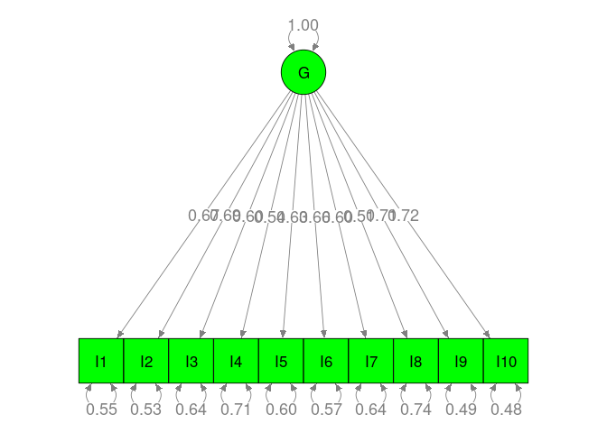
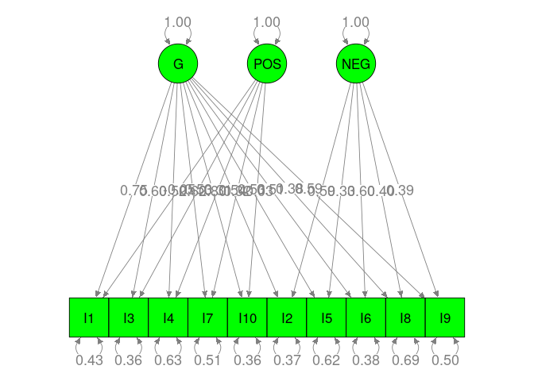

# Data preparation

```r
library(metaSEM)

## Use more cores to speed up the analysis
mxOption(NULL, 'Number of Threads', parallel::detectCores()-2)

## Create a new dataset without missing value in Individualism
index_na <- is.na(Gnambs18$Individualism)
Gnambs18 <- lapply(Gnambs18, function(x) x[!index_na])

## Select data with the correlation matrices, i.e., exclude studies with factor loadings
index <- Gnambs18$CorMat==1
Gnambs18 <- lapply(Gnambs18, function(x) x[index])

my.df <- Cor2DataFrame(Gnambs18$data, Gnambs18$n, acov = "weighted")

## Add the standardized individualism as the moderator
## Standardization of the moderator improves the convergence.
my.df$data <- data.frame(my.df$data,
                         Individualism=scale(Gnambs18$Individualism),
                         check.names=FALSE)
summary(my.df)
```

```
##           Length Class      Mode     
## data      1081   data.frame list     
## n           34   -none-     numeric  
## obslabels   10   -none-     character
## ylabels     45   -none-     character
## vlabels   1035   -none-     character
```

# TSSEM
## One general factor model


```r
rand1 <- tssem1(Gnambs18$data, Gnambs18$n, method="REM", RE.type="Diag")
summary(rand1)
```

```
## 
## Call:
## meta(y = ES, v = acovR, RE.constraints = Diag(paste0(RE.startvalues, 
##     "*Tau2_", 1:no.es, "_", 1:no.es)), RE.lbound = RE.lbound, 
##     I2 = I2, model.name = model.name, suppressWarnings = TRUE, 
##     silent = silent, run = run)
## 
## 95% confidence intervals: z statistic approximation (robust=FALSE)
## Coefficients:
##               Estimate  Std.Error     lbound     ubound z value  Pr(>|z|)    
## Intercept1  0.40544179 0.01700783 0.37210707 0.43877652 23.8385 < 2.2e-16 ***
## Intercept2  0.42482238 0.01416909 0.39705147 0.45259329 29.9823 < 2.2e-16 ***
## Intercept3  0.38473798 0.01462406 0.35607535 0.41340061 26.3086 < 2.2e-16 ***
## Intercept4  0.36586102 0.01938281 0.32787141 0.40385062 18.8755 < 2.2e-16 ***
## Intercept5  0.39648137 0.01211334 0.37273966 0.42022308 32.7310 < 2.2e-16 ***
## Intercept6  0.43750362 0.01803678 0.40215217 0.47285506 24.2562 < 2.2e-16 ***
## Intercept7  0.30700326 0.02738444 0.25333073 0.36067578 11.2109 < 2.2e-16 ***
## Intercept8  0.43551543 0.01545552 0.40522316 0.46580769 28.1786 < 2.2e-16 ***
## Intercept9  0.61867659 0.01939002 0.58067285 0.65668033 31.9070 < 2.2e-16 ***
## Intercept10 0.31114865 0.01386336 0.28397696 0.33832034 22.4440 < 2.2e-16 ***
## Intercept11 0.28198881 0.01296464 0.25657858 0.30739904 21.7506 < 2.2e-16 ***
## Intercept12 0.46342319 0.01288579 0.43816749 0.48867888 35.9639 < 2.2e-16 ***
## Intercept13 0.65004576 0.01638483 0.61793208 0.68215943 39.6736 < 2.2e-16 ***
## Intercept14 0.33698854 0.01641129 0.30482300 0.36915407 20.5339 < 2.2e-16 ***
## Intercept15 0.42779247 0.02233860 0.38400962 0.47157531 19.1504 < 2.2e-16 ***
## Intercept16 0.53672463 0.01316727 0.51091726 0.56253199 40.7620 < 2.2e-16 ***
## Intercept17 0.43644039 0.01462226 0.40778129 0.46509950 29.8477 < 2.2e-16 ***
## Intercept18 0.47471533 0.01161681 0.45194680 0.49748386 40.8645 < 2.2e-16 ***
## Intercept19 0.34696628 0.01620654 0.31520205 0.37873050 21.4090 < 2.2e-16 ***
## Intercept20 0.29135288 0.01193914 0.26795260 0.31475316 24.4032 < 2.2e-16 ***
## Intercept21 0.53844805 0.02326924 0.49284118 0.58405491 23.1399 < 2.2e-16 ***
## Intercept22 0.20429916 0.02068920 0.16374908 0.24484924  9.8747 < 2.2e-16 ***
## Intercept23 0.35037805 0.01326011 0.32438872 0.37636738 26.4235 < 2.2e-16 ***
## Intercept24 0.46524728 0.01297893 0.43980905 0.49068551 35.8464 < 2.2e-16 ***
## Intercept25 0.28945008 0.01417709 0.26166348 0.31723667 20.4167 < 2.2e-16 ***
## Intercept26 0.26915913 0.01228387 0.24508318 0.29323507 21.9116 < 2.2e-16 ***
## Intercept27 0.41788766 0.01903199 0.38058564 0.45518968 21.9571 < 2.2e-16 ***
## Intercept28 0.18007057 0.02179466 0.13735382 0.22278733  8.2621 2.220e-16 ***
## Intercept29 0.30410880 0.01453295 0.27562474 0.33259285 20.9255 < 2.2e-16 ***
## Intercept30 0.40236978 0.01198740 0.37887490 0.42586466 33.5661 < 2.2e-16 ***
## Intercept31 0.45712813 0.01165836 0.43427817 0.47997809 39.2103 < 2.2e-16 ***
## Intercept32 0.33996009 0.01689901 0.30683865 0.37308153 20.1172 < 2.2e-16 ***
## Intercept33 0.35205739 0.01719240 0.31836090 0.38575387 20.4775 < 2.2e-16 ***
## Intercept34 0.48878689 0.01976499 0.45004823 0.52752555 24.7299 < 2.2e-16 ***
## Intercept35 0.38684149 0.01617006 0.35514874 0.41853423 23.9233 < 2.2e-16 ***
## Intercept36 0.31923387 0.01294736 0.29385751 0.34461023 24.6563 < 2.2e-16 ***
## Intercept37 0.41903546 0.02305652 0.37384550 0.46422541 18.1743 < 2.2e-16 ***
## Intercept38 0.53204166 0.01110236 0.51028144 0.55380188 47.9215 < 2.2e-16 ***
## Intercept39 0.41762019 0.01165544 0.39477595 0.44046443 35.8305 < 2.2e-16 ***
## Intercept40 0.23010812 0.02292401 0.18517789 0.27503835 10.0379 < 2.2e-16 ***
## Intercept41 0.37995558 0.01560363 0.34937303 0.41053812 24.3505 < 2.2e-16 ***
## Intercept42 0.48256637 0.01496397 0.45323752 0.51189522 32.2485 < 2.2e-16 ***
## Intercept43 0.40299554 0.02280679 0.35829505 0.44769604 17.6700 < 2.2e-16 ***
## Intercept44 0.33626692 0.03025833 0.27696168 0.39557217 11.1132 < 2.2e-16 ***
## Intercept45 0.47867034 0.01509771 0.44907937 0.50826130 31.7048 < 2.2e-16 ***
## Tau2_1_1    0.00899275 0.00234102 0.00440442 0.01358107  3.8414 0.0001223 ***
## Tau2_2_2    0.00597154 0.00156996 0.00289447 0.00904860  3.8036 0.0001426 ***
## Tau2_3_3    0.00634622 0.00167529 0.00306272 0.00962973  3.7881 0.0001518 ***
## Tau2_4_4    0.01183525 0.00305290 0.00585167 0.01781882  3.8767 0.0001059 ***
## Tau2_5_5    0.00418809 0.00115881 0.00191686 0.00645932  3.6141 0.0003014 ***
## Tau2_6_6    0.01017306 0.00259149 0.00509384 0.01525228  3.9256 8.653e-05 ***
## Tau2_7_7    0.02437039 0.00609227 0.01242976 0.03631102  4.0002 6.329e-05 ***
## Tau2_8_8    0.00731148 0.00190011 0.00358734 0.01103562  3.8479 0.0001191 ***
## Tau2_9_9    0.01223912 0.00308717 0.00618839 0.01828985  3.9645 7.354e-05 ***
## Tau2_10_10  0.00560386 0.00148247 0.00269827 0.00850945  3.7801 0.0001568 ***
## Tau2_11_11  0.00475007 0.00127099 0.00225898 0.00724117  3.7373 0.0001860 ***
## Tau2_12_12  0.00485451 0.00131439 0.00227836 0.00743067  3.6934 0.0002213 ***
## Tau2_13_13  0.00865199 0.00223543 0.00427063 0.01303336  3.8704 0.0001087 ***
## Tau2_14_14  0.00822609 0.00209879 0.00411254 0.01233965  3.9194 8.875e-05 ***
## Tau2_15_15  0.01599812 0.00407859 0.00800423 0.02399201  3.9225 8.765e-05 ***
## Tau2_16_16  0.00524268 0.00143224 0.00243554 0.00804983  3.6605 0.0002518 ***
## Tau2_17_17  0.00649380 0.00166445 0.00323154 0.00975606  3.9015 9.561e-05 ***
## Tau2_18_18  0.00382431 0.00104892 0.00176847 0.00588014  3.6460 0.0002664 ***
## Tau2_19_19  0.00796954 0.00208559 0.00388186 0.01205721  3.8212 0.0001328 ***
## Tau2_20_20  0.00393901 0.00109858 0.00178583 0.00609220  3.5855 0.0003364 ***
## Tau2_21_21  0.01764414 0.00444091 0.00894012 0.02634817  3.9731 7.095e-05 ***
## Tau2_22_22  0.01334203 0.00346418 0.00655236 0.02013170  3.8514 0.0001174 ***
## Tau2_23_23  0.00505748 0.00133783 0.00243538 0.00767959  3.7804 0.0001566 ***
## Tau2_24_24  0.00495241 0.00135887 0.00228907 0.00761575  3.6445 0.0002679 ***
## Tau2_25_25  0.00582711 0.00158029 0.00272981 0.00892441  3.6874 0.0002266 ***
## Tau2_26_26  0.00417677 0.00113891 0.00194455 0.00640898  3.6674 0.0002451 ***
## Tau2_27_27  0.01137489 0.00296822 0.00555729 0.01719248  3.8322 0.0001270 ***
## Tau2_28_28  0.01489680 0.00383474 0.00738084 0.02241276  3.8847 0.0001025 ***
## Tau2_29_29  0.00620263 0.00166282 0.00294356 0.00946170  3.7302 0.0001913 ***
## Tau2_30_30  0.00404354 0.00110879 0.00187035 0.00621672  3.6468 0.0002655 ***
## Tau2_31_31  0.00387674 0.00110635 0.00170833 0.00604514  3.5041 0.0004582 ***
## Tau2_32_32  0.00873850 0.00226109 0.00430684 0.01317016  3.8647 0.0001112 ***
## Tau2_33_33  0.00901051 0.00238157 0.00434272 0.01367830  3.7834 0.0001547 ***
## Tau2_34_34  0.01249887 0.00318583 0.00625476 0.01874298  3.9233 8.735e-05 ***
## Tau2_35_35  0.00800357 0.00208916 0.00390889 0.01209826  3.8310 0.0001276 ***
## Tau2_36_36  0.00479082 0.00126297 0.00231545 0.00726620  3.7933 0.0001487 ***
## Tau2_37_37  0.01708871 0.00438842 0.00848758 0.02568985  3.8941 9.858e-05 ***
## Tau2_38_38  0.00356705 0.00099374 0.00161935 0.00551475  3.5895 0.0003313 ***
## Tau2_39_39  0.00386896 0.00103495 0.00184049 0.00589743  3.7383 0.0001853 ***
## Tau2_40_40  0.01666889 0.00422702 0.00838409 0.02495369  3.9434 8.033e-05 ***
## Tau2_41_41  0.00737683 0.00187635 0.00369924 0.01105442  3.9315 8.443e-05 ***
## Tau2_42_42  0.00684172 0.00174958 0.00341261 0.01027082  3.9105 9.211e-05 ***
## Tau2_43_43  0.01670197 0.00424165 0.00838848 0.02501546  3.9376 8.230e-05 ***
## Tau2_44_44  0.03006389 0.00750574 0.01535290 0.04477488  4.0055 6.190e-05 ***
## Tau2_45_45  0.00701338 0.00182031 0.00344563 0.01058113  3.8528 0.0001168 ***
## ---
## Signif. codes:  0 '***' 0.001 '**' 0.01 '*' 0.05 '.' 0.1 ' ' 1
## 
## Q statistic on the homogeneity of effect sizes: 30325.01
## Degrees of freedom of the Q statistic: 1485
## P value of the Q statistic: 0
## 
## Heterogeneity indices (based on the estimated Tau2):
##                               Estimate
## Intercept1: I2 (Q statistic)    0.9748
## Intercept2: I2 (Q statistic)    0.9616
## Intercept3: I2 (Q statistic)    0.9606
## Intercept4: I2 (Q statistic)    0.9795
## Intercept5: I2 (Q statistic)    0.9463
## Intercept6: I2 (Q statistic)    0.9777
## Intercept7: I2 (Q statistic)    0.9887
## Intercept8: I2 (Q statistic)    0.9707
## Intercept9: I2 (Q statistic)    0.9893
## Intercept10: I2 (Q statistic)   0.9524
## Intercept11: I2 (Q statistic)   0.9417
## Intercept12: I2 (Q statistic)   0.9571
## Intercept13: I2 (Q statistic)   0.9867
## Intercept14: I2 (Q statistic)   0.9688
## Intercept15: I2 (Q statistic)   0.9853
## Intercept16: I2 (Q statistic)   0.9674
## Intercept17: I2 (Q statistic)   0.9672
## Intercept18: I2 (Q statistic)   0.9471
## Intercept19: I2 (Q statistic)   0.9679
## Intercept20: I2 (Q statistic)   0.9320
## Intercept21: I2 (Q statistic)   0.9896
## Intercept22: I2 (Q statistic)   0.9767
## Intercept23: I2 (Q statistic)   0.9493
## Intercept24: I2 (Q statistic)   0.9576
## Intercept25: I2 (Q statistic)   0.9529
## Intercept26: I2 (Q statistic)   0.9339
## Intercept27: I2 (Q statistic)   0.9792
## Intercept28: I2 (Q statistic)   0.9787
## Intercept29: I2 (Q statistic)   0.9558
## Intercept30: I2 (Q statistic)   0.9417
## Intercept31: I2 (Q statistic)   0.9476
## Intercept32: I2 (Q statistic)   0.9708
## Intercept33: I2 (Q statistic)   0.9710
## Intercept34: I2 (Q statistic)   0.9842
## Intercept35: I2 (Q statistic)   0.9705
## Intercept36: I2 (Q statistic)   0.9459
## Intercept37: I2 (Q statistic)   0.9859
## Intercept38: I2 (Q statistic)   0.9527
## Intercept39: I2 (Q statistic)   0.9446
## Intercept40: I2 (Q statistic)   0.9820
## Intercept41: I2 (Q statistic)   0.9669
## Intercept42: I2 (Q statistic)   0.9706
## Intercept43: I2 (Q statistic)   0.9857
## Intercept44: I2 (Q statistic)   0.9914
## Intercept45: I2 (Q statistic)   0.9720
## 
## Number of studies (or clusters): 34
## Number of observed statistics: 1530
## Number of estimated parameters: 90
## Degrees of freedom: 1440
## -2 log likelihood: -2647.318 
## OpenMx status1: 0 ("0" or "1": The optimization is considered fine.
## Other values may indicate problems.)
```

```r
## One general factor
model1 <- "G =~ g1*I1 + g2*I2 + g3*I3 + g4*I4 + g5*I5 +
                g6*I6 + g7*I7 + g8*I8 + g9*I9 + g10*I10"

RAM1 <- lavaan2RAM(model1, obs.variables = paste0("I", 1:10))
RAM1
```

```
## $A
##     I1  I2  I3  I4  I5  I6  I7  I8  I9  I10 G      
## I1  "0" "0" "0" "0" "0" "0" "0" "0" "0" "0" "0*g1" 
## I2  "0" "0" "0" "0" "0" "0" "0" "0" "0" "0" "0*g2" 
## I3  "0" "0" "0" "0" "0" "0" "0" "0" "0" "0" "0*g3" 
## I4  "0" "0" "0" "0" "0" "0" "0" "0" "0" "0" "0*g4" 
## I5  "0" "0" "0" "0" "0" "0" "0" "0" "0" "0" "0*g5" 
## I6  "0" "0" "0" "0" "0" "0" "0" "0" "0" "0" "0*g6" 
## I7  "0" "0" "0" "0" "0" "0" "0" "0" "0" "0" "0*g7" 
## I8  "0" "0" "0" "0" "0" "0" "0" "0" "0" "0" "0*g8" 
## I9  "0" "0" "0" "0" "0" "0" "0" "0" "0" "0" "0*g9" 
## I10 "0" "0" "0" "0" "0" "0" "0" "0" "0" "0" "0*g10"
## G   "0" "0" "0" "0" "0" "0" "0" "0" "0" "0" "0"    
## 
## $S
##     I1           I2           I3           I4           I5           I6           I7          
## I1  "0*I1WITHI1" "0"          "0"          "0"          "0"          "0"          "0"         
## I2  "0"          "0*I2WITHI2" "0"          "0"          "0"          "0"          "0"         
## I3  "0"          "0"          "0*I3WITHI3" "0"          "0"          "0"          "0"         
## I4  "0"          "0"          "0"          "0*I4WITHI4" "0"          "0"          "0"         
## I5  "0"          "0"          "0"          "0"          "0*I5WITHI5" "0"          "0"         
## I6  "0"          "0"          "0"          "0"          "0"          "0*I6WITHI6" "0"         
## I7  "0"          "0"          "0"          "0"          "0"          "0"          "0*I7WITHI7"
## I8  "0"          "0"          "0"          "0"          "0"          "0"          "0"         
## I9  "0"          "0"          "0"          "0"          "0"          "0"          "0"         
## I10 "0"          "0"          "0"          "0"          "0"          "0"          "0"         
## G   "0"          "0"          "0"          "0"          "0"          "0"          "0"         
##     I8           I9           I10            G  
## I1  "0"          "0"          "0"            "0"
## I2  "0"          "0"          "0"            "0"
## I3  "0"          "0"          "0"            "0"
## I4  "0"          "0"          "0"            "0"
## I5  "0"          "0"          "0"            "0"
## I6  "0"          "0"          "0"            "0"
## I7  "0"          "0"          "0"            "0"
## I8  "0*I8WITHI8" "0"          "0"            "0"
## I9  "0"          "0*I9WITHI9" "0"            "0"
## I10 "0"          "0"          "0*I10WITHI10" "0"
## G   "0"          "0"          "0"            "1"
## 
## $F
##     I1 I2 I3 I4 I5 I6 I7 I8 I9 I10 G
## I1   1  0  0  0  0  0  0  0  0   0 0
## I2   0  1  0  0  0  0  0  0  0   0 0
## I3   0  0  1  0  0  0  0  0  0   0 0
## I4   0  0  0  1  0  0  0  0  0   0 0
## I5   0  0  0  0  1  0  0  0  0   0 0
## I6   0  0  0  0  0  1  0  0  0   0 0
## I7   0  0  0  0  0  0  1  0  0   0 0
## I8   0  0  0  0  0  0  0  1  0   0 0
## I9   0  0  0  0  0  0  0  0  1   0 0
## I10  0  0  0  0  0  0  0  0  0   1 0
## 
## $M
##   I1 I2 I3 I4 I5 I6 I7 I8 I9 I10 G
## 1  0  0  0  0  0  0  0  0  0   0 0
```

```r
rand2a <- tssem2(rand1, Amatrix = RAM1$A, Smatrix = RAM1$S, Fmatrix = RAM1$F)
summary(rand2a)
```

```
## 
## Call:
## wls(Cov = pooledS, aCov = aCov, n = tssem1.obj$total.n, RAM = RAM, 
##     Amatrix = Amatrix, Smatrix = Smatrix, Fmatrix = Fmatrix, 
##     diag.constraints = diag.constraints, cor.analysis = cor.analysis, 
##     intervals.type = intervals.type, mx.algebras = mx.algebras, 
##     model.name = model.name, suppressWarnings = suppressWarnings, 
##     silent = silent, run = run)
## 
## 95% confidence intervals: z statistic approximation
## Coefficients:
##      Estimate Std.Error    lbound    ubound z value  Pr(>|z|)    
## g1  0.6718555 0.0092051 0.6538139 0.6898970  72.988 < 2.2e-16 ***
## g10 0.7190271 0.0084648 0.7024363 0.7356179  84.943 < 2.2e-16 ***
## g2  0.6875433 0.0085786 0.6707295 0.7043571  80.146 < 2.2e-16 ***
## g3  0.5970926 0.0082731 0.5808776 0.6133076  72.173 < 2.2e-16 ***
## g4  0.5367417 0.0081165 0.5208337 0.5526498  66.130 < 2.2e-16 ***
## g5  0.6322058 0.0088255 0.6149081 0.6495034  71.634 < 2.2e-16 ***
## g6  0.6562633 0.0075211 0.6415223 0.6710043  87.257 < 2.2e-16 ***
## g7  0.5964124 0.0094533 0.5778843 0.6149405  63.091 < 2.2e-16 ***
## g8  0.5099200 0.0124637 0.4854916 0.5343483  40.912 < 2.2e-16 ***
## g9  0.7131060 0.0084101 0.6966224 0.7295896  84.791 < 2.2e-16 ***
## ---
## Signif. codes:  0 '***' 0.001 '**' 0.01 '*' 0.05 '.' 0.1 ' ' 1
## 
## Goodness-of-fit indices:
##                                                 Value
## Sample size                                1.0468e+05
## Chi-square of target model                 1.0342e+03
## DF of target model                         3.5000e+01
## p value of target model                    0.0000e+00
## Number of constraints imposed on "Smatrix" 0.0000e+00
## DF manually adjusted                       0.0000e+00
## Chi-square of independence model           2.0602e+04
## DF of independence model                   4.5000e+01
## RMSEA                                      1.6500e-02
## RMSEA lower 95% CI                         1.5700e-02
## RMSEA upper 95% CI                         1.7400e-02
## SRMR                                       7.7500e-02
## TLI                                        9.3750e-01
## CFI                                        9.5140e-01
## AIC                                        9.6425e+02
## BIC                                        6.2969e+02
## OpenMx status1: 0 ("0" or "1": The optimization is considered fine.
## Other values indicate problems.)
```

```r
plot(rand2a, col="green")
```

<!-- -->

## Bifactor model with positive and negative Self-Esteem

```r
model2 <- "G =~ g1*I1 + g2*I2 + g3*I3 + g4*I4 + g5*I5 + 
                g6*I6 + g7*I7 + g8*I8 + g9*I9 + g10*I10
           POS =~ p1*I1 + p3*I3 + p4*I4 + p7*I7 + p10*I10
           NEG =~ n2*I2 + n5*I5 + n6*I6 + n8*I8 + n9*I9"

RAM2 <- lavaan2RAM(model2, obs.variables = paste0("I", 1:10))
RAM2
```

```
## $A
##     I1  I2  I3  I4  I5  I6  I7  I8  I9  I10 G       POS     NEG   
## I1  "0" "0" "0" "0" "0" "0" "0" "0" "0" "0" "0*g1"  "0*p1"  "0"   
## I2  "0" "0" "0" "0" "0" "0" "0" "0" "0" "0" "0*g2"  "0"     "0*n2"
## I3  "0" "0" "0" "0" "0" "0" "0" "0" "0" "0" "0*g3"  "0*p3"  "0"   
## I4  "0" "0" "0" "0" "0" "0" "0" "0" "0" "0" "0*g4"  "0*p4"  "0"   
## I5  "0" "0" "0" "0" "0" "0" "0" "0" "0" "0" "0*g5"  "0"     "0*n5"
## I6  "0" "0" "0" "0" "0" "0" "0" "0" "0" "0" "0*g6"  "0"     "0*n6"
## I7  "0" "0" "0" "0" "0" "0" "0" "0" "0" "0" "0*g7"  "0*p7"  "0"   
## I8  "0" "0" "0" "0" "0" "0" "0" "0" "0" "0" "0*g8"  "0"     "0*n8"
## I9  "0" "0" "0" "0" "0" "0" "0" "0" "0" "0" "0*g9"  "0"     "0*n9"
## I10 "0" "0" "0" "0" "0" "0" "0" "0" "0" "0" "0*g10" "0*p10" "0"   
## G   "0" "0" "0" "0" "0" "0" "0" "0" "0" "0" "0"     "0"     "0"   
## POS "0" "0" "0" "0" "0" "0" "0" "0" "0" "0" "0"     "0"     "0"   
## NEG "0" "0" "0" "0" "0" "0" "0" "0" "0" "0" "0"     "0"     "0"   
## 
## $S
##     I1           I2           I3           I4           I5           I6           I7          
## I1  "0*I1WITHI1" "0"          "0"          "0"          "0"          "0"          "0"         
## I2  "0"          "0*I2WITHI2" "0"          "0"          "0"          "0"          "0"         
## I3  "0"          "0"          "0*I3WITHI3" "0"          "0"          "0"          "0"         
## I4  "0"          "0"          "0"          "0*I4WITHI4" "0"          "0"          "0"         
## I5  "0"          "0"          "0"          "0"          "0*I5WITHI5" "0"          "0"         
## I6  "0"          "0"          "0"          "0"          "0"          "0*I6WITHI6" "0"         
## I7  "0"          "0"          "0"          "0"          "0"          "0"          "0*I7WITHI7"
## I8  "0"          "0"          "0"          "0"          "0"          "0"          "0"         
## I9  "0"          "0"          "0"          "0"          "0"          "0"          "0"         
## I10 "0"          "0"          "0"          "0"          "0"          "0"          "0"         
## G   "0"          "0"          "0"          "0"          "0"          "0"          "0"         
## POS "0"          "0"          "0"          "0"          "0"          "0"          "0"         
## NEG "0"          "0"          "0"          "0"          "0"          "0"          "0"         
##     I8           I9           I10            G   POS NEG
## I1  "0"          "0"          "0"            "0" "0" "0"
## I2  "0"          "0"          "0"            "0" "0" "0"
## I3  "0"          "0"          "0"            "0" "0" "0"
## I4  "0"          "0"          "0"            "0" "0" "0"
## I5  "0"          "0"          "0"            "0" "0" "0"
## I6  "0"          "0"          "0"            "0" "0" "0"
## I7  "0"          "0"          "0"            "0" "0" "0"
## I8  "0*I8WITHI8" "0"          "0"            "0" "0" "0"
## I9  "0"          "0*I9WITHI9" "0"            "0" "0" "0"
## I10 "0"          "0"          "0*I10WITHI10" "0" "0" "0"
## G   "0"          "0"          "0"            "1" "0" "0"
## POS "0"          "0"          "0"            "0" "1" "0"
## NEG "0"          "0"          "0"            "0" "0" "1"
## 
## $F
##     I1 I2 I3 I4 I5 I6 I7 I8 I9 I10 G POS NEG
## I1   1  0  0  0  0  0  0  0  0   0 0   0   0
## I2   0  1  0  0  0  0  0  0  0   0 0   0   0
## I3   0  0  1  0  0  0  0  0  0   0 0   0   0
## I4   0  0  0  1  0  0  0  0  0   0 0   0   0
## I5   0  0  0  0  1  0  0  0  0   0 0   0   0
## I6   0  0  0  0  0  1  0  0  0   0 0   0   0
## I7   0  0  0  0  0  0  1  0  0   0 0   0   0
## I8   0  0  0  0  0  0  0  1  0   0 0   0   0
## I9   0  0  0  0  0  0  0  0  1   0 0   0   0
## I10  0  0  0  0  0  0  0  0  0   1 0   0   0
## 
## $M
##   I1 I2 I3 I4 I5 I6 I7 I8 I9 I10 G POS NEG
## 1  0  0  0  0  0  0  0  0  0   0 0   0   0
```

```r
rand2b <- tssem2(rand1, Amatrix = RAM2$A, Smatrix = RAM2$S, Fmatrix = RAM2$F)
summary(rand2b)
```

```
## 
## Call:
## wls(Cov = pooledS, aCov = aCov, n = tssem1.obj$total.n, RAM = RAM, 
##     Amatrix = Amatrix, Smatrix = Smatrix, Fmatrix = Fmatrix, 
##     diag.constraints = diag.constraints, cor.analysis = cor.analysis, 
##     intervals.type = intervals.type, mx.algebras = mx.algebras, 
##     model.name = model.name, suppressWarnings = suppressWarnings, 
##     silent = silent, run = run)
## 
## 95% confidence intervals: z statistic approximation
## Coefficients:
##      Estimate Std.Error    lbound    ubound z value  Pr(>|z|)    
## g1   0.752662  0.014051  0.725122  0.780201 53.5662 < 2.2e-16 ***
## p1  -0.047643  0.042723 -0.131379  0.036093 -1.1152    0.2648    
## g10  0.801857  0.014489  0.773460  0.830254 55.3437 < 2.2e-16 ***
## p10 -0.034061  0.044048 -0.120394  0.052272 -0.7733    0.4394    
## g2   0.535600  0.013252  0.509627  0.561574 40.4161 < 2.2e-16 ***
## n2   0.587800  0.024187  0.540395  0.635205 24.3025 < 2.2e-16 ***
## g3   0.595888  0.017364  0.561856  0.629920 34.3182 < 2.2e-16 ***
## p3   0.531255  0.070413  0.393248  0.669262  7.5449 4.530e-14 ***
## g4   0.522440  0.012647  0.497653  0.547227 41.3105 < 2.2e-16 ***
## p4   0.306155  0.037994  0.231688  0.380622  8.0579 6.661e-16 ***
## g5   0.527210  0.014154  0.499468  0.554951 37.2477 < 2.2e-16 ***
## n5   0.326077  0.021632  0.283679  0.368476 15.0737 < 2.2e-16 ***
## g6   0.514347  0.011523  0.491763  0.536931 44.6382 < 2.2e-16 ***
## n6   0.597995  0.022935  0.553042  0.642947 26.0731 < 2.2e-16 ***
## g7   0.620787  0.013671  0.593993  0.647581 45.4100 < 2.2e-16 ***
## p7   0.317101  0.041470  0.235821  0.398381  7.6465 2.065e-14 ***
## g8   0.384993  0.018314  0.349098  0.420889 21.0216 < 2.2e-16 ***
## n8   0.399932  0.030376  0.340396  0.459468 13.1660 < 2.2e-16 ***
## g9   0.594680  0.013887  0.567463  0.621898 42.8237 < 2.2e-16 ***
## n9   0.386959  0.022302  0.343248  0.430671 17.3508 < 2.2e-16 ***
## ---
## Signif. codes:  0 '***' 0.001 '**' 0.01 '*' 0.05 '.' 0.1 ' ' 1
## 
## Goodness-of-fit indices:
##                                                  Value
## Sample size                                104684.0000
## Chi-square of target model                     37.6203
## DF of target model                             25.0000
## p value of target model                         0.0504
## Number of constraints imposed on "Smatrix"      0.0000
## DF manually adjusted                            0.0000
## Chi-square of independence model            20601.6841
## DF of independence model                       45.0000
## RMSEA                                           0.0022
## RMSEA lower 95% CI                              0.0000
## RMSEA upper 95% CI                              0.0036
## SRMR                                            0.0161
## TLI                                             0.9989
## CFI                                             0.9994
## AIC                                           -12.3797
## BIC                                          -251.3472
## OpenMx status1: 0 ("0" or "1": The optimization is considered fine.
## Other values indicate problems.)
```

```r
plot(rand2b, col="green")
```

<!-- -->

```r
## Compare the one general factor to the bifactor model
anova(rand2b, rand2a)
```

```
##                 base         comparison ep   minus2LL  df AIC  diffLL diffdf             p
## 1 TSSEM2 Correlation               <NA> 20   37.62031 -20  NA      NA     NA            NA
## 2 TSSEM2 Correlation TSSEM2 Correlation 10 1034.24636 -10  NA 996.626     10 9.969974e-208
```

## Models with two subgroup analysis

```r
# Data for studies with individualism below the mean
data_g1 <- Gnambs18$data[my.df$data$Individualism < 0 ]
n_g1 <- Gnambs18$n[my.df$data$Individualism < 0 ]

# Data for studies with individualism above or equal the mean
data_g2 <- Gnambs18$data[my.df$data$Individualism >= 0 ]
n_g2 <- Gnambs18$n[my.df$data$Individualism >= 0 ]
```

### Fitting a random-effects Stage 1 model in two subgroups

```r
## Stage 1 analysis per subgroup (random-effects analysis)
stage1_g1.fit <- tssem1(Cov = data_g1, n = n_g1, method = "REM", RE.type = "Diag")
stage1_g2.fit <- tssem1(Cov = data_g2, n = n_g2, method = "REM", RE.type = "Diag")

summary(stage1_g1.fit)
```

```
## 
## Call:
## meta(y = ES, v = acovR, RE.constraints = Diag(paste0(RE.startvalues, 
##     "*Tau2_", 1:no.es, "_", 1:no.es)), RE.lbound = RE.lbound, 
##     I2 = I2, model.name = model.name, suppressWarnings = TRUE, 
##     silent = silent, run = run)
## 
## 95% confidence intervals: z statistic approximation (robust=FALSE)
## Coefficients:
##               Estimate  Std.Error     lbound     ubound z value  Pr(>|z|)    
## Intercept1  0.33167645 0.02715344 0.27845669 0.38489621 12.2149 < 2.2e-16 ***
## Intercept2  0.40117713 0.01977378 0.36242123 0.43993303 20.2883 < 2.2e-16 ***
## Intercept3  0.38259199 0.01859892 0.34613877 0.41904520 20.5707 < 2.2e-16 ***
## Intercept4  0.31549477 0.03409853 0.24866287 0.38232667  9.2524 < 2.2e-16 ***
## Intercept5  0.32992902 0.01978136 0.29115826 0.36869978 16.6788 < 2.2e-16 ***
## Intercept6  0.41402863 0.02716914 0.36077811 0.46727916 15.2389 < 2.2e-16 ***
## Intercept7  0.20248289 0.04867370 0.10708419 0.29788159  4.1600 3.182e-05 ***
## Intercept8  0.38622590 0.02597731 0.33531131 0.43714048 14.8678 < 2.2e-16 ***
## Intercept9  0.55983919 0.02678704 0.50733756 0.61234082 20.8996 < 2.2e-16 ***
## Intercept10 0.27582868 0.02050972 0.23563036 0.31602700 13.4487 < 2.2e-16 ***
## Intercept11 0.26795169 0.01837378 0.23193975 0.30396363 14.5834 < 2.2e-16 ***
## Intercept12 0.45166960 0.02201485 0.40852129 0.49481791 20.5166 < 2.2e-16 ***
## Intercept13 0.61521104 0.02924600 0.55788992 0.67253215 21.0357 < 2.2e-16 ***
## Intercept14 0.28548119 0.02453148 0.23740038 0.33356200 11.6373 < 2.2e-16 ***
## Intercept15 0.35727026 0.04264728 0.27368313 0.44085739  8.3773 < 2.2e-16 ***
## Intercept16 0.49587758 0.02420569 0.44843529 0.54331987 20.4860 < 2.2e-16 ***
## Intercept17 0.38773415 0.02400273 0.34068965 0.43477864 16.1537 < 2.2e-16 ***
## Intercept18 0.45691579 0.01643026 0.42471306 0.48911851 27.8094 < 2.2e-16 ***
## Intercept19 0.31836855 0.02564623 0.26810286 0.36863423 12.4139 < 2.2e-16 ***
## Intercept20 0.25372193 0.02085421 0.21284842 0.29459543 12.1665 < 2.2e-16 ***
## Intercept21 0.51752883 0.03365549 0.45156529 0.58349237 15.3773 < 2.2e-16 ***
## Intercept22 0.13433105 0.03907136 0.05775260 0.21090950  3.4381 0.0005858 ***
## Intercept23 0.35092623 0.02103893 0.30969069 0.39216177 16.6799 < 2.2e-16 ***
## Intercept24 0.46380041 0.02090932 0.42281890 0.50478192 22.1815 < 2.2e-16 ***
## Intercept25 0.26522419 0.02410141 0.21798629 0.31246209 11.0045 < 2.2e-16 ***
## Intercept26 0.24760454 0.01770786 0.21289778 0.28231130 13.9827 < 2.2e-16 ***
## Intercept27 0.41562914 0.03266201 0.35161277 0.47964551 12.7252 < 2.2e-16 ***
## Intercept28 0.12945126 0.04324235 0.04469780 0.21420472  2.9936 0.0027569 ** 
## Intercept29 0.31701082 0.02237868 0.27314941 0.36087222 14.1658 < 2.2e-16 ***
## Intercept30 0.41581778 0.01407433 0.38823260 0.44340296 29.5444 < 2.2e-16 ***
## Intercept31 0.43546976 0.02011296 0.39604908 0.47489044 21.6512 < 2.2e-16 ***
## Intercept32 0.30333852 0.02913054 0.24624372 0.36043333 10.4131 < 2.2e-16 ***
## Intercept33 0.29160843 0.03325105 0.22643758 0.35677928  8.7699 < 2.2e-16 ***
## Intercept34 0.47252809 0.03919716 0.39570306 0.54935311 12.0552 < 2.2e-16 ***
## Intercept35 0.36672892 0.02867670 0.31052363 0.42293422 12.7884 < 2.2e-16 ***
## Intercept36 0.27445777 0.02144151 0.23243318 0.31648236 12.8003 < 2.2e-16 ***
## Intercept37 0.34424144 0.04385830 0.25828075 0.43020212  7.8489 4.219e-15 ***
## Intercept38 0.48485039 0.01917067 0.44727657 0.52242420 25.2913 < 2.2e-16 ***
## Intercept39 0.36024222 0.01925783 0.32249757 0.39798687 18.7063 < 2.2e-16 ***
## Intercept40 0.13863084 0.03705728 0.06599991 0.21126177  3.7410 0.0001833 ***
## Intercept41 0.36298014 0.02500677 0.31396778 0.41199251 14.5153 < 2.2e-16 ***
## Intercept42 0.46488849 0.02397548 0.41789742 0.51187956 19.3902 < 2.2e-16 ***
## Intercept43 0.30610540 0.03950085 0.22868516 0.38352564  7.7493 9.326e-15 ***
## Intercept44 0.21569689 0.05177796 0.11421395 0.31717983  4.1658 3.103e-05 ***
## Intercept45 0.44021996 0.02709354 0.38711760 0.49332233 16.2482 < 2.2e-16 ***
## Tau2_1_1    0.01071158 0.00402008 0.00283236 0.01859079  2.6645 0.0077099 ** 
## Tau2_2_2    0.00524193 0.00210858 0.00110918 0.00937468  2.4860 0.0129190 *  
## Tau2_3_3    0.00447388 0.00192029 0.00071017 0.00823758  2.3298 0.0198173 *  
## Tau2_4_4    0.01744246 0.00653055 0.00464280 0.03024211  2.6709 0.0075648 ** 
## Tau2_5_5    0.00516820 0.00203716 0.00117545 0.00916095  2.5370 0.0111817 *  
## Tau2_6_6    0.01078920 0.00404604 0.00285910 0.01871930  2.6666 0.0076622 ** 
## Tau2_7_7    0.03634325 0.01316430 0.01054169 0.06214481  2.7607 0.0057670 ** 
## Tau2_8_8    0.00977157 0.00372098 0.00247859 0.01706454  2.6261 0.0086375 ** 
## Tau2_9_9    0.01083368 0.00403796 0.00291942 0.01874794  2.6830 0.0072974 ** 
## Tau2_10_10  0.00558502 0.00216827 0.00133529 0.00983476  2.5758 0.0100010 *  
## Tau2_11_11  0.00422687 0.00171916 0.00085738 0.00759636  2.4587 0.0139447 *  
## Tau2_12_12  0.00679001 0.00262811 0.00163900 0.01194102  2.5836 0.0097774 ** 
## Tau2_13_13  0.01315424 0.00485510 0.00363841 0.02267006  2.7094 0.0067412 ** 
## Tau2_14_14  0.00850210 0.00314482 0.00233837 0.01466583  2.7035 0.0068608 ** 
## Tau2_15_15  0.02773215 0.01021935 0.00770260 0.04776171  2.7137 0.0066538 ** 
## Tau2_16_16  0.00850968 0.00333744 0.00196841 0.01505094  2.5498 0.0107797 *  
## Tau2_17_17  0.00821668 0.00305322 0.00223247 0.01420089  2.6911 0.0071207 ** 
## Tau2_18_18  0.00338438 0.00145457 0.00053348 0.00623527  2.3267 0.0199797 *  
## Tau2_19_19  0.00932977 0.00352322 0.00242439 0.01623516  2.6481 0.0080950 ** 
## Tau2_20_20  0.00575024 0.00228889 0.00126409 0.01023639  2.5122 0.0119969 *  
## Tau2_21_21  0.01736795 0.00642854 0.00476824 0.02996766  2.7017 0.0068987 ** 
## Tau2_22_22  0.02277670 0.00850890 0.00609955 0.03945384  2.6768 0.0074327 ** 
## Tau2_23_23  0.00593483 0.00227129 0.00148319 0.01038648  2.6130 0.0089757 ** 
## Tau2_24_24  0.00606884 0.00247646 0.00121507 0.01092261  2.4506 0.0142614 *  
## Tau2_25_25  0.00799395 0.00316938 0.00178208 0.01420582  2.5222 0.0116609 *  
## Tau2_26_26  0.00382343 0.00157931 0.00072804 0.00691881  2.4209 0.0154801 *  
## Tau2_27_27  0.01601124 0.00602980 0.00419305 0.02782944  2.6554 0.0079226 ** 
## Tau2_28_28  0.02823350 0.01040544 0.00783922 0.04862778  2.7133 0.0066609 ** 
## Tau2_29_29  0.00681374 0.00266924 0.00158212 0.01204535  2.5527 0.0106896 *  
## Tau2_30_30  0.00222410 0.00103965 0.00018643 0.00426177  2.1393 0.0324125 *  
## Tau2_31_31  0.00547452 0.00222234 0.00111882 0.00983022  2.4634 0.0137623 *  
## Tau2_32_32  0.01236891 0.00466238 0.00323080 0.02150701  2.6529 0.0079800 ** 
## Tau2_33_33  0.01623403 0.00615832 0.00416395 0.02830411  2.6361 0.0083861 ** 
## Tau2_34_34  0.02364829 0.00863936 0.00671546 0.04058112  2.7373 0.0061951 ** 
## Tau2_35_35  0.01204428 0.00456963 0.00308796 0.02100060  2.6357 0.0083959 ** 
## Tau2_36_36  0.00617149 0.00234378 0.00157776 0.01076521  2.6331 0.0084601 ** 
## Tau2_37_37  0.02938011 0.01085065 0.00811322 0.05064701  2.7077 0.0067755 ** 
## Tau2_38_38  0.00499659 0.00206102 0.00095706 0.00903612  2.4243 0.0153369 *  
## Tau2_39_39  0.00489563 0.00187798 0.00121486 0.00857640  2.6069 0.0091376 ** 
## Tau2_40_40  0.02038538 0.00752318 0.00564022 0.03513053  2.7097 0.0067349 ** 
## Tau2_41_41  0.00890507 0.00329831 0.00244051 0.01536963  2.6999 0.0069362 ** 
## Tau2_42_42  0.00829869 0.00308988 0.00224263 0.01435475  2.6858 0.0072365 ** 
## Tau2_43_43  0.02352167 0.00867547 0.00651805 0.04052528  2.7113 0.0067023 ** 
## Tau2_44_44  0.04137019 0.01500032 0.01197010 0.07077029  2.7580 0.0058164 ** 
## Tau2_45_45  0.01075401 0.00404530 0.00282536 0.01868267  2.6584 0.0078514 ** 
## ---
## Signif. codes:  0 '***' 0.001 '**' 0.01 '*' 0.05 '.' 0.1 ' ' 1
## 
## Q statistic on the homogeneity of effect sizes: 14909.47
## Degrees of freedom of the Q statistic: 675
## P value of the Q statistic: 0
## 
## Heterogeneity indices (based on the estimated Tau2):
##                               Estimate
## Intercept1: I2 (Q statistic)    0.9657
## Intercept2: I2 (Q statistic)    0.9347
## Intercept3: I2 (Q statistic)    0.9185
## Intercept4: I2 (Q statistic)    0.9784
## Intercept5: I2 (Q statistic)    0.9279
## Intercept6: I2 (Q statistic)    0.9689
## Intercept7: I2 (Q statistic)    0.9866
## Intercept8: I2 (Q statistic)    0.9654
## Intercept9: I2 (Q statistic)    0.9811
## Intercept10: I2 (Q statistic)   0.9282
## Intercept11: I2 (Q statistic)   0.9023
## Intercept12: I2 (Q statistic)   0.9534
## Intercept13: I2 (Q statistic)   0.9874
## Intercept14: I2 (Q statistic)   0.9541
## Intercept15: I2 (Q statistic)   0.9847
## Intercept16: I2 (Q statistic)   0.9666
## Intercept17: I2 (Q statistic)   0.9582
## Intercept18: I2 (Q statistic)   0.9082
## Intercept19: I2 (Q statistic)   0.9571
## Intercept20: I2 (Q statistic)   0.9262
## Intercept21: I2 (Q statistic)   0.9864
## Intercept22: I2 (Q statistic)   0.9769
## Intercept23: I2 (Q statistic)   0.9344
## Intercept24: I2 (Q statistic)   0.9486
## Intercept25: I2 (Q statistic)   0.9450
## Intercept26: I2 (Q statistic)   0.8907
## Intercept27: I2 (Q statistic)   0.9783
## Intercept28: I2 (Q statistic)   0.9810
## Intercept29: I2 (Q statistic)   0.9394
## Intercept30: I2 (Q statistic)   0.8545
## Intercept31: I2 (Q statistic)   0.9399
## Intercept32: I2 (Q statistic)   0.9676
## Intercept33: I2 (Q statistic)   0.9720
## Intercept34: I2 (Q statistic)   0.9875
## Intercept35: I2 (Q statistic)   0.9695
## Intercept36: I2 (Q statistic)   0.9333
## Intercept37: I2 (Q statistic)   0.9854
## Intercept38: I2 (Q statistic)   0.9411
## Intercept39: I2 (Q statistic)   0.9264
## Intercept40: I2 (Q statistic)   0.9753
## Intercept41: I2 (Q statistic)   0.9583
## Intercept42: I2 (Q statistic)   0.9642
## Intercept43: I2 (Q statistic)   0.9808
## Intercept44: I2 (Q statistic)   0.9884
## Intercept45: I2 (Q statistic)   0.9693
## 
## Number of studies (or clusters): 16
## Number of observed statistics: 720
## Number of estimated parameters: 90
## Degrees of freedom: 630
## -2 log likelihood: -1115.201 
## OpenMx status1: 0 ("0" or "1": The optimization is considered fine.
## Other values may indicate problems.)
```

```r
summary(stage1_g2.fit)
```

```
## 
## Call:
## meta(y = ES, v = acovR, RE.constraints = Diag(paste0(RE.startvalues, 
##     "*Tau2_", 1:no.es, "_", 1:no.es)), RE.lbound = RE.lbound, 
##     I2 = I2, model.name = model.name, suppressWarnings = TRUE, 
##     silent = silent, run = run)
## 
## 95% confidence intervals: z statistic approximation (robust=FALSE)
## Coefficients:
##               Estimate  Std.Error     lbound     ubound z value  Pr(>|z|)    
## Intercept1  0.45258783 0.01574398 0.42173020 0.48344546 28.7467 < 2.2e-16 ***
## Intercept2  0.43683890 0.01924314 0.39912304 0.47455476 22.7010 < 2.2e-16 ***
## Intercept3  0.38096322 0.02095405 0.33989403 0.42203241 18.1809 < 2.2e-16 ***
## Intercept4  0.39632525 0.01974128 0.35763305 0.43501744 20.0760 < 2.2e-16 ***
## Intercept5  0.43659103 0.00917251 0.41861325 0.45456881 47.5978 < 2.2e-16 ***
## Intercept6  0.44828078 0.02312196 0.40296257 0.49359898 19.3877 < 2.2e-16 ***
## Intercept7  0.38103616 0.01694155 0.34783134 0.41424098 22.4912 < 2.2e-16 ***
## Intercept8  0.46421400 0.01571473 0.43341370 0.49501430 29.5401 < 2.2e-16 ***
## Intercept9  0.66187402 0.02395552 0.61492206 0.70882597 27.6293 < 2.2e-16 ***
## Intercept10 0.32824458 0.01727600 0.29438423 0.36210492 19.0000 < 2.2e-16 ***
## Intercept11 0.28549177 0.01727209 0.25163910 0.31934444 16.5291 < 2.2e-16 ***
## Intercept12 0.46107040 0.01340507 0.43479695 0.48734385 34.3952 < 2.2e-16 ***
## Intercept13 0.66906959 0.01607764 0.63755799 0.70058119 41.6149 < 2.2e-16 ***
## Intercept14 0.36845385 0.01940637 0.33041806 0.40648963 18.9862 < 2.2e-16 ***
## Intercept15 0.47021500 0.01292390 0.44488462 0.49554538 36.3834 < 2.2e-16 ***
## Intercept16 0.55896562 0.01058210 0.53822508 0.57970616 52.8218 < 2.2e-16 ***
## Intercept17 0.46372087 0.01408468 0.43611540 0.49132634 32.9238 < 2.2e-16 ***
## Intercept18 0.48639644 0.01576832 0.45549111 0.51730177 30.8464 < 2.2e-16 ***
## Intercept19 0.36191010 0.01952037 0.32365088 0.40016931 18.5401 < 2.2e-16 ***
## Intercept20 0.30950027 0.01213376 0.28571852 0.33328201 25.5074 < 2.2e-16 ***
## Intercept21 0.55025934 0.03193243 0.48767293 0.61284574 17.2320 < 2.2e-16 ***
## Intercept22 0.24997142 0.01243532 0.22559863 0.27434420 20.1017 < 2.2e-16 ***
## Intercept23 0.33964677 0.01495362 0.31033821 0.36895533 22.7133 < 2.2e-16 ***
## Intercept24 0.45903226 0.01508531 0.42946560 0.48859893 30.4291 < 2.2e-16 ***
## Intercept25 0.30407434 0.01531001 0.27406727 0.33408141 19.8611 < 2.2e-16 ***
## Intercept26 0.27912501 0.01623571 0.24730361 0.31094641 17.1920 < 2.2e-16 ***
## Intercept27 0.41464175 0.02120955 0.37307179 0.45621171 19.5498 < 2.2e-16 ***
## Intercept28 0.21614805 0.01184303 0.19293614 0.23935997 18.2511 < 2.2e-16 ***
## Intercept29 0.28708878 0.01718201 0.25341266 0.32076491 16.7087 < 2.2e-16 ***
## Intercept30 0.38604854 0.01637124 0.35396150 0.41813557 23.5809 < 2.2e-16 ***
## Intercept31 0.46548360 0.01224524 0.44148338 0.48948383 38.0134 < 2.2e-16 ***
## Intercept32 0.36126685 0.01780264 0.32637431 0.39615939 20.2929 < 2.2e-16 ***
## Intercept33 0.38905609 0.00947603 0.37048341 0.40762876 41.0569 < 2.2e-16 ***
## Intercept34 0.49230218 0.01531747 0.46228049 0.52232387 32.1399 < 2.2e-16 ***
## Intercept35 0.39232143 0.01675929 0.35947382 0.42516903 23.4092 < 2.2e-16 ***
## Intercept36 0.34441496 0.01271410 0.31949577 0.36933414 27.0892 < 2.2e-16 ***
## Intercept37 0.46358262 0.01451355 0.43513659 0.49202865 31.9414 < 2.2e-16 ***
## Intercept38 0.55994063 0.00959117 0.54114228 0.57873898 58.3808 < 2.2e-16 ***
## Intercept39 0.45220527 0.00866984 0.43521269 0.46919785 52.1584 < 2.2e-16 ***
## Intercept40 0.29470264 0.02008664 0.25533355 0.33407173 14.6716 < 2.2e-16 ***
## Intercept41 0.38424439 0.01833394 0.34831053 0.42017825 20.9581 < 2.2e-16 ***
## Intercept42 0.48963763 0.01774642 0.45485529 0.52441997 27.5908 < 2.2e-16 ***
## Intercept43 0.47182570 0.01202372 0.44825965 0.49539176 39.2412 < 2.2e-16 ***
## Intercept44 0.42644611 0.01955358 0.38812180 0.46477042 21.8091 < 2.2e-16 ***
## Intercept45 0.50090283 0.01294245 0.47553609 0.52626957 38.7023 < 2.2e-16 ***
## Tau2_1_1    0.00386906 0.00139157 0.00114162 0.00659649  2.7803  0.005430 ** 
## Tau2_2_2    0.00597695 0.00208763 0.00188528 0.01006863  2.8630  0.004196 ** 
## Tau2_3_3    0.00715067 0.00248259 0.00228489 0.01201645  2.8803  0.003973 ** 
## Tau2_4_4    0.00632933 0.00219830 0.00202075 0.01063791  2.8792  0.003987 ** 
## Tau2_5_5    0.00105263 0.00044333 0.00018372 0.00192154  2.3744  0.017578 *  
## Tau2_6_6    0.00890406 0.00307505 0.00287708 0.01493105  2.8956  0.003785 ** 
## Tau2_7_7    0.00449378 0.00160012 0.00135761 0.00762995  2.8084  0.004979 ** 
## Tau2_8_8    0.00387501 0.00136196 0.00120561 0.00654441  2.8452  0.004439 ** 
## Tau2_9_9    0.00989266 0.00337393 0.00327987 0.01650545  2.9321  0.003367 ** 
## Tau2_10_10  0.00464403 0.00166717 0.00137644 0.00791163  2.7856  0.005343 ** 
## Tau2_11_11  0.00462099 0.00166705 0.00135362 0.00788835  2.7720  0.005572 ** 
## Tau2_12_12  0.00265655 0.00100874 0.00067946 0.00463364  2.6335  0.008450 ** 
## Tau2_13_13  0.00426590 0.00151285 0.00130077 0.00723104  2.8198  0.004806 ** 
## Tau2_14_14  0.00605976 0.00212750 0.00188994 0.01022958  2.8483  0.004395 ** 
## Tau2_15_15  0.00244229 0.00089816 0.00068194 0.00420264  2.7192  0.006543 ** 
## Tau2_16_16  0.00159206 0.00061811 0.00038058 0.00280353  2.5757  0.010004 *  
## Tau2_17_17  0.00304221 0.00109339 0.00089921 0.00518522  2.7824  0.005396 ** 
## Tau2_18_18  0.00385912 0.00138198 0.00115049 0.00656776  2.7925  0.005231 ** 
## Tau2_19_19  0.00611491 0.00224589 0.00171305 0.01051677  2.7227  0.006475 ** 
## Tau2_20_20  0.00202075 0.00077234 0.00050699 0.00353452  2.6164  0.008886 ** 
## Tau2_21_21  0.01766511 0.00602081 0.00586453 0.02946569  2.9340  0.003346 ** 
## Tau2_22_22  0.00211256 0.00081791 0.00050949 0.00371563  2.5829  0.009798 ** 
## Tau2_23_23  0.00335921 0.00121978 0.00096849 0.00574994  2.7539  0.005888 ** 
## Tau2_24_24  0.00350592 0.00125001 0.00105594 0.00595590  2.8047  0.005036 ** 
## Tau2_25_25  0.00349667 0.00131360 0.00092207 0.00607127  2.6619  0.007770 ** 
## Tau2_26_26  0.00402155 0.00147678 0.00112711 0.00691598  2.7232  0.006466 ** 
## Tau2_27_27  0.00733828 0.00257665 0.00228814 0.01238842  2.8480  0.004400 ** 
## Tau2_28_28  0.00185141 0.00073583 0.00040921 0.00329360  2.5161  0.011866 *  
## Tau2_29_29  0.00457855 0.00165431 0.00133616 0.00782094  2.7676  0.005646 ** 
## Tau2_30_30  0.00415738 0.00148178 0.00125313 0.00706162  2.8057  0.005021 ** 
## Tau2_31_31  0.00218952 0.00089888 0.00042776 0.00395129  2.4358  0.014857 *  
## Tau2_32_32  0.00498689 0.00175710 0.00154304 0.00843075  2.8381  0.004538 ** 
## Tau2_33_33  0.00110322 0.00045261 0.00021612 0.00199032  2.4375  0.014791 *  
## Tau2_34_34  0.00367577 0.00130007 0.00112768 0.00622386  2.8274  0.004693 ** 
## Tau2_35_35  0.00442275 0.00157310 0.00133954 0.00750597  2.8115  0.004931 ** 
## Tau2_36_36  0.00229114 0.00084940 0.00062634 0.00395593  2.6974  0.006989 ** 
## Tau2_37_37  0.00317672 0.00123429 0.00075754 0.00559589  2.5737  0.010061 *  
## Tau2_38_38  0.00127289 0.00049938 0.00029413 0.00225165  2.5490  0.010804 *  
## Tau2_39_39  0.00093703 0.00040010 0.00015286 0.00172121  2.3420  0.019180 *  
## Tau2_40_40  0.00646917 0.00226556 0.00202876 0.01090957  2.8554  0.004298 ** 
## Tau2_41_41  0.00537006 0.00188036 0.00168462 0.00905550  2.8559  0.004292 ** 
## Tau2_42_42  0.00506047 0.00176887 0.00159355 0.00852739  2.8609  0.004225 ** 
## Tau2_43_43  0.00208096 0.00080286 0.00050739 0.00365453  2.5919  0.009544 ** 
## Tau2_44_44  0.00624491 0.00216675 0.00199816 0.01049166  2.8822  0.003950 ** 
## Tau2_45_45  0.00253689 0.00092862 0.00071683 0.00435696  2.7319  0.006297 ** 
## ---
## Signif. codes:  0 '***' 0.001 '**' 0.01 '*' 0.05 '.' 0.1 ' ' 1
## 
## Q statistic on the homogeneity of effect sizes: 11625.81
## Degrees of freedom of the Q statistic: 765
## P value of the Q statistic: 0
## 
## Heterogeneity indices (based on the estimated Tau2):
##                               Estimate
## Intercept1: I2 (Q statistic)    0.9510
## Intercept2: I2 (Q statistic)    0.9658
## Intercept3: I2 (Q statistic)    0.9686
## Intercept4: I2 (Q statistic)    0.9666
## Intercept5: I2 (Q statistic)    0.8407
## Intercept6: I2 (Q statistic)    0.9770
## Intercept7: I2 (Q statistic)    0.9527
## Intercept8: I2 (Q statistic)    0.9525
## Intercept9: I2 (Q statistic)    0.9884
## Intercept10: I2 (Q statistic)   0.9493
## Intercept11: I2 (Q statistic)   0.9469
## Intercept12: I2 (Q statistic)   0.9319
## Intercept13: I2 (Q statistic)   0.9754
## Intercept14: I2 (Q statistic)   0.9628
## Intercept15: I2 (Q statistic)   0.9271
## Intercept16: I2 (Q statistic)   0.9138
## Intercept17: I2 (Q statistic)   0.9414
## Intercept18: I2 (Q statistic)   0.9542
## Intercept19: I2 (Q statistic)   0.9636
## Intercept20: I2 (Q statistic)   0.8898
## Intercept21: I2 (Q statistic)   0.9900
## Intercept22: I2 (Q statistic)   0.8881
## Intercept23: I2 (Q statistic)   0.9335
## Intercept24: I2 (Q statistic)   0.9467
## Intercept25: I2 (Q statistic)   0.9336
## Intercept26: I2 (Q statistic)   0.9397
## Intercept27: I2 (Q statistic)   0.9709
## Intercept28: I2 (Q statistic)   0.8712
## Intercept29: I2 (Q statistic)   0.9473
## Intercept30: I2 (Q statistic)   0.9488
## Intercept31: I2 (Q statistic)   0.9224
## Intercept32: I2 (Q statistic)   0.9558
## Intercept33: I2 (Q statistic)   0.8330
## Intercept34: I2 (Q statistic)   0.9531
## Intercept35: I2 (Q statistic)   0.9537
## Intercept36: I2 (Q statistic)   0.9060
## Intercept37: I2 (Q statistic)   0.9417
## Intercept38: I2 (Q statistic)   0.8981
## Intercept39: I2 (Q statistic)   0.8323
## Intercept40: I2 (Q statistic)   0.9618
## Intercept41: I2 (Q statistic)   0.9599
## Intercept42: I2 (Q statistic)   0.9643
## Intercept43: I2 (Q statistic)   0.9180
## Intercept44: I2 (Q statistic)   0.9684
## Intercept45: I2 (Q statistic)   0.9372
## 
## Number of studies (or clusters): 18
## Number of observed statistics: 810
## Number of estimated parameters: 90
## Degrees of freedom: 720
## -2 log likelihood: -1932.162 
## OpenMx status1: 0 ("0" or "1": The optimization is considered fine.
## Other values may indicate problems.)
```

### Fitting the Stage 2 bifactor model in both subgroups

```r
## Stage 2 analysis per subgroup (random-effect analysis)
stage2_g1.fit <- tssem2(stage1_g1.fit, Amatrix=RAM2$A, Smatrix=RAM2$S, Fmatrix=RAM2$F)
stage2_g2.fit <- tssem2(stage1_g2.fit, Amatrix=RAM2$A, Smatrix=RAM2$S, Fmatrix=RAM2$F)

summary(stage2_g1.fit)
```

```
## 
## Call:
## wls(Cov = pooledS, aCov = aCov, n = tssem1.obj$total.n, RAM = RAM, 
##     Amatrix = Amatrix, Smatrix = Smatrix, Fmatrix = Fmatrix, 
##     diag.constraints = diag.constraints, cor.analysis = cor.analysis, 
##     intervals.type = intervals.type, mx.algebras = mx.algebras, 
##     model.name = model.name, suppressWarnings = suppressWarnings, 
##     silent = silent, run = run)
## 
## 95% confidence intervals: z statistic approximation
## Coefficients:
##      Estimate Std.Error    lbound    ubound z value  Pr(>|z|)    
## g1   0.703309  0.021985  0.660219  0.746399 31.9903 < 2.2e-16 ***
## p1  -0.040533  0.068556 -0.174900  0.093834 -0.5912    0.5544    
## g10  0.785613  0.024000  0.738573  0.832653 32.7334 < 2.2e-16 ***
## p10 -0.038489  0.079228 -0.193774  0.116795 -0.4858    0.6271    
## g2   0.476162  0.020282  0.436410  0.515914 23.4770 < 2.2e-16 ***
## n2   0.621038  0.039422  0.543773  0.698303 15.7538 < 2.2e-16 ***
## g3   0.603298  0.029138  0.546189  0.660407 20.7050 < 2.2e-16 ***
## p3   0.475223  0.119782  0.240453  0.709992  3.9674 7.267e-05 ***
## g4   0.548823  0.019713  0.510187  0.587459 27.8410 < 2.2e-16 ***
## p4   0.264587  0.063194  0.140729  0.388445  4.1869 2.828e-05 ***
## g5   0.488374  0.023388  0.442534  0.534214 20.8813 < 2.2e-16 ***
## n5   0.364434  0.033167  0.299427  0.429440 10.9878 < 2.2e-16 ***
## g6   0.452089  0.017943  0.416922  0.487257 25.1959 < 2.2e-16 ***
## n6   0.612244  0.037455  0.538835  0.685654 16.3463 < 2.2e-16 ***
## g7   0.610678  0.024081  0.563480  0.657876 25.3593 < 2.2e-16 ***
## p7   0.312816  0.077039  0.161822  0.463810  4.0605 4.897e-05 ***
## g8   0.254636  0.031566  0.192767  0.316505  8.0667 6.661e-16 ***
## n8   0.401005  0.050727  0.301582  0.500429  7.9051 2.665e-15 ***
## g9   0.573784  0.022536  0.529615  0.617954 25.4610 < 2.2e-16 ***
## n9   0.374162  0.034294  0.306948  0.441377 10.9105 < 2.2e-16 ***
## ---
## Signif. codes:  0 '***' 0.001 '**' 0.01 '*' 0.05 '.' 0.1 ' ' 1
## 
## Goodness-of-fit indices:
##                                                 Value
## Sample size                                39984.0000
## Chi-square of target model                    10.4228
## DF of target model                            25.0000
## p value of target model                        0.9953
## Number of constraints imposed on "Smatrix"     0.0000
## DF manually adjusted                           0.0000
## Chi-square of independence model            6507.0954
## DF of independence model                      45.0000
## RMSEA                                          0.0000
## RMSEA lower 95% CI                             0.0000
## RMSEA upper 95% CI                             0.0000
## SRMR                                           0.0147
## TLI                                            1.0041
## CFI                                            1.0000
## AIC                                          -39.5772
## BIC                                         -254.4831
## OpenMx status1: 0 ("0" or "1": The optimization is considered fine.
## Other values indicate problems.)
```

```r
summary(stage2_g2.fit)
```

```
## 
## Call:
## wls(Cov = pooledS, aCov = aCov, n = tssem1.obj$total.n, RAM = RAM, 
##     Amatrix = Amatrix, Smatrix = Smatrix, Fmatrix = Fmatrix, 
##     diag.constraints = diag.constraints, cor.analysis = cor.analysis, 
##     intervals.type = intervals.type, mx.algebras = mx.algebras, 
##     model.name = model.name, suppressWarnings = suppressWarnings, 
##     silent = silent, run = run)
## 
## 95% confidence intervals: z statistic approximation
## Coefficients:
##      Estimate Std.Error    lbound    ubound z value  Pr(>|z|)    
## g1   0.780509  0.015989  0.749171  0.811847 48.8152 < 2.2e-16 ***
## p1  -0.023201  0.047415 -0.116132  0.069730 -0.4893    0.6246    
## g10  0.811450  0.016223  0.779653  0.843247 50.0172 < 2.2e-16 ***
## p10 -0.013341  0.045176 -0.101885  0.075202 -0.2953    0.7678    
## g2   0.572564  0.014855  0.543448  0.601680 38.5426 < 2.2e-16 ***
## n2   0.541137  0.023865  0.494362  0.587911 22.6750 < 2.2e-16 ***
## g3   0.569012  0.018896  0.531976  0.606047 30.1129 < 2.2e-16 ***
## p3   0.601702  0.084429  0.436224  0.767181  7.1267 1.028e-12 ***
## g4   0.490940  0.014440  0.462639  0.519241 33.9996 < 2.2e-16 ***
## p4   0.342474  0.045609  0.253082  0.431867  7.5089 5.973e-14 ***
## g5   0.549626  0.016324  0.517631  0.581621 33.6690 < 2.2e-16 ***
## n5   0.305603  0.026084  0.254478  0.356727 11.7159 < 2.2e-16 ***
## g6   0.555867  0.012222  0.531912  0.579823 45.4794 < 2.2e-16 ***
## n6   0.562853  0.021262  0.521181  0.604525 26.4726 < 2.2e-16 ***
## g7   0.619679  0.014714  0.590841  0.648518 42.1159 < 2.2e-16 ***
## p7   0.328312  0.045098  0.239922  0.416702  7.2800 3.337e-13 ***
## g8   0.479936  0.015572  0.449415  0.510458 30.8198 < 2.2e-16 ***
## n8   0.385426  0.024791  0.336836  0.434016 15.5467 < 2.2e-16 ***
## g9   0.611707  0.015837  0.580667  0.642746 38.6254 < 2.2e-16 ***
## n9   0.405911  0.025351  0.356224  0.455597 16.0117 < 2.2e-16 ***
## ---
## Signif. codes:  0 '***' 0.001 '**' 0.01 '*' 0.05 '.' 0.1 ' ' 1
## 
## Goodness-of-fit indices:
##                                                 Value
## Sample size                                64700.0000
## Chi-square of target model                    69.7416
## DF of target model                            25.0000
## p value of target model                        0.0000
## Number of constraints imposed on "Smatrix"     0.0000
## DF manually adjusted                           0.0000
## Chi-square of independence model           22861.9242
## DF of independence model                      45.0000
## RMSEA                                          0.0053
## RMSEA lower 95% CI                             0.0038
## RMSEA upper 95% CI                             0.0067
## SRMR                                           0.0199
## TLI                                            0.9965
## CFI                                            0.9980
## AIC                                           19.7416
## BIC                                         -207.1963
## OpenMx status1: 0 ("0" or "1": The optimization is considered fine.
## Other values indicate problems.)
```

# OSMASEM
## One general factor model without any moderator

```r
## Create matrices with implicit diagonal constraints
## M0a <- create.vechsR(A0=RAM1$A, S0=RAM1$S, F0=RAM1$F)

## Create heterogeneity variances
## T0a <- create.Tau2(RAM=RAM1, RE.type="Diag", Transform="expLog", RE.startvalues=0.05)

## fit0a <- osmasem(model.name="No moderator", Mmatrix=M0a, Tmatrix=T0a, data=my.df)

fit0a <- osmasem(model.name="No moderator", RAM=RAM1, data=my.df)
summary(fit0a, fitIndices=TRUE)
```

```
## Summary of No moderator 
##  
## free parameters:
##       name  matrix row col   Estimate  Std.Error A    z value Pr(>|z|)
## 1       g1      A0  I1   G  0.6910143 0.01493317    46.273774        0
## 2       g2      A0  I2   G  0.6461902 0.01717236    37.629665        0
## 3       g3      A0  I3   G  0.5589429 0.01440822    38.793336        0
## 4       g4      A0  I4   G  0.4978958 0.01274544    39.064625        0
## 5       g5      A0  I5   G  0.6500559 0.01499558    43.349824        0
## 6       g6      A0  I6   G  0.6029515 0.01618960    37.243143        0
## 7       g7      A0  I7   G  0.5862811 0.01402788    41.794001        0
## 8       g8      A0  I8   G  0.5099264 0.01744034    29.238337        0
## 9       g9      A0  I9   G  0.6908696 0.01721635    40.128685        0
## 10     g10      A0 I10   G  0.7437419 0.01590105    46.773128        0
## 11  Tau1_1 vecTau1   1   1 -2.2540515 0.13500177   -16.696459        0
## 12  Tau1_2 vecTau1   2   1 -2.4153152 0.14608859   -16.533223        0
## 13  Tau1_3 vecTau1   3   1 -2.4006335 0.14378329   -16.696193        0
## 14  Tau1_4 vecTau1   4   1 -1.9794091 0.13932874   -14.206753        0
## 15  Tau1_5 vecTau1   5   1 -2.6637085 0.14125640   -18.857258        0
## 16  Tau1_6 vecTau1   6   1 -2.2157897 0.13292849   -16.669035        0
## 17  Tau1_7 vecTau1   7   1 -1.8032775 0.12666344   -14.236764        0
## 18  Tau1_8 vecTau1   8   1 -2.3426703 0.13766643   -17.017004        0
## 19  Tau1_9 vecTau1   9   1 -1.8633487 0.14719566   -12.658992        0
## 20 Tau1_10 vecTau1  10   1 -2.4060617 0.14030200   -17.149162        0
## 21 Tau1_11 vecTau1  11   1 -2.5329787 0.13978900   -18.120015        0
## 22 Tau1_12 vecTau1  12   1 -2.4914442 0.16332731   -15.254302        0
## 23 Tau1_13 vecTau1  13   1 -1.2787923 0.13556928    -9.432759        0
## 24 Tau1_14 vecTau1  14   1 -2.2867978 0.13178246   -17.352824        0
## 25 Tau1_15 vecTau1  15   1 -1.8106207 0.13695413   -13.220636        0
## 26 Tau1_16 vecTau1  16   1 -2.1126460 0.17695649   -11.938788        0
## 27 Tau1_17 vecTau1  17   1 -2.3882307 0.13771877   -17.341360        0
## 28 Tau1_18 vecTau1  18   1 -1.5822187 0.13327053   -11.872232        0
## 29 Tau1_19 vecTau1  19   1 -2.3555388 0.13095962   -17.986756        0
## 30 Tau1_20 vecTau1  20   1 -2.5788222 0.14879392   -17.331502        0
## 31 Tau1_21 vecTau1  21   1 -1.3839144 0.12974966   -10.666035        0
## 32 Tau1_22 vecTau1  22   1 -1.9674905 0.13547349   -14.523067        0
## 33 Tau1_23 vecTau1  23   1 -2.5222725 0.13808048   -18.266684        0
## 34 Tau1_24 vecTau1  24   1 -2.4153371 0.16427575   -14.702944        0
## 35 Tau1_25 vecTau1  25   1 -2.4614219 0.13874602   -17.740486        0
## 36 Tau1_26 vecTau1  26   1 -2.6580991 0.14122682   -18.821490        0
## 37 Tau1_27 vecTau1  27   1 -1.7847427 0.13428904   -13.290308        0
## 38 Tau1_28 vecTau1  28   1 -1.9568287 0.13224234   -14.797293        0
## 39 Tau1_29 vecTau1  29   1 -2.4297265 0.13878261   -17.507427        0
## 40 Tau1_30 vecTau1  30   1 -2.6107845 0.15599236   -16.736618        0
## 41 Tau1_31 vecTau1  31   1 -2.3704487 0.17266523   -13.728582        0
## 42 Tau1_32 vecTau1  32   1 -2.2676579 0.13369189   -16.961821        0
## 43 Tau1_33 vecTau1  33   1 -2.2955475 0.13477714   -17.032172        0
## 44 Tau1_34 vecTau1  34   1 -2.0937451 0.13356691   -15.675627        0
## 45 Tau1_35 vecTau1  35   1 -2.0313777 0.14932895   -13.603375        0
## 46 Tau1_36 vecTau1  36   1 -2.5486569 0.13732188   -18.559728        0
## 47 Tau1_37 vecTau1  37   1 -1.7406035 0.13527598   -12.867056        0
## 48 Tau1_38 vecTau1  38   1 -2.0166952 0.17471674   -11.542656        0
## 49 Tau1_39 vecTau1  39   1 -2.6621019 0.14286208   -18.634069        0
## 50 Tau1_40 vecTau1  40   1 -1.9188583 0.13083813   -14.665896        0
## 51 Tau1_41 vecTau1  41   1 -2.3942890 0.12889021   -18.576189        0
## 52 Tau1_42 vecTau1  42   1 -2.3283656 0.14701416   -15.837696        0
## 53 Tau1_43 vecTau1  43   1 -1.9370040 0.13222539   -14.649259        0
## 54 Tau1_44 vecTau1  44   1 -1.7084321 0.12601798   -13.557051        0
## 55 Tau1_45 vecTau1  45   1 -2.3856404 0.13575286   -17.573408        0
## 
## Model Statistics: 
##                |  Parameters  |  Degrees of Freedom  |  Fit (-2lnL units)
##        Model:             55                   1475             -2050.350
##    Saturated:             90                   1440             -2647.312
## Independence:             45                   1485              1502.859
## Number of observations/statistics: 104684/1530
## 
## chi-square:  χ² ( df=35 ) = 596.9626,  p = 1.992061e-103
## Information Criteria: 
##       |  df Penalty  |  Parameters Penalty  |  Sample-Size Adjusted
## AIC:       -5000.35              -1940.350                -1940.291
## BIC:      -19099.43              -1414.621                -1589.413
## CFI: 0.8631086 
## TLI: 0.8239968   (also known as NNFI) 
## RMSEA:  0.01238453  [95% CI (0.01135521, 0.01343392)]
## Prob(RMSEA <= 0.05): 1
## timestamp: 2020-06-17 11:33:41 
## Wall clock time: 54.29831 secs 
## optimizer:  SLSQP 
## OpenMx version number: 2.17.4 
## Need help?  See help(mxSummary)
```

```r
## SRMR
osmasemSRMR(fit0a)
```

```
## [1] 0.08210573
```

```r
## Show the heterogeneity variances
diag(VarCorr(fit0a))
```

```
##      Tau2_1      Tau2_2      Tau2_3      Tau2_4      Tau2_5      Tau2_6      Tau2_7      Tau2_8 
## 0.011019344 0.007981488 0.008219327 0.019085656 0.004856599 0.011895686 0.027145203 0.009229591 
##      Tau2_9     Tau2_10     Tau2_11     Tau2_12     Tau2_13     Tau2_14     Tau2_15     Tau2_16 
## 0.024072205 0.008130577 0.006307869 0.006854236 0.077491689 0.010320783 0.026749450 0.014621065 
##     Tau2_17     Tau2_18     Tau2_19     Tau2_20     Tau2_21     Tau2_22     Tau2_23     Tau2_24 
## 0.008425761 0.042237899 0.008995080 0.005755241 0.062798204 0.019546069 0.006444391 0.007981138 
##     Tau2_25     Tau2_26     Tau2_27     Tau2_28     Tau2_29     Tau2_30     Tau2_31     Tau2_32 
## 0.007278403 0.004911390 0.028170346 0.019967338 0.007754725 0.005398852 0.008730807 0.010723520 
##     Tau2_33     Tau2_34     Tau2_35     Tau2_36     Tau2_37     Tau2_38     Tau2_39     Tau2_40 
## 0.010141747 0.015184347 0.017201557 0.006113146 0.030770246 0.017714170 0.004872229 0.021542735 
##     Tau2_41     Tau2_42     Tau2_43     Tau2_44     Tau2_45 
## 0.008324286 0.009497458 0.020774936 0.032815176 0.008469526
```

## One general factor model with `Individualism` as a moderator on the A matrix

```r
## Replace the A matrix with the moderator "Individualism"
Ax1a <- RAM1$A
Ax1a[grep("\\*", Ax1a)] <- "0*data.Individualism"
Ax1a
```

```
##     I1  I2  I3  I4  I5  I6  I7  I8  I9  I10 G                     
## I1  "0" "0" "0" "0" "0" "0" "0" "0" "0" "0" "0*data.Individualism"
## I2  "0" "0" "0" "0" "0" "0" "0" "0" "0" "0" "0*data.Individualism"
## I3  "0" "0" "0" "0" "0" "0" "0" "0" "0" "0" "0*data.Individualism"
## I4  "0" "0" "0" "0" "0" "0" "0" "0" "0" "0" "0*data.Individualism"
## I5  "0" "0" "0" "0" "0" "0" "0" "0" "0" "0" "0*data.Individualism"
## I6  "0" "0" "0" "0" "0" "0" "0" "0" "0" "0" "0*data.Individualism"
## I7  "0" "0" "0" "0" "0" "0" "0" "0" "0" "0" "0*data.Individualism"
## I8  "0" "0" "0" "0" "0" "0" "0" "0" "0" "0" "0*data.Individualism"
## I9  "0" "0" "0" "0" "0" "0" "0" "0" "0" "0" "0*data.Individualism"
## I10 "0" "0" "0" "0" "0" "0" "0" "0" "0" "0" "0*data.Individualism"
## G   "0" "0" "0" "0" "0" "0" "0" "0" "0" "0" "0"
```

```r
## Create matrices with implicit diagonal constraints
## M1a <- create.vechsR(A0=RAM1$A, S0=RAM1$S, F0=RAM1$F, Ax=Ax1a)

## fit1a <- osmasem(model.name="Moderator with individualism", Mmatrix=M1a, Tmatrix=T0a, data=my.df)

fit1a <- osmasem(model.name="Moderator with individualism", RAM=RAM1, Ax=Ax1a, data=my.df)
summary(fit1a)
```

```
## Summary of Moderator with individualism 
##  
## free parameters:
##       name  matrix row col     Estimate  Std.Error A     z value     Pr(>|z|)
## 1       g1      A0  I1   G  0.687243484 0.01624161    42.3137664 0.000000e+00
## 2       g2      A0  I2   G  0.637171933 0.02038742    31.2531842 0.000000e+00
## 3       g3      A0  I3   G  0.558812853 0.01591088    35.1214345 0.000000e+00
## 4       g4      A0  I4   G  0.500824906 0.01345545    37.2209732 0.000000e+00
## 5       g5      A0  I5   G  0.642000548 0.01742961    36.8338921 0.000000e+00
## 6       g6      A0  I6   G  0.592496436 0.01777045    33.3416712 0.000000e+00
## 7       g7      A0  I7   G  0.583593765 0.01521919    38.3459272 0.000000e+00
## 8       g8      A0  I8   G  0.502523763 0.01699456    29.5696801 0.000000e+00
## 9       g9      A0  I9   G  0.689465540 0.02012528    34.2586852 0.000000e+00
## 10     g10      A0 I10   G  0.742171941 0.01766692    42.0091363 0.000000e+00
## 11    g1_1      A1  I1   G  0.044379026 0.01135336     3.9088907 9.272091e-05
## 12    g2_1      A1  I2   G  0.052195641 0.01227069     4.2536855 2.102806e-05
## 13    g3_1      A1  I3   G  0.009689489 0.01189367     0.8146758 4.152579e-01
## 14    g4_1      A1  I4   G -0.009774707 0.01132214    -0.8633268 3.879578e-01
## 15    g5_1      A1  I5   G  0.016023802 0.01414529     1.1328014 2.572977e-01
## 16    g6_1      A1  I6   G  0.053063564 0.01069054     4.9635996 6.919852e-07
## 17    g7_1      A1  I7   G  0.026104544 0.01221255     2.1375185 3.255584e-02
## 18    g8_1      A1  I8   G  0.141438658 0.01414689     9.9978611 0.000000e+00
## 19    g9_1      A1  I9   G  0.027559044 0.01189928     2.3160257 2.055687e-02
## 20   g10_1      A1 I10   G  0.016789287 0.01130540     1.4850684 1.375257e-01
## 21  Tau1_1 vecTau1   1   1 -2.380457413 0.13597390   -17.5067231 0.000000e+00
## 22  Tau1_2 vecTau1   2   1 -2.421512005 0.15495423   -15.6272723 0.000000e+00
## 23  Tau1_3 vecTau1   3   1 -2.402877218 0.14876300   -16.1523852 0.000000e+00
## 24  Tau1_4 vecTau1   4   1 -2.034678276 0.13972543   -14.5619750 0.000000e+00
## 25  Tau1_5 vecTau1   5   1 -2.884366754 0.14421930   -19.9998667 0.000000e+00
## 26  Tau1_6 vecTau1   6   1 -2.223745896 0.13766540   -16.1532663 0.000000e+00
## 27  Tau1_7 vecTau1   7   1 -2.005568386 0.12855118   -15.6013218 0.000000e+00
## 28  Tau1_8 vecTau1   8   1 -2.420620147 0.13920810   -17.3885011 0.000000e+00
## 29  Tau1_9 vecTau1   9   1 -1.906618628 0.16052706   -11.8772414 0.000000e+00
## 30 Tau1_10 vecTau1  10   1 -2.448767277 0.14006587   -17.4829697 0.000000e+00
## 31 Tau1_11 vecTau1  11   1 -2.560190524 0.14046946   -18.2259577 0.000000e+00
## 32 Tau1_12 vecTau1  12   1 -2.396766353 0.19484506   -12.3008831 0.000000e+00
## 33 Tau1_13 vecTau1  13   1 -1.246970784 0.13977336    -8.9213766 0.000000e+00
## 34 Tau1_14 vecTau1  14   1 -2.362409221 0.13194095   -17.9050498 0.000000e+00
## 35 Tau1_15 vecTau1  15   1 -1.898655392 0.14396432   -13.1883751 0.000000e+00
## 36 Tau1_16 vecTau1  16   1 -2.111698134 0.20518704   -10.2915764 0.000000e+00
## 37 Tau1_17 vecTau1  17   1 -2.491197875 0.13866422   -17.9656858 0.000000e+00
## 38 Tau1_18 vecTau1  18   1 -1.589939723 0.13571742   -11.7150744 0.000000e+00
## 39 Tau1_19 vecTau1  19   1 -2.371791976 0.13255683   -17.8926430 0.000000e+00
## 40 Tau1_20 vecTau1  20   1 -2.642032701 0.14785815   -17.8686982 0.000000e+00
## 41 Tau1_21 vecTau1  21   1 -1.384506786 0.13180975   -10.5038272 0.000000e+00
## 42 Tau1_22 vecTau1  22   1 -2.113296786 0.13884054   -15.2210360 0.000000e+00
## 43 Tau1_23 vecTau1  23   1 -2.533336269 0.13852549   -18.2878707 0.000000e+00
## 44 Tau1_24 vecTau1  24   1 -2.416809889 0.18171181   -13.3002353 0.000000e+00
## 45 Tau1_25 vecTau1  25   1 -2.455861802 0.14255225   -17.2278015 0.000000e+00
## 46 Tau1_26 vecTau1  26   1 -2.700572249 0.14094044   -19.1610880 0.000000e+00
## 47 Tau1_27 vecTau1  27   1 -1.789036416 0.13701121   -13.0575913 0.000000e+00
## 48 Tau1_28 vecTau1  28   1 -2.064416950 0.13446192   -15.3531723 0.000000e+00
## 49 Tau1_29 vecTau1  29   1 -2.441067975 0.13951757   -17.4964915 0.000000e+00
## 50 Tau1_30 vecTau1  30   1 -2.644646316 0.16694054   -15.8418461 0.000000e+00
## 51 Tau1_31 vecTau1  31   1 -2.268821434 0.19261192   -11.7792370 0.000000e+00
## 52 Tau1_32 vecTau1  32   1 -2.311601442 0.13444618   -17.1935075 0.000000e+00
## 53 Tau1_33 vecTau1  33   1 -2.388663114 0.14338526   -16.6590563 0.000000e+00
## 54 Tau1_34 vecTau1  34   1 -2.075518900 0.14186060   -14.6306928 0.000000e+00
## 55 Tau1_35 vecTau1  35   1 -2.072206619 0.14903215   -13.9044271 0.000000e+00
## 56 Tau1_36 vecTau1  36   1 -2.652628353 0.13756555   -19.2826500 0.000000e+00
## 57 Tau1_37 vecTau1  37   1 -1.833265360 0.14045069   -13.0527334 0.000000e+00
## 58 Tau1_38 vecTau1  38   1 -1.999897036 0.19177879   -10.4281452 0.000000e+00
## 59 Tau1_39 vecTau1  39   1 -2.861970173 0.14612332   -19.5859921 0.000000e+00
## 60 Tau1_40 vecTau1  40   1 -2.096269013 0.13343301   -15.7102733 0.000000e+00
## 61 Tau1_41 vecTau1  41   1 -2.429793359 0.12923161   -18.8018499 0.000000e+00
## 62 Tau1_42 vecTau1  42   1 -2.326584772 0.15831616   -14.6958138 0.000000e+00
## 63 Tau1_43 vecTau1  43   1 -2.156915580 0.14433645   -14.9436651 0.000000e+00
## 64 Tau1_44 vecTau1  44   1 -1.957605895 0.12804309   -15.2886492 0.000000e+00
## 65 Tau1_45 vecTau1  45   1 -2.451252446 0.13871149   -17.6715892 0.000000e+00
## 
## Model Statistics: 
##                |  Parameters  |  Degrees of Freedom  |  Fit (-2lnL units)
##        Model:             65                   1465             -2246.384
##    Saturated:           1080                    450                    NA
## Independence:             90                   1440                    NA
## Number of observations/statistics: 104684/1530
## 
## Information Criteria: 
##       |  df Penalty  |  Parameters Penalty  |  Sample-Size Adjusted
## AIC:      -5176.384              -2116.384                -2116.302
## BIC:     -19179.882              -1495.069                -1701.641
## To get additional fit indices, see help(mxRefModels)
## timestamp: 2020-06-17 11:40:18 
## Wall clock time: 87.63175 secs 
## optimizer:  SLSQP 
## OpenMx version number: 2.17.4 
## Need help?  See help(mxSummary)
```

```r
## Get the R2
osmasemR2(fit1a, fit0a)
```

```
## $Tau2.0
##    Tau2_1_1    Tau2_2_2    Tau2_3_3    Tau2_4_4    Tau2_5_5    Tau2_6_6    Tau2_7_7    Tau2_8_8 
## 0.011019344 0.007981488 0.008219327 0.019085656 0.004856599 0.011895686 0.027145203 0.009229591 
##    Tau2_9_9  Tau2_10_10  Tau2_11_11  Tau2_12_12  Tau2_13_13  Tau2_14_14  Tau2_15_15  Tau2_16_16 
## 0.024072205 0.008130577 0.006307869 0.006854236 0.077491689 0.010320783 0.026749450 0.014621065 
##  Tau2_17_17  Tau2_18_18  Tau2_19_19  Tau2_20_20  Tau2_21_21  Tau2_22_22  Tau2_23_23  Tau2_24_24 
## 0.008425761 0.042237899 0.008995080 0.005755241 0.062798204 0.019546069 0.006444391 0.007981138 
##  Tau2_25_25  Tau2_26_26  Tau2_27_27  Tau2_28_28  Tau2_29_29  Tau2_30_30  Tau2_31_31  Tau2_32_32 
## 0.007278403 0.004911390 0.028170346 0.019967338 0.007754725 0.005398852 0.008730807 0.010723520 
##  Tau2_33_33  Tau2_34_34  Tau2_35_35  Tau2_36_36  Tau2_37_37  Tau2_38_38  Tau2_39_39  Tau2_40_40 
## 0.010141747 0.015184347 0.017201557 0.006113146 0.030770246 0.017714170 0.004872229 0.021542735 
##  Tau2_41_41  Tau2_42_42  Tau2_43_43  Tau2_44_44  Tau2_45_45 
## 0.008324286 0.009497458 0.020774936 0.032815176 0.008469526 
## 
## $Tau2.1
##    Tau2_1_1    Tau2_2_2    Tau2_3_3    Tau2_4_4    Tau2_5_5    Tau2_6_6    Tau2_7_7    Tau2_8_8 
## 0.008557777 0.007883179 0.008182525 0.017088380 0.003123711 0.011707896 0.018112793 0.007897253 
##    Tau2_9_9  Tau2_10_10  Tau2_11_11  Tau2_12_12  Tau2_13_13  Tau2_14_14  Tau2_15_15  Tau2_16_16 
## 0.022076596 0.007464965 0.005973746 0.008283144 0.082583815 0.008872325 0.022431013 0.014648809 
##  Tau2_17_17  Tau2_18_18  Tau2_19_19  Tau2_20_20  Tau2_21_21  Tau2_22_22  Tau2_23_23  Tau2_24_24 
## 0.006857614 0.041590669 0.008707383 0.005071770 0.062723847 0.014602047 0.006303359 0.007957664 
##  Tau2_25_25  Tau2_26_26  Tau2_27_27  Tau2_28_28  Tau2_29_29  Tau2_30_30  Tau2_31_31  Tau2_32_32 
## 0.007359792 0.004511415 0.027929471 0.016101644 0.007580805 0.005045328 0.010698595 0.009821289 
##  Tau2_33_33  Tau2_34_34  Tau2_35_35  Tau2_36_36  Tau2_37_37  Tau2_38_38  Tau2_39_39  Tau2_40_40 
## 0.008418478 0.015748065 0.015852735 0.004965423 0.025565008 0.018319411 0.003266813 0.015107892 
##  Tau2_41_41  Tau2_42_42  Tau2_43_43  Tau2_44_44  Tau2_45_45 
## 0.007753688 0.009531344 0.013382182 0.019936326 0.007427954 
## 
## $R2
##    Tau2_1_1    Tau2_2_2    Tau2_3_3    Tau2_4_4    Tau2_5_5    Tau2_6_6    Tau2_7_7    Tau2_8_8 
## 0.223386001 0.012317149 0.004477387 0.104648009 0.356810912 0.015786384 0.332744221 0.144355066 
##    Tau2_9_9  Tau2_10_10  Tau2_11_11  Tau2_12_12  Tau2_13_13  Tau2_14_14  Tau2_15_15  Tau2_16_16 
## 0.082900989 0.081865287 0.052969170 0.000000000 0.000000000 0.140343827 0.161440235 0.000000000 
##  Tau2_17_17  Tau2_18_18  Tau2_19_19  Tau2_20_20  Tau2_21_21  Tau2_22_22  Tau2_23_23  Tau2_24_24 
## 0.186113425 0.015323442 0.031983796 0.118756281 0.001184062 0.252942031 0.021884433 0.002941209 
##  Tau2_25_25  Tau2_26_26  Tau2_27_27  Tau2_28_28  Tau2_29_29  Tau2_30_30  Tau2_31_31  Tau2_32_32 
## 0.000000000 0.081438395 0.008550661 0.193600866 0.022427649 0.065481357 0.000000000 0.084135682 
##  Tau2_33_33  Tau2_34_34  Tau2_35_35  Tau2_36_36  Tau2_37_37  Tau2_38_38  Tau2_39_39  Tau2_40_40 
## 0.169918335 0.000000000 0.078412797 0.187746622 0.169164643 0.000000000 0.329503392 0.298701291 
##  Tau2_41_41  Tau2_42_42  Tau2_43_43  Tau2_44_44  Tau2_45_45 
## 0.068546265 0.000000000 0.355849674 0.392466290 0.122978819
```

```r
## Compare the models with and without Individualism
anova(fit1a, fit0a)
```

```
##                           base   comparison ep  minus2LL   df       AIC   diffLL diffdf
## 1 Moderator with individualism         <NA> 65 -2246.384 1465 -5176.384       NA     NA
## 2 Moderator with individualism No moderator 55 -2050.350 1475 -5000.350 196.0348     10
##              p
## 1           NA
## 2 1.082636e-36
```

```r
## Get the estimated A0 and A1
A0 <- mxEval(A0, fit1a$mx.fit)
A0
```

```
##     I1 I2 I3 I4 I5 I6 I7 I8 I9 I10         G
## I1   0  0  0  0  0  0  0  0  0   0 0.6872435
## I2   0  0  0  0  0  0  0  0  0   0 0.6371719
## I3   0  0  0  0  0  0  0  0  0   0 0.5588129
## I4   0  0  0  0  0  0  0  0  0   0 0.5008249
## I5   0  0  0  0  0  0  0  0  0   0 0.6420005
## I6   0  0  0  0  0  0  0  0  0   0 0.5924964
## I7   0  0  0  0  0  0  0  0  0   0 0.5835938
## I8   0  0  0  0  0  0  0  0  0   0 0.5025238
## I9   0  0  0  0  0  0  0  0  0   0 0.6894655
## I10  0  0  0  0  0  0  0  0  0   0 0.7421719
## G    0  0  0  0  0  0  0  0  0   0 0.0000000
```

```r
A1 <- mxEval(A1, fit1a$mx.fit)
A1
```

```
##     I1 I2 I3 I4 I5 I6 I7 I8 I9 I10            G
## I1   0  0  0  0  0  0  0  0  0   0  0.044379026
## I2   0  0  0  0  0  0  0  0  0   0  0.052195641
## I3   0  0  0  0  0  0  0  0  0   0  0.009689489
## I4   0  0  0  0  0  0  0  0  0   0 -0.009774707
## I5   0  0  0  0  0  0  0  0  0   0  0.016023802
## I6   0  0  0  0  0  0  0  0  0   0  0.053063564
## I7   0  0  0  0  0  0  0  0  0   0  0.026104544
## I8   0  0  0  0  0  0  0  0  0   0  0.141438658
## I9   0  0  0  0  0  0  0  0  0   0  0.027559044
## I10  0  0  0  0  0  0  0  0  0   0  0.016789287
## G    0  0  0  0  0  0  0  0  0   0  0.000000000
```

```r
## Compute the estimated A matrix at -1SD (-1) of the standardized individualism
A0 - A1
```

```
##     I1 I2 I3 I4 I5 I6 I7 I8 I9 I10         G
## I1   0  0  0  0  0  0  0  0  0   0 0.6428645
## I2   0  0  0  0  0  0  0  0  0   0 0.5849763
## I3   0  0  0  0  0  0  0  0  0   0 0.5491234
## I4   0  0  0  0  0  0  0  0  0   0 0.5105996
## I5   0  0  0  0  0  0  0  0  0   0 0.6259767
## I6   0  0  0  0  0  0  0  0  0   0 0.5394329
## I7   0  0  0  0  0  0  0  0  0   0 0.5574892
## I8   0  0  0  0  0  0  0  0  0   0 0.3610851
## I9   0  0  0  0  0  0  0  0  0   0 0.6619065
## I10  0  0  0  0  0  0  0  0  0   0 0.7253827
## G    0  0  0  0  0  0  0  0  0   0 0.0000000
```

```r
## Compute the estimated A matrix at 0 (mean) of the standardized individualism
A0
```

```
##     I1 I2 I3 I4 I5 I6 I7 I8 I9 I10         G
## I1   0  0  0  0  0  0  0  0  0   0 0.6872435
## I2   0  0  0  0  0  0  0  0  0   0 0.6371719
## I3   0  0  0  0  0  0  0  0  0   0 0.5588129
## I4   0  0  0  0  0  0  0  0  0   0 0.5008249
## I5   0  0  0  0  0  0  0  0  0   0 0.6420005
## I6   0  0  0  0  0  0  0  0  0   0 0.5924964
## I7   0  0  0  0  0  0  0  0  0   0 0.5835938
## I8   0  0  0  0  0  0  0  0  0   0 0.5025238
## I9   0  0  0  0  0  0  0  0  0   0 0.6894655
## I10  0  0  0  0  0  0  0  0  0   0 0.7421719
## G    0  0  0  0  0  0  0  0  0   0 0.0000000
```

```r
## Compute the estimated A matrix at +1SD (+1) of the standardized individualism
A0 + A1
```

```
##     I1 I2 I3 I4 I5 I6 I7 I8 I9 I10         G
## I1   0  0  0  0  0  0  0  0  0   0 0.7316225
## I2   0  0  0  0  0  0  0  0  0   0 0.6893676
## I3   0  0  0  0  0  0  0  0  0   0 0.5685023
## I4   0  0  0  0  0  0  0  0  0   0 0.4910502
## I5   0  0  0  0  0  0  0  0  0   0 0.6580243
## I6   0  0  0  0  0  0  0  0  0   0 0.6455600
## I7   0  0  0  0  0  0  0  0  0   0 0.6096983
## I8   0  0  0  0  0  0  0  0  0   0 0.6439624
## I9   0  0  0  0  0  0  0  0  0   0 0.7170246
## I10  0  0  0  0  0  0  0  0  0   0 0.7589612
## G    0  0  0  0  0  0  0  0  0   0 0.0000000
```

## Bifactor model without any moderator

```r
## Create matrices with implicit diagonal constraints
## M0b <- create.vechsR(A0=RAM2$A, S0=RAM2$S, F0=RAM2$F)

## Create heterogeneity variances
## T0b <- create.Tau2(RAM=RAM2, RE.type="Diag", Transform="expLog", RE.startvalues=0.05)

## fit0b <- osmasem(model.name="No moderator", Mmatrix=M0b, Tmatrix=T0b, data=my.df)

fit0b <- osmasem(model.name="No moderator", RAM=RAM2, data=my.df)
summary(fit0b, fitIndices=TRUE)
```

```
## Summary of No moderator 
##  
## free parameters:
##       name  matrix row col    Estimate  Std.Error A    z value     Pr(>|z|)
## 1       g1      A0  I1   G  0.75244727 0.01446336    52.024374 0.000000e+00
## 2       g2      A0  I2   G  0.53608065 0.01349416    39.726877 0.000000e+00
## 3       g3      A0  I3   G  0.59497616 0.01812581    32.824796 0.000000e+00
## 4       g4      A0  I4   G  0.52191821 0.01293423    40.351709 0.000000e+00
## 5       g5      A0  I5   G  0.52812977 0.01556603    33.928357 0.000000e+00
## 6       g6      A0  I6   G  0.51469102 0.01182067    43.541595 0.000000e+00
## 7       g7      A0  I7   G  0.62026887 0.01400787    44.280022 0.000000e+00
## 8       g8      A0  I8   G  0.38546218 0.01892860    20.364006 0.000000e+00
## 9       g9      A0  I9   G  0.59453747 0.01423284    41.772217 0.000000e+00
## 10     g10      A0 I10   G  0.80265348 0.01495086    53.686112 0.000000e+00
## 11      p1      A0  I1 POS -0.04575799 0.04371529    -1.046727 2.952254e-01
## 12      p3      A0  I3 POS  0.53259598 0.07105343     7.495711 6.594725e-14
## 13      p4      A0  I4 POS  0.30699533 0.03823751     8.028643 8.881784e-16
## 14      p7      A0  I7 POS  0.31793429 0.04172819     7.619174 2.553513e-14
## 15     p10      A0 I10 POS -0.03367427 0.04534119    -0.742686 4.576718e-01
## 16      n2      A0  I2 NEG  0.58803156 0.02531070    23.232529 0.000000e+00
## 17      n5      A0  I5 NEG  0.32329331 0.02319247    13.939583 0.000000e+00
## 18      n6      A0  I6 NEG  0.59884713 0.02421517    24.730250 0.000000e+00
## 19      n8      A0  I8 NEG  0.39899578 0.03153393    12.652905 0.000000e+00
## 20      n9      A0  I9 NEG  0.38519651 0.02312989    16.653628 0.000000e+00
## 21  Tau1_1 vecTau1   1   1 -2.35054495 0.13014418   -18.061084 0.000000e+00
## 22  Tau1_2 vecTau1   2   1 -2.55663265 0.13146053   -19.447911 0.000000e+00
## 23  Tau1_3 vecTau1   3   1 -2.52514719 0.13230746   -19.085449 0.000000e+00
## 24  Tau1_4 vecTau1   4   1 -2.17353209 0.13170612   -16.502893 0.000000e+00
## 25  Tau1_5 vecTau1   5   1 -2.71989133 0.13902047   -19.564682 0.000000e+00
## 26  Tau1_6 vecTau1   6   1 -2.27956384 0.12784290   -17.830977 0.000000e+00
## 27  Tau1_7 vecTau1   7   1 -1.84781485 0.12524377   -14.753746 0.000000e+00
## 28  Tau1_8 vecTau1   8   1 -2.44592279 0.13081289   -18.697873 0.000000e+00
## 29  Tau1_9 vecTau1   9   1 -2.19253133 0.12784433   -17.150009 0.000000e+00
## 30 Tau1_10 vecTau1  10   1 -2.58087331 0.13241914   -19.490183 0.000000e+00
## 31 Tau1_11 vecTau1  11   1 -2.67041200 0.13382575   -19.954396 0.000000e+00
## 32 Tau1_12 vecTau1  12   1 -2.64661452 0.13600093   -19.460268 0.000000e+00
## 33 Tau1_13 vecTau1  13   1 -2.34564174 0.13584646   -17.266859 0.000000e+00
## 34 Tau1_14 vecTau1  14   1 -2.39549182 0.12763855   -18.767776 0.000000e+00
## 35 Tau1_15 vecTau1  15   1 -2.05947427 0.12808143   -16.079413 0.000000e+00
## 36 Tau1_16 vecTau1  16   1 -2.61224673 0.13731667   -19.023522 0.000000e+00
## 37 Tau1_17 vecTau1  17   1 -2.51180730 0.12844327   -19.555773 0.000000e+00
## 38 Tau1_18 vecTau1  18   1 -2.78115944 0.13708201   -20.288289 0.000000e+00
## 39 Tau1_19 vecTau1  19   1 -2.34789658 0.13428726   -17.484135 0.000000e+00
## 40 Tau1_20 vecTau1  20   1 -2.73820883 0.14075045   -19.454353 0.000000e+00
## 41 Tau1_21 vecTau1  21   1 -2.01793890 0.12584549   -16.035052 0.000000e+00
## 42 Tau1_22 vecTau1  22   1 -2.13510539 0.13108417   -16.288050 0.000000e+00
## 43 Tau1_23 vecTau1  23   1 -2.63651708 0.13212968   -19.954010 0.000000e+00
## 44 Tau1_24 vecTau1  24   1 -2.64700846 0.13780685   -19.208105 0.000000e+00
## 45 Tau1_25 vecTau1  25   1 -2.55202604 0.13651186   -18.694537 0.000000e+00
## 46 Tau1_26 vecTau1  26   1 -2.73490899 0.13613670   -20.089432 0.000000e+00
## 47 Tau1_27 vecTau1  27   1 -2.23643359 0.13055884   -17.129699 0.000000e+00
## 48 Tau1_28 vecTau1  28   1 -2.08843920 0.12935892   -16.144532 0.000000e+00
## 49 Tau1_29 vecTau1  29   1 -2.53506497 0.13405274   -18.910952 0.000000e+00
## 50 Tau1_30 vecTau1  30   1 -2.74815823 0.13738381   -20.003508 0.000000e+00
## 51 Tau1_31 vecTau1  31   1 -2.76147296 0.14356531   -19.234959 0.000000e+00
## 52 Tau1_32 vecTau1  32   1 -2.35284636 0.12975539   -18.132937 0.000000e+00
## 53 Tau1_33 vecTau1  33   1 -2.32743275 0.13326891   -17.464184 0.000000e+00
## 54 Tau1_34 vecTau1  34   1 -2.09257902 0.13007953   -16.086921 0.000000e+00
## 55 Tau1_35 vecTau1  35   1 -2.32910503 0.13729246   -16.964551 0.000000e+00
## 56 Tau1_36 vecTau1  36   1 -2.66550357 0.13172468   -20.235415 0.000000e+00
## 57 Tau1_37 vecTau1  37   1 -2.02206807 0.12939219   -15.627435 0.000000e+00
## 58 Tau1_38 vecTau1  38   1 -2.81009545 0.13973436   -20.110268 0.000000e+00
## 59 Tau1_39 vecTau1  39   1 -2.76839478 0.13396131   -20.665629 0.000000e+00
## 60 Tau1_40 vecTau1  40   1 -2.04198547 0.12698391   -16.080663 0.000000e+00
## 61 Tau1_41 vecTau1  41   1 -2.44273863 0.12767355   -19.132691 0.000000e+00
## 62 Tau1_42 vecTau1  42   1 -2.48739641 0.12792710   -19.443859 0.000000e+00
## 63 Tau1_43 vecTau1  43   1 -2.02988849 0.12748778   -15.922220 0.000000e+00
## 64 Tau1_44 vecTau1  44   1 -1.73665646 0.12526837   -13.863487 0.000000e+00
## 65 Tau1_45 vecTau1  45   1 -2.47509494 0.12975553   -19.075063 0.000000e+00
## 
## Model Statistics: 
##                |  Parameters  |  Degrees of Freedom  |  Fit (-2lnL units)
##        Model:             65                   1465             -2611.375
##    Saturated:             90                   1440             -2647.312
## Independence:             45                   1485              1502.859
## Number of observations/statistics: 104684/1530
## 
## chi-square:  χ² ( df=25 ) = 35.93697,  p = 0.07256163
## Information Criteria: 
##       |  df Penalty  |  Parameters Penalty  |  Sample-Size Adjusted
## AIC:      -5541.375              -2481.375                -2481.293
## BIC:     -19544.873              -1860.060                -2066.632
## CFI: 0.9973358 
## TLI: 0.9952044   (also known as NNFI) 
## RMSEA:  0.002044271  [95% CI (0, 0.003674865)]
## Prob(RMSEA <= 0.05): 1
## timestamp: 2020-06-17 11:41:37 
## Wall clock time: 77.21323 secs 
## optimizer:  SLSQP 
## OpenMx version number: 2.17.4 
## Need help?  See help(mxSummary)
```

```r
## SRMR
osmasemSRMR(fit0b)
```

```
## [1] 0.01620707
```

```r
diag(VarCorr(fit0b))
```

```
##      Tau2_1      Tau2_2      Tau2_3      Tau2_4      Tau2_5      Tau2_6      Tau2_7      Tau2_8 
## 0.009085369 0.006016405 0.006407447 0.012944760 0.004340427 0.010471189 0.024831812 0.007507554 
##      Tau2_9     Tau2_10     Tau2_11     Tau2_12     Tau2_13     Tau2_14     Tau2_15     Tau2_16 
## 0.012462107 0.005731680 0.004791921 0.005025506 0.009174903 0.008304285 0.016261604 0.005383086 
##     Tau2_17     Tau2_18     Tau2_19     Tau2_20     Tau2_21     Tau2_22     Tau2_23     Tau2_24 
## 0.006580697 0.003839862 0.009133620 0.004184292 0.017670163 0.013978836 0.005128028 0.005021549 
##     Tau2_25     Tau2_26     Tau2_27     Tau2_28     Tau2_29     Tau2_30     Tau2_31     Tau2_32 
## 0.006072092 0.004211999 0.011414541 0.015346338 0.006281604 0.004101853 0.003994064 0.009043647 
##     Tau2_33     Tau2_34     Tau2_35     Tau2_36     Tau2_37     Tau2_38     Tau2_39     Tau2_40 
## 0.009515193 0.015219800 0.009483422 0.004839194 0.017524837 0.003623949 0.003939153 0.016840460 
##     Tau2_41     Tau2_42     Tau2_43     Tau2_44     Tau2_45 
## 0.007555517 0.006909950 0.017252866 0.031014113 0.007082064
```

## Bifactor model  with `Individualism` as a moderator on the A matrix

```r
## Replace the A matrix with the moderator "Individualism"
Ax1b <- RAM2$A
Ax1b[grep("\\*", Ax1b)] <- "0*data.Individualism"
Ax1b
```

```
##     I1  I2  I3  I4  I5  I6  I7  I8  I9  I10 G                      POS                   
## I1  "0" "0" "0" "0" "0" "0" "0" "0" "0" "0" "0*data.Individualism" "0*data.Individualism"
## I2  "0" "0" "0" "0" "0" "0" "0" "0" "0" "0" "0*data.Individualism" "0"                   
## I3  "0" "0" "0" "0" "0" "0" "0" "0" "0" "0" "0*data.Individualism" "0*data.Individualism"
## I4  "0" "0" "0" "0" "0" "0" "0" "0" "0" "0" "0*data.Individualism" "0*data.Individualism"
## I5  "0" "0" "0" "0" "0" "0" "0" "0" "0" "0" "0*data.Individualism" "0"                   
## I6  "0" "0" "0" "0" "0" "0" "0" "0" "0" "0" "0*data.Individualism" "0"                   
## I7  "0" "0" "0" "0" "0" "0" "0" "0" "0" "0" "0*data.Individualism" "0*data.Individualism"
## I8  "0" "0" "0" "0" "0" "0" "0" "0" "0" "0" "0*data.Individualism" "0"                   
## I9  "0" "0" "0" "0" "0" "0" "0" "0" "0" "0" "0*data.Individualism" "0"                   
## I10 "0" "0" "0" "0" "0" "0" "0" "0" "0" "0" "0*data.Individualism" "0*data.Individualism"
## G   "0" "0" "0" "0" "0" "0" "0" "0" "0" "0" "0"                    "0"                   
## POS "0" "0" "0" "0" "0" "0" "0" "0" "0" "0" "0"                    "0"                   
## NEG "0" "0" "0" "0" "0" "0" "0" "0" "0" "0" "0"                    "0"                   
##     NEG                   
## I1  "0"                   
## I2  "0*data.Individualism"
## I3  "0"                   
## I4  "0"                   
## I5  "0*data.Individualism"
## I6  "0*data.Individualism"
## I7  "0"                   
## I8  "0*data.Individualism"
## I9  "0*data.Individualism"
## I10 "0"                   
## G   "0"                   
## POS "0"                   
## NEG "0"
```

```r
## Create matrices with implicit diagonal constraints
## M1b <- create.vechsR(A0=RAM2$A, S0=RAM2$S, F0=RAM2$F, Ax=Ax1b)

## fit1b <- osmasem(model.name="Moderator with individualism", Mmatrix=M1b, Tmatrix=T0b, data=my.df)

fit1b <- osmasem(model.name="Moderator with individualism", RAM=RAM2, Ax=Ax1b, data=my.df)
summary(fit1b)
```

```
## Summary of Moderator with individualism 
##  
## free parameters:
##       name  matrix row col      Estimate  Std.Error A      z value     Pr(>|z|)
## 1       g1      A0  I1   G  0.7267712637 0.01945600    37.35461087 0.000000e+00
## 2       g2      A0  I2   G  0.5513949875 0.01850605    29.79539253 0.000000e+00
## 3       g3      A0  I3   G  0.5685785268 0.02075994    27.38825711 0.000000e+00
## 4       g4      A0  I4   G  0.5043292261 0.01818209    27.73769048 0.000000e+00
## 5       g5      A0  I5   G  0.5462108472 0.02102686    25.97681421 0.000000e+00
## 6       g6      A0  I6   G  0.5307431826 0.01690972    31.38687412 0.000000e+00
## 7       g7      A0  I7   G  0.5959715295 0.01882166    31.66412569 0.000000e+00
## 8       g8      A0  I8   G  0.3917102814 0.01951332    20.07399008 0.000000e+00
## 9       g9      A0  I9   G  0.6162418190 0.02143596    28.74803550 0.000000e+00
## 10     g10      A0 I10   G  0.7773676865 0.02123653    36.60522064 0.000000e+00
## 11      p1      A0  I1 POS  0.0032389827 0.05181984     0.06250468 9.501609e-01
## 12      p3      A0  I3 POS  0.5044998500 0.04440531    11.36125130 0.000000e+00
## 13      p4      A0  I4 POS  0.3537914096 0.03871718     9.13783986 0.000000e+00
## 14      p7      A0  I7 POS  0.3585416750 0.04183032     8.57133489 0.000000e+00
## 15     p10      A0 I10 POS  0.0157712081 0.05396699     0.29223807 7.701046e-01
## 16      n2      A0  I2 NEG  0.5690607033 0.02840206    20.03589598 0.000000e+00
## 17      n5      A0  I5 NEG  0.3003231298 0.03141321     9.56040969 0.000000e+00
## 18      n6      A0  I6 NEG  0.5804927778 0.02622144    22.13809738 0.000000e+00
## 19      n8      A0  I8 NEG  0.3904783355 0.03059040    12.76473458 0.000000e+00
## 20      n9      A0  I9 NEG  0.3578820438 0.03401832    10.52027436 0.000000e+00
## 21    g1_1      A1  I1   G  0.0875098316 0.02096056     4.17497675 2.980165e-05
## 22    g2_1      A1  I2   G  0.0221103317 0.01955964     1.13040606 2.583052e-01
## 23    g3_1      A1  I3   G  0.0727640881 0.01649112     4.41232044 1.022686e-05
## 24    g4_1      A1  I4   G  0.0353546117 0.01633789     2.16396423 3.046710e-02
## 25    g5_1      A1  I5   G  0.0006461655 0.02102168     0.03073805 9.754784e-01
## 26    g6_1      A1  I6   G  0.0200909779 0.01811489     1.10908640 2.673929e-01
## 27    g7_1      A1  I7   G  0.0727063198 0.01761991     4.12637351 3.685285e-05
## 28    g8_1      A1  I8   G  0.1228610744 0.02007978     6.11864547 9.437411e-10
## 29    g9_1      A1  I9   G -0.0168849098 0.02261511    -0.74662057 4.552926e-01
## 30   g10_1      A1 I10   G  0.0658313097 0.02271643     2.89796079 3.755975e-03
## 31    p1_1      A1  I1 POS -0.1620739990 0.03394817    -4.77415942 1.804594e-06
## 32    p3_1      A1  I3 POS -0.0600538036 0.02963934    -2.02615206 4.274920e-02
## 33    p4_1      A1  I4 POS -0.0424603501 0.02578773    -1.64653329 9.965401e-02
## 34    p7_1      A1  I7 POS -0.0749925488 0.03046952    -2.46123209 1.384608e-02
## 35   p10_1      A1 I10 POS -0.1798633866 0.03488746    -5.15553103 2.529132e-07
## 36    n2_1      A1  I2 NEG  0.0067352887 0.02955304     0.22790512 8.197200e-01
## 37    n5_1      A1  I5 NEG -0.0012634566 0.03076681    -0.04106558 9.672436e-01
## 38    n6_1      A1  I6 NEG  0.0045876934 0.02693363     0.17033329 8.647480e-01
## 39    n8_1      A1  I8 NEG  0.0329748041 0.03050479     1.08097143 2.797098e-01
## 40    n9_1      A1  I9 NEG  0.0650141516 0.03508105     1.85325580 6.384570e-02
## 41  Tau1_1 vecTau1   1   1 -2.4635897964 0.13083646   -18.82953638 0.000000e+00
## 42  Tau1_2 vecTau1   2   1 -2.6006872417 0.13325856   -19.51609914 0.000000e+00
## 43  Tau1_3 vecTau1   3   1 -2.5348788485 0.13286339   -19.07883611 0.000000e+00
## 44  Tau1_4 vecTau1   4   1 -2.2190560410 0.13199798   -16.81128736 0.000000e+00
## 45  Tau1_5 vecTau1   5   1 -2.9220353726 0.14420623   -20.26289231 0.000000e+00
## 46  Tau1_6 vecTau1   6   1 -2.3321907088 0.12888030   -18.09578957 0.000000e+00
## 47  Tau1_7 vecTau1   7   1 -2.0583289506 0.12605895   -16.32830422 0.000000e+00
## 48  Tau1_8 vecTau1   8   1 -2.5190221641 0.13232130   -19.03716286 0.000000e+00
## 49  Tau1_9 vecTau1   9   1 -2.3464747578 0.13987922   -16.77500648 0.000000e+00
## 50 Tau1_10 vecTau1  10   1 -2.6106367411 0.13184425   -19.80091518 0.000000e+00
## 51 Tau1_11 vecTau1  11   1 -2.6943070371 0.13390825   -20.12054582 0.000000e+00
## 52 Tau1_12 vecTau1  12   1 -2.6587737808 0.13646500   -19.48319186 0.000000e+00
## 53 Tau1_13 vecTau1  13   1 -2.3464146326 0.13840605   -16.95312176 0.000000e+00
## 54 Tau1_14 vecTau1  14   1 -2.4654989717 0.12765087   -19.31439230 0.000000e+00
## 55 Tau1_15 vecTau1  15   1 -2.2225422451 0.12863191   -17.27831113 0.000000e+00
## 56 Tau1_16 vecTau1  16   1 -2.7004750465 0.14093191   -19.16155820 0.000000e+00
## 57 Tau1_17 vecTau1  17   1 -2.6053099391 0.12953178   -20.11328833 0.000000e+00
## 58 Tau1_18 vecTau1  18   1 -2.8028563818 0.13852364   -20.23377668 0.000000e+00
## 59 Tau1_19 vecTau1  19   1 -2.3747196771 0.13528767   -17.55311215 0.000000e+00
## 60 Tau1_20 vecTau1  20   1 -2.7833119593 0.14052241   -19.80689005 0.000000e+00
## 61 Tau1_21 vecTau1  21   1 -2.0491887691 0.12737612   -16.08769990 0.000000e+00
## 62 Tau1_22 vecTau1  22   1 -2.2997278090 0.13308109   -17.28065032 0.000000e+00
## 63 Tau1_23 vecTau1  23   1 -2.6497218952 0.13501415   -19.62551219 0.000000e+00
## 64 Tau1_24 vecTau1  24   1 -2.7070384315 0.13721372   -19.72862845 0.000000e+00
## 65 Tau1_25 vecTau1  25   1 -2.5952585033 0.13859909   -18.72493145 0.000000e+00
## 66 Tau1_26 vecTau1  26   1 -2.7737510055 0.13634598   -20.34347425 0.000000e+00
## 67 Tau1_27 vecTau1  27   1 -2.2379878507 0.13303082   -16.82307734 0.000000e+00
## 68 Tau1_28 vecTau1  28   1 -2.2049931912 0.13157017   -16.75906571 0.000000e+00
## 69 Tau1_29 vecTau1  29   1 -2.5702990221 0.13418943   -19.15425883 0.000000e+00
## 70 Tau1_30 vecTau1  30   1 -2.8157801124 0.13780850   -20.43255744 0.000000e+00
## 71 Tau1_31 vecTau1  31   1 -2.8081721852 0.14351328   -19.56733386 0.000000e+00
## 72 Tau1_32 vecTau1  32   1 -2.4048855221 0.13015246   -18.47744970 0.000000e+00
## 73 Tau1_33 vecTau1  33   1 -2.4778684357 0.13554273   -18.28108718 0.000000e+00
## 74 Tau1_34 vecTau1  34   1 -2.1210587593 0.13031460   -16.27644779 0.000000e+00
## 75 Tau1_35 vecTau1  35   1 -2.3359123558 0.13875145   -16.83522869 0.000000e+00
## 76 Tau1_36 vecTau1  36   1 -2.7615984931 0.13292141   -20.77617445 0.000000e+00
## 77 Tau1_37 vecTau1  37   1 -2.1925735378 0.12998804   -16.86750238 0.000000e+00
## 78 Tau1_38 vecTau1  38   1 -2.9215301019 0.14367446   -20.33437345 0.000000e+00
## 79 Tau1_39 vecTau1  39   1 -2.9584405083 0.13861617   -21.34267987 0.000000e+00
## 80 Tau1_40 vecTau1  40   1 -2.2524346822 0.12755195   -17.65895919 0.000000e+00
## 81 Tau1_41 vecTau1  41   1 -2.4862208549 0.12824293   -19.38680583 0.000000e+00
## 82 Tau1_42 vecTau1  42   1 -2.5311615086 0.12819279   -19.74495927 0.000000e+00
## 83 Tau1_43 vecTau1  43   1 -2.2889254446 0.13088309   -17.48832100 0.000000e+00
## 84 Tau1_44 vecTau1  44   1 -1.9861023406 0.12672402   -15.67265903 0.000000e+00
## 85 Tau1_45 vecTau1  45   1 -2.5403880918 0.13270972   -19.14244207 0.000000e+00
## 
## Model Statistics: 
##                |  Parameters  |  Degrees of Freedom  |  Fit (-2lnL units)
##        Model:             85                   1445             -2882.269
##    Saturated:           1080                    450                    NA
## Independence:             90                   1440                    NA
## Number of observations/statistics: 104684/1530
## 
## Information Criteria: 
##       |  df Penalty  |  Parameters Penalty  |  Sample-Size Adjusted
## AIC:      -5772.269              -2712.269                -2712.129
## BIC:     -19584.593              -1899.780                -2169.913
## To get additional fit indices, see help(mxRefModels)
## timestamp: 2020-06-17 11:49:15 
## Wall clock time: 152.8672 secs 
## optimizer:  SLSQP 
## OpenMx version number: 2.17.4 
## Need help?  See help(mxSummary)
```

```r
## Get the R2
osmasemR2(fit1b, fit0b)
```

```
## $Tau2.0
##    Tau2_1_1    Tau2_2_2    Tau2_3_3    Tau2_4_4    Tau2_5_5    Tau2_6_6    Tau2_7_7    Tau2_8_8 
## 0.009085369 0.006016405 0.006407447 0.012944760 0.004340427 0.010471189 0.024831812 0.007507554 
##    Tau2_9_9  Tau2_10_10  Tau2_11_11  Tau2_12_12  Tau2_13_13  Tau2_14_14  Tau2_15_15  Tau2_16_16 
## 0.012462107 0.005731680 0.004791921 0.005025506 0.009174903 0.008304285 0.016261604 0.005383086 
##  Tau2_17_17  Tau2_18_18  Tau2_19_19  Tau2_20_20  Tau2_21_21  Tau2_22_22  Tau2_23_23  Tau2_24_24 
## 0.006580697 0.003839862 0.009133620 0.004184292 0.017670163 0.013978836 0.005128028 0.005021549 
##  Tau2_25_25  Tau2_26_26  Tau2_27_27  Tau2_28_28  Tau2_29_29  Tau2_30_30  Tau2_31_31  Tau2_32_32 
## 0.006072092 0.004211999 0.011414541 0.015346338 0.006281604 0.004101853 0.003994064 0.009043647 
##  Tau2_33_33  Tau2_34_34  Tau2_35_35  Tau2_36_36  Tau2_37_37  Tau2_38_38  Tau2_39_39  Tau2_40_40 
## 0.009515193 0.015219800 0.009483422 0.004839194 0.017524837 0.003623949 0.003939153 0.016840460 
##  Tau2_41_41  Tau2_42_42  Tau2_43_43  Tau2_44_44  Tau2_45_45 
## 0.007555517 0.006909950 0.017252866 0.031014113 0.007082064 
## 
## $Tau2.1
##    Tau2_1_1    Tau2_2_2    Tau2_3_3    Tau2_4_4    Tau2_5_5    Tau2_6_6    Tau2_7_7    Tau2_8_8 
## 0.007246914 0.005508987 0.006283943 0.011818229 0.002897026 0.009425077 0.016298896 0.006486421 
##    Tau2_9_9  Tau2_10_10  Tau2_11_11  Tau2_12_12  Tau2_13_13  Tau2_14_14  Tau2_15_15  Tau2_16_16 
## 0.009159630 0.005400447 0.004568300 0.004904768 0.009160731 0.007219295 0.011736114 0.004512292 
##  Tau2_17_17  Tau2_18_18  Tau2_19_19  Tau2_20_20  Tau2_21_21  Tau2_22_22  Tau2_23_23  Tau2_24_24 
## 0.005458289 0.003676799 0.008656547 0.003823367 0.016599586 0.010057309 0.004994371 0.004453447 
##  Tau2_25_25  Tau2_26_26  Tau2_27_27  Tau2_28_28  Tau2_29_29  Tau2_30_30  Tau2_31_31  Tau2_32_32 
## 0.005569127 0.003897180 0.011379114 0.012155344 0.005854188 0.003582981 0.003637916 0.008149725 
##  Tau2_33_33  Tau2_34_34  Tau2_35_35  Tau2_36_36  Tau2_37_37  Tau2_38_38  Tau2_39_39  Tau2_40_40 
## 0.007042889 0.014377116 0.009355183 0.003993062 0.012461055 0.002899955 0.002693588 0.011055034 
##  Tau2_41_41  Tau2_42_42  Tau2_43_43  Tau2_44_44  Tau2_45_45 
## 0.006926216 0.006330836 0.010276959 0.018831869 0.006215083 
## 
## $R2
##    Tau2_1_1    Tau2_2_2    Tau2_3_3    Tau2_4_4    Tau2_5_5    Tau2_6_6    Tau2_7_7    Tau2_8_8 
## 0.202353439 0.084339096 0.019275121 0.087026018 0.332548190 0.099903888 0.343628415 0.136014025 
##    Tau2_9_9  Tau2_10_10  Tau2_11_11  Tau2_12_12  Tau2_13_13  Tau2_14_14  Tau2_15_15  Tau2_16_16 
## 0.265001533 0.057789781 0.046666113 0.024025205 0.001544583 0.130654200 0.278292931 0.161764874 
##  Tau2_17_17  Tau2_18_18  Tau2_19_19  Tau2_20_20  Tau2_21_21  Tau2_22_22  Tau2_23_23  Tau2_24_24 
## 0.170560635 0.042465844 0.052232632 0.086257297 0.060586699 0.280533160 0.026063940 0.113132733 
##  Tau2_25_25  Tau2_26_26  Tau2_27_27  Tau2_28_28  Tau2_29_29  Tau2_30_30  Tau2_31_31  Tau2_32_32 
## 0.082832285 0.074743258 0.003103705 0.207931963 0.068042532 0.126497045 0.089169485 0.098845282 
##  Tau2_33_33  Tau2_34_34  Tau2_35_35  Tau2_36_36  Tau2_37_37  Tau2_38_38  Tau2_39_39  Tau2_40_40 
## 0.259827031 0.055367650 0.013522400 0.174849805 0.288948868 0.199780577 0.316201129 0.343543222 
##  Tau2_41_41  Tau2_42_42  Tau2_43_43  Tau2_44_44  Tau2_45_45 
## 0.083290318 0.083808786 0.404333246 0.392796793 0.122419253
```

```r
## Compare the models with and without Individualism
anova(fit1b, fit0b)
```

```
##                           base   comparison ep  minus2LL   df       AIC  diffLL diffdf            p
## 1 Moderator with individualism         <NA> 85 -2882.269 1445 -5772.269      NA     NA           NA
## 2 Moderator with individualism No moderator 65 -2611.375 1465 -5541.375 270.894     20 6.790528e-46
```

```r
## Get the estimated A0 and A1
A0 <- mxEval(A0, fit1b$mx.fit)
A0
```

```
##     I1 I2 I3 I4 I5 I6 I7 I8 I9 I10         G         POS       NEG
## I1   0  0  0  0  0  0  0  0  0   0 0.7267713 0.003238983 0.0000000
## I2   0  0  0  0  0  0  0  0  0   0 0.5513950 0.000000000 0.5690607
## I3   0  0  0  0  0  0  0  0  0   0 0.5685785 0.504499850 0.0000000
## I4   0  0  0  0  0  0  0  0  0   0 0.5043292 0.353791410 0.0000000
## I5   0  0  0  0  0  0  0  0  0   0 0.5462108 0.000000000 0.3003231
## I6   0  0  0  0  0  0  0  0  0   0 0.5307432 0.000000000 0.5804928
## I7   0  0  0  0  0  0  0  0  0   0 0.5959715 0.358541675 0.0000000
## I8   0  0  0  0  0  0  0  0  0   0 0.3917103 0.000000000 0.3904783
## I9   0  0  0  0  0  0  0  0  0   0 0.6162418 0.000000000 0.3578820
## I10  0  0  0  0  0  0  0  0  0   0 0.7773677 0.015771208 0.0000000
## G    0  0  0  0  0  0  0  0  0   0 0.0000000 0.000000000 0.0000000
## POS  0  0  0  0  0  0  0  0  0   0 0.0000000 0.000000000 0.0000000
## NEG  0  0  0  0  0  0  0  0  0   0 0.0000000 0.000000000 0.0000000
```

```r
A1 <- mxEval(A1, fit1b$mx.fit)
A1
```

```
##     I1 I2 I3 I4 I5 I6 I7 I8 I9 I10             G         POS          NEG
## I1   0  0  0  0  0  0  0  0  0   0  0.0875098316 -0.16207400  0.000000000
## I2   0  0  0  0  0  0  0  0  0   0  0.0221103317  0.00000000  0.006735289
## I3   0  0  0  0  0  0  0  0  0   0  0.0727640881 -0.06005380  0.000000000
## I4   0  0  0  0  0  0  0  0  0   0  0.0353546117 -0.04246035  0.000000000
## I5   0  0  0  0  0  0  0  0  0   0  0.0006461655  0.00000000 -0.001263457
## I6   0  0  0  0  0  0  0  0  0   0  0.0200909779  0.00000000  0.004587693
## I7   0  0  0  0  0  0  0  0  0   0  0.0727063198 -0.07499255  0.000000000
## I8   0  0  0  0  0  0  0  0  0   0  0.1228610744  0.00000000  0.032974804
## I9   0  0  0  0  0  0  0  0  0   0 -0.0168849098  0.00000000  0.065014152
## I10  0  0  0  0  0  0  0  0  0   0  0.0658313097 -0.17986339  0.000000000
## G    0  0  0  0  0  0  0  0  0   0  0.0000000000  0.00000000  0.000000000
## POS  0  0  0  0  0  0  0  0  0   0  0.0000000000  0.00000000  0.000000000
## NEG  0  0  0  0  0  0  0  0  0   0  0.0000000000  0.00000000  0.000000000
```

```r
## Compute the estimated A matrix at -1SD (-1) of the standardized individualism
A0 - A1
```

```
##     I1 I2 I3 I4 I5 I6 I7 I8 I9 I10         G       POS       NEG
## I1   0  0  0  0  0  0  0  0  0   0 0.6392614 0.1653130 0.0000000
## I2   0  0  0  0  0  0  0  0  0   0 0.5292847 0.0000000 0.5623254
## I3   0  0  0  0  0  0  0  0  0   0 0.4958144 0.5645537 0.0000000
## I4   0  0  0  0  0  0  0  0  0   0 0.4689746 0.3962518 0.0000000
## I5   0  0  0  0  0  0  0  0  0   0 0.5455647 0.0000000 0.3015866
## I6   0  0  0  0  0  0  0  0  0   0 0.5106522 0.0000000 0.5759051
## I7   0  0  0  0  0  0  0  0  0   0 0.5232652 0.4335342 0.0000000
## I8   0  0  0  0  0  0  0  0  0   0 0.2688492 0.0000000 0.3575035
## I9   0  0  0  0  0  0  0  0  0   0 0.6331267 0.0000000 0.2928679
## I10  0  0  0  0  0  0  0  0  0   0 0.7115364 0.1956346 0.0000000
## G    0  0  0  0  0  0  0  0  0   0 0.0000000 0.0000000 0.0000000
## POS  0  0  0  0  0  0  0  0  0   0 0.0000000 0.0000000 0.0000000
## NEG  0  0  0  0  0  0  0  0  0   0 0.0000000 0.0000000 0.0000000
```

```r
## Compute the estimated A matrix at 0 (mean) of the standardized individualism
A0
```

```
##     I1 I2 I3 I4 I5 I6 I7 I8 I9 I10         G         POS       NEG
## I1   0  0  0  0  0  0  0  0  0   0 0.7267713 0.003238983 0.0000000
## I2   0  0  0  0  0  0  0  0  0   0 0.5513950 0.000000000 0.5690607
## I3   0  0  0  0  0  0  0  0  0   0 0.5685785 0.504499850 0.0000000
## I4   0  0  0  0  0  0  0  0  0   0 0.5043292 0.353791410 0.0000000
## I5   0  0  0  0  0  0  0  0  0   0 0.5462108 0.000000000 0.3003231
## I6   0  0  0  0  0  0  0  0  0   0 0.5307432 0.000000000 0.5804928
## I7   0  0  0  0  0  0  0  0  0   0 0.5959715 0.358541675 0.0000000
## I8   0  0  0  0  0  0  0  0  0   0 0.3917103 0.000000000 0.3904783
## I9   0  0  0  0  0  0  0  0  0   0 0.6162418 0.000000000 0.3578820
## I10  0  0  0  0  0  0  0  0  0   0 0.7773677 0.015771208 0.0000000
## G    0  0  0  0  0  0  0  0  0   0 0.0000000 0.000000000 0.0000000
## POS  0  0  0  0  0  0  0  0  0   0 0.0000000 0.000000000 0.0000000
## NEG  0  0  0  0  0  0  0  0  0   0 0.0000000 0.000000000 0.0000000
```

```r
## Compute the estimated A matrix at +1SD (+1) of the standardized individualism
A0 + A1
```

```
##     I1 I2 I3 I4 I5 I6 I7 I8 I9 I10         G        POS       NEG
## I1   0  0  0  0  0  0  0  0  0   0 0.8142811 -0.1588350 0.0000000
## I2   0  0  0  0  0  0  0  0  0   0 0.5735053  0.0000000 0.5757960
## I3   0  0  0  0  0  0  0  0  0   0 0.6413426  0.4444460 0.0000000
## I4   0  0  0  0  0  0  0  0  0   0 0.5396838  0.3113311 0.0000000
## I5   0  0  0  0  0  0  0  0  0   0 0.5468570  0.0000000 0.2990597
## I6   0  0  0  0  0  0  0  0  0   0 0.5508342  0.0000000 0.5850805
## I7   0  0  0  0  0  0  0  0  0   0 0.6686778  0.2835491 0.0000000
## I8   0  0  0  0  0  0  0  0  0   0 0.5145714  0.0000000 0.4234531
## I9   0  0  0  0  0  0  0  0  0   0 0.5993569  0.0000000 0.4228962
## I10  0  0  0  0  0  0  0  0  0   0 0.8431990 -0.1640922 0.0000000
## G    0  0  0  0  0  0  0  0  0   0 0.0000000  0.0000000 0.0000000
## POS  0  0  0  0  0  0  0  0  0   0 0.0000000  0.0000000 0.0000000
## NEG  0  0  0  0  0  0  0  0  0   0 0.0000000  0.0000000 0.0000000
```

```r
save.image(file="Gnambs2018.RData")

sessionInfo()
```

```
## R version 4.0.1 (2020-06-06)
## Platform: x86_64-pc-linux-gnu (64-bit)
## Running under: Ubuntu 20.04 LTS
## 
## Matrix products: default
## BLAS:   /usr/lib/x86_64-linux-gnu/blas/libblas.so.3.9.0
## LAPACK: /usr/lib/x86_64-linux-gnu/lapack/liblapack.so.3.9.0
## 
## locale:
##  [1] LC_CTYPE=en_SG.UTF-8       LC_NUMERIC=C               LC_TIME=en_SG.UTF-8       
##  [4] LC_COLLATE=en_SG.UTF-8     LC_MONETARY=en_SG.UTF-8    LC_MESSAGES=en_SG.UTF-8   
##  [7] LC_PAPER=en_SG.UTF-8       LC_NAME=C                  LC_ADDRESS=C              
## [10] LC_TELEPHONE=C             LC_MEASUREMENT=en_SG.UTF-8 LC_IDENTIFICATION=C       
## 
## attached base packages:
## [1] stats     graphics  grDevices utils     datasets  methods   base     
## 
## other attached packages:
## [1] metaSEM_1.2.4 OpenMx_2.17.4 rmarkdown_2.2
## 
## loaded via a namespace (and not attached):
##   [1] nlme_3.1-147        RColorBrewer_1.1-2  mi_1.0              tools_4.0.1        
##   [5] backports_1.1.7     R6_2.4.1            d3Network_0.5.2.1   rpart_4.1-15       
##   [9] Hmisc_4.4-0         colorspace_1.4-1    nnet_7.3-14         tidyselect_1.1.0   
##  [13] gridExtra_2.3       mnormt_2.0.0        compiler_4.0.1      fdrtool_1.2.15     
##  [17] qgraph_1.6.5        htmlTable_1.13.3    regsem_1.5.2        scales_1.1.1       
##  [21] checkmate_2.0.0     psych_1.9.12.31     mvtnorm_1.1-0       pbapply_1.4-2      
##  [25] sem_3.1-11          stringr_1.4.0       digest_0.6.25       pbivnorm_0.6.0     
##  [29] foreign_0.8-79      minqa_1.2.4         base64enc_0.1-3     jpeg_0.1-8.1       
##  [33] pkgconfig_2.0.3     htmltools_0.4.0     lme4_1.1-23         lisrelToR_0.1.4    
##  [37] htmlwidgets_1.5.1   rlang_0.4.6         huge_1.3.4.1        rstudioapi_0.11    
##  [41] generics_0.0.2      gtools_3.8.2        acepack_1.4.1       dplyr_1.0.0        
##  [45] zip_2.0.4           magrittr_1.5        Formula_1.2-3       Matrix_1.2-18      
##  [49] Rcpp_1.0.4.6        munsell_0.5.0       abind_1.4-5         rockchalk_1.8.144  
##  [53] lifecycle_0.2.0     whisker_0.4         stringi_1.4.6       yaml_2.2.1         
##  [57] carData_3.0-4       MASS_7.3-51.6       plyr_1.8.6          matrixcalc_1.0-3   
##  [61] lavaan_0.6-6        grid_4.0.1          parallel_4.0.1      crayon_1.3.4       
##  [65] lattice_0.20-41     semPlot_1.1.2       kutils_1.70         splines_4.0.1      
##  [69] tmvnsim_1.0-2       knitr_1.28          pillar_1.4.4        igraph_1.2.5       
##  [73] rjson_0.2.20        boot_1.3-25         corpcor_1.6.9       BDgraph_2.62       
##  [77] reshape2_1.4.4      stats4_4.0.1        XML_3.99-0.3        glue_1.4.1         
##  [81] evaluate_0.14       latticeExtra_0.6-29 data.table_1.12.8   png_0.1-7          
##  [85] vctrs_0.3.1         nloptr_1.2.2.1      gtable_0.3.0        purrr_0.3.4        
##  [89] ggplot2_3.3.1       xfun_0.14           openxlsx_4.1.5      xtable_1.8-4       
##  [93] coda_0.19-3         Rsolnp_1.16         glasso_1.11         survival_3.1-12    
##  [97] truncnorm_1.0-8     tibble_3.0.1        arm_1.11-1          ellipse_0.4.2      
## [101] cluster_2.1.0       statmod_1.4.34      ellipsis_0.3.1
```

