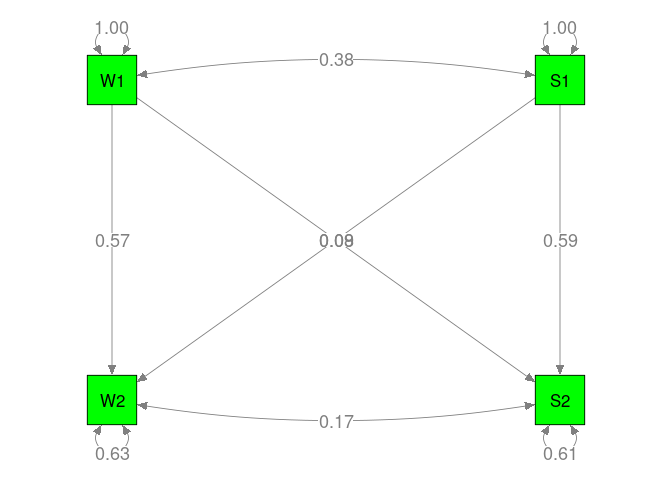
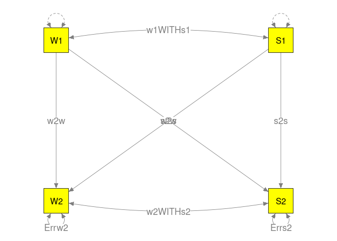
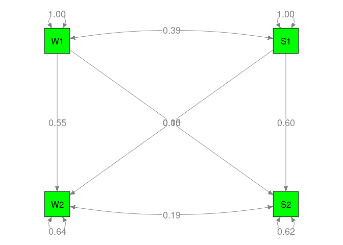

# TSSEM (with complete data)

## A model without any moderator

```r
library(metaSEM)

## Proposed model in lavaan syntax
model1 <- 'W2 ~ w2w*W1 + s2w*S1
           S2 ~ w2s*W1 + s2s*S1
           W1 ~~ w1WITHs1*S1
           W2 ~~ w2WITHs2*S2
           W1 ~~ 1*W1
           S1 ~~ 1*S1
           W2 ~~ Errw2*W2
           S2 ~~ Errs2*S2'
     
RAM1 <- lavaan2RAM(model1, obs.variables=c("W1", "S1", "W2", "S2"))
RAM1
```

```
## $A
##    W1      S1      W2  S2 
## W1 "0"     "0"     "0" "0"
## S1 "0"     "0"     "0" "0"
## W2 "0*w2w" "0*s2w" "0" "0"
## S2 "0*w2s" "0*s2s" "0" "0"
## 
## $S
##    W1           S1           W2           S2          
## W1 "1"          "0*w1WITHs1" "0"          "0"         
## S1 "0*w1WITHs1" "1"          "0"          "0"         
## W2 "0"          "0"          "0*Errw2"    "0*w2WITHs2"
## S2 "0"          "0"          "0*w2WITHs2" "0*Errs2"   
## 
## $F
##    W1 S1 W2 S2
## W1  1  0  0  0
## S1  0  1  0  0
## W2  0  0  1  0
## S2  0  0  0  1
## 
## $M
##   W1 S1 W2 S2
## 1  0  0  0  0
```

```r
## Display the number of data points
pattern.na(Nohe15A1$data, show.na=FALSE)
```

```
##    W1 S1 W2 S2
## W1 32 32 32 32
## S1 32 32 32 32
## W2 32 32 32 32
## S2 32 32 32 32
```

```r
## Stage 1 analysis
random1 <- tssem1(Nohe15A1$data, Nohe15A1$n, method="REM", RE.type="Diag")
summary(random1)
```

```
## 
## Call:
## meta(y = ES, v = acovR, RE.constraints = Diag(paste0(RE.startvalues, 
##     "*Tau2_", 1:no.es, "_", 1:no.es)), RE.lbound = RE.lbound, 
##     I2 = I2, model.name = model.name, suppressWarnings = TRUE, 
##     silent = silent, run = run)
## 
## 95% confidence intervals: z statistic approximation (robust=FALSE)
## Coefficients:
##             Estimate Std.Error    lbound    ubound z value  Pr(>|z|)    
## Intercept1 0.3804522 0.0225616 0.3362323 0.4246721 16.8628 < 2.2e-16 ***
## Intercept2 0.6051298 0.0180362 0.5697794 0.6404802 33.5508 < 2.2e-16 ***
## Intercept3 0.3032290 0.0178803 0.2681842 0.3382739 16.9588 < 2.2e-16 ***
## Intercept4 0.3036392 0.0178408 0.2686719 0.3386066 17.0194 < 2.2e-16 ***
## Intercept5 0.6166503 0.0166427 0.5840312 0.6492694 37.0523 < 2.2e-16 ***
## Intercept6 0.3954085 0.0216645 0.3529470 0.4378701 18.2515 < 2.2e-16 ***
## Tau2_1_1   0.0134777 0.0038704 0.0058919 0.0210635  3.4823 0.0004972 ***
## Tau2_2_2   0.0087592 0.0025260 0.0038083 0.0137102  3.4676 0.0005252 ***
## Tau2_3_3   0.0071123 0.0022470 0.0027082 0.0115163  3.1652 0.0015496 ** 
## Tau2_4_4   0.0070585 0.0022121 0.0027229 0.0113941  3.1909 0.0014183 ** 
## Tau2_5_5   0.0072634 0.0021092 0.0031293 0.0113974  3.4436 0.0005740 ***
## Tau2_6_6   0.0122813 0.0034848 0.0054513 0.0191114  3.5243 0.0004246 ***
## ---
## Signif. codes:  0 '***' 0.001 '**' 0.01 '*' 0.05 '.' 0.1 ' ' 1
## 
## Q statistic on the homogeneity of effect sizes: 1466.163
## Degrees of freedom of the Q statistic: 186
## P value of the Q statistic: 0
## 
## Heterogeneity indices (based on the estimated Tau2):
##                              Estimate
## Intercept1: I2 (Q statistic)   0.8829
## Intercept2: I2 (Q statistic)   0.8973
## Intercept3: I2 (Q statistic)   0.7743
## Intercept4: I2 (Q statistic)   0.7718
## Intercept5: I2 (Q statistic)   0.8810
## Intercept6: I2 (Q statistic)   0.8748
## 
## Number of studies (or clusters): 32
## Number of observed statistics: 192
## Number of estimated parameters: 12
## Degrees of freedom: 180
## -2 log likelihood: -300.1701 
## OpenMx status1: 0 ("0" or "1": The optimization is considered fine.
## Other values may indicate problems.)
```

```r
## Stage 2 analysis
random2 <- tssem2(random1, Amatrix=RAM1$A, Smatrix=RAM1$S)
summary(random2)
```

```
## 
## Call:
## wls(Cov = pooledS, aCov = aCov, n = tssem1.obj$total.n, RAM = RAM, 
##     Amatrix = Amatrix, Smatrix = Smatrix, Fmatrix = Fmatrix, 
##     diag.constraints = diag.constraints, cor.analysis = cor.analysis, 
##     intervals.type = intervals.type, mx.algebras = mx.algebras, 
##     model.name = model.name, suppressWarnings = suppressWarnings, 
##     silent = silent, run = run)
## 
## 95% confidence intervals: z statistic approximation
## Coefficients:
##          Estimate Std.Error   lbound   ubound z value  Pr(>|z|)    
## s2s      0.586124  0.020790 0.545376 0.626872 28.1926 < 2.2e-16 ***
## w2s      0.080237  0.024842 0.031547 0.128927  3.2299 0.0012385 ** 
## s2w      0.085841  0.024796 0.037242 0.134440  3.4619 0.0005364 ***
## w2w      0.572471  0.022265 0.528834 0.616109 25.7122 < 2.2e-16 ***
## w1WITHs1 0.380452  0.022562 0.336232 0.424672 16.8628 < 2.2e-16 ***
## w2WITHs2 0.168885  0.025232 0.119431 0.218338  6.6933 2.182e-11 ***
## ---
## Signif. codes:  0 '***' 0.001 '**' 0.01 '*' 0.05 '.' 0.1 ' ' 1
## 
## Goodness-of-fit indices:
##                                            Value
## Sample size                                12906
## Chi-square of target model                     0
## DF of target model                             0
## p value of target model                        0
## Number of constraints imposed on "Smatrix"     0
## DF manually adjusted                           0
## Chi-square of independence model            3079
## DF of independence model                       6
## RMSEA                                          0
## RMSEA lower 95% CI                             0
## RMSEA upper 95% CI                             0
## SRMR                                           0
## TLI                                         -Inf
## CFI                                            1
## AIC                                            0
## BIC                                            0
## OpenMx status1: 0 ("0" or "1": The optimization is considered fine.
## Other values indicate problems.)
```

```r
## Plot the model
plot(random2, col="green")
```

<!-- -->

## Models with three subgroup analysis

```r
## Get the necessary functions
## source("http://www.suzannejak.nl/subgroup.functions.R")
source("./subgroup.functions.R")

data <- Nohe15A1$data
n <- Nohe15A1$n
Lag <- Nohe15A1$Lag

# Data for studies with short Lag 
data_g1 <- data[Lag<7]
n_g1 <- n[Lag<7]

# Data for studies with medium Lag 
data_g2 <- data[Lag>=7&Lag<13]
n_g2 <- n[Lag>=7&Lag<13]

# Data for studies with long Lag 
data_g3 <- data[Lag>=13]
n_g3 <- n[Lag>=13]
```

### Fitting a random-effects Stage 1 model in three subgroups

```r
## Stage 1 analysis per subgroup (random-effects analysis)
stage1_g1.fit <- tssem1(Cov = data_g1, n = n_g1, method = "REM", RE.type = "Diag")
stage1_g2.fit <- tssem1(Cov = data_g2, n = n_g2, method = "REM", RE.type = "Diag")
stage1_g3.fit <- tssem1(Cov = data_g3, n = n_g3, method = "REM", RE.type = "Diag")

## Rerun it to remove the error code
stage1_g3.fit <- rerun(stage1_g3.fit)
```



```r
## Results
summary(stage1_g1.fit)
```

```
## 
## Call:
## meta(y = ES, v = acovR, RE.constraints = Diag(paste0(RE.startvalues, 
##     "*Tau2_", 1:no.es, "_", 1:no.es)), RE.lbound = RE.lbound, 
##     I2 = I2, model.name = model.name, suppressWarnings = TRUE, 
##     silent = silent, run = run)
## 
## 95% confidence intervals: z statistic approximation (robust=FALSE)
## Coefficients:
##               Estimate   Std.Error      lbound      ubound z value Pr(>|z|)    
## Intercept1  0.42860576  0.03711507  0.35586156  0.50134997 11.5480  < 2e-16 ***
## Intercept2  0.64893778  0.02491946  0.60009654  0.69777903 26.0414  < 2e-16 ***
## Intercept3  0.34725162  0.03476027  0.27912274  0.41538051  9.9899  < 2e-16 ***
## Intercept4  0.35445086  0.03474155  0.28635867  0.42254305 10.2025  < 2e-16 ***
## Intercept5  0.69211029  0.02527054  0.64258095  0.74163964 27.3880  < 2e-16 ***
## Intercept6  0.42483613  0.04413726  0.33832870  0.51134357  9.6253  < 2e-16 ***
## Tau2_1_1    0.01057582  0.00550629 -0.00021631  0.02136794  1.9207  0.05477 .  
## Tau2_2_2    0.00454042  0.00259602 -0.00054769  0.00962853  1.7490  0.08029 .  
## Tau2_3_3    0.00841150  0.00460648 -0.00061704  0.01744004  1.8260  0.06785 .  
## Tau2_4_4    0.00843306  0.00464811 -0.00067708  0.01754319  1.8143  0.06963 .  
## Tau2_5_5    0.00502725  0.00281689 -0.00049375  0.01054824  1.7847  0.07431 .  
## Tau2_6_6    0.01606560  0.00804791  0.00029199  0.03183920  1.9962  0.04591 *  
## ---
## Signif. codes:  0 '***' 0.001 '**' 0.01 '*' 0.05 '.' 0.1 ' ' 1
## 
## Q statistic on the homogeneity of effect sizes: 341.1967
## Degrees of freedom of the Q statistic: 54
## P value of the Q statistic: 0
## 
## Heterogeneity indices (based on the estimated Tau2):
##                              Estimate
## Intercept1: I2 (Q statistic)   0.8161
## Intercept2: I2 (Q statistic)   0.7993
## Intercept3: I2 (Q statistic)   0.7506
## Intercept4: I2 (Q statistic)   0.7546
## Intercept5: I2 (Q statistic)   0.8423
## Intercept6: I2 (Q statistic)   0.8662
## 
## Number of studies (or clusters): 10
## Number of observed statistics: 60
## Number of estimated parameters: 12
## Degrees of freedom: 48
## -2 log likelihood: -97.84918 
## OpenMx status1: 0 ("0" or "1": The optimization is considered fine.
## Other values may indicate problems.)
```

```r
summary(stage1_g2.fit)
```

```
## 
## Call:
## meta(y = ES, v = acovR, RE.constraints = Diag(paste0(RE.startvalues, 
##     "*Tau2_", 1:no.es, "_", 1:no.es)), RE.lbound = RE.lbound, 
##     I2 = I2, model.name = model.name, suppressWarnings = TRUE, 
##     silent = silent, run = run)
## 
## 95% confidence intervals: z statistic approximation (robust=FALSE)
## Coefficients:
##              Estimate  Std.Error     lbound     ubound z value Pr(>|z|)    
## Intercept1 0.34829724 0.03716905 0.27544724 0.42114724  9.3706  < 2e-16 ***
## Intercept2 0.61072346 0.02048942 0.57056494 0.65088198 29.8068  < 2e-16 ***
## Intercept3 0.28588837 0.02572111 0.23547592 0.33630082 11.1149  < 2e-16 ***
## Intercept4 0.28841182 0.02673801 0.23600627 0.34081736 10.7866  < 2e-16 ***
## Intercept5 0.58850375 0.02457855 0.54033067 0.63667682 23.9438  < 2e-16 ***
## Intercept6 0.36861765 0.02911075 0.31156163 0.42567367 12.6626  < 2e-16 ***
## Tau2_1_1   0.01809558 0.00728838 0.00381062 0.03238055  2.4828  0.01304 *  
## Tau2_2_2   0.00485932 0.00231300 0.00032593 0.00939272  2.1009  0.03565 *  
## Tau2_3_3   0.00705198 0.00311184 0.00095289 0.01315107  2.2662  0.02344 *  
## Tau2_4_4   0.00784269 0.00345167 0.00107755 0.01460783  2.2721  0.02308 *  
## Tau2_5_5   0.00753170 0.00312394 0.00140889 0.01365450  2.4110  0.01591 *  
## Tau2_6_6   0.01018393 0.00414085 0.00206802 0.01829984  2.4594  0.01392 *  
## ---
## Signif. codes:  0 '***' 0.001 '**' 0.01 '*' 0.05 '.' 0.1 ' ' 1
## 
## Q statistic on the homogeneity of effect sizes: 714.1117
## Degrees of freedom of the Q statistic: 84
## P value of the Q statistic: 0
## 
## Heterogeneity indices (based on the estimated Tau2):
##                              Estimate
## Intercept1: I2 (Q statistic)   0.9053
## Intercept2: I2 (Q statistic)   0.8238
## Intercept3: I2 (Q statistic)   0.7673
## Intercept4: I2 (Q statistic)   0.7853
## Intercept5: I2 (Q statistic)   0.8730
## Intercept6: I2 (Q statistic)   0.8455
## 
## Number of studies (or clusters): 15
## Number of observed statistics: 90
## Number of estimated parameters: 12
## Degrees of freedom: 78
## -2 log likelihood: -150.9746 
## OpenMx status1: 0 ("0" or "1": The optimization is considered fine.
## Other values may indicate problems.)
```

```r
summary(stage1_g3.fit)
```

```
## 
## Call:
## meta(y = ES, v = acovR, RE.constraints = Diag(paste0(RE.startvalues, 
##     "*Tau2_", 1:no.es, "_", 1:no.es)), RE.lbound = RE.lbound, 
##     I2 = I2, model.name = model.name, suppressWarnings = TRUE, 
##     silent = silent, run = run)
## 
## 95% confidence intervals: z statistic approximation (robust=FALSE)
## Coefficients:
##               Estimate   Std.Error      lbound      ubound z value  Pr(>|z|)    
## Intercept1  3.9659e-01  4.0656e-02  3.1691e-01  4.7628e-01  9.7549 < 2.2e-16 ***
## Intercept2  5.3658e-01  4.8888e-02  4.4076e-01  6.3239e-01 10.9756 < 2.2e-16 ***
## Intercept3  2.9657e-01  2.9446e-02  2.3885e-01  3.5428e-01 10.0714 < 2.2e-16 ***
## Intercept4  2.7917e-01  6.7679e-02  1.4653e-01  4.1182e-01  4.1250 3.707e-05 ***
## Intercept5  5.8098e-01  2.7733e-02  5.2663e-01  6.3534e-01 20.9495 < 2.2e-16 ***
## Intercept6  4.2588e-01  4.8650e-02  3.3053e-01  5.2123e-01  8.7539 < 2.2e-16 ***
## Tau2_1_1    3.2548e-03  3.4114e-03 -3.4314e-03  9.9410e-03  0.9541    0.3400    
## Tau2_2_2    1.3288e-02  8.7626e-03 -3.8860e-03  3.0463e-02  1.5165    0.1294    
## Tau2_3_3    1.1556e-03  2.7020e-03 -4.1401e-03  6.4514e-03  0.4277    0.6689    
## Tau2_4_4    5.1719e-10  4.6888e-03 -9.1900e-03  9.1900e-03  0.0000    1.0000    
## Tau2_5_5    5.5237e-04  1.7504e-03 -2.8784e-03  3.9832e-03  0.3156    0.7523    
## Tau2_6_6    8.1112e-03  5.6552e-03 -2.9728e-03  1.9195e-02  1.4343    0.1515    
## ---
## Signif. codes:  0 '***' 0.001 '**' 0.01 '*' 0.05 '.' 0.1 ' ' 1
## 
## Q statistic on the homogeneity of effect sizes: 254.7399
## Degrees of freedom of the Q statistic: 36
## P value of the Q statistic: 0
## 
## Heterogeneity indices (based on the estimated Tau2):
##                              Estimate
## Intercept1: I2 (Q statistic)   0.6753
## Intercept2: I2 (Q statistic)   0.9303
## Intercept3: I2 (Q statistic)   0.3817
## Intercept4: I2 (Q statistic)   0.0000
## Intercept5: I2 (Q statistic)   0.3672
## Intercept6: I2 (Q statistic)   0.8458
## 
## Number of studies (or clusters): 7
## Number of observed statistics: 42
## Number of estimated parameters: 12
## Degrees of freedom: 30
## -2 log likelihood: -91.83659 
## OpenMx status1: 0 ("0" or "1": The optimization is considered fine.
## Other values may indicate problems.)
```

### Fitting the Stage 2 model in three subgroups

```r
## Stage 2 analysis per subgroup (random-effect analysis)
stage2_g1.fit <- tssem2(stage1_g1.fit, Amatrix=RAM1$A, Smatrix=RAM1$S)
stage2_g2.fit <- tssem2(stage1_g2.fit, Amatrix=RAM1$A, Smatrix=RAM1$S)
stage2_g3.fit <- tssem2(stage1_g3.fit, Amatrix=RAM1$A, Smatrix=RAM1$S)

## Results
summary(stage2_g1.fit)
```

```
## 
## Call:
## wls(Cov = pooledS, aCov = aCov, n = tssem1.obj$total.n, RAM = RAM, 
##     Amatrix = Amatrix, Smatrix = Smatrix, Fmatrix = Fmatrix, 
##     diag.constraints = diag.constraints, cor.analysis = cor.analysis, 
##     intervals.type = intervals.type, mx.algebras = mx.algebras, 
##     model.name = model.name, suppressWarnings = suppressWarnings, 
##     silent = silent, run = run)
## 
## 95% confidence intervals: z statistic approximation
## Coefficients:
##             Estimate   Std.Error      lbound      ubound z value  Pr(>|z|)    
## s2s       0.66553740  0.03569842  0.59556979  0.73550501 18.6433 < 2.2e-16 ***
## w2s       0.06199846  0.04876835 -0.03358575  0.15758266  1.2713  0.203627    
## s2w       0.09348604  0.04754749  0.00029468  0.18667740  1.9662  0.049280 *  
## w2w       0.60886913  0.03478417  0.54069341  0.67704485 17.5042 < 2.2e-16 ***
## w1WITHs1  0.42860576  0.03711507  0.35586156  0.50134997 11.5480 < 2.2e-16 ***
## w2WITHs2  0.14870269  0.05135547  0.04804781  0.24935757  2.8956  0.003785 ** 
## ---
## Signif. codes:  0 '***' 0.001 '**' 0.01 '*' 0.05 '.' 0.1 ' ' 1
## 
## Goodness-of-fit indices:
##                                             Value
## Sample size                                2845.0
## Chi-square of target model                    0.0
## DF of target model                            0.0
## p value of target model                       0.0
## Number of constraints imposed on "Smatrix"    0.0
## DF manually adjusted                          0.0
## Chi-square of independence model           1561.7
## DF of independence model                      6.0
## RMSEA                                         0.0
## RMSEA lower 95% CI                            0.0
## RMSEA upper 95% CI                            0.0
## SRMR                                          0.0
## TLI                                          -Inf
## CFI                                           1.0
## AIC                                           0.0
## BIC                                           0.0
## OpenMx status1: 0 ("0" or "1": The optimization is considered fine.
## Other values indicate problems.)
```

```r
summary(stage2_g2.fit)
```

```
## 
## Call:
## wls(Cov = pooledS, aCov = aCov, n = tssem1.obj$total.n, RAM = RAM, 
##     Amatrix = Amatrix, Smatrix = Smatrix, Fmatrix = Fmatrix, 
##     diag.constraints = diag.constraints, cor.analysis = cor.analysis, 
##     intervals.type = intervals.type, mx.algebras = mx.algebras, 
##     model.name = model.name, suppressWarnings = suppressWarnings, 
##     silent = silent, run = run)
## 
## 95% confidence intervals: z statistic approximation
## Coefficients:
##          Estimate Std.Error   lbound   ubound z value  Pr(>|z|)    
## s2s      0.556431  0.029435 0.498739 0.614123 18.9036 < 2.2e-16 ***
## w2s      0.092085  0.035876 0.021770 0.162400  2.5668   0.01026 *  
## s2w      0.086149  0.036990 0.013651 0.158648  2.3290   0.01986 *  
## w2w      0.580718  0.025338 0.531056 0.630379 22.9189 < 2.2e-16 ***
## w1WITHs1 0.348297  0.037169 0.275447 0.421147  9.3706 < 2.2e-16 ***
## w2WITHs2 0.151898  0.035147 0.083011 0.220785  4.3218 1.548e-05 ***
## ---
## Signif. codes:  0 '***' 0.001 '**' 0.01 '*' 0.05 '.' 0.1 ' ' 1
## 
## Goodness-of-fit indices:
##                                             Value
## Sample size                                5991.0
## Chi-square of target model                    0.0
## DF of target model                            0.0
## p value of target model                       0.0
## Number of constraints imposed on "Smatrix"    0.0
## DF manually adjusted                          0.0
## Chi-square of independence model           1662.6
## DF of independence model                      6.0
## RMSEA                                         0.0
## RMSEA lower 95% CI                            0.0
## RMSEA upper 95% CI                            0.0
## SRMR                                          0.0
## TLI                                          -Inf
## CFI                                           1.0
## AIC                                           0.0
## BIC                                           0.0
## OpenMx status1: 0 ("0" or "1": The optimization is considered fine.
## Other values indicate problems.)
```

```r
summary(stage2_g3.fit)
```

```
## 
## Call:
## wls(Cov = pooledS, aCov = aCov, n = tssem1.obj$total.n, RAM = RAM, 
##     Amatrix = Amatrix, Smatrix = Smatrix, Fmatrix = Fmatrix, 
##     diag.constraints = diag.constraints, cor.analysis = cor.analysis, 
##     intervals.type = intervals.type, mx.algebras = mx.algebras, 
##     model.name = model.name, suppressWarnings = suppressWarnings, 
##     silent = silent, run = run)
## 
## 95% confidence intervals: z statistic approximation
## Coefficients:
##           Estimate Std.Error    lbound    ubound z value  Pr(>|z|)    
## s2s       0.549852  0.030201  0.490659  0.609046 18.2062 < 2.2e-16 ***
## w2s       0.078499  0.028028  0.023565  0.133433  2.8007  0.005099 ** 
## s2w       0.078761  0.061389 -0.041559  0.199082  1.2830  0.199499    
## w2w       0.505339  0.055374  0.396807  0.613871  9.1259 < 2.2e-16 ***
## w1WITHs1  0.396591  0.040656  0.316908  0.476275  9.7549 < 2.2e-16 ***
## w2WITHs2  0.230256  0.039856  0.152139  0.308373  5.7772 7.597e-09 ***
## ---
## Signif. codes:  0 '***' 0.001 '**' 0.01 '*' 0.05 '.' 0.1 ' ' 1
## 
## Goodness-of-fit indices:
##                                             Value
## Sample size                                4070.0
## Chi-square of target model                    0.0
## DF of target model                            0.0
## p value of target model                       0.0
## Number of constraints imposed on "Smatrix"    0.0
## DF manually adjusted                          0.0
## Chi-square of independence model           1319.6
## DF of independence model                      6.0
## RMSEA                                         0.0
## RMSEA lower 95% CI                            0.0
## RMSEA upper 95% CI                            0.0
## SRMR                                          0.0
## TLI                                          -Inf
## CFI                                           1.0
## AIC                                           0.0
## BIC                                           0.0
## OpenMx status1: 0 ("0" or "1": The optimization is considered fine.
## Other values indicate problems.)
```

### Testing the equality of regression coefficients
* We create and fit a model with equal direct effects (we use the same matrix A for both groups), but different variances and covariances, so we create an S matrix with different labels for group 2 and group 3.

```r
## Proposed model g2
model2 <- 'W2 ~ w2w*W1 + s2w*S1
           S2 ~ w2s*W1 + s2s*S1
           W1 ~~ g2w1WITHs1*S1
           W2 ~~ g2w2WITHs2*S2
           W1 ~~ 1*W1
           S1 ~~ 1*S1
           W2 ~~ g2Errw2*W2
           S2 ~~ g2Errs2*S2'
     
RAM2 <- lavaan2RAM(model2, obs.variables=c("W1", "S1", "W2", "S2"))

## Proposed model g3
model3 <- 'W2 ~ w2w*W1 + s2w*S1
           S2 ~ w2s*W1 + s2s*S1
           W1 ~~ g3w1WITHs1*S1
           W2 ~~ g3w2WITHs2*S2
           W1 ~~ 1*W1
           S1 ~~ 1*S1
           W2 ~~ g3Errw2*W2
           S2 ~~ g3Errs2*S2'
     
RAM3 <- lavaan2RAM(model3, obs.variables=c("W1", "S1", "W2", "S2"))

## Create the models for the two groups, make sure to set the argument run=FALSE
stage2_g1 <- tssem2(stage1_g1.fit, Amatrix=RAM1$A, Smatrix=RAM1$S, run=FALSE, model.name="g1")

stage2_g2 <- tssem2(stage1_g2.fit, Amatrix=RAM1$A, Smatrix=RAM2$S, run=FALSE, model.name="g2")

stage2_g3 <- tssem2(stage1_g3.fit, Amatrix=RAM1$A, Smatrix=RAM3$S, run=FALSE, model.name="g3")

## Create the multigroup model
stage2_constrained <- mxModel(model="same_regression_coef", stage2_g1, stage2_g2,stage2_g3,
                              mxFitFunctionMultigroup(c("g1", "g2", "g3")))

## Fit multigroup model with equality constraints
Stage2_constrained.fit <- mxRun(stage2_constrained, intervals=TRUE)

## first make a list of the fitted models in the separate groups
submodels.fit <- list(stage2_g1.fit, stage2_g2.fit, stage2_g3.fit)

subgroup.summary(submodels.fit, Stage2_constrained.fit)
```

```
## # # # # # # # # # # # # # # # # # # #
##  Output for subgroup MASEM analysis 
## # # # # # # # # # # # # # # # # # # #
## 
##  Total sample size: 12906
## 
##  Parameter estimates of the constrained model
## 
## [1] "Set 'print.est=TRUE' to print the parameter estimates of the constrained model"
## 
##  - - - - - - - - - - - - - - - - - - - - - - - - - - - - - - - - - - -
##  Fit indices of the free model:
## 
##           Statistic Free_m1
##                  df   0.000
##          Chi-square   0.000
##                   p   0.000
##               RMSEA     Inf
##  RMSEA lower 95% CI     Inf
##  RMSEA upper 95% CI     Inf
##                 CFI   1.000
##                 TLI    -Inf
##                 AIC  60.000
##                 BIC 283.963
##                SRMR   0.000
## - - - - - - - - - - - - - - - - - - - - - - - - - - - - - - - - - - -
##  Fit indices of the model with equality constraints:
## 
##           Statistic Constrained_m2
##                  df          8.000
##          Chi-square         14.739
##                   p          0.064
##               RMSEA          0.014
##  RMSEA lower 95% CI          0.000
##  RMSEA upper 95% CI          0.027
##                 CFI          0.999
##                 TLI          0.997
##                 AIC         58.739
##                 BIC        222.979
##                SRMR          0.033
## - - - - - - - - - - - - - - - - - - - - - - - - - - - - - - - - - - -
##  Chi-square difference between free and constrained model:
## 
##   Statistic Diff_m1_m2
##          df      8.000
##  Chi-square     14.739
##           p      0.064
## 
##  # # # # # # # # # # # # # # # # # # # # # # # # # # # # # # # # # # #
```

### Testing the equality of one regression coefficient (w2w)
* We create and fit a model with equal direct effects (we use the same matrix A for both groups), but different variances and covariances, so we create an S matrix with different labels for group 2 and group 3.


```r
## Proposed model g2
model2 <- 'W2 ~ w2w*W1 + g2s2w*S1
           S2 ~ g2w2s*W1 + g2s2s*S1
           W1 ~~ g2w1WITHs1*S1
           W2 ~~ g2w2WITHs2*S2
           W1 ~~ 1*W1
           S1 ~~ 1*S1
           W2 ~~ g2Errw2*W2
           S2 ~~ g2Errs2*S2'
     
RAM2 <- lavaan2RAM(model2, obs.variables=c("W1", "S1", "W2", "S2"))

## Proposed model g3
model3 <- 'W2 ~ w2w*W1 + g3s2w*S1
           S2 ~ g3w2s*W1 + g3s2s*S1
           W1 ~~ g3w1WITHs1*S1
           W2 ~~ g3w2WITHs2*S2
           W1 ~~ 1*W1
           S1 ~~ 1*S1
           W2 ~~ g3Errw2*W2
           S2 ~~ g3Errs2*S2'
     
RAM3 <- lavaan2RAM(model3, obs.variables=c("W1", "S1", "W2", "S2"))

## Create the models for the two groups, make sure to set the argument run=FALSE
stage2_g1 <- tssem2(stage1_g1.fit, Amatrix=RAM1$A, Smatrix=RAM1$S, run=FALSE, model.name="g1")

stage2_g2 <- tssem2(stage1_g2.fit, Amatrix=RAM2$A, Smatrix=RAM2$S, run=FALSE, model.name="g2")

stage2_g3 <- tssem2(stage1_g3.fit, Amatrix=RAM3$A, Smatrix=RAM3$S, run=FALSE, model.name="g3")

## Create the multigroup model
stage2_constrained <- mxModel(model="same_regression_coef", stage2_g1, stage2_g2,stage2_g3,
                              mxFitFunctionMultigroup(c("g1", "g2", "g3")))

## Fit multigroup model with equality constraints
Stage2_constrained.fit <- mxRun(stage2_constrained, intervals=TRUE)

## First make a list of the fitted models in the separate groups
submodels.fit <- list(stage2_g1.fit,stage2_g2.fit,stage2_g3.fit)

subgroup.summary(submodels.fit,Stage2_constrained.fit)
```

```
## # # # # # # # # # # # # # # # # # # #
##  Output for subgroup MASEM analysis 
## # # # # # # # # # # # # # # # # # # #
## 
##  Total sample size: 12906
## 
##  Parameter estimates of the constrained model
## 
## [1] "Set 'print.est=TRUE' to print the parameter estimates of the constrained model"
## 
##  - - - - - - - - - - - - - - - - - - - - - - - - - - - - - - - - - - -
##  Fit indices of the free model:
## 
##           Statistic Free_m1
##                  df   0.000
##          Chi-square   0.000
##                   p   0.000
##               RMSEA     Inf
##  RMSEA lower 95% CI     Inf
##  RMSEA upper 95% CI     Inf
##                 CFI   1.000
##                 TLI    -Inf
##                 AIC  60.000
##                 BIC 283.963
##                SRMR   0.000
## - - - - - - - - - - - - - - - - - - - - - - - - - - - - - - - - - - -
##  Fit indices of the model with equality constraints:
## 
##           Statistic Constrained_m2
##                  df          2.000
##          Chi-square          2.527
##                   p          0.283
##               RMSEA          0.008
##  RMSEA lower 95% CI          0.000
##  RMSEA upper 95% CI          0.036
##                 CFI          1.000
##                 TLI          0.999
##                 AIC         58.527
##                 BIC        267.560
##                SRMR          0.015
## - - - - - - - - - - - - - - - - - - - - - - - - - - - - - - - - - - -
##  Chi-square difference between free and constrained model:
## 
##   Statistic Diff_m1_m2
##          df      2.000
##  Chi-square      2.527
##           p      0.283
## 
##  # # # # # # # # # # # # # # # # # # # # # # # # # # # # # # # # # # #
```

## Models with two subgroup analysis

```r
# Data for studies with short Lag 
data_g1 <- data[Lag<12]
n_g1 <- n[Lag<12]

# Data for studies with long Lag 
data_g2 <- data[Lag>=12]
n_g2 <- n[Lag>=12]
```

### Fitting a random-effects Stage 1 model in two subgroups

```r
## Stage 1 analysis per subgroup (random-effects analysis)
stage1_g1.fit <- tssem1(Cov = data_g1, n = n_g1, method = "REM", RE.type = "Diag")
stage1_g2.fit <- tssem1(Cov = data_g2, n = n_g2, method = "REM", RE.type = "Diag")
## Rerun the analysis
stage1_g2.fit <- rerun(stage1_g2.fit)
```



```r
summary(stage1_g1.fit)
```

```
## 
## Call:
## meta(y = ES, v = acovR, RE.constraints = Diag(paste0(RE.startvalues, 
##     "*Tau2_", 1:no.es, "_", 1:no.es)), RE.lbound = RE.lbound, 
##     I2 = I2, model.name = model.name, suppressWarnings = TRUE, 
##     silent = silent, run = run)
## 
## 95% confidence intervals: z statistic approximation (robust=FALSE)
## Coefficients:
##               Estimate   Std.Error      lbound      ubound z value Pr(>|z|)    
## Intercept1  4.6331e-01  3.4802e-02  3.9510e-01  5.3152e-01 13.3127  < 2e-16 ***
## Intercept2  6.5871e-01  1.8886e-02  6.2169e-01  6.9572e-01 34.8782  < 2e-16 ***
## Intercept3  3.6924e-01  3.0810e-02  3.0886e-01  4.2963e-01 11.9846  < 2e-16 ***
## Intercept4  3.7718e-01  3.1986e-02  3.1449e-01  4.3987e-01 11.7923  < 2e-16 ***
## Intercept5  6.7273e-01  2.7748e-02  6.1834e-01  7.2711e-01 24.2446  < 2e-16 ***
## Intercept6  4.4613e-01  3.9848e-02  3.6803e-01  5.2423e-01 11.1959  < 2e-16 ***
## Tau2_1_1    1.3297e-02  5.7560e-03  2.0154e-03  2.4578e-02  2.3101  0.02088 *  
## Tau2_2_2    3.3131e-03  1.7387e-03 -9.4594e-05  6.7208e-03  1.9056  0.05671 .  
## Tau2_3_3    9.3795e-03  4.2626e-03  1.0249e-03  1.7734e-02  2.2004  0.02778 *  
## Tau2_4_4    1.0324e-02  4.7309e-03  1.0512e-03  1.9596e-02  2.1822  0.02910 *  
## Tau2_5_5    8.7112e-03  3.8165e-03  1.2310e-03  1.6191e-02  2.2825  0.02246 *  
## Tau2_6_6    1.8025e-02  7.6104e-03  3.1090e-03  3.2941e-02  2.3685  0.01786 *  
## ---
## Signif. codes:  0 '***' 0.001 '**' 0.01 '*' 0.05 '.' 0.1 ' ' 1
## 
## Q statistic on the homogeneity of effect sizes: 734.0562
## Degrees of freedom of the Q statistic: 72
## P value of the Q statistic: 0
## 
## Heterogeneity indices (based on the estimated Tau2):
##                              Estimate
## Intercept1: I2 (Q statistic)   0.8943
## Intercept2: I2 (Q statistic)   0.7986
## Intercept3: I2 (Q statistic)   0.8257
## Intercept4: I2 (Q statistic)   0.8407
## Intercept5: I2 (Q statistic)   0.9166
## Intercept6: I2 (Q statistic)   0.9149
## 
## Number of studies (or clusters): 13
## Number of observed statistics: 78
## Number of estimated parameters: 12
## Degrees of freedom: 66
## -2 log likelihood: -122.837 
## OpenMx status1: 0 ("0" or "1": The optimization is considered fine.
## Other values may indicate problems.)
```

```r
summary(stage1_g2.fit)
```

```
## 
## Call:
## meta(y = ES, v = acovR, RE.constraints = Diag(paste0(RE.startvalues, 
##     "*Tau2_", 1:no.es, "_", 1:no.es)), RE.lbound = RE.lbound, 
##     I2 = I2, model.name = model.name, suppressWarnings = TRUE, 
##     silent = silent, run = run)
## 
## 95% confidence intervals: z statistic approximation (robust=FALSE)
## Coefficients:
##               Estimate   Std.Error      lbound      ubound z value  Pr(>|z|)    
## Intercept1  0.32573374  0.02286303  0.28092301  0.37054446 14.2472 < 2.2e-16 ***
## Intercept2  0.57069919  0.02385057  0.52395294  0.61744544 23.9281 < 2.2e-16 ***
## Intercept3  0.26146826  0.01444458  0.23315740  0.28977912 18.1015 < 2.2e-16 ***
## Intercept4  0.25259612  0.01201123  0.22905455  0.27613769 21.0300 < 2.2e-16 ***
## Intercept5  0.57722170  0.01668253  0.54452453  0.60991886 34.6004 < 2.2e-16 ***
## Intercept6  0.36349457  0.02093829  0.32245628  0.40453286 17.3603 < 2.2e-16 ***
## Tau2_1_1    0.00721522  0.00304222  0.00125258  0.01317787  2.3717  0.017707 *  
## Tau2_2_2    0.00903673  0.00346802  0.00223953  0.01583393  2.6057  0.009168 ** 
## Tau2_3_3    0.00125766  0.00110733 -0.00091267  0.00342798  1.1358  0.256058    
## Tau2_4_4    0.00032457  0.00050817 -0.00067142  0.00132057  0.6387  0.523015    
## Tau2_5_5    0.00361661  0.00161473  0.00045180  0.00678142  2.2398  0.025106 *  
## Tau2_6_6    0.00576799  0.00241771  0.00102936  0.01050661  2.3857  0.017046 *  
## ---
## Signif. codes:  0 '***' 0.001 '**' 0.01 '*' 0.05 '.' 0.1 ' ' 1
## 
## Q statistic on the homogeneity of effect sizes: 580.9585
## Degrees of freedom of the Q statistic: 108
## P value of the Q statistic: 0
## 
## Heterogeneity indices (based on the estimated Tau2):
##                              Estimate
## Intercept1: I2 (Q statistic)   0.7859
## Intercept2: I2 (Q statistic)   0.8876
## Intercept3: I2 (Q statistic)   0.3641
## Intercept4: I2 (Q statistic)   0.1274
## Intercept5: I2 (Q statistic)   0.7614
## Intercept6: I2 (Q statistic)   0.7548
## 
## Number of studies (or clusters): 19
## Number of observed statistics: 114
## Number of estimated parameters: 12
## Degrees of freedom: 102
## -2 log likelihood: -240.0903 
## OpenMx status1: 0 ("0" or "1": The optimization is considered fine.
## Other values may indicate problems.)
```

### Fitting the Stage 2 model in both subgroups

```r
## Stage 2 analysis per subgroup (random-effect analysis)
stage2_g1.fit <- tssem2(stage1_g1.fit, Amatrix=RAM1$A, Smatrix=RAM1$S)
stage2_g2.fit <- tssem2(stage1_g2.fit, Amatrix=RAM1$A, Smatrix=RAM1$S)

summary(stage2_g1.fit)
```

```
## 
## Call:
## wls(Cov = pooledS, aCov = aCov, n = tssem1.obj$total.n, RAM = RAM, 
##     Amatrix = Amatrix, Smatrix = Smatrix, Fmatrix = Fmatrix, 
##     diag.constraints = diag.constraints, cor.analysis = cor.analysis, 
##     intervals.type = intervals.type, mx.algebras = mx.algebras, 
##     model.name = model.name, suppressWarnings = suppressWarnings, 
##     silent = silent, run = run)
## 
## 95% confidence intervals: z statistic approximation
## Coefficients:
##             Estimate   Std.Error      lbound      ubound z value  Pr(>|z|)    
## s2s       0.63876944  0.03971217  0.56093502  0.71660386 16.0850 < 2.2e-16 ***
## w2s       0.07329758  0.04729102 -0.01939112  0.16598628  1.5499 0.1211593    
## s2w       0.09167719  0.04642780  0.00068037  0.18267401  1.9746 0.0483115 *  
## w2w       0.61623243  0.03020865  0.55702457  0.67544029 20.3992 < 2.2e-16 ***
## w1WITHs1  0.46330811  0.03480189  0.39509766  0.53151856 13.3127 < 2.2e-16 ***
## w2WITHs2  0.15691516  0.04756351  0.06369239  0.25013793  3.2991 0.0009701 ***
## ---
## Signif. codes:  0 '***' 0.001 '**' 0.01 '*' 0.05 '.' 0.1 ' ' 1
## 
## Goodness-of-fit indices:
##                                             Value
## Sample size                                4863.0
## Chi-square of target model                    0.0
## DF of target model                            0.0
## p value of target model                       0.0
## Number of constraints imposed on "Smatrix"    0.0
## DF manually adjusted                          0.0
## Chi-square of independence model           2025.5
## DF of independence model                      6.0
## RMSEA                                         0.0
## RMSEA lower 95% CI                            0.0
## RMSEA upper 95% CI                            0.0
## SRMR                                          0.0
## TLI                                          -Inf
## CFI                                           1.0
## AIC                                           0.0
## BIC                                           0.0
## OpenMx status1: 0 ("0" or "1": The optimization is considered fine.
## Other values indicate problems.)
```

```r
summary(stage2_g2.fit)
```

```
## 
## Call:
## wls(Cov = pooledS, aCov = aCov, n = tssem1.obj$total.n, RAM = RAM, 
##     Amatrix = Amatrix, Smatrix = Smatrix, Fmatrix = Fmatrix, 
##     diag.constraints = diag.constraints, cor.analysis = cor.analysis, 
##     intervals.type = intervals.type, mx.algebras = mx.algebras, 
##     model.name = model.name, suppressWarnings = suppressWarnings, 
##     silent = silent, run = run)
## 
## 95% confidence intervals: z statistic approximation
## Coefficients:
##          Estimate Std.Error   lbound   ubound z value  Pr(>|z|)    
## s2s      0.550458  0.018924 0.513368 0.587547 29.0885 < 2.2e-16 ***
## w2s      0.082166  0.019219 0.044498 0.119834  4.2753 1.909e-05 ***
## s2w      0.074617  0.018300 0.038749 0.110485  4.0774 4.554e-05 ***
## w2w      0.546394  0.026741 0.493983 0.598805 20.4330 < 2.2e-16 ***
## w1WITHs1 0.325734  0.022863 0.280923 0.370544 14.2472 < 2.2e-16 ***
## w2WITHs2 0.177559  0.021402 0.135612 0.219506  8.2964 < 2.2e-16 ***
## ---
## Signif. codes:  0 '***' 0.001 '**' 0.01 '*' 0.05 '.' 0.1 ' ' 1
## 
## Goodness-of-fit indices:
##                                             Value
## Sample size                                8043.0
## Chi-square of target model                    0.0
## DF of target model                            0.0
## p value of target model                       0.0
## Number of constraints imposed on "Smatrix"    0.0
## DF manually adjusted                          0.0
## Chi-square of independence model           2241.6
## DF of independence model                      6.0
## RMSEA                                         0.0
## RMSEA lower 95% CI                            0.0
## RMSEA upper 95% CI                            0.0
## SRMR                                          0.0
## TLI                                          -Inf
## CFI                                           1.0
## AIC                                           0.0
## BIC                                           0.0
## OpenMx status1: 0 ("0" or "1": The optimization is considered fine.
## Other values indicate problems.)
```

### Testing the equality of regression coefficients
* We create and fit a model with equal direct effects (we use the same matrix A for both groups), but different variances and covariances, so we create an S matrix with different labels for group 2.


```r
## Proposed model g2
model2 <- 'W2 ~ w2w*W1 + s2w*S1
           S2 ~ w2s*W1 + s2s*S1
           W1 ~~ g2w1WITHs1*S1
           W2 ~~ g2w2WITHs2*S2
           W1 ~~ 1*W1
           S1 ~~ 1*S1
           W2 ~~ g2Errw2*W2
           S2 ~~ g2Errs2*S2'
     
RAM2 <- lavaan2RAM(model2, obs.variables=c("W1", "S1", "W2", "S2"))

# Create the models for the two groups, make sure to set the argument run=FALSE
stage2_g1 <- tssem2(stage1_g1.fit, Amatrix=RAM1$A, Smatrix=RAM1$S, run=FALSE, model.name="g1")

stage2_g2 <- tssem2(stage1_g2.fit, Amatrix=RAM1$A, Smatrix=RAM2$S, run=FALSE, model.name="g2")

# Create the multigroup model
stage2_constrained <- mxModel(model="same_regression_coef", stage2_g1, stage2_g2,
                              mxFitFunctionMultigroup(c("g1", "g2")))

# Fit multigroup model with equality constraints
Stage2_constrained.fit <- mxRun(stage2_constrained, intervals=TRUE)

# first make a list of the fitted models in the separate groups
submodels.fit <- list(stage2_g1.fit,stage2_g2.fit)

subgroup.summary(submodels.fit,Stage2_constrained.fit)
```

```
## # # # # # # # # # # # # # # # # # # #
##  Output for subgroup MASEM analysis 
## # # # # # # # # # # # # # # # # # # #
## 
##  Total sample size: 12906
## 
##  Parameter estimates of the constrained model
## 
## [1] "Set 'print.est=TRUE' to print the parameter estimates of the constrained model"
## 
##  - - - - - - - - - - - - - - - - - - - - - - - - - - - - - - - - - - -
##  Fit indices of the free model:
## 
##           Statistic Free_m1
##                  df   0.000
##          Chi-square   0.000
##                   p   0.000
##               RMSEA     Inf
##  RMSEA lower 95% CI     Inf
##  RMSEA upper 95% CI     Inf
##                 CFI   1.000
##                 TLI    -Inf
##                 AIC  40.000
##                 BIC 189.309
##                SRMR   0.000
## - - - - - - - - - - - - - - - - - - - - - - - - - - - - - - - - - - -
##  Fit indices of the model with equality constraints:
## 
##           Statistic Constrained_m2
##                  df          4.000
##          Chi-square         13.247
##                   p          0.010
##               RMSEA          0.019
##  RMSEA lower 95% CI          0.006
##  RMSEA upper 95% CI          0.033
##                 CFI          0.998
##                 TLI          0.993
##                 AIC         45.247
##                 BIC        164.694
##                SRMR          0.025
## - - - - - - - - - - - - - - - - - - - - - - - - - - - - - - - - - - -
##  Chi-square difference between free and constrained model:
## 
##   Statistic Diff_m1_m2
##          df      4.000
##  Chi-square     13.247
##           p      0.010
## 
##  # # # # # # # # # # # # # # # # # # # # # # # # # # # # # # # # # # #
```

# OSMASEM (with complete data)

## Data preparation

```r
## Get the data
data <- Nohe15A1$data
n <- Nohe15A1$n
Lag <- Nohe15A1$Lag
  
## Calculate the sampling covariance matrix of the correlations
my.df <- Cor2DataFrame(data, n, acov = "weighted")

## Add standardized Lag as a moderator.
## Standardization of the moderator improves the convergence.
my.df$data <- data.frame(my.df$data, Lag=scale(Nohe15A1$Lag),
                         check.names=FALSE)
head(my.df$data)
```

```
##                                        S1_W1 W2_W1 S2_W1 W2_S1 S2_S1 S2_W2 C(S1_W1 S1_W1)
## Britt...Dawson..2005.                   0.29  0.58  0.22  0.24  0.57  0.27   0.0014224803
## Demerouti.et.al...2004.                 0.53  0.57  0.41  0.41  0.68  0.54   0.0020763914
## Ford..2010.                             0.35  0.75  0.32  0.26  0.74  0.30   0.0021207093
## Hammer.et.al...2005...female.subsample  0.32  0.57  0.22  0.30  0.43  0.30   0.0029726199
## Hammer.et.al...2005...male.subsample    0.19  0.54  0.17  0.21  0.60  0.30   0.0029726186
## Innstrand.et.al...2008.                 0.42  0.63  0.31  0.30  0.62  0.44   0.0003112266
##                                        C(W2_W1 S1_W1) C(S2_W1 S1_W1) C(W2_S1 S1_W1) C(S2_S1 S1_W1)
## Britt...Dawson..2005.                    2.033644e-04   0.0008791261   0.0008736626   2.047350e-04
## Demerouti.et.al...2004.                  2.968473e-04   0.0012832548   0.0012752805   2.988489e-04
## Ford..2010.                              3.031849e-04   0.0013106468   0.0013025018   3.052296e-04
## Hammer.et.al...2005...female.subsample   4.249798e-04   0.0018371485   0.0018257320   4.278447e-04
## Hammer.et.al...2005...male.subsample     4.249801e-04   0.0018371480   0.0018257313   4.278446e-04
## Innstrand.et.al...2008.                  4.449412e-05   0.0001923449   0.0001911495   4.479415e-05
##                                        C(S2_W2 S1_W1) C(W2_W1 W2_W1) C(S2_W1 W2_W1) C(W2_S1 W2_W1)
## Britt...Dawson..2005.                    0.0004890911   0.0007981109   3.750399e-04   3.671025e-04
## Demerouti.et.al...2004.                  0.0007139212   0.0011650021   5.474422e-04   5.358564e-04
## Ford..2010.                              0.0007291613   0.0011898658   5.591278e-04   5.472943e-04
## Hammer.et.al...2005...female.subsample   0.0010220749   0.0016678477   7.837380e-04   7.671514e-04
## Hammer.et.al...2005...male.subsample     0.0010220752   0.0016678480   7.837390e-04   7.671517e-04
## Innstrand.et.al...2008.                  0.0001070083   0.0001746201   8.205533e-05   8.031866e-05
##                                        C(S2_S1 W2_W1) C(S2_W2 W2_W1) C(S2_W1 S2_W1) C(W2_S1 S2_W1)
## Britt...Dawson..2005.                    1.042810e-04   2.035386e-04   0.0016496834   0.0005769114
## Demerouti.et.al...2004.                  1.522177e-04   2.971024e-04   0.0024080380   0.0008421112
## Ford..2010.                              1.554672e-04   3.034443e-04   0.0024594342   0.0008600882
## Hammer.et.al...2005...female.subsample   2.179217e-04   4.253443e-04   0.0034474153   0.0012055989
## Hammer.et.al...2005...male.subsample     2.179222e-04   4.253454e-04   0.0034474162   0.0012055986
## Innstrand.et.al...2008.                  2.281578e-05   4.453219e-05   0.0003609366   0.0001262227
##                                        C(S2_S1 S2_W1) C(S2_W2 S2_W1) C(W2_S1 W2_S1) C(S2_S1 W2_S1)
## Britt...Dawson..2005.                    3.592777e-04   0.0008607803   0.0016601417   3.727414e-04
## Demerouti.et.al...2004.                  5.244350e-04   0.0012564763   0.0024233058   5.440885e-04
## Ford..2010.                              5.356298e-04   0.0012832949   0.0024750269   5.557023e-04
## Hammer.et.al...2005...female.subsample   7.507996e-04   0.0017988105   0.0034692726   7.789359e-04
## Hammer.et.al...2005...male.subsample     7.508004e-04   0.0017988116   0.0034692731   7.789363e-04
## Innstrand.et.al...2008.                  7.860686e-05   0.0001883310   0.0003632248   8.155258e-05
##                                        C(S2_W2 W2_S1) C(S2_S1 S2_S1) C(S2_W2 S2_S1) C(S2_W2 S2_W2)
## Britt...Dawson..2005.                    0.0008739035   0.0007805638   1.951866e-04   0.0013981159
## Demerouti.et.al...2004.                  0.0012756332   0.0011393891   2.849120e-04   0.0020408279
## Ford..2010.                              0.0013028602   0.0011637064   2.909938e-04   0.0020843844
## Hammer.et.al...2005...female.subsample   0.0018262355   0.0016311791   4.078914e-04   0.0029217044
## Hammer.et.al...2005...male.subsample     0.0018262366   0.0016311795   4.078927e-04   0.0029217056
## Innstrand.et.al...2008.                  0.0001912022   0.0001707810   4.270501e-05   0.0003058959
##                                               Lag
## Britt...Dawson..2005.                  -0.6794521
## Demerouti.et.al...2004.                -0.7711151
## Ford..2010.                            -0.8016694
## Hammer.et.al...2005...female.subsample -0.1294740
## Hammer.et.al...2005...male.subsample   -0.1294740
## Innstrand.et.al...2008.                 0.6038301
```

```r
## Check the number of studies
pattern.na(my.df, show.na=FALSE, type="osmasem")
```

```
##       S1_W1 W2_W1 S2_W1 W2_S1 S2_S1 S2_W2
## S1_W1    32    32    32    32    32    32
## W2_W1    32    32    32    32    32    32
## S2_W1    32    32    32    32    32    32
## W2_S1    32    32    32    32    32    32
## S2_S1    32    32    32    32    32    32
## S2_W2    32    32    32    32    32    32
```

```r
## Proposed model
model1 <- 'W2 ~ w2w*W1 + s2w*S1
           S2 ~ w2s*W1 + s2s*S1
           W1 ~~ w1WITHs1*S1
           W2 ~~ w2WITHs2*S2
           W1 ~~ 1*W1
           S1 ~~ 1*S1
           W2 ~~ Errw2*W2
           S2 ~~ Errs2*S2'

plot(model1, col="yellow")     
```

<!-- -->

```r
## Convert the lavaan syntax into the RAM specification
RAM1 <- lavaan2RAM(model1, obs.variables=c("W1", "S1", "W2", "S2"))
RAM1
```

```
## $A
##    W1      S1      W2  S2 
## W1 "0"     "0"     "0" "0"
## S1 "0"     "0"     "0" "0"
## W2 "0*w2w" "0*s2w" "0" "0"
## S2 "0*w2s" "0*s2s" "0" "0"
## 
## $S
##    W1           S1           W2           S2          
## W1 "1"          "0*w1WITHs1" "0"          "0"         
## S1 "0*w1WITHs1" "1"          "0"          "0"         
## W2 "0"          "0"          "0*Errw2"    "0*w2WITHs2"
## S2 "0"          "0"          "0*w2WITHs2" "0*Errs2"   
## 
## $F
##    W1 S1 W2 S2
## W1  1  0  0  0
## S1  0  1  0  0
## W2  0  0  1  0
## S2  0  0  0  1
## 
## $M
##   W1 S1 W2 S2
## 1  0  0  0  0
```

## Model without any moderator

```r
## Create the model implied correlation structure with implicit diagonal constraints
## M0 <- create.vechsR(A0=RAM1$A, S0=RAM1$S)

## Create the heterogeneity variance-covariance matrix
## RE.type= either "Diag" or "Symm"
## Transform= either "expLog" or "sqSD" for better estimation on variances
## T0 <- create.Tau2(RAM=RAM1, RE.type="Diag", Transform="expLog", RE.startvalues=0.05)

## mx.fit0 <- osmasem(model.name="No moderator", Mmatrix=M0, Tmatrix=T0, data=my.df)

mx.fit0 <- osmasem(model.name="No moderator", RAM=RAM1, data=my.df)
summary(mx.fit0)
```

```
## Summary of No moderator 
##  
## free parameters:
##        name  matrix row col    Estimate  Std.Error A    z value     Pr(>|z|)
## 1       w2w      A0  W2  W1  0.57247129 0.02226456    25.712220 0.000000e+00
## 2       w2s      A0  S2  W1  0.08023683 0.02484213     3.229869 1.238468e-03
## 3       s2w      A0  W2  S1  0.08584127 0.02479589     3.461915 5.363461e-04
## 4       s2s      A0  S2  S1  0.58612400 0.02079000    28.192594 0.000000e+00
## 5  w1WITHs1      S0  S1  W1  0.38045219 0.02256155    16.862855 0.000000e+00
## 6  w2WITHs2      S0  S2  W2  0.16888459 0.02523191     6.693294 2.182010e-11
## 7    Tau1_1 vecTau1   1   1 -2.15335911 0.14358422   -14.997185 0.000000e+00
## 8    Tau1_2 vecTau1   2   1 -2.36882267 0.14419314   -16.428123 0.000000e+00
## 9    Tau1_3 vecTau1   3   1 -2.47296574 0.15796635   -15.655017 0.000000e+00
## 10   Tau1_4 vecTau1   4   1 -2.47676226 0.15669552   -15.806210 0.000000e+00
## 11   Tau1_5 vecTau1   5   1 -2.46245709 0.14519715   -16.959404 0.000000e+00
## 12   Tau1_6 vecTau1   6   1 -2.19983837 0.14187316   -15.505669 0.000000e+00
## 
## Model Statistics: 
##                |  Parameters  |  Degrees of Freedom  |  Fit (-2lnL units)
##        Model:             12                    180             -300.1701
##    Saturated:             27                    165                    NA
## Independence:             12                    180                    NA
## Number of observations/statistics: 12906/192
## 
## Information Criteria: 
##       |  df Penalty  |  Parameters Penalty  |  Sample-Size Adjusted
## AIC:      -660.1701              -276.1701                -276.1459
## BIC:     -2003.9507              -186.5848                -224.7196
## To get additional fit indices, see help(mxRefModels)
## timestamp: 2020-06-17 11:01:36 
## Wall clock time: 0.3065209 secs 
## optimizer:  SLSQP 
## OpenMx version number: 2.17.4 
## Need help?  See help(mxSummary)
```

```r
## The variance-covariance matrix in mx.fit0 is based on the untransformed matrix
## Extract the heterogeneity variance-covariance matrix
VarCorr(mx.fit0)
```

```
##            Tau2_1      Tau2_2      Tau2_3      Tau2_4     Tau2_5     Tau2_6
## Tau2_1 0.01347771 0.000000000 0.000000000 0.000000000 0.00000000 0.00000000
## Tau2_2 0.00000000 0.008759247 0.000000000 0.000000000 0.00000000 0.00000000
## Tau2_3 0.00000000 0.000000000 0.007112287 0.000000000 0.00000000 0.00000000
## Tau2_4 0.00000000 0.000000000 0.000000000 0.007058487 0.00000000 0.00000000
## Tau2_5 0.00000000 0.000000000 0.000000000 0.000000000 0.00726335 0.00000000
## Tau2_6 0.00000000 0.000000000 0.000000000 0.000000000 0.00000000 0.01228131
```

## Model with `Lag` as a moderator on the A matrix

```r
Ax <- matrix(c(0,0,0,0,
               0,0,0,0,
               "0*data.Lag","0*data.Lag",0,0,
               "0*data.Lag","0*data.Lag",0,0),
             nrow=4, ncol=4, byrow=TRUE)
Ax              
```

```
##      [,1]         [,2]         [,3] [,4]
## [1,] "0"          "0"          "0"  "0" 
## [2,] "0"          "0"          "0"  "0" 
## [3,] "0*data.Lag" "0*data.Lag" "0"  "0" 
## [4,] "0*data.Lag" "0*data.Lag" "0"  "0"
```

```r
## When there are more than one moderators
## Ax <- list(A1, A2, A3)

## Create the model implied correlation structure with the standardized Lag as the moderator
## M1 <- create.vechsR(A0=RAM1$A, S0=RAM1$S, Ax=Ax)

## mx.fit1 <- osmasem(model.name="Ax as moderator", Mmatrix=M1, Tmatrix=T0, data=my.df)

mx.fit1 <- osmasem(model.name="Ax as moderator", RAM=RAM1, Ax=Ax, data=my.df)
summary(mx.fit1)
```

```
## Summary of Ax as moderator 
##  
## free parameters:
##        name  matrix row col     Estimate  Std.Error A     z value     Pr(>|z|)
## 1       w2w      A0  W2  W1  0.573039769 0.01839765    31.1474421 0.000000e+00
## 2       w2s      A0  S2  W1  0.079844959 0.02419488     3.3000768 9.665838e-04
## 3       s2w      A0  W2  S1  0.085391038 0.02393611     3.5674562 3.604636e-04
## 4       s2s      A0  S2  S1  0.586234266 0.01962560    29.8708913 0.000000e+00
## 5  w1WITHs1      S0  S1  W1  0.381183737 0.02282276    16.7019096 0.000000e+00
## 6  w2WITHs2      S0  S2  W2  0.166974820 0.02500438     6.6778229 2.425171e-11
## 7     w2w_1      A1  W2  W1 -0.062015587 0.01850573    -3.3511556 8.047506e-04
## 8     w2s_1      A1  S2  W1 -0.025933719 0.02096723    -1.2368690 2.161357e-01
## 9     s2w_1      A1  W2  S1 -0.002382813 0.02055897    -0.1159014 9.077307e-01
## 10    s2s_1      A1  S2  S1 -0.027809756 0.01974171    -1.4086798 1.589299e-01
## 11   Tau1_1 vecTau1   1   1 -2.138190877 0.14360103   -14.8898016 0.000000e+00
## 12   Tau1_2 vecTau1   2   1 -2.630518293 0.16155257   -16.2827387 0.000000e+00
## 13   Tau1_3 vecTau1   3   1 -2.524194339 0.16007545   -15.7687787 0.000000e+00
## 14   Tau1_4 vecTau1   4   1 -2.519908962 0.15983968   -15.7652282 0.000000e+00
## 15   Tau1_5 vecTau1   5   1 -2.537475822 0.14712279   -17.2473337 0.000000e+00
## 16   Tau1_6 vecTau1   6   1 -2.198863631 0.14144099   -15.5461552 0.000000e+00
## 
## Model Statistics: 
##                |  Parameters  |  Degrees of Freedom  |  Fit (-2lnL units)
##        Model:             16                    176             -323.6921
##    Saturated:             27                    165                    NA
## Independence:             12                    180                    NA
## Number of observations/statistics: 12906/192
## 
## Information Criteria: 
##       |  df Penalty  |  Parameters Penalty  |  Sample-Size Adjusted
## AIC:      -675.6921              -291.6921                -291.6499
## BIC:     -1989.6109              -172.2450                -223.0914
## To get additional fit indices, see help(mxRefModels)
## timestamp: 2020-06-17 11:01:36 
## Wall clock time: 0.5316386 secs 
## optimizer:  SLSQP 
## OpenMx version number: 2.17.4 
## Need help?  See help(mxSummary)
```

```r
## Extract the residual heterogeneity variance-covariance matrix
VarCorr(mx.fit1)
```

```
##            Tau2_1      Tau2_2      Tau2_3      Tau2_4      Tau2_5     Tau2_6
## Tau2_1 0.01389284 0.000000000 0.000000000 0.000000000 0.000000000 0.00000000
## Tau2_2 0.00000000 0.005189922 0.000000000 0.000000000 0.000000000 0.00000000
## Tau2_3 0.00000000 0.000000000 0.006419669 0.000000000 0.000000000 0.00000000
## Tau2_4 0.00000000 0.000000000 0.000000000 0.006474927 0.000000000 0.00000000
## Tau2_5 0.00000000 0.000000000 0.000000000 0.000000000 0.006251389 0.00000000
## Tau2_6 0.00000000 0.000000000 0.000000000 0.000000000 0.000000000 0.01230527
```

```r
## Calculate the R2
## Tau2.0: Heterogeneity variances without the predictors
## Tau2.1: Heterogeneity variances with the predictors
## R2: (Tau2.0-Tau2.1)/Tau2.0
osmasemR2(mx.fit1, mx.fit0)
```

```
## $Tau2.0
##    Tau2_1_1    Tau2_2_2    Tau2_3_3    Tau2_4_4    Tau2_5_5    Tau2_6_6 
## 0.013477708 0.008759247 0.007112287 0.007058487 0.007263350 0.012281309 
## 
## $Tau2.1
##    Tau2_1_1    Tau2_2_2    Tau2_3_3    Tau2_4_4    Tau2_5_5    Tau2_6_6 
## 0.013892839 0.005189922 0.006419669 0.006474927 0.006251389 0.012305275 
## 
## $R2
##   Tau2_1_1   Tau2_2_2   Tau2_3_3   Tau2_4_4   Tau2_5_5   Tau2_6_6 
## 0.00000000 0.40749220 0.09738321 0.08267496 0.13932428 0.00000000
```

```r
## Compare the models with and without the moderator
anova(mx.fit1, mx.fit0)
```

```
##              base   comparison ep  minus2LL  df       AIC   diffLL diffdf            p
## 1 Ax as moderator         <NA> 16 -323.6921 176 -675.6921       NA     NA           NA
## 2 Ax as moderator No moderator 12 -300.1701 180 -660.1701 23.52199      4 9.957479e-05
```

```r
## Get the estimated A0 and A1
A0 <- mxEval(A0, mx.fit1$mx.fit)
A0
```

```
##            W1         S1 W2 S2
## W1 0.00000000 0.00000000  0  0
## S1 0.00000000 0.00000000  0  0
## W2 0.57303977 0.08539104  0  0
## S2 0.07984496 0.58623427  0  0
```

```r
A1 <- mxEval(A1, mx.fit1$mx.fit)
A1
```

```
##             W1           S1 W2 S2
## W1  0.00000000  0.000000000  0  0
## S1  0.00000000  0.000000000  0  0
## W2 -0.06201559 -0.002382813  0  0
## S2 -0.02593372 -0.027809756  0  0
```

```r
## Compute the estimated A matrix at -1SD (-1) of the standardized Lag
A0 - A1
```

```
##           W1         S1 W2 S2
## W1 0.0000000 0.00000000  0  0
## S1 0.0000000 0.00000000  0  0
## W2 0.6350554 0.08777385  0  0
## S2 0.1057787 0.61404402  0  0
```

```r
## Compute the estimated A matrix at 0 (mean) of the standardized Lag
A0
```

```
##            W1         S1 W2 S2
## W1 0.00000000 0.00000000  0  0
## S1 0.00000000 0.00000000  0  0
## W2 0.57303977 0.08539104  0  0
## S2 0.07984496 0.58623427  0  0
```

```r
## Compute the estimated A matrix at +1SD (+1) of the standardized Lag
A0 + A1
```

```
##            W1         S1 W2 S2
## W1 0.00000000 0.00000000  0  0
## S1 0.00000000 0.00000000  0  0
## W2 0.51102418 0.08300822  0  0
## S2 0.05391124 0.55842451  0  0
```

# TSSEM (with 1/4 variables (3/6 correlations) per study randomly deleted)

## A model without any moderator

```r
## Set seed for reproducibility
set.seed(345678)

## A function to create missing data: 1/4 of the variables were randomly deleted.
del_rand <- function(x, pattern=c(TRUE, TRUE, TRUE, FALSE)) {
  filter <- sample(pattern)
  x[!filter, ] <- NA
  x[, !filter] <- NA
  diag(x) <- 1
  x
}

data.missing <- lapply(Nohe15A1$data, del_rand)

## Display the number of data points
pattern.na(data.missing, show.na=FALSE)
```

```
##    W1 S1 W2 S2
## W1 32 15 13 16
## S1 15 32 16 19
## W2 13 16 32 17
## S2 16 19 17 32
```

```r
## Proposed model in lavaan syntax
model1 <- 'W2 ~ w2w*W1 + s2w*S1
           S2 ~ w2s*W1 + s2s*S1
           W1 ~~ w1WITHs1*S1
           W2 ~~ w2WITHs2*S2
           W1 ~~ 1*W1
           S1 ~~ 1*S1
           W2 ~~ Errw2*W2
           S2 ~~ Errs2*S2'
     
RAM1 <- lavaan2RAM(model1, obs.variables=c("W1", "S1", "W2", "S2"))
RAM1
```

```
## $A
##    W1      S1      W2  S2 
## W1 "0"     "0"     "0" "0"
## S1 "0"     "0"     "0" "0"
## W2 "0*w2w" "0*s2w" "0" "0"
## S2 "0*w2s" "0*s2s" "0" "0"
## 
## $S
##    W1           S1           W2           S2          
## W1 "1"          "0*w1WITHs1" "0"          "0"         
## S1 "0*w1WITHs1" "1"          "0"          "0"         
## W2 "0"          "0"          "0*Errw2"    "0*w2WITHs2"
## S2 "0"          "0"          "0*w2WITHs2" "0*Errs2"   
## 
## $F
##    W1 S1 W2 S2
## W1  1  0  0  0
## S1  0  1  0  0
## W2  0  0  1  0
## S2  0  0  0  1
## 
## $M
##   W1 S1 W2 S2
## 1  0  0  0  0
```

```r
## Stage 1 analysis
random1 <- tssem1(data.missing, Nohe15A1$n, method="REM", RE.type="Diag")
summary(random1)
```

```
## 
## Call:
## meta(y = ES, v = acovR, RE.constraints = Diag(paste0(RE.startvalues, 
##     "*Tau2_", 1:no.es, "_", 1:no.es)), RE.lbound = RE.lbound, 
##     I2 = I2, model.name = model.name, suppressWarnings = TRUE, 
##     silent = silent, run = run)
## 
## 95% confidence intervals: z statistic approximation (robust=FALSE)
## Coefficients:
##              Estimate  Std.Error     lbound     ubound z value Pr(>|z|)    
## Intercept1 0.39329680 0.04146210 0.31203258 0.47456102  9.4857  < 2e-16 ***
## Intercept2 0.58919732 0.03424127 0.52208567 0.65630897 17.2072  < 2e-16 ***
## Intercept3 0.28176963 0.02884502 0.22523443 0.33830484  9.7684  < 2e-16 ***
## Intercept4 0.31424509 0.02821057 0.25895338 0.36953680 11.1393  < 2e-16 ***
## Intercept5 0.61651833 0.02106527 0.57523116 0.65780549 29.2671  < 2e-16 ***
## Intercept6 0.40481525 0.02828570 0.34937630 0.46025420 14.3117  < 2e-16 ***
## Tau2_1_1   0.02209397 0.00895267 0.00454706 0.03964088  2.4679  0.01359 *  
## Tau2_2_2   0.01263572 0.00580735 0.00125353 0.02401791  2.1758  0.02957 *  
## Tau2_3_3   0.00926331 0.00403807 0.00134883 0.01717779  2.2940  0.02179 *  
## Tau2_4_4   0.00924728 0.00410282 0.00120590 0.01728866  2.2539  0.02420 *  
## Tau2_5_5   0.00486132 0.00232964 0.00029532 0.00942733  2.0867  0.03691 *  
## Tau2_6_6   0.00971560 0.00444313 0.00100723 0.01842398  2.1867  0.02877 *  
## ---
## Signif. codes:  0 '***' 0.001 '**' 0.01 '*' 0.05 '.' 0.1 ' ' 1
## 
## Q statistic on the homogeneity of effect sizes: 561.6022
## Degrees of freedom of the Q statistic: 90
## P value of the Q statistic: 0
## 
## Heterogeneity indices (based on the estimated Tau2):
##                              Estimate
## Intercept1: I2 (Q statistic)   0.9085
## Intercept2: I2 (Q statistic)   0.8565
## Intercept3: I2 (Q statistic)   0.7895
## Intercept4: I2 (Q statistic)   0.7927
## Intercept5: I2 (Q statistic)   0.6992
## Intercept6: I2 (Q statistic)   0.7992
## 
## Number of studies (or clusters): 32
## Number of observed statistics: 96
## Number of estimated parameters: 12
## Degrees of freedom: 84
## -2 log likelihood: -142.759 
## OpenMx status1: 0 ("0" or "1": The optimization is considered fine.
## Other values may indicate problems.)
```

```r
## Stage 2 analysis
random2 <- tssem2(random1, Amatrix=RAM1$A, Smatrix=RAM1$S)
summary(random2)
```

```
## 
## Call:
## wls(Cov = pooledS, aCov = aCov, n = tssem1.obj$total.n, RAM = RAM, 
##     Amatrix = Amatrix, Smatrix = Smatrix, Fmatrix = Fmatrix, 
##     diag.constraints = diag.constraints, cor.analysis = cor.analysis, 
##     intervals.type = intervals.type, mx.algebras = mx.algebras, 
##     model.name = model.name, suppressWarnings = suppressWarnings, 
##     silent = silent, run = run)
## 
## 95% confidence intervals: z statistic approximation
## Coefficients:
##           Estimate Std.Error    lbound    ubound z value  Pr(>|z|)    
## s2s       0.598236  0.029268  0.540871  0.655600 20.4398 < 2.2e-16 ***
## w2s       0.046485  0.044503 -0.040739  0.133710  1.0445   0.29624    
## s2w       0.097615  0.044272  0.010843  0.184387  2.2049   0.02746 *  
## w2w       0.550806  0.042775  0.466967  0.634644 12.8767 < 2.2e-16 ***
## w1WITHs1  0.393297  0.041462  0.312033  0.474561  9.4857 < 2.2e-16 ***
## w2WITHs2  0.189434  0.037926  0.115101  0.263766  4.9949 5.887e-07 ***
## ---
## Signif. codes:  0 '***' 0.001 '**' 0.01 '*' 0.05 '.' 0.1 ' ' 1
## 
## Goodness-of-fit indices:
##                                              Value
## Sample size                                12906.0
## Chi-square of target model                     0.0
## DF of target model                             0.0
## p value of target model                        0.0
## Number of constraints imposed on "Smatrix"     0.0
## DF manually adjusted                           0.0
## Chi-square of independence model            1556.4
## DF of independence model                       6.0
## RMSEA                                          0.0
## RMSEA lower 95% CI                             0.0
## RMSEA upper 95% CI                             0.0
## SRMR                                           0.0
## TLI                                           -Inf
## CFI                                            1.0
## AIC                                            0.0
## BIC                                            0.0
## OpenMx status1: 0 ("0" or "1": The optimization is considered fine.
## Other values indicate problems.)
```

```r
## Plot the model
plot(random2, col="green")
```

<!-- -->

## Models with three subgroup analysis

```r
## Get the necessary functions
## source("http://www.suzannejak.nl/subgroup.functions.R")

data <- data.missing
n <- Nohe15A1$n
Lag <- Nohe15A1$Lag

# Data for studies with short Lag 
data_g1 <- data[Lag<7]
n_g1 <- n[Lag<7]

# Data for studies with medium Lag 
data_g2 <- data[Lag>=7&Lag<13]
n_g2 <- n[Lag>=7&Lag<13]

# Data for studies with long Lag 
data_g3 <- data[Lag>=13]
n_g3 <- n[Lag>=13]
```

### Fitting a fix-effects Stage 1 model in three subgroups as there is not enough data

```r
## Stage 1 analysis per subgroup (random-effects analysis)
stage1_g1.fit <- tssem1(Cov = data_g1, n = n_g1, method = "REM", RE.type = "Zero")
stage1_g2.fit <- tssem1(Cov = data_g2, n = n_g2, method = "REM", RE.type = "Zero")
stage1_g3.fit <- tssem1(Cov = data_g3, n = n_g3, method = "REM", RE.type = "Zero")

## Results
summary(stage1_g1.fit)
```

```
## 
## Call:
## meta(y = ES, v = acovR, RE.constraints = matrix(0, ncol = no.es, 
##     nrow = no.es), I2 = I2, model.name = model.name, suppressWarnings = TRUE, 
##     silent = silent, run = run)
## 
## 95% confidence intervals: z statistic approximation (robust=FALSE)
## Coefficients:
##            Estimate Std.Error   lbound   ubound z value  Pr(>|z|)    
## Intercept1 0.433378  0.017294 0.399483 0.467273 25.0600 < 2.2e-16 ***
## Intercept2 0.678503  0.017539 0.644128 0.712878 38.6865 < 2.2e-16 ***
## Intercept3 0.320329  0.042927 0.236193 0.404465  7.4621 8.504e-14 ***
## Intercept4 0.388923  0.018134 0.353381 0.424465 21.4473 < 2.2e-16 ***
## Intercept5 0.693475  0.031697 0.631351 0.755600 21.8783 < 2.2e-16 ***
## Intercept6 0.547679  0.046695 0.456159 0.639199 11.7289 < 2.2e-16 ***
## ---
## Signif. codes:  0 '***' 0.001 '**' 0.01 '*' 0.05 '.' 0.1 ' ' 1
## 
## Q statistic on the homogeneity of effect sizes: 135.1826
## Degrees of freedom of the Q statistic: 24
## P value of the Q statistic: 0
## 
## Heterogeneity indices (based on the estimated Tau2):
##                              Estimate
## Intercept1: I2 (Q statistic)        0
## Intercept2: I2 (Q statistic)        0
## Intercept3: I2 (Q statistic)        0
## Intercept4: I2 (Q statistic)        0
## Intercept5: I2 (Q statistic)        0
## Intercept6: I2 (Q statistic)        0
## 
## Number of studies (or clusters): 10
## Number of observed statistics: 30
## Number of estimated parameters: 6
## Degrees of freedom: 24
## -2 log likelihood: 19.41658 
## OpenMx status1: 0 ("0" or "1": The optimization is considered fine.
## Other values may indicate problems.)
```

```r
summary(stage1_g2.fit)
```

```
## 
## Call:
## meta(y = ES, v = acovR, RE.constraints = matrix(0, ncol = no.es, 
##     nrow = no.es), I2 = I2, model.name = model.name, suppressWarnings = TRUE, 
##     silent = silent, run = run)
## 
## 95% confidence intervals: z statistic approximation (robust=FALSE)
## Coefficients:
##            Estimate Std.Error   lbound   ubound z value  Pr(>|z|)    
## Intercept1 0.443845  0.016675 0.411162 0.476527 26.6170 < 2.2e-16 ***
## Intercept2 0.607062  0.023395 0.561208 0.652916 25.9480 < 2.2e-16 ***
## Intercept3 0.327265  0.013675 0.300463 0.354068 23.9319 < 2.2e-16 ***
## Intercept4 0.239435  0.025293 0.189861 0.289009  9.4663 < 2.2e-16 ***
## Intercept5 0.624074  0.012021 0.600512 0.647635 51.9140 < 2.2e-16 ***
## Intercept6 0.360596  0.017572 0.326157 0.395036 20.5216 < 2.2e-16 ***
## ---
## Signif. codes:  0 '***' 0.001 '**' 0.01 '*' 0.05 '.' 0.1 ' ' 1
## 
## Q statistic on the homogeneity of effect sizes: 270.8295
## Degrees of freedom of the Q statistic: 39
## P value of the Q statistic: 0
## 
## Heterogeneity indices (based on the estimated Tau2):
##                              Estimate
## Intercept1: I2 (Q statistic)        0
## Intercept2: I2 (Q statistic)        0
## Intercept3: I2 (Q statistic)        0
## Intercept4: I2 (Q statistic)        0
## Intercept5: I2 (Q statistic)        0
## Intercept6: I2 (Q statistic)        0
## 
## Number of studies (or clusters): 15
## Number of observed statistics: 45
## Number of estimated parameters: 6
## Degrees of freedom: 39
## -2 log likelihood: 84.9178 
## OpenMx status1: 0 ("0" or "1": The optimization is considered fine.
## Other values may indicate problems.)
```

```r
summary(stage1_g3.fit)
```

```
## 
## Call:
## meta(y = ES, v = acovR, RE.constraints = matrix(0, ncol = no.es, 
##     nrow = no.es), I2 = I2, model.name = model.name, suppressWarnings = TRUE, 
##     silent = silent, run = run)
## 
## 95% confidence intervals: z statistic approximation (robust=FALSE)
## Coefficients:
##            Estimate Std.Error   lbound   ubound z value  Pr(>|z|)    
## Intercept1 0.390310  0.018838 0.353388 0.427232 20.7192 < 2.2e-16 ***
## Intercept2 0.568290  0.015717 0.537486 0.599095 36.1581 < 2.2e-16 ***
## Intercept3 0.263048  0.034328 0.195767 0.330329  7.6628 1.821e-14 ***
## Intercept4 0.277570  0.016252 0.245717 0.309424 17.0792 < 2.2e-16 ***
## Intercept5 0.555688  0.027134 0.502507 0.608869 20.4796 < 2.2e-16 ***
## Intercept6 0.452133  0.023246 0.406571 0.497696 19.4496 < 2.2e-16 ***
## ---
## Signif. codes:  0 '***' 0.001 '**' 0.01 '*' 0.05 '.' 0.1 ' ' 1
## 
## Q statistic on the homogeneity of effect sizes: 118.4774
## Degrees of freedom of the Q statistic: 15
## P value of the Q statistic: 0
## 
## Heterogeneity indices (based on the estimated Tau2):
##                              Estimate
## Intercept1: I2 (Q statistic)        0
## Intercept2: I2 (Q statistic)        0
## Intercept3: I2 (Q statistic)        0
## Intercept4: I2 (Q statistic)        0
## Intercept5: I2 (Q statistic)        0
## Intercept6: I2 (Q statistic)        0
## 
## Number of studies (or clusters): 7
## Number of observed statistics: 21
## Number of estimated parameters: 6
## Degrees of freedom: 15
## -2 log likelihood: 31.34583 
## OpenMx status1: 0 ("0" or "1": The optimization is considered fine.
## Other values may indicate problems.)
```

### Fitting the Stage 2 model in three subgroups

```r
## Stage 2 analysis per subgroup (random-effect analysis)
stage2_g1.fit <- tssem2(stage1_g1.fit, Amatrix=RAM1$A, Smatrix=RAM1$S)
stage2_g2.fit <- tssem2(stage1_g2.fit, Amatrix=RAM1$A, Smatrix=RAM1$S)
stage2_g3.fit <- tssem2(stage1_g3.fit, Amatrix=RAM1$A, Smatrix=RAM1$S)

## Results
summary(stage2_g1.fit)
```

```
## 
## Call:
## wls(Cov = pooledS, aCov = aCov, n = tssem1.obj$total.n, RAM = RAM, 
##     Amatrix = Amatrix, Smatrix = Smatrix, Fmatrix = Fmatrix, 
##     diag.constraints = diag.constraints, cor.analysis = cor.analysis, 
##     intervals.type = intervals.type, mx.algebras = mx.algebras, 
##     model.name = model.name, suppressWarnings = suppressWarnings, 
##     silent = silent, run = run)
## 
## 95% confidence intervals: z statistic approximation
## Coefficients:
##           Estimate Std.Error    lbound    ubound z value  Pr(>|z|)    
## s2s       0.682914  0.039460  0.605574  0.760255 17.3064 < 2.2e-16 ***
## w2s       0.024369  0.051366 -0.076307  0.125045  0.4744    0.6352    
## s2w       0.116814  0.022003  0.073689  0.159940  5.3090 1.102e-07 ***
## w2w       0.627878  0.021646  0.585452  0.670304 29.0065 < 2.2e-16 ***
## w1WITHs1  0.433378  0.017294  0.399483  0.467273 25.0600 < 2.2e-16 ***
## w2WITHs2  0.265544  0.052822  0.162013  0.369074  5.0271 4.980e-07 ***
## ---
## Signif. codes:  0 '***' 0.001 '**' 0.01 '*' 0.05 '.' 0.1 ' ' 1
## 
## Goodness-of-fit indices:
##                                             Value
## Sample size                                2845.0
## Chi-square of target model                    0.0
## DF of target model                            0.0
## p value of target model                       0.0
## Number of constraints imposed on "Smatrix"    0.0
## DF manually adjusted                          0.0
## Chi-square of independence model           2338.9
## DF of independence model                      6.0
## RMSEA                                         0.0
## RMSEA lower 95% CI                            0.0
## RMSEA upper 95% CI                            0.0
## SRMR                                          0.0
## TLI                                          -Inf
## CFI                                           1.0
## AIC                                           0.0
## BIC                                           0.0
## OpenMx status1: 0 ("0" or "1": The optimization is considered fine.
## Other values indicate problems.)
```

```r
summary(stage2_g2.fit)
```

```
## 
## Call:
## wls(Cov = pooledS, aCov = aCov, n = tssem1.obj$total.n, RAM = RAM, 
##     Amatrix = Amatrix, Smatrix = Smatrix, Fmatrix = Fmatrix, 
##     diag.constraints = diag.constraints, cor.analysis = cor.analysis, 
##     intervals.type = intervals.type, mx.algebras = mx.algebras, 
##     model.name = model.name, suppressWarnings = suppressWarnings, 
##     silent = silent, run = run)
## 
## 95% confidence intervals: z statistic approximation
## Coefficients:
##           Estimate Std.Error    lbound    ubound z value  Pr(>|z|)    
## s2s       0.596286  0.016406  0.564131  0.628440 36.3462 < 2.2e-16 ***
## w2s       0.062607  0.018159  0.027016  0.098199  3.4477 0.0005655 ***
## s2w      -0.037368  0.035815 -0.107564  0.032829 -1.0433 0.2967870    
## w2w       0.623648  0.032386  0.560173  0.687122 19.2569 < 2.2e-16 ***
## w1WITHs1  0.443845  0.016675  0.411162  0.476527 26.6170 < 2.2e-16 ***
## w2WITHs2  0.179818  0.020642  0.139360  0.220276  8.7112 < 2.2e-16 ***
## ---
## Signif. codes:  0 '***' 0.001 '**' 0.01 '*' 0.05 '.' 0.1 ' ' 1
## 
## Goodness-of-fit indices:
##                                             Value
## Sample size                                5991.0
## Chi-square of target model                    0.0
## DF of target model                            0.0
## p value of target model                       0.0
## Number of constraints imposed on "Smatrix"    0.0
## DF manually adjusted                          0.0
## Chi-square of independence model           4001.9
## DF of independence model                      6.0
## RMSEA                                         0.0
## RMSEA lower 95% CI                            0.0
## RMSEA upper 95% CI                            0.0
## SRMR                                          0.0
## TLI                                          -Inf
## CFI                                           1.0
## AIC                                           0.0
## BIC                                           0.0
## OpenMx status1: 0 ("0" or "1": The optimization is considered fine.
## Other values indicate problems.)
```

```r
summary(stage2_g3.fit)
```

```
## 
## Call:
## wls(Cov = pooledS, aCov = aCov, n = tssem1.obj$total.n, RAM = RAM, 
##     Amatrix = Amatrix, Smatrix = Smatrix, Fmatrix = Fmatrix, 
##     diag.constraints = diag.constraints, cor.analysis = cor.analysis, 
##     intervals.type = intervals.type, mx.algebras = mx.algebras, 
##     model.name = model.name, suppressWarnings = suppressWarnings, 
##     silent = silent, run = run)
## 
## 95% confidence intervals: z statistic approximation
## Coefficients:
##           Estimate Std.Error    lbound    ubound z value  Pr(>|z|)    
## s2s       0.534435  0.034831  0.466168  0.602702 15.3437 < 2.2e-16 ***
## w2s       0.054453  0.042726 -0.029290  0.138195  1.2744  0.202505    
## s2w       0.065782  0.020165  0.026261  0.105304  3.2623  0.001105 ** 
## w2w       0.542615  0.019389  0.504613  0.580617 27.9857 < 2.2e-16 ***
## w1WITHs1  0.390310  0.018838  0.353388  0.427232 20.7192 < 2.2e-16 ***
## w2WITHs2  0.272845  0.027305  0.219328  0.326362  9.9925 < 2.2e-16 ***
## ---
## Signif. codes:  0 '***' 0.001 '**' 0.01 '*' 0.05 '.' 0.1 ' ' 1
## 
## Goodness-of-fit indices:
##                                            Value
## Sample size                                 4070
## Chi-square of target model                     0
## DF of target model                             0
## p value of target model                        0
## Number of constraints imposed on "Smatrix"     0
## DF manually adjusted                           0
## Chi-square of independence model            2216
## DF of independence model                       6
## RMSEA                                          0
## RMSEA lower 95% CI                             0
## RMSEA upper 95% CI                             0
## SRMR                                           0
## TLI                                         -Inf
## CFI                                            1
## AIC                                            0
## BIC                                            0
## OpenMx status1: 0 ("0" or "1": The optimization is considered fine.
## Other values indicate problems.)
```

### Testing the equality of regression coefficients
* We create and fit a model with equal direct effects (we use the same matrix A for both groups), but different variances and covariances, so we create an S matrix with different labels for group 2 and group 3.

```r
## Proposed model g2
model2 <- 'W2 ~ w2w*W1 + s2w*S1
           S2 ~ w2s*W1 + s2s*S1
           W1 ~~ g2w1WITHs1*S1
           W2 ~~ g2w2WITHs2*S2
           W1 ~~ 1*W1
           S1 ~~ 1*S1
           W2 ~~ g2Errw2*W2
           S2 ~~ g2Errs2*S2'
     
RAM2 <- lavaan2RAM(model2, obs.variables=c("W1", "S1", "W2", "S2"))

## Proposed model g3
model3 <- 'W2 ~ w2w*W1 + s2w*S1
           S2 ~ w2s*W1 + s2s*S1
           W1 ~~ g3w1WITHs1*S1
           W2 ~~ g3w2WITHs2*S2
           W1 ~~ 1*W1
           S1 ~~ 1*S1
           W2 ~~ g3Errw2*W2
           S2 ~~ g3Errs2*S2'
     
RAM3 <- lavaan2RAM(model3, obs.variables=c("W1", "S1", "W2", "S2"))

## Create the models for the two groups, make sure to set the argument run=FALSE
stage2_g1 <- tssem2(stage1_g1.fit, Amatrix=RAM1$A, Smatrix=RAM1$S, run=FALSE, model.name="g1")

stage2_g2 <- tssem2(stage1_g2.fit, Amatrix=RAM1$A, Smatrix=RAM2$S, run=FALSE, model.name="g2")

stage2_g3 <- tssem2(stage1_g3.fit, Amatrix=RAM1$A, Smatrix=RAM3$S, run=FALSE, model.name="g3")

## Create the multigroup model
stage2_constrained <- mxModel(model="same_regression_coef", stage2_g1, stage2_g2,stage2_g3,
                              mxFitFunctionMultigroup(c("g1", "g2", "g3")))

## Fit multigroup model with equality constraints
Stage2_constrained.fit <- mxRun(stage2_constrained, intervals=TRUE)

## first make a list of the fitted models in the separate groups
submodels.fit <- list(stage2_g1.fit, stage2_g2.fit, stage2_g3.fit)

subgroup.summary(submodels.fit,Stage2_constrained.fit)
```

```
## # # # # # # # # # # # # # # # # # # #
##  Output for subgroup MASEM analysis 
## # # # # # # # # # # # # # # # # # # #
## 
##  Total sample size: 12906
## 
##  Parameter estimates of the constrained model
## 
## [1] "Set 'print.est=TRUE' to print the parameter estimates of the constrained model"
## 
##  - - - - - - - - - - - - - - - - - - - - - - - - - - - - - - - - - - -
##  Fit indices of the free model:
## 
##           Statistic Free_m1
##                  df   0.000
##          Chi-square   0.000
##                   p   0.000
##               RMSEA     Inf
##  RMSEA lower 95% CI     Inf
##  RMSEA upper 95% CI     Inf
##                 CFI   1.000
##                 TLI    -Inf
##                 AIC  60.000
##                 BIC 283.963
##                SRMR   0.000
## - - - - - - - - - - - - - - - - - - - - - - - - - - - - - - - - - - -
##  Fit indices of the model with equality constraints:
## 
##           Statistic Constrained_m2
##                  df          8.000
##          Chi-square         54.668
##                   p          0.000
##               RMSEA          0.037
##  RMSEA lower 95% CI          0.026
##  RMSEA upper 95% CI          0.048
##                 CFI          0.995
##                 TLI          0.988
##                 AIC         98.668
##                 BIC        262.908
##                SRMR          0.039
## - - - - - - - - - - - - - - - - - - - - - - - - - - - - - - - - - - -
##  Chi-square difference between free and constrained model:
## 
##   Statistic Diff_m1_m2
##          df      8.000
##  Chi-square     54.668
##           p      0.000
## 
##  # # # # # # # # # # # # # # # # # # # # # # # # # # # # # # # # # # #
```

### Testing the equality of one regression coefficient (w2w)
* We create and fit a model with equal direct effects (we use the same matrix A for both groups), but different variances and covariances, so we create an S matrix with different labels for group 2 and group 3.


```r
## Proposed model g2
model2 <- 'W2 ~ w2w*W1 + g2s2w*S1
           S2 ~ g2w2s*W1 + g2s2s*S1
           W1 ~~ g2w1WITHs1*S1
           W2 ~~ g2w2WITHs2*S2
           W1 ~~ 1*W1
           S1 ~~ 1*S1
           W2 ~~ g2Errw2*W2
           S2 ~~ g2Errs2*S2'
     
RAM2 <- lavaan2RAM(model2, obs.variables=c("W1", "S1", "W2", "S2"))

## Proposed model g3
model3 <- 'W2 ~ w2w*W1 + g3s2w*S1
           S2 ~ g3w2s*W1 + g3s2s*S1
           W1 ~~ g3w1WITHs1*S1
           W2 ~~ g3w2WITHs2*S2
           W1 ~~ 1*W1
           S1 ~~ 1*S1
           W2 ~~ g3Errw2*W2
           S2 ~~ g3Errs2*S2'
     
RAM3 <- lavaan2RAM(model3, obs.variables=c("W1", "S1", "W2", "S2"))

## Create the models for the two groups, make sure to set the argument run=FALSE
stage2_g1 <- tssem2(stage1_g1.fit, Amatrix=RAM1$A, Smatrix=RAM1$S, run=FALSE, model.name="g1")

stage2_g2 <- tssem2(stage1_g2.fit, Amatrix=RAM2$A, Smatrix=RAM2$S, run=FALSE, model.name="g2")

stage2_g3 <- tssem2(stage1_g3.fit, Amatrix=RAM3$A, Smatrix=RAM3$S, run=FALSE, model.name="g3")

## Create the multigroup model
stage2_constrained <- mxModel(model="same_regression_coef", stage2_g1, stage2_g2,stage2_g3,
                              mxFitFunctionMultigroup(c("g1", "g2", "g3")))

## Fit multigroup model with equality constraints
Stage2_constrained.fit <- mxRun(stage2_constrained, intervals=TRUE)

## First make a list of the fitted models in the separate groups
submodels.fit <- list(stage2_g1.fit,stage2_g2.fit,stage2_g3.fit)

subgroup.summary(submodels.fit,Stage2_constrained.fit)
```

```
## # # # # # # # # # # # # # # # # # # #
##  Output for subgroup MASEM analysis 
## # # # # # # # # # # # # # # # # # # #
## 
##  Total sample size: 12906
## 
##  Parameter estimates of the constrained model
## 
## [1] "Set 'print.est=TRUE' to print the parameter estimates of the constrained model"
## 
##  - - - - - - - - - - - - - - - - - - - - - - - - - - - - - - - - - - -
##  Fit indices of the free model:
## 
##           Statistic Free_m1
##                  df   0.000
##          Chi-square   0.000
##                   p   0.000
##               RMSEA     Inf
##  RMSEA lower 95% CI     Inf
##  RMSEA upper 95% CI     Inf
##                 CFI   1.000
##                 TLI    -Inf
##                 AIC  60.000
##                 BIC 283.963
##                SRMR   0.000
## - - - - - - - - - - - - - - - - - - - - - - - - - - - - - - - - - - -
##  Fit indices of the model with equality constraints:
## 
##           Statistic Constrained_m2
##                  df          2.000
##          Chi-square         10.011
##                   p          0.007
##               RMSEA          0.031
##  RMSEA lower 95% CI          0.010
##  RMSEA upper 95% CI          0.054
##                 CFI          0.999
##                 TLI          0.992
##                 AIC         66.011
##                 BIC        275.044
##                SRMR          0.012
## - - - - - - - - - - - - - - - - - - - - - - - - - - - - - - - - - - -
##  Chi-square difference between free and constrained model:
## 
##   Statistic Diff_m1_m2
##          df      2.000
##  Chi-square     10.011
##           p      0.007
## 
##  # # # # # # # # # # # # # # # # # # # # # # # # # # # # # # # # # # #
```

## Models with two subgroup analysis

```r
# Data for studies with short Lag 
data_g1 <- data[Lag<12]
n_g1 <- n[Lag<12]

# Data for studies with long Lag 
data_g2 <- data[Lag>=12]
n_g2 <- n[Lag>=12]
```

### Fitting a fixed-effects Stage 1 model in two subgroups as there is not enough data

```r
## Stage 1 analysis per subgroup (random-effects analysis)
stage1_g1.fit <- tssem1(Cov = data_g1, n = n_g1, method = "REM", RE.type = "Zero")
stage1_g2.fit <- tssem1(Cov = data_g2, n = n_g2, method = "REM", RE.type = "Zero")

summary(stage1_g1.fit)
```

```
## 
## Call:
## meta(y = ES, v = acovR, RE.constraints = matrix(0, ncol = no.es, 
##     nrow = no.es), I2 = I2, model.name = model.name, suppressWarnings = TRUE, 
##     silent = silent, run = run)
## 
## 95% confidence intervals: z statistic approximation (robust=FALSE)
## Coefficients:
##            Estimate Std.Error   lbound   ubound z value  Pr(>|z|)    
## Intercept1 0.510464  0.012377 0.486205 0.534723  41.242 < 2.2e-16 ***
## Intercept2 0.685319  0.020438 0.645261 0.725377  33.531 < 2.2e-16 ***
## Intercept3 0.425450  0.019168 0.387882 0.463018  22.196 < 2.2e-16 ***
## Intercept4 0.393717  0.018547 0.357365 0.430069  21.228 < 2.2e-16 ***
## Intercept5 0.667430  0.015451 0.637147 0.697714  43.196 < 2.2e-16 ***
## Intercept6 0.540581  0.035598 0.470809 0.610352  15.185 < 2.2e-16 ***
## ---
## Signif. codes:  0 '***' 0.001 '**' 0.01 '*' 0.05 '.' 0.1 ' ' 1
## 
## Q statistic on the homogeneity of effect sizes: 277.0859
## Degrees of freedom of the Q statistic: 33
## P value of the Q statistic: 0
## 
## Heterogeneity indices (based on the estimated Tau2):
##                              Estimate
## Intercept1: I2 (Q statistic)        0
## Intercept2: I2 (Q statistic)        0
## Intercept3: I2 (Q statistic)        0
## Intercept4: I2 (Q statistic)        0
## Intercept5: I2 (Q statistic)        0
## Intercept6: I2 (Q statistic)        0
## 
## Number of studies (or clusters): 13
## Number of observed statistics: 39
## Number of estimated parameters: 6
## Degrees of freedom: 33
## -2 log likelihood: 117.9483 
## OpenMx status1: 0 ("0" or "1": The optimization is considered fine.
## Other values may indicate problems.)
```

```r
summary(stage1_g2.fit)
```

```
## 
## Call:
## meta(y = ES, v = acovR, RE.constraints = matrix(0, ncol = no.es, 
##     nrow = no.es), I2 = I2, model.name = model.name, suppressWarnings = TRUE, 
##     silent = silent, run = run)
## 
## 95% confidence intervals: z statistic approximation (robust=FALSE)
## Coefficients:
##            Estimate Std.Error   lbound   ubound z value  Pr(>|z|)    
## Intercept1 0.343207  0.015869 0.312104 0.374310  21.627 < 2.2e-16 ***
## Intercept2 0.572779  0.013272 0.546766 0.598792  43.156 < 2.2e-16 ***
## Intercept3 0.245910  0.015963 0.214624 0.277197  15.405 < 2.2e-16 ***
## Intercept4 0.262321  0.014380 0.234137 0.290504  18.242 < 2.2e-16 ***
## Intercept5 0.586285  0.015522 0.555861 0.616708  37.770 < 2.2e-16 ***
## Intercept6 0.386622  0.014072 0.359041 0.414203  27.474 < 2.2e-16 ***
## ---
## Signif. codes:  0 '***' 0.001 '**' 0.01 '*' 0.05 '.' 0.1 ' ' 1
## 
## Q statistic on the homogeneity of effect sizes: 196.3845
## Degrees of freedom of the Q statistic: 51
## P value of the Q statistic: 0
## 
## Heterogeneity indices (based on the estimated Tau2):
##                              Estimate
## Intercept1: I2 (Q statistic)        0
## Intercept2: I2 (Q statistic)        0
## Intercept3: I2 (Q statistic)        0
## Intercept4: I2 (Q statistic)        0
## Intercept5: I2 (Q statistic)        0
## Intercept6: I2 (Q statistic)        0
## 
## Number of studies (or clusters): 19
## Number of observed statistics: 57
## Number of estimated parameters: 6
## Degrees of freedom: 51
## -2 log likelihood: -30.4411 
## OpenMx status1: 0 ("0" or "1": The optimization is considered fine.
## Other values may indicate problems.)
```

### Fitting the Stage 2 model in both subgroups

```r
## Stage 2 analysis per subgroup (random-effect analysis)
stage2_g1.fit <- tssem2(stage1_g1.fit, Amatrix=RAM1$A, Smatrix=RAM1$S)
stage2_g2.fit <- tssem2(stage1_g2.fit, Amatrix=RAM1$A, Smatrix=RAM1$S)

summary(stage2_g1.fit)
```

```
## 
## Call:
## wls(Cov = pooledS, aCov = aCov, n = tssem1.obj$total.n, RAM = RAM, 
##     Amatrix = Amatrix, Smatrix = Smatrix, Fmatrix = Fmatrix, 
##     diag.constraints = diag.constraints, cor.analysis = cor.analysis, 
##     intervals.type = intervals.type, mx.algebras = mx.algebras, 
##     model.name = model.name, suppressWarnings = suppressWarnings, 
##     silent = silent, run = run)
## 
## 95% confidence intervals: z statistic approximation
## Coefficients:
##           Estimate Std.Error    lbound    ubound z value  Pr(>|z|)    
## s2s      0.6089223 0.0202923 0.5691501 0.6486945 30.0076 < 2.2e-16 ***
## w2s      0.1146170 0.0236332 0.0682967 0.1609373  4.8498 1.236e-06 ***
## s2w      0.0593511 0.0251861 0.0099873 0.1087150  2.3565   0.01845 *  
## w2w      0.6550224 0.0264286 0.6032233 0.7068215 24.7846 < 2.2e-16 ***
## w1WITHs1 0.5104642 0.0123772 0.4862052 0.5347231 41.2422 < 2.2e-16 ***
## w2WITHs2 0.2222886 0.0368329 0.1500974 0.2944798  6.0351 1.589e-09 ***
## ---
## Signif. codes:  0 '***' 0.001 '**' 0.01 '*' 0.05 '.' 0.1 ' ' 1
## 
## Goodness-of-fit indices:
##                                             Value
## Sample size                                4863.0
## Chi-square of target model                    0.0
## DF of target model                            0.0
## p value of target model                       0.0
## Number of constraints imposed on "Smatrix"    0.0
## DF manually adjusted                          0.0
## Chi-square of independence model           4290.4
## DF of independence model                      6.0
## RMSEA                                         0.0
## RMSEA lower 95% CI                            0.0
## RMSEA upper 95% CI                            0.0
## SRMR                                          0.0
## TLI                                          -Inf
## CFI                                           1.0
## AIC                                           0.0
## BIC                                           0.0
## OpenMx status1: 0 ("0" or "1": The optimization is considered fine.
## Other values indicate problems.)
```

```r
summary(stage2_g2.fit)
```

```
## 
## Call:
## wls(Cov = pooledS, aCov = aCov, n = tssem1.obj$total.n, RAM = RAM, 
##     Amatrix = Amatrix, Smatrix = Smatrix, Fmatrix = Fmatrix, 
##     diag.constraints = diag.constraints, cor.analysis = cor.analysis, 
##     intervals.type = intervals.type, mx.algebras = mx.algebras, 
##     model.name = model.name, suppressWarnings = suppressWarnings, 
##     silent = silent, run = run)
## 
## 95% confidence intervals: z statistic approximation
## Coefficients:
##          Estimate Std.Error   lbound   ubound z value  Pr(>|z|)    
## s2s      0.568897  0.018477 0.532683 0.605112 30.7897 < 2.2e-16 ***
## w2s      0.050661  0.020387 0.010703 0.090618  2.4850   0.01296 *  
## s2w      0.074516  0.017928 0.039379 0.109654  4.1565 3.232e-05 ***
## w2w      0.547205  0.015856 0.516128 0.578281 34.5117 < 2.2e-16 ***
## w1WITHs1 0.343207  0.015869 0.312104 0.374310 21.6274 < 2.2e-16 ***
## w2WITHs2 0.208371  0.016869 0.175308 0.241434 12.3523 < 2.2e-16 ***
## ---
## Signif. codes:  0 '***' 0.001 '**' 0.01 '*' 0.05 '.' 0.1 ' ' 1
## 
## Goodness-of-fit indices:
##                                             Value
## Sample size                                8043.0
## Chi-square of target model                    0.0
## DF of target model                            0.0
## p value of target model                       0.0
## Number of constraints imposed on "Smatrix"    0.0
## DF manually adjusted                          0.0
## Chi-square of independence model           4113.3
## DF of independence model                      6.0
## RMSEA                                         0.0
## RMSEA lower 95% CI                            0.0
## RMSEA upper 95% CI                            0.0
## SRMR                                          0.0
## TLI                                          -Inf
## CFI                                           1.0
## AIC                                           0.0
## BIC                                           0.0
## OpenMx status1: 0 ("0" or "1": The optimization is considered fine.
## Other values indicate problems.)
```

### Testing the equality of regression coefficients
* We create and fit a model with equal direct effects (we use the same matrix A for both groups), but different variances and covariances, so we create an S matrix with different labels for group 2.


```r
## Proposed model g2
model2 <- 'W2 ~ w2w*W1 + s2w*S1
           S2 ~ w2s*W1 + s2s*S1
           W1 ~~ g2w1WITHs1*S1
           W2 ~~ g2w2WITHs2*S2
           W1 ~~ 1*W1
           S1 ~~ 1*S1
           W2 ~~ g2Errw2*W2
           S2 ~~ g2Errs2*S2'
     
RAM2 <- lavaan2RAM(model2, obs.variables=c("W1", "S1", "W2", "S2"))

# Create the models for the two groups, make sure to set the argument run=FALSE
stage2_g1 <- tssem2(stage1_g1.fit, Amatrix=RAM1$A, Smatrix=RAM1$S, run=FALSE, model.name="g1")

stage2_g2 <- tssem2(stage1_g2.fit, Amatrix=RAM1$A, Smatrix=RAM2$S, run=FALSE, model.name="g2")

# Create the multigroup model
stage2_constrained <- mxModel(model="same_regression_coef", stage2_g1, stage2_g2,
                              mxFitFunctionMultigroup(c("g1", "g2")))

# Fit multigroup model with equality constraints
Stage2_constrained.fit <- mxRun(stage2_constrained, intervals=TRUE)

# first make a list of the fitted models in the separate groups
submodels.fit <- list(stage2_g1.fit,stage2_g2.fit)

subgroup.summary(submodels.fit,Stage2_constrained.fit)
```

```
## # # # # # # # # # # # # # # # # # # #
##  Output for subgroup MASEM analysis 
## # # # # # # # # # # # # # # # # # # #
## 
##  Total sample size: 12906
## 
##  Parameter estimates of the constrained model
## 
## [1] "Set 'print.est=TRUE' to print the parameter estimates of the constrained model"
## 
##  - - - - - - - - - - - - - - - - - - - - - - - - - - - - - - - - - - -
##  Fit indices of the free model:
## 
##           Statistic Free_m1
##                  df   0.000
##          Chi-square   0.000
##                   p   0.000
##               RMSEA     Inf
##  RMSEA lower 95% CI     Inf
##  RMSEA upper 95% CI     Inf
##                 CFI   1.000
##                 TLI    -Inf
##                 AIC  40.000
##                 BIC 189.309
##                SRMR   0.000
## - - - - - - - - - - - - - - - - - - - - - - - - - - - - - - - - - - -
##  Fit indices of the model with equality constraints:
## 
##           Statistic Constrained_m2
##                  df          4.000
##          Chi-square         31.922
##                   p          0.000
##               RMSEA          0.033
##  RMSEA lower 95% CI          0.021
##  RMSEA upper 95% CI          0.046
##                 CFI          0.997
##                 TLI          0.990
##                 AIC         63.922
##                 BIC        183.369
##                SRMR          0.029
## - - - - - - - - - - - - - - - - - - - - - - - - - - - - - - - - - - -
##  Chi-square difference between free and constrained model:
## 
##   Statistic Diff_m1_m2
##          df      4.000
##  Chi-square     31.922
##           p      0.000
## 
##  # # # # # # # # # # # # # # # # # # # # # # # # # # # # # # # # # # #
```

# OSMASEM (with 1/4 variables (3/6 correlations) per study randomly deleted)

## Data preparation

```r
## Get the data
n <- Nohe15A1$n
Lag <- Nohe15A1$Lag
  
## Calculate the sampling covariance matrix of the correlations
my.df <- Cor2DataFrame(data.missing, n, acov = "weighted")

## Add standardized Lag as a moderator.
## Standardization of the moderator improves the convergence.
my.df$data <- data.frame(my.df$data, Lag=scale(Nohe15A1$Lag),
                         check.names=FALSE)
head(my.df$data)
```

```
##                                        S1_W1 W2_W1 S2_W1 W2_S1 S2_S1 S2_W2 C(S1_W1 S1_W1)
## Britt...Dawson..2005.                   0.29  0.58    NA  0.24    NA    NA    0.001341909
## Demerouti.et.al...2004.                   NA    NA    NA  0.41  0.68  0.54    0.001958789
## Ford..2010.                             0.35    NA  0.32    NA  0.74    NA    0.002000592
## Hammer.et.al...2005...female.subsample    NA  0.57  0.22    NA    NA  0.30    0.002804244
## Hammer.et.al...2005...male.subsample      NA    NA    NA  0.21  0.60  0.30    0.002804256
## Innstrand.et.al...2008.                 0.42  0.63    NA  0.30    NA    NA    0.000293599
##                                        C(W2_W1 S1_W1) C(S2_W1 S1_W1) C(W2_S1 S1_W1) C(S2_S1 S1_W1)
## Britt...Dawson..2005.                    1.948415e-04   0.0008681969   0.0008339473   1.745215e-04
## Demerouti.et.al...2004.                  2.844121e-04   0.0012673105   0.0012173163   2.547503e-04
## Ford..2010.                              2.904821e-04   0.0012943569   0.0012432957   2.601877e-04
## Hammer.et.al...2005...female.subsample   4.071690e-04   0.0018143062   0.0017427333   3.647042e-04
## Hammer.et.al...2005...male.subsample     4.071762e-04   0.0018143218   0.0017427491   3.647129e-04
## Innstrand.et.al...2008.                  4.262995e-05   0.0001899546   0.0001824610   3.818404e-05
##                                        C(S2_W2 S1_W1) C(W2_W1 W2_W1) C(S2_W1 W2_W1) C(W2_S1 W2_W1)
## Britt...Dawson..2005.                    0.0004867998   0.0008101274   3.692536e-04   4.033503e-04
## Demerouti.et.al...2004.                  0.0007105844   0.0011825451   5.390021e-04   5.887731e-04
## Ford..2010.                              0.0007257492   0.0012077826   5.505058e-04   6.013390e-04
## Hammer.et.al...2005...female.subsample   0.0010172837   0.0016929586   7.716453e-04   8.428986e-04
## Hammer.et.al...2005...male.subsample     0.0010172984   0.0016929625   7.716546e-04   8.429080e-04
## Innstrand.et.al...2008.                  0.0001065079   0.0001772495   8.078994e-05   8.824997e-05
##                                        C(S2_S1 W2_W1) C(S2_W2 W2_W1) C(S2_W1 S2_W1) C(W2_S1 S2_W1)
## Britt...Dawson..2005.                    1.103821e-04   2.010546e-04   0.0016746107   0.0005850390
## Demerouti.et.al...2004.                  1.611261e-04   2.934816e-04   0.0024444344   0.0008539849
## Ford..2010.                              1.645655e-04   2.997454e-04   0.0024966024   0.0008722106
## Hammer.et.al...2005...female.subsample   2.306706e-04   4.201521e-04   0.0034995044   0.0012225775
## Hammer.et.al...2005...male.subsample     2.306756e-04   4.201609e-04   0.0034995216   0.0012225981
## Innstrand.et.al...2008.                  2.415089e-05   4.398923e-05   0.0003663915   0.0001280019
##                                        C(S2_S1 S2_W1) C(S2_W2 S2_W1) C(W2_S1 W2_S1) C(S2_S1 W2_S1)
## Britt...Dawson..2005.                    3.950863e-04   0.0008768820   0.0016504694   3.489480e-04
## Demerouti.et.al...2004.                  5.767092e-04   0.0012799885   0.0024091954   5.093613e-04
## Ford..2010.                              5.890179e-04   0.0013073054   0.0024606115   5.202328e-04
## Hammer.et.al...2005...female.subsample   8.256279e-04   0.0018324553   0.0034490552   7.292107e-04
## Hammer.et.al...2005...male.subsample     8.256381e-04   0.0018324721   0.0034490735   7.292213e-04
## Innstrand.et.al...2008.                  8.644186e-05   0.0001918548   0.0003611095   7.634714e-05
##                                        C(S2_W2 W2_S1) C(S2_S1 S2_S1) C(S2_W2 S2_S1) C(S2_W2 S2_W2)
## Britt...Dawson..2005.                    0.0008939691   0.0007614106   0.0002027347   0.0014340589
## Demerouti.et.al...2004.                  0.0013049303   0.0011114328   0.0002959331   0.0020932998
## Ford..2010.                              0.0013327796   0.0011351529   0.0003022498   0.0021379738
## Hammer.et.al...2005...female.subsample   0.0018681625   0.0015911526   0.0004236622   0.0029968121
## Hammer.et.al...2005...male.subsample     0.0018681801   0.0015911570   0.0004236718   0.0029968258
## Innstrand.et.al...2008.                  0.0001955932   0.0001665906   0.0000443568   0.0003137605
##                                               Lag
## Britt...Dawson..2005.                  -0.6794521
## Demerouti.et.al...2004.                -0.7711151
## Ford..2010.                            -0.8016694
## Hammer.et.al...2005...female.subsample -0.1294740
## Hammer.et.al...2005...male.subsample   -0.1294740
## Innstrand.et.al...2008.                 0.6038301
```

```r
## Check the number of studies
pattern.na(my.df, show.na=FALSE, type="osmasem")
```

```
##       S1_W1 W2_W1 S2_W1 W2_S1 S2_S1 S2_W2
## S1_W1    15    22    22    25    25    32
## W2_W1    22    13    22    23    32    23
## S2_W1    22    22    16    32    26    26
## W2_S1    25    23    32    16    25    23
## S2_S1    25    32    26    25    19    26
## S2_W2    32    23    26    23    26    17
```

```r
## Proposed model
model1 <- 'W2 ~ w2w*W1 + s2w*S1
           S2 ~ w2s*W1 + s2s*S1
           W1 ~~ w1WITHs1*S1
           W2 ~~ w2WITHs2*S2
           W1 ~~ 1*W1
           S1 ~~ 1*S1
           W2 ~~ Errw2*W2
           S2 ~~ Errs2*S2'

plot(model1, col="yellow")     
```

<!-- -->

```r
## Convert the lavaan syntax into the RAM specification
RAM1 <- lavaan2RAM(model1, obs.variables=c("W1", "S1", "W2", "S2"))
RAM1
```

```
## $A
##    W1      S1      W2  S2 
## W1 "0"     "0"     "0" "0"
## S1 "0"     "0"     "0" "0"
## W2 "0*w2w" "0*s2w" "0" "0"
## S2 "0*w2s" "0*s2s" "0" "0"
## 
## $S
##    W1           S1           W2           S2          
## W1 "1"          "0*w1WITHs1" "0"          "0"         
## S1 "0*w1WITHs1" "1"          "0"          "0"         
## W2 "0"          "0"          "0*Errw2"    "0*w2WITHs2"
## S2 "0"          "0"          "0*w2WITHs2" "0*Errs2"   
## 
## $F
##    W1 S1 W2 S2
## W1  1  0  0  0
## S1  0  1  0  0
## W2  0  0  1  0
## S2  0  0  0  1
## 
## $M
##   W1 S1 W2 S2
## 1  0  0  0  0
```

## Model without any moderator

```r
## Create the model implied correlation structure with implicit diagonal constraints
## M0 <- create.vechsR(A0=RAM1$A, S0=RAM1$S)

## Create the heterogeneity variance-covariance matrix
## RE.type= either "Diag" or "Symm"
## Transform= either "expLog" or "sqSD" for better estimation on variances
## T0 <- create.Tau2(RAM=RAM1, RE.type="Diag", Transform="expLog", RE.startvalues=0.05)

## mx.fit0 <- osmasem(model.name="No moderator", Mmatrix=M0, Tmatrix=T0, data=my.df)

mx.fit0 <- osmasem(model.name="No moderator", RAM=RAM1, data=my.df)
summary(mx.fit0)
```

```
## Summary of No moderator 
##  
## free parameters:
##        name  matrix row col    Estimate  Std.Error A    z value     Pr(>|z|)
## 1       w2w      A0  W2  W1  0.55044026 0.04192626    13.128770 0.000000e+00
## 2       w2s      A0  S2  W1  0.04887160 0.04214119     1.159711 2.461664e-01
## 3       s2w      A0  W2  S1  0.09700342 0.04252245     2.281228 2.253495e-02
## 4       s2s      A0  S2  S1  0.59942369 0.02754360    21.762724 0.000000e+00
## 5  w1WITHs1      S0  S1  W1  0.39175304 0.03990590     9.816921 0.000000e+00
## 6  w2WITHs2      S0  S2  W2  0.18994450 0.03590319     5.290464 1.220067e-07
## 7    Tau1_1 vecTau1   1   1 -1.92676619 0.19780609    -9.740682 0.000000e+00
## 8    Tau1_2 vecTau1   2   1 -2.15222382 0.21114224   -10.193241 0.000000e+00
## 9    Tau1_3 vecTau1   3   1 -2.35965010 0.21261611   -11.098172 0.000000e+00
## 10   Tau1_4 vecTau1   4   1 -2.35869909 0.21562695   -10.938796 0.000000e+00
## 11   Tau1_5 vecTau1   5   1 -2.58251966 0.20058770   -12.874766 0.000000e+00
## 12   Tau1_6 vecTau1   6   1 -2.30276577 0.21152025   -10.886739 0.000000e+00
## 
## Model Statistics: 
##                |  Parameters  |  Degrees of Freedom  |  Fit (-2lnL units)
##        Model:             12                     84              -146.596
##    Saturated:             27                     69                    NA
## Independence:             12                     84                    NA
## Number of observations/statistics: 12906/96
## 
## Information Criteria: 
##       |  df Penalty  |  Parameters Penalty  |  Sample-Size Adjusted
## AIC:      -314.5960             -122.59598                -122.5718
## BIC:      -941.6936              -33.01061                 -71.1454
## To get additional fit indices, see help(mxRefModels)
## timestamp: 2020-06-17 11:01:44 
## Wall clock time: 0.2437871 secs 
## optimizer:  SLSQP 
## OpenMx version number: 2.17.4 
## Need help?  See help(mxSummary)
```

```r
## The variance-covariance matrix in mx.fit0 is based on the untransformed matrix
## Extract the heterogeneity variance-covariance matrix
VarCorr(mx.fit0)
```

```
##           Tau2_1     Tau2_2     Tau2_3      Tau2_4      Tau2_5      Tau2_6
## Tau2_1 0.0212047 0.00000000 0.00000000 0.000000000 0.000000000 0.000000000
## Tau2_2 0.0000000 0.01350834 0.00000000 0.000000000 0.000000000 0.000000000
## Tau2_3 0.0000000 0.00000000 0.00892142 0.000000000 0.000000000 0.000000000
## Tau2_4 0.0000000 0.00000000 0.00000000 0.008938404 0.000000000 0.000000000
## Tau2_5 0.0000000 0.00000000 0.00000000 0.000000000 0.005712838 0.000000000
## Tau2_6 0.0000000 0.00000000 0.00000000 0.000000000 0.000000000 0.009996387
```

## Model with `Lag` as a moderator on the A matrix

```r
Ax <- matrix(c(0,0,0,0,
               0,0,0,0,
               "0*data.Lag","0*data.Lag",0,0,
               "0*data.Lag","0*data.Lag",0,0),
             nrow=4, ncol=4, byrow=TRUE)
Ax              
```

```
##      [,1]         [,2]         [,3] [,4]
## [1,] "0"          "0"          "0"  "0" 
## [2,] "0"          "0"          "0"  "0" 
## [3,] "0*data.Lag" "0*data.Lag" "0"  "0" 
## [4,] "0*data.Lag" "0*data.Lag" "0"  "0"
```

```r
## When there are more than one moderators
## Ax <- list(A1, A2, A3)

## Create the model implied correlation structure with the standardized Lag as the moderator
## M1 <- create.vechsR(A0=RAM1$A, S0=RAM1$S, Ax=Ax)

## mx.fit1 <- osmasem(model.name="Ax as moderator", Mmatrix=M1, Tmatrix=T0, data=my.df)

mx.fit1 <- osmasem(model.name="Ax as moderator", RAM=RAM1, Ax=Ax, data=my.df)
summary(mx.fit1)
```

```
## Summary of Ax as moderator 
##  
## free parameters:
##        name  matrix row col    Estimate  Std.Error A     z value     Pr(>|z|)
## 1       w2w      A0  W2  W1  0.56250491 0.02536283    22.1783183 0.000000e+00
## 2       w2s      A0  S2  W1  0.05754968 0.04009414     1.4353639 1.511834e-01
## 3       s2w      A0  W2  S1  0.08686428 0.04207936     2.0642965 3.898962e-02
## 4       s2s      A0  S2  S1  0.59467951 0.02584672    23.0079304 0.000000e+00
## 5  w1WITHs1      S0  S1  W1  0.39524605 0.04013831     9.8471018 0.000000e+00
## 6  w2WITHs2      S0  S2  W2  0.19105507 0.03641266     5.2469413 1.546452e-07
## 7     w2w_1      A1  W2  W1 -0.10700950 0.02710735    -3.9476188 7.893236e-05
## 8     w2s_1      A1  S2  W1 -0.03285011 0.02495097    -1.3165867 1.879772e-01
## 9     s2w_1      A1  W2  S1  0.02038285 0.05065589     0.4023787 6.874053e-01
## 10    s2s_1      A1  S2  S1 -0.02506996 0.02594766    -0.9661743 3.339570e-01
## 11   Tau1_1 vecTau1   1   1 -1.91811246 0.19812668    -9.6812428 0.000000e+00
## 12   Tau1_2 vecTau1   2   1 -2.93042818 0.25705470   -11.4000179 0.000000e+00
## 13   Tau1_3 vecTau1   3   1 -2.47941152 0.21570666   -11.4943670 0.000000e+00
## 14   Tau1_4 vecTau1   4   1 -2.39301343 0.22099115   -10.8285488 0.000000e+00
## 15   Tau1_5 vecTau1   5   1 -2.66645253 0.20402324   -13.0693571 0.000000e+00
## 16   Tau1_6 vecTau1   6   1 -2.29287946 0.21233783   -10.7982616 0.000000e+00
## 
## Model Statistics: 
##                |  Parameters  |  Degrees of Freedom  |  Fit (-2lnL units)
##        Model:             16                     80             -171.5014
##    Saturated:             27                     69                    NA
## Independence:             12                     84                    NA
## Number of observations/statistics: 12906/96
## 
## Information Criteria: 
##       |  df Penalty  |  Parameters Penalty  |  Sample-Size Adjusted
## AIC:      -331.5014             -139.50138                -139.4592
## BIC:      -928.7372              -20.05422                 -70.9006
## To get additional fit indices, see help(mxRefModels)
## timestamp: 2020-06-17 11:01:45 
## Wall clock time: 0.5811839 secs 
## optimizer:  SLSQP 
## OpenMx version number: 2.17.4 
## Need help?  See help(mxSummary)
```

```r
## Extract the residual heterogeneity variance-covariance matrix
VarCorr(mx.fit1)
```

```
##            Tau2_1      Tau2_2      Tau2_3     Tau2_4      Tau2_5     Tau2_6
## Tau2_1 0.02157489 0.000000000 0.000000000 0.00000000 0.000000000 0.00000000
## Tau2_2 0.00000000 0.002848803 0.000000000 0.00000000 0.000000000 0.00000000
## Tau2_3 0.00000000 0.000000000 0.007021187 0.00000000 0.000000000 0.00000000
## Tau2_4 0.00000000 0.000000000 0.000000000 0.00834555 0.000000000 0.00000000
## Tau2_5 0.00000000 0.000000000 0.000000000 0.00000000 0.004830018 0.00000000
## Tau2_6 0.00000000 0.000000000 0.000000000 0.00000000 0.000000000 0.01019601
```

```r
## Calculate the R2
## Tau2.0: Heterogeneity variances without the predictors
## Tau2.1: Heterogeneity variances with the predictors
## R2: (Tau2.0-Tau2.1)/Tau2.0
osmasemR2(mx.fit1, mx.fit0)
```

```
## $Tau2.0
##    Tau2_1_1    Tau2_2_2    Tau2_3_3    Tau2_4_4    Tau2_5_5    Tau2_6_6 
## 0.021204701 0.013508345 0.008921420 0.008938404 0.005712838 0.009996387 
## 
## $Tau2.1
##    Tau2_1_1    Tau2_2_2    Tau2_3_3    Tau2_4_4    Tau2_5_5    Tau2_6_6 
## 0.021574895 0.002848803 0.007021187 0.008345550 0.004830018 0.010196009 
## 
## $R2
##   Tau2_1_1   Tau2_2_2   Tau2_3_3   Tau2_4_4   Tau2_5_5   Tau2_6_6 
## 0.00000000 0.78910791 0.21299671 0.06632669 0.15453265 0.00000000
```

```r
## Compare the models with and without the moderator
anova(mx.fit1, mx.fit0)
```

```
##              base   comparison ep  minus2LL df       AIC  diffLL diffdf            p
## 1 Ax as moderator         <NA> 16 -171.5014 80 -331.5014      NA     NA           NA
## 2 Ax as moderator No moderator 12 -146.5960 84 -314.5960 24.9054      4 5.256179e-05
```

```r
## Get the estimated A0 and A1
A0 <- mxEval(A0, mx.fit1$mx.fit)
A0
```

```
##            W1         S1 W2 S2
## W1 0.00000000 0.00000000  0  0
## S1 0.00000000 0.00000000  0  0
## W2 0.56250491 0.08686428  0  0
## S2 0.05754968 0.59467951  0  0
```

```r
A1 <- mxEval(A1, mx.fit1$mx.fit)
A1
```

```
##             W1          S1 W2 S2
## W1  0.00000000  0.00000000  0  0
## S1  0.00000000  0.00000000  0  0
## W2 -0.10700950  0.02038285  0  0
## S2 -0.03285011 -0.02506996  0  0
```

```r
## Compute the estimated A matrix at -1SD (-1) of the standardized Lag
A0 - A1
```

```
##           W1         S1 W2 S2
## W1 0.0000000 0.00000000  0  0
## S1 0.0000000 0.00000000  0  0
## W2 0.6695144 0.06648142  0  0
## S2 0.0903998 0.61974947  0  0
```

```r
## Compute the estimated A matrix at 0 (mean) of the standardized Lag
A0
```

```
##            W1         S1 W2 S2
## W1 0.00000000 0.00000000  0  0
## S1 0.00000000 0.00000000  0  0
## W2 0.56250491 0.08686428  0  0
## S2 0.05754968 0.59467951  0  0
```

```r
## Compute the estimated A matrix at +1SD (+1) of the standardized Lag
A0 + A1
```

```
##            W1        S1 W2 S2
## W1 0.00000000 0.0000000  0  0
## S1 0.00000000 0.0000000  0  0
## W2 0.45549541 0.1072471  0  0
## S2 0.02469957 0.5696095  0  0
```


```r
sessionInfo()
```

```
## R version 4.0.1 (2020-06-06)
## Platform: x86_64-pc-linux-gnu (64-bit)
## Running under: Ubuntu 20.04 LTS
## 
## Matrix products: default
## BLAS:   /usr/lib/x86_64-linux-gnu/blas/libblas.so.3.9.0
## LAPACK: /usr/lib/x86_64-linux-gnu/lapack/liblapack.so.3.9.0
## 
## locale:
##  [1] LC_CTYPE=en_SG.UTF-8       LC_NUMERIC=C               LC_TIME=en_SG.UTF-8       
##  [4] LC_COLLATE=en_SG.UTF-8     LC_MONETARY=en_SG.UTF-8    LC_MESSAGES=en_SG.UTF-8   
##  [7] LC_PAPER=en_SG.UTF-8       LC_NAME=C                  LC_ADDRESS=C              
## [10] LC_TELEPHONE=C             LC_MEASUREMENT=en_SG.UTF-8 LC_IDENTIFICATION=C       
## 
## attached base packages:
## [1] stats     graphics  grDevices utils     datasets  methods   base     
## 
## other attached packages:
## [1] metaSEM_1.2.4 OpenMx_2.17.4 rmarkdown_2.2
## 
## loaded via a namespace (and not attached):
##   [1] nlme_3.1-147        RColorBrewer_1.1-2  mi_1.0              tools_4.0.1        
##   [5] backports_1.1.7     R6_2.4.1            d3Network_0.5.2.1   rpart_4.1-15       
##   [9] Hmisc_4.4-0         colorspace_1.4-1    nnet_7.3-14         tidyselect_1.1.0   
##  [13] gridExtra_2.3       mnormt_2.0.0        compiler_4.0.1      fdrtool_1.2.15     
##  [17] qgraph_1.6.5        htmlTable_1.13.3    regsem_1.5.2        scales_1.1.1       
##  [21] checkmate_2.0.0     psych_1.9.12.31     mvtnorm_1.1-0       pbapply_1.4-2      
##  [25] sem_3.1-11          stringr_1.4.0       digest_0.6.25       pbivnorm_0.6.0     
##  [29] foreign_0.8-79      minqa_1.2.4         base64enc_0.1-3     jpeg_0.1-8.1       
##  [33] pkgconfig_2.0.3     htmltools_0.4.0     lme4_1.1-23         lisrelToR_0.1.4    
##  [37] htmlwidgets_1.5.1   rlang_0.4.6         huge_1.3.4.1        rstudioapi_0.11    
##  [41] generics_0.0.2      gtools_3.8.2        acepack_1.4.1       dplyr_1.0.0        
##  [45] zip_2.0.4           magrittr_1.5        Formula_1.2-3       Matrix_1.2-18      
##  [49] Rcpp_1.0.4.6        munsell_0.5.0       abind_1.4-5         rockchalk_1.8.144  
##  [53] lifecycle_0.2.0     whisker_0.4         stringi_1.4.6       yaml_2.2.1         
##  [57] carData_3.0-4       MASS_7.3-51.6       plyr_1.8.6          matrixcalc_1.0-3   
##  [61] lavaan_0.6-6        grid_4.0.1          parallel_4.0.1      crayon_1.3.4       
##  [65] lattice_0.20-41     semPlot_1.1.2       kutils_1.70         splines_4.0.1      
##  [69] tmvnsim_1.0-2       knitr_1.28          pillar_1.4.4        igraph_1.2.5       
##  [73] rjson_0.2.20        boot_1.3-25         corpcor_1.6.9       BDgraph_2.62       
##  [77] reshape2_1.4.4      stats4_4.0.1        XML_3.99-0.3        glue_1.4.1         
##  [81] evaluate_0.14       latticeExtra_0.6-29 data.table_1.12.8   png_0.1-7          
##  [85] vctrs_0.3.1         nloptr_1.2.2.1      gtable_0.3.0        purrr_0.3.4        
##  [89] ggplot2_3.3.1       xfun_0.14           openxlsx_4.1.5      xtable_1.8-4       
##  [93] coda_0.19-3         Rsolnp_1.16         glasso_1.11         survival_3.1-12    
##  [97] truncnorm_1.0-8     tibble_3.0.1        arm_1.11-1          ellipse_0.4.2      
## [101] cluster_2.1.0       statmod_1.4.34      ellipsis_0.3.1
```
