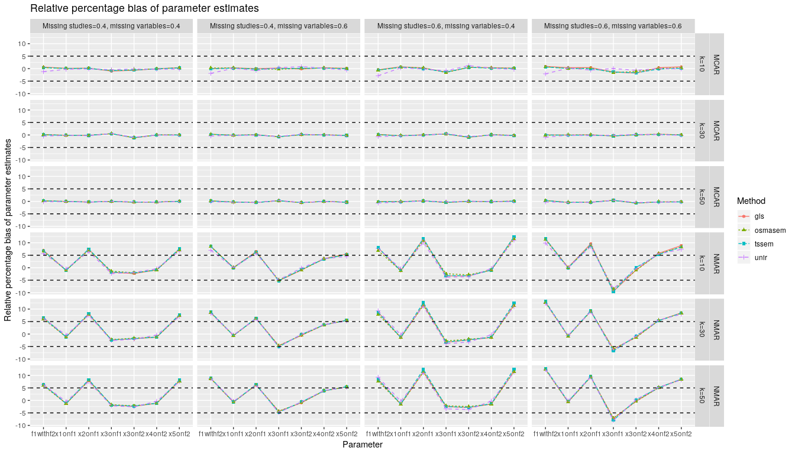
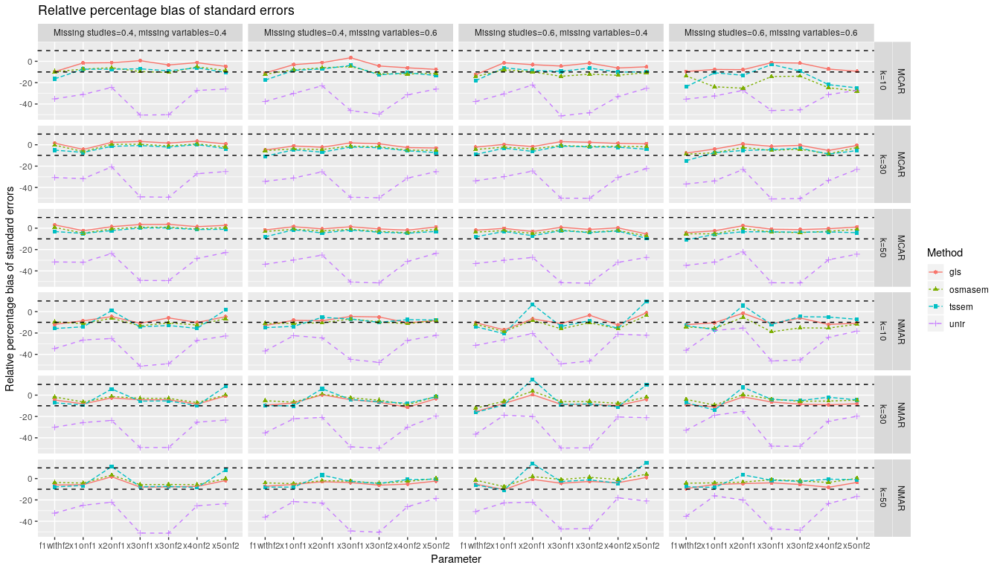

# Simulation
* *Note*. At least `metaSEM` version 1.2.2.1 is required in the simulation. If it is not available, you may need to install it from Github by using `devtools::install_github("mikewlcheung/metasem")`.

```r
## Libraries used in the simulation
for (i in c("metaSEM", "metafor", "ggplot2", "dplyr")) {
  if (!(i %in% rownames(installed.packages()))) install.packages(i)
}

library(metaSEM)
mxOption(key='Number of Threads', value=parallel::detectCores()-2)

## Get helper functions for the simulation
source("functions.R")

## Seed for reproducibility
set.seed(71286713)

## Sample size per study
n <- 100

## No. of replications
## Running the simulation or testing it?
run_simulation <- FALSE

if (run_simulation) {
  Rep <- 1000
} else {
  Rep <- 2
}

## No. of studies
k <- c(10, 30, 50)

## Percentage of studies with missing data
missing_studies <- c(.4, .6)

## Percentage of variables with missing data
missing_variables <- c(.4, .6)  

## Type of missing data
missing_type <- c("MCAR", "NMAR")

design <- expand.grid(k=k, missing_studies=missing_studies, missing_variables=missing_variables,
                      missing_type=missing_type, stringsAsFactors=FALSE)

## CFA model to generate data
Lambda <- matrix(c(.7, 0,
                   .6, 0,
                   .5, .5,
                   0, .7,
                   0, .6), ncol=2, nrow=5, byrow=TRUE)
Phi <- matrix(c(1, .6,
                .6, 1), ncol=2, nrow=2)
Sigma <- Lambda %*% Phi %*% t(Lambda)
Psi <- 1-diag(Sigma)

Lambda
Phi
Psi

diag(Sigma) <- 1
dimnames(Sigma) <- list(paste0("x", 1:5), paste0("x", 1:5))
Sigma

## Heterogeneity of correlation: SD_rho=0.1
Sigma_V <- diag(rep((0.1^2), 10))
Sigma_V

## Model for fitting
model <- "f1 =~ start(.7)*x1 + start(.6)*x2 + start(.5)*x3
          f2 =~ start(.5)*x3 + start(.7)*x4 + start(.6)*x5
          f1 ~~ start(.6)*f2
          x1 ~~ start(.51)*x1
          x2 ~~ start(.64)*x2
          x3 ~~ start(.20)*x3
          x4 ~~ start(.51)*x4
          x5 ~~ start(.64)*x5"
RAM <- lavaan2RAM(model, A.notation="on", S.notation="with")
RAM

## Population values of the parameters
parameters <- c("x1onf1", "x2onf1", "x3onf1", "x3onf2", "x4onf2", "x5onf2", "f1withf2")
pop <- c(Lambda[1:3, 1], Lambda[3:5,2], Phi[2,1])
names(pop) <- parameters
pop

## Store the simulation results
fit <- list()
for (i in seq_len(nrow(design))) {
  ## Total no. of conditions
  total <- nrow(design)
  
  fit[[i]] <- replicate(Rep,
                        run_it(k=design[i, "k"], 
                               n=n, 
                               missing_studies=design[i, "missing_studies"], 
                               missing_variables=design[i, "missing_variables"], 
                               missing_type=design[i, "missing_type"], 
                               Sigma=Sigma, 
                               Sigma_V=Sigma_V), 
                        simplify = FALSE)
  cat("Completed: ", i, " out of ", total, ".\n", sep="")
}
  
## Save everything
save.image(file="results.RData")
```

# Results

```r
library(ggplot2)
```

```
## Registered S3 methods overwritten by 'ggplot2':
##   method         from 
##   [.quosures     rlang
##   c.quosures     rlang
##   print.quosures rlang
```

```r
library(dplyr)
```

```
## 
## Attaching package: 'dplyr'
```

```
## The following objects are masked from 'package:stats':
## 
##     filter, lag
```

```
## The following objects are masked from 'package:base':
## 
##     intersect, setdiff, setequal, union
```

```r
load("results.RData")

## Get helper functions for the simulation and plotting
source("functions.R")

## Get the simulation setings
## fit: a list of 16 conditions
settings <- sapply(fit, function(cond) {
  ## Run by replications
  out <- cond[[1]]$settings[c("k", "n", "missing_studies", 
                              "missing_variables", "missing_type")]
  out
})

## Get the results
## fit: a list of 16 conditions
## cond: a list of 1000 replications
results <- (sapply(fit, function(cond) {
  ## Get the results per condition over 1000 replications
  out <- unlist(lapply(c("unir", "gls", "tssem", "osmasem"), 
                       extractFit, x=cond, pop=pop))
  out
}))
  
## Final results for tables and plotting
final.results <- data.frame(t(settings), t(results)) 

## Sort by conditions
final.results <- final.results[, c(2,5,1,3,4, 6:77)]
final.results <- final.results %>% arrange(missing_type, k, missing_studies, missing_variables)

## Write the results as aa CSV file
## write.csv(final.results, file="final_results.csv", row.names = FALSE)

## Table 5 in the paper
final.results %>% select(2:5, contains("mean")) %>% 
  knitr::kable(digits=2, caption="Table 5: Means of the test statistics (a chi-square test with 3 degrees of freedom for the proposed model)")
```


Table: Table 5: Means of the test statistics (a chi-square test with 3 degrees of freedom for the proposed model)

missing_type   k    missing_studies   missing_variables    unir.chisq.mean   gls.chisq.mean   tssem.chisq.mean   osmasem.chisq.mean
-------------  ---  ----------------  ------------------  ----------------  ---------------  -----------------  -------------------
MCAR           10   0.4               0.4                            12.03             3.49               3.94                 3.70
MCAR           10   0.4               0.6                            11.78             3.59               3.90                 3.80
MCAR           10   0.6               0.4                            12.21             3.60               3.85                 3.97
MCAR           10   0.6               0.6                            11.84             3.83               3.83                 4.20
MCAR           30   0.4               0.4                            11.62             2.89               3.18                 3.08
MCAR           30   0.4               0.6                            12.19             3.14               3.40                 3.31
MCAR           30   0.6               0.4                            12.77             3.17               3.43                 3.34
MCAR           30   0.6               0.6                            12.33             3.19               3.33                 3.35
MCAR           50   0.4               0.4                            11.70             2.85               3.10                 3.06
MCAR           50   0.4               0.6                            12.04             2.99               3.22                 3.18
MCAR           50   0.6               0.4                            13.09             3.14               3.35                 3.34
MCAR           50   0.6               0.6                            12.49             3.07               3.20                 3.23
NMAR           10   0.4               0.4                            12.86             4.26               4.15                 3.91
NMAR           10   0.4               0.6                            12.57             4.40               4.16                 3.79
NMAR           10   0.6               0.4                            14.30             5.16               4.52                 4.65
NMAR           10   0.6               0.6                            12.77             4.66               3.93                 4.19
NMAR           30   0.4               0.4                            14.81             4.41               4.15                 3.96
NMAR           30   0.4               0.6                            12.67             3.83               3.51                 3.42
NMAR           30   0.6               0.4                            17.02             5.50               4.87                 4.67
NMAR           30   0.6               0.6                            13.29             4.33               3.52                 3.59
NMAR           50   0.4               0.4                            16.31             4.64               4.39                 4.25
NMAR           50   0.4               0.6                            12.47             3.65               3.31                 3.28
NMAR           50   0.6               0.4                            19.55             6.00               5.42                 5.16
NMAR           50   0.6               0.6                            13.25             4.15               3.36                 3.48

```r
## Table 6 in the paper
final.results %>% select(2:5, contains("Type1")) %>% 
  knitr::kable(digits=2, caption="Table 6: Rejection percentages (alpha=.05) for testing the proposed model with df=3")
```


Table: Table 6: Rejection percentages (alpha=.05) for testing the proposed model with df=3

missing_type   k    missing_studies   missing_variables    unir.chisq.Type1   gls.chisq.Type1   tssem.chisq.Type1   osmasem.chisq.Type1
-------------  ---  ----------------  ------------------  -----------------  ----------------  ------------------  --------------------
MCAR           10   0.4               0.4                             60.00              9.90               12.70                  6.50
MCAR           10   0.4               0.6                             57.30             10.50               11.21                  5.30
MCAR           10   0.6               0.4                             56.70             10.60               11.50                  6.30
MCAR           10   0.6               0.6                             58.26             12.30               11.03                  6.80
MCAR           30   0.4               0.4                             57.36              4.10                6.50                  5.00
MCAR           30   0.4               0.6                             59.40              6.80                8.20                  7.10
MCAR           30   0.6               0.4                             59.60              7.20                8.30                  6.90
MCAR           30   0.6               0.6                             59.30              6.80                7.40                  6.70
MCAR           50   0.4               0.4                             57.70              5.30                6.20                  6.00
MCAR           50   0.4               0.6                             56.70              5.00                6.30                  5.60
MCAR           50   0.6               0.4                             62.30              5.80                7.40                  6.20
MCAR           50   0.6               0.6                             59.10              5.60                6.50                  6.20
NMAR           10   0.4               0.4                             63.00             14.51               12.00                  5.50
NMAR           10   0.4               0.6                             59.90             15.60               14.80                  6.80
NMAR           10   0.6               0.4                             66.60             20.92               15.00                  7.21
NMAR           10   0.6               0.6                             57.56             18.05               12.30                  6.40
NMAR           30   0.4               0.4                             68.10             16.00               13.40                 11.80
NMAR           30   0.4               0.6                             61.50             10.10                7.50                  6.40
NMAR           30   0.6               0.4                             71.80             24.60               19.90                 17.20
NMAR           30   0.6               0.6                             62.30             14.90                9.40                  7.40
NMAR           50   0.4               0.4                             71.90             17.10               15.80                 13.90
NMAR           50   0.4               0.6                             61.60              9.00                6.30                  5.40
NMAR           50   0.6               0.4                             81.40             25.90               20.70                 18.00
NMAR           50   0.6               0.6                             60.50             13.90                7.50                  8.00

```r
## Get the relative percentage bias of parameter estimates and their standard errors
est <- get_individual_stat(final.results, type="est")
se <- get_individual_stat(final.results, type="se")

## Replace the condition with parameter labels in plotting individual parameters
est$condition <- sapply(strsplit(est$condition, split="\\."), function(x) x[[2]])
se$condition <- sapply(strsplit(se$condition, split="\\."), function(x) x[[2]])

## Get the individual estimates for MCAR and plot it
p8 <- est %>%  
      ggplot(aes(x=condition, y=y, group=Method, colour=Method, 
                 shape=Method, linetype=Method)) + 
      geom_point() + geom_line() + 
      facet_grid(missing_type+k ~ missing_studies_variables) +
      scale_x_discrete(name="Parameter") +
      scale_y_continuous(name="Relative percentage bias of parameter estimates") +
      ggtitle("Relative percentage bias of parameter estimates") +
      geom_hline(yintercept = c(-5, 5), linetype = "dashed")

## Figure 8 in the paper
p8
```

<!-- -->

```r
## ggsave("Fig8.tiff", p8, width=14, height=8, compression = "lzw")

p9 <- se %>%  
      ggplot(aes(x=condition, y=y, group=Method, colour=Method, 
                 shape=Method, linetype=Method)) + 
      geom_point() + geom_line() + 
      facet_grid(missing_type+k ~ missing_studies_variables) +
      scale_x_discrete(name="Parameter") +
      scale_y_continuous(name="Relative percentage bias of standard errors") +
      ggtitle("Relative percentage bias of standard errors") +
      geom_hline(yintercept = c(-10, 10), linetype = "dashed")

## Figure 9 in the paper
p9
```

<!-- -->

```r
## ggsave("Fig9.tiff", p9, width=14, height=8, compression = "lzw")

sessionInfo()
```

```
## R version 3.6.0 (2019-04-26)
## Platform: x86_64-pc-linux-gnu (64-bit)
## Running under: Ubuntu 18.04.2 LTS
## 
## Matrix products: default
## BLAS:   /usr/lib/x86_64-linux-gnu/blas/libblas.so.3.7.1
## LAPACK: /usr/lib/x86_64-linux-gnu/lapack/liblapack.so.3.7.1
## 
## locale:
##  [1] LC_CTYPE=en_SG.UTF-8       LC_NUMERIC=C              
##  [3] LC_TIME=en_SG.UTF-8        LC_COLLATE=en_SG.UTF-8    
##  [5] LC_MONETARY=en_SG.UTF-8    LC_MESSAGES=en_SG.UTF-8   
##  [7] LC_PAPER=en_SG.UTF-8       LC_NAME=C                 
##  [9] LC_ADDRESS=C               LC_TELEPHONE=C            
## [11] LC_MEASUREMENT=en_SG.UTF-8 LC_IDENTIFICATION=C       
## 
## attached base packages:
## [1] stats     graphics  grDevices utils     datasets  methods   base     
## 
## other attached packages:
## [1] dplyr_0.8.1   ggplot2_3.1.1
## 
## loaded via a namespace (and not attached):
##  [1] Rcpp_1.0.1       knitr_1.22       magrittr_1.5     tidyselect_0.2.5
##  [5] munsell_0.5.0    colorspace_1.4-1 R6_2.4.0         rlang_0.3.4     
##  [9] highr_0.8        stringr_1.4.0    plyr_1.8.4       tools_3.6.0     
## [13] grid_3.6.0       gtable_0.3.0     xfun_0.7         withr_2.1.2     
## [17] htmltools_0.3.6  assertthat_0.2.1 yaml_2.2.0       lazyeval_0.2.2  
## [21] digest_0.6.18    tibble_2.1.1     crayon_1.3.4     reshape2_1.4.3  
## [25] tidyr_0.8.3      purrr_0.3.2      glue_1.3.1       evaluate_0.13   
## [29] rmarkdown_1.12   labeling_0.3     stringi_1.4.3    compiler_3.6.0  
## [33] pillar_1.4.0     scales_1.0.0     pkgconfig_2.0.2
```

