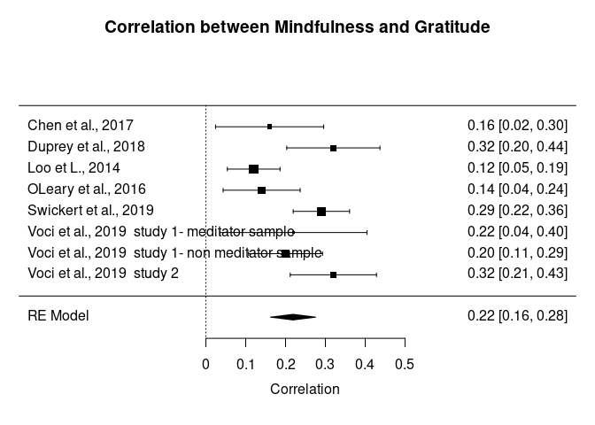
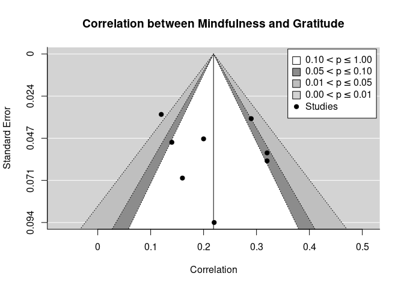
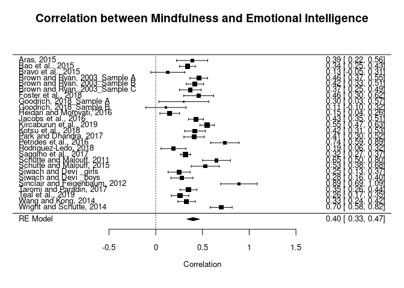
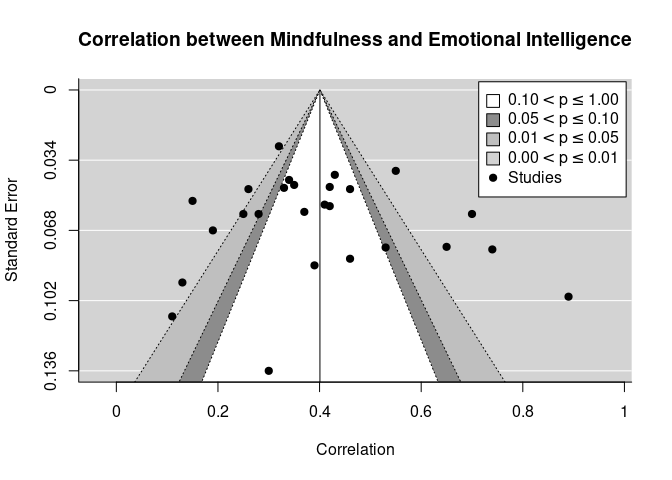
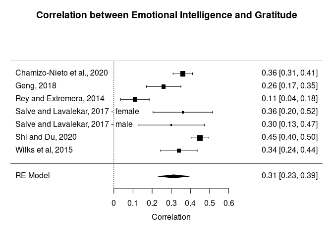
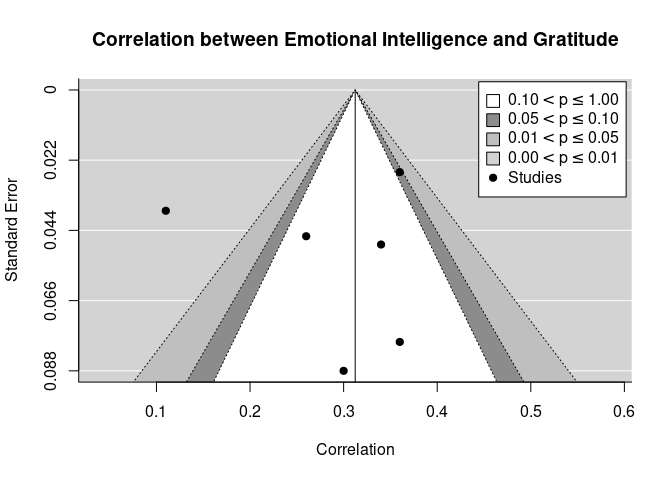

# TSSEM

## Data preparation

```r
## Whether to output figures as SVG format
plot.figures <- FALSE

library(metaSEM)
mxOption(key='Number of Threads', value=parallel::detectCores()-2)

## Read data
my.df <- foreign::read.spss("data.sav", use.value.labels = TRUE, to.data.frame=TRUE)
```

```
## Warning in foreign::read.spss("data.sav", use.value.labels = TRUE, to.data.frame
## = TRUE): data.sav: Very long string record(s) found (record type 7, subtype 14),
## each will be imported in consecutive separate variables
```

```r
## A function to convert rows into a 3x3 correlation matrix
create.matrix <- function(x, type=c(1, 2, 3)) {
  mat <- matrix(NA, ncol=3, nrow=3)
  diag(mat) <- 1
  type <- as.character(type)
  ## Mindfulness, EI, Gratitude
  ## 1: Mindfulness and EI
  ## 2: Mindfulness and Gratitude
  ## 3: EI and Gratitude
  switch(type,
         "1" = mat[1, 2] <- mat[2, 1] <- unlist(x),
         "2" = mat[1, 3] <- mat[3, 1] <- unlist(x),
         "3" = mat[2, 3] <- mat[3, 2] <- unlist(x))
  mat
}

varlist <- c("Mindfulness", "EI", "Gratitude")

my.cor <- lapply(split(my.df, seq(nrow(my.df))),
                 function(x, y) create.matrix(x["Effect_size"], x["Type_of_Association"]))
my.cor <- lapply(my.cor, function(x) {dimnames(x) <- list(varlist, varlist); x}  )
names(my.cor) <- my.df$Study_name

## Correlation matrices in the analysis
my.cor
```

```
## $`Aras, 2015                                        `
##             Mindfulness   EI Gratitude
## Mindfulness        1.00 0.39        NA
## EI                 0.39 1.00        NA
## Gratitude            NA   NA         1
## 
## $`Bao et al., 2015                                  `
##             Mindfulness   EI Gratitude
## Mindfulness        1.00 0.34        NA
## EI                 0.34 1.00        NA
## Gratitude            NA   NA         1
## 
## $`Bravo et al., 2015                                `
##             Mindfulness   EI Gratitude
## Mindfulness        1.00 0.13        NA
## EI                 0.13 1.00        NA
## Gratitude            NA   NA         1
## 
## $`Brown and Ryan, 2003_Sample A                     `
##             Mindfulness   EI Gratitude
## Mindfulness        1.00 0.46        NA
## EI                 0.46 1.00        NA
## Gratitude            NA   NA         1
## 
## $`Brown and Ryan, 2003_Sample B                     `
##             Mindfulness   EI Gratitude
## Mindfulness        1.00 0.42        NA
## EI                 0.42 1.00        NA
## Gratitude            NA   NA         1
## 
## $`Brown and Ryan, 2003_Sample C                     `
##             Mindfulness   EI Gratitude
## Mindfulness        1.00 0.37        NA
## EI                 0.37 1.00        NA
## Gratitude            NA   NA         1
## 
## $`Chamizo-Nieto et al., 2020                        `
##             Mindfulness   EI Gratitude
## Mindfulness           1   NA        NA
## EI                   NA 1.00      0.36
## Gratitude            NA 0.36      1.00
## 
## $`Chen et al., 2017                                 `
##             Mindfulness EI Gratitude
## Mindfulness        1.00 NA      0.16
## EI                   NA  1        NA
## Gratitude          0.16 NA      1.00
## 
## $`Duprey et al., 2018                               `
##             Mindfulness EI Gratitude
## Mindfulness        1.00 NA      0.32
## EI                   NA  1        NA
## Gratitude          0.32 NA      1.00
## 
## $`Foster et al., 2018                               `
##             Mindfulness   EI Gratitude
## Mindfulness        1.00 0.46        NA
## EI                 0.46 1.00        NA
## Gratitude            NA   NA         1
## 
## $`Loo et L., 2014                                   `
##             Mindfulness EI Gratitude
## Mindfulness        1.00 NA      0.12
## EI                   NA  1        NA
## Gratitude          0.12 NA      1.00
## 
## $`Geng, 2018                                        `
##             Mindfulness   EI Gratitude
## Mindfulness           1   NA        NA
## EI                   NA 1.00      0.26
## Gratitude            NA 0.26      1.00
## 
## $`Goodrich, 2018_Sample A                           `
##             Mindfulness  EI Gratitude
## Mindfulness         1.0 0.3        NA
## EI                  0.3 1.0        NA
## Gratitude            NA  NA         1
## 
## $`Goodrich, 2018_Sample B                           `
##             Mindfulness   EI Gratitude
## Mindfulness        1.00 0.11        NA
## EI                 0.11 1.00        NA
## Gratitude            NA   NA         1
## 
## $`Heidari and Morovati, 2016                        `
##             Mindfulness   EI Gratitude
## Mindfulness        1.00 0.15        NA
## EI                 0.15 1.00        NA
## Gratitude            NA   NA         1
## 
## $`Jacobs et al., 2016                               `
##             Mindfulness   EI Gratitude
## Mindfulness        1.00 0.43        NA
## EI                 0.43 1.00        NA
## Gratitude            NA   NA         1
## 
## $`Kircaburun et al., 2019                           `
##             Mindfulness   EI Gratitude
## Mindfulness        1.00 0.55        NA
## EI                 0.55 1.00        NA
## Gratitude            NA   NA         1
## 
## $`Kotsu et al., 2018                                `
##             Mindfulness   EI Gratitude
## Mindfulness        1.00 0.42        NA
## EI                 0.42 1.00        NA
## Gratitude            NA   NA         1
## 
## $`OLeary et al., 2016                               `
##             Mindfulness EI Gratitude
## Mindfulness        1.00 NA      0.14
## EI                   NA  1        NA
## Gratitude          0.14 NA      1.00
## 
## $`Park and Dhandra, 2017                            `
##             Mindfulness   EI Gratitude
## Mindfulness        1.00 0.41        NA
## EI                 0.41 1.00        NA
## Gratitude            NA   NA         1
## 
## $`Petrides et al., 2016                             `
##             Mindfulness   EI Gratitude
## Mindfulness        1.00 0.74        NA
## EI                 0.74 1.00        NA
## Gratitude            NA   NA         1
## 
## $`Rey and Extremera, 2014                           `
##             Mindfulness   EI Gratitude
## Mindfulness           1   NA        NA
## EI                   NA 1.00      0.11
## Gratitude            NA 0.11      1.00
## 
## $`Rodriguez-Ledo, 2018                              `
##             Mindfulness   EI Gratitude
## Mindfulness        1.00 0.19        NA
## EI                 0.19 1.00        NA
## Gratitude            NA   NA         1
## 
## $`Saggino et al., 2017                              `
##             Mindfulness   EI Gratitude
## Mindfulness        1.00 0.32        NA
## EI                 0.32 1.00        NA
## Gratitude            NA   NA         1
## 
## $`Salve and Lavalekar, 2017 - female                `
##             Mindfulness   EI Gratitude
## Mindfulness           1   NA        NA
## EI                   NA 1.00      0.36
## Gratitude            NA 0.36      1.00
## 
## $`Salve and Lavalekar, 2017 - male                  `
##             Mindfulness  EI Gratitude
## Mindfulness           1  NA        NA
## EI                   NA 1.0       0.3
## Gratitude            NA 0.3       1.0
## 
## $`Shi and Du, 2020                                  `
##             Mindfulness   EI Gratitude
## Mindfulness           1   NA        NA
## EI                   NA 1.00      0.45
## Gratitude            NA 0.45      1.00
## 
## $`Schutte and Malouff, 2011                         `
##             Mindfulness   EI Gratitude
## Mindfulness        1.00 0.65        NA
## EI                 0.65 1.00        NA
## Gratitude            NA   NA         1
## 
## $`Schutte and Malouff, 2015                         `
##             Mindfulness   EI Gratitude
## Mindfulness        1.00 0.53        NA
## EI                 0.53 1.00        NA
## Gratitude            NA   NA         1
## 
## $`Siwach and Devi _girls                            `
##             Mindfulness   EI Gratitude
## Mindfulness        1.00 0.25        NA
## EI                 0.25 1.00        NA
## Gratitude            NA   NA         1
## 
## $`Siwach and Devi _boys                             `
##             Mindfulness   EI Gratitude
## Mindfulness        1.00 0.28        NA
## EI                 0.28 1.00        NA
## Gratitude            NA   NA         1
## 
## $`Sinclair and Feigenbaum, 2012                     `
##             Mindfulness   EI Gratitude
## Mindfulness        1.00 0.89        NA
## EI                 0.89 1.00        NA
## Gratitude            NA   NA         1
## 
## $`Swickert et al., 2019                             `
##             Mindfulness EI Gratitude
## Mindfulness        1.00 NA      0.29
## EI                   NA  1        NA
## Gratitude          0.29 NA      1.00
## 
## $`Taromi and Paradin, 2017                          `
##             Mindfulness   EI Gratitude
## Mindfulness        1.00 0.35        NA
## EI                 0.35 1.00        NA
## Gratitude            NA   NA         1
## 
## $`Teal et al., 2019                                 `
##             Mindfulness   EI Gratitude
## Mindfulness        1.00 0.26        NA
## EI                 0.26 1.00        NA
## Gratitude            NA   NA         1
## 
## $`Voci et al., 2019  study 1- meditator sample      `
##             Mindfulness EI Gratitude
## Mindfulness        1.00 NA      0.22
## EI                   NA  1        NA
## Gratitude          0.22 NA      1.00
## 
## $`Voci et al., 2019  study 1- non meditator sample  `
##             Mindfulness EI Gratitude
## Mindfulness         1.0 NA       0.2
## EI                   NA  1        NA
## Gratitude           0.2 NA       1.0
## 
## $`Voci et al., 2019  study 2                        `
##             Mindfulness EI Gratitude
## Mindfulness        1.00 NA      0.32
## EI                   NA  1        NA
## Gratitude          0.32 NA      1.00
## 
## $`Wang and Kong, 2014                               `
##             Mindfulness   EI Gratitude
## Mindfulness        1.00 0.33        NA
## EI                 0.33 1.00        NA
## Gratitude            NA   NA         1
## 
## $`Wilks et al, 2015                                 `
##             Mindfulness   EI Gratitude
## Mindfulness           1   NA        NA
## EI                   NA 1.00      0.34
## Gratitude            NA 0.34      1.00
## 
## $`Wright and Schutte, 2014                          `
##             Mindfulness  EI Gratitude
## Mindfulness         1.0 0.7        NA
## EI                  0.7 1.0        NA
## Gratitude            NA  NA         1
```

```r
## Sample sizes
my.n <- my.df$N
my.n
```

```
##  [1]  100  380   83  313  327  207 1157  190  256  108  801  365   39   60  250
## [16]  427  470  228  375  234  121  535  156  970  123   99 1392  125  124  200
## [31]  200   72  700  341  313  103  406  299  321  327  200
```

```r
## Number of studies in each cell
pattern.na(my.cor, show.na = FALSE)
```

```
##             Mindfulness EI Gratitude
## Mindfulness          41 26         8
## EI                   26 41         7
## Gratitude             8  7        41
```

```r
## Total sample sizes in each cell
pattern.n(my.cor, my.n)
```

```
##             Mindfulness    EI Gratitude
## Mindfulness       13497  6369      3130
## EI                 6369 13497      3998
## Gratitude          3130  3998     13497
```

## First-stage of analysis

```r
## Stage 1 analysis: find an average correlation matrix
stage1 <- tssem1(my.cor, my.n)
summary(stage1)
```

```
## 
## Call:
## meta(y = ES, v = acovR, RE.constraints = Diag(paste0(RE.startvalues, 
##     "*Tau2_", 1:no.es, "_", 1:no.es)), RE.lbound = RE.lbound, 
##     I2 = I2, model.name = model.name, suppressWarnings = TRUE, 
##     silent = silent, run = run)
## 
## 95% confidence intervals: z statistic approximation (robust=FALSE)
## Coefficients:
##              Estimate  Std.Error     lbound     ubound z value  Pr(>|z|)    
## Intercept1  0.4003279  0.0335683  0.3345353  0.4661205 11.9258 < 2.2e-16 ***
## Intercept2  0.2185611  0.0292426  0.1612467  0.2758756  7.4741 7.772e-14 ***
## Intercept3  0.3127942  0.0424903  0.2295147  0.3960737  7.3615 1.819e-13 ***
## Tau2_1_1    0.0236850  0.0087361  0.0065625  0.0408074  2.7112  0.006705 ** 
## Tau2_2_2    0.0037272  0.0030628 -0.0022758  0.0097302  1.2169  0.223637    
## Tau2_3_3    0.0094888  0.0060251 -0.0023202  0.0212978  1.5749  0.115287    
## ---
## Signif. codes:  0 '***' 0.001 '**' 0.01 '*' 0.05 '.' 0.1 ' ' 1
## 
## Q statistic on the homogeneity of effect sizes: 206.894
## Degrees of freedom of the Q statistic: 38
## P value of the Q statistic: 0
## 
## Heterogeneity indices (based on the estimated Tau2):
##                              Estimate
## Intercept1: I2 (Q statistic)   0.8911
## Intercept2: I2 (Q statistic)   0.5473
## Intercept3: I2 (Q statistic)   0.7577
## 
## Number of studies (or clusters): 41
## Number of observed statistics: 41
## Number of estimated parameters: 6
## Degrees of freedom: 35
## -2 log likelihood: -44.79331 
## OpenMx status1: 0 ("0" or "1": The optimization is considered fine.
## Other values may indicate problems.)
```

```r
## Average correlation matrix
meanR <- vec2symMat(coef(stage1, select = "fixed"), diag = FALSE)
dimnames(meanR) <- list(varlist, varlist)
meanR
```

```
##             Mindfulness        EI Gratitude
## Mindfulness   1.0000000 0.4003279 0.2185611
## EI            0.4003279 1.0000000 0.3127942
## Gratitude     0.2185611 0.3127942 1.0000000
```

```r
## Absolute heterogeneity variance: tau^2
tau2 <- vec2symMat(coef(stage1, select = "random"), diag = FALSE)
dimnames(tau2) <- list(varlist, varlist)
tau2
```

```
##             Mindfulness          EI   Gratitude
## Mindfulness 1.000000000 0.023684963 0.003727185
## EI          0.023684963 1.000000000 0.009488765
## Gratitude   0.003727185 0.009488765 1.000000000
```

```r
## Relative heterogeneity index: I^2
I2 <- vec2symMat(summary(stage1)$I2.values[, "Estimate"], diag = FALSE)
dimnames(I2) <- list(varlist, varlist)
I2
```

```
##             Mindfulness        EI Gratitude
## Mindfulness   1.0000000 0.8911061 0.5472690
## EI            0.8911061 1.0000000 0.7577408
## Gratitude     0.5472690 0.7577408 1.0000000
```

## Second-stage of analysis

```r
## Proposed model
model <- "Gratitude ~ c*Mindfulness + b*EI
          EI ~ a*Mindfulness
          Mindfulness ~~ 1*Mindfulness"
plot(model, color="yellow")
```

<!-- -->

```r
RAM1 <- lavaan2RAM(model, obs.variables = varlist)
RAM1
```

```
## $A
##             Mindfulness EI    Gratitude
## Mindfulness "0"         "0"   "0"      
## EI          "0*a"       "0"   "0"      
## Gratitude   "0*c"       "0*b" "0"      
## 
## $S
##             Mindfulness EI           Gratitude                 
## Mindfulness "1"         "0"          "0"                       
## EI          "0"         "0*EIWITHEI" "0"                       
## Gratitude   "0"         "0"          "0*GratitudeWITHGratitude"
## 
## $F
##             Mindfulness EI Gratitude
## Mindfulness           1  0         0
## EI                    0  1         0
## Gratitude             0  0         1
## 
## $M
##   Mindfulness EI Gratitude
## 1           0  0         0
```

```r
## Stage 2 analysis: fit the path model
stage2 <- tssem2(stage1, RAM=RAM1, intervals.type = "LB",
                 mx.algebras = list(Indirect=mxAlgebra(a*b, name="Indirect"),
                                    Direct=mxAlgebra(c, name="Direct")))
summary(stage2)
```

```
## 
## Call:
## wls(Cov = pooledS, aCov = aCov, n = tssem1.obj$total.n, RAM = RAM, 
##     Amatrix = Amatrix, Smatrix = Smatrix, Fmatrix = Fmatrix, 
##     diag.constraints = diag.constraints, cor.analysis = cor.analysis, 
##     intervals.type = intervals.type, mx.algebras = mx.algebras, 
##     model.name = model.name, suppressWarnings = suppressWarnings, 
##     silent = silent, run = run)
## 
## 95% confidence intervals: Likelihood-based statistic
## Coefficients:
##   Estimate Std.Error   lbound   ubound z value Pr(>|z|)
## a 0.400328        NA 0.334430 0.466134      NA       NA
## b 0.268296        NA 0.164827 0.371733      NA       NA
## c 0.111155        NA 0.027787 0.190730      NA       NA
## 
## mxAlgebras objects (and their 95% likelihood-based CIs):
##                   lbound  Estimate    ubound
## Indirect[1,1] 0.06535370 0.1074063 0.1565308
## Direct[1,1]   0.02778714 0.1111548 0.1907302
## 
## Goodness-of-fit indices:
##                                               Value
## Sample size                                13497.00
## Chi-square of target model                     0.00
## DF of target model                             0.00
## p value of target model                        0.00
## Number of constraints imposed on "Smatrix"     0.00
## DF manually adjusted                           0.00
## Chi-square of independence model             252.28
## DF of independence model                       3.00
## RMSEA                                          0.00
## RMSEA lower 95% CI                             0.00
## RMSEA upper 95% CI                             0.00
## SRMR                                           0.00
## TLI                                            -Inf
## CFI                                            1.00
## AIC                                            0.00
## BIC                                            0.00
## OpenMx status1: 0 ("0" or "1": The optimization is considered fine.
## Other values indicate problems.)
```

```r
plot(stage2, color="yellow")
```

<!-- -->

```r
# svg("Fig4.svg", width=5, height=5)
# plot(stage2, col="yellow")
# dev.off()

## Testing the hypothesis c = a*b
stage2b <- tssem2(stage1, RAM=RAM1, intervals.type = "LB",
                 mx.algebras = list(Indirect=mxAlgebra(a*b, name="Indirect"),
                                    Direct=mxAlgebra(c, name="Direct")),
                 run=FALSE)
## Add a constraint on c=a*b
## Rerun to remove errors
stage2b <- mxModel(stage2b, mxConstraint(c==a*b, name="constraint"))
stage2b <- mxRun(stage2b)
```

```
## Warning: In model 'TSSEM2 Correlation' Optimizer returned a non-zero status
## code 6. The model does not satisfy the first-order optimality conditions to the
## required accuracy, and no improved point for the merit function could be found
## during the final linesearch (Mx status RED)
```

```r
stage2b <- mxTryHard(stage2b, extraTries = 100)
```



```r
stage2b <- mxRun(stage2b, intervals = TRUE)
summary(stage2b)
```

```
## Summary of TSSEM2 Correlation 
##  
## free parameters:
##   name  matrix       row         col  Estimate  Std.Error A
## 1    a Amatrix        EI Mindfulness 0.4009621 0.03197103 !
## 2    c Amatrix Gratitude Mindfulness 0.1086665 0.01082088 !
## 3    b Amatrix Gratitude          EI 0.2710144 0.02929168 !
## 
## confidence intervals:
##                                      lbound  estimate    ubound note
## a                                0.33900368 0.4009621 0.4646029     
## c                                0.08763721 0.1086665 0.1301478     
## b                                0.21574497 0.2710144 0.3308798     
## TSSEM2 Correlation.Indirect[1,1] 0.08767906 0.1086665 0.1301593     
## TSSEM2 Correlation.Direct[1,1]   0.08763721 0.1086665 0.1301478     
## 
## Model Statistics: 
##                |  Parameters  |  Degrees of Freedom  |  Fit (-2lnL units)
##        Model:              3                     -2           0.003898117
##    Saturated:             NA                     NA                    NA
## Independence:             NA                     NA                    NA
## Number of observations/statistics: 0/1
## 
## Constraint 'constraint' contributes 1 observed statistic. 
## 
## Information Criteria: 
##       |  df Penalty  |  Parameters Penalty  |  Sample-Size Adjusted
## AIC:             NA                     NA                       NA
## BIC:             NA                     NA                       NA
## CFI: NA 
## TLI: 1   (also known as NNFI) 
## RMSEA:  0  [95% CI (NA, NA)]
## Prob(RMSEA <= 0.05): NA
## To get additional fit indices, see help(mxRefModels)
## timestamp: 2021-04-07 12:22:49 
## Wall clock time: 0.2016566 secs 
## optimizer:  SLSQP 
## OpenMx version number: 2.19.1 
## Need help?  See help(mxSummary)
```

```r
anova(stage2$mx.fit, stage2b)
```

```
##                 base         comparison ep     minus2LL df      AIC      diffLL
## 1 TSSEM2 Correlation               <NA>  3 1.555104e-26 -3 6.000000          NA
## 2 TSSEM2 Correlation TSSEM2 Correlation  3 3.898117e-03 -2 6.003898 0.003898117
##   diffdf         p
## 1     NA        NA
## 2      1 0.9502165
```

# OSMASEM

## Data preparation

```r
## Mindfulness scale for the correlation between mindfulness and EI
table(my.df[my.df$Type_of_Association=="mindfulness and emotional intelligence", "Mindfulness_Scale"], useNA="always")
```

```
## 
##     FFMQ Freiburg     MAAS kentucky    other     CAMM     <NA> 
##        3        3       12        1        3        4        0
```

```r
## Mindfulness scale for the correlation between mindfulness and gratitude
table(my.df[my.df$Type_of_Association=="mindfulness and gratitude", "Mindfulness_Scale"], useNA="always")
```

```
## 
##     FFMQ Freiburg     MAAS kentucky    other     CAMM     <NA> 
##        1        0        6        0        1        0        0
```

```r
## Indicators for mindfulness scale
FFMQ<- ifelse(my.df$Mindfulness_Scale=="FFMQ", yes=1, no=0)
Freiburg<- ifelse(my.df$Mindfulness_Scale=="Freiburg", yes=1, no=0)
MAAS<- ifelse(my.df$Mindfulness_Scale=="MAAS", yes=1, no=0)
kentucky<- ifelse(my.df$Mindfulness_Scale=="kentucky", yes=1, no=0)
CAMM <- ifelse(my.df$Mindfulness_Scale=="CAMM", yes=1, no=0)
other<- ifelse(my.df$Mindfulness_Scale=="other", yes=1, no=0)

FFMQ[is.na(FFMQ)] <- 0
Freiburg[is.na(Freiburg)] <- 0
MAAS[is.na(MAAS)] <- 0
kentucky[is.na(kentucky)] <- 0
CAMM[is.na(CAMM)] <- 0
other[is.na(other)] <- 0

tssem.df <- list(data=my.cor, 
                 n=my.n,
                 ## Center the Age and Female for ease of interpretations
                 Age=c(scale(my.df$Age, scale=FALSE)), 
                 Female=c(scale(my.df$Percent_female, scale=FALSE)),
                 Publish=ifelse(my.df$Publication_status=="published", yes=1, no=0),
                 FFMQ=FFMQ,
                 Freiburg=Freiburg,
                 MAAS=MAAS,
                 kentucky=kentucky,
                 CAMM=CAMM,
                 other=other)

## Summary of mean age
summary(tssem.df$Age)
```

```
##    Min. 1st Qu.  Median    Mean 3rd Qu.    Max.    NA's 
## -15.214  -6.714  -3.214   0.000   6.786  21.786       6
```

```r
## Summary of percentage of female participants
summary(tssem.df$Female)
```

```
##     Min.  1st Qu.   Median     Mean  3rd Qu.     Max.     NA's 
## -59.0764  -8.5764   0.9236   0.0000  15.4236  40.9236        2
```

```r
## No. of studies published vs. unpublished
table(tssem.df$Publish)
```

```
## 
##  0  1 
##  4 37
```

```r
os.df <- Cor2DataFrame(tssem.df)

## Show the first few studies
# head(os.df)

## Checking only
# os.fit0 <- osmasem("No moderator", RAM=RAM1, data=os.df)
# summary(os.fit0)
# VarCorr(os.fit0)
# plot(os.fit0)
```

## Mindfulness scale

```r
## Select data without missing data in Female
indexMindScale <- !is.na(os.df$data$FFMQ)

## Note that some studies are dropped because of missing values in mindfulness scale
os.fit0 <- osmasem("No moderator", RAM=RAM1, data=os.df)
summary(os.fit0)
```

```
## Summary of No moderator 
##  
## free parameters:
##     name  matrix       row         col   Estimate  Std.Error A    z value
## 1      a      A0        EI Mindfulness  0.4007062 0.03424717    11.700418
## 2      c      A0 Gratitude Mindfulness  0.1115576 0.04096329     2.723356
## 3      b      A0 Gratitude          EI  0.2676671 0.05157294     5.190068
## 4 Tau1_1 vecTau1         1           1 -1.8238506 0.17208237   -10.598707
## 5 Tau1_2 vecTau1         2           1 -2.7763804 0.39391170    -7.048230
## 6 Tau1_3 vecTau1         3           1 -2.3230692 0.30673182    -7.573617
##       Pr(>|z|)
## 1 0.000000e+00
## 2 6.462238e-03
## 3 2.102169e-07
## 4 0.000000e+00
## 5 1.812106e-12
## 6 3.619327e-14
## 
## Model Statistics: 
##                |  Parameters  |  Degrees of Freedom  |  Fit (-2lnL units)
##        Model:              6                     35             -44.57614
##    Saturated:              9                     32                    NA
## Independence:              6                     35                    NA
## Number of observations/statistics: 13497/41
## 
## Information Criteria: 
##       |  df Penalty  |  Parameters Penalty  |  Sample-Size Adjusted
## AIC:      -114.5761              -32.57614               -32.569917
## BIC:      -377.4339               12.48519                -6.582242
## To get additional fit indices, see help(mxRefModels)
## timestamp: 2021-04-07 12:22:52 
## Wall clock time: 0.1344659 secs 
## optimizer:  SLSQP 
## OpenMx version number: 2.19.1 
## Need help?  See help(mxSummary)
```

```r
## Create several A matrices to test the moderating effect from Mindfulness to EI [2,1]
A_FFMQ <- matrix(0, ncol=3, nrow=3,
                 dimnames = list(c("Mindfulness", "EI", "Gratitude"),
                                 c("Mindfulness", "EI", "Gratitude")))
A_Freiburg <- A_MAAS <- A_kentucky <- A_CAMM <- A_other <- A_FFMQ
A_FFMQ[2,1] <- "0*data.FFMQ"
A_Freiburg[2,1] <- "0*data.Freiburg"
A_MAAS[2,1] <- "0*data.MAAS"
A_kentucky[2,1] <- "0*data.kentucky"
A_CAMM[2,1] <- "0*data.CAMM"
## A_other[2,1] <- "0*data.other"

## A_other is not included as it is used as the reference. 
os.fitMind <- osmasem("Mindfulness scale", RAM=RAM1, data=os.df,
                      Ax=list(A_FFMQ, A_Freiburg, A_MAAS, A_kentucky, A_CAMM))
summary(os.fitMind)
```

```
## Summary of Mindfulness scale 
##  
## free parameters:
##      name  matrix       row         col   Estimate  Std.Error A    z value
## 1       a      A0        EI Mindfulness  0.2326304 0.08119947     2.864925
## 2       c      A0 Gratitude Mindfulness  0.1121178 0.03595105     3.118624
## 3       b      A0 Gratitude          EI  0.2823179 0.04593234     6.146386
## 4     a_1      A1        EI Mindfulness  0.3829792 0.10553114     3.629063
## 5     a_2      A2        EI Mindfulness  0.3977464 0.10822419     3.675208
## 6     a_3      A3        EI Mindfulness  0.1141373 0.08781526     1.299744
## 7     a_4      A4        EI Mindfulness  0.1973696 0.13632426     1.447796
## 8     a_5      A5        EI Mindfulness  0.1053107 0.10117716     1.040855
## 9  Tau1_1 vecTau1         1           1 -2.2877932 0.19414487   -11.783949
## 10 Tau1_2 vecTau1         2           1 -2.8397776 0.45874477    -6.190321
## 11 Tau1_3 vecTau1         3           1 -2.3217519 0.30686154    -7.566122
##        Pr(>|z|)
## 1  4.171086e-03
## 2  1.816976e-03
## 3  7.926808e-10
## 4  2.844517e-04
## 5  2.376558e-04
## 6  1.936888e-01
## 7  1.476743e-01
## 8  2.979429e-01
## 9  0.000000e+00
## 10 6.004164e-10
## 11 3.841372e-14
## 
## Model Statistics: 
##                |  Parameters  |  Degrees of Freedom  |  Fit (-2lnL units)
##        Model:             11                     30             -65.43036
##    Saturated:              9                     32                    NA
## Independence:              6                     35                    NA
## Number of observations/statistics: 13497/41
## 
## Information Criteria: 
##       |  df Penalty  |  Parameters Penalty  |  Sample-Size Adjusted
## AIC:      -125.4304              -43.43036               -43.410779
## BIC:      -350.7370               39.18209                 4.225131
## CFI: NA 
## TLI: 1   (also known as NNFI) 
## RMSEA:  0  [95% CI (NA, NA)]
## Prob(RMSEA <= 0.05): NA
## To get additional fit indices, see help(mxRefModels)
## timestamp: 2021-04-07 12:22:52 
## Wall clock time: 0.193166 secs 
## optimizer:  SLSQP 
## OpenMx version number: 2.19.1 
## Need help?  See help(mxSummary)
```

```r
anova(os.fitMind, os.fit0)
```

```
##                base   comparison ep  minus2LL df       AIC   diffLL diffdf
## 1 Mindfulness scale         <NA> 11 -65.43036 30 -43.43036       NA     NA
## 2 Mindfulness scale No moderator  6 -44.57614 35 -32.57614 20.85421      5
##              p
## 1           NA
## 2 0.0008630722
```

```r
## Compute the path coefficients on each mindfulness scale
est <- c(mxEval(c(a, a+a_1, a+a_2, a+a_3, a+a_4, a+a_5), os.fitMind$mx.fit))
names(est) <- c("Other", "FFMQ", "Freiburg", "MAAS", "Kentucky", "CAMM")

Cov <- mxSE(rbind(a, a+a_1, a+a_2, a+a_3, a+a_4, a+a_5), os.fitMind$mx.fit, details = TRUE,
           silent=TRUE)$Cov
dimnames(Cov) <- list(c("Other", "FFMQ", "Freiburg", "MAAS", "Kentucky", "CAMM"),
                      c("Other", "FFMQ", "Freiburg", "MAAS", "Kentucky", "CAMM"))
se <- sqrt(diag(Cov))

p <- 2*pnorm(-abs(est/se))
z <- qnorm(.975)
lbound <- est - z*se
ubound <- est + z*se
Mindscale <- cbind(est, se, p, lbound, ubound)
dimnames(Mindscale) <- list(c("Other", "FFMQ", "Freiburg", "MAAS", "Kentucky", "CAMM"),
                            c("Estimate", "se", "p value", "lbound (95%)", "ubound (95%)"))  
Mindscale
```

```
##           Estimate         se      p value lbound (95%) ubound (95%)
## Other    0.2326304 0.08119947 4.171086e-03   0.07348232    0.3917784
## FFMQ     0.6156095 0.07081029 3.505563e-18   0.47682392    0.7543952
## Freiburg 0.6303768 0.07141328 1.073628e-18   0.49040932    0.7703442
## MAAS     0.3467677 0.03307564 1.022343e-25   0.28194063    0.4115947
## Kentucky 0.4300000 0.10950319 8.607411e-05   0.21537770    0.6446223
## CAMM     0.3379411 0.06012789 1.905469e-08   0.22009261    0.4557896
```

```r
## Compute the post-hoc comparisons with adjusted with multiple comparisons 
library(cg)
comp <- comparisons(est, Cov, endptscale = "original", type = "pairwise", mcadjust=TRUE, display="none")
```

```
## 
## Some time may be needed as the critical point from the multcomp::summary.glht
## function call is calculated. Please wait...
```

```r
knitr::kable(comp, caption="Comparisons Table: Differences (A-B)\n95% Confidence (alpha of 0.05), Multiplicity Adjusted")
```


Table: Comparisons Table: Differences (A-B)
95% Confidence (alpha of 0.05), Multiplicity Adjusted

|                      |   estimate|        se|    lowerci|    upperci|      pval|     meanA|       seA|     meanB|       seB|
|:---------------------|----------:|---------:|----------:|----------:|---------:|---------:|---------:|---------:|---------:|
|FFMQ vs. Other        |  0.3829792| 0.1055311|  0.0851246|  0.6808338| 0.0035966| 0.6156095| 0.0708103| 0.2326304| 0.0811995|
|Freiburg vs. Other    |  0.3977464| 0.1082242|  0.0922909|  0.7032020| 0.0028964| 0.6303768| 0.0714133| 0.2326304| 0.0811995|
|MAAS vs. Other        |  0.1141373| 0.0878153| -0.1337154|  0.3619900| 0.7721869| 0.3467677| 0.0330756| 0.2326304| 0.0811995|
|Kentucky vs. Other    |  0.1973696| 0.1363243| -0.1873965|  0.5821357| 0.6815335| 0.4300000| 0.1095032| 0.2326304| 0.0811995|
|CAMM vs. Other        |  0.1053107| 0.1011772| -0.1802550|  0.3908765| 0.8968291| 0.3379411| 0.0601279| 0.2326304| 0.0811995|
|Freiburg vs. FFMQ     |  0.0147672| 0.1006840| -0.2694066|  0.2989411| 0.9999896| 0.6303768| 0.0714133| 0.6156095| 0.0708103|
|MAAS vs. FFMQ         | -0.2688418| 0.0778132| -0.4884643| -0.0492194| 0.0067036| 0.3467677| 0.0330756| 0.6156095| 0.0708103|
|Kentucky vs. FFMQ     | -0.1856095| 0.1304034| -0.5536644|  0.1824453| 0.6971492| 0.4300000| 0.1095032| 0.6156095| 0.0708103|
|CAMM vs. FFMQ         | -0.2776684| 0.0930777| -0.5403741| -0.0149627| 0.0315851| 0.3379411| 0.0601279| 0.6156095| 0.0708103|
|MAAS vs. Freiburg     | -0.2836091| 0.0786681| -0.5056446| -0.0615736| 0.0039250| 0.3467677| 0.0330756| 0.6303768| 0.0714133|
|Kentucky vs. Freiburg | -0.2003768| 0.1307318| -0.5693586|  0.1686050| 0.6257507| 0.4300000| 0.1095032| 0.6303768| 0.0714133|
|CAMM vs. Freiburg     | -0.2924357| 0.0933394| -0.5558798| -0.0289916| 0.0198564| 0.3379411| 0.0601279| 0.6303768| 0.0714133|
|Kentucky vs. MAAS     |  0.0832323| 0.1143895| -0.2396243|  0.4060889| 0.9766192| 0.4300000| 0.1095032| 0.3467677| 0.0330756|
|CAMM vs. MAAS         | -0.0088266| 0.0685697| -0.2023599|  0.1847067| 0.9999946| 0.3379411| 0.0601279| 0.3467677| 0.0330756|
|CAMM vs. Kentucky     | -0.0920589| 0.1249252| -0.4446520|  0.2605342| 0.9752818| 0.3379411| 0.0601279| 0.4300000| 0.1095032|

## Mean age

```r
## Select data without missing data in Age
indexAge <- !is.na(os.df$data$Age)

## For checking only
os.fit0 <- osmasem("No moderator", RAM=RAM1, data=os.df, subset.rows=indexAge)
summary(os.fit0)
```

```
## Summary of No moderator 
##  
## free parameters:
##     name  matrix       row         col   Estimate  Std.Error A   z value
## 1      a      A0        EI Mindfulness  0.4421576 0.03757034   11.768793
## 2      c      A0 Gratitude Mindfulness  0.1003077 0.04404273    2.277508
## 3      b      A0 Gratitude          EI  0.2680171 0.05424115    4.941213
## 4 Tau1_1 vecTau1         1           1 -1.8551628 0.19663876   -9.434370
## 5 Tau1_2 vecTau1         2           1 -2.7763804 0.39391171   -7.048230
## 6 Tau1_3 vecTau1         3           1 -2.3230692 0.30673180   -7.573617
##       Pr(>|z|)
## 1 0.000000e+00
## 2 2.275590e-02
## 3 7.763794e-07
## 4 0.000000e+00
## 5 1.812106e-12
## 6 3.619327e-14
## 
## Model Statistics: 
##                |  Parameters  |  Degrees of Freedom  |  Fit (-2lnL units)
##        Model:              6                     29              -42.3165
##    Saturated:              9                     26                    NA
## Independence:              6                     29                    NA
## Number of observations/statistics: 12648/35
## 
## Information Criteria: 
##       |  df Penalty  |  Parameters Penalty  |  Sample-Size Adjusted
## AIC:      -100.3165              -30.31650               -30.309850
## BIC:      -316.2289               14.35503                -4.712343
## To get additional fit indices, see help(mxRefModels)
## timestamp: 2021-04-07 12:22:55 
## Wall clock time: 0.1465487 secs 
## optimizer:  SLSQP 
## OpenMx version number: 2.19.1 
## Need help?  See help(mxSummary)
```

```r
A.A <- create.modMatrix(RAM1, mod="Age")
os.fitA <- osmasem("Age as a moderator", RAM=RAM1, Ax=A.A, data=os.df, 
                   subset.rows=indexAge)
os.fitA <- rerun(os.fitA)
```



```r
summary(os.fitA)
```

```
## Summary of Age as a moderator 
##  
## free parameters:
##     name  matrix       row         col     Estimate   Std.Error A    z value
## 1      a      A0        EI Mindfulness  0.433235141 0.029135786   14.8695196
## 2      c      A0 Gratitude Mindfulness  0.148968318 0.067133180    2.2189969
## 3      b      A0 Gratitude          EI  0.184900845 0.115146095    1.6057934
## 4    a_1      A1        EI Mindfulness  0.009301524 0.002712393    3.4292686
## 5    c_1      A1 Gratitude Mindfulness  0.002458201 0.011064136    0.2221774
## 6    b_1      A1 Gratitude          EI -0.012783070 0.017621446   -0.7254268
## 7 Tau1_1 vecTau1         1           1 -2.160824918 0.217401896   -9.9393104
## 8 Tau1_2 vecTau1         2           1 -2.780188371 0.401238969   -6.9290089
## 9 Tau1_3 vecTau1         3           1 -2.400005940 0.314988441   -7.6193461
##       Pr(>|z|)
## 1 0.000000e+00
## 2 2.648694e-02
## 3 1.083193e-01
## 4 6.052103e-04
## 5 8.241758e-01
## 6 4.681902e-01
## 7 0.000000e+00
## 8 4.237943e-12
## 9 2.553513e-14
## 
## Model Statistics: 
##                |  Parameters  |  Degrees of Freedom  |  Fit (-2lnL units)
##        Model:              9                     26             -53.01342
##    Saturated:              9                     26                    NA
## Independence:              6                     29                    NA
## Number of observations/statistics: 12648/35
## 
## Information Criteria: 
##       |  df Penalty  |  Parameters Penalty  |  Sample-Size Adjusted
## AIC:      -105.0134              -35.01342               -34.999179
## BIC:      -298.5900               31.99387                 3.392807
## CFI: NA 
## TLI: 1   (also known as NNFI) 
## RMSEA:  0  [95% CI (NA, NA)]
## Prob(RMSEA <= 0.05): NA
## To get additional fit indices, see help(mxRefModels)
## timestamp: 2021-04-07 12:22:55 
## Wall clock time: 0.172797 secs 
## optimizer:  SLSQP 
## OpenMx version number: 2.19.1 
## Need help?  See help(mxSummary)
```

```r
anova(os.fitA, os.fit0)
```

```
##                 base   comparison ep  minus2LL df       AIC   diffLL diffdf
## 1 Age as a moderator         <NA>  9 -53.01342 26 -35.01342       NA     NA
## 2 Age as a moderator No moderator  6 -42.31650 29 -30.31650 10.69693      3
##            p
## 1         NA
## 2 0.01348285
```

```r
osmasemR2(os.fitA, os.fit0)
```

```
## $Tau2.0
##    Tau2_1_1    Tau2_2_2    Tau2_3_3 
## 0.024469552 0.003876740 0.009598596 
## 
## $Tau2.1
##    Tau2_1_1    Tau2_2_2    Tau2_3_3 
## 0.013277959 0.003847327 0.008229649 
## 
## $R2
##    Tau2_1_1    Tau2_2_2    Tau2_3_3 
## 0.457368129 0.007587085 0.142619514
```

```r
## Test A[2,1] (a): significant
A.21 <- A.A
A.21[3,1] <- A.21[3,2] <- 0
A.21
```

```
##             Mindfulness  EI  Gratitude
## Mindfulness "0"          "0" "0"      
## EI          "0*data.Age" "0" "0"      
## Gratitude   "0"          "0" "0"
```

```r
os.fitA21 <- osmasem("Age A21", RAM=RAM1, Ax=A.21, data=os.df, subset.rows=indexAge)
summary(os.fitA21)
```

```
## Summary of Age A21 
##  
## free parameters:
##     name  matrix       row         col     Estimate   Std.Error A   z value
## 1      a      A0        EI Mindfulness  0.433698119 0.029112292   14.897423
## 2      c      A0 Gratitude Mindfulness  0.095441265 0.044543967    2.142631
## 3      b      A0 Gratitude          EI  0.271619489 0.052719394    5.152174
## 4    a_1      A1        EI Mindfulness  0.008895178 0.002668031    3.333986
## 5 Tau1_1 vecTau1         1           1 -2.161834706 0.217987308   -9.917250
## 6 Tau1_2 vecTau1         2           1 -2.682499997 0.374698076   -7.159097
## 7 Tau1_3 vecTau1         3           1 -2.312370009 0.306500998   -7.544413
##       Pr(>|z|)
## 1 0.000000e+00
## 2 3.214277e-02
## 3 2.574840e-07
## 4 8.561096e-04
## 5 0.000000e+00
## 6 8.120171e-13
## 7 4.551914e-14
## 
## Model Statistics: 
##                |  Parameters  |  Degrees of Freedom  |  Fit (-2lnL units)
##        Model:              7                     28             -50.94696
##    Saturated:              9                     26                    NA
## Independence:              6                     29                    NA
## Number of observations/statistics: 12648/35
## 
## Information Criteria: 
##       |  df Penalty  |  Parameters Penalty  |  Sample-Size Adjusted
## AIC:      -106.9470              -36.94696               -36.938097
## BIC:      -315.4141               15.16982                -7.075447
## To get additional fit indices, see help(mxRefModels)
## timestamp: 2021-04-07 12:22:56 
## Wall clock time: 0.1785829 secs 
## optimizer:  SLSQP 
## OpenMx version number: 2.19.1 
## Need help?  See help(mxSummary)
```

```r
anova(os.fitA21, os.fit0)
```

```
##      base   comparison ep  minus2LL df       AIC   diffLL diffdf           p
## 1 Age A21         <NA>  7 -50.94696 28 -36.94696       NA     NA          NA
## 2 Age A21 No moderator  6 -42.31650 29 -30.31650 8.630463      1 0.003305876
```

```r
## Test A[3,2] (b): not significant
A.32 <- A.A
A.32[2,1] <- A.32[3,1] <- 0
A.32
```

```
##             Mindfulness EI           Gratitude
## Mindfulness "0"         "0"          "0"      
## EI          "0"         "0"          "0"      
## Gratitude   "0"         "0*data.Age" "0"
```

```r
os.fitA32 <- osmasem("Age A32", RAM=RAM1, Ax=A.32, data=os.df, subset.rows=indexAge)
summary(os.fitA32)
```

```
## Summary of Age A32 
##  
## free parameters:
##     name  matrix       row         col    Estimate   Std.Error A   z value
## 1      a      A0        EI Mindfulness  0.44129587 0.037587362   11.740538
## 2      c      A0 Gratitude Mindfulness  0.13722464 0.055375610    2.478070
## 3      b      A0 Gratitude          EI  0.20421404 0.080340269    2.541864
## 4    b_1      A1 Gratitude          EI -0.00790944 0.007633367   -1.036167
## 5 Tau1_1 vecTau1         1           1 -1.85534741 0.196657632   -9.434403
## 6 Tau1_2 vecTau1         2           1 -2.81998624 0.411245564   -6.857183
## 7 Tau1_3 vecTau1         3           1 -2.38830754 0.314080780   -7.604119
##       Pr(>|z|)
## 1 0.000000e+00
## 2 1.320952e-02
## 3 1.102631e-02
## 4 3.001244e-01
## 5 0.000000e+00
## 6 7.023049e-12
## 7 2.864375e-14
## 
## Model Statistics: 
##                |  Parameters  |  Degrees of Freedom  |  Fit (-2lnL units)
##        Model:              7                     28             -43.36245
##    Saturated:              9                     26                    NA
## Independence:              6                     29                    NA
## Number of observations/statistics: 12648/35
## 
## Information Criteria: 
##       |  df Penalty  |  Parameters Penalty  |  Sample-Size Adjusted
## AIC:      -99.36245              -29.36245              -29.3535903
## BIC:     -307.82957               22.75433                0.5090596
## To get additional fit indices, see help(mxRefModels)
## timestamp: 2021-04-07 12:22:56 
## Wall clock time: 0.1869206 secs 
## optimizer:  SLSQP 
## OpenMx version number: 2.19.1 
## Need help?  See help(mxSummary)
```

```r
anova(os.fitA32, os.fit0)
```

```
##      base   comparison ep  minus2LL df       AIC   diffLL diffdf         p
## 1 Age A32         <NA>  7 -43.36245 28 -29.36245       NA     NA        NA
## 2 Age A32 No moderator  6 -42.31650 29 -30.31650 1.045956      1 0.3064403
```

```r
## Test A[3,1] (c): not significant
A.31 <- A.A
A.31[2,1] <- A.31[3,2] <- 0
A.31
```

```
##             Mindfulness  EI  Gratitude
## Mindfulness "0"          "0" "0"      
## EI          "0"          "0" "0"      
## Gratitude   "0*data.Age" "0" "0"
```

```r
os.fitA31 <- osmasem("Age A31", RAM=RAM1, Ax=A.31, data=os.df, subset.rows=indexAge)
summary(os.fitA31)
```

```
## Summary of Age A31 
##  
## free parameters:
##     name  matrix       row         col     Estimate   Std.Error A    z value
## 1      a      A0        EI Mindfulness  0.442390604 0.037576451   11.7730809
## 2      c      A0 Gratitude Mindfulness  0.112456048 0.046380780    2.4246261
## 3      b      A0 Gratitude          EI  0.255367960 0.056612222    4.5108273
## 4    c_1      A1 Gratitude Mindfulness -0.002726317 0.003871539   -0.7041945
## 5 Tau1_1 vecTau1         1           1 -1.855106898 0.196635224   -9.4342553
## 6 Tau1_2 vecTau1         2           1 -2.821641260 0.409304870   -6.8937398
## 7 Tau1_3 vecTau1         3           1 -2.335470278 0.308084964   -7.5806046
##       Pr(>|z|)
## 1 0.000000e+00
## 2 1.532416e-02
## 3 6.457527e-06
## 4 4.813116e-01
## 5 0.000000e+00
## 6 5.434542e-12
## 7 3.441691e-14
## 
## Model Statistics: 
##                |  Parameters  |  Degrees of Freedom  |  Fit (-2lnL units)
##        Model:              7                     28             -42.79941
##    Saturated:              9                     26                    NA
## Independence:              6                     29                    NA
## Number of observations/statistics: 12648/35
## 
## Information Criteria: 
##       |  df Penalty  |  Parameters Penalty  |  Sample-Size Adjusted
## AIC:      -98.79941              -28.79941               -28.790553
## BIC:     -307.26654               23.31737                 1.072097
## To get additional fit indices, see help(mxRefModels)
## timestamp: 2021-04-07 12:22:56 
## Wall clock time: 0.1809661 secs 
## optimizer:  SLSQP 
## OpenMx version number: 2.19.1 
## Need help?  See help(mxSummary)
```

```r
anova(os.fitA31, os.fit0)
```

```
##      base   comparison ep  minus2LL df       AIC    diffLL diffdf         p
## 1 Age A31         <NA>  7 -42.79941 28 -28.79941        NA     NA        NA
## 2 Age A31 No moderator  6 -42.31650 29 -30.31650 0.4829185      1 0.4871033
```

```r
## Mean of Age: 0
## sd of Age
(Age.sd <- sd(os.df$data$Age, na.rm=TRUE))
```

```
## [1] 9.858772
```

```r
## Path coefficients when Age is 0
mxEval(A0, os.fitA$mx.fit)
```

```
##             Mindfulness        EI Gratitude
## Mindfulness   0.0000000 0.0000000         0
## EI            0.4332351 0.0000000         0
## Gratitude     0.1489683 0.1849008         0
```

```r
## Change of path coefficients when Age increases by 1 unit
mxEval(A1, os.fitA$mx.fit)
```

```
##             Mindfulness          EI Gratitude
## Mindfulness 0.000000000  0.00000000         0
## EI          0.009301524  0.00000000         0
## Gratitude   0.002458201 -0.01278307         0
```

```r
## Path coefficients when Age is -1SD
mxEval(A0, os.fitA$mx.fit) - Age.sd*mxEval(A1, os.fitA$mx.fit)
```

```
##             Mindfulness        EI Gratitude
## Mindfulness   0.0000000 0.0000000         0
## EI            0.3415335 0.0000000         0
## Gratitude     0.1247335 0.3109262         0
```

```r
## Path coefficients when Age is +1SD
mxEval(A0, os.fitA$mx.fit) + Age.sd*mxEval(A1, os.fitA$mx.fit)
```

```
##             Mindfulness         EI Gratitude
## Mindfulness   0.0000000 0.00000000         0
## EI            0.5249367 0.00000000         0
## Gratitude     0.1732032 0.05887548         0
```

## Percentage of female participants

```r
## Select data without missing data in Female
indexFemale <- !is.na(os.df$data$Female)

## For checking only
os.fit0 <- osmasem("No moderator", RAM=RAM1, data=os.df, subset.rows=indexFemale)
summary(os.fit0)
```

```
## Summary of No moderator 
##  
## free parameters:
##     name  matrix       row         col   Estimate  Std.Error A    z value
## 1      a      A0        EI Mindfulness  0.4109074 0.03547771    11.582129
## 2      c      A0 Gratitude Mindfulness  0.1088350 0.04169612     2.610195
## 3      b      A0 Gratitude          EI  0.2676478 0.05218351     5.128972
## 4 Tau1_1 vecTau1         1           1 -1.8316769 0.18160433   -10.086086
## 5 Tau1_2 vecTau1         2           1 -2.7763804 0.39391168    -7.048231
## 6 Tau1_3 vecTau1         3           1 -2.3230692 0.30673181    -7.573617
##       Pr(>|z|)
## 1 0.000000e+00
## 2 9.049057e-03
## 3 2.913284e-07
## 4 0.000000e+00
## 5 1.812106e-12
## 6 3.619327e-14
## 
## Model Statistics: 
##                |  Parameters  |  Degrees of Freedom  |  Fit (-2lnL units)
##        Model:              6                     33             -43.44459
##    Saturated:              9                     30                    NA
## Independence:              6                     33                    NA
## Number of observations/statistics: 13019/39
## 
## Information Criteria: 
##       |  df Penalty  |  Parameters Penalty  |  Sample-Size Adjusted
## AIC:      -109.4446              -31.44459               -31.438133
## BIC:      -356.0920               13.40040                -5.666999
## To get additional fit indices, see help(mxRefModels)
## timestamp: 2021-04-07 12:22:57 
## Wall clock time: 0.118427 secs 
## optimizer:  SLSQP 
## OpenMx version number: 2.19.1 
## Need help?  See help(mxSummary)
```

```r
A.F <- create.modMatrix(RAM1, mod="Female")
os.fitF <- osmasem("Female as a moderator", RAM=RAM1, Ax=A.F, data=os.df,
                   subset.rows=indexFemale)
os.fitF <- rerun(os.fitF, extraTries = 100)
```



```r
summary(os.fitF)
```

```
## Summary of Female as a moderator 
##  
## free parameters:
##     name  matrix       row         col     Estimate   Std.Error A     z value
## 1      a      A0        EI Mindfulness  0.411587337 0.033851777    12.1585150
## 2      c      A0 Gratitude Mindfulness  0.100146502 0.043458453     2.3044194
## 3      b      A0 Gratitude          EI  0.269407467 0.052957565     5.0872329
## 4    a_1      A1        EI Mindfulness  0.002029046 0.001207517     1.6803463
## 5    c_1      A1 Gratitude Mindfulness  0.000849943 0.002275759     0.3734767
## 6    b_1      A1 Gratitude          EI -0.000753830 0.002266898    -0.3325381
## 7 Tau1_1 vecTau1         1           1 -1.887076543 0.181926102   -10.3727641
## 8 Tau1_2 vecTau1         2           1 -2.829173216 0.419212790    -6.7487760
## 9 Tau1_3 vecTau1         3           1 -2.323849037 0.307470797    -7.5579504
##       Pr(>|z|)
## 1 0.000000e+00
## 2 2.119911e-02
## 3 3.633256e-07
## 4 9.288996e-02
## 5 7.087936e-01
## 6 7.394829e-01
## 7 0.000000e+00
## 8 1.490985e-11
## 9 4.085621e-14
## 
## Model Statistics: 
##                |  Parameters  |  Degrees of Freedom  |  Fit (-2lnL units)
##        Model:              9                     30              -46.5116
##    Saturated:              9                     30                    NA
## Independence:              6                     33                    NA
## Number of observations/statistics: 13019/39
## 
## Information Criteria: 
##       |  df Penalty  |  Parameters Penalty  |  Sample-Size Adjusted
## AIC:      -106.5116              -28.51160                -28.49777
## BIC:      -330.7366               38.75588                 10.15478
## CFI: NA 
## TLI: 1   (also known as NNFI) 
## RMSEA:  0  [95% CI (NA, NA)]
## Prob(RMSEA <= 0.05): NA
## To get additional fit indices, see help(mxRefModels)
## timestamp: 2021-04-07 12:23:00 
## Wall clock time: 0.6375074 secs 
## optimizer:  SLSQP 
## OpenMx version number: 2.19.1 
## Need help?  See help(mxSummary)
```

```r
anova(os.fitF, os.fit0)
```

```
##                    base   comparison ep  minus2LL df       AIC   diffLL diffdf
## 1 Female as a moderator         <NA>  9 -46.51160 30 -28.51160       NA     NA
## 2 Female as a moderator No moderator  6 -43.44459 33 -31.44459 3.067015      3
##           p
## 1        NA
## 2 0.3814077
```

## Published vs. unpublished

```r
## No missing covariate
## For checking only
os.fit0 <- osmasem("No moderator", RAM=RAM1, data=os.df)
summary(os.fit0)
```

```
## Summary of No moderator 
##  
## free parameters:
##     name  matrix       row         col   Estimate  Std.Error A    z value
## 1      a      A0        EI Mindfulness  0.4007062 0.03424717    11.700418
## 2      c      A0 Gratitude Mindfulness  0.1115576 0.04096329     2.723356
## 3      b      A0 Gratitude          EI  0.2676671 0.05157294     5.190068
## 4 Tau1_1 vecTau1         1           1 -1.8238506 0.17208237   -10.598707
## 5 Tau1_2 vecTau1         2           1 -2.7763804 0.39391170    -7.048230
## 6 Tau1_3 vecTau1         3           1 -2.3230692 0.30673182    -7.573617
##       Pr(>|z|)
## 1 0.000000e+00
## 2 6.462238e-03
## 3 2.102169e-07
## 4 0.000000e+00
## 5 1.812106e-12
## 6 3.619327e-14
## 
## Model Statistics: 
##                |  Parameters  |  Degrees of Freedom  |  Fit (-2lnL units)
##        Model:              6                     35             -44.57614
##    Saturated:              9                     32                    NA
## Independence:              6                     35                    NA
## Number of observations/statistics: 13497/41
## 
## Information Criteria: 
##       |  df Penalty  |  Parameters Penalty  |  Sample-Size Adjusted
## AIC:      -114.5761              -32.57614               -32.569917
## BIC:      -377.4339               12.48519                -6.582242
## To get additional fit indices, see help(mxRefModels)
## timestamp: 2021-04-07 12:23:00 
## Wall clock time: 0.1301999 secs 
## optimizer:  SLSQP 
## OpenMx version number: 2.19.1 
## Need help?  See help(mxSummary)
```

```r
A.P <- create.modMatrix(RAM1, mod="Publish")
os.fitP <- osmasem("Publish as a moderator", RAM=RAM1, Ax=A.P, data=os.df)
os.fitP <- rerun(os.fitP, extraTries =200)
```



```r
summary(os.fitP)
```

```
## Summary of Publish as a moderator 
##  
## free parameters:
##     name  matrix       row         col    Estimate    Std.Error A       z value
## 1      a      A0        EI Mindfulness  0.23343479   0.09191479     2.539686993
## 2      c      A0 Gratitude Mindfulness  0.05263728  42.95230306     0.001225482
## 3      b      A0 Gratitude          EI  0.13386144 103.18193531     0.001297334
## 4    a_1      A1        EI Mindfulness  0.19065641   0.09819720     1.941566749
## 5    c_1      A1 Gratitude Mindfulness  0.05263728  42.95230306     0.001225482
## 6    b_1      A1 Gratitude          EI  0.13386144 103.18193531     0.001297334
## 7 Tau1_1 vecTau1         1           1 -1.89294039   0.17212920   -10.997206437
## 8 Tau1_2 vecTau1         2           1 -2.77638036   0.39391151    -7.048233588
## 9 Tau1_3 vecTau1         3           1 -2.32306920   0.30673155    -7.573623232
##       Pr(>|z|)
## 1 1.109517e-02
## 2 9.990222e-01
## 3 9.989649e-01
## 4 5.218957e-02
## 5 9.990222e-01
## 6 9.989649e-01
## 7 0.000000e+00
## 8 1.812106e-12
## 9 3.619327e-14
## 
## Model Statistics: 
##                |  Parameters  |  Degrees of Freedom  |  Fit (-2lnL units)
##        Model:              9                     32              -48.1851
##    Saturated:              9                     32                    NA
## Independence:              6                     35                    NA
## Number of observations/statistics: 13497/41
## 
## Information Criteria: 
##       |  df Penalty  |  Parameters Penalty  |  Sample-Size Adjusted
## AIC:      -112.1851               -30.1851               -30.171754
## BIC:      -352.5122                37.4069                 8.805753
## CFI: NA 
## TLI: 1   (also known as NNFI) 
## RMSEA:  0  [95% CI (NA, NA)]
## Prob(RMSEA <= 0.05): NA
## To get additional fit indices, see help(mxRefModels)
## timestamp: 2021-04-07 12:23:00 
## Wall clock time: 0.09839988 secs 
## optimizer:  SLSQP 
## OpenMx version number: 2.19.1 
## Need help?  See help(mxSummary)
```

```r
anova(os.fitP, os.fit0)
```

```
##                     base   comparison ep  minus2LL df       AIC   diffLL diffdf
## 1 Publish as a moderator         <NA>  9 -48.18510 32 -30.18510       NA     NA
## 2 Publish as a moderator No moderator  6 -44.57614 35 -32.57614 3.608956      3
##           p
## 1        NA
## 2 0.3069034
```

# Sensitivity analyses on the correlations

```r
library(metafor)

## Create study labels        
study <- row.names(os.df$data)
```

## Correlation between Mindfulness and Gratitude

```r
fit1 <- rma(yi=os.df$data$Gratitude_Mindfulness, 
            vi=os.df$data$`C(Gratitude_Mindfulness Gratitude_Mindfulness)`,
            method="ML", slab=study)
```

```
## Warning in rma(yi = os.df$data$Gratitude_Mindfulness, vi =
## os.df$data$`C(Gratitude_Mindfulness Gratitude_Mindfulness)`, : Studies with NAs
## omitted from model fitting.
```

```r
fit1
```

```
## 
## Random-Effects Model (k = 8; tau^2 estimator: ML)
## 
## tau^2 (estimated amount of total heterogeneity): 0.0039 (SE = 0.0033)
## tau (square root of estimated tau^2 value):      0.0623
## I^2 (total heterogeneity / total variability):   61.28%
## H^2 (total variability / sampling variability):  2.58
## 
## Test for Heterogeneity:
## Q(df = 7) = 21.9643, p-val = 0.0026
## 
## Model Results:
## 
## estimate      se    zval    pval   ci.lb   ci.ub 
##   0.2188  0.0290  7.5383  <.0001  0.1619  0.2757  *** 
## 
## ---
## Signif. codes:  0 '***' 0.001 '**' 0.01 '*' 0.05 '.' 0.1 ' ' 1
```

```r
forest(fit1, main="Correlation between Mindfulness and Gratitude", xlab="Correlation")
```

<!-- -->

```r
funnel(fit1, xlab="Correlation", main="Correlation between Mindfulness and Gratitude",
       level=c(90, 95, 99), shade=c("white", "gray55", "gray75"), legend=TRUE)
```

<!-- -->

```r
trimfill(fit1)
```

```
## 
## Estimated number of missing studies on the left side: 1 (SE = 2.0238)
## 
## Random-Effects Model (k = 9; tau^2 estimator: ML)
## 
## tau^2 (estimated amount of total heterogeneity): 0.0046 (SE = 0.0034)
## tau (square root of estimated tau^2 value):      0.0676
## I^2 (total heterogeneity / total variability):   64.67%
## H^2 (total variability / sampling variability):  2.83
## 
## Test for Heterogeneity:
## Q(df = 8) = 26.4780, p-val = 0.0009
## 
## Model Results:
## 
## estimate      se    zval    pval   ci.lb   ci.ub 
##   0.2049  0.0288  7.1051  <.0001  0.1484  0.2615  *** 
## 
## ---
## Signif. codes:  0 '***' 0.001 '**' 0.01 '*' 0.05 '.' 0.1 ' ' 1
```

```r
hc(fit1)
```

```
## 
##     method   tau2 estimate     se  ci.lb  ci.ub 
## rma     ML 0.0039   0.2188 0.0290 0.1619 0.2757 
## hc      DL 0.0052   0.2120 0.0342 0.1296 0.2943
```

```r
regtest(fit1)
```

```
## 
## Regression Test for Funnel Plot Asymmetry
## 
## model:     mixed-effects meta-regression model
## predictor: standard error
## 
## test for funnel plot asymmetry: z = 0.4257, p = 0.6703
```

```r
ranktest(fit1)
```

```
## 
## Rank Correlation Test for Funnel Plot Asymmetry
## 
## Kendall's tau = 0.0714, p = 0.9049
```

```r
if (plot.figures) {
  svg("Fig3.svg", width = 10, height = 5)
  forest(fit1, main="Correlation between Mindfulness and Gratitude", xlab="Correlation")
  dev.off()
  
  svg("Fig4.svg", width = 10, height = 5)
  funnel(fit1, xlab="Correlation", main="Correlation between Mindfulness and Gratitude",
         level=c(90, 95, 99), shade=c("white", "gray55", "gray75"), legend=TRUE)
  dev.off()  
}
```

## Correlation between Mindfulness and Emotional Intelligence

```r
fit2 <- rma(yi=os.df$data$EI_Mindfulness, 
            vi=os.df$data$`C(EI_Mindfulness EI_Mindfulness)`,
            method="ML", slab=study)
```

```
## Warning in rma(yi = os.df$data$EI_Mindfulness, vi = os.df$data$`C(EI_Mindfulness
## EI_Mindfulness)`, : Studies with NAs omitted from model fitting.
```

```r
fit2
```

```
## 
## Random-Effects Model (k = 26; tau^2 estimator: ML)
## 
## tau^2 (estimated amount of total heterogeneity): 0.0261 (SE = 0.0084)
## tau (square root of estimated tau^2 value):      0.1614
## I^2 (total heterogeneity / total variability):   89.62%
## H^2 (total variability / sampling variability):  9.64
## 
## Test for Heterogeneity:
## Q(df = 25) = 178.2023, p-val < .0001
## 
## Model Results:
## 
## estimate      se     zval    pval   ci.lb   ci.ub 
##   0.4007  0.0342  11.7007  <.0001  0.3336  0.4678  *** 
## 
## ---
## Signif. codes:  0 '***' 0.001 '**' 0.01 '*' 0.05 '.' 0.1 ' ' 1
```

```r
forest(fit2, main="Correlation between Mindfulness and Emotional Intelligence", xlab="Correlation")
```

<!-- -->

```r
funnel(fit2, xlab="Correlation", main="Correlation between Mindfulness and Emotional Intelligence",
       level=c(90, 95, 99), shade=c("white", "gray55", "gray75"), legend=TRUE)
```

<!-- -->

```r
trimfill(fit2)
```

```
## 
## Estimated number of missing studies on the left side: 0 (SE = 2.8195)
## 
## Random-Effects Model (k = 26; tau^2 estimator: ML)
## 
## tau^2 (estimated amount of total heterogeneity): 0.0261 (SE = 0.0084)
## tau (square root of estimated tau^2 value):      0.1614
## I^2 (total heterogeneity / total variability):   89.62%
## H^2 (total variability / sampling variability):  9.64
## 
## Test for Heterogeneity:
## Q(df = 25) = 178.2023, p-val < .0001
## 
## Model Results:
## 
## estimate      se     zval    pval   ci.lb   ci.ub 
##   0.4007  0.0342  11.7007  <.0001  0.3336  0.4678  *** 
## 
## ---
## Signif. codes:  0 '***' 0.001 '**' 0.01 '*' 0.05 '.' 0.1 ' ' 1
```

```r
hc(fit2)
```

```
## 
##     method   tau2 estimate     se  ci.lb  ci.ub 
## rma     ML 0.0261   0.4007 0.0342 0.3336 0.4678 
## hc      DL 0.0185   0.3877 0.0351 0.3158 0.4597
```

```r
regtest(fit2)
```

```
## 
## Regression Test for Funnel Plot Asymmetry
## 
## model:     mixed-effects meta-regression model
## predictor: standard error
## 
## test for funnel plot asymmetry: z = 0.3353, p = 0.7374
```

```r
ranktest(fit2)
```

```
## 
## Rank Correlation Test for Funnel Plot Asymmetry
## 
## Kendall's tau = 0.0338, p = 0.8273
```

```r
if (plot.figures) {
  svg("Fig5.svg", width = 10, height = 5)
  forest(fit2, main="Correlation between Mindfulness and Emotional Intelligence", xlab="Correlation")
  dev.off()
  
  svg("Fig6.svg", width = 10, height = 5)
  funnel(fit2, xlab="Correlation", main="Correlation between Mindfulness and Emotional Intelligence",
         level=c(90, 95, 99), shade=c("white", "gray55", "gray75"), legend=TRUE)
  dev.off()  
}
```

## Correlation between Emotional Intelligence and Gratitude

```r
fit3 <- rma(yi=os.df$data$Gratitude_EI, 
            vi=os.df$data$`C(Gratitude_EI Gratitude_EI)`,
            method="ML", slab=study)
```

```
## Warning in rma(yi = os.df$data$Gratitude_EI, vi = os.df$data$`C(Gratitude_EI
## Gratitude_EI)`, : Studies with NAs omitted from model fitting.
```

```r
fit3
```

```
## 
## Random-Effects Model (k = 7; tau^2 estimator: ML)
## 
## tau^2 (estimated amount of total heterogeneity): 0.0096 (SE = 0.0064)
## tau (square root of estimated tau^2 value):      0.0980
## I^2 (total heterogeneity / total variability):   86.25%
## H^2 (total variability / sampling variability):  7.27
## 
## Test for Heterogeneity:
## Q(df = 6) = 61.9389, p-val < .0001
## 
## Model Results:
## 
## estimate      se    zval    pval   ci.lb   ci.ub 
##   0.3124  0.0417  7.4939  <.0001  0.2307  0.3941  *** 
## 
## ---
## Signif. codes:  0 '***' 0.001 '**' 0.01 '*' 0.05 '.' 0.1 ' ' 1
```

```r
forest(fit3, main="Correlation between Emotional Intelligence and Gratitude", xlab="Correlation")
```

<!-- -->

```r
funnel(fit3, xlab="Correlation", main="Correlation between Emotional Intelligence and Gratitude",
       level=c(90, 95, 99), shade=c("white", "gray55", "gray75"), legend=TRUE)
```

<!-- -->

```r
trimfill(fit3)
```

```
## 
## Estimated number of missing studies on the right side: 0 (SE = 1.7467)
## 
## Random-Effects Model (k = 7; tau^2 estimator: ML)
## 
## tau^2 (estimated amount of total heterogeneity): 0.0096 (SE = 0.0064)
## tau (square root of estimated tau^2 value):      0.0980
## I^2 (total heterogeneity / total variability):   86.25%
## H^2 (total variability / sampling variability):  7.27
## 
## Test for Heterogeneity:
## Q(df = 6) = 61.9389, p-val < .0001
## 
## Model Results:
## 
## estimate      se    zval    pval   ci.lb   ci.ub 
##   0.3124  0.0417  7.4939  <.0001  0.2307  0.3941  *** 
## 
## ---
## Signif. codes:  0 '***' 0.001 '**' 0.01 '*' 0.05 '.' 0.1 ' ' 1
```

```r
hc(fit3)
```

```
## 
##     method   tau2 estimate     se  ci.lb  ci.ub 
## rma     ML 0.0096   0.3124 0.0417 0.2307 0.3941 
## hc      DL 0.0143   0.3456 0.0601 0.1834 0.5078
```

```r
regtest(fit3)
```

```
## 
## Regression Test for Funnel Plot Asymmetry
## 
## model:     mixed-effects meta-regression model
## predictor: standard error
## 
## test for funnel plot asymmetry: z = -0.3488, p = 0.7272
```

```r
ranktest(fit3)
```

```
## 
## Rank Correlation Test for Funnel Plot Asymmetry
## 
## Kendall's tau = -0.2381, p = 0.5619
```

```r
if (plot.figures) {
  svg("Fig7.svg", width = 10, height = 5)
  forest(fit3, main="Correlation between Emotional Intelligence and Gratitude", xlab="Correlation")
  dev.off()
  
  svg("Fig8.svg", width = 10, height = 5)
  funnel(fit3, xlab="Correlation", main="Correlation between Emotional Intelligence and Gratitude",
         level=c(90, 95, 99), shade=c("white", "gray55", "gray75"), legend=TRUE)
  dev.off()  
}

sessionInfo()
```

```
## R version 4.0.3 (2020-10-10)
## Platform: x86_64-pc-linux-gnu (64-bit)
## Running under: Linux Mint 20.1
## 
## Matrix products: default
## BLAS:   /usr/lib/x86_64-linux-gnu/openblas-pthread/libblas.so.3
## LAPACK: /usr/lib/x86_64-linux-gnu/openblas-pthread/liblapack.so.3
## 
## locale:
##  [1] LC_CTYPE=en_SG.UTF-8       LC_NUMERIC=C              
##  [3] LC_TIME=en_SG.UTF-8        LC_COLLATE=en_SG.UTF-8    
##  [5] LC_MONETARY=en_SG.UTF-8    LC_MESSAGES=en_SG.UTF-8   
##  [7] LC_PAPER=en_SG.UTF-8       LC_NAME=C                 
##  [9] LC_ADDRESS=C               LC_TELEPHONE=C            
## [11] LC_MEASUREMENT=en_SG.UTF-8 LC_IDENTIFICATION=C       
## 
## attached base packages:
## [1] stats     graphics  grDevices utils     datasets  methods   base     
## 
## other attached packages:
##  [1] metafor_2.4-0   Matrix_1.2-18   cg_1.0-3        Hmisc_4.5-0    
##  [5] ggplot2_3.3.3   Formula_1.2-4   survival_3.2-10 lattice_0.20-41
##  [9] metaSEM_1.2.5   OpenMx_2.19.1  
## 
## loaded via a namespace (and not attached):
##   [1] TH.data_1.0-10      VGAM_1.1-5          minqa_1.2.4        
##   [4] colorspace_2.0-0    ellipsis_0.3.1      htmlTable_2.1.0    
##   [7] corpcor_1.6.9       base64enc_0.1-3     rstudioapi_0.13    
##  [10] lavaan_0.6-8        MatrixModels_0.5-0  fansi_0.4.2        
##  [13] mvtnorm_1.1-1       codetools_0.2-16    splines_4.0.3      
##  [16] mnormt_2.0.2        knitr_1.31          glasso_1.11        
##  [19] jsonlite_1.7.2      nloptr_1.2.2.2      cluster_2.1.0      
##  [22] png_0.1-7           regsem_1.6.2        compiler_4.0.3     
##  [25] backports_1.2.1     assertthat_0.2.1    quantreg_5.85      
##  [28] htmltools_0.5.1.1   tools_4.0.3         igraph_1.2.6       
##  [31] coda_0.19-4         gtable_0.3.0        glue_1.4.2         
##  [34] reshape2_1.4.4      dplyr_1.0.5         Rcpp_1.0.6         
##  [37] carData_3.0-4       jquerylib_0.1.3     vctrs_0.3.6        
##  [40] nlme_3.1-149        conquer_1.0.2       lisrelToR_0.1.4    
##  [43] psych_2.0.12        xfun_0.22           stringr_1.4.0      
##  [46] openxlsx_4.2.3      lme4_1.1-26         lifecycle_1.0.0    
##  [49] gtools_3.8.2        statmod_1.4.35      XML_3.99-0.6       
##  [52] polspline_1.1.19    zoo_1.8-9           MASS_7.3-53        
##  [55] scales_1.1.1        kutils_1.70         sandwich_3.0-0     
##  [58] parallel_4.0.3      SparseM_1.81        RColorBrewer_1.1-2 
##  [61] yaml_2.2.1          pbapply_1.4-3       gridExtra_2.3      
##  [64] rms_6.2-0           sass_0.3.1          rpart_4.1-15       
##  [67] latticeExtra_0.6-29 stringi_1.5.3       highr_0.8          
##  [70] sem_3.1-11          checkmate_2.0.0     boot_1.3-27        
##  [73] zip_2.1.1           truncnorm_1.0-8     matrixStats_0.58.0 
##  [76] rlang_0.4.10        pkgconfig_2.0.3     Rsolnp_1.16        
##  [79] arm_1.11-2          evaluate_0.14       purrr_0.3.4        
##  [82] htmlwidgets_1.5.3   tidyselect_1.1.0    plyr_1.8.6         
##  [85] magrittr_2.0.1      R6_2.5.0            generics_0.1.0     
##  [88] multcomp_1.4-16     DBI_1.1.1           pillar_1.5.1       
##  [91] foreign_0.8-81      withr_2.4.1         rockchalk_1.8.144  
##  [94] semPlot_1.1.2       abind_1.4-5         nnet_7.3-14        
##  [97] tibble_3.1.0        crayon_1.4.1        fdrtool_1.2.16     
## [100] utf8_1.2.1          ellipse_0.4.2       tmvnsim_1.0-2      
## [103] rmarkdown_2.7       jpeg_0.1-8.1        grid_4.0.3         
## [106] qgraph_1.6.9        data.table_1.14.0   pbivnorm_0.6.0     
## [109] matrixcalc_1.0-3    digest_0.6.27       xtable_1.8-4       
## [112] mi_1.0              stats4_4.0.3        munsell_0.5.0      
## [115] bslib_0.2.4
```


