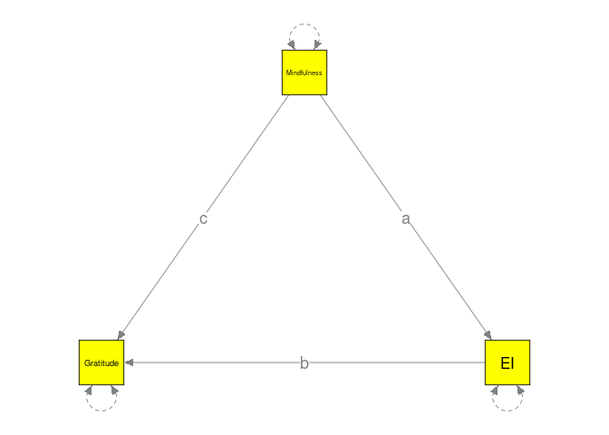
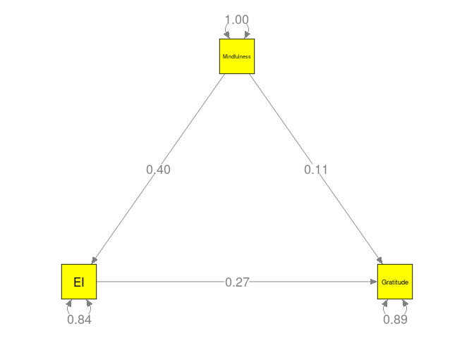
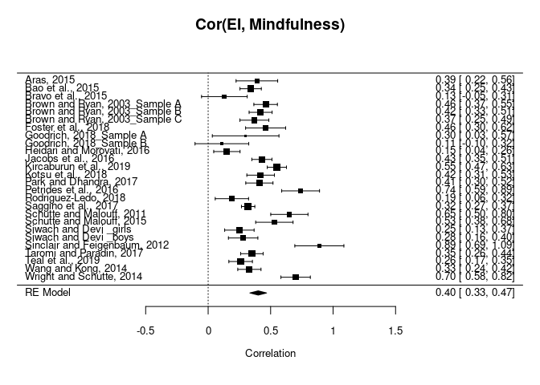
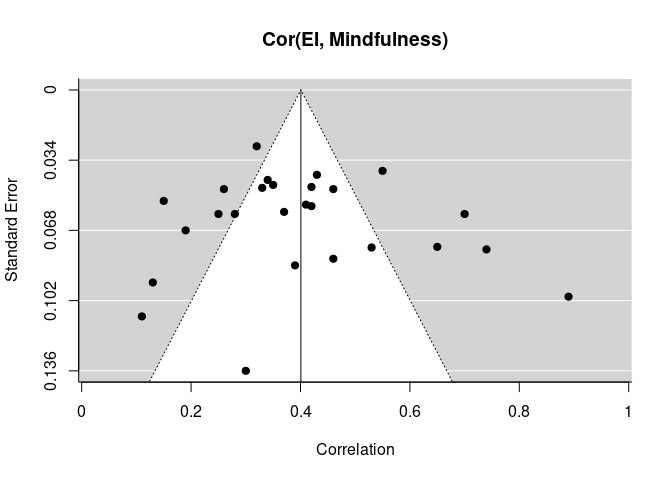
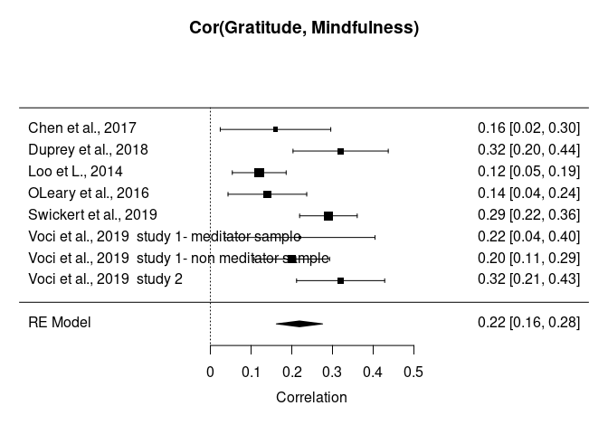
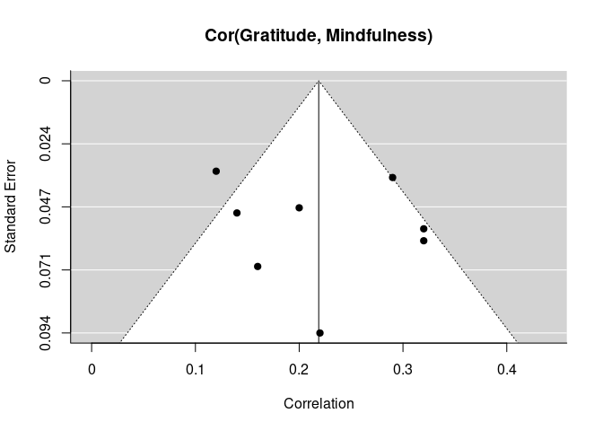
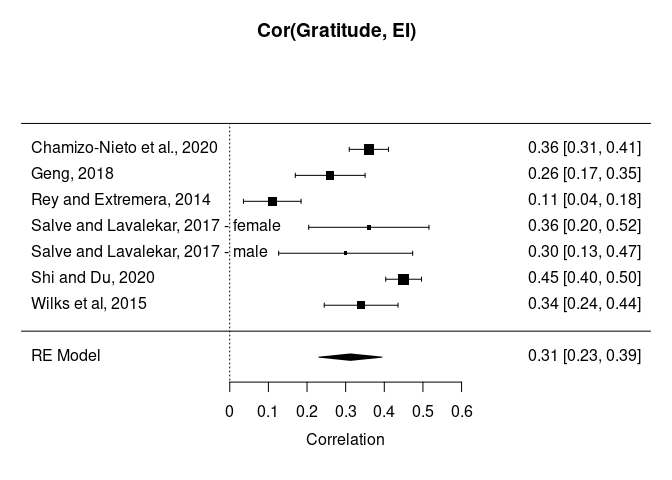
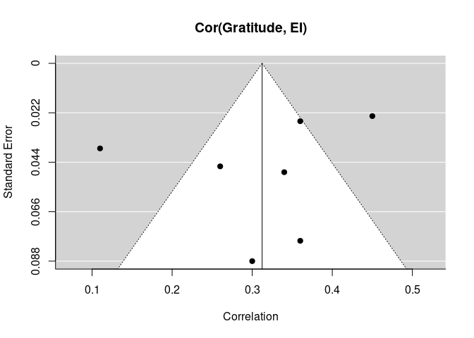

# TSSEM

## Data preparation

```r
library(metaSEM)
mxOption(key='Number of Threads', value=parallel::detectCores()-2)

## Read data
my.df <- foreign::read.spss("data.sav", use.value.labels = FALSE, to.data.frame=TRUE)
```

```
## Warning in foreign::read.spss("data.sav", use.value.labels = FALSE,
## to.data.frame = TRUE): data.sav: Very long string record(s) found (record type
## 7, subtype 14), each will be imported in consecutive separate variables
```

```r
## A function to convert rows into a 3x3 correlation matrix
create.matrix <- function(x, type=c(1, 2, 3)) {
  mat <- matrix(NA, ncol=3, nrow=3)
  diag(mat) <- 1
  type <- as.character(type)
  ## Mindfulness, EI, Gratitude
  ## 1: Mindfulness and EI
  ## 2: Mindfulness and Gratitude
  ## 3: EI and Gratitude
  switch(type,
         "1" = mat[1, 2] <- mat[2, 1] <- unlist(x),
         "2" = mat[1, 3] <- mat[3, 1] <- unlist(x),
         "3" = mat[2, 3] <- mat[3, 2] <- unlist(x))
  mat
}

varlist <- c("Mindfulness", "EI", "Gratitude")

my.cor <- lapply(split(my.df, seq(nrow(my.df))),
                 function(x, y) create.matrix(x["Effect_size"], x["Type_of_Association"]))
my.cor <- lapply(my.cor, function(x) {dimnames(x) <- list(varlist, varlist); x}  )
names(my.cor) <- my.df$Study_name

## Correlation matrices in the analysis
my.cor
```

```
## $`Aras, 2015                                        `
##             Mindfulness   EI Gratitude
## Mindfulness        1.00 0.39        NA
## EI                 0.39 1.00        NA
## Gratitude            NA   NA         1
## 
## $`Bao et al., 2015                                  `
##             Mindfulness   EI Gratitude
## Mindfulness        1.00 0.34        NA
## EI                 0.34 1.00        NA
## Gratitude            NA   NA         1
## 
## $`Bravo et al., 2015                                `
##             Mindfulness   EI Gratitude
## Mindfulness        1.00 0.13        NA
## EI                 0.13 1.00        NA
## Gratitude            NA   NA         1
## 
## $`Brown and Ryan, 2003_Sample A                     `
##             Mindfulness   EI Gratitude
## Mindfulness        1.00 0.46        NA
## EI                 0.46 1.00        NA
## Gratitude            NA   NA         1
## 
## $`Brown and Ryan, 2003_Sample B                     `
##             Mindfulness   EI Gratitude
## Mindfulness        1.00 0.42        NA
## EI                 0.42 1.00        NA
## Gratitude            NA   NA         1
## 
## $`Brown and Ryan, 2003_Sample C                     `
##             Mindfulness   EI Gratitude
## Mindfulness        1.00 0.37        NA
## EI                 0.37 1.00        NA
## Gratitude            NA   NA         1
## 
## $`Chamizo-Nieto et al., 2020                        `
##             Mindfulness   EI Gratitude
## Mindfulness           1   NA        NA
## EI                   NA 1.00      0.36
## Gratitude            NA 0.36      1.00
## 
## $`Chen et al., 2017                                 `
##             Mindfulness EI Gratitude
## Mindfulness        1.00 NA      0.16
## EI                   NA  1        NA
## Gratitude          0.16 NA      1.00
## 
## $`Duprey et al., 2018                               `
##             Mindfulness EI Gratitude
## Mindfulness        1.00 NA      0.32
## EI                   NA  1        NA
## Gratitude          0.32 NA      1.00
## 
## $`Foster et al., 2018                               `
##             Mindfulness   EI Gratitude
## Mindfulness        1.00 0.46        NA
## EI                 0.46 1.00        NA
## Gratitude            NA   NA         1
## 
## $`Loo et L., 2014                                   `
##             Mindfulness EI Gratitude
## Mindfulness        1.00 NA      0.12
## EI                   NA  1        NA
## Gratitude          0.12 NA      1.00
## 
## $`Geng, 2018                                        `
##             Mindfulness   EI Gratitude
## Mindfulness           1   NA        NA
## EI                   NA 1.00      0.26
## Gratitude            NA 0.26      1.00
## 
## $`Goodrich, 2018_Sample A                           `
##             Mindfulness  EI Gratitude
## Mindfulness         1.0 0.3        NA
## EI                  0.3 1.0        NA
## Gratitude            NA  NA         1
## 
## $`Goodrich, 2018_Sample B                           `
##             Mindfulness   EI Gratitude
## Mindfulness        1.00 0.11        NA
## EI                 0.11 1.00        NA
## Gratitude            NA   NA         1
## 
## $`Heidari and Morovati, 2016                        `
##             Mindfulness   EI Gratitude
## Mindfulness        1.00 0.15        NA
## EI                 0.15 1.00        NA
## Gratitude            NA   NA         1
## 
## $`Jacobs et al., 2016                               `
##             Mindfulness   EI Gratitude
## Mindfulness        1.00 0.43        NA
## EI                 0.43 1.00        NA
## Gratitude            NA   NA         1
## 
## $`Kircaburun et al., 2019                           `
##             Mindfulness   EI Gratitude
## Mindfulness        1.00 0.55        NA
## EI                 0.55 1.00        NA
## Gratitude            NA   NA         1
## 
## $`Kotsu et al., 2018                                `
##             Mindfulness   EI Gratitude
## Mindfulness        1.00 0.42        NA
## EI                 0.42 1.00        NA
## Gratitude            NA   NA         1
## 
## $`OLeary et al., 2016                               `
##             Mindfulness EI Gratitude
## Mindfulness        1.00 NA      0.14
## EI                   NA  1        NA
## Gratitude          0.14 NA      1.00
## 
## $`Park and Dhandra, 2017                            `
##             Mindfulness   EI Gratitude
## Mindfulness        1.00 0.41        NA
## EI                 0.41 1.00        NA
## Gratitude            NA   NA         1
## 
## $`Petrides et al., 2016                             `
##             Mindfulness   EI Gratitude
## Mindfulness        1.00 0.74        NA
## EI                 0.74 1.00        NA
## Gratitude            NA   NA         1
## 
## $`Rey and Extremera, 2014                           `
##             Mindfulness   EI Gratitude
## Mindfulness           1   NA        NA
## EI                   NA 1.00      0.11
## Gratitude            NA 0.11      1.00
## 
## $`Rodriguez-Ledo, 2018                              `
##             Mindfulness   EI Gratitude
## Mindfulness        1.00 0.19        NA
## EI                 0.19 1.00        NA
## Gratitude            NA   NA         1
## 
## $`Saggino et al., 2017                              `
##             Mindfulness   EI Gratitude
## Mindfulness        1.00 0.32        NA
## EI                 0.32 1.00        NA
## Gratitude            NA   NA         1
## 
## $`Salve and Lavalekar, 2017 - female                `
##             Mindfulness   EI Gratitude
## Mindfulness           1   NA        NA
## EI                   NA 1.00      0.36
## Gratitude            NA 0.36      1.00
## 
## $`Salve and Lavalekar, 2017 - male                  `
##             Mindfulness  EI Gratitude
## Mindfulness           1  NA        NA
## EI                   NA 1.0       0.3
## Gratitude            NA 0.3       1.0
## 
## $`Shi and Du, 2020                                  `
##             Mindfulness   EI Gratitude
## Mindfulness           1   NA        NA
## EI                   NA 1.00      0.45
## Gratitude            NA 0.45      1.00
## 
## $`Schutte and Malouff, 2011                         `
##             Mindfulness   EI Gratitude
## Mindfulness        1.00 0.65        NA
## EI                 0.65 1.00        NA
## Gratitude            NA   NA         1
## 
## $`Schutte and Malouff, 2015                         `
##             Mindfulness   EI Gratitude
## Mindfulness        1.00 0.53        NA
## EI                 0.53 1.00        NA
## Gratitude            NA   NA         1
## 
## $`Siwach and Devi _girls                            `
##             Mindfulness   EI Gratitude
## Mindfulness        1.00 0.25        NA
## EI                 0.25 1.00        NA
## Gratitude            NA   NA         1
## 
## $`Siwach and Devi _boys                             `
##             Mindfulness   EI Gratitude
## Mindfulness        1.00 0.28        NA
## EI                 0.28 1.00        NA
## Gratitude            NA   NA         1
## 
## $`Sinclair and Feigenbaum, 2012                     `
##             Mindfulness   EI Gratitude
## Mindfulness        1.00 0.89        NA
## EI                 0.89 1.00        NA
## Gratitude            NA   NA         1
## 
## $`Swickert et al., 2019                             `
##             Mindfulness EI Gratitude
## Mindfulness        1.00 NA      0.29
## EI                   NA  1        NA
## Gratitude          0.29 NA      1.00
## 
## $`Taromi and Paradin, 2017                          `
##             Mindfulness   EI Gratitude
## Mindfulness        1.00 0.35        NA
## EI                 0.35 1.00        NA
## Gratitude            NA   NA         1
## 
## $`Teal et al., 2019                                 `
##             Mindfulness   EI Gratitude
## Mindfulness        1.00 0.26        NA
## EI                 0.26 1.00        NA
## Gratitude            NA   NA         1
## 
## $`Voci et al., 2019  study 1- meditator sample      `
##             Mindfulness EI Gratitude
## Mindfulness        1.00 NA      0.22
## EI                   NA  1        NA
## Gratitude          0.22 NA      1.00
## 
## $`Voci et al., 2019  study 1- non meditator sample  `
##             Mindfulness EI Gratitude
## Mindfulness         1.0 NA       0.2
## EI                   NA  1        NA
## Gratitude           0.2 NA       1.0
## 
## $`Voci et al., 2019  study 2                        `
##             Mindfulness EI Gratitude
## Mindfulness        1.00 NA      0.32
## EI                   NA  1        NA
## Gratitude          0.32 NA      1.00
## 
## $`Wang and Kong, 2014                               `
##             Mindfulness   EI Gratitude
## Mindfulness        1.00 0.33        NA
## EI                 0.33 1.00        NA
## Gratitude            NA   NA         1
## 
## $`Wilks et al, 2015                                 `
##             Mindfulness   EI Gratitude
## Mindfulness           1   NA        NA
## EI                   NA 1.00      0.34
## Gratitude            NA 0.34      1.00
## 
## $`Wright and Schutte, 2014                          `
##             Mindfulness  EI Gratitude
## Mindfulness         1.0 0.7        NA
## EI                  0.7 1.0        NA
## Gratitude            NA  NA         1
```

```r
## Sample sizes
my.n <- my.df$N
my.n
```

```
##  [1]  100  380   83  313  327  207 1157  190  256  108  801  365   39   60  250
## [16]  427  470  228  375  234  121  535  156  970  123   99 1392  125  124  200
## [31]  200   72  700  341  313  103  406  299  321  327  200
```

```r
## Number of studies in each cell
pattern.na(my.cor, show.na = FALSE)
```

```
##             Mindfulness EI Gratitude
## Mindfulness          41 26         8
## EI                   26 41         7
## Gratitude             8  7        41
```

```r
## Total sample sizes in each cell
pattern.n(my.cor, my.n)
```

```
##             Mindfulness    EI Gratitude
## Mindfulness       13497  6369      3130
## EI                 6369 13497      3998
## Gratitude          3130  3998     13497
```

## First-stage of analysis

```r
## Stage 1 analysis: find an average correlation matrix
stage1 <- tssem1(my.cor, my.n)
summary(stage1)
```

```
## 
## Call:
## meta(y = ES, v = acovR, RE.constraints = Diag(paste0(RE.startvalues, 
##     "*Tau2_", 1:no.es, "_", 1:no.es)), RE.lbound = RE.lbound, 
##     I2 = I2, model.name = model.name, suppressWarnings = TRUE, 
##     silent = silent, run = run)
## 
## 95% confidence intervals: z statistic approximation (robust=FALSE)
## Coefficients:
##              Estimate  Std.Error     lbound     ubound z value  Pr(>|z|)    
## Intercept1  0.4003279  0.0335683  0.3345353  0.4661205 11.9258 < 2.2e-16 ***
## Intercept2  0.2185611  0.0292426  0.1612467  0.2758756  7.4741 7.772e-14 ***
## Intercept3  0.3127942  0.0424903  0.2295147  0.3960737  7.3615 1.819e-13 ***
## Tau2_1_1    0.0236850  0.0087361  0.0065625  0.0408074  2.7112  0.006705 ** 
## Tau2_2_2    0.0037272  0.0030628 -0.0022758  0.0097302  1.2169  0.223637    
## Tau2_3_3    0.0094888  0.0060251 -0.0023202  0.0212978  1.5749  0.115287    
## ---
## Signif. codes:  0 '***' 0.001 '**' 0.01 '*' 0.05 '.' 0.1 ' ' 1
## 
## Q statistic on the homogeneity of effect sizes: 206.894
## Degrees of freedom of the Q statistic: 38
## P value of the Q statistic: 0
## 
## Heterogeneity indices (based on the estimated Tau2):
##                              Estimate
## Intercept1: I2 (Q statistic)   0.8911
## Intercept2: I2 (Q statistic)   0.5473
## Intercept3: I2 (Q statistic)   0.7577
## 
## Number of studies (or clusters): 41
## Number of observed statistics: 41
## Number of estimated parameters: 6
## Degrees of freedom: 35
## -2 log likelihood: -44.79331 
## OpenMx status1: 0 ("0" or "1": The optimization is considered fine.
## Other values may indicate problems.)
```

```r
## Average correlation matrix
meanR <- vec2symMat(coef(stage1, select = "fixed"), diag = FALSE)
dimnames(meanR) <- list(varlist, varlist)
meanR
```

```
##             Mindfulness        EI Gratitude
## Mindfulness   1.0000000 0.4003279 0.2185611
## EI            0.4003279 1.0000000 0.3127942
## Gratitude     0.2185611 0.3127942 1.0000000
```

```r
## Absolute heterogeneity variance: tau^2
tau2 <- vec2symMat(coef(stage1, select = "random"), diag = FALSE)
dimnames(tau2) <- list(varlist, varlist)
tau2
```

```
##             Mindfulness          EI   Gratitude
## Mindfulness 1.000000000 0.023684963 0.003727185
## EI          0.023684963 1.000000000 0.009488764
## Gratitude   0.003727185 0.009488764 1.000000000
```

```r
## Relative heterogeneity index: I^2
I2 <- vec2symMat(summary(stage1)$I2.values[, "Estimate"], diag = FALSE)
dimnames(I2) <- list(varlist, varlist)
I2
```

```
##             Mindfulness        EI Gratitude
## Mindfulness   1.0000000 0.8911061 0.5472690
## EI            0.8911061 1.0000000 0.7577407
## Gratitude     0.5472690 0.7577407 1.0000000
```

## Second-stage of analysis

```r
## Proposed model
model <- "Gratitude ~ c*Mindfulness + b*EI
          EI ~ a*Mindfulness
          Mindfulness ~~ 1*Mindfulness"
plot(model, color="yellow")
```

<!-- -->

```r
RAM1 <- lavaan2RAM(model, obs.variables = varlist)
RAM1
```

```
## $A
##             Mindfulness EI    Gratitude
## Mindfulness "0"         "0"   "0"      
## EI          "0*a"       "0"   "0"      
## Gratitude   "0*c"       "0*b" "0"      
## 
## $S
##             Mindfulness EI           Gratitude                 
## Mindfulness "1"         "0"          "0"                       
## EI          "0"         "0*EIWITHEI" "0"                       
## Gratitude   "0"         "0"          "0*GratitudeWITHGratitude"
## 
## $F
##             Mindfulness EI Gratitude
## Mindfulness           1  0         0
## EI                    0  1         0
## Gratitude             0  0         1
## 
## $M
##   Mindfulness EI Gratitude
## 1           0  0         0
```

```r
## Stage 2 analysis: fit the path model
stage2 <- tssem2(stage1, RAM=RAM1, intervals.type = "LB",
                 mx.algebras = list(Indirect=mxAlgebra(a*b, name="Indirect"),
                                    Direct=mxAlgebra(c, name="Direct")))
summary(stage2)
```

```
## 
## Call:
## wls(Cov = pooledS, aCov = aCov, n = tssem1.obj$total.n, RAM = RAM, 
##     Amatrix = Amatrix, Smatrix = Smatrix, Fmatrix = Fmatrix, 
##     diag.constraints = diag.constraints, cor.analysis = cor.analysis, 
##     intervals.type = intervals.type, mx.algebras = mx.algebras, 
##     model.name = model.name, suppressWarnings = suppressWarnings, 
##     silent = silent, run = run)
## 
## 95% confidence intervals: Likelihood-based statistic
## Coefficients:
##   Estimate Std.Error   lbound   ubound z value Pr(>|z|)
## a 0.400328        NA 0.334536 0.466120      NA       NA
## b 0.268296        NA 0.165125 0.371438      NA       NA
## c 0.111155        NA 0.028062 0.190685      NA       NA
## 
## mxAlgebras objects (and their 95% likelihood-based CIs):
##                   lbound  Estimate    ubound
## Indirect[1,1] 0.06545929 0.1074063 0.1564660
## Direct[1,1]   0.02806215 0.1111548 0.1906853
## 
## Goodness-of-fit indices:
##                                               Value
## Sample size                                13497.00
## Chi-square of target model                     0.00
## DF of target model                             0.00
## p value of target model                        0.00
## Number of constraints imposed on "Smatrix"     0.00
## DF manually adjusted                           0.00
## Chi-square of independence model             252.28
## DF of independence model                       3.00
## RMSEA                                          0.00
## RMSEA lower 95% CI                             0.00
## RMSEA upper 95% CI                             0.00
## SRMR                                           0.00
## TLI                                            -Inf
## CFI                                            1.00
## AIC                                            0.00
## BIC                                            0.00
## OpenMx status1: 0 ("0" or "1": The optimization is considered fine.
## Other values indicate problems.)
```

```r
plot(stage2, color="yellow")
```

<!-- -->

```r
# svg("Fig4.svg", width=5, height=5)
# plot(stage2, col="yellow")
# dev.off()

## Testing the hypothesis c = a*b
stage2b <- tssem2(stage1, RAM=RAM1, intervals.type = "LB",
                 mx.algebras = list(Indirect=mxAlgebra(a*b, name="Indirect"),
                                    Direct=mxAlgebra(c, name="Direct")),
                 run=FALSE)
## Add a constraint on c=a*b
stage2b <- mxModel(stage2b, mxConstraint(c==a*b, name="constraint"))
stage2b <- mxRun(stage2b, intervals=TRUE)
summary(stage2b)
```

```
## Summary of TSSEM2 Correlation 
##  
## free parameters:
##   name  matrix       row         col  Estimate  Std.Error A
## 1    a Amatrix        EI Mindfulness 0.4009621 0.03197103 !
## 2    c Amatrix Gratitude Mindfulness 0.1086665 0.01082088 !
## 3    b Amatrix Gratitude          EI 0.2710144 0.02929168 !
## 
## confidence intervals:
##                                      lbound  estimate    ubound note
## a                                0.33915822 0.4009621 0.4642647     
## c                                0.08768706 0.1086665 0.1301000     
## b                                0.21579615 0.2710144 0.3308677     
## TSSEM2 Correlation.Indirect[1,1] 0.08768706 0.1086665 0.1300975     
## TSSEM2 Correlation.Direct[1,1]   0.08768706 0.1086665 0.1301000     
## 
## Model Statistics: 
##                |  Parameters  |  Degrees of Freedom  |  Fit (-2lnL units)
##        Model:              3                     -2           0.003898104
##    Saturated:             NA                     NA                    NA
## Independence:             NA                     NA                    NA
## Number of observations/statistics: 0/1
## 
## Constraint 'constraint' contributes 1 observed statistic. 
## 
## Information Criteria: 
##       |  df Penalty  |  Parameters Penalty  |  Sample-Size Adjusted
## AIC:             NA                     NA                       NA
## BIC:             NA                     NA                       NA
## CFI: NA 
## TLI: 1   (also known as NNFI) 
## RMSEA:  0  [95% CI (NA, NA)]
## Prob(RMSEA <= 0.05): NA
## To get additional fit indices, see help(mxRefModels)
## timestamp: 2020-09-23 10:17:52 
## Wall clock time: 0.1414142 secs 
## optimizer:  SLSQP 
## OpenMx version number: 2.18.1 
## Need help?  See help(mxSummary)
```

```r
anova(stage2$mx.fit, stage2b)
```

```
##                 base         comparison ep     minus2LL df AIC      diffLL
## 1 TSSEM2 Correlation               <NA>  3 1.566538e-26 -3  NA          NA
## 2 TSSEM2 Correlation TSSEM2 Correlation  3 3.898104e-03 -2  NA 0.003898104
##   diffdf         p
## 1     NA        NA
## 2      1 0.9502166
```

# OSMASEM

## Data preparation

```r
Publish <- ifelse(my.df$Publication_status==1, yes=1, no=0)

tssem.df <- list(data=my.cor, 
                 n=my.n,
                 ## Center the Age and Female for ease of interpretations
                 Age=c(scale(my.df$Age, scale=FALSE)), 
                 Female=c(scale(my.df$Percent_female, scale=FALSE)),
                 Publish=Publish)

## Summary of mean age
summary(tssem.df$Age)
```

```
##    Min. 1st Qu.  Median    Mean 3rd Qu.    Max.    NA's 
## -15.214  -6.714  -3.214   0.000   6.786  21.786       6
```

```r
## Summary of percentage of female participants
summary(tssem.df$Female)
```

```
##     Min.  1st Qu.   Median     Mean  3rd Qu.     Max.     NA's 
## -59.0764  -8.5764   0.9236   0.0000  15.4236  40.9236        2
```

```r
## No. of studies published vs. unpublished
table(tssem.df$Publish)
```

```
## 
##  0  1 
##  4 37
```

```r
os.df <- Cor2DataFrame(tssem.df)

## Show the first few studies
# head(os.df)

## Checking only
# os.fit0 <- osmasem("No moderator", RAM=RAM1, data=os.df)
# summary(os.fit0)
# VarCorr(os.fit0)
# plot(os.fit0)
```

## Mean age as a moderator

```r
## missing data in Age
indexA <- is.na(os.df$data$Age)
A.df <- os.df
A.df$data <- A.df$data[!indexA, ]

## For checking only
os.fit0 <- osmasem("No moderator", RAM=RAM1, data=A.df)
summary(os.fit0)
```

```
## Summary of No moderator 
##  
## free parameters:
##     name  matrix       row         col   Estimate  Std.Error A   z value
## 1      a      A0        EI Mindfulness  0.4421576 0.03757034   11.768793
## 2      c      A0 Gratitude Mindfulness  0.1003077 0.04404273    2.277508
## 3      b      A0 Gratitude          EI  0.2680171 0.05424115    4.941213
## 4 Tau1_1 vecTau1         1           1 -1.8551628 0.19663875   -9.434371
## 5 Tau1_2 vecTau1         2           1 -2.7763804 0.39391167   -7.048231
## 6 Tau1_3 vecTau1         3           1 -2.3230692 0.30673179   -7.573617
##       Pr(>|z|)
## 1 0.000000e+00
## 2 2.275590e-02
## 3 7.763784e-07
## 4 0.000000e+00
## 5 1.812106e-12
## 6 3.619327e-14
## 
## Model Statistics: 
##                |  Parameters  |  Degrees of Freedom  |  Fit (-2lnL units)
##        Model:              6                     29              -42.3165
##    Saturated:              9                     26                    NA
## Independence:              6                     29                    NA
## Number of observations/statistics: 13497/35
## 
## Information Criteria: 
##       |  df Penalty  |  Parameters Penalty  |  Sample-Size Adjusted
## AIC:      -100.3165              -30.31650               -30.310269
## BIC:      -318.1130               14.74484                -4.322593
## To get additional fit indices, see help(mxRefModels)
## timestamp: 2020-09-23 10:17:55 
## Wall clock time: 0.657759 secs 
## optimizer:  SLSQP 
## OpenMx version number: 2.18.1 
## Need help?  See help(mxSummary)
```

```r
A.A <- create.modMatrix(RAM1, mod="Age")
os.fitA <- osmasem("Age as a moderator", RAM=RAM1, Ax=A.A, data=A.df)
os.fitA <- rerun(os.fitA)
```



```r
summary(os.fitA)
```

```
## Summary of Age as a moderator 
##  
## free parameters:
##     name  matrix       row         col     Estimate   Std.Error A    z value
## 1      a      A0        EI Mindfulness  0.433235141 0.029135789   14.8695182
## 2      c      A0 Gratitude Mindfulness  0.148968318 0.067133320    2.2189923
## 3      b      A0 Gratitude          EI  0.184900844 0.115146353    1.6057898
## 4    a_1      A1        EI Mindfulness  0.009301524 0.002712393    3.4292685
## 5    c_1      A1 Gratitude Mindfulness  0.002458202 0.011064152    0.2221771
## 6    b_1      A1 Gratitude          EI -0.012783070 0.017621477   -0.7254255
## 7 Tau1_1 vecTau1         1           1 -2.160824880 0.217401787   -9.9393152
## 8 Tau1_2 vecTau1         2           1 -2.780188378 0.401239189   -6.9290051
## 9 Tau1_3 vecTau1         3           1 -2.400005937 0.314988539   -7.6193437
##       Pr(>|z|)
## 1 0.000000e+00
## 2 2.648725e-02
## 3 1.083201e-01
## 4 6.052104e-04
## 5 8.241760e-01
## 6 4.681910e-01
## 7 0.000000e+00
## 8 4.238165e-12
## 9 2.553513e-14
## 
## Model Statistics: 
##                |  Parameters  |  Degrees of Freedom  |  Fit (-2lnL units)
##        Model:              9                     26             -53.01342
##    Saturated:              9                     26                    NA
## Independence:              6                     29                    NA
## Number of observations/statistics: 13497/35
## 
## Information Criteria: 
##       |  df Penalty  |  Parameters Penalty  |  Sample-Size Adjusted
## AIC:      -105.0134              -35.01342               -35.000075
## BIC:      -300.2792               32.57858                 3.977432
## CFI: NA 
## TLI: 1   (also known as NNFI) 
## RMSEA:  0  [95% CI (NA, NA)]
## Prob(RMSEA <= 0.05): NA
## To get additional fit indices, see help(mxRefModels)
## timestamp: 2020-09-23 10:17:57 
## Wall clock time: 0.627708 secs 
## optimizer:  SLSQP 
## OpenMx version number: 2.18.1 
## Need help?  See help(mxSummary)
```

```r
anova(os.fitA, os.fit0)
```

```
##                 base   comparison ep  minus2LL df       AIC   diffLL diffdf
## 1 Age as a moderator         <NA>  9 -53.01342 26 -105.0134       NA     NA
## 2 Age as a moderator No moderator  6 -42.31650 29 -100.3165 10.69693      3
##            p
## 1         NA
## 2 0.01348285
```

```r
osmasemR2(os.fitA, os.fit0)
```

```
## $Tau2.0
##    Tau2_1_1    Tau2_2_2    Tau2_3_3 
## 0.024469552 0.003876740 0.009598596 
## 
## $Tau2.1
##    Tau2_1_1    Tau2_2_2    Tau2_3_3 
## 0.013277960 0.003847327 0.008229649 
## 
## $R2
##    Tau2_1_1    Tau2_2_2    Tau2_3_3 
## 0.457368089 0.007587067 0.142619492
```

```r
## Test A[2,1] (a): significant
A.21 <- A.A
A.21[3,1] <- A.21[3,2] <- 0
A.21
```

```
##             Mindfulness  EI  Gratitude
## Mindfulness "0"          "0" "0"      
## EI          "0*data.Age" "0" "0"      
## Gratitude   "0"          "0" "0"
```

```r
os.fitA21 <- osmasem("Age A21", RAM=RAM1, Ax=A.21, data=A.df)
summary(os.fitA21)
```

```
## Summary of Age A21 
##  
## free parameters:
##     name  matrix       row         col     Estimate   Std.Error A   z value
## 1      a      A0        EI Mindfulness  0.433698119 0.029112292   14.897423
## 2      c      A0 Gratitude Mindfulness  0.095441261 0.044543966    2.142631
## 3      b      A0 Gratitude          EI  0.271619492 0.052719394    5.152174
## 4    a_1      A1        EI Mindfulness  0.008895178 0.002668031    3.333986
## 5 Tau1_1 vecTau1         1           1 -2.161834697 0.217987324   -9.917250
## 6 Tau1_2 vecTau1         2           1 -2.682500018 0.374698086   -7.159097
## 7 Tau1_3 vecTau1         3           1 -2.312370018 0.306501023   -7.544412
##       Pr(>|z|)
## 1 0.000000e+00
## 2 3.214278e-02
## 3 2.574839e-07
## 4 8.561097e-04
## 5 0.000000e+00
## 6 8.120171e-13
## 7 4.551914e-14
## 
## Model Statistics: 
##                |  Parameters  |  Degrees of Freedom  |  Fit (-2lnL units)
##        Model:              7                     28             -50.94696
##    Saturated:              9                     26                    NA
## Independence:              6                     29                    NA
## Number of observations/statistics: 13497/35
## 
## Information Criteria: 
##       |  df Penalty  |  Parameters Penalty  |  Sample-Size Adjusted
## AIC:      -106.9470              -36.94696               -36.938655
## BIC:      -317.2332               15.62460                -6.620739
## To get additional fit indices, see help(mxRefModels)
## timestamp: 2020-09-23 10:17:58 
## Wall clock time: 0.9136832 secs 
## optimizer:  SLSQP 
## OpenMx version number: 2.18.1 
## Need help?  See help(mxSummary)
```

```r
anova(os.fitA21, os.fit0)
```

```
##      base   comparison ep  minus2LL df       AIC   diffLL diffdf           p
## 1 Age A21         <NA>  7 -50.94696 28 -106.9470       NA     NA          NA
## 2 Age A21 No moderator  6 -42.31650 29 -100.3165 8.630463      1 0.003305876
```

```r
## Test A[3,2] (b): not significant
A.32 <- A.A
A.32[2,1] <- A.32[3,1] <- 0
A.32
```

```
##             Mindfulness EI           Gratitude
## Mindfulness "0"         "0"          "0"      
## EI          "0"         "0"          "0"      
## Gratitude   "0"         "0*data.Age" "0"
```

```r
os.fitA32 <- osmasem("Age A32", RAM=RAM1, Ax=A.32, data=A.df)
summary(os.fitA32)
```

```
## Summary of Age A32 
##  
## free parameters:
##     name  matrix       row         col     Estimate   Std.Error A   z value
## 1      a      A0        EI Mindfulness  0.441295869 0.037587362   11.740538
## 2      c      A0 Gratitude Mindfulness  0.137224634 0.055375610    2.478070
## 3      b      A0 Gratitude          EI  0.204214046 0.080340269    2.541864
## 4    b_1      A1 Gratitude          EI -0.007909439 0.007633366   -1.036167
## 5 Tau1_1 vecTau1         1           1 -1.855347409 0.196657642   -9.434403
## 6 Tau1_2 vecTau1         2           1 -2.819986245 0.411245567   -6.857183
## 7 Tau1_3 vecTau1         3           1 -2.388307545 0.314080796   -7.604118
##       Pr(>|z|)
## 1 0.000000e+00
## 2 1.320952e-02
## 3 1.102630e-02
## 4 3.001244e-01
## 5 0.000000e+00
## 6 7.023049e-12
## 7 2.864375e-14
## 
## Model Statistics: 
##                |  Parameters  |  Degrees of Freedom  |  Fit (-2lnL units)
##        Model:              7                     28             -43.36245
##    Saturated:              9                     26                    NA
## Independence:              6                     29                    NA
## Number of observations/statistics: 13497/35
## 
## Information Criteria: 
##       |  df Penalty  |  Parameters Penalty  |  Sample-Size Adjusted
## AIC:      -99.36245              -29.36245              -29.3541481
## BIC:     -309.64869               23.20911                0.9637682
## To get additional fit indices, see help(mxRefModels)
## timestamp: 2020-09-23 10:17:59 
## Wall clock time: 0.9671991 secs 
## optimizer:  SLSQP 
## OpenMx version number: 2.18.1 
## Need help?  See help(mxSummary)
```

```r
anova(os.fitA32, os.fit0)
```

```
##      base   comparison ep  minus2LL df        AIC   diffLL diffdf         p
## 1 Age A32         <NA>  7 -43.36245 28  -99.36245       NA     NA        NA
## 2 Age A32 No moderator  6 -42.31650 29 -100.31650 1.045956      1 0.3064404
```

```r
## Test A[3,1] (c): not significant
A.31 <- A.A
A.31[2,1] <- A.31[3,2] <- 0
A.31
```

```
##             Mindfulness  EI  Gratitude
## Mindfulness "0"          "0" "0"      
## EI          "0"          "0" "0"      
## Gratitude   "0*data.Age" "0" "0"
```

```r
os.fitA31 <- osmasem("Age A31", RAM=RAM1, Ax=A.31, data=A.df)
summary(os.fitA31)
```

```
## Summary of Age A31 
##  
## free parameters:
##     name  matrix       row         col     Estimate   Std.Error A    z value
## 1      a      A0        EI Mindfulness  0.442390604 0.037576451   11.7730810
## 2      c      A0 Gratitude Mindfulness  0.112456042 0.046380780    2.4246259
## 3      b      A0 Gratitude          EI  0.255367964 0.056612223    4.5108274
## 4    c_1      A1 Gratitude Mindfulness -0.002726316 0.003871539   -0.7041944
## 5 Tau1_1 vecTau1         1           1 -1.855106897 0.196635224   -9.4342553
## 6 Tau1_2 vecTau1         2           1 -2.821641264 0.409304881   -6.8937396
## 7 Tau1_3 vecTau1         3           1 -2.335470286 0.308084974   -7.5806043
##       Pr(>|z|)
## 1 0.000000e+00
## 2 1.532417e-02
## 3 6.457526e-06
## 4 4.813117e-01
## 5 0.000000e+00
## 6 5.434542e-12
## 7 3.441691e-14
## 
## Model Statistics: 
##                |  Parameters  |  Degrees of Freedom  |  Fit (-2lnL units)
##        Model:              7                     28             -42.79941
##    Saturated:              9                     26                    NA
## Independence:              6                     29                    NA
## Number of observations/statistics: 13497/35
## 
## Information Criteria: 
##       |  df Penalty  |  Parameters Penalty  |  Sample-Size Adjusted
## AIC:      -98.79941              -28.79941               -28.791111
## BIC:     -309.08565               23.77215                 1.526806
## To get additional fit indices, see help(mxRefModels)
## timestamp: 2020-09-23 10:18:00 
## Wall clock time: 0.9241841 secs 
## optimizer:  SLSQP 
## OpenMx version number: 2.18.1 
## Need help?  See help(mxSummary)
```

```r
anova(os.fitA31, os.fit0)
```

```
##      base   comparison ep  minus2LL df        AIC    diffLL diffdf         p
## 1 Age A31         <NA>  7 -42.79941 28  -98.79941        NA     NA        NA
## 2 Age A31 No moderator  6 -42.31650 29 -100.31650 0.4829184      1 0.4871034
```

```r
## Mean of Age: 0
## sd of Age
(Age.sd <- sd(A.df$data$Age))
```

```
## [1] 9.858772
```

```r
## Path coefficients when Age is 0
mxEval(A0, os.fitA$mx.fit)
```

```
##             Mindfulness        EI Gratitude
## Mindfulness   0.0000000 0.0000000         0
## EI            0.4332351 0.0000000         0
## Gratitude     0.1489683 0.1849008         0
```

```r
## Change of path coefficients when Age increases by 1 unit
mxEval(A1, os.fitA$mx.fit)
```

```
##             Mindfulness          EI Gratitude
## Mindfulness 0.000000000  0.00000000         0
## EI          0.009301524  0.00000000         0
## Gratitude   0.002458202 -0.01278307         0
```

```r
## Path coefficients when Age is -1SD
mxEval(A0, os.fitA$mx.fit) - Age.sd*mxEval(A1, os.fitA$mx.fit)
```

```
##             Mindfulness        EI Gratitude
## Mindfulness   0.0000000 0.0000000         0
## EI            0.3415335 0.0000000         0
## Gratitude     0.1247335 0.3109262         0
```

```r
## Path coefficients when Age is +1SD
mxEval(A0, os.fitA$mx.fit) + Age.sd*mxEval(A1, os.fitA$mx.fit)
```

```
##             Mindfulness         EI Gratitude
## Mindfulness   0.0000000 0.00000000         0
## EI            0.5249367 0.00000000         0
## Gratitude     0.1732032 0.05887548         0
```

## Percentage of female participants as a moderator

```r
## missing data in Age
indexF <- is.na(os.df$data$Female)
F.df <- os.df
F.df$data <- F.df$data[!indexF, ]

## For checking only
os.fit0 <- osmasem("No moderator", RAM=RAM1, data=F.df)
summary(os.fit0)
```

```
## Summary of No moderator 
##  
## free parameters:
##     name  matrix       row         col   Estimate  Std.Error A    z value
## 1      a      A0        EI Mindfulness  0.4109074 0.03547771    11.582129
## 2      c      A0 Gratitude Mindfulness  0.1088350 0.04169612     2.610195
## 3      b      A0 Gratitude          EI  0.2676478 0.05218351     5.128972
## 4 Tau1_1 vecTau1         1           1 -1.8316769 0.18160433   -10.086086
## 5 Tau1_2 vecTau1         2           1 -2.7763804 0.39391170    -7.048230
## 6 Tau1_3 vecTau1         3           1 -2.3230692 0.30673181    -7.573617
##       Pr(>|z|)
## 1 0.000000e+00
## 2 9.049058e-03
## 3 2.913283e-07
## 4 0.000000e+00
## 5 1.812106e-12
## 6 3.619327e-14
## 
## Model Statistics: 
##                |  Parameters  |  Degrees of Freedom  |  Fit (-2lnL units)
##        Model:              6                     33             -43.44459
##    Saturated:              9                     30                    NA
## Independence:              6                     33                    NA
## Number of observations/statistics: 13497/39
## 
## Information Criteria: 
##       |  df Penalty  |  Parameters Penalty  |  Sample-Size Adjusted
## AIC:      -109.4446              -31.44459               -31.438362
## BIC:      -357.2819               13.61675                -5.450686
## To get additional fit indices, see help(mxRefModels)
## timestamp: 2020-09-23 10:18:01 
## Wall clock time: 0.6838777 secs 
## optimizer:  SLSQP 
## OpenMx version number: 2.18.1 
## Need help?  See help(mxSummary)
```

```r
A.F <- create.modMatrix(RAM1, mod="Female")
os.fitF <- osmasem("Female as a moderator", RAM=RAM1, Ax=A.F, data=F.df)
os.fitF <- rerun(os.fitF, extraTries = 100)
```



```r
summary(os.fitF)
```

```
## Summary of Female as a moderator 
##  
## free parameters:
##     name  matrix       row         col      Estimate   Std.Error A     z value
## 1      a      A0        EI Mindfulness  0.4115873365 0.033851777    12.1585149
## 2      c      A0 Gratitude Mindfulness  0.1001464984 0.043458457     2.3044191
## 3      b      A0 Gratitude          EI  0.2694074696 0.052957568     5.0872326
## 4    a_1      A1        EI Mindfulness  0.0020290460 0.001207517     1.6803463
## 5    c_1      A1 Gratitude Mindfulness  0.0008499429 0.002275759     0.3734767
## 6    b_1      A1 Gratitude          EI -0.0007538299 0.002266898    -0.3325381
## 7 Tau1_1 vecTau1         1           1 -1.8870765417 0.181926075   -10.3727656
## 8 Tau1_2 vecTau1         2           1 -2.8291732302 0.419212806    -6.7487758
## 9 Tau1_3 vecTau1         3           1 -2.3238490466 0.307470686    -7.5579532
##       Pr(>|z|)
## 1 0.000000e+00
## 2 2.119913e-02
## 3 3.633261e-07
## 4 9.288996e-02
## 5 7.087937e-01
## 6 7.394830e-01
## 7 0.000000e+00
## 8 1.490985e-11
## 9 4.085621e-14
## 
## Model Statistics: 
##                |  Parameters  |  Degrees of Freedom  |  Fit (-2lnL units)
##        Model:              9                     30              -46.5116
##    Saturated:              9                     30                    NA
## Independence:              6                     33                    NA
## Number of observations/statistics: 13497/39
## 
## Information Criteria: 
##       |  df Penalty  |  Parameters Penalty  |  Sample-Size Adjusted
## AIC:      -106.5116               -28.5116                -28.49826
## BIC:      -331.8183                39.0804                 10.47925
## CFI: NA 
## TLI: 1   (also known as NNFI) 
## RMSEA:  0  [95% CI (NA, NA)]
## Prob(RMSEA <= 0.05): NA
## To get additional fit indices, see help(mxRefModels)
## timestamp: 2020-09-23 10:18:34 
## Wall clock time: 2.725383 secs 
## optimizer:  SLSQP 
## OpenMx version number: 2.18.1 
## Need help?  See help(mxSummary)
```

```r
anova(os.fitF, os.fit0)
```

```
##                    base   comparison ep  minus2LL df       AIC   diffLL diffdf
## 1 Female as a moderator         <NA>  9 -46.51160 30 -106.5116       NA     NA
## 2 Female as a moderator No moderator  6 -43.44459 33 -109.4446 3.067015      3
##           p
## 1        NA
## 2 0.3814077
```

## Published vs. unpublished

```r
## No missing covariate
## For checking only
os.fit0 <- osmasem("No moderator", RAM=RAM1, data=os.df)
summary(os.fit0)
```

```
## Summary of No moderator 
##  
## free parameters:
##     name  matrix       row         col   Estimate  Std.Error A    z value
## 1      a      A0        EI Mindfulness  0.4007062 0.03424717    11.700418
## 2      c      A0 Gratitude Mindfulness  0.1115576 0.04096329     2.723356
## 3      b      A0 Gratitude          EI  0.2676671 0.05157293     5.190069
## 4 Tau1_1 vecTau1         1           1 -1.8238506 0.17208235   -10.598708
## 5 Tau1_2 vecTau1         2           1 -2.7763804 0.39391167    -7.048231
## 6 Tau1_3 vecTau1         3           1 -2.3230692 0.30673178    -7.573617
##       Pr(>|z|)
## 1 0.000000e+00
## 2 6.462237e-03
## 3 2.102166e-07
## 4 0.000000e+00
## 5 1.812106e-12
## 6 3.619327e-14
## 
## Model Statistics: 
##                |  Parameters  |  Degrees of Freedom  |  Fit (-2lnL units)
##        Model:              6                     35             -44.57614
##    Saturated:              9                     32                    NA
## Independence:              6                     35                    NA
## Number of observations/statistics: 13497/41
## 
## Information Criteria: 
##       |  df Penalty  |  Parameters Penalty  |  Sample-Size Adjusted
## AIC:      -114.5761              -32.57614               -32.569918
## BIC:      -377.4339               12.48519                -6.582242
## To get additional fit indices, see help(mxRefModels)
## timestamp: 2020-09-23 10:18:35 
## Wall clock time: 0.669209 secs 
## optimizer:  SLSQP 
## OpenMx version number: 2.18.1 
## Need help?  See help(mxSummary)
```

```r
A.P <- create.modMatrix(RAM1, mod="Publish")
os.fitP <- osmasem("Publish as a moderator", RAM=RAM1, Ax=A.P, data=os.df)
os.fitP <- rerun(os.fitP, extraTries = 100)
```



```r
summary(os.fitP)
```

```
## Summary of Publish as a moderator 
##  
## free parameters:
##     name  matrix       row         col    Estimate   Std.Error A       z value
## 1      a      A0        EI Mindfulness  0.23343479  0.09191480     2.539686726
## 2      c      A0 Gratitude Mindfulness  0.05263727 99.65896322     0.000528174
## 3      b      A0 Gratitude          EI  0.13386144 52.63552868     0.002543176
## 4    a_1      A1        EI Mindfulness  0.19065641  0.09819721     1.941566428
## 5    c_1      A1 Gratitude Mindfulness  0.05263727 99.65896138     0.000528174
## 6    b_1      A1 Gratitude          EI  0.13386144 52.63552281     0.002543177
## 7 Tau1_1 vecTau1         1           1 -1.89294038  0.17212911   -10.997212262
## 8 Tau1_2 vecTau1         2           1 -2.77638038  0.39391175    -7.048229409
## 9 Tau1_3 vecTau1         3           1 -2.32306921  0.30673180    -7.573617105
##       Pr(>|z|)
## 1 1.109518e-02
## 2 9.995786e-01
## 3 9.979708e-01
## 4 5.218961e-02
## 5 9.995786e-01
## 6 9.979708e-01
## 7 0.000000e+00
## 8 1.812106e-12
## 9 3.619327e-14
## 
## Model Statistics: 
##                |  Parameters  |  Degrees of Freedom  |  Fit (-2lnL units)
##        Model:              9                     32              -48.1851
##    Saturated:              9                     32                    NA
## Independence:              6                     35                    NA
## Number of observations/statistics: 13497/41
## 
## Information Criteria: 
##       |  df Penalty  |  Parameters Penalty  |  Sample-Size Adjusted
## AIC:      -112.1851               -30.1851               -30.171754
## BIC:      -352.5122                37.4069                 8.805753
## CFI: NA 
## TLI: 1   (also known as NNFI) 
## RMSEA:  0  [95% CI (NA, NA)]
## Prob(RMSEA <= 0.05): NA
## To get additional fit indices, see help(mxRefModels)
## timestamp: 2020-09-23 10:18:37 
## Wall clock time: 0.5099485 secs 
## optimizer:  SLSQP 
## OpenMx version number: 2.18.1 
## Need help?  See help(mxSummary)
```

```r
anova(os.fitP, os.fit0)
```

```
##                     base   comparison ep  minus2LL df       AIC   diffLL diffdf
## 1 Publish as a moderator         <NA>  9 -48.18510 32 -112.1851       NA     NA
## 2 Publish as a moderator No moderator  6 -44.57614 35 -114.5761 3.608956      3
##           p
## 1        NA
## 2 0.3069034
```

# Sensitivity analyses on the correlations

```r
library(metafor)

## Create study labels        
study <- row.names(os.df$data)

fit1 <- rma(yi=os.df$data$EI_Mindfulness, 
            vi=os.df$data$`C(EI_Mindfulness EI_Mindfulness)`,
            method="ML", slab=study)
```

```
## Warning in rma(yi = os.df$data$EI_Mindfulness, vi = os.df$data$`C(EI_Mindfulness
## EI_Mindfulness)`, : Studies with NAs omitted from model fitting.
```

```r
fit1
```

```
## 
## Random-Effects Model (k = 26; tau^2 estimator: ML)
## 
## tau^2 (estimated amount of total heterogeneity): 0.0261 (SE = 0.0084)
## tau (square root of estimated tau^2 value):      0.1614
## I^2 (total heterogeneity / total variability):   89.62%
## H^2 (total variability / sampling variability):  9.64
## 
## Test for Heterogeneity:
## Q(df = 25) = 178.2023, p-val < .0001
## 
## Model Results:
## 
## estimate      se     zval    pval   ci.lb   ci.ub 
##   0.4007  0.0342  11.7007  <.0001  0.3336  0.4678  *** 
## 
## ---
## Signif. codes:  0 '***' 0.001 '**' 0.01 '*' 0.05 '.' 0.1 ' ' 1
```

```r
forest(fit1, main="Cor(EI, Mindfulness)", xlab="Correlation")
```

<!-- -->

```r
trimfill(fit1)
```

```
## 
## Estimated number of missing studies on the left side: 0 (SE = 2.8195)
## 
## Random-Effects Model (k = 26; tau^2 estimator: ML)
## 
## tau^2 (estimated amount of total heterogeneity): 0.0261 (SE = 0.0084)
## tau (square root of estimated tau^2 value):      0.1614
## I^2 (total heterogeneity / total variability):   89.62%
## H^2 (total variability / sampling variability):  9.64
## 
## Test for Heterogeneity:
## Q(df = 25) = 178.2023, p-val < .0001
## 
## Model Results:
## 
## estimate      se     zval    pval   ci.lb   ci.ub 
##   0.4007  0.0342  11.7007  <.0001  0.3336  0.4678  *** 
## 
## ---
## Signif. codes:  0 '***' 0.001 '**' 0.01 '*' 0.05 '.' 0.1 ' ' 1
```

```r
funnel(fit1, xlab="Correlation", main="Cor(EI, Mindfulness)")
```

<!-- -->

```r
# svg("Fig5.svg", width = 10, height = 8)
# forest(fit1, main="Cor(EI, Mindfulness)", xlab="Correlation")
# dev.off()

fit2 <- rma(yi=os.df$data$Gratitude_Mindfulness, 
            vi=os.df$data$`C(Gratitude_Mindfulness Gratitude_Mindfulness)`,
            method="ML", slab=study)
```

```
## Warning in rma(yi = os.df$data$Gratitude_Mindfulness, vi =
## os.df$data$`C(Gratitude_Mindfulness Gratitude_Mindfulness)`, : Studies with NAs
## omitted from model fitting.
```

```r
fit2
```

```
## 
## Random-Effects Model (k = 8; tau^2 estimator: ML)
## 
## tau^2 (estimated amount of total heterogeneity): 0.0039 (SE = 0.0033)
## tau (square root of estimated tau^2 value):      0.0623
## I^2 (total heterogeneity / total variability):   61.28%
## H^2 (total variability / sampling variability):  2.58
## 
## Test for Heterogeneity:
## Q(df = 7) = 21.9643, p-val = 0.0026
## 
## Model Results:
## 
## estimate      se    zval    pval   ci.lb   ci.ub 
##   0.2188  0.0290  7.5383  <.0001  0.1619  0.2757  *** 
## 
## ---
## Signif. codes:  0 '***' 0.001 '**' 0.01 '*' 0.05 '.' 0.1 ' ' 1
```

```r
forest(fit2, main="Cor(Gratitude, Mindfulness)", xlab="Correlation")
```

<!-- -->

```r
trimfill(fit2)
```

```
## 
## Estimated number of missing studies on the left side: 1 (SE = 2.0238)
## 
## Random-Effects Model (k = 9; tau^2 estimator: ML)
## 
## tau^2 (estimated amount of total heterogeneity): 0.0046 (SE = 0.0034)
## tau (square root of estimated tau^2 value):      0.0676
## I^2 (total heterogeneity / total variability):   64.67%
## H^2 (total variability / sampling variability):  2.83
## 
## Test for Heterogeneity:
## Q(df = 8) = 26.4780, p-val = 0.0009
## 
## Model Results:
## 
## estimate      se    zval    pval   ci.lb   ci.ub 
##   0.2049  0.0288  7.1051  <.0001  0.1484  0.2615  *** 
## 
## ---
## Signif. codes:  0 '***' 0.001 '**' 0.01 '*' 0.05 '.' 0.1 ' ' 1
```

```r
funnel(fit2, xlab="Correlation", main="Cor(Gratitude, Mindfulness)")
```

<!-- -->

```r
# svg("Fig6.svg", width = 10, height = 5)
# forest(fit2, main="Cor(Gratitude, Mindfulness)", xlab="Correlation")
# dev.off()


fit3 <- rma(yi=os.df$data$Gratitude_EI, 
            vi=os.df$data$`C(Gratitude_EI Gratitude_EI)`,
            method="ML", slab=study)
```

```
## Warning in rma(yi = os.df$data$Gratitude_EI, vi = os.df$data$`C(Gratitude_EI
## Gratitude_EI)`, : Studies with NAs omitted from model fitting.
```

```r
fit3
```

```
## 
## Random-Effects Model (k = 7; tau^2 estimator: ML)
## 
## tau^2 (estimated amount of total heterogeneity): 0.0096 (SE = 0.0064)
## tau (square root of estimated tau^2 value):      0.0980
## I^2 (total heterogeneity / total variability):   86.25%
## H^2 (total variability / sampling variability):  7.27
## 
## Test for Heterogeneity:
## Q(df = 6) = 61.9389, p-val < .0001
## 
## Model Results:
## 
## estimate      se    zval    pval   ci.lb   ci.ub 
##   0.3124  0.0417  7.4939  <.0001  0.2307  0.3941  *** 
## 
## ---
## Signif. codes:  0 '***' 0.001 '**' 0.01 '*' 0.05 '.' 0.1 ' ' 1
```

```r
forest(fit3, main="Cor(Gratitude, EI)", xlab="Correlation")
```

<!-- -->

```r
trimfill(fit3)
```

```
## 
## Estimated number of missing studies on the right side: 0 (SE = 1.7467)
## 
## Random-Effects Model (k = 7; tau^2 estimator: ML)
## 
## tau^2 (estimated amount of total heterogeneity): 0.0096 (SE = 0.0064)
## tau (square root of estimated tau^2 value):      0.0980
## I^2 (total heterogeneity / total variability):   86.25%
## H^2 (total variability / sampling variability):  7.27
## 
## Test for Heterogeneity:
## Q(df = 6) = 61.9389, p-val < .0001
## 
## Model Results:
## 
## estimate      se    zval    pval   ci.lb   ci.ub 
##   0.3124  0.0417  7.4939  <.0001  0.2307  0.3941  *** 
## 
## ---
## Signif. codes:  0 '***' 0.001 '**' 0.01 '*' 0.05 '.' 0.1 ' ' 1
```

```r
funnel(fit3, xlab="Correlation", main="Cor(Gratitude, EI)")
```

<!-- -->

```r
# svg("Fig7.svg", width = 8, height = 4)
# forest(fit3, main="Cor(Gratitude, EI)", xlab="Correlation")
# dev.off()

sessionInfo()
```

```
## R version 4.0.2 (2020-06-22)
## Platform: x86_64-pc-linux-gnu (64-bit)
## Running under: Ubuntu 20.04.1 LTS
## 
## Matrix products: default
## BLAS:   /usr/lib/x86_64-linux-gnu/blas/libblas.so.3.9.0
## LAPACK: /usr/lib/x86_64-linux-gnu/lapack/liblapack.so.3.9.0
## 
## locale:
##  [1] LC_CTYPE=en_SG.UTF-8       LC_NUMERIC=C              
##  [3] LC_TIME=en_SG.UTF-8        LC_COLLATE=en_SG.UTF-8    
##  [5] LC_MONETARY=en_SG.UTF-8    LC_MESSAGES=en_SG.UTF-8   
##  [7] LC_PAPER=en_SG.UTF-8       LC_NAME=C                 
##  [9] LC_ADDRESS=C               LC_TELEPHONE=C            
## [11] LC_MEASUREMENT=en_SG.UTF-8 LC_IDENTIFICATION=C       
## 
## attached base packages:
## [1] stats     graphics  grDevices utils     datasets  methods   base     
## 
## other attached packages:
## [1] metafor_2.4-0   Matrix_1.2-18   metaSEM_1.2.4.1 OpenMx_2.18.1  
## 
## loaded via a namespace (and not attached):
##   [1] nlme_3.1-149        RColorBrewer_1.1-2  mi_1.0             
##   [4] tools_4.0.2         backports_1.1.9     R6_2.4.1           
##   [7] d3Network_0.5.2.1   rpart_4.1-15        Hmisc_4.4-1        
##  [10] colorspace_1.4-1    nnet_7.3-14         tidyselect_1.1.0   
##  [13] gridExtra_2.3       mnormt_2.0.2        compiler_4.0.2     
##  [16] fdrtool_1.2.15      qgraph_1.6.5        htmlTable_2.0.1    
##  [19] regsem_1.5.2        scales_1.1.1        checkmate_2.0.0    
##  [22] psych_2.0.8         mvtnorm_1.1-1       pbapply_1.4-3      
##  [25] sem_3.1-11          stringr_1.4.0       digest_0.6.25      
##  [28] pbivnorm_0.6.0      foreign_0.8-80      minqa_1.2.4        
##  [31] rmarkdown_2.3       base64enc_0.1-3     jpeg_0.1-8.1       
##  [34] pkgconfig_2.0.3     htmltools_0.5.0     lme4_1.1-23        
##  [37] lisrelToR_0.1.4     htmlwidgets_1.5.1   rlang_0.4.7        
##  [40] huge_1.3.4.1        rstudioapi_0.11     generics_0.0.2     
##  [43] gtools_3.8.2        dplyr_1.0.2         zip_2.1.1          
##  [46] magrittr_1.5        Formula_1.2-3       Rcpp_1.0.5         
##  [49] munsell_0.5.0       abind_1.4-5         rockchalk_1.8.144  
##  [52] lifecycle_0.2.0     whisker_0.4         stringi_1.5.3      
##  [55] yaml_2.2.1          carData_3.0-4       MASS_7.3-53        
##  [58] plyr_1.8.6          matrixcalc_1.0-3    lavaan_0.6-7       
##  [61] grid_4.0.2          parallel_4.0.2      crayon_1.3.4       
##  [64] lattice_0.20-41     semPlot_1.1.2       kutils_1.70        
##  [67] splines_4.0.2       tmvnsim_1.0-2       knitr_1.29         
##  [70] pillar_1.4.6        igraph_1.2.5        rjson_0.2.20       
##  [73] boot_1.3-25         corpcor_1.6.9       BDgraph_2.63       
##  [76] reshape2_1.4.4      stats4_4.0.2        XML_3.99-0.5       
##  [79] glue_1.4.2          evaluate_0.14       latticeExtra_0.6-29
##  [82] data.table_1.13.0   png_0.1-7           vctrs_0.3.4        
##  [85] nloptr_1.2.2.2      gtable_0.3.0        purrr_0.3.4        
##  [88] ggplot2_3.3.2       xfun_0.16           openxlsx_4.1.5     
##  [91] xtable_1.8-4        coda_0.19-3         Rsolnp_1.16        
##  [94] glasso_1.11         survival_3.2-3      truncnorm_1.0-8    
##  [97] tibble_3.0.3        arm_1.11-2          ellipse_0.4.2      
## [100] cluster_2.1.0       statmod_1.4.34      ellipsis_0.3.1
```
